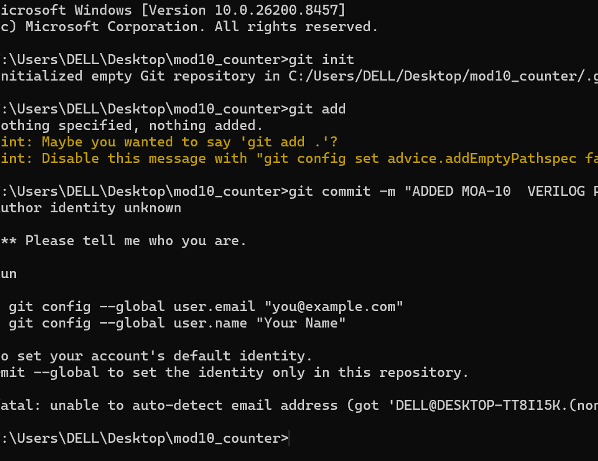
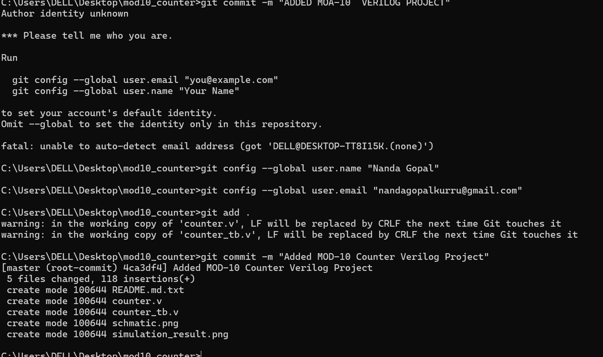

<!DOCTYPE html>
<!-- saved from url=(0058)https://chatgpt.com/c/6a059b4d-fb78-8321-b226-a2ee708b1104 -->
<html lang="en-US" data-build="prod-bad699db8681bffc345f69ee724325c685155c61" data-seq="6583224" data-oled="" data-contrast="default" dir="ltr" class="light" data-chat-theme="default" style="color-scheme: light; --cot-shimmer-duration: 1400ms;"><head><meta http-equiv="Content-Type" content="text/html; charset=UTF-8"><style>.ͼd {background-color: var(--gray-0); color: var(--gray-950);}
.ͼd .cm-content {caret-color: var(--gray-950);}
.ͼd .cm-cursor, .ͼd .cm-dropCursor {border-left-color: var(--gray-950);}
.ͼd.cm-focused .cm-selectionBackgroundm .cm-selectionBackground, .ͼd .cm-content ::selection {background-color: var(--blue-a50);}
.ͼd .cm-activeLine {background-color: var(--gray-50);}
.ͼd .cm-gutters {background-color: var(--gray-25); color: var(--gray-500);}
.ͼd .cm-activeLineGutter {background-color: var(--gray-50);}
.ͼe {color: var(--gray-550); font-style: italic;}
.ͼf {color: var(--blue-600);}
.ͼg {color: var(--pink-600);}
.ͼh {color: var(--yellow-600);}
.ͼi {color: var(--red-600);}
.ͼj {color: var(--orange-600);}
.ͼk {color: var(--green-600);}
.ͼl {color: var(--orange-600);}
.ͼm {color: var(--purple-600);}
.ͼn {color: var(--yellow-600);}
.ͼo {color: var(--blue-600);}
.ͼp {color: var(--blue-600); text-decoration: underline;}
.ͼq {color: var(--red-600); text-decoration: underline;}
.ͼr .cm-lineNumbers .cm-gutterElement {padding-left: 8px;}
.ͼr .cm-cursor, .ͼr .cm-dropCursor {border-left-width: 2px;}
.ͼr .cm-matchingBracket {outline: 1px solid var(--blue-600); color: inherit;}
.ͼr .cm-nonmatchingBracket {outline: 1px solid var(--red-600); color: inherit;}
</style><meta name="viewport" content="width=device-width, initial-scale=1, viewport-fit=cover"><link rel="preload" as="image" href="https://lh3.googleusercontent.com/a/ACg8ocKK4AvOWCZT52h_oWP-Xw_TVTtN5BnHctm0Pg_Eg97zNv9kzg=s96-c" referrerpolicy="no-referrer"><meta name="text-scale" content="scale"><title>Push Project to GitHub</title><meta property="og:title" content="ChatGPT"><meta property="og:image" content="https://cdn.openai.com/chatgpt/share-og.png"><link rel="preconnect" href="https://ab.chatgpt.com/"><meta name="robots" content="index, follow"><meta name="apple-itunes-app" content="app-id=6448311069"><meta name="dd-trace-id" content="7678147630517006495"><meta name="dd-trace-time" content="1778762013749"><link rel="icon" href="https://chatgpt.com/favicon.ico" sizes="any"><link rel="icon" href="https://chatgpt.com/cdn/assets/favicon-eex17e9e.ico" sizes="48x48"><link rel="icon" href="https://chatgpt.com/cdn/assets/favicon-l4nq08hd.svg" type="image/svg+xml"><link rel="icon" href="https://chatgpt.com/cdn/assets/favicon-l4nq08hd.svg" type="image/svg+xml" media="(prefers-color-scheme: dark)"><link rel="icon" href="https://chatgpt.com/cdn/assets/favicon-48x48-glnpepm0.webp" type="image/png" sizes="48x48"><link rel="apple-touch-icon" sizes="180x180" href="https://chatgpt.com/cdn/assets/favicon-180x180-od45eci6.webp"><meta name="description" content="ChatGPT is your AI chatbot for everyday use. Chat with the most advanced AI to explore ideas, solve problems, and learn faster."><meta name="keyword" content="ai chat,ai,chap gpt,chat gbt,chat gpt 3,chat gpt login,chat gpt website,chat gpt,chat gtp,chat openai,chat,chatai,chatbot gpt,chatg,chatgpt login,chatgpt,gpt chat,open ai,openai chat,openai chatgpt,openai"><meta property="og:description" content="ChatGPT helps you get answers, find inspiration, and be more productive."><meta property="og:url" content="https://chatgpt.com/"><meta property="og:site_name" content="ChatGPT"><link rel="alternate" hreflang="am" href="https://chatgpt.com/c/6a059b4d-fb78-8321-b226-a2ee708b1104?locale=am"><link rel="alternate" hreflang="ar" href="https://chatgpt.com/c/6a059b4d-fb78-8321-b226-a2ee708b1104?locale=ar"><link rel="alternate" hreflang="bg-BG" href="https://chatgpt.com/c/6a059b4d-fb78-8321-b226-a2ee708b1104?locale=bg-BG"><link rel="alternate" hreflang="bn-BD" href="https://chatgpt.com/c/6a059b4d-fb78-8321-b226-a2ee708b1104?locale=bn-BD"><link rel="alternate" hreflang="bs-BA" href="https://chatgpt.com/c/6a059b4d-fb78-8321-b226-a2ee708b1104?locale=bs-BA"><link rel="alternate" hreflang="ca-ES" href="https://chatgpt.com/c/6a059b4d-fb78-8321-b226-a2ee708b1104?locale=ca-ES"><link rel="alternate" hreflang="cs-CZ" href="https://chatgpt.com/c/6a059b4d-fb78-8321-b226-a2ee708b1104?locale=cs-CZ"><link rel="alternate" hreflang="da-DK" href="https://chatgpt.com/c/6a059b4d-fb78-8321-b226-a2ee708b1104?locale=da-DK"><link rel="alternate" hreflang="de-DE" href="https://chatgpt.com/c/6a059b4d-fb78-8321-b226-a2ee708b1104?locale=de-DE"><link rel="alternate" hreflang="el-GR" href="https://chatgpt.com/c/6a059b4d-fb78-8321-b226-a2ee708b1104?locale=el-GR"><link rel="alternate" hreflang="en-US" href="https://chatgpt.com/c/6a059b4d-fb78-8321-b226-a2ee708b1104"><link rel="alternate" hreflang="es-ES" href="https://chatgpt.com/c/6a059b4d-fb78-8321-b226-a2ee708b1104?locale=es-ES"><link rel="alternate" hreflang="es-419" href="https://chatgpt.com/c/6a059b4d-fb78-8321-b226-a2ee708b1104?locale=es-419"><link rel="alternate" hreflang="et-EE" href="https://chatgpt.com/c/6a059b4d-fb78-8321-b226-a2ee708b1104?locale=et-EE"><link rel="alternate" hreflang="fa" href="https://chatgpt.com/c/6a059b4d-fb78-8321-b226-a2ee708b1104?locale=fa"><link rel="alternate" hreflang="fi-FI" href="https://chatgpt.com/c/6a059b4d-fb78-8321-b226-a2ee708b1104?locale=fi-FI"><link rel="alternate" hreflang="fr-FR" href="https://chatgpt.com/c/6a059b4d-fb78-8321-b226-a2ee708b1104?locale=fr-FR"><link rel="alternate" hreflang="fr-CA" href="https://chatgpt.com/c/6a059b4d-fb78-8321-b226-a2ee708b1104?locale=fr-CA"><link rel="alternate" hreflang="gu-IN" href="https://chatgpt.com/c/6a059b4d-fb78-8321-b226-a2ee708b1104?locale=gu-IN"><link rel="alternate" hreflang="hi-IN" href="https://chatgpt.com/c/6a059b4d-fb78-8321-b226-a2ee708b1104?locale=hi-IN"><link rel="alternate" hreflang="hr-HR" href="https://chatgpt.com/c/6a059b4d-fb78-8321-b226-a2ee708b1104?locale=hr-HR"><link rel="alternate" hreflang="hu-HU" href="https://chatgpt.com/c/6a059b4d-fb78-8321-b226-a2ee708b1104?locale=hu-HU"><link rel="alternate" hreflang="hy-AM" href="https://chatgpt.com/c/6a059b4d-fb78-8321-b226-a2ee708b1104?locale=hy-AM"><link rel="alternate" hreflang="id-ID" href="https://chatgpt.com/c/6a059b4d-fb78-8321-b226-a2ee708b1104?locale=id-ID"><link rel="alternate" hreflang="is-IS" href="https://chatgpt.com/c/6a059b4d-fb78-8321-b226-a2ee708b1104?locale=is-IS"><link rel="alternate" hreflang="it-IT" href="https://chatgpt.com/c/6a059b4d-fb78-8321-b226-a2ee708b1104?locale=it-IT"><link rel="alternate" hreflang="ja-JP" href="https://chatgpt.com/c/6a059b4d-fb78-8321-b226-a2ee708b1104?locale=ja-JP"><link rel="alternate" hreflang="ka-GE" href="https://chatgpt.com/c/6a059b4d-fb78-8321-b226-a2ee708b1104?locale=ka-GE"><link rel="alternate" hreflang="kk" href="https://chatgpt.com/c/6a059b4d-fb78-8321-b226-a2ee708b1104?locale=kk"><link rel="alternate" hreflang="kn-IN" href="https://chatgpt.com/c/6a059b4d-fb78-8321-b226-a2ee708b1104?locale=kn-IN"><link rel="alternate" hreflang="ko-KR" href="https://chatgpt.com/c/6a059b4d-fb78-8321-b226-a2ee708b1104?locale=ko-KR"><link rel="alternate" hreflang="lt" href="https://chatgpt.com/c/6a059b4d-fb78-8321-b226-a2ee708b1104?locale=lt"><link rel="alternate" hreflang="lv-LV" href="https://chatgpt.com/c/6a059b4d-fb78-8321-b226-a2ee708b1104?locale=lv-LV"><link rel="alternate" hreflang="mk-MK" href="https://chatgpt.com/c/6a059b4d-fb78-8321-b226-a2ee708b1104?locale=mk-MK"><link rel="alternate" hreflang="ml" href="https://chatgpt.com/c/6a059b4d-fb78-8321-b226-a2ee708b1104?locale=ml"><link rel="alternate" hreflang="mn" href="https://chatgpt.com/c/6a059b4d-fb78-8321-b226-a2ee708b1104?locale=mn"><link rel="alternate" hreflang="mr-IN" href="https://chatgpt.com/c/6a059b4d-fb78-8321-b226-a2ee708b1104?locale=mr-IN"><link rel="alternate" hreflang="ms-MY" href="https://chatgpt.com/c/6a059b4d-fb78-8321-b226-a2ee708b1104?locale=ms-MY"><link rel="alternate" hreflang="my-MM" href="https://chatgpt.com/c/6a059b4d-fb78-8321-b226-a2ee708b1104?locale=my-MM"><link rel="alternate" hreflang="nb-NO" href="https://chatgpt.com/c/6a059b4d-fb78-8321-b226-a2ee708b1104?locale=nb-NO"><link rel="alternate" hreflang="nl-NL" href="https://chatgpt.com/c/6a059b4d-fb78-8321-b226-a2ee708b1104?locale=nl-NL"><link rel="alternate" hreflang="pa" href="https://chatgpt.com/c/6a059b4d-fb78-8321-b226-a2ee708b1104?locale=pa"><link rel="alternate" hreflang="pl-PL" href="https://chatgpt.com/c/6a059b4d-fb78-8321-b226-a2ee708b1104?locale=pl-PL"><link rel="alternate" hreflang="pt-BR" href="https://chatgpt.com/c/6a059b4d-fb78-8321-b226-a2ee708b1104?locale=pt-BR"><link rel="alternate" hreflang="pt-PT" href="https://chatgpt.com/c/6a059b4d-fb78-8321-b226-a2ee708b1104?locale=pt-PT"><link rel="alternate" hreflang="ro-RO" href="https://chatgpt.com/c/6a059b4d-fb78-8321-b226-a2ee708b1104?locale=ro-RO"><link rel="alternate" hreflang="ru-RU" href="https://chatgpt.com/c/6a059b4d-fb78-8321-b226-a2ee708b1104?locale=ru-RU"><link rel="alternate" hreflang="sk-SK" href="https://chatgpt.com/c/6a059b4d-fb78-8321-b226-a2ee708b1104?locale=sk-SK"><link rel="alternate" hreflang="sl-SI" href="https://chatgpt.com/c/6a059b4d-fb78-8321-b226-a2ee708b1104?locale=sl-SI"><link rel="alternate" hreflang="so-SO" href="https://chatgpt.com/c/6a059b4d-fb78-8321-b226-a2ee708b1104?locale=so-SO"><link rel="alternate" hreflang="sq-AL" href="https://chatgpt.com/c/6a059b4d-fb78-8321-b226-a2ee708b1104?locale=sq-AL"><link rel="alternate" hreflang="sr-RS" href="https://chatgpt.com/c/6a059b4d-fb78-8321-b226-a2ee708b1104?locale=sr-RS"><link rel="alternate" hreflang="sv-SE" href="https://chatgpt.com/c/6a059b4d-fb78-8321-b226-a2ee708b1104?locale=sv-SE"><link rel="alternate" hreflang="sw-TZ" href="https://chatgpt.com/c/6a059b4d-fb78-8321-b226-a2ee708b1104?locale=sw-TZ"><link rel="alternate" hreflang="ta-IN" href="https://chatgpt.com/c/6a059b4d-fb78-8321-b226-a2ee708b1104?locale=ta-IN"><link rel="alternate" hreflang="te-IN" href="https://chatgpt.com/c/6a059b4d-fb78-8321-b226-a2ee708b1104?locale=te-IN"><link rel="alternate" hreflang="th-TH" href="https://chatgpt.com/c/6a059b4d-fb78-8321-b226-a2ee708b1104?locale=th-TH"><link rel="alternate" hreflang="tl" href="https://chatgpt.com/c/6a059b4d-fb78-8321-b226-a2ee708b1104?locale=tl"><link rel="alternate" hreflang="tr-TR" href="https://chatgpt.com/c/6a059b4d-fb78-8321-b226-a2ee708b1104?locale=tr-TR"><link rel="alternate" hreflang="uk-UA" href="https://chatgpt.com/c/6a059b4d-fb78-8321-b226-a2ee708b1104?locale=uk-UA"><link rel="alternate" hreflang="ur" href="https://chatgpt.com/c/6a059b4d-fb78-8321-b226-a2ee708b1104?locale=ur"><link rel="alternate" hreflang="vi-VN" href="https://chatgpt.com/c/6a059b4d-fb78-8321-b226-a2ee708b1104?locale=vi-VN"><link rel="alternate" hreflang="zh-CN" href="https://chatgpt.com/c/6a059b4d-fb78-8321-b226-a2ee708b1104?locale=zh-CN"><link rel="alternate" hreflang="zh-TW" href="https://chatgpt.com/c/6a059b4d-fb78-8321-b226-a2ee708b1104?locale=zh-TW"><link rel="alternate" hreflang="zh-HK" href="https://chatgpt.com/c/6a059b4d-fb78-8321-b226-a2ee708b1104?locale=zh-HK"><link rel="alternate" hreflang="x-default" href="https://chatgpt.com/c/6a059b4d-fb78-8321-b226-a2ee708b1104"><link rel="canonical" href="https://chatgpt.com/c/6a059b4d-fb78-8321-b226-a2ee708b1104"><link rel="modulepreload" href="https://chatgpt.com/cdn/assets/manifest-0af48d61.js"><link rel="modulepreload" href="https://chatgpt.com/cdn/assets/entry.client-h7rfv51h.js"><link rel="modulepreload" href="https://chatgpt.com/cdn/assets/2340486e-jkew7l4sun7qs3pb.js"><link rel="modulepreload" href="https://chatgpt.com/cdn/assets/4813494d-c2upjpflmbjy6krz.js"><link rel="modulepreload" href="https://chatgpt.com/cdn/assets/f025431a-kkjj5h0gm4tp5bd1.js"><link rel="modulepreload" href="https://chatgpt.com/cdn/assets/root-i2vw0o5r.js"><link rel="modulepreload" href="https://chatgpt.com/cdn/assets/_conversation-h7rgh4ni.js"><link rel="modulepreload" href="https://chatgpt.com/cdn/assets/8b34dbc2-iyzq2j7p4tnbzxh2.js"><link rel="modulepreload" href="https://chatgpt.com/cdn/assets/conversation-small-b4r35jeimqd1cdh4.js"><link rel="modulepreload" href="https://chatgpt.com/cdn/assets/82782bc9-jqukxxs44h7ynp9n.js"><link rel="modulepreload" href="https://chatgpt.com/cdn/assets/_conversation.c._conversationId-kaw91hn8.js"><style data-tailwind-layer-order="true" nonce="" type="text/css">@layer properties, theme, base, components, utilities;
</style><link rel="stylesheet" href="./README_files/root-mc43vh17.css"><link rel="stylesheet" href="./README_files/conversation-small-drncy8ze.css"><link rel="modulepreload" as="script" crossorigin="" href="https://chatgpt.com/cdn/assets/eec4c631-lbkd6i4yaaftqoqe.js"><link rel="modulepreload" as="script" crossorigin="" href="https://chatgpt.com/cdn/assets/5ab42519-jpkvppaja7wr9gvg.js"><link rel="modulepreload" as="script" crossorigin="" href="https://chatgpt.com/cdn/assets/be58453f-b75ezore0ruc92ew.js"><link rel="modulepreload" as="script" crossorigin="" href="https://chatgpt.com/cdn/assets/fd7f274b-bxjqyjw5toi2f9dg.js"><link rel="modulepreload" as="script" crossorigin="" href="https://chatgpt.com/cdn/assets/88605b43-l6yksqhekiqxfg5i.js"><link rel="modulepreload" as="script" crossorigin="" href="https://chatgpt.com/cdn/assets/e6911992-ctdlgwgbggm9cyq4.js"><link rel="modulepreload" as="script" crossorigin="" href="https://chatgpt.com/cdn/assets/30c1087f-jp7n15xmjojc4rj0.js"><link rel="stylesheet" crossorigin="" href="./README_files/root-mc43vh17(1).css"><link rel="modulepreload" as="script" crossorigin="" href="https://chatgpt.com/cdn/assets/38b1cb71-le2af4ovea22pb19.js"><link rel="modulepreload" as="script" crossorigin="" href="https://chatgpt.com/cdn/assets/98fbd5a1-i3iu08tagdjun2l5.js"><link rel="stylesheet" crossorigin="" href="./README_files/silk-hq-jrmbfqt7.css"><link rel="modulepreload" as="script" crossorigin="" href="https://chatgpt.com/cdn/assets/f4e264a1-hdff7lsgra409z1e.js"><link rel="modulepreload" as="script" crossorigin="" href="https://chatgpt.com/cdn/assets/ae144ef6-jdnoadst0wnp4e36.js"><link rel="modulepreload" as="script" crossorigin="" href="https://chatgpt.com/cdn/assets/a5a34a94-k74s3j6gjqm1n0j1.js"><link rel="stylesheet" crossorigin="" href="./README_files/conversation-small-drncy8ze(1).css"><link rel="modulepreload" as="script" crossorigin="" href="https://chatgpt.com/cdn/assets/ad0d1100-elj1p36qfdiic92e.js"><link rel="modulepreload" as="script" crossorigin="" href="https://chatgpt.com/cdn/assets/8d5bfd5c-mvxnk42p0xv16wim.js"><link rel="modulepreload" as="script" crossorigin="" href="https://chatgpt.com/cdn/assets/c3fa3d69-ksdeq4vgdswy1no0.js"><link rel="modulepreload" as="script" crossorigin="" href="https://chatgpt.com/cdn/assets/19cb8032-d29zdr7cjerq84a4.js"><link rel="modulepreload" as="script" crossorigin="" href="https://chatgpt.com/cdn/assets/45a9607d-hn931tpvfjhii3hb.js"><link rel="modulepreload" as="script" crossorigin="" href="https://chatgpt.com/cdn/assets/41a2fdf3-olevrwoo0rmhqq0w.js"><link rel="modulepreload" as="script" crossorigin="" href="https://chatgpt.com/cdn/assets/85f3cacd-d1ch2hr1o9dbf7tm.js"><link rel="modulepreload" as="script" crossorigin="" href="https://chatgpt.com/cdn/assets/a7c981c9-kcx8014qagv8gwce.js"><link rel="modulepreload" as="script" crossorigin="" href="https://chatgpt.com/cdn/assets/f30cfe7d-doa68h6e9aw54ola.js"><link rel="modulepreload" as="script" crossorigin="" href="https://chatgpt.com/cdn/assets/46a4eebd-lm881gaum8eagh3p.js"><link rel="modulepreload" as="script" crossorigin="" href="https://chatgpt.com/cdn/assets/82244417-gh7762k2x9zz9zzk.js"><link rel="modulepreload" as="script" crossorigin="" href="https://chatgpt.com/cdn/assets/5eec0dc4-dwbrmuher1g7c8wm.js"><link rel="modulepreload" as="script" crossorigin="" href="https://chatgpt.com/cdn/assets/ad08b33f-jbpg8i0barmu5cc8.js"><link rel="modulepreload" as="script" crossorigin="" href="https://chatgpt.com/cdn/assets/92185398-ev568zbhyibcbuc7.js"><link rel="modulepreload" as="script" crossorigin="" href="https://chatgpt.com/cdn/assets/41f1c77d-bm54cq2btsnne92w.js"><link rel="modulepreload" as="script" crossorigin="" href="https://chatgpt.com/cdn/assets/44fdb285-hogluu8h9hrzz1xn.js"><link rel="modulepreload" as="script" crossorigin="" href="https://chatgpt.com/cdn/assets/4c0f1f8e-j2x2vvcfg8p1n1rk.js"><link rel="modulepreload" as="script" crossorigin="" href="https://chatgpt.com/cdn/assets/325a70ff-fd7zxrllg4s3qjip.js"><link rel="modulepreload" as="script" crossorigin="" href="https://chatgpt.com/cdn/assets/540191af-ntxdlk9p181sl0lr.js"><link rel="modulepreload" as="script" crossorigin="" href="https://chatgpt.com/cdn/assets/64b889da-odc32kylswmagl65.js"><link rel="modulepreload" as="script" crossorigin="" href="https://chatgpt.com/cdn/assets/b9e74381-ikiq68eor49cdijj.js"><link rel="modulepreload" as="script" crossorigin="" href="https://chatgpt.com/cdn/assets/a35b0b5c-ihk5y3i317e74fim.js"><link rel="modulepreload" as="script" crossorigin="" href="https://chatgpt.com/cdn/assets/d93502a4-lntofdz0ear46rka.js"><link rel="modulepreload" as="script" crossorigin="" href="https://chatgpt.com/cdn/assets/e3127a4c-epwtupvcz959y5nk.js"><link rel="modulepreload" as="script" crossorigin="" href="https://chatgpt.com/cdn/assets/4dbef424-lndrlh9gwux7ndo6.js"><link rel="modulepreload" as="script" crossorigin="" href="https://chatgpt.com/cdn/assets/a366adf3-erturgk7apab90ww.js"><link rel="modulepreload" as="script" crossorigin="" href="https://chatgpt.com/cdn/assets/c19d65aa-ilt6lu03674q5z8q.js"><link rel="modulepreload" as="script" crossorigin="" href="https://chatgpt.com/cdn/assets/da6c1aaf-gx0pr255y9nsgq49.js"><link rel="modulepreload" as="script" crossorigin="" href="https://chatgpt.com/cdn/assets/8aa57a25-jr7odba6v6c2d4mq.js"><link rel="modulepreload" as="script" crossorigin="" href="https://chatgpt.com/cdn/assets/ffa880af-b5j0uy73tb5ozl8l.js"><link rel="modulepreload" as="script" crossorigin="" href="https://chatgpt.com/cdn/assets/baf95bf2-ef3inhb2mnwjqc7c.js"><link rel="modulepreload" as="script" crossorigin="" href="https://chatgpt.com/cdn/assets/dbe988d8-cvvmohhcxn2h57jf.js"><link rel="modulepreload" as="script" crossorigin="" href="https://chatgpt.com/cdn/assets/f40d6676-d2rngat42ca3pr54.js"><link rel="modulepreload" as="script" crossorigin="" href="https://chatgpt.com/cdn/assets/4d59f34c-nksji71jzyrtn13w.js"><link rel="modulepreload" as="script" crossorigin="" href="https://chatgpt.com/cdn/assets/dc4ecf2f-m59s0pz3o9kf9l7w.js"><link rel="modulepreload" as="script" crossorigin="" href="https://chatgpt.com/cdn/assets/8b7f0dc9-btoizmqbijo9l039.js"><link rel="modulepreload" as="script" crossorigin="" href="https://chatgpt.com/cdn/assets/79f982eb-iskic6vbpx3ylkts.js"><link rel="modulepreload" as="script" crossorigin="" href="https://chatgpt.com/cdn/assets/bd382fd5-f80joy0fced2o86h.js"><link rel="modulepreload" as="script" crossorigin="" href="https://chatgpt.com/cdn/assets/eb34548a-gxz909fh059fpga5.js"><link rel="modulepreload" as="script" crossorigin="" href="https://chatgpt.com/cdn/assets/5b203e1c-nwyvq4uochl7odzd.js"><link rel="modulepreload" as="script" crossorigin="" href="https://chatgpt.com/cdn/assets/f7e0bf69-nxldng3vtzdqet9n.js"><link rel="modulepreload" as="script" crossorigin="" href="https://chatgpt.com/cdn/assets/824d80d7-khd3es58sck849yj.js"><link rel="modulepreload" as="script" crossorigin="" href="https://chatgpt.com/cdn/assets/f254c486-f3nkih7bq6utcpr6.js"><link rel="modulepreload" as="script" crossorigin="" href="https://chatgpt.com/cdn/assets/1c86a5ac-cz6wanuh96h4r1s5.js"><link rel="modulepreload" as="script" crossorigin="" href="https://chatgpt.com/cdn/assets/7517017f-bygnkdlo4f7vtxi8.js"><link rel="modulepreload" as="script" crossorigin="" href="https://chatgpt.com/cdn/assets/8d846022-n0efxg1tbks6fsox.js"><link rel="modulepreload" as="script" crossorigin="" href="https://chatgpt.com/cdn/assets/84983163-hl19iioolc594gvt.js"><link rel="modulepreload" as="script" crossorigin="" href="https://chatgpt.com/cdn/assets/14a60637-emjceyrvjzuvynhs.js"><link rel="modulepreload" as="script" crossorigin="" href="https://chatgpt.com/cdn/assets/679fc303-fd4e938vzmag2t3r.js"><link rel="modulepreload" as="script" crossorigin="" href="https://chatgpt.com/cdn/assets/cd7c6193-dkxp2vy4bj569xv8.js"><link rel="modulepreload" as="script" crossorigin="" href="https://chatgpt.com/cdn/assets/08b6430b-gdyz78yzk5mipnn9.js"><link rel="modulepreload" as="script" crossorigin="" href="https://chatgpt.com/cdn/assets/2745b5be-o58vh795v30p1ml1.js"><link rel="modulepreload" as="script" crossorigin="" href="https://chatgpt.com/cdn/assets/54e99289-n0xgx682rby2hlex.js"><link rel="modulepreload" as="script" crossorigin="" href="https://chatgpt.com/cdn/assets/4143cd04-loajy90ab1rugvzg.js"><link rel="modulepreload" as="script" crossorigin="" href="https://chatgpt.com/cdn/assets/b4b33d24-bgbhtnvb551ulmrw.js"><link rel="modulepreload" as="script" crossorigin="" href="https://chatgpt.com/cdn/assets/31cec8d8-lcyuayu78kiqj1r2.js"><link rel="modulepreload" as="script" crossorigin="" href="https://chatgpt.com/cdn/assets/5be378a2-hlh5kfliat8yhs5n.js"><link rel="modulepreload" as="script" crossorigin="" href="https://chatgpt.com/cdn/assets/8a10ee4a-huehvgejqdwwmsd2.js"><link rel="modulepreload" as="script" crossorigin="" href="https://chatgpt.com/cdn/assets/8c0c4546-mfwn452s8yl1gzd7.js"><link rel="modulepreload" as="script" crossorigin="" href="https://chatgpt.com/cdn/assets/17eb3c01-5hey4xzer2xpv6yi.js"><link rel="modulepreload" as="script" crossorigin="" href="https://chatgpt.com/cdn/assets/c8f38d6c-bkmcx3m8sf0c8e21.js"><link rel="modulepreload" as="script" crossorigin="" href="https://chatgpt.com/cdn/assets/58ab20f4-npzcibxy1dbkaqnx.js"><link rel="modulepreload" as="script" crossorigin="" href="https://chatgpt.com/cdn/assets/2d4fbc67-f1yvp758jpef1gb1.js"><link rel="modulepreload" as="script" crossorigin="" href="https://chatgpt.com/cdn/assets/af004db9-dh9ribltiacj8oha.js"><link rel="modulepreload" as="script" crossorigin="" href="https://chatgpt.com/cdn/assets/c157dfba-g7g7pj42eplbomgs.js"><link rel="modulepreload" as="script" crossorigin="" href="https://chatgpt.com/cdn/assets/e04c699b-b0qvf0inwjcvfnxn.js"><link rel="modulepreload" as="script" crossorigin="" href="https://chatgpt.com/cdn/assets/3b8bd72c-fjc3vnoyqrm0y7v7.js"><link rel="modulepreload" as="script" crossorigin="" href="https://chatgpt.com/cdn/assets/81fe9c28-g1l4zsum6989dfxb.js"><link rel="modulepreload" as="script" crossorigin="" href="https://chatgpt.com/cdn/assets/6fd89734-ssrxyigzo88lwgve.js"><link rel="modulepreload" as="script" crossorigin="" href="https://chatgpt.com/cdn/assets/a89794b1-ldpck0zago3ee7if.js"><link rel="modulepreload" as="script" crossorigin="" href="https://chatgpt.com/cdn/assets/4740ae63-fqz696o94urjc3d6.js"><link rel="modulepreload" as="script" crossorigin="" href="https://chatgpt.com/cdn/assets/da39060d-oexs08sg7qsw0k77.js"><link rel="modulepreload" as="script" crossorigin="" href="https://chatgpt.com/cdn/assets/d258363e-o5z3k17x09yr6f4a.js"><link rel="modulepreload" as="script" crossorigin="" href="https://chatgpt.com/cdn/assets/a9c4a648-iwla1ntgwi2dp42f.js"><link rel="modulepreload" as="script" crossorigin="" href="https://chatgpt.com/cdn/assets/d768c11d-f5patspyys9gr7lk.js"><link rel="modulepreload" as="script" crossorigin="" href="https://chatgpt.com/cdn/assets/3a792387-ojbrbpu4is70byyv.js"><link rel="modulepreload" as="script" crossorigin="" href="https://chatgpt.com/cdn/assets/b8ba2ec7-mfv2n0k75abu6mrg.js"><link rel="modulepreload" as="script" crossorigin="" href="https://chatgpt.com/cdn/assets/411304d4-bms47ufy71qqvbv0.js"><link rel="modulepreload" as="script" crossorigin="" href="https://chatgpt.com/cdn/assets/c8d36e23-bek49l3vto7f98e1.js"><link rel="modulepreload" as="script" crossorigin="" href="https://chatgpt.com/cdn/assets/74006267-f0040y0pm1h32x35.js"><link rel="modulepreload" as="script" crossorigin="" href="https://chatgpt.com/cdn/assets/6fd89734-jhhln4u4ww1ok2fx.js"><link rel="modulepreload" as="script" crossorigin="" href="https://chatgpt.com/cdn/assets/eda93c10-j13ktw77cjdyhwq3.js"><link rel="modulepreload" as="script" crossorigin="" href="https://chatgpt.com/cdn/assets/e802fc66-mviz7h8h2n434kr7.js"><link rel="modulepreload" as="script" crossorigin="" href="https://chatgpt.com/cdn/assets/083e3de5-p3t4g1ph6b21ddzw.js"><link rel="modulepreload" as="script" crossorigin="" href="https://chatgpt.com/cdn/assets/eac2baa9-cfm6i0u6osdbvr0v.js"><link rel="modulepreload" as="script" crossorigin="" href="https://chatgpt.com/cdn/assets/f92d18c6-of7xg1yi6mkcg3vu.js"><link rel="modulepreload" as="script" crossorigin="" href="https://chatgpt.com/cdn/assets/d9c77c9b-lfhgwl3l2eha3dqf.js"><link rel="modulepreload" as="script" crossorigin="" href="https://chatgpt.com/cdn/assets/b288024a-em2qtk05m7w2ciev.js"><link rel="modulepreload" as="script" crossorigin="" href="https://chatgpt.com/cdn/assets/b353a040-mug0yey6rpztu555.js"><link rel="modulepreload" as="script" crossorigin="" href="https://chatgpt.com/cdn/assets/c60851bc-bx81tlzi5mndrqsp.js"><link rel="modulepreload" as="script" crossorigin="" href="https://chatgpt.com/cdn/assets/a7a48c58-odojh0dgvxh3ij4a.js"><link rel="modulepreload" as="script" crossorigin="" href="https://chatgpt.com/cdn/assets/0fa93720-f45y41dulfmqbe3j.js"><link rel="modulepreload" as="script" crossorigin="" href="https://chatgpt.com/cdn/assets/fe205b37-hjcf0jvmfs9m9nnn.js"><link rel="modulepreload" as="script" crossorigin="" href="https://chatgpt.com/cdn/assets/99d6a32a-g2oemcc4dh0uexat.js"><link rel="modulepreload" as="script" crossorigin="" href="https://chatgpt.com/cdn/assets/fe737581-lhjdmedwwwcuijq7.js"><link rel="modulepreload" as="script" crossorigin="" href="https://chatgpt.com/cdn/assets/f43ce1f0-f5r2gjvsrjpjv5rq.js"><link rel="modulepreload" as="script" crossorigin="" href="https://chatgpt.com/cdn/assets/3ff7962d-zbx8hkvo1h4mlgmq.js"><link rel="modulepreload" as="script" crossorigin="" href="https://chatgpt.com/cdn/assets/45f779e8-nrp9eju4vw54fknb.js"><link rel="modulepreload" as="script" crossorigin="" href="https://chatgpt.com/cdn/assets/f2c17971-gtmu7z064i02c3h3.js"><link rel="modulepreload" as="script" crossorigin="" href="https://chatgpt.com/cdn/assets/f5588252-evpv51925rjb220h.js"><link rel="modulepreload" as="script" crossorigin="" href="https://chatgpt.com/cdn/assets/1031152d-c6ex85tntfve86kp.js"><link rel="modulepreload" as="script" crossorigin="" href="https://chatgpt.com/cdn/assets/8d846022-37qccz77ik95io9u.js"><link rel="modulepreload" as="script" crossorigin="" href="https://chatgpt.com/cdn/assets/c09d86e5-rh262r5na5m3iejv.js"><link rel="modulepreload" as="script" crossorigin="" href="https://chatgpt.com/cdn/assets/6ffe46c3-l7wefs9d4pyzkaf4.js"><link rel="modulepreload" as="script" crossorigin="" href="https://chatgpt.com/cdn/assets/83a5e40a-bx34ljoeg9zhqkqu.js"><link rel="modulepreload" as="script" crossorigin="" href="https://chatgpt.com/cdn/assets/a848d420-nck8xx1p5xkwbqr7.js"><link rel="modulepreload" as="script" crossorigin="" href="https://chatgpt.com/cdn/assets/cb241c69-kln3s52470r7aayp.js"><link rel="modulepreload" as="script" crossorigin="" href="https://chatgpt.com/cdn/assets/cedbe818-o1tpwqpe7jc0ik0l.js"><link rel="modulepreload" as="script" crossorigin="" href="https://chatgpt.com/cdn/assets/65d684aa-b120f53dcalpw8vb.js"><link rel="modulepreload" as="script" crossorigin="" href="https://chatgpt.com/cdn/assets/b533a235-ilifpww4pto3acno.js"><link rel="modulepreload" as="script" crossorigin="" href="https://chatgpt.com/cdn/assets/22724723-jqzft13jn1yxrfs0.js"><link rel="modulepreload" as="script" crossorigin="" href="https://chatgpt.com/cdn/assets/3c9bf4d7-i9daciohychw2kmp.js"><link rel="modulepreload" as="script" crossorigin="" href="https://chatgpt.com/cdn/assets/821579c7-pbt7kjn5tjx2zelq.js"><link rel="modulepreload" as="script" crossorigin="" href="https://chatgpt.com/cdn/assets/5121d6b0-kl624k1a38kzxiiv.js"><link rel="modulepreload" as="script" crossorigin="" href="https://chatgpt.com/cdn/assets/14bc6aa2-chx5e32v17gjan5c.js"><link rel="modulepreload" as="script" crossorigin="" href="https://chatgpt.com/cdn/assets/2657e442-e3hg5uo0obt5m529.js"><link rel="modulepreload" as="script" crossorigin="" href="https://chatgpt.com/cdn/assets/ea892bb7-hlrivwk7356r34ch.js"><link rel="modulepreload" as="script" crossorigin="" href="https://chatgpt.com/cdn/assets/06c18e6f-b9vcf6vnz49b6x56.js"><link rel="modulepreload" as="script" crossorigin="" href="https://chatgpt.com/cdn/assets/ec01d0e1-h686xrygtrsq9kh9.js"><link rel="modulepreload" as="script" crossorigin="" href="https://chatgpt.com/cdn/assets/b8f3be97-c2e0ygj2gbyckpnu.js"><link rel="modulepreload" as="script" crossorigin="" href="https://chatgpt.com/cdn/assets/befdc688-g39lqr1sfafkxqc2.js"><link rel="modulepreload" as="script" crossorigin="" href="https://chatgpt.com/cdn/assets/829857ec-mgnbkz1jio3kcwzj.js"><link rel="modulepreload" as="script" crossorigin="" href="https://chatgpt.com/cdn/assets/8a394773-c18bjkutok863qpe.js"><link rel="modulepreload" as="script" crossorigin="" href="https://chatgpt.com/cdn/assets/ad936fcb-htd19pheyo2962dx.js"><link rel="modulepreload" as="script" crossorigin="" href="https://chatgpt.com/cdn/assets/8f71ba8b-mwpkijop0zsjzu4e.js"><link rel="modulepreload" as="script" crossorigin="" href="https://chatgpt.com/cdn/assets/a8d66c03-svsgigdxmde111xg.js"><link rel="modulepreload" as="script" crossorigin="" href="https://chatgpt.com/cdn/assets/c816d342-f4k3z3bpysplgwht.js"><link rel="modulepreload" as="script" crossorigin="" href="https://chatgpt.com/cdn/assets/9edc30a0-8z7s314wc4dfzct9.js"><link rel="modulepreload" as="script" crossorigin="" href="https://chatgpt.com/cdn/assets/b8bdca63-o9892905huyoama6.js"><link rel="modulepreload" as="script" crossorigin="" href="https://chatgpt.com/cdn/assets/fb49e377-jrx98mj2xixwybel.js"><link rel="modulepreload" as="script" crossorigin="" href="https://chatgpt.com/cdn/assets/a4d26868-kshqbgd55ihvmcuc.js"><link rel="modulepreload" as="script" crossorigin="" href="https://chatgpt.com/cdn/assets/880eb4dc-griddsjyuakig3sb.js"><link rel="modulepreload" as="script" crossorigin="" href="https://chatgpt.com/cdn/assets/bab22af5-nnytrw118yn36a94.js"><link rel="modulepreload" as="script" crossorigin="" href="https://chatgpt.com/cdn/assets/c7cf66a1-f8t8bod3f91vwrfc.js"><link rel="modulepreload" as="script" crossorigin="" href="https://chatgpt.com/cdn/assets/d700d19c-e8bb40r60dyf34c3.js"><link rel="modulepreload" as="script" crossorigin="" href="https://chatgpt.com/cdn/assets/46a63953-nc1ytgcrw95speen.js"><link rel="modulepreload" as="script" crossorigin="" href="https://chatgpt.com/cdn/assets/8f71eec4-jhnehvrq7mweqgkx.js"><link rel="modulepreload" as="script" crossorigin="" href="https://chatgpt.com/cdn/assets/cad56d82-niz8lpns6vn1ag0o.js"><link rel="modulepreload" as="script" crossorigin="" href="https://chatgpt.com/cdn/assets/931fef96-hmvk9876e5fxzu18.js"><link rel="modulepreload" as="script" crossorigin="" href="https://chatgpt.com/cdn/assets/c3423c08-ipfl9b2q36ghcqsl.js"><link rel="modulepreload" as="script" crossorigin="" href="https://chatgpt.com/cdn/assets/b3eff28a-n0lhf83jem35b8qh.js"><link rel="modulepreload" as="script" crossorigin="" href="https://chatgpt.com/cdn/assets/14c2529e-lf1e200z0yaagx9w.js"><link rel="modulepreload" as="script" crossorigin="" href="https://chatgpt.com/cdn/assets/a78f4c52-l6y7t1eq1ges81zf.js"><link rel="modulepreload" as="script" crossorigin="" href="https://chatgpt.com/cdn/assets/16d1c905-fkdciiognobkbtd7.js"><link rel="modulepreload" as="script" crossorigin="" href="https://chatgpt.com/cdn/assets/64696494-c220db3iq7mhlb25.js"><link rel="modulepreload" as="script" crossorigin="" href="https://chatgpt.com/cdn/assets/4b303e9e-f5sgqp9fgrzewhvy.js"><link rel="modulepreload" as="script" crossorigin="" href="https://chatgpt.com/cdn/assets/2a3cc45c-ofapu7br6b3vupv4.js"><link rel="modulepreload" as="script" crossorigin="" href="https://chatgpt.com/cdn/assets/fb7431ec-zl741l2ujqu07suu.js"><link rel="modulepreload" as="script" crossorigin="" href="https://chatgpt.com/cdn/assets/a4d26868-lgfokneb7iukwk33.js"><link rel="modulepreload" as="script" crossorigin="" href="https://chatgpt.com/cdn/assets/8f6eb5a0-hxjro68r6wlotvz5.js"><link rel="modulepreload" as="script" crossorigin="" href="https://chatgpt.com/cdn/assets/47698774-ko7m1u1d8r869a6k.js"><link rel="modulepreload" as="script" crossorigin="" href="https://chatgpt.com/cdn/assets/c8503b70-m80y0qxroxvynqew.js"><link rel="modulepreload" as="script" crossorigin="" href="https://chatgpt.com/cdn/assets/3c7d985e-lxxc1wtbueg1jou5.js"><link rel="modulepreload" as="script" crossorigin="" href="https://chatgpt.com/cdn/assets/fc6d0fde-ejop24uwahpfov9h.js"><link rel="modulepreload" as="script" crossorigin="" href="https://chatgpt.com/cdn/assets/89e995c1-dbmoy7iba9wuw6rq.js"><link rel="modulepreload" as="script" crossorigin="" href="https://chatgpt.com/cdn/assets/729d2dcf-dtytnyo30tz1mw0m.js"><link rel="modulepreload" as="script" crossorigin="" href="https://chatgpt.com/cdn/assets/e802fc66-luhn182s9r5px5y6.js"><link rel="modulepreload" as="script" crossorigin="" href="https://chatgpt.com/cdn/assets/554f5eda-elcme47ini2rcu55.js"><link rel="modulepreload" as="script" crossorigin="" href="https://chatgpt.com/cdn/assets/1782d1bb-egi65ivt50489670.js"><link rel="modulepreload" as="script" crossorigin="" href="https://chatgpt.com/cdn/assets/a30fecd5-dsknbct885rmkm57.js"><link rel="modulepreload" as="script" crossorigin="" href="https://chatgpt.com/cdn/assets/7bdf29da-brwzioetfoafqa58.js"><link rel="modulepreload" as="script" crossorigin="" href="https://chatgpt.com/cdn/assets/97399d13-e836z1s184audf8d.js"><link rel="modulepreload" as="script" crossorigin="" href="https://chatgpt.com/cdn/assets/8563df09-frmyauo9m21ag3xv.js"><link rel="modulepreload" as="script" crossorigin="" href="https://chatgpt.com/cdn/assets/25de328f-fduhyv78il0hg1iv.js"><link rel="modulepreload" as="script" crossorigin="" href="https://chatgpt.com/cdn/assets/7bce51e5-b6k5t981x0zqdlf7.js"><link rel="modulepreload" as="script" crossorigin="" href="https://chatgpt.com/cdn/assets/a4dc414b-bklajkl0ulpq5vid.js"><link rel="modulepreload" as="script" crossorigin="" href="https://chatgpt.com/cdn/assets/daf1b740-bzaahd5tzvivmo3s.js"><link rel="modulepreload" as="script" crossorigin="" href="https://chatgpt.com/cdn/assets/478d0f41-bp5ufmpfevtbxuqf.js"><link rel="modulepreload" as="script" crossorigin="" href="https://chatgpt.com/cdn/assets/f5472ced-jcr7egdzumc02aju.js"><link rel="modulepreload" as="script" crossorigin="" href="https://chatgpt.com/cdn/assets/af7de5ed-mddv79tlfjf91iyh.js"><link rel="modulepreload" as="script" crossorigin="" href="https://chatgpt.com/cdn/assets/cf64444f-l0pi3fkhixxs31wp.js"><link rel="modulepreload" as="script" crossorigin="" href="https://chatgpt.com/cdn/assets/b4c3a217-gas2l13kmi1o2xsi.js"><link rel="modulepreload" as="script" crossorigin="" href="https://chatgpt.com/cdn/assets/f64e72da-j8lcq3lmro67jvmr.js"><link rel="modulepreload" as="script" crossorigin="" href="https://chatgpt.com/cdn/assets/0edd7e03-k2kcselwrbwcsy70.js"><link rel="modulepreload" as="script" crossorigin="" href="https://chatgpt.com/cdn/assets/c0e725d7-ewkthy1d70f7s1qy.js"><link rel="modulepreload" as="script" crossorigin="" href="https://chatgpt.com/cdn/assets/4851d730-k1zcccr3rm35tnu7.js"><link rel="modulepreload" as="script" crossorigin="" href="https://chatgpt.com/cdn/assets/36f1c3de-hsan18aapl16sba7.js"><link rel="modulepreload" as="script" crossorigin="" href="https://chatgpt.com/cdn/assets/a7a937ee-j8x3cd3kcppwbget.js"><link rel="modulepreload" as="script" crossorigin="" href="https://chatgpt.com/cdn/assets/356eccf2-pp86kjoan8v6ptfm.js"><link rel="modulepreload" as="script" crossorigin="" href="https://chatgpt.com/cdn/assets/5f98de63-f2v9kjtb5o4f10dc.js"><link rel="modulepreload" as="script" crossorigin="" href="https://chatgpt.com/cdn/assets/291d4aa8-d5ylkkidsv3fyz1j.js"><link rel="modulepreload" as="script" crossorigin="" href="https://chatgpt.com/cdn/assets/61aaacec-mxb3929979kf2z3s.js"><link rel="modulepreload" as="script" crossorigin="" href="https://chatgpt.com/cdn/assets/c4ec2cfc-d89e62rw4vm9rue1.js"><link rel="modulepreload" as="script" crossorigin="" href="https://chatgpt.com/cdn/assets/5ced9fb2-n7fsy7mpcte70fqh.js"><link rel="modulepreload" as="script" crossorigin="" href="https://chatgpt.com/cdn/assets/5ea389ac-mly7issobgw9iuw6.js"><link rel="modulepreload" as="script" crossorigin="" href="https://chatgpt.com/cdn/assets/feff6cd4-hwbxj1aaxx3o8z2e.js"><link rel="modulepreload" as="script" crossorigin="" href="https://chatgpt.com/cdn/assets/c8f493c8-ea16sckd2vs3rppa.js"><link rel="modulepreload" as="script" crossorigin="" href="https://chatgpt.com/cdn/assets/5122872a-i7bkmszk16ra05m0.js"><link rel="modulepreload" as="script" crossorigin="" href="https://chatgpt.com/cdn/assets/92578001-jy0ryoony434enqc.js"><link rel="modulepreload" as="script" crossorigin="" href="https://chatgpt.com/cdn/assets/56f612ac-h1fhm1rexxjnusyj.js"><link rel="modulepreload" as="script" crossorigin="" href="https://chatgpt.com/cdn/assets/43756c65-olww83wurhcc9uwr.js"><link rel="modulepreload" as="script" crossorigin="" href="https://chatgpt.com/cdn/assets/e3552ca3-lp8juhu4551edkjp.js"><link rel="modulepreload" as="script" crossorigin="" href="https://chatgpt.com/cdn/assets/bb8af654-h73dibwbh2iy1vai.js"><link rel="modulepreload" as="script" crossorigin="" href="https://chatgpt.com/cdn/assets/83e88bf5-dycbqsp8hnhkupq5.js"><link rel="modulepreload" as="script" crossorigin="" href="https://chatgpt.com/cdn/assets/85f300f1-lbj1x5a36jjjp2tf.js"><link rel="modulepreload" as="script" crossorigin="" href="https://chatgpt.com/cdn/assets/78ef3b98-pahk8nvw5rjw8cvc.js"><link rel="stylesheet" crossorigin="" href="./README_files/payment-cards-skeleton-dbv3f307.css"><link rel="modulepreload" as="script" crossorigin="" href="https://chatgpt.com/cdn/assets/b7bb170e-4niupz67ved4yy1j.js"><link rel="modulepreload" as="script" crossorigin="" href="https://chatgpt.com/cdn/assets/e8eebcb1-bnjk89oxsnazsa8a.js"><link rel="modulepreload" as="script" crossorigin="" href="https://chatgpt.com/cdn/assets/d32f4860-b5a7yyxx9i3zwsse.js"><link rel="modulepreload" as="script" crossorigin="" href="https://chatgpt.com/cdn/assets/5240f773-evsyf24l8zzrn64a.js"><link rel="modulepreload" as="script" crossorigin="" href="https://chatgpt.com/cdn/assets/378f37b1-f967kuoun4bfcbh4.js"><link rel="modulepreload" as="script" crossorigin="" href="https://chatgpt.com/cdn/assets/0dfae8e8-itzqilasj7pv75rt.js"><link rel="modulepreload" as="script" crossorigin="" href="https://chatgpt.com/cdn/assets/d97ccc1a-nt8l9okewxbp2o7v.js"><link rel="modulepreload" as="script" crossorigin="" href="https://chatgpt.com/cdn/assets/bcae0416-kvzdi7h8psrmnt87.js"><link rel="modulepreload" as="script" crossorigin="" href="https://chatgpt.com/cdn/assets/239f44f1-on3v9xrgjlpl37z2.js"><link rel="modulepreload" as="script" crossorigin="" href="https://chatgpt.com/cdn/assets/bc8739a9-li4n1tnmqdqjpvxz.js"><link rel="modulepreload" as="script" crossorigin="" href="https://chatgpt.com/cdn/assets/05d28061-lbvb3na2zbchcsun.js"><link rel="modulepreload" as="script" crossorigin="" href="https://chatgpt.com/cdn/assets/2773dd5c-kavxakuc443ik8if.js"><link rel="modulepreload" as="script" crossorigin="" href="https://chatgpt.com/cdn/assets/49c3887d-g4t4e67syb0rme0u.js"><link rel="modulepreload" as="script" crossorigin="" href="https://chatgpt.com/cdn/assets/a9fa9fda-ctow12lmgqc78m33.js"><link rel="modulepreload" as="script" crossorigin="" href="https://chatgpt.com/cdn/assets/93bc5d02-hd4290kpad46iprf.js"><link rel="modulepreload" as="script" crossorigin="" href="https://chatgpt.com/cdn/assets/d2e07916-hdok9rcqc7sioy9w.js"><link rel="modulepreload" as="script" crossorigin="" href="https://chatgpt.com/cdn/assets/d78de925-k7ul40owj3w0xmlz.js"><link rel="stylesheet" crossorigin="" href="./README_files/ADAVisualizationComponent-m14wkthf.css"><link rel="modulepreload" as="script" crossorigin="" href="https://chatgpt.com/cdn/assets/96098dcc-gcqna7ijqtvahk6k.js"><link rel="modulepreload" as="script" crossorigin="" href="https://chatgpt.com/cdn/assets/f6a81ab7-lrgl77u9eue0kir6.js"><link rel="modulepreload" as="script" crossorigin="" href="https://chatgpt.com/cdn/assets/f8d34c7f-jcgxo936diewv84m.js"><link rel="modulepreload" as="script" crossorigin="" href="https://chatgpt.com/cdn/assets/0fbccedd-ln47o1no4azhsuts.js"><link rel="modulepreload" as="script" crossorigin="" href="https://chatgpt.com/cdn/assets/6cb4c679-jkbkailpye7nrpgt.js"><link rel="modulepreload" as="script" crossorigin="" href="https://chatgpt.com/cdn/assets/d2206e29-pcwq9x5v9actgdpi.js"><link rel="modulepreload" as="script" crossorigin="" href="https://chatgpt.com/cdn/assets/6a35ae8e-mpbgi4oyhrndiiaj.js"><link rel="modulepreload" as="script" crossorigin="" href="https://chatgpt.com/cdn/assets/150f7f4e-ehkw11s02t17egzz.js"><link rel="modulepreload" as="script" crossorigin="" href="https://chatgpt.com/cdn/assets/444ece60-i9pkbvwagr5uhttb.js"><link rel="modulepreload" as="script" crossorigin="" href="https://chatgpt.com/cdn/assets/18e7d84e-l2rowdoi8zpsibq9.js"><link rel="modulepreload" as="script" crossorigin="" href="https://chatgpt.com/cdn/assets/76b5a357-hihl1wfcv90ar23y.js"><link rel="modulepreload" as="script" crossorigin="" href="https://chatgpt.com/cdn/assets/91969468-gdsegjng7bgfsq17.js"><link rel="modulepreload" as="script" crossorigin="" href="https://chatgpt.com/cdn/assets/9e6b8179-cr831ekoxvw2fmaz.js"><link rel="modulepreload" as="script" crossorigin="" href="https://chatgpt.com/cdn/assets/c01cad0d-f2t34uqsjzusq2ef.js"><link rel="modulepreload" as="script" crossorigin="" href="https://chatgpt.com/cdn/assets/52047a56-h4fhxuh7ozey5ph2.js"><link rel="modulepreload" as="script" crossorigin="" href="https://chatgpt.com/cdn/assets/fd13898c-hgsgi7pcetf9ctmy.js"><link rel="modulepreload" as="script" crossorigin="" href="https://chatgpt.com/cdn/assets/ff057340-oxr214g66hs00g27.js"><link rel="modulepreload" as="script" crossorigin="" href="https://chatgpt.com/cdn/assets/ae2c873a-hmilw4m0jbuzoh4c.js"><link rel="modulepreload" as="script" crossorigin="" href="https://chatgpt.com/cdn/assets/c0abab23-jvl9dympl4j81ha1.js"><link rel="modulepreload" as="script" crossorigin="" href="https://chatgpt.com/cdn/assets/8baac9c1-bwyormzepe50sgcc.js"><link rel="stylesheet" crossorigin="" href="./README_files/code-block-dop2czwo.css"><link rel="modulepreload" as="script" crossorigin="" href="https://chatgpt.com/cdn/assets/7d7b57e4-yap0nz744wet7mx2.js"><link rel="modulepreload" as="script" crossorigin="" href="https://chatgpt.com/cdn/assets/bcae0416-gvl4fq8gro0z69si.js"><link rel="modulepreload" as="script" crossorigin="" href="https://chatgpt.com/cdn/assets/bcae0416-oyxwiylzjbsycls9.js"><link rel="modulepreload" as="script" crossorigin="" href="https://chatgpt.com/cdn/assets/6cb574fa-c1r9gufmju60ir14.js"><link rel="modulepreload" as="script" crossorigin="" href="https://chatgpt.com/cdn/assets/a4ef304b-hp5yd9t1w5x9vldc.js"><link rel="modulepreload" as="script" crossorigin="" href="https://chatgpt.com/cdn/assets/8ad92f11-dvfc9xwmukoutt8v.js"><link rel="stylesheet" crossorigin="" href="./README_files/code-block-viewer-bb2wmqiy.css"><link rel="modulepreload" as="script" crossorigin="" href="https://chatgpt.com/cdn/assets/a3812aa4-cv58cdqjxdgeip41.js"><link rel="modulepreload" as="script" crossorigin="" href="https://chatgpt.com/cdn/assets/ce635c4e-f6qmwv75van4wmkp.js"><link rel="modulepreload" as="script" crossorigin="" href="https://chatgpt.com/cdn/assets/ee5ab530-ogwj5xcertmkg12d.js"><link rel="modulepreload" as="script" crossorigin="" href="https://chatgpt.com/cdn/assets/5617653c-dil7do6srpppj7sc.js"><link rel="modulepreload" as="script" crossorigin="" href="https://chatgpt.com/cdn/assets/bbaf6cec-jsef8kuidq2txs68.js"><link rel="modulepreload" as="script" crossorigin="" href="https://chatgpt.com/cdn/assets/39532444-nm7ts56cx91y1f7s.js"><link rel="modulepreload" as="script" crossorigin="" href="https://chatgpt.com/cdn/assets/93027c7b-nha2vbwntdxjzxky.js"><link rel="stylesheet" crossorigin="" href="./README_files/cot-message-mbvpc7rn.css"><link rel="modulepreload" as="script" crossorigin="" href="https://chatgpt.com/cdn/assets/9c5a2fed-fwi4x4rx6x6histi.js"><link rel="modulepreload" as="script" crossorigin="" href="https://chatgpt.com/cdn/assets/1de975ca-l4xg3pp1qauvia10.js"><link rel="modulepreload" as="script" crossorigin="" href="https://chatgpt.com/cdn/assets/a05edf66-kkhk7gg5s520ozfp.js"><link rel="modulepreload" as="script" crossorigin="" href="https://chatgpt.com/cdn/assets/3f739852-najfsqzzojwr9l4t.js"><link rel="modulepreload" as="script" crossorigin="" href="https://chatgpt.com/cdn/assets/25e69e8b-kbjko1pwfwta6ewp.js"><link rel="modulepreload" as="script" crossorigin="" href="https://chatgpt.com/cdn/assets/23264968-lbnqs3zo5e4l49au.js"><link rel="modulepreload" as="script" crossorigin="" href="https://chatgpt.com/cdn/assets/d9bdd822-f28456xs85dnynhe.js"><link rel="modulepreload" as="script" crossorigin="" href="https://chatgpt.com/cdn/assets/e700964e-f06ar2411fdpligg.js"><link rel="modulepreload" as="script" crossorigin="" href="https://chatgpt.com/cdn/assets/986c36f9-cclgrldmye2cwozr.js"><link rel="modulepreload" as="script" crossorigin="" href="https://chatgpt.com/cdn/assets/19ad7347-amfh7s2rp04xarhi.js"><link rel="modulepreload" as="script" crossorigin="" href="https://chatgpt.com/cdn/assets/ba13b013-ixm491cabf0pnmvg.js"><link rel="modulepreload" as="script" crossorigin="" href="https://chatgpt.com/cdn/assets/c3cb2e3d-k4rmtoakl2yr5q0d.js"><link rel="modulepreload" as="script" crossorigin="" href="https://chatgpt.com/cdn/assets/53e54fd2-gfneriq25c1bodc6.js"><link rel="modulepreload" as="script" crossorigin="" href="https://chatgpt.com/cdn/assets/916289eb-eqf30csl2w2i6vq0.js"><link rel="modulepreload" as="script" crossorigin="" href="https://chatgpt.com/cdn/assets/686cb570-d8ob4qxxvqexgkhs.js"><link rel="modulepreload" as="script" crossorigin="" href="https://chatgpt.com/cdn/assets/75c75efe-n3u1qjtf5ybehx92.js"><link rel="modulepreload" as="script" crossorigin="" href="https://chatgpt.com/cdn/assets/db90fe48-66zs4pvr76f49cl3.js"><link rel="modulepreload" as="script" crossorigin="" href="https://chatgpt.com/cdn/assets/ae36c773-f5nv85id85ts6jnk.js"><link rel="modulepreload" as="script" crossorigin="" href="https://chatgpt.com/cdn/assets/639d2afb-hrvuuih3wagyor0b.js"><link rel="modulepreload" as="script" crossorigin="" href="https://chatgpt.com/cdn/assets/f12087fb-npat4strmn2lzo6o.js"><link rel="modulepreload" as="script" crossorigin="" href="https://chatgpt.com/cdn/assets/76b5a357-jmgy3gm85yukguzg.js"><link rel="modulepreload" as="script" crossorigin="" href="https://chatgpt.com/cdn/assets/66c6e910-p0h5gp8wy9ffblv7.js"><link rel="modulepreload" as="script" crossorigin="" href="https://chatgpt.com/cdn/assets/4c806318-d33zeb1ghezdyc9n.js"><link rel="stylesheet" crossorigin="" href="./README_files/ansi-1f6vhsjh.css"><link rel="modulepreload" as="script" crossorigin="" href="https://chatgpt.com/cdn/assets/6ec7331b-gyi1jivezjj2i54w.js"><link rel="modulepreload" as="script" crossorigin="" href="https://chatgpt.com/cdn/assets/1a5e078c-gafn265dt04nzuwv.js"><link rel="modulepreload" as="script" crossorigin="" href="https://chatgpt.com/cdn/assets/57f71cac-k0fuwfw0984blm22.js"><link rel="modulepreload" as="script" crossorigin="" href="https://chatgpt.com/cdn/assets/f5eaae0b-28a8n60a436atc7k.js"><link rel="modulepreload" as="script" crossorigin="" href="https://chatgpt.com/cdn/assets/92cd10e6-ntbpl3a78d4m5tpd.js"><link rel="modulepreload" as="script" crossorigin="" href="https://chatgpt.com/cdn/assets/32f10268-gtpdr64vpkw3ha6c.js"><link rel="modulepreload" as="script" crossorigin="" href="https://chatgpt.com/cdn/assets/7ec8c41d-gvz5w9auoizam0wl.js"><link rel="modulepreload" as="script" crossorigin="" href="https://chatgpt.com/cdn/assets/ce52ae67-noie0ute2bgcemu1.js"><link rel="modulepreload" as="script" crossorigin="" href="https://chatgpt.com/cdn/assets/5ab42519-bmndhcv9g9acyy5a.js"><link rel="modulepreload" as="script" crossorigin="" href="https://chatgpt.com/cdn/assets/8d846022-bmr29e4hpbcnpowf.js"><link rel="modulepreload" as="script" crossorigin="" href="https://chatgpt.com/cdn/assets/e87af100-sge7bmunpzt8aunl.js"><link rel="modulepreload" as="script" crossorigin="" href="https://chatgpt.com/cdn/assets/54d21dcb-hnqeym062j4xtpwr.js"><link rel="modulepreload" as="script" crossorigin="" href="https://chatgpt.com/cdn/assets/f4222f0c-k3dcgwdyvoe33q5d.js"><link rel="modulepreload" as="script" crossorigin="" href="https://chatgpt.com/cdn/assets/e1d1ae28-cp5c8c4dxn5vn1di.js"><link rel="modulepreload" as="script" crossorigin="" href="https://chatgpt.com/cdn/assets/aa6b223c-fl3vikh1beq7ghiy.js"><link rel="modulepreload" as="script" crossorigin="" href="https://chatgpt.com/cdn/assets/dccfc4ad-ffwd65zrtfxfmvd6.js"><link rel="modulepreload" as="script" crossorigin="" href="https://chatgpt.com/cdn/assets/5bcaa99f-nv90fcxakg4eo14d.js"><link rel="modulepreload" as="script" crossorigin="" href="https://chatgpt.com/cdn/assets/6b80a314-l0cvc67lbptj5vnx.js"><link rel="stylesheet" crossorigin="" href="./README_files/product-variants-ga945uk2.css"><link rel="modulepreload" as="script" crossorigin="" href="https://chatgpt.com/cdn/assets/0037858e-bhvziwkec8h41mjk.js"><link rel="modulepreload" as="script" crossorigin="" href="https://chatgpt.com/cdn/assets/a78c9467-ehhtpzpv6n3ueim0.js"><link rel="modulepreload" as="script" crossorigin="" href="https://chatgpt.com/cdn/assets/28938d3c-cbw55q310m4tvay3.js"><link rel="modulepreload" as="script" crossorigin="" href="https://chatgpt.com/cdn/assets/5983c1e5-iz8fwc86tvz42w1e.js"><link rel="modulepreload" as="script" crossorigin="" href="https://chatgpt.com/cdn/assets/c9d82553-j53qs6jmkixn5311.js"><link rel="modulepreload" as="script" crossorigin="" href="https://chatgpt.com/cdn/assets/fcf5f4da-gz1u3vrcqwf40n60.js"><link rel="modulepreload" as="script" crossorigin="" href="https://chatgpt.com/cdn/assets/24581cbb-ojvcj2s5jrn2e37k.js"><link rel="modulepreload" as="script" crossorigin="" href="https://chatgpt.com/cdn/assets/12fa2cb9-mle30dm6nrbsibqu.js"><link rel="modulepreload" as="script" crossorigin="" href="https://chatgpt.com/cdn/assets/daf50f1d-kx4gcteuhfbrfo84.js"><link rel="modulepreload" as="script" crossorigin="" href="https://chatgpt.com/cdn/assets/e2a9a3b9-cr86orksn9gg6b32.js"><link rel="modulepreload" as="script" crossorigin="" href="https://chatgpt.com/cdn/assets/e0691314-oup5say8wb28j8ag.js"><link rel="modulepreload" as="script" crossorigin="" href="https://chatgpt.com/cdn/assets/aedf56a4-s2hn6rb6jw7xy7fq.js"><link rel="modulepreload" as="script" crossorigin="" href="https://chatgpt.com/cdn/assets/62a765f0-emoovb0xr2vw7qhd.js"><link rel="modulepreload" as="script" crossorigin="" href="https://chatgpt.com/cdn/assets/2b85cfea-ct8gfjoj6hs240fm.js"><link rel="modulepreload" as="script" crossorigin="" href="https://chatgpt.com/cdn/assets/ac827dee-jwfoi10q5qy9asqp.js"><link rel="modulepreload" as="script" crossorigin="" href="https://chatgpt.com/cdn/assets/6afb0137-fwigdzeg6s3x9iqf.js"><link rel="modulepreload" as="script" crossorigin="" href="https://chatgpt.com/cdn/assets/2ac7f54f-h834m4tdfwe8fq8r.js"><link rel="modulepreload" as="script" crossorigin="" href="https://chatgpt.com/cdn/assets/f015346a-qjnn1sird1gfb53j.js"><link rel="modulepreload" as="script" crossorigin="" href="https://chatgpt.com/cdn/assets/017c9c5c-es6a8ikrmwvj1nzt.js"><link rel="modulepreload" as="script" crossorigin="" href="https://chatgpt.com/cdn/assets/a91a940c-dffinsq5gzrfoegf.js"><link rel="modulepreload" as="script" crossorigin="" href="https://chatgpt.com/cdn/assets/6cb574fa-f4b00sj607edibe2.js"><link rel="modulepreload" as="script" crossorigin="" href="https://chatgpt.com/cdn/assets/4b2c6e28-hpbvfj296fj36j3f.js"><link rel="modulepreload" as="script" crossorigin="" href="https://chatgpt.com/cdn/assets/44246d2c-clgl0oqfqe2vrmc7.js"><link rel="modulepreload" as="script" crossorigin="" href="https://chatgpt.com/cdn/assets/8d846022-jgizj8kveuasdroe.js"><link rel="modulepreload" as="script" crossorigin="" href="https://chatgpt.com/cdn/assets/31e01dd8-bbx7iayzlutb57tp.js"><link rel="modulepreload" as="script" crossorigin="" href="https://chatgpt.com/cdn/assets/bcae0416-grj780xxxcgc2kh3.js"><link rel="modulepreload" as="script" crossorigin="" href="https://chatgpt.com/cdn/assets/7099925c-l3i154lvd4qwehdb.js"><link rel="modulepreload" as="script" crossorigin="" href="https://chatgpt.com/cdn/assets/5e60ff5a-eo8ow4weq0v7slsh.js"><link rel="modulepreload" as="script" crossorigin="" href="https://chatgpt.com/cdn/assets/373ddd65-nyyhmkq3kuv8urju.js"><link rel="modulepreload" as="script" crossorigin="" href="https://chatgpt.com/cdn/assets/fc5e7148-2tuy9n54w2t840hz.js"><link rel="modulepreload" as="script" crossorigin="" href="https://chatgpt.com/cdn/assets/4813494d-fpd1ys6kjdtwcle5.js"><link rel="modulepreload" as="script" crossorigin="" href="https://chatgpt.com/cdn/assets/dceeb93b-ndlwpov7rtxcbpif.js"><link rel="modulepreload" as="script" crossorigin="" href="https://chatgpt.com/cdn/assets/42899431-eza51ap0an2o1jc2.js"><link rel="modulepreload" as="script" crossorigin="" href="https://chatgpt.com/cdn/assets/e5d54aa7-dpi3qaqf3rvwb1og.js"><link rel="modulepreload" as="script" crossorigin="" href="https://chatgpt.com/cdn/assets/1c4de3ec-gcf748escrsccjsd.js"><link rel="modulepreload" as="script" crossorigin="" href="https://chatgpt.com/cdn/assets/ab750810-lgm5fyqzdrmbksil.js"><link rel="modulepreload" as="script" crossorigin="" href="https://chatgpt.com/cdn/assets/296caa51-8ugi54zdojzfuqm1.js"><link rel="modulepreload" as="script" crossorigin="" href="https://chatgpt.com/cdn/assets/5212d06e-fgqp25wyhnd9z7r9.js"><link rel="stylesheet" crossorigin="" href="./README_files/writing-block-link-actions-k3qnrz57.css"><link rel="modulepreload" as="script" crossorigin="" href="https://chatgpt.com/cdn/assets/2081268c-n89nftp4f7wwk3ks.js"><link rel="modulepreload" as="script" crossorigin="" href="https://chatgpt.com/cdn/assets/c7e483a5-f7c72065szx0n7x3.js"><link rel="modulepreload" as="script" crossorigin="" href="https://chatgpt.com/cdn/assets/781797c9-hvqkwphr55cezr1d.js"><link rel="modulepreload" as="script" crossorigin="" href="https://chatgpt.com/cdn/assets/45d3a556-o5964mccad13gl6f.js"><link rel="stylesheet" crossorigin="" href="./README_files/writing-block-provider-fog82uyv.css"><link rel="modulepreload" as="script" crossorigin="" href="https://chatgpt.com/cdn/assets/e65185e9-blcagfgkuk0o2qei.js"><link rel="modulepreload" as="script" crossorigin="" href="https://chatgpt.com/cdn/assets/0a3e27b8-il41dvv4eitw060q.js"><link rel="modulepreload" as="script" crossorigin="" href="https://chatgpt.com/cdn/assets/b38665c9-ekvg3zuent8lkot1.js"><link rel="modulepreload" as="script" crossorigin="" href="https://chatgpt.com/cdn/assets/19334654-maity3im1fingxib.js"><link rel="modulepreload" as="script" crossorigin="" href="https://chatgpt.com/cdn/assets/23de51ef-fi27p8jzcak5i6lk.js"><link rel="modulepreload" as="script" crossorigin="" href="https://chatgpt.com/cdn/assets/3069874b-i0v5llm1wwbk3acl.js"><link rel="modulepreload" as="script" crossorigin="" href="https://chatgpt.com/cdn/assets/498cd593-jyhxec3cd29qn5ys.js"><link rel="modulepreload" as="script" crossorigin="" href="https://chatgpt.com/cdn/assets/b7675d69-my84ybvauf7k7alm.js"><link rel="stylesheet" crossorigin="" href="./README_files/table-components-ca43bz4f.css"><link rel="modulepreload" as="script" crossorigin="" href="https://chatgpt.com/cdn/assets/2210195a-ooj9gq9xnfbvjxzr.js"><link rel="modulepreload" as="script" crossorigin="" href="https://chatgpt.com/cdn/assets/ecab41d6-eh66sneijb78eftv.js"><link rel="modulepreload" as="script" crossorigin="" href="https://chatgpt.com/cdn/assets/81143ecf-gext3t29attwb3vi.js"><link rel="modulepreload" as="script" crossorigin="" href="https://chatgpt.com/cdn/assets/e1b7d567-m10tc5jykdrt3ry7.js"><link rel="modulepreload" as="script" crossorigin="" href="https://chatgpt.com/cdn/assets/dcadf3b0-r5z19jws9d6ks9dz.js"><link rel="modulepreload" as="script" crossorigin="" href="https://chatgpt.com/cdn/assets/58cf4120-lhfxgb66h1ml96j0.js"><link rel="modulepreload" as="script" crossorigin="" href="https://chatgpt.com/cdn/assets/2af37e0b-bnnk7pjzogpw23c6.js"><link rel="modulepreload" as="script" crossorigin="" href="https://chatgpt.com/cdn/assets/38e61b13-jqrs399o9nsxl8hu.js"><link rel="modulepreload" as="script" crossorigin="" href="https://chatgpt.com/cdn/assets/943d6b1c-gfz1qhrplzu6stem.js"><link rel="modulepreload" as="script" crossorigin="" href="https://chatgpt.com/cdn/assets/0a717d1e-hge25toygpqr1g40.js"><link rel="modulepreload" as="script" crossorigin="" href="https://chatgpt.com/cdn/assets/1361132d-ff8ssun52b9qxcpb.js"><link rel="modulepreload" as="script" crossorigin="" href="https://chatgpt.com/cdn/assets/e7a416e4-dz2pgignjnrq8zbp.js"><link rel="modulepreload" as="script" crossorigin="" href="https://chatgpt.com/cdn/assets/26b47209-dyq3chip59b1m0i8.js"><link rel="modulepreload" as="script" crossorigin="" href="https://chatgpt.com/cdn/assets/e8b55dd1-g4rgkq58otvnnwhl.js"><link rel="modulepreload" as="script" crossorigin="" href="https://chatgpt.com/cdn/assets/5f4d7fa0-mniv8kx6rx9n5x9c.js"><link rel="modulepreload" as="script" crossorigin="" href="https://chatgpt.com/cdn/assets/0f28d127-buvxjntxdljc0s2j.js"><link rel="modulepreload" as="script" crossorigin="" href="https://chatgpt.com/cdn/assets/dd81d43b-ezu81g1uqf24wfzk.js"><link rel="modulepreload" as="script" crossorigin="" href="https://chatgpt.com/cdn/assets/3625fe1a-ftnfksz9uuj2x22i.js"><link rel="modulepreload" as="script" crossorigin="" href="https://chatgpt.com/cdn/assets/82d09521-ix1vhhlixzj2jg7r.js"><link rel="modulepreload" as="script" crossorigin="" href="https://chatgpt.com/cdn/assets/aaa2d182-cl3v033jqsfyc86i.js"><link rel="modulepreload" as="script" crossorigin="" href="https://chatgpt.com/cdn/assets/1951ef38-ls3ly9nxgcqb4iut.js"><link rel="modulepreload" as="script" crossorigin="" href="https://chatgpt.com/cdn/assets/39d9c975-e09mf7s835ntf73e.js"><link rel="modulepreload" as="script" crossorigin="" href="https://chatgpt.com/cdn/assets/22bcb108-jxf61qrjr09pm9k3.js"><link rel="modulepreload" as="script" crossorigin="" href="https://chatgpt.com/cdn/assets/ba0ab623-jo4e4s3v60jp24oo.js"><link rel="modulepreload" as="script" crossorigin="" href="https://chatgpt.com/cdn/assets/5f339043-b9xsn3swoewgiklz.js"><link rel="modulepreload" as="script" crossorigin="" href="https://chatgpt.com/cdn/assets/9d85046f-ev1bm56buiju3y8b.js"><link rel="modulepreload" as="script" crossorigin="" href="https://chatgpt.com/cdn/assets/b107ee61-cqgzh0i9ubf2z9qa.js"><link rel="modulepreload" as="script" crossorigin="" href="https://chatgpt.com/cdn/assets/ed6eee73-mbdaptud698j8fx4.js"><link rel="modulepreload" as="script" crossorigin="" href="https://chatgpt.com/cdn/assets/78c2d596-hd4uiuqa5ncxmaee.js"><link rel="modulepreload" as="script" crossorigin="" href="https://chatgpt.com/cdn/assets/252f74d3-gcwzuu7cm7t7lear.js"><script type="text/javascript" src="./README_files/sdk.js.download" async="" defer=""></script><script type="text/javascript" src="./README_files/sdk(1).js.download" async="" defer=""></script><link rel="modulepreload" as="script" crossorigin="" href="https://chatgpt.com/cdn/assets/2e8ccd28-g41xcy0c061mlvhf.js"></head><body class=""><script>!function(){try{var d=document.documentElement,c=d.classList;c.remove('light','dark');var e=localStorage.getItem('theme');if('system'===e||(!e&&true)){var t='(prefers-color-scheme: dark)',m=window.matchMedia(t);if(m.media!==t||m.matches){d.style.colorScheme = 'dark';c.add('dark')}else{d.style.colorScheme = 'light';c.add('light')}}else if(e){c.add(e|| '')}if(e==='light'||e==='dark')d.style.colorScheme=e}catch(e){}}()</script><script nonce="">!function(){try{const t=localStorage.getItem("oai/apps/chatTheme/user-Zps6Zq3aLIxjQqNH5iZpfez6");document.documentElement.dataset.chatTheme="string"==typeof t?JSON.parse(t):void 0}catch(e){}}();</script><audio autoplay="" playsinline=""></audio><div class="fixed inset-x-0 top-0 z-50 mt-4 flex justify-center select-none not-has-focus-visible:sr-only"><a data-skip-to-content="" class="interactive-bg-secondary behavior-btn interactive-label-secondary rounded-2xl px-4 py-2 text-base print:hidden" href="https://chatgpt.com/c/6a059b4d-fb78-8321-b226-a2ee708b1104#main">Skip to content</a></div><span data-testid="blocking-initial-modals-done" class="hidden"></span><div><div class="flex h-svh w-screen flex-col"><div class="relative z-0 flex min-h-0 w-full flex-1"><div class="relative flex min-h-0 w-full flex-1"><div class="border-token-border-extra-light bg-token-main-surface-primary relative z-21 h-full shrink-0 overflow-hidden border-e max-md:hidden print:hidden stage-sidebar-pure-surface [--sidebar-surface-primary:var(--main-surface-primary)]" id="stage-slideover-sidebar" style="width: var(--sidebar-width);"><div class="relative flex h-full flex-col"><nav id="stage-sidebar-tiny-bar" aria-label="Sidebar" class="group/tiny-bar flex h-full w-(--sidebar-rail-width) cursor-e-resize flex-col items-start bg-transparent pb-1.5 motion-safe:transition-colors rtl:cursor-w-resize absolute inset-0 pointer-events-none opacity-0 motion-safe:ease-[steps(1,end)] motion-safe:transition-opacity motion-safe:duration-150" inert=""><div class="h-header-height flex items-center justify-center"><span class="" data-state="closed"><div class="relative flex"><button class="text-token-text-primary contrast-high:not-dark:keyboard-focused:focus-ring no-draggable hover:bg-token-surface-hover keyboard-focused:bg-token-surface-hover touch:h-10 touch:w-10 flex h-9 w-9 items-center justify-center rounded-lg outline-none disabled:opacity-50 mx-2 cursor-e-resize rtl:cursor-w-resize" aria-label="Open sidebar" aria-expanded="false" aria-controls="stage-slideover-sidebar"><svg xmlns="http://www.w3.org/2000/svg" width="20" height="20" aria-hidden="true" class="icon-lg -m-1 group-hover/tiny-bar:hidden group-focus-visible:hidden"><use href="/cdn/assets/sprites-core-805957d9.svg#55180d" fill="currentColor"></use></svg><svg xmlns="http://www.w3.org/2000/svg" width="20" height="20" aria-hidden="true" data-rtl-flip="" class="icon hidden group-hover/tiny-bar:block group-focus-visible:block"><use href="/cdn/assets/sprites-core-805957d9.svg#836f7a" fill="currentColor"></use></svg></button></div></span></div><div class="mt-(--sidebar-section-first-margin-top)"><div class="" data-state="closed"><a tabindex="0" data-fill="" class="group __menu-item hoverable gap-1.5" data-testid="create-new-chat-button" data-sidebar-item="true" href="https://chatgpt.com/" data-discover="true"><div class="flex items-center justify-center [opacity:var(--menu-item-icon-opacity,1)] icon"><svg xmlns="http://www.w3.org/2000/svg" width="20" height="20" aria-hidden="true" class="icon"><use href="/cdn/assets/sprites-core-805957d9.svg#3a5c87" fill="currentColor"></use></svg></div><span class="sr-only">New chat</span></a></div><div class="" data-state="closed"><button tabindex="0" data-fill="" class="group __menu-item hoverable gap-1.5 w-full" data-sidebar-item="true" type="button"><div class="flex items-center justify-center [opacity:var(--menu-item-icon-opacity,1)] icon"><svg xmlns="http://www.w3.org/2000/svg" width="20" height="20" aria-hidden="true" class="icon"><use href="/cdn/assets/sprites-core-805957d9.svg#ac6d36" fill="currentColor"></use></svg></div><span class="sr-only">Search chats</span></button></div><div class="" data-state="closed"><button tabindex="0" data-fill="" class="group __menu-item hoverable gap-1.5 w-full" data-sidebar-keep-open="true" type="button" id="radix-_r_b6_" aria-haspopup="menu" aria-expanded="false" data-state="closed" data-sidebar-item="true"><div class="flex items-center justify-center [opacity:var(--menu-item-icon-opacity,1)] icon"><svg xmlns="http://www.w3.org/2000/svg" width="20" height="20" aria-hidden="true" class="icon"><use href="/cdn/assets/sprites-core-805957d9.svg#003104" fill="currentColor"></use></svg></div><span class="sr-only">Recents</span></button></div></div><div class="pointer-events-none flex-grow"></div><div class="mb-1"><div class="" data-state="closed"><div tabindex="0" data-fill="" data-size="large" class="group __menu-item hoverable gap-2 ms-2 me-1.5 gap-2! pe-1.5 data-fill:max-w-full [&amp;&gt;div:first-child]:gap-2!" data-testid="accounts-profile-button" aria-label="Open profile menu" role="button" type="button" id="radix-_r_b9_" aria-haspopup="menu" aria-expanded="false" data-state="closed" data-sidebar-item="true"><div class="flex items-center justify-center [opacity:var(--menu-item-icon-opacity,1)] icon-lg"><div class="flex overflow-hidden rounded-full select-none bg-gray-500/30 h-6 w-6 shrink-0 bg-token-bg-tertiary"><div class="flex h-full w-full items-center justify-center bg-blue-300 text-white dark:bg-blue-500"><div class="text-xs">NK</div></div></div></div></div></div></div></nav><div class="opacity-100 motion-safe:transition-opacity motion-safe:duration-150 motion-safe:ease-linear h-full w-(--sidebar-width) overflow-x-clip overflow-y-auto text-clip whitespace-nowrap bg-token-main-surface-primary"><h2 class="select-none" style="position: absolute; border: 0px; width: 1px; height: 1px; padding: 0px; margin: -1px; overflow: hidden; clip: rect(0px, 0px, 0px, 0px); white-space: nowrap; overflow-wrap: normal;">Chat history</h2><div class="flex h-full w-(--sidebar-width) flex-col transition-opacity motion-safe:duration-500"><nav class="group/scrollport relative flex min-h-0 w-full flex-1 flex-col overflow-y-auto" aria-label="Chat history" data-scrolled-from-end=""><div class="sticky top-0 z-30 bg-(--sidebar-surface-primary)"><div class="touch:px-1.5 px-2"><div id="sidebar-header" class="h-header-height flex items-center justify-between"><a data-sidebar-item="true" aria-label="Home" class="text-token-text-primary contrast-high:not-dark:keyboard-focused:focus-ring no-draggable hover:bg-token-surface-hover keyboard-focused:bg-token-surface-hover touch:h-10 touch:w-10 flex h-9 w-9 items-center justify-center rounded-lg outline-none disabled:opacity-50" href="https://chatgpt.com/" data-discover="true"><svg xmlns="http://www.w3.org/2000/svg" width="20" height="20" aria-hidden="true" class="icon-lg"><use href="/cdn/assets/sprites-core-805957d9.svg#55180d" fill="currentColor"></use></svg></a><div class="flex items-center gap-0"><button class="text-token-text-tertiary contrast-high:not-dark:keyboard-focused:focus-ring no-draggable hover:bg-token-surface-hover keyboard-focused:bg-token-surface-hover touch:h-10 touch:w-10 flex h-9 w-9 items-center justify-center rounded-lg outline-none disabled:opacity-50 no-draggable cursor-w-resize rtl:cursor-e-resize" aria-expanded="true" aria-controls="stage-slideover-sidebar" aria-label="Close sidebar" data-testid="close-sidebar-button" data-state="closed"><svg xmlns="http://www.w3.org/2000/svg" width="20" height="20" aria-hidden="true" data-rtl-flip="" class="icon max-md:hidden"><use href="/cdn/assets/sprites-core-805957d9.svg#836f7a" fill="currentColor"></use></svg><svg xmlns="http://www.w3.org/2000/svg" width="20" height="20" aria-hidden="true" class="icon md:hidden"><use href="/cdn/assets/sprites-core-805957d9.svg#85f94b" fill="currentColor"></use></svg></button></div></div></div></div><div class="relative h-0"><div aria-hidden="true" data-edge="true" class="pointer-events-none h-px w-px absolute top-0" style=""></div><div aria-hidden="true" data-edge="true" class="pointer-events-none h-px w-px absolute top-0" style="display: none !important;"></div></div><div class="pt-(--sidebar-section-first-margin-top) last:mb-5 bg-token-main-surface-primary tall:sticky tall:top-header-height tall:z-20 not-tall:relative [--sticky-spacer:6px]"><ul class="m-0 list-none p-0"><li class="list-none"><a tabindex="0" data-fill="" data-revealed="" class="group __menu-item hoverable" data-testid="create-new-chat-button" data-sidebar-item="true" href="https://chatgpt.com/" data-discover="true"><div class="flex min-w-0 items-center gap-1.5"><div class="flex items-center justify-center [opacity:var(--menu-item-icon-opacity,1)] icon"><svg xmlns="http://www.w3.org/2000/svg" width="20" height="20" aria-hidden="true" class="icon"><use href="/cdn/assets/sprites-core-805957d9.svg#3a5c87" fill="currentColor"></use></svg></div><div class="flex min-w-0 grow items-center gap-2.5"><div class="truncate">New chat</div></div></div><div class="trailing highlight text-token-text-tertiary"><div class="box-trim-text-0.25 inline-flex whitespace-pre *:inline-flex *:font-sans *:not-last:after:px-0.5 *:not-last:after:content-[&#39;+&#39;] touch:hidden sr-only"><kbd aria-label="Control"><span class="min-w-[1em]">Ctrl</span></kbd><kbd aria-label="Shift"><span class="min-w-[1em]">Shift</span></kbd><kbd><span class="min-w-[1em]">O</span></kbd></div></div></a></li><li class="list-none"><button tabindex="0" data-fill="" data-revealed="" class="group __menu-item hoverable w-full" data-sidebar-item="true" type="button"><div class="flex min-w-0 items-center gap-1.5"><div class="flex items-center justify-center [opacity:var(--menu-item-icon-opacity,1)] icon"><svg xmlns="http://www.w3.org/2000/svg" width="20" height="20" aria-hidden="true" class="icon"><use href="/cdn/assets/sprites-core-805957d9.svg#ac6d36" fill="currentColor"></use></svg></div><div class="flex min-w-0 grow items-center gap-2.5"><div class="truncate">Search chats</div></div></div><div class="trailing highlight text-token-text-tertiary"><div class="box-trim-text-0.25 inline-flex whitespace-pre *:inline-flex *:font-sans *:not-last:after:px-0.5 *:not-last:after:content-[&#39;+&#39;] touch:hidden sr-only"><kbd aria-label="Control"><span class="min-w-[1em]">Ctrl</span></kbd><kbd><span class="min-w-[1em]">K</span></kbd></div></div></button></li></ul><div aria-hidden="true" class="pointer-events-none absolute start-0 end-0 -bottom-(--sticky-spacer) h-(--sticky-spacer) tall:[box-shadow:var(--sharp-edge-top-shadow-placeholder)] tall:group-data-scrolled-from-top/scrollport:[box-shadow:var(--sharp-edge-top-shadow)] bg-token-main-surface-primary opacity-0 will-change-[opacity] group-data-scrolled-from-top/scrollport:opacity-100"></div></div><button tabindex="0" data-fill="" class="group __menu-item hoverable gap-1.5 w-full" data-sidebar-item="true" type="button"><div class="flex items-center justify-center [opacity:var(--menu-item-icon-opacity,1)] icon"><svg xmlns="http://www.w3.org/2000/svg" width="20" height="20" aria-hidden="true" class="icon"><use href="/cdn/assets/sprites-core-805957d9.svg#608c49" fill="currentColor"></use></svg></div><div class="flex min-w-0 grow items-center gap-2.5"><div class="truncate">Projects</div></div></button><a tabindex="0" data-fill="" class="group __menu-item hoverable" data-sidebar-item="true" rel="noopener noreferrer" href="https://chatgpt.com/codex/cloud" target="_blank" data-discover="true"><div class="flex min-w-0 items-center gap-1.5"><div class="flex items-center justify-center [opacity:var(--menu-item-icon-opacity,1)] icon"><svg xmlns="http://www.w3.org/2000/svg" width="20" height="20" aria-hidden="true" class="icon"><use href="/cdn/assets/sprites-core-805957d9.svg#b995b8" fill="currentColor"></use></svg></div><div class="flex min-w-0 grow items-center gap-2.5"><div class="truncate">Codex</div></div></div><div class="trailing highlight text-token-text-tertiary"><svg xmlns="http://www.w3.org/2000/svg" width="16" height="16" aria-hidden="true" data-rtl-flip="" class="icon-sm"><use href="/cdn/assets/sprites-core-805957d9.svg#e51fba" fill="currentColor"></use></svg></div></a><div class="pb-[calc(var(--sidebar-section-margin-top)-var(--sidebar-section-first-margin-top))]"><div tabindex="0" class="group __menu-item hoverable gap-1.5" data-sidebar-item="true" type="button" id="radix-_r_bf_" aria-haspopup="menu" aria-expanded="false" data-state="closed"><div class="flex items-center justify-center [opacity:var(--menu-item-icon-opacity,1)] icon"><svg xmlns="http://www.w3.org/2000/svg" width="20" height="20" aria-hidden="true" class="icon"><use href="/cdn/assets/sprites-core-805957d9.svg#f6d0e2" fill="currentColor"></use></svg></div><div class="flex min-w-0 grow items-center gap-2.5"><div class="truncate">More</div></div></div></div><div class="group/sidebar-expando-section mb-[var(--sidebar-expanded-section-margin-bottom)]"><div class="flex items-center justify-between pe-1.5"><button aria-expanded="true" class="text-token-text-tertiary flex w-full items-center justify-start gap-0.5 px-4 py-1.5"><h2 class="__menu-label text-token-text-primary font-semibold" data-no-spacing="true">Recents</h2><svg xmlns="http://www.w3.org/2000/svg" width="16" height="16" aria-hidden="true" class="invisible h-3 w-3 shrink-0 group-hover/sidebar-expando-section:visible"><use href="/cdn/assets/sprites-core-805957d9.svg#ba3792" fill="currentColor"></use></svg></button></div><div id="history" class=""><ul class="m-0 list-none p-0"><li class="list-none"><a tabindex="0" data-active="" data-fill="" class="group __menu-item hoverable transition-opacity duration-150" draggable="true" aria-label="Push Project to GitHub" data-sidebar-item="true" href="https://chatgpt.com/c/6a059b4d-fb78-8321-b226-a2ee708b1104" data-discover="true"><div class="flex min-w-0 grow items-center gap-2.5"><div class="truncate"><span class="" dir="auto">Push Project to GitHub</span></div></div><div class="trailing highlight text-token-text-tertiary"><div class="flex items-center gap-2"><button tabindex="0" data-trailing-button="" class="__menu-item-trailing-btn" data-testid="history-item-0-options" data-conversation-options-trigger="6a059b4d-fb78-8321-b226-a2ee708b1104" aria-label="Open conversation options for Push Project to GitHub" type="button" id="radix-_r_bh_" aria-haspopup="menu" aria-expanded="false" data-state="closed"><div><svg xmlns="http://www.w3.org/2000/svg" width="20" height="20" aria-hidden="true" class="icon"><use href="/cdn/assets/sprites-core-805957d9.svg#f6d0e2" fill="currentColor"></use></svg></div></button></div></div></a></li><li class="list-none"><a tabindex="0" data-fill="" class="group __menu-item hoverable transition-opacity duration-150" draggable="true" aria-label="PM Internship Options" data-sidebar-item="true" href="https://chatgpt.com/c/6a048761-26ac-8322-81a3-a18cff102190" data-discover="true"><div class="flex min-w-0 grow items-center gap-2.5"><div class="truncate"><span class="" dir="auto">PM Internship Options</span></div></div><div class="trailing highlight text-token-text-tertiary"><div class="flex items-center gap-2"><button tabindex="0" data-trailing-button="" class="__menu-item-trailing-btn" data-testid="history-item-1-options" data-conversation-options-trigger="6a048761-26ac-8322-81a3-a18cff102190" aria-label="Open conversation options for PM Internship Options" type="button" id="radix-_r_bj_" aria-haspopup="menu" aria-expanded="false" data-state="closed"><div><svg xmlns="http://www.w3.org/2000/svg" width="20" height="20" aria-hidden="true" class="icon"><use href="/cdn/assets/sprites-core-805957d9.svg#f6d0e2" fill="currentColor"></use></svg></div></button></div></div></a></li><li class="list-none"><a tabindex="0" data-fill="" class="group __menu-item hoverable transition-opacity duration-150" draggable="true" aria-label="GitHub Portfolio for VLSI" data-sidebar-item="true" href="https://chatgpt.com/c/6a0332c9-4304-83a2-8d21-589dfc04ce45" data-discover="true"><div class="flex min-w-0 grow items-center gap-2.5"><div class="truncate"><span class="" dir="auto">GitHub Portfolio for VLSI</span></div></div><div class="trailing highlight text-token-text-tertiary"><div class="flex items-center gap-2"><button tabindex="0" data-trailing-button="" class="__menu-item-trailing-btn" data-testid="history-item-2-options" data-conversation-options-trigger="6a0332c9-4304-83a2-8d21-589dfc04ce45" aria-label="Open conversation options for GitHub Portfolio for VLSI" type="button" id="radix-_r_bl_" aria-haspopup="menu" aria-expanded="false" data-state="closed"><div><svg xmlns="http://www.w3.org/2000/svg" width="20" height="20" aria-hidden="true" class="icon"><use href="/cdn/assets/sprites-core-805957d9.svg#f6d0e2" fill="currentColor"></use></svg></div></button></div></div></a></li><li class="list-none"><a tabindex="0" data-fill="" class="group __menu-item hoverable transition-opacity duration-150" draggable="true" aria-label="Career advice for fresher" data-sidebar-item="true" href="https://chatgpt.com/c/6a03245b-7a70-8323-b6d6-cde701724f62" data-discover="true"><div class="flex min-w-0 grow items-center gap-2.5"><div class="truncate"><span class="" dir="auto">Career advice for fresher</span></div></div><div class="trailing highlight text-token-text-tertiary"><div class="flex items-center gap-2"><button tabindex="0" data-trailing-button="" class="__menu-item-trailing-btn" data-testid="history-item-3-options" data-conversation-options-trigger="6a03245b-7a70-8323-b6d6-cde701724f62" aria-label="Open conversation options for Career advice for fresher" type="button" id="radix-_r_bn_" aria-haspopup="menu" aria-expanded="false" data-state="closed"><div><svg xmlns="http://www.w3.org/2000/svg" width="20" height="20" aria-hidden="true" class="icon"><use href="/cdn/assets/sprites-core-805957d9.svg#f6d0e2" fill="currentColor"></use></svg></div></button></div></div></a></li><li class="list-none"><a tabindex="0" data-fill="" class="group __menu-item hoverable transition-opacity duration-150" draggable="true" aria-label="Chennai Mathematical Institute" data-sidebar-item="true" href="https://chatgpt.com/c/6a031cf0-b610-8324-ae0a-78e951971690" data-discover="true"><div class="flex min-w-0 grow items-center gap-2.5"><div class="truncate"><span class="" dir="auto">Chennai Mathematical Institute</span></div></div><div class="trailing highlight text-token-text-tertiary"><div class="flex items-center gap-2"><button tabindex="0" data-trailing-button="" class="__menu-item-trailing-btn" data-testid="history-item-4-options" data-conversation-options-trigger="6a031cf0-b610-8324-ae0a-78e951971690" aria-label="Open conversation options for Chennai Mathematical Institute" type="button" id="radix-_r_bp_" aria-haspopup="menu" aria-expanded="false" data-state="closed"><div><svg xmlns="http://www.w3.org/2000/svg" width="20" height="20" aria-hidden="true" class="icon"><use href="/cdn/assets/sprites-core-805957d9.svg#f6d0e2" fill="currentColor"></use></svg></div></button></div></div></a></li><li class="list-none"><a tabindex="0" data-fill="" class="group __menu-item hoverable transition-opacity duration-150" draggable="true" aria-label="Digital Verification Role Advice" data-sidebar-item="true" href="https://chatgpt.com/c/6a02f293-6850-83a7-917f-0553f2190d42" data-discover="true"><div class="flex min-w-0 grow items-center gap-2.5"><div class="truncate"><span class="" dir="auto">Digital Verification Role Advice</span></div></div><div class="trailing highlight text-token-text-tertiary"><div class="flex items-center gap-2"><button tabindex="0" data-trailing-button="" class="__menu-item-trailing-btn" data-testid="history-item-5-options" data-conversation-options-trigger="6a02f293-6850-83a7-917f-0553f2190d42" aria-label="Open conversation options for Digital Verification Role Advice" type="button" id="radix-_r_br_" aria-haspopup="menu" aria-expanded="false" data-state="closed"><div><svg xmlns="http://www.w3.org/2000/svg" width="20" height="20" aria-hidden="true" class="icon"><use href="/cdn/assets/sprites-core-805957d9.svg#f6d0e2" fill="currentColor"></use></svg></div></button></div></div></a></li><li class="list-none"><a tabindex="0" data-fill="" class="group __menu-item hoverable transition-opacity duration-150" draggable="true" aria-label="Role Assessment for DRAM Engineer" data-sidebar-item="true" href="https://chatgpt.com/c/6a02f7f0-4950-8323-858f-dc941cb6dab2" data-discover="true"><div class="flex min-w-0 grow items-center gap-2.5"><div class="truncate" title="Role Assessment for DRAM Engineer"><span class="" dir="auto">Role Assessment for DRAM Engineer</span></div></div><div class="trailing highlight text-token-text-tertiary"><div class="flex items-center gap-2"><button tabindex="0" data-trailing-button="" class="__menu-item-trailing-btn" data-testid="history-item-6-options" data-conversation-options-trigger="6a02f7f0-4950-8323-858f-dc941cb6dab2" aria-label="Open conversation options for Role Assessment for DRAM Engineer" type="button" id="radix-_r_bt_" aria-haspopup="menu" aria-expanded="false" data-state="closed"><div><svg xmlns="http://www.w3.org/2000/svg" width="20" height="20" aria-hidden="true" class="icon"><use href="/cdn/assets/sprites-core-805957d9.svg#f6d0e2" fill="currentColor"></use></svg></div></button></div></div></a></li><li class="list-none"><a tabindex="0" data-fill="" class="group __menu-item hoverable transition-opacity duration-150" draggable="true" aria-label="C-DAC Information Request" data-sidebar-item="true" href="https://chatgpt.com/c/6a0159af-ab98-8324-a835-85295271a670" data-discover="true"><div class="flex min-w-0 grow items-center gap-2.5"><div class="truncate"><span class="" dir="auto">C-DAC Information Request</span></div></div><div class="trailing highlight text-token-text-tertiary"><div class="flex items-center gap-2"><button tabindex="0" data-trailing-button="" class="__menu-item-trailing-btn" data-testid="history-item-7-options" data-conversation-options-trigger="6a0159af-ab98-8324-a835-85295271a670" aria-label="Open conversation options for C-DAC Information Request" type="button" id="radix-_r_bv_" aria-haspopup="menu" aria-expanded="false" data-state="closed"><div><svg xmlns="http://www.w3.org/2000/svg" width="20" height="20" aria-hidden="true" class="icon"><use href="/cdn/assets/sprites-core-805957d9.svg#f6d0e2" fill="currentColor"></use></svg></div></button></div></div></a></li><li class="list-none"><a tabindex="0" data-fill="" class="group __menu-item hoverable transition-opacity duration-150" draggable="true" aria-label="Counters in Verilog" data-sidebar-item="true" href="https://chatgpt.com/c/6a007c55-4ee8-8322-8742-830817d49dfe" data-discover="true"><div class="flex min-w-0 grow items-center gap-2.5"><div class="truncate"><span class="" dir="auto">Counters in Verilog</span></div></div><div class="trailing highlight text-token-text-tertiary"><div class="flex items-center gap-2"><button tabindex="0" data-trailing-button="" class="__menu-item-trailing-btn" data-testid="history-item-8-options" data-conversation-options-trigger="6a007c55-4ee8-8322-8742-830817d49dfe" aria-label="Open conversation options for Counters in Verilog" type="button" id="radix-_r_c1_" aria-haspopup="menu" aria-expanded="false" data-state="closed"><div><svg xmlns="http://www.w3.org/2000/svg" width="20" height="20" aria-hidden="true" class="icon"><use href="/cdn/assets/sprites-core-805957d9.svg#f6d0e2" fill="currentColor"></use></svg></div></button></div></div></a></li><li class="list-none"><a tabindex="0" data-fill="" class="group __menu-item hoverable transition-opacity duration-150" draggable="true" aria-label="Writing Verilog Code" data-sidebar-item="true" href="https://chatgpt.com/c/69fc4153-21b4-8322-9e51-f67b45df8ed5" data-discover="true"><div class="flex min-w-0 grow items-center gap-2.5"><div class="truncate"><span class="" dir="auto">Writing Verilog Code</span></div></div><div class="trailing highlight text-token-text-tertiary"><div class="flex items-center gap-2"><button tabindex="0" data-trailing-button="" class="__menu-item-trailing-btn" data-testid="history-item-9-options" data-conversation-options-trigger="69fc4153-21b4-8322-9e51-f67b45df8ed5" aria-label="Open conversation options for Writing Verilog Code" type="button" id="radix-_r_c3_" aria-haspopup="menu" aria-expanded="false" data-state="closed"><div><svg xmlns="http://www.w3.org/2000/svg" width="20" height="20" aria-hidden="true" class="icon"><use href="/cdn/assets/sprites-core-805957d9.svg#f6d0e2" fill="currentColor"></use></svg></div></button></div></div></a></li><li class="list-none"><a tabindex="0" data-fill="" class="group __menu-item hoverable transition-opacity duration-150" draggable="true" aria-label="Mentorship for VLSI Career" data-sidebar-item="true" href="https://chatgpt.com/c/69fb38df-a220-8320-aaf1-efc77a585a2f" data-discover="true"><div class="flex min-w-0 grow items-center gap-2.5"><div class="truncate"><span class="" dir="auto">Mentorship for VLSI Career</span></div></div><div class="trailing highlight text-token-text-tertiary"><div class="flex items-center gap-2"><button tabindex="0" data-trailing-button="" class="__menu-item-trailing-btn" data-testid="history-item-10-options" data-conversation-options-trigger="69fb38df-a220-8320-aaf1-efc77a585a2f" aria-label="Open conversation options for Mentorship for VLSI Career" type="button" id="radix-_r_c5_" aria-haspopup="menu" aria-expanded="false" data-state="closed"><div><svg xmlns="http://www.w3.org/2000/svg" width="20" height="20" aria-hidden="true" class="icon"><use href="/cdn/assets/sprites-core-805957d9.svg#f6d0e2" fill="currentColor"></use></svg></div></button></div></div></a></li><li class="list-none"><a tabindex="0" data-fill="" class="group __menu-item hoverable transition-opacity duration-150" draggable="true" aria-label="Job Explanation for ECE" data-sidebar-item="true" href="https://chatgpt.com/c/69f98e8c-cdfc-8322-abbd-3203c317d602" data-discover="true"><div class="flex min-w-0 grow items-center gap-2.5"><div class="truncate"><span class="" dir="auto">Job Explanation for ECE</span></div></div><div class="trailing highlight text-token-text-tertiary"><div class="flex items-center gap-2"><button tabindex="0" data-trailing-button="" class="__menu-item-trailing-btn" data-testid="history-item-11-options" data-conversation-options-trigger="69f98e8c-cdfc-8322-abbd-3203c317d602" aria-label="Open conversation options for Job Explanation for ECE" type="button" id="radix-_r_c7_" aria-haspopup="menu" aria-expanded="false" data-state="closed"><div><svg xmlns="http://www.w3.org/2000/svg" width="20" height="20" aria-hidden="true" class="icon"><use href="/cdn/assets/sprites-core-805957d9.svg#f6d0e2" fill="currentColor"></use></svg></div></button></div></div></a></li><li class="list-none"><a tabindex="0" data-fill="" class="group __menu-item hoverable transition-opacity duration-150" draggable="true" aria-label="VEDA IIT Exam Hyderabad" data-sidebar-item="true" href="https://chatgpt.com/c/69d0f145-411c-8320-a46a-743eef1e8b3a" data-discover="true"><div class="flex min-w-0 grow items-center gap-2.5"><div class="truncate"><span class="" dir="auto">VEDA IIT Exam Hyderabad</span></div></div><div class="trailing highlight text-token-text-tertiary"><div class="flex items-center gap-2"><button tabindex="0" data-trailing-button="" class="__menu-item-trailing-btn" data-testid="history-item-12-options" data-conversation-options-trigger="69d0f145-411c-8320-a46a-743eef1e8b3a" aria-label="Open conversation options for VEDA IIT Exam Hyderabad" type="button" id="radix-_r_c9_" aria-haspopup="menu" aria-expanded="false" data-state="closed"><div><svg xmlns="http://www.w3.org/2000/svg" width="20" height="20" aria-hidden="true" class="icon"><use href="/cdn/assets/sprites-core-805957d9.svg#f6d0e2" fill="currentColor"></use></svg></div></button></div></div></a></li><li class="list-none"><a tabindex="0" data-fill="" class="group __menu-item hoverable transition-opacity duration-150" draggable="true" aria-label="Hyderabad Exam Travel Tips" data-sidebar-item="true" href="https://chatgpt.com/c/69f49a61-0b0c-8323-b5df-952d4d1b80a8" data-discover="true"><div class="flex min-w-0 grow items-center gap-2.5"><div class="truncate"><span class="" dir="auto">Hyderabad Exam Travel Tips</span></div></div><div class="trailing highlight text-token-text-tertiary"><div class="flex items-center gap-2"><button tabindex="0" data-trailing-button="" class="__menu-item-trailing-btn" data-testid="history-item-13-options" data-conversation-options-trigger="69f49a61-0b0c-8323-b5df-952d4d1b80a8" aria-label="Open conversation options for Hyderabad Exam Travel Tips" type="button" id="radix-_r_cb_" aria-haspopup="menu" aria-expanded="false" data-state="closed"><div><svg xmlns="http://www.w3.org/2000/svg" width="20" height="20" aria-hidden="true" class="icon"><use href="/cdn/assets/sprites-core-805957d9.svg#f6d0e2" fill="currentColor"></use></svg></div></button></div></div></a></li><li class="list-none"><a tabindex="0" data-fill="" class="group __menu-item hoverable transition-opacity duration-150" draggable="true" aria-label="Dog Insect Problems" data-sidebar-item="true" href="https://chatgpt.com/c/69f45ba3-bab8-8323-bdaa-25843f4c10f3" data-discover="true"><div class="flex min-w-0 grow items-center gap-2.5"><div class="truncate"><span class="" dir="auto">Dog Insect Problems</span></div></div><div class="trailing highlight text-token-text-tertiary"><div class="flex items-center gap-2"><button tabindex="0" data-trailing-button="" class="__menu-item-trailing-btn" data-testid="history-item-14-options" data-conversation-options-trigger="69f45ba3-bab8-8323-bdaa-25843f4c10f3" aria-label="Open conversation options for Dog Insect Problems" type="button" id="radix-_r_cd_" aria-haspopup="menu" aria-expanded="false" data-state="closed"><div><svg xmlns="http://www.w3.org/2000/svg" width="20" height="20" aria-hidden="true" class="icon"><use href="/cdn/assets/sprites-core-805957d9.svg#f6d0e2" fill="currentColor"></use></svg></div></button></div></div></a></li><li class="list-none"><a tabindex="0" data-fill="" class="group __menu-item hoverable transition-opacity duration-150" draggable="true" aria-label="Hall Ticket Instructions" data-sidebar-item="true" href="https://chatgpt.com/c/69f30b90-495c-8320-aff5-d8a258cc3504" data-discover="true"><div class="flex min-w-0 grow items-center gap-2.5"><div class="truncate"><span class="" dir="auto">Hall Ticket Instructions</span></div></div><div class="trailing highlight text-token-text-tertiary"><div class="flex items-center gap-2"><button tabindex="0" data-trailing-button="" class="__menu-item-trailing-btn" data-testid="history-item-15-options" data-conversation-options-trigger="69f30b90-495c-8320-aff5-d8a258cc3504" aria-label="Open conversation options for Hall Ticket Instructions" type="button" id="radix-_r_cf_" aria-haspopup="menu" aria-expanded="false" data-state="closed"><div><svg xmlns="http://www.w3.org/2000/svg" width="20" height="20" aria-hidden="true" class="icon"><use href="/cdn/assets/sprites-core-805957d9.svg#f6d0e2" fill="currentColor"></use></svg></div></button></div></div></a></li><li class="list-none"><a tabindex="0" data-fill="" class="group __menu-item hoverable transition-opacity duration-150" draggable="true" aria-label="Committee Formation Calculation" data-sidebar-item="true" href="https://chatgpt.com/c/69f20cd9-0e54-8322-80d7-7e5629a4fbf8" data-discover="true"><div class="flex min-w-0 grow items-center gap-2.5"><div class="truncate"><span class="" dir="auto">Committee Formation Calculation</span></div></div><div class="trailing highlight text-token-text-tertiary"><div class="flex items-center gap-2"><button tabindex="0" data-trailing-button="" class="__menu-item-trailing-btn" data-testid="history-item-16-options" data-conversation-options-trigger="69f20cd9-0e54-8322-80d7-7e5629a4fbf8" aria-label="Open conversation options for Committee Formation Calculation" type="button" id="radix-_r_ch_" aria-haspopup="menu" aria-expanded="false" data-state="closed"><div><svg xmlns="http://www.w3.org/2000/svg" width="20" height="20" aria-hidden="true" class="icon"><use href="/cdn/assets/sprites-core-805957d9.svg#f6d0e2" fill="currentColor"></use></svg></div></button></div></div></a></li><li class="list-none"><a tabindex="0" data-fill="" class="group __menu-item hoverable transition-opacity duration-150" draggable="true" aria-label="VEDA IIT Application Guide" data-sidebar-item="true" href="https://chatgpt.com/c/69d071e0-6690-8323-a41d-1e9cf13f6bd6" data-discover="true"><div class="flex min-w-0 grow items-center gap-2.5"><div class="truncate"><span class="" dir="auto">VEDA IIT Application Guide</span></div></div><div class="trailing highlight text-token-text-tertiary"><div class="flex items-center gap-2"><button tabindex="0" data-trailing-button="" class="__menu-item-trailing-btn" data-testid="history-item-17-options" data-conversation-options-trigger="69d071e0-6690-8323-a41d-1e9cf13f6bd6" aria-label="Open conversation options for VEDA IIT Application Guide" type="button" id="radix-_r_cj_" aria-haspopup="menu" aria-expanded="false" data-state="closed"><div><svg xmlns="http://www.w3.org/2000/svg" width="20" height="20" aria-hidden="true" class="icon"><use href="/cdn/assets/sprites-core-805957d9.svg#f6d0e2" fill="currentColor"></use></svg></div></button></div></div></a></li><li class="list-none"><a tabindex="0" data-fill="" class="group __menu-item hoverable transition-opacity duration-150" draggable="true" aria-label="Binary to Gray Code Conversion" data-sidebar-item="true" href="https://chatgpt.com/c/69f04b49-24f0-8321-91a9-9c221f797493" data-discover="true"><div class="flex min-w-0 grow items-center gap-2.5"><div class="truncate"><span class="" dir="auto">Binary to Gray Code Conversion</span></div></div><div class="trailing highlight text-token-text-tertiary"><div class="flex items-center gap-2"><button tabindex="0" data-trailing-button="" class="__menu-item-trailing-btn" data-testid="history-item-18-options" data-conversation-options-trigger="69f04b49-24f0-8321-91a9-9c221f797493" aria-label="Open conversation options for Binary to Gray Code Conversion" type="button" id="radix-_r_cl_" aria-haspopup="menu" aria-expanded="false" data-state="closed"><div><svg xmlns="http://www.w3.org/2000/svg" width="20" height="20" aria-hidden="true" class="icon"><use href="/cdn/assets/sprites-core-805957d9.svg#f6d0e2" fill="currentColor"></use></svg></div></button></div></div></a></li><li class="list-none"><a tabindex="0" data-fill="" class="group __menu-item hoverable transition-opacity duration-150" draggable="true" aria-label="NVIDIA HackerRank Assessment Tips" data-sidebar-item="true" href="https://chatgpt.com/c/69db9cc8-b134-8320-bcec-fce7d6c61d24" data-discover="true"><div class="flex min-w-0 grow items-center gap-2.5"><div class="truncate" title="NVIDIA HackerRank Assessment Tips"><span class="" dir="auto">NVIDIA HackerRank Assessment Tips</span></div></div><div class="trailing highlight text-token-text-tertiary"><div class="flex items-center gap-2"><button tabindex="0" data-trailing-button="" class="__menu-item-trailing-btn" data-testid="history-item-19-options" data-conversation-options-trigger="69db9cc8-b134-8320-bcec-fce7d6c61d24" aria-label="Open conversation options for NVIDIA HackerRank Assessment Tips" type="button" id="radix-_r_cn_" aria-haspopup="menu" aria-expanded="false" data-state="closed"><div><svg xmlns="http://www.w3.org/2000/svg" width="20" height="20" aria-hidden="true" class="icon"><use href="/cdn/assets/sprites-core-805957d9.svg#f6d0e2" fill="currentColor"></use></svg></div></button></div></div></a></li><li class="list-none"><a tabindex="0" data-fill="" class="group __menu-item hoverable transition-opacity duration-150" draggable="true" aria-label="Copying Slides in PowerPoint" data-sidebar-item="true" href="https://chatgpt.com/c/69d265cb-06cc-8320-b1f2-0aa4cfb632cc" data-discover="true"><div class="flex min-w-0 grow items-center gap-2.5"><div class="truncate"><span class="" dir="auto">Copying Slides in PowerPoint</span></div></div><div class="trailing highlight text-token-text-tertiary"><div class="flex items-center gap-2"><button tabindex="0" data-trailing-button="" class="__menu-item-trailing-btn" data-testid="history-item-20-options" data-conversation-options-trigger="69d265cb-06cc-8320-b1f2-0aa4cfb632cc" aria-label="Open conversation options for Copying Slides in PowerPoint" type="button" id="radix-_r_cp_" aria-haspopup="menu" aria-expanded="false" data-state="closed"><div><svg xmlns="http://www.w3.org/2000/svg" width="20" height="20" aria-hidden="true" class="icon"><use href="/cdn/assets/sprites-core-805957d9.svg#f6d0e2" fill="currentColor"></use></svg></div></button></div></div></a></li><li class="list-none"><a tabindex="0" data-fill="" class="group __menu-item hoverable transition-opacity duration-150" draggable="true" aria-label="Greeting Exchange" data-sidebar-item="true" href="https://chatgpt.com/c/69d23f82-0090-8321-8c61-d158db02912f" data-discover="true"><div class="flex min-w-0 grow items-center gap-2.5"><div class="truncate"><span class="" dir="auto">Greeting Exchange</span></div></div><div class="trailing highlight text-token-text-tertiary"><div class="flex items-center gap-2"><button tabindex="0" data-trailing-button="" class="__menu-item-trailing-btn" data-testid="history-item-21-options" data-conversation-options-trigger="69d23f82-0090-8321-8c61-d158db02912f" aria-label="Open conversation options for Greeting Exchange" type="button" id="radix-_r_cr_" aria-haspopup="menu" aria-expanded="false" data-state="closed"><div><svg xmlns="http://www.w3.org/2000/svg" width="20" height="20" aria-hidden="true" class="icon"><use href="/cdn/assets/sprites-core-805957d9.svg#f6d0e2" fill="currentColor"></use></svg></div></button></div></div></a></li><li class="list-none"><a tabindex="0" data-fill="" class="group __menu-item hoverable transition-opacity duration-150" draggable="true" aria-label="Morris Mano Explanation" data-sidebar-item="true" href="https://chatgpt.com/c/69d0a58b-1dc0-8322-97a6-5b666bb38757" data-discover="true"><div class="flex min-w-0 grow items-center gap-2.5"><div class="truncate"><span class="" dir="auto">Morris Mano Explanation</span></div></div><div class="trailing highlight text-token-text-tertiary"><div class="flex items-center gap-2"><button tabindex="0" data-trailing-button="" class="__menu-item-trailing-btn" data-testid="history-item-22-options" data-conversation-options-trigger="69d0a58b-1dc0-8322-97a6-5b666bb38757" aria-label="Open conversation options for Morris Mano Explanation" type="button" id="radix-_r_ct_" aria-haspopup="menu" aria-expanded="false" data-state="closed"><div><svg xmlns="http://www.w3.org/2000/svg" width="20" height="20" aria-hidden="true" class="icon"><use href="/cdn/assets/sprites-core-805957d9.svg#f6d0e2" fill="currentColor"></use></svg></div></button></div></div></a></li><li class="list-none"><a tabindex="0" data-fill="" class="group __menu-item hoverable transition-opacity duration-150" draggable="true" aria-label="VLSI Entrance Exam Guide" data-sidebar-item="true" href="https://chatgpt.com/c/69cbb673-2c84-8320-8b3e-f10b2251abd5" data-discover="true"><div class="flex min-w-0 grow items-center gap-2.5"><div class="truncate"><span class="" dir="auto">VLSI Entrance Exam Guide</span></div></div><div class="trailing highlight text-token-text-tertiary"><div class="flex items-center gap-2"><button tabindex="0" data-trailing-button="" class="__menu-item-trailing-btn" data-testid="history-item-23-options" data-conversation-options-trigger="69cbb673-2c84-8320-8b3e-f10b2251abd5" aria-label="Open conversation options for VLSI Entrance Exam Guide" type="button" id="radix-_r_cv_" aria-haspopup="menu" aria-expanded="false" data-state="closed"><div><svg xmlns="http://www.w3.org/2000/svg" width="20" height="20" aria-hidden="true" class="icon"><use href="/cdn/assets/sprites-core-805957d9.svg#f6d0e2" fill="currentColor"></use></svg></div></button></div></div></a></li><li class="list-none"><a tabindex="0" data-fill="" class="group __menu-item hoverable transition-opacity duration-150" draggable="true" aria-label="Final Year Project Review" data-sidebar-item="true" href="https://chatgpt.com/c/6996deaf-ec04-8324-a27d-d158eeed1256" data-discover="true"><div class="flex min-w-0 grow items-center gap-2.5"><div class="truncate"><span class="" dir="auto">Final Year Project Review</span></div></div><div class="trailing highlight text-token-text-tertiary"><div class="flex items-center gap-2"><button tabindex="0" data-trailing-button="" class="__menu-item-trailing-btn" data-testid="history-item-24-options" data-conversation-options-trigger="6996deaf-ec04-8324-a27d-d158eeed1256" aria-label="Open conversation options for Final Year Project Review" type="button" id="radix-_r_d1_" aria-haspopup="menu" aria-expanded="false" data-state="closed"><div><svg xmlns="http://www.w3.org/2000/svg" width="20" height="20" aria-hidden="true" class="icon"><use href="/cdn/assets/sprites-core-805957d9.svg#f6d0e2" fill="currentColor"></use></svg></div></button></div></div></a></li><li class="list-none"><a tabindex="0" data-fill="" class="group __menu-item hoverable transition-opacity duration-150" draggable="true" aria-label="Sequential Circuits Verilog" data-sidebar-item="true" href="https://chatgpt.com/c/69c68cf6-0b08-8321-b4e6-db27339f8fe0" data-discover="true"><div class="flex min-w-0 grow items-center gap-2.5"><div class="truncate"><span class="" dir="auto">Sequential Circuits Verilog</span></div></div><div class="trailing highlight text-token-text-tertiary"><div class="flex items-center gap-2"><button tabindex="0" data-trailing-button="" class="__menu-item-trailing-btn" data-testid="history-item-25-options" data-conversation-options-trigger="69c68cf6-0b08-8321-b4e6-db27339f8fe0" aria-label="Open conversation options for Sequential Circuits Verilog" type="button" id="radix-_r_d3_" aria-haspopup="menu" aria-expanded="false" data-state="closed"><div><svg xmlns="http://www.w3.org/2000/svg" width="20" height="20" aria-hidden="true" class="icon"><use href="/cdn/assets/sprites-core-805957d9.svg#f6d0e2" fill="currentColor"></use></svg></div></button></div></div></a></li><li class="list-none"><a tabindex="0" data-fill="" class="group __menu-item hoverable transition-opacity duration-150" draggable="true" aria-label="Resume Review and Improvement" data-sidebar-item="true" href="https://chatgpt.com/c/69c686ca-20f8-8321-8f45-465ce95cab1a" data-discover="true"><div class="flex min-w-0 grow items-center gap-2.5"><div class="truncate"><span class="" dir="auto">Resume Review and Improvement</span></div></div><div class="trailing highlight text-token-text-tertiary"><div class="flex items-center gap-2"><button tabindex="0" data-trailing-button="" class="__menu-item-trailing-btn" data-testid="history-item-26-options" data-conversation-options-trigger="69c686ca-20f8-8321-8f45-465ce95cab1a" aria-label="Open conversation options for Resume Review and Improvement" type="button" id="radix-_r_d5_" aria-haspopup="menu" aria-expanded="false" data-state="closed"><div><svg xmlns="http://www.w3.org/2000/svg" width="20" height="20" aria-hidden="true" class="icon"><use href="/cdn/assets/sprites-core-805957d9.svg#f6d0e2" fill="currentColor"></use></svg></div></button></div></div></a></li><li class="list-none"><a tabindex="0" data-fill="" class="group __menu-item hoverable transition-opacity duration-150" draggable="true" aria-label="Verilog D Flip-Flop" data-sidebar-item="true" href="https://chatgpt.com/c/69c4e2b2-756c-83a3-940b-b6ea742307c2" data-discover="true"><div class="flex min-w-0 grow items-center gap-2.5"><div class="truncate"><span class="" dir="auto">Verilog D Flip-Flop</span></div></div><div class="trailing highlight text-token-text-tertiary"><div class="flex items-center gap-2"><button tabindex="0" data-trailing-button="" class="__menu-item-trailing-btn" data-testid="history-item-27-options" data-conversation-options-trigger="69c4e2b2-756c-83a3-940b-b6ea742307c2" aria-label="Open conversation options for Verilog D Flip-Flop" type="button" id="radix-_r_d7_" aria-haspopup="menu" aria-expanded="false" data-state="closed"><div><svg xmlns="http://www.w3.org/2000/svg" width="20" height="20" aria-hidden="true" class="icon"><use href="/cdn/assets/sprites-core-805957d9.svg#f6d0e2" fill="currentColor"></use></svg></div></button></div></div></a></li></ul></div></div><div class="grow"></div><div aria-hidden="true" data-edge="true" class="pointer-events-none h-px w-px"></div></nav><div class="bg-(--sidebar-surface-primary) relative z-30 w-(--sidebar-width) shrink-0 pt-2 pb-1.5 empty:hidden"><div aria-hidden="true" class="border-token-border-heavy pointer-events-none absolute inset-x-0 top-0 border-t motion-safe:transition-opacity motion-safe:duration-150 motion-safe:ease-out opacity-35 dark:opacity-30"></div><div class="relative"><div tabindex="0" data-fill="" data-size="large" class="group __menu-item hoverable ms-2 me-1.5 gap-2! pe-1.5 data-fill:max-w-full [&amp;&gt;div:first-child]:gap-2!" data-testid="accounts-profile-button" aria-label="Nanda Gopal Kurru Free, open profile menu" role="button" type="button" id="radix-_r_d9_" aria-haspopup="menu" aria-expanded="false" data-state="closed" data-sidebar-item="true"><div class="flex min-w-0 items-center gap-2"><div class="flex items-center justify-center [opacity:var(--menu-item-icon-opacity,1)] icon-lg"><div class="flex overflow-hidden rounded-full select-none bg-gray-500/30 h-6 w-6 shrink-0 bg-token-bg-tertiary"><div class="flex h-full w-full items-center justify-center bg-blue-300 text-white dark:bg-blue-500"><div class="text-xs">NK</div></div></div></div><div class="min-w-0"><div class="flex min-w-0 grow items-center gap-2.5"><div class="truncate">Nanda Gopal Kurru</div></div><div class="not-group-data-disabled:text-token-text-tertiary leading-dense mb-0.5 text-xs whitespace-normal group-data-sheet-item:mt-0.5 group-data-sheet-item:mb-0 dark:group-hover:text-token-text-secondary dark:group-focus-visible:text-token-text-secondary dark:group-data-[highlighted]:text-token-text-secondary dark:group-data-[state=open]:text-token-text-secondary"><span class="inline-flex items-center gap-1 truncate text-xs font-normal text-token-text-tertiary" dir="auto"><span>Free</span></span></div></div></div><div class="trailing text-token-text-tertiary" data-trailing-style="default"><div class="flex items-center gap-0.5"><button tabindex="0" data-trailing-button="" class="__menu-item-trailing-btn no-draggable hover:*:bg-token-interactive-bg-secondary-hover keyboard-focused:*:bg-token-interactive-bg-secondary-hover touch:h-10! touch:min-h-10! touch:w-10! my-0! ms-0! me-0! h-9! min-h-9! w-9! self-center! rounded-lg! p-0! [&amp;&gt;div]:h-full [&amp;&gt;div]:w-full [&amp;&gt;div]:rounded-lg [&amp;&gt;div]:p-0!" aria-controls="_r_db_" aria-expanded="false" aria-haspopup="menu" data-state="closed" aria-label="Download apps" type="button" style="anchor-name: --anchor-_r_db_;"><div><svg xmlns="http://www.w3.org/2000/svg" width="20" height="20" aria-hidden="true" class="icon"><use href="/cdn/assets/sprites-core-805957d9.svg#bb27a0" fill="currentColor"></use></svg></div></button><div id="_r_db_" popover="auto" class="fixed inset-s-[calc(anchor(start)-var(--spacing))] inset-e-auto top-auto bottom-[calc(anchor(top)+var(--spacing))] h-fit [position-try-fallbacks:flip-block,flip-inline] overflow-visible bg-transparent z-50" style="position-anchor: --anchor-_r_db_;"></div></div></div></div><div class="mx-3.5 mt-1 mb-2"><button aria-label="Claim offer" class="btn border-token-interactive-border-secondary-default bg-token-bg-primary hover:bg-token-interactive-bg-secondary-hover h-8 w-full gap-0 px-4 text-xs font-medium"><span class="inline-flex items-center justify-center gap-1"><span aria-hidden="true" class="flex h-4 w-4 shrink-0 items-center justify-center [&amp;&gt;svg]:block [&amp;&gt;svg]:h-4 [&amp;&gt;svg]:w-4"><svg xmlns="http://www.w3.org/2000/svg" width="20" height="20" aria-hidden="true" class="icon-sm"><use href="/cdn/assets/sprites-core-805957d9.svg#699e94" fill="currentColor"></use></svg></span><span class="flex items-center justify-center leading-5">Claim offer</span></span></button></div></div></div></div></div></div></div><div class="@container/main relative flex min-w-0 flex-1 flex-col -translate-y-[calc(env(safe-area-inset-bottom,0px)/2)] pt-[calc(env(safe-area-inset-bottom,0px)/2)]"><div data-scroll-root="" class="@w-sm/main:[scrollbar-gutter:var(--stage-scroll-gutter)] touch:[scrollbar-width:none] group/scroll-root relative flex min-h-0 min-w-0 flex-1 flex-col [scrollbar-gutter:stable] not-print:overflow-x-clip not-print:overflow-y-auto group-data-stream-active/scroll-root:[overflow-anchor:none] scroll-pt-(--header-height) [--sticky-padding-top:var(--header-height)] [--sticky-padding-bottom:0px] [--scroll-root-safe-area-inset-top:calc(var(--sticky-padding-top)+env(safe-area-inset-top,0px))] [--scroll-root-safe-area-inset-bottom:calc(var(--sticky-padding-bottom)+var(--screen-keyboard-height,0px)+env(safe-area-inset-bottom,0px))] [--scroll-root-safe-area-height:calc(100lvh-var(--scroll-root-safe-area-inset-top)-var(--scroll-root-safe-area-inset-bottom))] has-data-[fixed-header=less-than-xl]:@w-xl/main:scroll-pt-0 has-data-[fixed-header=less-than-xl]:@w-xl/main:[--sticky-padding-top:0px] has-data-[fixed-header=less-than-xxl]:@w-2xl/main:scroll-pt-0 has-data-[fixed-header=less-than-xxl]:@w-2xl/main:[--sticky-padding-top:0px]" data-scroll-from-top="" style="--sticky-padding-bottom: 88px;" data-scroll-from-end=""><header id="page-header" data-fixed-header="less-than-xl" class="draggable no-draggable-children sticky top-0 p-2 touch:p-2.5 flex items-center justify-between z-20 h-header-height bg-token-bg-primary dark-oled:bg-token-bg-secondary-surface pointer-events-none select-none [view-transition-name:var(--vt-page-header)] *:pointer-events-auto transition-none motion-safe:transition-none data-[fixed-header=less-than-xxl]:@w-2xl/main:bg-transparent data-[fixed-header=less-than-xxl]:@w-2xl/main:shadow-none! data-[fixed-header=less-than-xl]:@w-xl/main:bg-transparent data-[fixed-header=less-than-xl]:@w-xl/main:shadow-none! [box-shadow:var(--sharp-edge-top-shadow-placeholder)] group-data-scroll-from-top/scroll-root:[box-shadow:var(--sharp-edge-top-shadow)]"><div class="pointer-events-none absolute start-0 flex flex-col items-center gap-2 lg:start-1/2 ltr:-translate-x-1/2 rtl:translate-x-1/2"></div><div class="pointer-events-none! flex flex-1 items-center *:pointer-events-auto"><div class="flex items-center gap-2"><button aria-label="Model selector" data-testid="model-switcher-dropdown-button" type="button" id="radix-_r_dd_" aria-haspopup="menu" aria-expanded="false" data-state="closed" class="group flex cursor-pointer justify-center items-center gap-1 rounded-lg min-h-9 touch:min-h-10 px-2.5 text-lg hover:bg-token-surface-hover focus-visible:bg-token-surface-hover font-normal whitespace-nowrap focus-visible:outline-none" style="view-transition-name: var(--vt-thread-model-switcher);"><span class="inline-flex items-center gap-1"><div><span class="header-wordmark">ChatGPT</span></div><svg xmlns="http://www.w3.org/2000/svg" width="16" height="16" aria-hidden="true" class="icon-sm text-token-text-tertiary"><use href="/cdn/assets/sprites-core-805957d9.svg#ba3792" fill="currentColor"></use></svg></span></button></div><div class="block lg:hidden"></div></div><div class="flex items-center justify-center gap-3 overflow-x-hidden" data-testid="thread-header-right-actions-container"><div class="shrink-0"></div><div class="flex items-center justify-end [scrollbar-width:none] overflow-x-hidden" data-testid="thread-header-right-actions"><div class="hidden lg:block"><div class="inline-flex items-center gap-1 rounded-full text-sm font-medium text-[#5856D6] dark:text-[#DCDBF6]"><button type="button" class="button-glimmer-cta relative flex items-center gap-1 rounded-full bg-transparent ps-2.5 whitespace-nowrap text-current focus:outline-none pe-3 h-[34px] gap-[3px]! rounded-lg! border border-transparent border-solid px-3! hover:border-[rgba(88,86,214,0.01)] hover:bg-[rgba(245,245,255,0.5)] hover:backdrop-blur-[38.571px] keyboard-focused:border-[rgba(88,86,214,0.01)] keyboard-focused:bg-[rgba(245,245,255,0.5)] keyboard-focused:backdrop-blur-[38.571px] dark:hover:bg-token-surface-hover dark:keyboard-focused:bg-token-surface-hover"><svg xmlns="http://www.w3.org/2000/svg" width="20" height="20" aria-hidden="true" class="icon"><use href="/cdn/assets/sprites-core-805957d9.svg#2e54eb" fill="currentColor"></use></svg>Free offer</button></div></div><div class="flex items-center" id="conversation-header-actions"><button class="btn relative group-focus-within/dialog:focus-visible:[outline-width:1.5px] group-focus-within/dialog:focus-visible:[outline-offset:2.5px] group-focus-within/dialog:focus-visible:[outline-style:solid] group-focus-within/dialog:focus-visible:[outline-color:var(--text-primary)] btn-ghost text-token-text-primary hover:bg-token-surface-hover keyboard-focused:bg-token-surface-hover rounded-lg max-sm:hidden" aria-label="Share" data-testid="share-chat-button" style="view-transition-name: var(--vt_share_chat_wide_button);"><div class="flex w-full items-center justify-center gap-1.5"><svg xmlns="http://www.w3.org/2000/svg" width="20" height="20" aria-label="" class="-ms-0.5 icon"><use href="/cdn/assets/sprites-core-805957d9.svg#630ca2" fill="currentColor"></use></svg>Share</div></button><div class="flex items-center"><div class="relative" type="button" id="radix-_R_u3bfflj3b31hq9ikj5_" aria-haspopup="menu" aria-expanded="false" data-state="closed"><button aria-label="Open conversation options" data-testid="conversation-options-button" class="text-token-text-primary contrast-high:not-dark:keyboard-focused:focus-ring no-draggable hover:bg-token-surface-hover keyboard-focused:bg-token-surface-hover touch:h-10 touch:w-10 flex h-9 w-9 items-center justify-center rounded-lg outline-none disabled:opacity-50"><svg xmlns="http://www.w3.org/2000/svg" width="20" height="20" aria-hidden="true" class="icon"><use href="/cdn/assets/sprites-core-805957d9.svg#f6d0e2" fill="currentColor"></use></svg></button></div></div></div></div></div></header><main class="min-h-0 flex-1" id="main" tabindex="-1" z-index="-1"><div id="thread" class="group/thread flex flex-col min-h-full" style="--thread-show-context-pct:1/3"><div role="presentation" class="composer-parent flex flex-1 flex-col focus-visible:outline-0"><div class="relative basis-auto flex-col -mb-(--composer-overlap-px) pb-(--composer-overlap-px) [--composer-overlap-px:28px] grow flex"><div class="flex flex-col text-sm"><div class="qMYqUG_convSearchResultHighlightRoot"><div class="relative w-full overflow-visible"><section class="text-token-text-primary w-full focus:outline-none has-data-writing-block:pointer-events-none [&amp;:has([data-writing-block])&gt;*]:pointer-events-auto R6Vx5W_threadScrollVars scroll-mb-[calc(var(--scroll-root-safe-area-inset-bottom,0px)+var(--thread-response-height))] scroll-mt-(--header-height)" dir="auto" data-turn-id="688c5d24-ec7c-45ea-a917-c548dbc0273b" data-turn-id-container="688c5d24-ec7c-45ea-a917-c548dbc0273b" data-testid="conversation-turn-1" data-scroll-anchor="false" data-turn="user"><h4 class="sr-only select-none">You said:</h4><div class="text-base my-auto mx-auto pt-3 [--thread-content-margin:var(--thread-content-margin-xs,calc(var(--spacing)*4))] @w-sm/main:[--thread-content-margin:var(--thread-content-margin-sm,calc(var(--spacing)*6))] @w-lg/main:[--thread-content-margin:var(--thread-content-margin-lg,calc(var(--spacing)*16))] px-(--thread-content-margin)"><div class="[--thread-content-max-width:40rem] @w-lg/main:[--thread-content-max-width:48rem] mx-auto max-w-(--thread-content-max-width) flex-1 group/turn-messages focus-visible:outline-hidden relative flex w-full min-w-0 flex-col"><div class="flex max-w-full flex-col gap-4 grow"><div data-message-author-role="user" data-message-id="688c5d24-ec7c-45ea-a917-c548dbc0273b" dir="auto" class="min-h-8 text-message relative flex w-full flex-col items-end gap-2 text-start break-words whitespace-normal outline-none keyboard-focused:focus-ring [.text-message+&amp;]:mt-1"><div class="flex w-full flex-col gap-1 empty:hidden items-end rtl:items-start"><div class="flex flex-col w-fit max-w-(--user-chat-width,70%) items-start self-end rtl:items-end rtl:self-start"><div class="user-message-bubble-color corner-superellipse/0.98 relative min-w-0 overflow-hidden rounded-[22px] px-4 py-2.5 leading-6 w-full"><div data-custom-highlighting-behavior="boundary" class="A_HxFq_root" data-testid="collapsible-user-message-root"><input id="_r_5e_" aria-controls="_r_5d_" class="A_HxFq_toggleCheckbox" data-testid="collapsible-user-message-toggle-checkbox" type="checkbox"><div id="_r_5d_" data-testid="collapsible-user-message-content" class="A_HxFq_content"><div class="max-w-full min-w-0 [overflow-wrap:anywhere] whitespace-pre-wrap">i want to push my project into gethub ,help me to do this</div></div><label for="_r_5e_" class="A_HxFq_toggleControl select-none" data-testid="collapsible-user-message-toggle"><span class="A_HxFq_showMoreLabel">Show more</span><span class="A_HxFq_showLessLabel">Show less</span><svg xmlns="http://www.w3.org/2000/svg" width="16" height="16" aria-hidden="true" class="A_HxFq_toggleIcon"><use href="/cdn/assets/sprites-core-805957d9.svg#ba3792" fill="currentColor"></use></svg></label></div></div></div></div></div></div><div class="z-0 flex justify-end"><div aria-label="Your message actions" class="touch:-me-2 touch:-ms-3.5 -ms-2.5 -me-1 flex flex-wrap items-center gap-y-4 p-1 select-none focus-within:transition-none hover:transition-none touch:pointer-events-auto touch:opacity-100 duration-300 group-hover/turn-messages:delay-300 pointer-events-none opacity-0 motion-safe:transition-opacity group-hover/turn-messages:pointer-events-auto group-hover/turn-messages:opacity-100 group-focus-within/turn-messages:pointer-events-auto group-focus-within/turn-messages:opacity-100 has-data-[state=open]:pointer-events-auto has-data-[state=open]:opacity-100" role="group" tabindex="-1" style="mask-position: 0% 0%;"><button class="text-token-text-secondary hover:bg-token-bg-secondary rounded-lg" aria-label="Copy message" data-testid="copy-turn-action-button" data-state="closed"><span class="flex items-center justify-center touch:w-10 h-8 w-8"><svg xmlns="http://www.w3.org/2000/svg" width="20" height="20" aria-hidden="true" class="icon"><use href="/cdn/assets/sprites-core-805957d9.svg#ce3544" fill="currentColor"></use></svg></span></button><button class="text-token-text-secondary hover:bg-token-bg-secondary rounded-lg" aria-label="Edit message" data-state="closed"><span class="flex items-center justify-center touch:w-10 h-8 w-8"><svg xmlns="http://www.w3.org/2000/svg" width="20" height="20" aria-hidden="true" class="icon"><use href="/cdn/assets/sprites-core-805957d9.svg#6d87e1" fill="currentColor"></use></svg></span></button></div></div></div></div><span class="sr-only"><br></span></section><div class="contents"></div></div><div class="relative w-full overflow-visible"><section class="text-token-text-primary w-full focus:outline-none has-data-writing-block:pointer-events-none [&amp;:has([data-writing-block])&gt;*]:pointer-events-auto [content-visibility:auto] supports-[content-visibility:auto]:[contain-intrinsic-size:auto_100lvh] R6Vx5W_threadScrollVars scroll-mb-[calc(var(--scroll-root-safe-area-inset-bottom,0px)+var(--thread-response-height))] scroll-mt-[calc(var(--header-height)+min(200px,max(70px,20svh)))]" dir="auto" data-turn-id="776315b2-9e7f-4a24-9819-f02ae8b93af5" data-turn-id-container="776315b2-9e7f-4a24-9819-f02ae8b93af5" data-testid="conversation-turn-2" data-scroll-anchor="false" data-turn="assistant"><h4 class="sr-only select-none">ChatGPT said:</h4><div class="text-base my-auto mx-auto [--thread-content-margin:var(--thread-content-margin-xs,calc(var(--spacing)*4))] @w-sm/main:[--thread-content-margin:var(--thread-content-margin-sm,calc(var(--spacing)*6))] @w-lg/main:[--thread-content-margin:var(--thread-content-margin-lg,calc(var(--spacing)*16))] px-(--thread-content-margin)"><div class="[--thread-content-max-width:40rem] @w-lg/main:[--thread-content-max-width:48rem] mx-auto max-w-(--thread-content-max-width) flex-1 group/turn-messages focus-visible:outline-hidden relative flex w-full min-w-0 flex-col agent-turn"><div class="flex max-w-full flex-col gap-4 grow"><div data-message-author-role="assistant" data-message-id="545c1344-3fc6-4670-ad04-e818aea417f6" dir="auto" data-message-model-slug="gpt-5-5" class="min-h-8 text-message relative flex w-full flex-col items-end gap-2 text-start break-words whitespace-normal outline-none keyboard-focused:focus-ring [.text-message+&amp;]:mt-1"><div class="flex w-full flex-col gap-1 empty:hidden"><div class="markdown prose dark:prose-invert wrap-break-word w-full light markdown-new-styling"><p data-start="0" data-end="114">Great. Since you already created a GitHub account, now you need to upload (“push”) your VLSI project step-by-step.</p>
<p data-start="116" data-end="163">We’ll do it properly like an industry engineer.</p>
<p data-start="165" data-end="176">First open:</p>
<p data-start="178" data-end="229"><a data-start="178" data-end="229" rel="noopener" target="_new" class="decorated-link" href="https://github.com/?utm_source=chatgpt.com">GitHub<span aria-hidden="true" class="ms-0.5 inline-block align-middle leading-none"><svg xmlns="http://www.w3.org/2000/svg" width="20" height="20" aria-hidden="true" data-rtl-flip="" class="block h-[0.75em] w-[0.75em] stroke-current stroke-[0.75]"><use href="/cdn/assets/sprites-core-805957d9.svg#304883" fill="currentColor"></use></svg></span></a></p>
<hr data-start="231" data-end="234">
<h1 data-start="236" data-end="258" data-section-id="1ikdu2y">Step 1 — Install Git</h1>
<p data-start="260" data-end="290">Download and install Git from:</p>
<p data-start="292" data-end="365"><a data-start="292" data-end="365" rel="noopener" target="_new" class="decorated-link" href="https://git-scm.com/downloads?utm_source=chatgpt.com">Git Download Page<span aria-hidden="true" class="ms-0.5 inline-block align-middle leading-none"><svg xmlns="http://www.w3.org/2000/svg" width="20" height="20" aria-hidden="true" data-rtl-flip="" class="block h-[0.75em] w-[0.75em] stroke-current stroke-[0.75]"><use href="/cdn/assets/sprites-core-805957d9.svg#304883" fill="currentColor"></use></svg></span></a></p>
<p data-start="367" data-end="387">During installation:</p>
<ul data-start="388" data-end="450">
<li data-start="388" data-end="411" data-section-id="15fkw65">
<p data-start="390" data-end="411">Keep default settings</p>
</li>
<li data-start="412" data-end="450" data-section-id="1lzewhd">
<p data-start="414" data-end="450">Click “Next” until install completes</p>
</li>
</ul>
<p data-start="452" data-end="471">After installation:</p>
<ul data-start="472" data-end="494">
<li data-start="472" data-end="494" data-section-id="1in5ewq">
<p data-start="474" data-end="494">Restart your PC once</p>
</li>
</ul>
<hr data-start="496" data-end="499">
<h1 data-start="501" data-end="545" data-section-id="j2gk31">Step 2 — Create a New Repository on GitHub</h1>
<p data-start="547" data-end="602">In <a data-start="550" data-end="601" rel="noopener" target="_new" class="decorated-link" href="https://github.com/?utm_source=chatgpt.com">GitHub<span aria-hidden="true" class="ms-0.5 inline-block align-middle leading-none"><svg xmlns="http://www.w3.org/2000/svg" width="20" height="20" aria-hidden="true" data-rtl-flip="" class="block h-[0.75em] w-[0.75em] stroke-current stroke-[0.75]"><use href="/cdn/assets/sprites-core-805957d9.svg#304883" fill="currentColor"></use></svg></span></a>:</p>
<ol data-start="604" data-end="884">
<li data-start="604" data-end="632" data-section-id="1o4l2wo">
<p data-start="607" data-end="632">Click <strong data-start="613" data-end="620">"+"</strong> (top-right)</p>
</li>
<li data-start="633" data-end="660" data-section-id="djujs9">
<p data-start="636" data-end="660">Click <strong data-start="642" data-end="660">New repository</strong></p>
</li>
<li data-start="661" data-end="719" data-section-id="1i1chte">
<p data-start="664" data-end="680">Repository name:</p>
<pre class="overflow-visible! px-0!" data-start="684" data-end="719"><div class="relative w-full mt-4 mb-1"><div class=""><div class="relative"><div class="h-full min-h-0 min-w-0"><div class="h-full min-h-0 min-w-0" style="width: 100%; transform: none;"><div class="border border-token-border-light border-radius-3xl corner-superellipse/1.1 rounded-3xl"><div class="h-full w-full border-radius-3xl bg-token-bg-elevated-secondary corner-superellipse/1.1 overflow-clip rounded-3xl lxnfua_clipPathFallback"><div class="pointer-events-none absolute end-1.5 top-1 z-2 md:end-2 md:top-1"><button class="flex gap-1 items-center select-none pointer-events-auto py-2 text-sm font-medium hover:bg-black/5 dark:hover:bg-white/10 size-9 rounded-full px-2" aria-label="Copy" data-state="closed"><svg xmlns="http://www.w3.org/2000/svg" width="20" height="20" aria-hidden="true" class="icon-md"><use href="/cdn/assets/sprites-core-805957d9.svg#ce3544" fill="currentColor"></use></svg></button></div><div class="relative"><div class="pe-11 pt-3" style="transform: none;"><div class="relative z-0 flex max-w-full"><div id="code-block-viewer" dir="ltr" class="q9tKkq_viewer cm-editor z-10 light:cm-light dark:cm-light flex h-full w-full flex-col items-stretch ͼd ͼr"><div class="cm-scroller"><pre class="cm-content q9tKkq_readonly m-0"><code><span>mod10-counter-verilog</span></code></pre></div></div></div></div></div></div></div></div></div><div class=""><div class="" style="width: 100%; transform: none;"></div></div></div></div></div></pre>
</li>
<li data-start="720" data-end="800" data-section-id="vnaehg">
<p data-start="723" data-end="739">Add description:</p>
<pre class="overflow-visible! px-0!" data-start="743" data-end="800"><div class="relative w-full mt-4 mb-1"><div class=""><div class="relative"><div class="h-full min-h-0 min-w-0"><div class="h-full min-h-0 min-w-0" style="width: 100%; transform: none;"><div class="border border-token-border-light border-radius-3xl corner-superellipse/1.1 rounded-3xl"><div class="h-full w-full border-radius-3xl bg-token-bg-elevated-secondary corner-superellipse/1.1 overflow-clip rounded-3xl lxnfua_clipPathFallback"><div class="pointer-events-none absolute end-1.5 top-1 z-2 md:end-2 md:top-1"><button class="flex gap-1 items-center select-none pointer-events-auto py-2 text-sm font-medium hover:bg-black/5 dark:hover:bg-white/10 size-9 rounded-full px-2" aria-label="Copy" data-state="closed"><svg xmlns="http://www.w3.org/2000/svg" width="20" height="20" aria-hidden="true" class="icon-md"><use href="/cdn/assets/sprites-core-805957d9.svg#ce3544" fill="currentColor"></use></svg></button></div><div class="relative"><div class="pe-11 pt-3" style="transform: none;"><div class="relative z-0 flex max-w-full"><div id="code-block-viewer" dir="ltr" class="q9tKkq_viewer cm-editor z-10 light:cm-light dark:cm-light flex h-full w-full flex-col items-stretch ͼd ͼr"><div class="cm-scroller"><pre class="cm-content q9tKkq_readonly m-0"><code><span>MOD-10 Counter using Verilog HDL and Vivado</span></code></pre></div></div></div></div></div></div></div></div></div><div class=""><div class="" style="width: 100%; transform: none;"></div></div></div></div></div></pre>
</li>
<li data-start="801" data-end="823" data-section-id="bqrk22">
<p data-start="804" data-end="811">Select:</p>
<ul data-start="815" data-end="823">
<li data-start="815" data-end="823" data-section-id="2yc0o9">
<p data-start="817" data-end="823">Public</p>
</li>
</ul>
</li>
<li data-start="824" data-end="851" data-section-id="vnluc0">
<p data-start="827" data-end="833">Click:</p>
<ul data-start="837" data-end="851">
<li data-start="837" data-end="851" data-section-id="v0i22e">
<p data-start="839" data-end="851">✅ Add README</p>
</li>
</ul>
</li>
<li data-start="852" data-end="884" data-section-id="psrwa1">
<p data-start="855" data-end="861">Click:</p>
<ul data-start="865" data-end="884">
<li data-start="865" data-end="884" data-section-id="1x96e7i">
<p data-start="867" data-end="884">Create Repository</p>
</li>
</ul>
</li>
</ol>
<hr data-start="886" data-end="889">
<h1 data-start="891" data-end="934" data-section-id="2a75kh">Step 3 — Create Project Folder in Your PC</h1>
<p data-start="936" data-end="950">Create folder:</p>
<pre class="overflow-visible! px-0!" data-start="951" data-end="976"><div class="relative w-full mt-4 mb-1"><div class=""><div class="relative"><div class="h-full min-h-0 min-w-0"><div class="h-full min-h-0 min-w-0" style="width: 100%; transform: none;"><div class="border border-token-border-light border-radius-3xl corner-superellipse/1.1 rounded-3xl"><div class="h-full w-full border-radius-3xl bg-token-bg-elevated-secondary corner-superellipse/1.1 overflow-clip rounded-3xl lxnfua_clipPathFallback"><div class="pointer-events-none absolute end-1.5 top-1 z-2 md:end-2 md:top-1"><button class="flex gap-1 items-center select-none pointer-events-auto py-2 text-sm font-medium hover:bg-black/5 dark:hover:bg-white/10 size-9 rounded-full px-2" aria-label="Copy" data-state="closed"><svg xmlns="http://www.w3.org/2000/svg" width="20" height="20" aria-hidden="true" class="icon-md"><use href="/cdn/assets/sprites-core-805957d9.svg#ce3544" fill="currentColor"></use></svg></button></div><div class="relative"><div class="pe-11 pt-3" style="transform: none;"><div class="relative z-0 flex max-w-full"><div id="code-block-viewer" dir="ltr" class="q9tKkq_viewer cm-editor z-10 light:cm-light dark:cm-light flex h-full w-full flex-col items-stretch ͼd ͼr"><div class="cm-scroller"><pre class="cm-content q9tKkq_readonly m-0"><code><span>MOD10_COUNTER</span></code></pre></div></div></div></div></div></div></div></div></div><div class=""><div class="" style="width: 100%; transform: none;"></div></div></div></div></div></pre>
<p data-start="978" data-end="993">Inside it keep:</p>
<pre class="overflow-visible! px-0!" data-start="994" data-end="1079"><div class="relative w-full mt-4 mb-1"><div class=""><div class="relative"><div class="h-full min-h-0 min-w-0"><div class="h-full min-h-0 min-w-0" style="width: 100%; transform: none;"><div class="border border-token-border-light border-radius-3xl corner-superellipse/1.1 rounded-3xl"><div class="h-full w-full border-radius-3xl bg-token-bg-elevated-secondary corner-superellipse/1.1 overflow-clip rounded-3xl lxnfua_clipPathFallback"><div class="pointer-events-none absolute end-1.5 top-1 z-2 md:end-2 md:top-1"><button class="flex gap-1 items-center select-none pointer-events-auto py-2 text-sm font-medium hover:bg-black/5 dark:hover:bg-white/10 size-9 rounded-full px-2" aria-label="Copy" data-state="closed"><svg xmlns="http://www.w3.org/2000/svg" width="20" height="20" aria-hidden="true" class="icon-md"><use href="/cdn/assets/sprites-core-805957d9.svg#ce3544" fill="currentColor"></use></svg></button></div><div class="relative"><div class="pe-11 pt-3" style="transform: none;"><div class="relative z-0 flex max-w-full"><div id="code-block-viewer" dir="ltr" class="q9tKkq_viewer cm-editor z-10 light:cm-light dark:cm-light flex h-full w-full flex-col items-stretch ͼd ͼr"><div class="cm-scroller"><pre class="cm-content q9tKkq_readonly m-0"><code><span>mod10_counter.v</span><br><span>mod10_counter_tb.v</span><br><span>README.md</span><br><span>simulation.png</span><br><span>schematic.png</span></code></pre></div></div></div></div></div></div></div></div></div><div class=""><div class="" style="width: 100%; transform: none;"></div></div></div></div></div></pre>
<p data-start="1081" data-end="1119">Your project should look professional.</p>
<hr data-start="1121" data-end="1124">
<h1 data-start="1126" data-end="1168" data-section-id="1shu6io">Step 4 — Open Terminal in Project Folder</h1>
<p data-start="1170" data-end="1184">Inside folder:</p>
<ul data-start="1186" data-end="1240">
<li data-start="1186" data-end="1199" data-section-id="ssyzvq">
<p data-start="1188" data-end="1199">Right click</p>
</li>
<li data-start="1200" data-end="1240" data-section-id="fkda7b">
<p data-start="1202" data-end="1209">Select:</p>
<pre class="overflow-visible! px-0!" data-start="1212" data-end="1240"><div class="relative w-full mt-4 mb-1"><div class=""><div class="relative"><div class="h-full min-h-0 min-w-0"><div class="h-full min-h-0 min-w-0" style="width: 100%; transform: none;"><div class="border border-token-border-light border-radius-3xl corner-superellipse/1.1 rounded-3xl"><div class="h-full w-full border-radius-3xl bg-token-bg-elevated-secondary corner-superellipse/1.1 overflow-clip rounded-3xl lxnfua_clipPathFallback"><div class="pointer-events-none absolute end-1.5 top-1 z-2 md:end-2 md:top-1"><button class="flex gap-1 items-center select-none pointer-events-auto py-2 text-sm font-medium hover:bg-black/5 dark:hover:bg-white/10 size-9 rounded-full px-2" aria-label="Copy" data-state="closed"><svg xmlns="http://www.w3.org/2000/svg" width="20" height="20" aria-hidden="true" class="icon-md"><use href="/cdn/assets/sprites-core-805957d9.svg#ce3544" fill="currentColor"></use></svg></button></div><div class="relative"><div class="pe-11 pt-3" style="transform: none;"><div class="relative z-0 flex max-w-full"><div id="code-block-viewer" dir="ltr" class="q9tKkq_viewer cm-editor z-10 light:cm-light dark:cm-light flex h-full w-full flex-col items-stretch ͼd ͼr"><div class="cm-scroller"><pre class="cm-content q9tKkq_readonly m-0"><code><span>Open in Terminal</span></code></pre></div></div></div></div></div></div></div></div></div><div class=""><div class="" style="width: 100%; transform: none;"></div></div></div></div></div></pre>
</li>
</ul>
<p data-start="1241" data-end="1243">OR</p>
<pre class="overflow-visible! px-0!" data-start="1244" data-end="1269"><div class="relative w-full mt-4 mb-1"><div class=""><div class="relative"><div class="h-full min-h-0 min-w-0"><div class="h-full min-h-0 min-w-0" style="width: 100%; transform: none;"><div class="border border-token-border-light border-radius-3xl corner-superellipse/1.1 rounded-3xl"><div class="h-full w-full border-radius-3xl bg-token-bg-elevated-secondary corner-superellipse/1.1 overflow-clip rounded-3xl lxnfua_clipPathFallback"><div class="pointer-events-none absolute end-1.5 top-1 z-2 md:end-2 md:top-1"><button class="flex gap-1 items-center select-none pointer-events-auto py-2 text-sm font-medium hover:bg-black/5 dark:hover:bg-white/10 size-9 rounded-full px-2" aria-label="Copy" data-state="closed"><svg xmlns="http://www.w3.org/2000/svg" width="20" height="20" aria-hidden="true" class="icon-md"><use href="/cdn/assets/sprites-core-805957d9.svg#ce3544" fill="currentColor"></use></svg></button></div><div class="relative"><div class="pe-11 pt-3" style="transform: none;"><div class="relative z-0 flex max-w-full"><div id="code-block-viewer" dir="ltr" class="q9tKkq_viewer cm-editor z-10 light:cm-light dark:cm-light flex h-full w-full flex-col items-stretch ͼd ͼr"><div class="cm-scroller"><pre class="cm-content q9tKkq_readonly m-0"><code><span>Git Bash Here</span></code></pre></div></div></div></div></div></div></div></div></div><div class=""><div class="" style="width: 100%; transform: none;"></div></div></div></div></div></pre>
<hr data-start="1271" data-end="1274">
<h1 data-start="1276" data-end="1301" data-section-id="iyasx3">Step 5 — Initialize Git</h1>
<p data-start="1303" data-end="1334">Type these commands one by one:</p>
<pre class="overflow-visible! px-0!" data-start="1336" data-end="1356"><div class="relative w-full mt-4 mb-1"><div class=""><div class="relative"><div class="h-full min-h-0 min-w-0"><div class="h-full min-h-0 min-w-0" style="width: 100%; transform: none;"><div class="border border-token-border-light border-radius-3xl corner-superellipse/1.1 rounded-3xl"><div class="h-full w-full border-radius-3xl bg-token-bg-elevated-secondary corner-superellipse/1.1 overflow-clip rounded-3xl lxnfua_clipPathFallback"><div class="sticky top-(--sticky-padding-top) z-2 select-none"><div class="flex w-full items-center justify-between py-1.5 ps-4 pe-1.5 font-sans md:ps-5 bg-token-bg-elevated-secondary"><div class="flex max-w-[75%] min-w-0 cursor-default items-center text-sm font-medium justify-self-start text-token-text-primary"><svg xmlns="http://www.w3.org/2000/svg" width="20" height="20" aria-hidden="true" class="icon-sm me-2.5 shrink-0"><use href="/cdn/assets/sprites-core-805957d9.svg#e45ab3" fill="currentColor"></use></svg>Bash</div><div class="flex flex-row items-center gap-0.5 justify-self-end"><button class="flex gap-1 items-center select-none py-2 text-sm font-medium hover:bg-black/5 dark:hover:bg-white/10 size-9 rounded-full px-2" aria-label="Copy" data-state="closed"><svg xmlns="http://www.w3.org/2000/svg" width="20" height="20" aria-hidden="true" class="icon-md"><use href="/cdn/assets/sprites-core-805957d9.svg#ce3544" fill="currentColor"></use></svg></button></div></div></div><div class="pointer-events-none absolute inset-x-4 top-12 bottom-4"><div class="pointer-events-none sticky z-40 shrink-0 z-1!" style="top: calc(calc(var(--sticky-padding-top) + 48px) - 1px * 3); margin-bottom: calc(-4px); height: calc(4px); mask-image: linear-gradient(transparent 25%, white 75%);"><div class="sticky bg-token-border-light" style="top: calc(var(--sticky-padding-top) + 48px); height: 1px;"></div></div></div><div class="relative"><div class="" style="transform: none;"><div class="relative z-0 flex max-w-full"><div id="code-block-viewer" dir="ltr" class="q9tKkq_viewer cm-editor z-10 light:cm-light dark:cm-light flex h-full w-full flex-col items-stretch ͼd ͼr"><div class="cm-scroller"><pre class="cm-content q9tKkq_readonly m-0"><code><span class="ͼl">git</span><span> init</span></code></pre></div></div></div></div></div></div></div></div></div><div class=""><div class="" style="width: 100%; transform: none;"></div></div></div></div></div></pre>
<p data-start="1358" data-end="1394">This creates a local git repository.</p>
<hr data-start="1396" data-end="1399">
<h1 data-start="1401" data-end="1443" data-section-id="1pzvq5a">Step 6 — Configure Git (Only First Time)</h1>
<pre class="overflow-visible! px-0!" data-start="1445" data-end="1552"><div class="relative w-full mt-4 mb-1"><div class=""><div class="relative"><div class="h-full min-h-0 min-w-0"><div class="h-full min-h-0 min-w-0" style="width: 100%; transform: none;"><div class="border border-token-border-light border-radius-3xl corner-superellipse/1.1 rounded-3xl"><div class="h-full w-full border-radius-3xl bg-token-bg-elevated-secondary corner-superellipse/1.1 overflow-clip rounded-3xl lxnfua_clipPathFallback"><div class="sticky top-(--sticky-padding-top) z-2 select-none"><div class="flex w-full items-center justify-between py-1.5 ps-4 pe-1.5 font-sans md:ps-5 bg-token-bg-elevated-secondary"><div class="flex max-w-[75%] min-w-0 cursor-default items-center text-sm font-medium justify-self-start text-token-text-primary"><svg xmlns="http://www.w3.org/2000/svg" width="20" height="20" aria-hidden="true" class="icon-sm me-2.5 shrink-0"><use href="/cdn/assets/sprites-core-805957d9.svg#e45ab3" fill="currentColor"></use></svg>Bash</div><div class="flex flex-row items-center gap-0.5 justify-self-end"><button class="flex gap-1 items-center select-none py-2 text-sm font-medium hover:bg-black/5 dark:hover:bg-white/10 size-9 rounded-full px-2" aria-label="Copy" data-state="closed"><svg xmlns="http://www.w3.org/2000/svg" width="20" height="20" aria-hidden="true" class="icon-md"><use href="/cdn/assets/sprites-core-805957d9.svg#ce3544" fill="currentColor"></use></svg></button></div></div></div><div class="pointer-events-none absolute inset-x-4 top-12 bottom-4"><div class="pointer-events-none sticky z-40 shrink-0 z-1!" style="top: calc(calc(var(--sticky-padding-top) + 48px) - 1px * 3); margin-bottom: calc(-4px); height: calc(4px); mask-image: linear-gradient(transparent 25%, white 75%);"><div class="sticky bg-token-border-light" style="top: calc(var(--sticky-padding-top) + 48px); height: 1px;"></div></div></div><div class="relative"><div class="" style="transform: none;"><div class="relative z-0 flex max-w-full"><div id="code-block-viewer" dir="ltr" class="q9tKkq_viewer cm-editor z-10 light:cm-light dark:cm-light flex h-full w-full flex-col items-stretch ͼd ͼr"><div class="cm-scroller"><pre class="cm-content q9tKkq_readonly m-0"><code><span class="ͼl">git</span><span> config </span><span class="ͼn">--global</span><span> user.name </span><span class="ͼk">"Your Name"</span><br><span class="ͼl">git</span><span> config </span><span class="ͼn">--global</span><span> user.email </span><span class="ͼk">"your_email@gmail.com"</span></code></pre></div></div></div></div></div></div></div></div></div><div class=""><div class="" style="width: 100%; transform: none;"></div></div></div></div></div></pre>
<p data-start="1554" data-end="1562">Example:</p>
<pre class="overflow-visible! px-0!" data-start="1563" data-end="1672"><div class="relative w-full mt-4 mb-1"><div class=""><div class="relative"><div class="h-full min-h-0 min-w-0"><div class="h-full min-h-0 min-w-0" style="width: 100%; transform: none;"><div class="border border-token-border-light border-radius-3xl corner-superellipse/1.1 rounded-3xl"><div class="h-full w-full border-radius-3xl bg-token-bg-elevated-secondary corner-superellipse/1.1 overflow-clip rounded-3xl lxnfua_clipPathFallback"><div class="sticky top-(--sticky-padding-top) z-2 select-none"><div class="flex w-full items-center justify-between py-1.5 ps-4 pe-1.5 font-sans md:ps-5 bg-token-bg-elevated-secondary"><div class="flex max-w-[75%] min-w-0 cursor-default items-center text-sm font-medium justify-self-start text-token-text-primary"><svg xmlns="http://www.w3.org/2000/svg" width="20" height="20" aria-hidden="true" class="icon-sm me-2.5 shrink-0"><use href="/cdn/assets/sprites-core-805957d9.svg#e45ab3" fill="currentColor"></use></svg>Bash</div><div class="flex flex-row items-center gap-0.5 justify-self-end"><button class="flex gap-1 items-center select-none py-2 text-sm font-medium hover:bg-black/5 dark:hover:bg-white/10 size-9 rounded-full px-2" aria-label="Copy" data-state="closed"><svg xmlns="http://www.w3.org/2000/svg" width="20" height="20" aria-hidden="true" class="icon-md"><use href="/cdn/assets/sprites-core-805957d9.svg#ce3544" fill="currentColor"></use></svg></button></div></div></div><div class="pointer-events-none absolute inset-x-4 top-12 bottom-4"><div class="pointer-events-none sticky z-40 shrink-0 z-1!" style="top: calc(calc(var(--sticky-padding-top) + 48px) - 1px * 3); margin-bottom: calc(-4px); height: calc(4px); mask-image: linear-gradient(transparent 25%, white 75%);"><div class="sticky bg-token-border-light" style="top: calc(var(--sticky-padding-top) + 48px); height: 1px;"></div></div></div><div class="relative"><div class="" style="transform: none;"><div class="relative z-0 flex max-w-full"><div id="code-block-viewer" dir="ltr" class="q9tKkq_viewer cm-editor z-10 light:cm-light dark:cm-light flex h-full w-full flex-col items-stretch ͼd ͼr"><div class="cm-scroller"><pre class="cm-content q9tKkq_readonly m-0"><code><span class="ͼl">git</span><span> config </span><span class="ͼn">--global</span><span> user.name </span><span class="ͼk">"Nanda Gopal"</span><br><span class="ͼl">git</span><span> config </span><span class="ͼn">--global</span><span> user.email </span><span class="ͼk">"nandagopal@gmail.com"</span></code></pre></div></div></div></div></div></div></div></div></div><div class=""><div class="" style="width: 100%; transform: none;"></div></div></div></div></div></pre>
<hr data-start="1674" data-end="1677">
<h1 data-start="1679" data-end="1699" data-section-id="1rq6tyb">Step 7 — Add Files</h1>
<pre class="overflow-visible! px-0!" data-start="1701" data-end="1722"><div class="relative w-full mt-4 mb-1"><div class=""><div class="relative"><div class="h-full min-h-0 min-w-0"><div class="h-full min-h-0 min-w-0" style="width: 100%; transform: none;"><div class="border border-token-border-light border-radius-3xl corner-superellipse/1.1 rounded-3xl"><div class="h-full w-full border-radius-3xl bg-token-bg-elevated-secondary corner-superellipse/1.1 overflow-clip rounded-3xl lxnfua_clipPathFallback"><div class="sticky top-(--sticky-padding-top) z-2 select-none"><div class="flex w-full items-center justify-between py-1.5 ps-4 pe-1.5 font-sans md:ps-5 bg-token-bg-elevated-secondary"><div class="flex max-w-[75%] min-w-0 cursor-default items-center text-sm font-medium justify-self-start text-token-text-primary"><svg xmlns="http://www.w3.org/2000/svg" width="20" height="20" aria-hidden="true" class="icon-sm me-2.5 shrink-0"><use href="/cdn/assets/sprites-core-805957d9.svg#e45ab3" fill="currentColor"></use></svg>Bash</div><div class="flex flex-row items-center gap-0.5 justify-self-end"><button class="flex gap-1 items-center select-none py-2 text-sm font-medium hover:bg-black/5 dark:hover:bg-white/10 size-9 rounded-full px-2" aria-label="Copy" data-state="closed"><svg xmlns="http://www.w3.org/2000/svg" width="20" height="20" aria-hidden="true" class="icon-md"><use href="/cdn/assets/sprites-core-805957d9.svg#ce3544" fill="currentColor"></use></svg></button></div></div></div><div class="pointer-events-none absolute inset-x-4 top-12 bottom-4"><div class="pointer-events-none sticky z-40 shrink-0 z-1!" style="top: calc(calc(var(--sticky-padding-top) + 48px) - 1px * 3); margin-bottom: calc(-4px); height: calc(4px); mask-image: linear-gradient(transparent 25%, white 75%);"><div class="sticky bg-token-border-light" style="top: calc(var(--sticky-padding-top) + 48px); height: 1px;"></div></div></div><div class="relative"><div class="" style="transform: none;"><div class="relative z-0 flex max-w-full"><div id="code-block-viewer" dir="ltr" class="q9tKkq_viewer cm-editor z-10 light:cm-light dark:cm-light flex h-full w-full flex-col items-stretch ͼd ͼr"><div class="cm-scroller"><pre class="cm-content q9tKkq_readonly m-0"><code><span class="ͼl">git</span><span> add .</span></code></pre></div></div></div></div></div></div></div></div></div><div class=""><div class="" style="width: 100%; transform: none;"></div></div></div></div></div></pre>
<p data-start="1724" data-end="1732">Meaning:</p>
<ul data-start="1733" data-end="1764">
<li data-start="1733" data-end="1764" data-section-id="7i2fm8">
<p data-start="1735" data-end="1764">Add all files to staging area</p>
</li>
</ul>
<hr data-start="1766" data-end="1769">
<h1 data-start="1771" data-end="1794" data-section-id="1rgt62k">Step 8 — Commit Files</h1>
<pre class="overflow-visible! px-0!" data-start="1796" data-end="1865"><div class="relative w-full mt-4 mb-1"><div class=""><div class="relative"><div class="h-full min-h-0 min-w-0"><div class="h-full min-h-0 min-w-0" style="width: 100%; transform: none;"><div class="border border-token-border-light border-radius-3xl corner-superellipse/1.1 rounded-3xl"><div class="h-full w-full border-radius-3xl bg-token-bg-elevated-secondary corner-superellipse/1.1 overflow-clip rounded-3xl lxnfua_clipPathFallback"><div class="sticky top-(--sticky-padding-top) z-2 select-none"><div class="flex w-full items-center justify-between py-1.5 ps-4 pe-1.5 font-sans md:ps-5 bg-token-bg-elevated-secondary"><div class="flex max-w-[75%] min-w-0 cursor-default items-center text-sm font-medium justify-self-start text-token-text-primary"><svg xmlns="http://www.w3.org/2000/svg" width="20" height="20" aria-hidden="true" class="icon-sm me-2.5 shrink-0"><use href="/cdn/assets/sprites-core-805957d9.svg#e45ab3" fill="currentColor"></use></svg>Bash</div><div class="flex flex-row items-center gap-0.5 justify-self-end"><button class="flex gap-1 items-center select-none py-2 text-sm font-medium hover:bg-black/5 dark:hover:bg-white/10 size-9 rounded-full px-2" aria-label="Copy" data-state="closed"><svg xmlns="http://www.w3.org/2000/svg" width="20" height="20" aria-hidden="true" class="icon-md"><use href="/cdn/assets/sprites-core-805957d9.svg#ce3544" fill="currentColor"></use></svg></button></div></div></div><div class="pointer-events-none absolute inset-x-4 top-12 bottom-4"><div class="pointer-events-none sticky z-40 shrink-0 z-1!" style="top: calc(calc(var(--sticky-padding-top) + 48px) - 1px * 3); margin-bottom: calc(-4px); height: calc(4px); mask-image: linear-gradient(transparent 25%, white 75%);"><div class="sticky bg-token-border-light" style="top: calc(var(--sticky-padding-top) + 48px); height: 1px;"></div></div></div><div class="relative"><div class="" style="transform: none;"><div class="relative z-0 flex max-w-full"><div id="code-block-viewer" dir="ltr" class="q9tKkq_viewer cm-editor z-10 light:cm-light dark:cm-light flex h-full w-full flex-col items-stretch ͼd ͼr"><div class="cm-scroller"><pre class="cm-content q9tKkq_readonly m-0"><code><span class="ͼl">git</span><span> commit </span><span class="ͼn">-m</span><span> </span><span class="ͼk">"Initial commit for MOD-10 counter project"</span></code></pre></div></div></div></div></div></div></div></div></div><div class=""><div class="" style="width: 100%; transform: none;"></div></div></div></div></div></pre>
<p data-start="1867" data-end="1899">This saves your project version.</p>
<hr data-start="1901" data-end="1904">
<h1 data-start="1906" data-end="1945" data-section-id="1ov89tn">Step 9 — Connect to GitHub Repository</h1>
<p data-start="1947" data-end="1984">Copy your repository URL from GitHub.</p>
<p data-start="1986" data-end="2000">It looks like:</p>
<pre class="overflow-visible! px-0!" data-start="2001" data-end="2066"><div class="relative w-full mt-4 mb-1"><div class=""><div class="relative"><div class="h-full min-h-0 min-w-0"><div class="h-full min-h-0 min-w-0" style="width: 100%; transform: none;"><div class="border border-token-border-light border-radius-3xl corner-superellipse/1.1 rounded-3xl"><div class="h-full w-full border-radius-3xl bg-token-bg-elevated-secondary corner-superellipse/1.1 overflow-clip rounded-3xl lxnfua_clipPathFallback"><div class="sticky top-(--sticky-padding-top) z-2 select-none"><div class="flex w-full items-center justify-between py-1.5 ps-4 pe-1.5 font-sans md:ps-5 bg-token-bg-elevated-secondary"><div class="flex max-w-[75%] min-w-0 cursor-default items-center text-sm font-medium justify-self-start text-token-text-primary"><svg xmlns="http://www.w3.org/2000/svg" width="20" height="20" aria-hidden="true" class="icon-sm me-2.5 shrink-0"><use href="/cdn/assets/sprites-core-805957d9.svg#e45ab3" fill="currentColor"></use></svg>Bash</div><div class="flex flex-row items-center gap-0.5 justify-self-end"><button class="flex gap-1 items-center select-none py-2 text-sm font-medium hover:bg-black/5 dark:hover:bg-white/10 size-9 rounded-full px-2" aria-label="Copy" data-state="closed"><svg xmlns="http://www.w3.org/2000/svg" width="20" height="20" aria-hidden="true" class="icon-md"><use href="/cdn/assets/sprites-core-805957d9.svg#ce3544" fill="currentColor"></use></svg></button></div></div></div><div class="pointer-events-none absolute inset-x-4 top-12 bottom-4"><div class="pointer-events-none sticky z-40 shrink-0 z-1!" style="top: calc(calc(var(--sticky-padding-top) + 48px) - 1px * 3); margin-bottom: calc(-4px); height: calc(4px); mask-image: linear-gradient(transparent 25%, white 75%);"><div class="sticky bg-token-border-light" style="top: calc(var(--sticky-padding-top) + 48px); height: 1px;"></div></div></div><div class="relative"><div class="" style="transform: none;"><div class="relative z-0 flex max-w-full"><div id="code-block-viewer" dir="ltr" class="q9tKkq_viewer cm-editor z-10 light:cm-light dark:cm-light flex h-full w-full flex-col items-stretch ͼd ͼr"><div class="cm-scroller"><pre class="cm-content q9tKkq_readonly m-0"><code><span>https://github.com/username/mod10-counter-verilog.git</span></code></pre></div></div></div></div></div></div></div></div></div><div class=""><div class="" style="width: 100%; transform: none;"></div></div></div></div></div></pre>
<p data-start="2068" data-end="2077">Now type:</p>
<pre class="overflow-visible! px-0!" data-start="2079" data-end="2132"><div class="relative w-full mt-4 mb-1"><div class=""><div class="relative"><div class="h-full min-h-0 min-w-0"><div class="h-full min-h-0 min-w-0" style="width: 100%; transform: none;"><div class="border border-token-border-light border-radius-3xl corner-superellipse/1.1 rounded-3xl"><div class="h-full w-full border-radius-3xl bg-token-bg-elevated-secondary corner-superellipse/1.1 overflow-clip rounded-3xl lxnfua_clipPathFallback"><div class="sticky top-(--sticky-padding-top) z-2 select-none"><div class="flex w-full items-center justify-between py-1.5 ps-4 pe-1.5 font-sans md:ps-5 bg-token-bg-elevated-secondary"><div class="flex max-w-[75%] min-w-0 cursor-default items-center text-sm font-medium justify-self-start text-token-text-primary"><svg xmlns="http://www.w3.org/2000/svg" width="20" height="20" aria-hidden="true" class="icon-sm me-2.5 shrink-0"><use href="/cdn/assets/sprites-core-805957d9.svg#e45ab3" fill="currentColor"></use></svg>Bash</div><div class="flex flex-row items-center gap-0.5 justify-self-end"><button class="flex gap-1 items-center select-none py-2 text-sm font-medium hover:bg-black/5 dark:hover:bg-white/10 size-9 rounded-full px-2" aria-label="Copy" data-state="closed"><svg xmlns="http://www.w3.org/2000/svg" width="20" height="20" aria-hidden="true" class="icon-md"><use href="/cdn/assets/sprites-core-805957d9.svg#ce3544" fill="currentColor"></use></svg></button></div></div></div><div class="pointer-events-none absolute inset-x-4 top-12 bottom-4"><div class="pointer-events-none sticky z-40 shrink-0 z-1!" style="top: calc(calc(var(--sticky-padding-top) + 48px) - 1px * 3); margin-bottom: calc(-4px); height: calc(4px); mask-image: linear-gradient(transparent 25%, white 75%);"><div class="sticky bg-token-border-light" style="top: calc(var(--sticky-padding-top) + 48px); height: 1px;"></div></div></div><div class="relative"><div class="" style="transform: none;"><div class="relative z-0 flex max-w-full"><div id="code-block-viewer" dir="ltr" class="q9tKkq_viewer cm-editor z-10 light:cm-light dark:cm-light flex h-full w-full flex-col items-stretch ͼd ͼr"><div class="cm-scroller"><pre class="cm-content q9tKkq_readonly m-0"><code><span class="ͼl">git</span><span> remote add origin YOUR_REPOSITORY_URL</span></code></pre></div></div></div></div></div></div></div></div></div><div class=""><div class="" style="width: 100%; transform: none;"></div></div></div></div></div></pre>
<p data-start="2134" data-end="2142">Example:</p>
<pre class="overflow-visible! px-0!" data-start="2143" data-end="2232"><div class="relative w-full mt-4 mb-1"><div class=""><div class="relative"><div class="h-full min-h-0 min-w-0"><div class="h-full min-h-0 min-w-0" style="width: 100%; transform: none;"><div class="border border-token-border-light border-radius-3xl corner-superellipse/1.1 rounded-3xl"><div class="h-full w-full border-radius-3xl bg-token-bg-elevated-secondary corner-superellipse/1.1 overflow-clip rounded-3xl lxnfua_clipPathFallback"><div class="sticky top-(--sticky-padding-top) z-2 select-none"><div class="flex w-full items-center justify-between py-1.5 ps-4 pe-1.5 font-sans md:ps-5 bg-token-bg-elevated-secondary"><div class="flex max-w-[75%] min-w-0 cursor-default items-center text-sm font-medium justify-self-start text-token-text-primary"><svg xmlns="http://www.w3.org/2000/svg" width="20" height="20" aria-hidden="true" class="icon-sm me-2.5 shrink-0"><use href="/cdn/assets/sprites-core-805957d9.svg#e45ab3" fill="currentColor"></use></svg>Bash</div><div class="flex flex-row items-center gap-0.5 justify-self-end"><button class="flex gap-1 items-center select-none py-2 text-sm font-medium hover:bg-black/5 dark:hover:bg-white/10 size-9 rounded-full px-2" aria-label="Copy" data-state="closed"><svg xmlns="http://www.w3.org/2000/svg" width="20" height="20" aria-hidden="true" class="icon-md"><use href="/cdn/assets/sprites-core-805957d9.svg#ce3544" fill="currentColor"></use></svg></button></div></div></div><div class="pointer-events-none absolute inset-x-4 top-12 bottom-4"><div class="pointer-events-none sticky z-40 shrink-0 z-1!" style="top: calc(calc(var(--sticky-padding-top) + 48px) - 1px * 3); margin-bottom: calc(-4px); height: calc(4px); mask-image: linear-gradient(transparent 25%, white 75%);"><div class="sticky bg-token-border-light" style="top: calc(var(--sticky-padding-top) + 48px); height: 1px;"></div></div></div><div class="relative"><div class="" style="transform: none;"><div class="relative z-0 flex max-w-full"><div id="code-block-viewer" dir="ltr" class="q9tKkq_viewer cm-editor z-10 light:cm-light dark:cm-light flex h-full w-full flex-col items-stretch ͼd ͼr"><div class="cm-scroller"><pre class="cm-content q9tKkq_readonly m-0"><code><span class="ͼl">git</span><span> remote add origin https://github.com/nandagopal/mod10-counter-verilog.git</span></code></pre></div></div></div></div></div></div></div></div></div><div class=""><div class="" style="width: 100%; transform: none;"></div></div></div></div></div></pre>
<hr data-start="2234" data-end="2237">
<h1 data-start="2239" data-end="2265" data-section-id="16v9m81">Step 10 — Push to GitHub</h1>
<pre class="overflow-visible! px-0!" data-start="2267" data-end="2321"><div class="relative w-full mt-4 mb-1"><div class=""><div class="relative"><div class="h-full min-h-0 min-w-0"><div class="h-full min-h-0 min-w-0" style="width: 100%; transform: none;"><div class="border border-token-border-light border-radius-3xl corner-superellipse/1.1 rounded-3xl"><div class="h-full w-full border-radius-3xl bg-token-bg-elevated-secondary corner-superellipse/1.1 overflow-clip rounded-3xl lxnfua_clipPathFallback"><div class="sticky top-(--sticky-padding-top) z-2 select-none"><div class="flex w-full items-center justify-between py-1.5 ps-4 pe-1.5 font-sans md:ps-5 bg-token-bg-elevated-secondary"><div class="flex max-w-[75%] min-w-0 cursor-default items-center text-sm font-medium justify-self-start text-token-text-primary"><svg xmlns="http://www.w3.org/2000/svg" width="20" height="20" aria-hidden="true" class="icon-sm me-2.5 shrink-0"><use href="/cdn/assets/sprites-core-805957d9.svg#e45ab3" fill="currentColor"></use></svg>Bash</div><div class="flex flex-row items-center gap-0.5 justify-self-end"><button class="flex gap-1 items-center select-none py-2 text-sm font-medium hover:bg-black/5 dark:hover:bg-white/10 size-9 rounded-full px-2" aria-label="Copy" data-state="closed"><svg xmlns="http://www.w3.org/2000/svg" width="20" height="20" aria-hidden="true" class="icon-md"><use href="/cdn/assets/sprites-core-805957d9.svg#ce3544" fill="currentColor"></use></svg></button></div></div></div><div class="pointer-events-none absolute inset-x-4 top-12 bottom-4"><div class="pointer-events-none sticky z-40 shrink-0 z-1!" style="top: calc(calc(var(--sticky-padding-top) + 48px) - 1px * 3); margin-bottom: calc(-4px); height: calc(4px); mask-image: linear-gradient(transparent 25%, white 75%);"><div class="sticky bg-token-border-light" style="top: calc(var(--sticky-padding-top) + 48px); height: 1px;"></div></div></div><div class="relative"><div class="" style="transform: none;"><div class="relative z-0 flex max-w-full"><div id="code-block-viewer" dir="ltr" class="q9tKkq_viewer cm-editor z-10 light:cm-light dark:cm-light flex h-full w-full flex-col items-stretch ͼd ͼr"><div class="cm-scroller"><pre class="cm-content q9tKkq_readonly m-0"><code><span class="ͼl">git</span><span> branch </span><span class="ͼn">-M</span><span> main</span><br><span class="ͼl">git</span><span> push </span><span class="ͼn">-u</span><span> origin main</span></code></pre></div></div></div></div></div></div></div></div></div><div class=""><div class="" style="width: 100%; transform: none;"></div></div></div></div></div></pre>
<p data-start="2323" data-end="2338">GitHub may ask:</p>
<ul data-start="2339" data-end="2366">
<li data-start="2339" data-end="2349" data-section-id="rof1tq">
<p data-start="2341" data-end="2349">Username</p>
</li>
<li data-start="2350" data-end="2366" data-section-id="1vhrgdf">
<p data-start="2352" data-end="2366">Password/token</p>
</li>
</ul>
<hr data-start="2368" data-end="2371">
<h1 data-start="2373" data-end="2399" data-section-id="2upo2g">Step 11 — Refresh GitHub</h1>
<p data-start="2401" data-end="2437">Now your project will appear online.</p>
<p data-start="2439" data-end="2466">You can share this link in:</p>
<ul data-start="2467" data-end="2531">
<li data-start="2467" data-end="2475" data-section-id="724qq9">
<p data-start="2469" data-end="2475">Resume</p>
</li>
<li data-start="2476" data-end="2486" data-section-id="1g8uz8u">
<p data-start="2478" data-end="2486">LinkedIn</p>
</li>
<li data-start="2487" data-end="2505" data-section-id="kkf7ra">
<p data-start="2489" data-end="2505">Job applications</p>
</li>
<li data-start="2506" data-end="2531" data-section-id="bfp2fd">
<p data-start="2508" data-end="2531">Internship applications</p>
</li>
</ul>
<p data-start="2533" data-end="2568">This becomes your public portfolio.</p>
<hr data-start="2570" data-end="2573">
<h1 data-start="2575" data-end="2624" data-section-id="xc8sxs">Professional GitHub Structure for VLSI Projects</h1>
<p data-start="2626" data-end="2649">For every project keep:</p>
<pre class="overflow-visible! px-0!" data-start="2651" data-end="2767"><div class="relative w-full mt-4 mb-1"><div class=""><div class="relative"><div class="h-full min-h-0 min-w-0"><div class="h-full min-h-0 min-w-0" style="width: 100%; transform: none;"><div class="border border-token-border-light border-radius-3xl corner-superellipse/1.1 rounded-3xl"><div class="h-full w-full border-radius-3xl bg-token-bg-elevated-secondary corner-superellipse/1.1 overflow-clip rounded-3xl lxnfua_clipPathFallback"><div class="pointer-events-none absolute end-1.5 top-1 z-2 md:end-2 md:top-1"><button class="flex gap-1 items-center select-none pointer-events-auto py-2 text-sm font-medium hover:bg-black/5 dark:hover:bg-white/10 size-9 rounded-full px-2" aria-label="Copy" data-state="closed"><svg xmlns="http://www.w3.org/2000/svg" width="20" height="20" aria-hidden="true" class="icon-md"><use href="/cdn/assets/sprites-core-805957d9.svg#ce3544" fill="currentColor"></use></svg></button></div><div class="relative"><div class="pe-11 pt-3" style="transform: none;"><div class="relative z-0 flex max-w-full"><div id="code-block-viewer" dir="ltr" class="q9tKkq_viewer cm-editor z-10 light:cm-light dark:cm-light flex h-full w-full flex-col items-stretch ͼd ͼr"><div class="cm-scroller"><pre class="cm-content q9tKkq_readonly m-0"><code><span>Project_Name/</span><br><span>│</span><br><span>├── RTL/</span><br><span>├── Testbench/</span><br><span>├── Simulation_Results/</span><br><span>├── Schematic/</span><br><span>├── README.md</span><br><span>└── Images/</span></code></pre></div></div></div></div></div></div></div></div></div><div class=""><div class="" style="width: 100%; transform: none;"></div></div></div></div></div></pre>
<p data-start="2769" data-end="2808">Recruiters like organized repositories.</p>
<hr data-start="2810" data-end="2813">
<h1 data-start="2815" data-end="2846" data-section-id="998i37">Your README.md Should Contain</h1>
<p data-start="2848" data-end="2856">Example:</p>
<pre class="overflow-visible! px-0!" data-start="2858" data-end="3159"><div class="relative w-full mt-4 mb-1"><div class=""><div class="relative"><div class="h-full min-h-0 min-w-0"><div class="h-full min-h-0 min-w-0" style="width: 100%; transform: none;"><div class="border border-token-border-light border-radius-3xl corner-superellipse/1.1 rounded-3xl"><div class="h-full w-full border-radius-3xl bg-token-bg-elevated-secondary corner-superellipse/1.1 overflow-clip rounded-3xl lxnfua_clipPathFallback"><div class="sticky top-(--sticky-padding-top) z-2 select-none"><div class="flex w-full items-center justify-between py-1.5 ps-4 pe-1.5 font-sans md:ps-5 bg-token-bg-elevated-secondary"><div class="flex max-w-[75%] min-w-0 cursor-default items-center text-sm font-medium justify-self-start text-token-text-primary"><svg xmlns="http://www.w3.org/2000/svg" width="20" height="20" aria-hidden="true" class="icon-sm me-2.5 shrink-0"><use href="/cdn/assets/sprites-core-805957d9.svg#e45ab3" fill="currentColor"></use></svg>Markdown</div><div class="flex flex-row items-center gap-0.5 justify-self-end"><button class="flex gap-1 items-center select-none py-2 text-sm font-medium hover:bg-black/5 dark:hover:bg-white/10 size-9 rounded-full px-2" aria-label="Copy" data-state="closed"><svg xmlns="http://www.w3.org/2000/svg" width="20" height="20" aria-hidden="true" class="icon-md"><use href="/cdn/assets/sprites-core-805957d9.svg#ce3544" fill="currentColor"></use></svg></button></div></div></div><div class="pointer-events-none absolute inset-x-4 top-12 bottom-4"><div class="pointer-events-none sticky z-40 shrink-0 z-1!" style="top: calc(calc(var(--sticky-padding-top) + 48px) - 1px * 3); margin-bottom: calc(-4px); height: calc(4px); mask-image: linear-gradient(transparent 25%, white 75%);"><div class="sticky bg-token-border-light" style="top: calc(var(--sticky-padding-top) + 48px); height: 1px;"></div></div></div><div class="relative"><div class="" style="transform: none;"><div class="relative z-0 flex max-w-full"><div id="code-block-viewer" dir="ltr" class="q9tKkq_viewer cm-editor z-10 light:cm-light dark:cm-light flex h-full w-full flex-col items-stretch ͼd ͼr"><div class="cm-scroller"><pre class="cm-content q9tKkq_readonly m-0"><code><span># MOD-10 Counter using Verilog HDL</span><br><br><span>## Tools Used</span><br><span>- Vivado</span><br><span>- Verilog HDL</span><br><br><span>## Description</span><br><span>This project implements a synchronous MOD-10 counter.</span><br><br><span>## Features</span><br><span>- Counts from 0 to 9</span><br><span>- Auto resets after 9</span><br><span>- Testbench included</span><br><br><span>## Files</span><br><span>- mod10_counter.v</span><br><span>- mod10_counter_tb.v</span><br><br><span>## Author</span><br><span>Nanda Gopal</span></code></pre></div></div></div></div></div></div></div></div></div><div class=""><div class="" style="width: 100%; transform: none;"></div></div></div></div></div></pre>
<hr data-start="3161" data-end="3164">
<h1 data-start="3166" data-end="3189" data-section-id="vukqr9">Next Level After This</h1>
<p data-start="3191" data-end="3218">After pushing this project:</p>
<ol data-start="3219" data-end="3301">
<li data-start="3219" data-end="3226" data-section-id="h3kyeg">
<p data-start="3222" data-end="3226">UART</p>
</li>
<li data-start="3227" data-end="3234" data-section-id="113ia73">
<p data-start="3230" data-end="3234">FIFO</p>
</li>
<li data-start="3235" data-end="3241" data-section-id="1s5iips">
<p data-start="3238" data-end="3241">ALU</p>
</li>
<li data-start="3242" data-end="3248" data-section-id="1nwd65x">
<p data-start="3245" data-end="3248">SPI</p>
</li>
<li data-start="3249" data-end="3276" data-section-id="grvi6p">
<p data-start="3252" data-end="3276">Traffic Light Controller</p>
</li>
<li data-start="3277" data-end="3301" data-section-id="1nwb4c8">
<p data-start="3280" data-end="3301">RISC-V Mini Processor</p>
</li>
</ol>
<p data-start="3303" data-end="3349">These will strengthen your VLSI profile a lot.</p>
<p data-start="3351" data-end="3389">If you want, next I can help you with:</p>
<ul data-start="3390" data-end="3669" data-is-last-node="" data-is-only-node="">
<li data-start="3390" data-end="3429" data-section-id="1etlrsl">
<p data-start="3392" data-end="3429"><span class="entity-underline hover:entity-accent group inline cursor-pointer align-baseline whitespace-nowrap" role="button" tabindex="0"><span class="inline-flex items-center overflow-hidden align-middle" aria-hidden="true" style="opacity: 1; width: 1.5rem;"><svg xmlns="http://www.w3.org/2000/svg" width="20" height="20" aria-hidden="true" data-rtl-flip="" class="group-hover:entity-accent icon text-token-text-primary inline-block transition-transform duration-150 ease-out group-hover:translate-x-0.5"><use href="/cdn/assets/sprites-core-805957d9.svg#e04414" fill="currentColor"></use></svg></span><span class="group-hover:entity-accent whitespace-normal">how to generate GitHub token</span></span></p>
</li>
<li data-start="3430" data-end="3469" data-section-id="1fetjdh">
<p data-start="3432" data-end="3469"><span class="entity-underline hover:entity-accent group inline cursor-pointer align-baseline whitespace-nowrap" role="button" tabindex="0"><span class="inline-flex items-center overflow-hidden align-middle" aria-hidden="true" style="opacity: 1; width: 1.5rem;"><svg xmlns="http://www.w3.org/2000/svg" width="20" height="20" aria-hidden="true" data-rtl-flip="" class="group-hover:entity-accent icon text-token-text-primary inline-block transition-transform duration-150 ease-out group-hover:translate-x-0.5"><use href="/cdn/assets/sprites-core-805957d9.svg#e04414" fill="currentColor"></use></svg></span><span class="group-hover:entity-accent whitespace-normal">how to upload screenshots</span></span></p>
</li>
<li data-start="3470" data-end="3509" data-section-id="16uh11">
<p data-start="3472" data-end="3509"><span class="entity-underline hover:entity-accent group inline cursor-pointer align-baseline whitespace-nowrap" role="button" tabindex="0"><span class="inline-flex items-center overflow-hidden align-middle" aria-hidden="true" style="opacity: 1; width: 1.5rem;"><svg xmlns="http://www.w3.org/2000/svg" width="20" height="20" aria-hidden="true" data-rtl-flip="" class="group-hover:entity-accent icon text-token-text-primary inline-block transition-transform duration-150 ease-out group-hover:translate-x-0.5"><use href="/cdn/assets/sprites-core-805957d9.svg#e04414" fill="currentColor"></use></svg></span><span class="group-hover:entity-accent whitespace-normal">how to write professional README</span></span></p>
</li>
<li data-start="3510" data-end="3549" data-section-id="btvcid">
<p data-start="3512" data-end="3549"><span class="entity-underline hover:entity-accent group inline cursor-pointer align-baseline whitespace-nowrap" role="button" tabindex="0"><span class="inline-flex items-center overflow-hidden align-middle" aria-hidden="true" style="opacity: 1; width: 1.5rem;"><svg xmlns="http://www.w3.org/2000/svg" width="20" height="20" aria-hidden="true" data-rtl-flip="" class="group-hover:entity-accent icon text-token-text-primary inline-block transition-transform duration-150 ease-out group-hover:translate-x-0.5"><use href="/cdn/assets/sprites-core-805957d9.svg#e04414" fill="currentColor"></use></svg></span><span class="group-hover:entity-accent whitespace-normal">how to create folders properly</span></span></p>
</li>
<li data-start="3550" data-end="3589" data-section-id="u21111">
<p data-start="3552" data-end="3589"><span class="entity-underline hover:entity-accent group inline cursor-pointer align-baseline whitespace-nowrap" role="button" tabindex="0"><span class="inline-flex items-center overflow-hidden align-middle" aria-hidden="true" style="opacity: 1; width: 1.5rem;"><svg xmlns="http://www.w3.org/2000/svg" width="20" height="20" aria-hidden="true" data-rtl-flip="" class="group-hover:entity-accent icon text-token-text-primary inline-block transition-transform duration-150 ease-out group-hover:translate-x-0.5"><use href="/cdn/assets/sprites-core-805957d9.svg#e04414" fill="currentColor"></use></svg></span><span class="group-hover:entity-accent whitespace-normal">how to push directly from VS Code</span></span></p>
</li>
<li data-start="3590" data-end="3629" data-section-id="1j40yc5">
<p data-start="3592" data-end="3629"><span class="entity-underline hover:entity-accent group inline cursor-pointer align-baseline whitespace-nowrap" role="button" tabindex="0"><span class="inline-flex items-center overflow-hidden align-middle" aria-hidden="true" style="opacity: 1; width: 1.5rem;"><svg xmlns="http://www.w3.org/2000/svg" width="20" height="20" aria-hidden="true" data-rtl-flip="" class="group-hover:entity-accent icon text-token-text-primary inline-block transition-transform duration-150 ease-out group-hover:translate-x-0.5"><use href="/cdn/assets/sprites-core-805957d9.svg#e04414" fill="currentColor"></use></svg></span><span class="group-hover:entity-accent whitespace-normal">how recruiters check GitHub profiles</span></span></p>
</li>
<li data-start="3630" data-end="3669" data-is-last-node="" data-section-id="4w1vzp">
<p data-start="3632" data-end="3669" data-is-last-node=""><span class="entity-underline hover:entity-accent group inline cursor-pointer align-baseline whitespace-nowrap" role="button" tabindex="0"><span class="inline-flex items-center overflow-hidden align-middle" aria-hidden="true" style="opacity: 1; width: 1.5rem;"><svg xmlns="http://www.w3.org/2000/svg" width="20" height="20" aria-hidden="true" data-rtl-flip="" class="group-hover:entity-accent icon text-token-text-primary inline-block transition-transform duration-150 ease-out group-hover:translate-x-0.5"><use href="/cdn/assets/sprites-core-805957d9.svg#e04414" fill="currentColor"></use></svg></span><span class="group-hover:entity-accent whitespace-normal">how to make your GitHub look professional for VLSI jobs</span></span></p>
</li>
</ul></div></div></div></div><div class="z-0 flex min-h-[46px] justify-start"><div aria-label="Response actions" class="touch:-me-2 touch:-ms-3.5 -ms-2.5 -me-1 flex flex-wrap items-center gap-y-4 p-1 select-none touch:w-[calc(100%+--spacing(3.5))] -mt-1 w-[calc(100%+--spacing(2.5))] duration-[1.5s] focus-within:transition-none hover:transition-none touch:pointer-events-auto pointer-events-none [mask-image:linear-gradient(to_right,black_33%,transparent_66%)] [mask-size:300%_100%] [mask-position:100%_0%] motion-safe:transition-[mask-position] group-hover/turn-messages:pointer-events-auto group-hover/turn-messages:[mask-position:0_0] group-focus-within/turn-messages:pointer-events-auto group-focus-within/turn-messages:[mask-position:0_0] has-data-[state=open]:pointer-events-auto has-data-[state=open]:[mask-position:0_0]" role="group" tabindex="-1" style="mask-position: 0% 0%;"><button class="text-token-text-secondary hover:bg-token-bg-secondary rounded-lg" aria-label="Copy response" data-testid="copy-turn-action-button" data-state="closed"><span class="flex items-center justify-center touch:w-10 h-8 w-8"><svg xmlns="http://www.w3.org/2000/svg" width="20" height="20" aria-hidden="true" class="icon"><use href="/cdn/assets/sprites-core-805957d9.svg#ce3544" fill="currentColor"></use></svg></span></button><button class="text-token-text-secondary hover:bg-token-bg-secondary rounded-lg" aria-label="Good response" aria-pressed="false" data-testid="good-response-turn-action-button" data-state="closed"><span class="flex items-center justify-center touch:w-10 h-8 w-8"><svg xmlns="http://www.w3.org/2000/svg" width="20" height="20" aria-hidden="true" class="icon"><use href="/cdn/assets/sprites-core-805957d9.svg#51753c" fill="currentColor"></use></svg></span></button><button class="text-token-text-secondary hover:bg-token-bg-secondary rounded-lg" aria-label="Bad response" aria-pressed="false" data-testid="bad-response-turn-action-button" data-state="closed"><span class="flex items-center justify-center touch:w-10 h-8 w-8"><svg xmlns="http://www.w3.org/2000/svg" width="20" height="20" aria-hidden="true" class="icon"><use href="/cdn/assets/sprites-core-805957d9.svg#2126ae" fill="currentColor"></use></svg></span></button><button class="text-token-text-secondary hover:bg-token-bg-secondary rounded-lg" aria-label="Share" data-state="closed"><span class="flex items-center justify-center touch:w-10 h-8 w-8"><svg xmlns="http://www.w3.org/2000/svg" width="20" height="20" aria-hidden="true" class="icon"><use href="/cdn/assets/sprites-core-805957d9.svg#630ca2" fill="currentColor"></use></svg></span></button><span class="" data-state="closed"><button type="button" id="radix-_r_gr_" aria-haspopup="menu" aria-expanded="false" data-state="closed" class="cursor-pointer touch:px-2.5 text-token-text-secondary hover:bg-token-bg-secondary h-[30px] rounded-md px-1.5" aria-label="Switch model"><div class="flex items-center"><svg xmlns="http://www.w3.org/2000/svg" width="20" height="20" aria-hidden="true" class="icon"><use href="/cdn/assets/sprites-core-805957d9.svg#ec66f0" fill="currentColor"></use></svg></div></button></span><button class="text-token-text-secondary hover:bg-token-bg-secondary touch:w-10 flex h-8 w-8 items-center justify-center rounded-lg" aria-label="More actions" type="button" id="radix-_r_6q_" aria-haspopup="menu" aria-expanded="false" data-state="closed"><svg xmlns="http://www.w3.org/2000/svg" width="20" height="20" aria-hidden="true" class="icon"><use href="/cdn/assets/sprites-core-805957d9.svg#f6d0e2" fill="currentColor"></use></svg></button></div></div></div></div><span class="sr-only"><br></span></section><div class="contents"></div></div><div class="relative w-full overflow-visible"><section class="text-token-text-primary w-full focus:outline-none has-data-writing-block:pointer-events-none [&amp;:has([data-writing-block])&gt;*]:pointer-events-auto R6Vx5W_threadScrollVars scroll-mb-[calc(var(--scroll-root-safe-area-inset-bottom,0px)+var(--thread-response-height))] scroll-mt-(--header-height)" dir="auto" data-turn-id="0248f964-e51c-4a46-8706-ce2eaa10f5f8" data-turn-id-container="0248f964-e51c-4a46-8706-ce2eaa10f5f8" data-testid="conversation-turn-3" data-scroll-anchor="false" data-turn="user"><h4 class="sr-only select-none">You said:</h4><div class="text-base my-auto mx-auto pt-12 [--thread-content-margin:var(--thread-content-margin-xs,calc(var(--spacing)*4))] @w-sm/main:[--thread-content-margin:var(--thread-content-margin-sm,calc(var(--spacing)*6))] @w-lg/main:[--thread-content-margin:var(--thread-content-margin-lg,calc(var(--spacing)*16))] px-(--thread-content-margin)"><div class="[--thread-content-max-width:40rem] @w-lg/main:[--thread-content-max-width:48rem] mx-auto max-w-(--thread-content-max-width) flex-1 group/turn-messages focus-visible:outline-hidden relative flex w-full min-w-0 flex-col"><div class="flex max-w-full flex-col gap-4 grow"><div data-message-author-role="user" data-message-id="0248f964-e51c-4a46-8706-ce2eaa10f5f8" dir="auto" class="min-h-8 text-message relative flex w-full flex-col items-end gap-2 text-start break-words whitespace-normal outline-none keyboard-focused:focus-ring [.text-message+&amp;]:mt-1"><div class="flex w-full flex-col gap-1 empty:hidden items-end rtl:items-start"><div class="flex flex-col w-fit max-w-(--user-chat-width,70%) items-start self-end rtl:items-end rtl:self-start"><div class="user-message-bubble-color corner-superellipse/0.98 relative min-w-0 overflow-hidden rounded-[22px] px-4 py-2.5 leading-6 w-full"><div data-custom-highlighting-behavior="boundary" class="A_HxFq_root" data-testid="collapsible-user-message-root"><input id="_r_6u_" aria-controls="_r_6t_" class="A_HxFq_toggleCheckbox" data-testid="collapsible-user-message-toggle-checkbox" type="checkbox"><div id="_r_6t_" data-testid="collapsible-user-message-content" class="A_HxFq_content"><div class="max-w-full min-w-0 [overflow-wrap:anywhere] whitespace-pre-wrap">installed git already and conformed it installation in command promt</div></div><label for="_r_6u_" class="A_HxFq_toggleControl select-none" data-testid="collapsible-user-message-toggle"><span class="A_HxFq_showMoreLabel">Show more</span><span class="A_HxFq_showLessLabel">Show less</span><svg xmlns="http://www.w3.org/2000/svg" width="16" height="16" aria-hidden="true" class="A_HxFq_toggleIcon"><use href="/cdn/assets/sprites-core-805957d9.svg#ba3792" fill="currentColor"></use></svg></label></div></div></div></div></div></div><div class="z-0 flex justify-end"><div aria-label="Your message actions" class="touch:-me-2 touch:-ms-3.5 -ms-2.5 -me-1 flex flex-wrap items-center gap-y-4 p-1 select-none focus-within:transition-none hover:transition-none touch:pointer-events-auto touch:opacity-100 duration-300 group-hover/turn-messages:delay-300 pointer-events-none opacity-0 motion-safe:transition-opacity group-hover/turn-messages:pointer-events-auto group-hover/turn-messages:opacity-100 group-focus-within/turn-messages:pointer-events-auto group-focus-within/turn-messages:opacity-100 has-data-[state=open]:pointer-events-auto has-data-[state=open]:opacity-100" role="group" tabindex="-1" style="mask-position: 0% 0%;"><button class="text-token-text-secondary hover:bg-token-bg-secondary rounded-lg" aria-label="Copy message" data-testid="copy-turn-action-button" data-state="closed"><span class="flex items-center justify-center touch:w-10 h-8 w-8"><svg xmlns="http://www.w3.org/2000/svg" width="20" height="20" aria-hidden="true" class="icon"><use href="/cdn/assets/sprites-core-805957d9.svg#ce3544" fill="currentColor"></use></svg></span></button><button class="text-token-text-secondary hover:bg-token-bg-secondary rounded-lg" aria-label="Edit message" data-state="closed"><span class="flex items-center justify-center touch:w-10 h-8 w-8"><svg xmlns="http://www.w3.org/2000/svg" width="20" height="20" aria-hidden="true" class="icon"><use href="/cdn/assets/sprites-core-805957d9.svg#6d87e1" fill="currentColor"></use></svg></span></button></div></div></div></div><span class="sr-only"><br></span></section><div class="contents"></div></div><div class="relative w-full overflow-visible"><section class="text-token-text-primary w-full focus:outline-none has-data-writing-block:pointer-events-none [&amp;:has([data-writing-block])&gt;*]:pointer-events-auto [content-visibility:auto] supports-[content-visibility:auto]:[contain-intrinsic-size:auto_100lvh] R6Vx5W_threadScrollVars scroll-mb-[calc(var(--scroll-root-safe-area-inset-bottom,0px)+var(--thread-response-height))] scroll-mt-[calc(var(--header-height)+min(200px,max(70px,20svh)))]" dir="auto" data-turn-id="ee976ed9-5046-4b9e-b2e6-ff5042342a58" data-turn-id-container="ee976ed9-5046-4b9e-b2e6-ff5042342a58" data-testid="conversation-turn-4" data-scroll-anchor="false" data-turn="assistant"><h4 class="sr-only select-none">ChatGPT said:</h4><div class="text-base my-auto mx-auto [--thread-content-margin:var(--thread-content-margin-xs,calc(var(--spacing)*4))] @w-sm/main:[--thread-content-margin:var(--thread-content-margin-sm,calc(var(--spacing)*6))] @w-lg/main:[--thread-content-margin:var(--thread-content-margin-lg,calc(var(--spacing)*16))] px-(--thread-content-margin)"><div class="[--thread-content-max-width:40rem] @w-lg/main:[--thread-content-max-width:48rem] mx-auto max-w-(--thread-content-max-width) flex-1 group/turn-messages focus-visible:outline-hidden relative flex w-full min-w-0 flex-col agent-turn"><div class="flex max-w-full flex-col gap-4 grow"><div data-message-author-role="assistant" data-message-id="ee976ed9-5046-4b9e-b2e6-ff5042342a58" dir="auto" data-message-model-slug="gpt-5-5" class="min-h-8 text-message relative flex w-full flex-col items-end gap-2 text-start break-words whitespace-normal outline-none keyboard-focused:focus-ring [.text-message+&amp;]:mt-1"><div class="flex w-full flex-col gap-1 empty:hidden"><div class="markdown prose dark:prose-invert wrap-break-word w-full light markdown-new-styling"><p data-start="0" data-end="45">Good. Now you are ready to push your project.</p>
<p data-start="47" data-end="73">We’ll continue from there.</p>
<hr data-start="75" data-end="78">
<h1 data-start="80" data-end="116" data-section-id="1qun040">Step 1 — Go to Your Project Folder</h1>
<p data-start="118" data-end="126">Example:</p>
<pre class="overflow-visible! px-0!" data-start="128" data-end="165"><div class="relative w-full mt-4 mb-1"><div class=""><div class="relative"><div class="h-full min-h-0 min-w-0"><div class="h-full min-h-0 min-w-0" style="width: 100%; transform: none;"><div class="border border-token-border-light border-radius-3xl corner-superellipse/1.1 rounded-3xl"><div class="h-full w-full border-radius-3xl bg-token-bg-elevated-secondary corner-superellipse/1.1 overflow-clip rounded-3xl lxnfua_clipPathFallback"><div class="pointer-events-none absolute end-1.5 top-1 z-2 md:end-2 md:top-1"><button class="flex gap-1 items-center select-none pointer-events-auto py-2 text-sm font-medium hover:bg-black/5 dark:hover:bg-white/10 size-9 rounded-full px-2" aria-label="Copy" data-state="closed"><svg xmlns="http://www.w3.org/2000/svg" width="20" height="20" aria-hidden="true" class="icon-md"><use href="/cdn/assets/sprites-core-805957d9.svg#ce3544" fill="currentColor"></use></svg></button></div><div class="relative"><div class="pe-11 pt-3" style="transform: none;"><div class="relative z-0 flex max-w-full"><div id="code-block-viewer" dir="ltr" class="q9tKkq_viewer cm-editor z-10 light:cm-light dark:cm-light flex h-full w-full flex-col items-stretch ͼd ͼr"><div class="cm-scroller"><pre class="cm-content q9tKkq_readonly m-0"><code><span>MOD10_COUNTER</span></code></pre></div></div></div></div></div></div></div></div></div><div class=""><div class="" style="width: 100%; transform: none;"></div></div></div></div></div></pre>
<p data-start="167" data-end="202">Inside this folder keep your files:</p>
<ul data-start="203" data-end="286">
<li data-start="203" data-end="222" data-section-id="q6lm1o">
<p data-start="205" data-end="222"><code data-start="205" data-end="222">mod10_counter.v</code></p>
</li>
<li data-start="223" data-end="245" data-section-id="5xgtpx">
<p data-start="225" data-end="245"><code data-start="225" data-end="245">mod10_counter_tb.v</code></p>
</li>
<li data-start="246" data-end="259" data-section-id="1whvcuv">
<p data-start="248" data-end="259">screenshots</p>
</li>
<li data-start="260" data-end="286" data-section-id="1tb4ap8">
<p data-start="262" data-end="286">README.md (optional now)</p>
</li>
</ul>
<hr data-start="288" data-end="291">
<h1 data-start="293" data-end="339" data-section-id="7qms5n">Step 2 — Open Git Bash or CMD in That Folder</h1>
<p data-start="341" data-end="359">Inside the folder:</p>
<ul data-start="360" data-end="382">
<li data-start="360" data-end="373" data-section-id="ssyzvq">
<p data-start="362" data-end="373">Right click</p>
</li>
<li data-start="374" data-end="382" data-section-id="1v05l6k">
<p data-start="376" data-end="382">Click:</p>
</li>
</ul>
<pre class="overflow-visible! px-0!" data-start="383" data-end="423"><div class="relative w-full mt-4 mb-1"><div class=""><div class="relative"><div class="h-full min-h-0 min-w-0"><div class="h-full min-h-0 min-w-0" style="width: 100%; transform: none;"><div class="border border-token-border-light border-radius-3xl corner-superellipse/1.1 rounded-3xl"><div class="h-full w-full border-radius-3xl bg-token-bg-elevated-secondary corner-superellipse/1.1 overflow-clip rounded-3xl lxnfua_clipPathFallback"><div class="pointer-events-none absolute end-1.5 top-1 z-2 md:end-2 md:top-1"><button class="flex gap-1 items-center select-none pointer-events-auto py-2 text-sm font-medium hover:bg-black/5 dark:hover:bg-white/10 size-9 rounded-full px-2" aria-label="Copy" data-state="closed"><svg xmlns="http://www.w3.org/2000/svg" width="20" height="20" aria-hidden="true" class="icon-md"><use href="/cdn/assets/sprites-core-805957d9.svg#ce3544" fill="currentColor"></use></svg></button></div><div class="relative"><div class="pe-11 pt-3" style="transform: none;"><div class="relative z-0 flex max-w-full"><div id="code-block-viewer" dir="ltr" class="q9tKkq_viewer cm-editor z-10 light:cm-light dark:cm-light flex h-full w-full flex-col items-stretch ͼd ͼr"><div class="cm-scroller"><pre class="cm-content q9tKkq_readonly m-0"><code><span>Open in Terminal</span></code></pre></div></div></div></div></div></div></div></div></div><div class=""><div class="" style="width: 100%; transform: none;"></div></div></div></div></div></pre>
<p data-start="425" data-end="427">OR</p>
<pre class="overflow-visible! px-0!" data-start="429" data-end="466"><div class="relative w-full mt-4 mb-1"><div class=""><div class="relative"><div class="h-full min-h-0 min-w-0"><div class="h-full min-h-0 min-w-0" style="width: 100%; transform: none;"><div class="border border-token-border-light border-radius-3xl corner-superellipse/1.1 rounded-3xl"><div class="h-full w-full border-radius-3xl bg-token-bg-elevated-secondary corner-superellipse/1.1 overflow-clip rounded-3xl lxnfua_clipPathFallback"><div class="pointer-events-none absolute end-1.5 top-1 z-2 md:end-2 md:top-1"><button class="flex gap-1 items-center select-none pointer-events-auto py-2 text-sm font-medium hover:bg-black/5 dark:hover:bg-white/10 size-9 rounded-full px-2" aria-label="Copy" data-state="closed"><svg xmlns="http://www.w3.org/2000/svg" width="20" height="20" aria-hidden="true" class="icon-md"><use href="/cdn/assets/sprites-core-805957d9.svg#ce3544" fill="currentColor"></use></svg></button></div><div class="relative"><div class="pe-11 pt-3" style="transform: none;"><div class="relative z-0 flex max-w-full"><div id="code-block-viewer" dir="ltr" class="q9tKkq_viewer cm-editor z-10 light:cm-light dark:cm-light flex h-full w-full flex-col items-stretch ͼd ͼr"><div class="cm-scroller"><pre class="cm-content q9tKkq_readonly m-0"><code><span>Git Bash Here</span></code></pre></div></div></div></div></div></div></div></div></div><div class=""><div class="" style="width: 100%; transform: none;"></div></div></div></div></div></pre>
<hr data-start="468" data-end="471">
<h1 data-start="473" data-end="498" data-section-id="1bf9gh">Step 3 — Initialize Git</h1>
<p data-start="500" data-end="505">Type:</p>
<pre class="overflow-visible! px-0!" data-start="507" data-end="539"><div class="relative w-full mt-4 mb-1"><div class=""><div class="relative"><div class="h-full min-h-0 min-w-0"><div class="h-full min-h-0 min-w-0" style="width: 100%; transform: none;"><div class="border border-token-border-light border-radius-3xl corner-superellipse/1.1 rounded-3xl"><div class="h-full w-full border-radius-3xl bg-token-bg-elevated-secondary corner-superellipse/1.1 overflow-clip rounded-3xl lxnfua_clipPathFallback"><div class="sticky top-(--sticky-padding-top) z-2 select-none"><div class="flex w-full items-center justify-between py-1.5 ps-4 pe-1.5 font-sans md:ps-5 bg-token-bg-elevated-secondary"><div class="flex max-w-[75%] min-w-0 cursor-default items-center text-sm font-medium justify-self-start text-token-text-primary"><svg xmlns="http://www.w3.org/2000/svg" width="20" height="20" aria-hidden="true" class="icon-sm me-2.5 shrink-0"><use href="/cdn/assets/sprites-core-805957d9.svg#e45ab3" fill="currentColor"></use></svg>Bash</div><div class="flex flex-row items-center gap-0.5 justify-self-end"><button class="flex gap-1 items-center select-none py-2 text-sm font-medium hover:bg-black/5 dark:hover:bg-white/10 size-9 rounded-full px-2" aria-label="Copy" data-state="closed"><svg xmlns="http://www.w3.org/2000/svg" width="20" height="20" aria-hidden="true" class="icon-md"><use href="/cdn/assets/sprites-core-805957d9.svg#ce3544" fill="currentColor"></use></svg></button></div></div></div><div class="pointer-events-none absolute inset-x-4 top-12 bottom-4"><div class="pointer-events-none sticky z-40 shrink-0 z-1!" style="top: calc(calc(var(--sticky-padding-top) + 48px) - 1px * 3); margin-bottom: calc(-4px); height: calc(4px); mask-image: linear-gradient(transparent 25%, white 75%);"><div class="sticky bg-token-border-light" style="top: calc(var(--sticky-padding-top) + 48px); height: 1px;"></div></div></div><div class="relative"><div class="" style="transform: none;"><div class="relative z-0 flex max-w-full"><div id="code-block-viewer" dir="ltr" class="q9tKkq_viewer cm-editor z-10 light:cm-light dark:cm-light flex h-full w-full flex-col items-stretch ͼd ͼr"><div class="cm-scroller"><pre class="cm-content q9tKkq_readonly m-0"><code><span class="ͼl">git</span><span> init</span></code></pre></div></div></div></div></div></div></div></div></div><div class=""><div class="" style="width: 100%; transform: none;"></div></div></div></div></div></pre>
<p data-start="541" data-end="571">You should see something like:</p>
<pre class="overflow-visible! px-0!" data-start="572" data-end="628"><div class="relative w-full mt-4 mb-1"><div class=""><div class="relative"><div class="h-full min-h-0 min-w-0"><div class="h-full min-h-0 min-w-0" style="width: 100%; transform: none;"><div class="border border-token-border-light border-radius-3xl corner-superellipse/1.1 rounded-3xl"><div class="h-full w-full border-radius-3xl bg-token-bg-elevated-secondary corner-superellipse/1.1 overflow-clip rounded-3xl lxnfua_clipPathFallback"><div class="pointer-events-none absolute end-1.5 top-1 z-2 md:end-2 md:top-1"><button class="flex gap-1 items-center select-none pointer-events-auto py-2 text-sm font-medium hover:bg-black/5 dark:hover:bg-white/10 size-9 rounded-full px-2" aria-label="Copy" data-state="closed"><svg xmlns="http://www.w3.org/2000/svg" width="20" height="20" aria-hidden="true" class="icon-md"><use href="/cdn/assets/sprites-core-805957d9.svg#ce3544" fill="currentColor"></use></svg></button></div><div class="relative"><div class="pe-11 pt-3" style="transform: none;"><div class="relative z-0 flex max-w-full"><div id="code-block-viewer" dir="ltr" class="q9tKkq_viewer cm-editor z-10 light:cm-light dark:cm-light flex h-full w-full flex-col items-stretch ͼd ͼr"><div class="cm-scroller"><pre class="cm-content q9tKkq_readonly m-0"><code><span>Initialized empty Git repository</span></code></pre></div></div></div></div></div></div></div></div></div><div class=""><div class="" style="width: 100%; transform: none;"></div></div></div></div></div></pre>
<hr data-start="630" data-end="633">
<h1 data-start="635" data-end="655" data-section-id="ng0h0g">Step 4 — Add Files</h1>
<pre class="overflow-visible! px-0!" data-start="657" data-end="690"><div class="relative w-full mt-4 mb-1"><div class=""><div class="relative"><div class="h-full min-h-0 min-w-0"><div class="h-full min-h-0 min-w-0" style="width: 100%; transform: none;"><div class="border border-token-border-light border-radius-3xl corner-superellipse/1.1 rounded-3xl"><div class="h-full w-full border-radius-3xl bg-token-bg-elevated-secondary corner-superellipse/1.1 overflow-clip rounded-3xl lxnfua_clipPathFallback"><div class="sticky top-(--sticky-padding-top) z-2 select-none"><div class="flex w-full items-center justify-between py-1.5 ps-4 pe-1.5 font-sans md:ps-5 bg-token-bg-elevated-secondary"><div class="flex max-w-[75%] min-w-0 cursor-default items-center text-sm font-medium justify-self-start text-token-text-primary"><svg xmlns="http://www.w3.org/2000/svg" width="20" height="20" aria-hidden="true" class="icon-sm me-2.5 shrink-0"><use href="/cdn/assets/sprites-core-805957d9.svg#e45ab3" fill="currentColor"></use></svg>Bash</div><div class="flex flex-row items-center gap-0.5 justify-self-end"><button class="flex gap-1 items-center select-none py-2 text-sm font-medium hover:bg-black/5 dark:hover:bg-white/10 size-9 rounded-full px-2" aria-label="Copy" data-state="closed"><svg xmlns="http://www.w3.org/2000/svg" width="20" height="20" aria-hidden="true" class="icon-md"><use href="/cdn/assets/sprites-core-805957d9.svg#ce3544" fill="currentColor"></use></svg></button></div></div></div><div class="pointer-events-none absolute inset-x-4 top-12 bottom-4"><div class="pointer-events-none sticky z-40 shrink-0 z-1!" style="top: calc(calc(var(--sticky-padding-top) + 48px) - 1px * 3); margin-bottom: calc(-4px); height: calc(4px); mask-image: linear-gradient(transparent 25%, white 75%);"><div class="sticky bg-token-border-light" style="top: calc(var(--sticky-padding-top) + 48px); height: 1px;"></div></div></div><div class="relative"><div class="" style="transform: none;"><div class="relative z-0 flex max-w-full"><div id="code-block-viewer" dir="ltr" class="q9tKkq_viewer cm-editor z-10 light:cm-light dark:cm-light flex h-full w-full flex-col items-stretch ͼd ͼr"><div class="cm-scroller"><pre class="cm-content q9tKkq_readonly m-0"><code><span class="ͼl">git</span><span> add .</span></code></pre></div></div></div></div></div></div></div></div></div><div class=""><div class="" style="width: 100%; transform: none;"></div></div></div></div></div></pre>
<p data-start="692" data-end="712">This adds all files.</p>
<hr data-start="714" data-end="717">
<h1 data-start="719" data-end="742" data-section-id="1cjsrbl">Step 5 — Commit Files</h1>
<pre class="overflow-visible! px-0!" data-start="744" data-end="812"><div class="relative w-full mt-4 mb-1"><div class=""><div class="relative"><div class="h-full min-h-0 min-w-0"><div class="h-full min-h-0 min-w-0" style="width: 100%; transform: none;"><div class="border border-token-border-light border-radius-3xl corner-superellipse/1.1 rounded-3xl"><div class="h-full w-full border-radius-3xl bg-token-bg-elevated-secondary corner-superellipse/1.1 overflow-clip rounded-3xl lxnfua_clipPathFallback"><div class="sticky top-(--sticky-padding-top) z-2 select-none"><div class="flex w-full items-center justify-between py-1.5 ps-4 pe-1.5 font-sans md:ps-5 bg-token-bg-elevated-secondary"><div class="flex max-w-[75%] min-w-0 cursor-default items-center text-sm font-medium justify-self-start text-token-text-primary"><svg xmlns="http://www.w3.org/2000/svg" width="20" height="20" aria-hidden="true" class="icon-sm me-2.5 shrink-0"><use href="/cdn/assets/sprites-core-805957d9.svg#e45ab3" fill="currentColor"></use></svg>Bash</div><div class="flex flex-row items-center gap-0.5 justify-self-end"><button class="flex gap-1 items-center select-none py-2 text-sm font-medium hover:bg-black/5 dark:hover:bg-white/10 size-9 rounded-full px-2" aria-label="Copy" data-state="closed"><svg xmlns="http://www.w3.org/2000/svg" width="20" height="20" aria-hidden="true" class="icon-md"><use href="/cdn/assets/sprites-core-805957d9.svg#ce3544" fill="currentColor"></use></svg></button></div></div></div><div class="pointer-events-none absolute inset-x-4 top-12 bottom-4"><div class="pointer-events-none sticky z-40 shrink-0 z-1!" style="top: calc(calc(var(--sticky-padding-top) + 48px) - 1px * 3); margin-bottom: calc(-4px); height: calc(4px); mask-image: linear-gradient(transparent 25%, white 75%);"><div class="sticky bg-token-border-light" style="top: calc(var(--sticky-padding-top) + 48px); height: 1px;"></div></div></div><div class="relative"><div class="" style="transform: none;"><div class="relative z-0 flex max-w-full"><div id="code-block-viewer" dir="ltr" class="q9tKkq_viewer cm-editor z-10 light:cm-light dark:cm-light flex h-full w-full flex-col items-stretch ͼd ͼr"><div class="cm-scroller"><pre class="cm-content q9tKkq_readonly m-0"><code><span class="ͼl">git</span><span> commit </span><span class="ͼn">-m</span><span> </span><span class="ͼk">"First MOD-10 counter project"</span></code></pre></div></div></div></div></div></div></div></div></div><div class=""><div class="" style="width: 100%; transform: none;"></div></div></div></div></div></pre>
<hr data-start="814" data-end="817">
<h1 data-start="819" data-end="857" data-section-id="ogke6q">Step 6 — Create Repository in GitHub</h1>
<p data-start="859" data-end="865">Go to:</p>
<p data-start="867" data-end="942"><a data-start="867" data-end="942" rel="noopener" target="_new" class="decorated-link" href="https://github.com/new?utm_source=chatgpt.com">GitHub New Repository Page<span aria-hidden="true" class="ms-0.5 inline-block align-middle leading-none"><svg xmlns="http://www.w3.org/2000/svg" width="20" height="20" aria-hidden="true" data-rtl-flip="" class="block h-[0.75em] w-[0.75em] stroke-current stroke-[0.75]"><use href="/cdn/assets/sprites-core-805957d9.svg#304883" fill="currentColor"></use></svg></span></a></p>
<p data-start="944" data-end="949">Fill:</p>
<ul data-start="950" data-end="968">
<li data-start="950" data-end="968" data-section-id="7gx75j">
<p data-start="952" data-end="968">Repository name:</p>
</li>
</ul>
<pre class="overflow-visible! px-0!" data-start="969" data-end="1014"><div class="relative w-full mt-4 mb-1"><div class=""><div class="relative"><div class="h-full min-h-0 min-w-0"><div class="h-full min-h-0 min-w-0" style="width: 100%; transform: none;"><div class="border border-token-border-light border-radius-3xl corner-superellipse/1.1 rounded-3xl"><div class="h-full w-full border-radius-3xl bg-token-bg-elevated-secondary corner-superellipse/1.1 overflow-clip rounded-3xl lxnfua_clipPathFallback"><div class="pointer-events-none absolute end-1.5 top-1 z-2 md:end-2 md:top-1"><button class="flex gap-1 items-center select-none pointer-events-auto py-2 text-sm font-medium hover:bg-black/5 dark:hover:bg-white/10 size-9 rounded-full px-2" aria-label="Copy" data-state="closed"><svg xmlns="http://www.w3.org/2000/svg" width="20" height="20" aria-hidden="true" class="icon-md"><use href="/cdn/assets/sprites-core-805957d9.svg#ce3544" fill="currentColor"></use></svg></button></div><div class="relative"><div class="pe-11 pt-3" style="transform: none;"><div class="relative z-0 flex max-w-full"><div id="code-block-viewer" dir="ltr" class="q9tKkq_viewer cm-editor z-10 light:cm-light dark:cm-light flex h-full w-full flex-col items-stretch ͼd ͼr"><div class="cm-scroller"><pre class="cm-content q9tKkq_readonly m-0"><code><span>mod10-counter-verilog</span></code></pre></div></div></div></div></div></div></div></div></div><div class=""><div class="" style="width: 100%; transform: none;"></div></div></div></div></div></pre>
<ul data-start="1016" data-end="1080">
<li data-start="1016" data-end="1026" data-section-id="k7hrrg">
<p data-start="1018" data-end="1026">Public ✅</p>
</li>
<li data-start="1027" data-end="1080" data-section-id="1yityps">
<p data-start="1029" data-end="1042">DO NOT check:</p>
<ul data-start="1045" data-end="1080">
<li data-start="1045" data-end="1053" data-section-id="7n0vua">
<p data-start="1047" data-end="1053">README</p>
</li>
<li data-start="1056" data-end="1068" data-section-id="l3jwo4">
<p data-start="1058" data-end="1068">.gitignore</p>
</li>
<li data-start="1071" data-end="1080" data-section-id="ya4pgz">
<p data-start="1073" data-end="1080">license</p>
</li>
</ul>
</li>
</ul>
<p data-start="1082" data-end="1093">Then click:</p>
<pre class="overflow-visible! px-0!" data-start="1094" data-end="1135"><div class="relative w-full mt-4 mb-1"><div class=""><div class="relative"><div class="h-full min-h-0 min-w-0"><div class="h-full min-h-0 min-w-0" style="width: 100%; transform: none;"><div class="border border-token-border-light border-radius-3xl corner-superellipse/1.1 rounded-3xl"><div class="h-full w-full border-radius-3xl bg-token-bg-elevated-secondary corner-superellipse/1.1 overflow-clip rounded-3xl lxnfua_clipPathFallback"><div class="pointer-events-none absolute end-1.5 top-1 z-2 md:end-2 md:top-1"><button class="flex gap-1 items-center select-none pointer-events-auto py-2 text-sm font-medium hover:bg-black/5 dark:hover:bg-white/10 size-9 rounded-full px-2" aria-label="Copy" data-state="closed"><svg xmlns="http://www.w3.org/2000/svg" width="20" height="20" aria-hidden="true" class="icon-md"><use href="/cdn/assets/sprites-core-805957d9.svg#ce3544" fill="currentColor"></use></svg></button></div><div class="relative"><div class="pe-11 pt-3" style="transform: none;"><div class="relative z-0 flex max-w-full"><div id="code-block-viewer" dir="ltr" class="q9tKkq_viewer cm-editor z-10 light:cm-light dark:cm-light flex h-full w-full flex-col items-stretch ͼd ͼr"><div class="cm-scroller"><pre class="cm-content q9tKkq_readonly m-0"><code><span>Create Repository</span></code></pre></div></div></div></div></div></div></div></div></div><div class=""><div class="" style="width: 100%; transform: none;"></div></div></div></div></div></pre>
<hr data-start="1137" data-end="1140">
<h1 data-start="1142" data-end="1172" data-section-id="3chdyz">Step 7 — Copy Repository URL</h1>
<p data-start="1174" data-end="1200">You’ll see something like:</p>
<pre class="overflow-visible! px-0!" data-start="1202" data-end="1283"><div class="relative w-full mt-4 mb-1"><div class=""><div class="relative"><div class="h-full min-h-0 min-w-0"><div class="h-full min-h-0 min-w-0" style="width: 100%; transform: none;"><div class="border border-token-border-light border-radius-3xl corner-superellipse/1.1 rounded-3xl"><div class="h-full w-full border-radius-3xl bg-token-bg-elevated-secondary corner-superellipse/1.1 overflow-clip rounded-3xl lxnfua_clipPathFallback"><div class="pointer-events-none absolute end-1.5 top-1 z-2 md:end-2 md:top-1"><button class="flex gap-1 items-center select-none pointer-events-auto py-2 text-sm font-medium hover:bg-black/5 dark:hover:bg-white/10 size-9 rounded-full px-2" aria-label="Copy" data-state="closed"><svg xmlns="http://www.w3.org/2000/svg" width="20" height="20" aria-hidden="true" class="icon-md"><use href="/cdn/assets/sprites-core-805957d9.svg#ce3544" fill="currentColor"></use></svg></button></div><div class="relative"><div class="pe-11 pt-3" style="transform: none;"><div class="relative z-0 flex max-w-full"><div id="code-block-viewer" dir="ltr" class="q9tKkq_viewer cm-editor z-10 light:cm-light dark:cm-light flex h-full w-full flex-col items-stretch ͼd ͼr"><div class="cm-scroller"><pre class="cm-content q9tKkq_readonly m-0"><code><span>https://github.com/yourusername/mod10-counter-verilog.git</span></code></pre></div></div></div></div></div></div></div></div></div><div class=""><div class="" style="width: 100%; transform: none;"></div></div></div></div></div></pre>
<p data-start="1285" data-end="1293">Copy it.</p>
<hr data-start="1295" data-end="1298">
<h1 data-start="1300" data-end="1342" data-section-id="12gtoao">Step 8 — Connect Local Project to GitHub</h1>
<p data-start="1344" data-end="1356">In terminal:</p>
<pre class="overflow-visible! px-0!" data-start="1358" data-end="1423"><div class="relative w-full mt-4 mb-1"><div class=""><div class="relative"><div class="h-full min-h-0 min-w-0"><div class="h-full min-h-0 min-w-0" style="width: 100%; transform: none;"><div class="border border-token-border-light border-radius-3xl corner-superellipse/1.1 rounded-3xl"><div class="h-full w-full border-radius-3xl bg-token-bg-elevated-secondary corner-superellipse/1.1 overflow-clip rounded-3xl lxnfua_clipPathFallback"><div class="sticky top-(--sticky-padding-top) z-2 select-none"><div class="flex w-full items-center justify-between py-1.5 ps-4 pe-1.5 font-sans md:ps-5 bg-token-bg-elevated-secondary"><div class="flex max-w-[75%] min-w-0 cursor-default items-center text-sm font-medium justify-self-start text-token-text-primary"><svg xmlns="http://www.w3.org/2000/svg" width="20" height="20" aria-hidden="true" class="icon-sm me-2.5 shrink-0"><use href="/cdn/assets/sprites-core-805957d9.svg#e45ab3" fill="currentColor"></use></svg>Bash</div><div class="flex flex-row items-center gap-0.5 justify-self-end"><button class="flex gap-1 items-center select-none py-2 text-sm font-medium hover:bg-black/5 dark:hover:bg-white/10 size-9 rounded-full px-2" aria-label="Copy" data-state="closed"><svg xmlns="http://www.w3.org/2000/svg" width="20" height="20" aria-hidden="true" class="icon-md"><use href="/cdn/assets/sprites-core-805957d9.svg#ce3544" fill="currentColor"></use></svg></button></div></div></div><div class="pointer-events-none absolute inset-x-4 top-12 bottom-4"><div class="pointer-events-none sticky z-40 shrink-0 z-1!" style="top: calc(calc(var(--sticky-padding-top) + 48px) - 1px * 3); margin-bottom: calc(-4px); height: calc(4px); mask-image: linear-gradient(transparent 25%, white 75%);"><div class="sticky bg-token-border-light" style="top: calc(var(--sticky-padding-top) + 48px); height: 1px;"></div></div></div><div class="relative"><div class="" style="transform: none;"><div class="relative z-0 flex max-w-full"><div id="code-block-viewer" dir="ltr" class="q9tKkq_viewer cm-editor z-10 light:cm-light dark:cm-light flex h-full w-full flex-col items-stretch ͼd ͼr"><div class="cm-scroller"><pre class="cm-content q9tKkq_readonly m-0"><code><span class="ͼl">git</span><span> remote add origin YOUR_REPOSITORY_URL</span></code></pre></div></div></div></div></div></div></div></div></div><div class=""><div class="" style="width: 100%; transform: none;"></div></div></div></div></div></pre>
<p data-start="1425" data-end="1433">Example:</p>
<pre class="overflow-visible! px-0!" data-start="1435" data-end="1536"><div class="relative w-full mt-4 mb-1"><div class=""><div class="relative"><div class="h-full min-h-0 min-w-0"><div class="h-full min-h-0 min-w-0" style="width: 100%; transform: none;"><div class="border border-token-border-light border-radius-3xl corner-superellipse/1.1 rounded-3xl"><div class="h-full w-full border-radius-3xl bg-token-bg-elevated-secondary corner-superellipse/1.1 overflow-clip rounded-3xl lxnfua_clipPathFallback"><div class="sticky top-(--sticky-padding-top) z-2 select-none"><div class="flex w-full items-center justify-between py-1.5 ps-4 pe-1.5 font-sans md:ps-5 bg-token-bg-elevated-secondary"><div class="flex max-w-[75%] min-w-0 cursor-default items-center text-sm font-medium justify-self-start text-token-text-primary"><svg xmlns="http://www.w3.org/2000/svg" width="20" height="20" aria-hidden="true" class="icon-sm me-2.5 shrink-0"><use href="/cdn/assets/sprites-core-805957d9.svg#e45ab3" fill="currentColor"></use></svg>Bash</div><div class="flex flex-row items-center gap-0.5 justify-self-end"><button class="flex gap-1 items-center select-none py-2 text-sm font-medium hover:bg-black/5 dark:hover:bg-white/10 size-9 rounded-full px-2" aria-label="Copy" data-state="closed"><svg xmlns="http://www.w3.org/2000/svg" width="20" height="20" aria-hidden="true" class="icon-md"><use href="/cdn/assets/sprites-core-805957d9.svg#ce3544" fill="currentColor"></use></svg></button></div></div></div><div class="pointer-events-none absolute inset-x-4 top-12 bottom-4"><div class="pointer-events-none sticky z-40 shrink-0 z-1!" style="top: calc(calc(var(--sticky-padding-top) + 48px) - 1px * 3); margin-bottom: calc(-4px); height: calc(4px); mask-image: linear-gradient(transparent 25%, white 75%);"><div class="sticky bg-token-border-light" style="top: calc(var(--sticky-padding-top) + 48px); height: 1px;"></div></div></div><div class="relative"><div class="" style="transform: none;"><div class="relative z-0 flex max-w-full"><div id="code-block-viewer" dir="ltr" class="q9tKkq_viewer cm-editor z-10 light:cm-light dark:cm-light flex h-full w-full flex-col items-stretch ͼd ͼr"><div class="cm-scroller"><pre class="cm-content q9tKkq_readonly m-0"><code><span class="ͼl">git</span><span> remote add origin https://github.com/nandagopal/mod10-counter-verilog.git</span></code></pre></div></div></div></div></div></div></div></div></div><div class=""><div class="" style="width: 100%; transform: none;"></div></div></div></div></div></pre>
<hr data-start="1538" data-end="1541">
<h1 data-start="1543" data-end="1566" data-section-id="14jnyya">Step 9 — Push Project</h1>
<p data-start="1568" data-end="1573">Type:</p>
<pre class="overflow-visible! px-0!" data-start="1575" data-end="1641"><div class="relative w-full mt-4 mb-1"><div class=""><div class="relative"><div class="h-full min-h-0 min-w-0"><div class="h-full min-h-0 min-w-0" style="width: 100%; transform: none;"><div class="border border-token-border-light border-radius-3xl corner-superellipse/1.1 rounded-3xl"><div class="h-full w-full border-radius-3xl bg-token-bg-elevated-secondary corner-superellipse/1.1 overflow-clip rounded-3xl lxnfua_clipPathFallback"><div class="sticky top-(--sticky-padding-top) z-2 select-none"><div class="flex w-full items-center justify-between py-1.5 ps-4 pe-1.5 font-sans md:ps-5 bg-token-bg-elevated-secondary"><div class="flex max-w-[75%] min-w-0 cursor-default items-center text-sm font-medium justify-self-start text-token-text-primary"><svg xmlns="http://www.w3.org/2000/svg" width="20" height="20" aria-hidden="true" class="icon-sm me-2.5 shrink-0"><use href="/cdn/assets/sprites-core-805957d9.svg#e45ab3" fill="currentColor"></use></svg>Bash</div><div class="flex flex-row items-center gap-0.5 justify-self-end"><button class="flex gap-1 items-center select-none py-2 text-sm font-medium hover:bg-black/5 dark:hover:bg-white/10 size-9 rounded-full px-2" aria-label="Copy" data-state="closed"><svg xmlns="http://www.w3.org/2000/svg" width="20" height="20" aria-hidden="true" class="icon-md"><use href="/cdn/assets/sprites-core-805957d9.svg#ce3544" fill="currentColor"></use></svg></button></div></div></div><div class="pointer-events-none absolute inset-x-4 top-12 bottom-4"><div class="pointer-events-none sticky z-40 shrink-0 z-1!" style="top: calc(calc(var(--sticky-padding-top) + 48px) - 1px * 3); margin-bottom: calc(-4px); height: calc(4px); mask-image: linear-gradient(transparent 25%, white 75%);"><div class="sticky bg-token-border-light" style="top: calc(var(--sticky-padding-top) + 48px); height: 1px;"></div></div></div><div class="relative"><div class="" style="transform: none;"><div class="relative z-0 flex max-w-full"><div id="code-block-viewer" dir="ltr" class="q9tKkq_viewer cm-editor z-10 light:cm-light dark:cm-light flex h-full w-full flex-col items-stretch ͼd ͼr"><div class="cm-scroller"><pre class="cm-content q9tKkq_readonly m-0"><code><span class="ͼl">git</span><span> branch </span><span class="ͼn">-M</span><span> main</span><br><span class="ͼl">git</span><span> push </span><span class="ͼn">-u</span><span> origin main</span></code></pre></div></div></div></div></div></div></div></div></div><div class=""><div class="" style="width: 100%; transform: none;"></div></div></div></div></div></pre>
<hr data-start="1643" data-end="1646">
<h1 data-start="1648" data-end="1672" data-section-id="1q1pnke">Step 10 — Login Window</h1>
<p data-start="1674" data-end="1736">GitHub may open browser login.<br>
Login with your GitHub account.</p>
<p data-start="1738" data-end="1770">After successful authentication:</p>
<ul data-start="1771" data-end="1795">
<li data-start="1771" data-end="1795" data-section-id="1tjh5eo">
<p data-start="1773" data-end="1795">files upload to GitHub</p>
</li>
</ul>
<hr data-start="1797" data-end="1800">
<h1 data-start="1802" data-end="1837" data-section-id="hmnrm4">Step 11 — Refresh Repository Page</h1>
<p data-start="1839" data-end="1871">Now your project appears online.</p>
<p data-start="1873" data-end="1881">Example:</p>
<pre class="overflow-visible! px-0!" data-start="1882" data-end="1940"><div class="relative w-full mt-4 mb-1"><div class=""><div class="relative"><div class="h-full min-h-0 min-w-0"><div class="h-full min-h-0 min-w-0" style="width: 100%; transform: none;"><div class="border border-token-border-light border-radius-3xl corner-superellipse/1.1 rounded-3xl"><div class="h-full w-full border-radius-3xl bg-token-bg-elevated-secondary corner-superellipse/1.1 overflow-clip rounded-3xl lxnfua_clipPathFallback"><div class="pointer-events-none absolute end-1.5 top-1 z-2 md:end-2 md:top-1"><button class="flex gap-1 items-center select-none pointer-events-auto py-2 text-sm font-medium hover:bg-black/5 dark:hover:bg-white/10 size-9 rounded-full px-2" aria-label="Copy" data-state="closed"><svg xmlns="http://www.w3.org/2000/svg" width="20" height="20" aria-hidden="true" class="icon-md"><use href="/cdn/assets/sprites-core-805957d9.svg#ce3544" fill="currentColor"></use></svg></button></div><div class="relative"><div class="pe-11 pt-3" style="transform: none;"><div class="relative z-0 flex max-w-full"><div id="code-block-viewer" dir="ltr" class="q9tKkq_viewer cm-editor z-10 light:cm-light dark:cm-light flex h-full w-full flex-col items-stretch ͼd ͼr"><div class="cm-scroller"><pre class="cm-content q9tKkq_readonly m-0"><code><span>mod10_counter.v</span><br><span>mod10_counter_tb.v</span></code></pre></div></div></div></div></div></div></div></div></div><div class=""><div class="" style="width: 100%; transform: none;"></div></div></div></div></div></pre>
<hr data-start="1942" data-end="1945">
<h1 data-start="1947" data-end="1958" data-section-id="1e03pwg">Important</h1>
<p data-start="1960" data-end="1977">If you get error:</p>
<pre class="overflow-visible! px-0!" data-start="1978" data-end="2023"><div class="relative w-full mt-4 mb-1"><div class=""><div class="relative"><div class="h-full min-h-0 min-w-0"><div class="h-full min-h-0 min-w-0" style="width: 100%; transform: none;"><div class="border border-token-border-light border-radius-3xl corner-superellipse/1.1 rounded-3xl"><div class="h-full w-full border-radius-3xl bg-token-bg-elevated-secondary corner-superellipse/1.1 overflow-clip rounded-3xl lxnfua_clipPathFallback"><div class="pointer-events-none absolute end-1.5 top-1 z-2 md:end-2 md:top-1"><button class="flex gap-1 items-center select-none pointer-events-auto py-2 text-sm font-medium hover:bg-black/5 dark:hover:bg-white/10 size-9 rounded-full px-2" aria-label="Copy" data-state="closed"><svg xmlns="http://www.w3.org/2000/svg" width="20" height="20" aria-hidden="true" class="icon-md"><use href="/cdn/assets/sprites-core-805957d9.svg#ce3544" fill="currentColor"></use></svg></button></div><div class="relative"><div class="pe-11 pt-3" style="transform: none;"><div class="relative z-0 flex max-w-full"><div id="code-block-viewer" dir="ltr" class="q9tKkq_viewer cm-editor z-10 light:cm-light dark:cm-light flex h-full w-full flex-col items-stretch ͼd ͼr"><div class="cm-scroller"><pre class="cm-content q9tKkq_readonly m-0"><code><span>Authentication failed</span></code></pre></div></div></div></div></div></div></div></div></div><div class=""><div class="" style="width: 100%; transform: none;"></div></div></div></div></div></pre>
<p data-start="2025" data-end="2068">Then you need GitHub Personal Access Token.</p>
<p data-start="2070" data-end="2118">I can help you generate and use it in 2 minutes.</p>
<hr data-start="2120" data-end="2123">
<h1 data-start="2125" data-end="2150" data-section-id="1d84byi">Recommended Next Action</h1>
<p data-start="2152" data-end="2165">After upload:</p>
<ul data-start="2166" data-end="2257">
<li data-start="2166" data-end="2194" data-section-id="1pzz16t">
<p data-start="2168" data-end="2194">Add simulation screenshots</p>
</li>
<li data-start="2195" data-end="2215" data-section-id="olgal9">
<p data-start="2197" data-end="2215">Add waveform image</p>
</li>
<li data-start="2216" data-end="2231" data-section-id="175qfpw">
<p data-start="2218" data-end="2231">Add README.md</p>
</li>
<li data-start="2232" data-end="2257" data-section-id="1fvnb8v">
<p data-start="2234" data-end="2257">Add project explanation</p>
</li>
</ul>
<p data-start="2259" data-end="2324">This makes your repository look professional for VLSI recruiters.</p>
<p data-start="2326" data-end="2344">If you want, send:</p>
<ul data-start="2345" data-end="2414">
<li data-start="2345" data-end="2394" data-section-id="1i5pv8v">
<p data-start="2347" data-end="2394">screenshot of your terminal after <code data-start="2381" data-end="2391">git push</code><br>
OR</p>
</li>
<li data-start="2395" data-end="2414" data-section-id="1285fx">
<p data-start="2397" data-end="2414">any error message</p>
</li>
</ul>
<p data-start="2416" data-end="2443" data-is-last-node="" data-is-only-node="">I’ll guide you immediately.</p></div></div></div></div><div class="z-0 flex min-h-[46px] justify-start"><div aria-label="Response actions" class="touch:-me-2 touch:-ms-3.5 -ms-2.5 -me-1 flex flex-wrap items-center gap-y-4 p-1 select-none touch:w-[calc(100%+--spacing(3.5))] -mt-1 w-[calc(100%+--spacing(2.5))] duration-[1.5s] focus-within:transition-none hover:transition-none touch:pointer-events-auto pointer-events-none [mask-image:linear-gradient(to_right,black_33%,transparent_66%)] [mask-size:300%_100%] [mask-position:100%_0%] motion-safe:transition-[mask-position] group-hover/turn-messages:pointer-events-auto group-hover/turn-messages:[mask-position:0_0] group-focus-within/turn-messages:pointer-events-auto group-focus-within/turn-messages:[mask-position:0_0] has-data-[state=open]:pointer-events-auto has-data-[state=open]:[mask-position:0_0]" role="group" tabindex="-1" style="mask-position: 0% 0%;"><button class="text-token-text-secondary hover:bg-token-bg-secondary rounded-lg" aria-label="Copy response" data-testid="copy-turn-action-button" data-state="closed"><span class="flex items-center justify-center touch:w-10 h-8 w-8"><svg xmlns="http://www.w3.org/2000/svg" width="20" height="20" aria-hidden="true" class="icon"><use href="/cdn/assets/sprites-core-805957d9.svg#ce3544" fill="currentColor"></use></svg></span></button><button class="text-token-text-secondary hover:bg-token-bg-secondary rounded-lg" aria-label="Good response" aria-pressed="false" data-testid="good-response-turn-action-button" data-state="closed"><span class="flex items-center justify-center touch:w-10 h-8 w-8"><svg xmlns="http://www.w3.org/2000/svg" width="20" height="20" aria-hidden="true" class="icon"><use href="/cdn/assets/sprites-core-805957d9.svg#51753c" fill="currentColor"></use></svg></span></button><button class="text-token-text-secondary hover:bg-token-bg-secondary rounded-lg" aria-label="Bad response" aria-pressed="false" data-testid="bad-response-turn-action-button" data-state="closed"><span class="flex items-center justify-center touch:w-10 h-8 w-8"><svg xmlns="http://www.w3.org/2000/svg" width="20" height="20" aria-hidden="true" class="icon"><use href="/cdn/assets/sprites-core-805957d9.svg#2126ae" fill="currentColor"></use></svg></span></button><button class="text-token-text-secondary hover:bg-token-bg-secondary rounded-lg" aria-label="Share" data-state="closed"><span class="flex items-center justify-center touch:w-10 h-8 w-8"><svg xmlns="http://www.w3.org/2000/svg" width="20" height="20" aria-hidden="true" class="icon"><use href="/cdn/assets/sprites-core-805957d9.svg#630ca2" fill="currentColor"></use></svg></span></button><span class="" data-state="closed"><button type="button" id="radix-_r_gu_" aria-haspopup="menu" aria-expanded="false" data-state="closed" class="cursor-pointer touch:px-2.5 text-token-text-secondary hover:bg-token-bg-secondary h-[30px] rounded-md px-1.5" aria-label="Switch model"><div class="flex items-center"><svg xmlns="http://www.w3.org/2000/svg" width="20" height="20" aria-hidden="true" class="icon"><use href="/cdn/assets/sprites-core-805957d9.svg#ec66f0" fill="currentColor"></use></svg></div></button></span><button class="text-token-text-secondary hover:bg-token-bg-secondary touch:w-10 flex h-8 w-8 items-center justify-center rounded-lg" aria-label="More actions" type="button" id="radix-_r_86_" aria-haspopup="menu" aria-expanded="false" data-state="closed"><svg xmlns="http://www.w3.org/2000/svg" width="20" height="20" aria-hidden="true" class="icon"><use href="/cdn/assets/sprites-core-805957d9.svg#f6d0e2" fill="currentColor"></use></svg></button><button class="group/footnote bg-token-bg-primary hover:bg-token-bg-tertiary dark:bg-transparent! dark:hover:bg-token-bg-tertiary! flex w-fit items-center gap-1.5 rounded-3xl py-1.5 ps-3 pe-3" aria-label="Sources" style="opacity: 1;"><svg xmlns="http://www.w3.org/2000/svg" width="20" height="20" aria-hidden="true" data-rtl-flip="" class="icon-sm text-token-text-secondary scale-120"><use href="/cdn/assets/sprites-core-805957d9.svg#1fa93b" fill="currentColor"></use></svg><div class="text-token-text-secondary mt-[-1px] text-[13px] font-medium">Sources</div></button></div></div></div></div><span class="sr-only"><br></span></section><div class="contents"></div></div><div class="relative w-full overflow-visible"><section class="text-token-text-primary w-full focus:outline-none has-data-writing-block:pointer-events-none [&amp;:has([data-writing-block])&gt;*]:pointer-events-auto R6Vx5W_threadScrollVars scroll-mb-[calc(var(--scroll-root-safe-area-inset-bottom,0px)+var(--thread-response-height))] scroll-mt-(--header-height)" dir="auto" data-turn-id="4bf44c3d-c483-45f9-85ef-05298f97f375" data-turn-id-container="4bf44c3d-c483-45f9-85ef-05298f97f375" data-testid="conversation-turn-5" data-scroll-anchor="false" data-turn="user"><h4 class="sr-only select-none">You said:</h4><div class="text-base my-auto mx-auto pt-12 [--thread-content-margin:var(--thread-content-margin-xs,calc(var(--spacing)*4))] @w-sm/main:[--thread-content-margin:var(--thread-content-margin-sm,calc(var(--spacing)*6))] @w-lg/main:[--thread-content-margin:var(--thread-content-margin-lg,calc(var(--spacing)*16))] px-(--thread-content-margin)"><div class="[--thread-content-max-width:40rem] @w-lg/main:[--thread-content-max-width:48rem] mx-auto max-w-(--thread-content-max-width) flex-1 group/turn-messages focus-visible:outline-hidden relative flex w-full min-w-0 flex-col"><div class="flex max-w-full flex-col gap-4 grow"><div data-message-author-role="user" data-message-id="4bf44c3d-c483-45f9-85ef-05298f97f375" dir="auto" class="min-h-8 text-message relative flex w-full flex-col items-end gap-2 text-start break-words whitespace-normal outline-none keyboard-focused:focus-ring [.text-message+&amp;]:mt-1"><div class="flex w-full flex-col gap-1 empty:hidden items-end rtl:items-start"><div class="flex gap-2 flex-wrap mt-1 max-w-[80%] justify-end"><div class="relative flex group/file-tile text-token-text-primary relative inline-flex w-(--file-tile-width) min-w-(--file-tile-width) justify-between text-sm [--file-tile-image-size:3.625rem] [--file-tile-action-size:16px] [--file-tile-width:15rem] md:[--file-tile-width:20rem]" role="group" aria-label="mod_10.docx"><div class="absolute inset-0 z-0 grid" data-default-action="true"><span class="grid" data-state="closed"><button type="button" class="interactive-bg-secondary border-token-interactive-border-secondary-default corner-superellipse/1.1 keyboard-focused:focus-ring grid rounded-xl border" aria-label="mod_10.docx"></button></span></div><div class="pointer-events-none z-1 max-w-full min-w-0"><div class="w-full p-2"><div class="overflow flex flex-row items-center gap-2"><div class="corner-superellipse/1.1 relative h-10 w-10 shrink-0 overflow-hidden rounded-lg"><div class="inset-0 h-10 w-10 shrink-0" style="background-color: rgb(2, 133, 255); display: none !important;"></div><div class="absolute inset-0 flex items-center justify-center rounded-lg text-white" style="display: none !important;"><svg xmlns="http://www.w3.org/2000/svg" width="20" height="20" aria-hidden="true" class="motion-safe:animate-spin text-token-text-secondary h-6 w-6"><use href="/cdn/assets/sprites-core-805957d9.svg#4944fe" fill="currentColor"></use></svg></div><div class="flex items-center justify-center rounded-lg h-10 w-10 shrink-0" style="background-color: rgb(2, 133, 255);"><svg xmlns="http://www.w3.org/2000/svg" width="20" height="20" aria-hidden="true" class="h-5 w-5 text-white"><use href="/cdn/assets/sprites-core-805957d9.svg#a35fbc" fill="currentColor"></use></svg></div></div><div class="overflow-hidden"><div class="truncate font-semibold">mod_10.docx</div><div class="truncate text-token-text-secondary">Document</div></div></div></div></div><div class="z-1 flex items-start"></div></div></div><div class="flex flex-col w-fit max-w-(--user-chat-width,70%) items-start self-end rtl:items-end rtl:self-start"><div class="user-message-bubble-color corner-superellipse/0.98 relative min-w-0 overflow-hidden rounded-[22px] px-4 py-2.5 leading-6 rounded-se-lg w-full"><div data-custom-highlighting-behavior="boundary" class="A_HxFq_root" data-testid="collapsible-user-message-root"><input id="_r_8b_" aria-controls="_r_8a_" class="A_HxFq_toggleCheckbox" data-testid="collapsible-user-message-toggle-checkbox" type="checkbox"><div id="_r_8a_" data-testid="collapsible-user-message-content" class="A_HxFq_content"><div class="max-w-full min-w-0 [overflow-wrap:anywhere] whitespace-pre-wrap">this is my mod_10 counter project</div></div><label for="_r_8b_" class="A_HxFq_toggleControl select-none" data-testid="collapsible-user-message-toggle"><span class="A_HxFq_showMoreLabel">Show more</span><span class="A_HxFq_showLessLabel">Show less</span><svg xmlns="http://www.w3.org/2000/svg" width="16" height="16" aria-hidden="true" class="A_HxFq_toggleIcon"><use href="/cdn/assets/sprites-core-805957d9.svg#ba3792" fill="currentColor"></use></svg></label></div></div></div></div></div></div><div class="z-0 flex justify-end"><div aria-label="Your message actions" class="touch:-me-2 touch:-ms-3.5 -ms-2.5 -me-1 flex flex-wrap items-center gap-y-4 p-1 select-none focus-within:transition-none hover:transition-none touch:pointer-events-auto touch:opacity-100 duration-300 group-hover/turn-messages:delay-300 pointer-events-none opacity-0 motion-safe:transition-opacity group-hover/turn-messages:pointer-events-auto group-hover/turn-messages:opacity-100 group-focus-within/turn-messages:pointer-events-auto group-focus-within/turn-messages:opacity-100 has-data-[state=open]:pointer-events-auto has-data-[state=open]:opacity-100" role="group" tabindex="-1" style="mask-position: 0% 0%;"><button class="text-token-text-secondary hover:bg-token-bg-secondary rounded-lg" aria-label="Copy message" data-testid="copy-turn-action-button" data-state="closed"><span class="flex items-center justify-center touch:w-10 h-8 w-8"><svg xmlns="http://www.w3.org/2000/svg" width="20" height="20" aria-hidden="true" class="icon"><use href="/cdn/assets/sprites-core-805957d9.svg#ce3544" fill="currentColor"></use></svg></span></button><button class="text-token-text-secondary hover:bg-token-bg-secondary rounded-lg" aria-label="Edit message" data-state="closed"><span class="flex items-center justify-center touch:w-10 h-8 w-8"><svg xmlns="http://www.w3.org/2000/svg" width="20" height="20" aria-hidden="true" class="icon"><use href="/cdn/assets/sprites-core-805957d9.svg#6d87e1" fill="currentColor"></use></svg></span></button></div></div></div></div><span class="sr-only"><br></span></section><div class="contents"></div></div><div class="relative w-full overflow-visible"><section class="text-token-text-primary w-full focus:outline-none has-data-writing-block:pointer-events-none [&amp;:has([data-writing-block])&gt;*]:pointer-events-auto [content-visibility:auto] supports-[content-visibility:auto]:[contain-intrinsic-size:auto_100lvh] R6Vx5W_threadScrollVars scroll-mb-[calc(var(--scroll-root-safe-area-inset-bottom,0px)+var(--thread-response-height))] scroll-mt-[calc(var(--header-height)+min(200px,max(70px,20svh)))]" dir="auto" data-turn-id="626b3442-863d-43cc-be35-cdcea83a0e51" data-turn-id-container="626b3442-863d-43cc-be35-cdcea83a0e51" data-testid="conversation-turn-6" data-scroll-anchor="false" data-turn="assistant"><h4 class="sr-only select-none">ChatGPT said:</h4><div class="text-base my-auto mx-auto [--thread-content-margin:var(--thread-content-margin-xs,calc(var(--spacing)*4))] @w-sm/main:[--thread-content-margin:var(--thread-content-margin-sm,calc(var(--spacing)*6))] @w-lg/main:[--thread-content-margin:var(--thread-content-margin-lg,calc(var(--spacing)*16))] px-(--thread-content-margin)"><div class="[--thread-content-max-width:40rem] @w-lg/main:[--thread-content-max-width:48rem] mx-auto max-w-(--thread-content-max-width) flex-1 group/turn-messages focus-visible:outline-hidden relative flex w-full min-w-0 flex-col agent-turn"><div class="flex max-w-full flex-col gap-4 grow"><p class="first:mt-0 my-1.5 h-8 flex items-center ltr:me-auto rtl:ms-auto empty:hidden text-token-text-secondary"></p><div data-message-author-role="assistant" data-message-id="13c65008-cd06-456b-8ee0-a7bdc931fcf3" dir="auto" data-message-model-slug="gpt-5-5" class="min-h-8 text-message relative flex w-full flex-col items-end gap-2 text-start break-words whitespace-normal outline-none keyboard-focused:focus-ring [.text-message+&amp;]:mt-1"><div class="flex w-full flex-col gap-1 empty:hidden"><div class="markdown prose dark:prose-invert wrap-break-word w-full light markdown-new-styling"><p data-start="0" data-end="176">Your MOD-10 counter project is good for a beginner VLSI GitHub portfolio. I checked your Verilog and testbench from the uploaded document. <span class="relative inline-flex items-center select-none" type="button" aria-haspopup="dialog" aria-expanded="false" aria-controls="radix-_r_8e_" data-state="closed"><button type="button" class="ms-1 relative flex h-[25px] select-none items-center justify-center gap-1 rounded-xl px-2 text-[10px] leading-[13px] corner-superellipse/1.1 text-token-text-secondary! hover:text-token-text-primary! hover:bg-token-bg-secondary dark:bg-token-main-surface-secondary dark:hover:bg-token-bg-secondary bg-[#f4f4f4] "><svg xmlns="http://www.w3.org/2000/svg" width="20" height="20" aria-hidden="true" class="h-[16px] w-[16px] object-contain text-token-text-primary! flex-none icon-sm"><use href="/cdn/assets/sprites-core-805957d9.svg#554074" fill="currentColor"></use></svg><p class="not-prose mt-0! mb-0! flex-auto truncate">mod_10</p></button></span></p>
<p data-start="178" data-end="234">Now let’s make it professional before pushing to GitHub.</p>
<hr data-start="236" data-end="239">
<h1 data-start="241" data-end="264" data-section-id="fb7zup">1. Corrected RTL Code</h1>
<p data-start="266" data-end="320">Your RTL logic is correct.<br data-start="292" data-end="295">
Use this cleaned version:</p>
<pre class="overflow-visible! px-0!" data-start="322" data-end="584"><div class="relative w-full mt-4 mb-1"><div class=""><div class="relative"><div class="h-full min-h-0 min-w-0"><div class="h-full min-h-0 min-w-0" style="width: 100%; transform: none;"><div class="border border-token-border-light border-radius-3xl corner-superellipse/1.1 rounded-3xl"><div class="h-full w-full border-radius-3xl bg-token-bg-elevated-secondary corner-superellipse/1.1 overflow-clip rounded-3xl lxnfua_clipPathFallback"><div class="sticky top-(--sticky-padding-top) z-2 select-none"><div class="flex w-full items-center justify-between py-1.5 ps-4 pe-1.5 font-sans md:ps-5 bg-token-bg-elevated-secondary"><div class="flex max-w-[75%] min-w-0 cursor-default items-center text-sm font-medium justify-self-start text-token-text-primary"><svg xmlns="http://www.w3.org/2000/svg" width="20" height="20" aria-hidden="true" class="icon-sm me-2.5 shrink-0"><use href="/cdn/assets/sprites-core-805957d9.svg#e45ab3" fill="currentColor"></use></svg>verilog</div><div class="flex flex-row items-center gap-0.5 justify-self-end"><button class="flex gap-1 items-center select-none py-2 text-sm font-medium hover:bg-black/5 dark:hover:bg-white/10 size-9 rounded-full px-2" aria-label="Copy" data-state="closed"><svg xmlns="http://www.w3.org/2000/svg" width="20" height="20" aria-hidden="true" class="icon-md"><use href="/cdn/assets/sprites-core-805957d9.svg#ce3544" fill="currentColor"></use></svg></button></div></div></div><div class="pointer-events-none absolute inset-x-4 top-12 bottom-4"><div class="pointer-events-none sticky z-40 shrink-0 z-1!" style="top: calc(calc(var(--sticky-padding-top) + 48px) - 1px * 3); margin-bottom: calc(-4px); height: calc(4px); mask-image: linear-gradient(transparent 25%, white 75%);"><div class="sticky bg-token-border-light" style="top: calc(var(--sticky-padding-top) + 48px); height: 1px;"></div></div></div><div class="relative"><div class="" style="transform: none;"><div class="relative z-0 flex max-w-full"><div id="code-block-viewer" dir="ltr" class="q9tKkq_viewer cm-editor z-10 light:cm-light dark:cm-light flex h-full w-full flex-col items-stretch ͼd ͼr"><div class="cm-scroller"><pre class="cm-content q9tKkq_readonly m-0"><code><span class="ͼg">module</span><span> </span><span class="ͼm">mod10</span><span>(</span><br><span>    </span><span class="ͼg">input</span><span> </span><span class="ͼm">clk</span><span>,</span><br><span>    </span><span class="ͼg">input</span><span> </span><span class="ͼm">reset</span><span>,</span><br><span>    </span><span class="ͼg">output</span><span> </span><span class="ͼg">reg</span><span> [</span><span class="ͼj">3</span><span>:</span><span class="ͼj">0</span><span>] </span><span class="ͼm">y</span><br><span>);</span><br><br><span class="ͼg">always</span><span> @(</span><span class="ͼg">posedge</span><span> </span><span class="ͼm">clk</span><span> </span><span class="ͼg">or</span><span> </span><span class="ͼg">posedge</span><span> </span><span class="ͼm">reset</span><span>)</span><br><span class="ͼg">begin</span><br><span>    </span><span class="ͼg">if</span><span>(</span><span class="ͼm">reset</span><span>)</span><br><span>        </span><span class="ͼm">y</span><span> &lt;</span><span class="ͼf">=</span><span> </span><span class="ͼj">4'b0000</span><span>;</span><br><br><span>    </span><span class="ͼg">else</span><span> </span><span class="ͼg">if</span><span>(</span><span class="ͼm">y</span><span> </span><span class="ͼf">==</span><span> </span><span class="ͼj">4'b1001</span><span>)</span><br><span>        </span><span class="ͼm">y</span><span> &lt;</span><span class="ͼf">=</span><span> </span><span class="ͼj">4'b0000</span><span>;</span><br><br><span>    </span><span class="ͼg">else</span><br><span>        </span><span class="ͼm">y</span><span> &lt;</span><span class="ͼf">=</span><span> </span><span class="ͼm">y</span><span> </span><span class="ͼf">+</span><span> </span><span class="ͼj">1</span><span>;</span><br><span class="ͼg">end</span><br><br><span class="ͼg">endmodule</span></code></pre></div></div></div></div></div></div></div></div></div><div class=""><div class="" style="width: 100%; transform: none;"></div></div></div></div></div></pre>
<hr data-start="586" data-end="589">
<h1 data-start="591" data-end="615" data-section-id="90n8hd">2. Corrected Testbench</h1>
<p data-start="617" data-end="689">Your uploaded testbench formatting got mixed.<br data-start="662" data-end="665">
Use this proper version:</p>
<pre class="overflow-visible! px-0!" data-start="691" data-end="1035"><div class="relative w-full mt-4 mb-1"><div class=""><div class="relative"><div class="h-full min-h-0 min-w-0"><div class="h-full min-h-0 min-w-0" style="width: 100%; transform: none;"><div class="border border-token-border-light border-radius-3xl corner-superellipse/1.1 rounded-3xl"><div class="h-full w-full border-radius-3xl bg-token-bg-elevated-secondary corner-superellipse/1.1 overflow-clip rounded-3xl lxnfua_clipPathFallback"><div class="sticky top-(--sticky-padding-top) z-2 select-none"><div class="flex w-full items-center justify-between py-1.5 ps-4 pe-1.5 font-sans md:ps-5 bg-token-bg-elevated-secondary"><div class="flex max-w-[75%] min-w-0 cursor-default items-center text-sm font-medium justify-self-start text-token-text-primary"><svg xmlns="http://www.w3.org/2000/svg" width="20" height="20" aria-hidden="true" class="icon-sm me-2.5 shrink-0"><use href="/cdn/assets/sprites-core-805957d9.svg#e45ab3" fill="currentColor"></use></svg>verilog</div><div class="flex flex-row items-center gap-0.5 justify-self-end"><button class="flex gap-1 items-center select-none py-2 text-sm font-medium hover:bg-black/5 dark:hover:bg-white/10 size-9 rounded-full px-2" aria-label="Copy" data-state="closed"><svg xmlns="http://www.w3.org/2000/svg" width="20" height="20" aria-hidden="true" class="icon-md"><use href="/cdn/assets/sprites-core-805957d9.svg#ce3544" fill="currentColor"></use></svg></button></div></div></div><div class="pointer-events-none absolute inset-x-4 top-12 bottom-4"><div class="pointer-events-none sticky z-40 shrink-0 z-1!" style="top: calc(calc(var(--sticky-padding-top) + 48px) - 1px * 3); margin-bottom: calc(-4px); height: calc(4px); mask-image: linear-gradient(transparent 25%, white 75%);"><div class="sticky bg-token-border-light" style="top: calc(var(--sticky-padding-top) + 48px); height: 1px;"></div></div></div><div class="relative"><div class="" style="transform: none;"><div class="relative z-0 flex max-w-full"><div id="code-block-viewer" dir="ltr" class="q9tKkq_viewer cm-editor z-10 light:cm-light dark:cm-light flex h-full w-full flex-col items-stretch ͼd ͼr"><div class="cm-scroller"><pre class="cm-content q9tKkq_readonly m-0"><code><span class="ͼg">module</span><span> </span><span class="ͼm">counter_tb</span><span>;</span><br><br><span class="ͼg">reg</span><span> </span><span class="ͼm">clk</span><span>, </span><span class="ͼm">reset</span><span>;</span><br><span class="ͼg">wire</span><span> [</span><span class="ͼj">3</span><span>:</span><span class="ͼj">0</span><span>] </span><span class="ͼm">y</span><span>;</span><br><br><span class="ͼm">mod10</span><span> </span><span class="ͼm">UUT</span><span> (</span><br><span>    .</span><span class="ͼm">clk</span><span>(</span><span class="ͼm">clk</span><span>),</span><br><span>    .</span><span class="ͼm">reset</span><span>(</span><span class="ͼm">reset</span><span>),</span><br><span>    .</span><span class="ͼm">y</span><span>(</span><span class="ͼm">y</span><span>)</span><br><span>);</span><br><br><span class="ͼg">initial</span><br><span class="ͼg">begin</span><br><span>    </span><span class="ͼm">clk</span><span> </span><span class="ͼf">=</span><span> </span><span class="ͼj">0</span><span>;</span><br><span>    </span><span class="ͼg">forever</span><span> </span><span class="ͼm">#5</span><span> </span><span class="ͼm">clk</span><span> </span><span class="ͼf">=</span><span> </span><span class="ͼf">~</span><span class="ͼm">clk</span><span>;</span><br><span class="ͼg">end</span><br><br><span class="ͼg">initial</span><br><span class="ͼg">begin</span><br><span>    </span><span class="ͼm">reset</span><span> </span><span class="ͼf">=</span><span> </span><span class="ͼj">1</span><span>;</span><br><span>    </span><span class="ͼm">#10</span><span>;</span><br><span>    </span><span class="ͼm">reset</span><span> </span><span class="ͼf">=</span><span> </span><span class="ͼj">0</span><span>;</span><br><br><span>    </span><span class="ͼm">#100</span><span>;</span><br><span>    </span><span class="ͼf">$finish</span><span>;</span><br><span class="ͼg">end</span><br><br><span class="ͼg">initial</span><br><span class="ͼg">begin</span><br><span>    </span><span class="ͼf">$monitor</span><span>(</span><span class="ͼf">$time</span><span>, </span><span class="ͼk">" reset=%b y=%b"</span><span>, </span><span class="ͼm">reset</span><span>, </span><span class="ͼm">y</span><span>);</span><br><span class="ͼg">end</span><br><br><span class="ͼg">endmodule</span></code></pre></div></div></div></div></div></div></div></div></div><div class=""><div class="" style="width: 100%; transform: none;"></div></div></div></div></div></pre>
<hr data-start="1037" data-end="1040">
<h1 data-start="1042" data-end="1075" data-section-id="52as52">3. Create Proper Project Folder</h1>
<p data-start="1077" data-end="1099">Create this structure:</p>
<pre class="overflow-visible! px-0!" data-start="1101" data-end="1259"><div class="relative w-full mt-4 mb-1"><div class=""><div class="relative"><div class="h-full min-h-0 min-w-0"><div class="h-full min-h-0 min-w-0" style="width: 100%; transform: none;"><div class="border border-token-border-light border-radius-3xl corner-superellipse/1.1 rounded-3xl"><div class="h-full w-full border-radius-3xl bg-token-bg-elevated-secondary corner-superellipse/1.1 overflow-clip rounded-3xl lxnfua_clipPathFallback"><div class="pointer-events-none absolute end-1.5 top-1 z-2 md:end-2 md:top-1"><button class="flex gap-1 items-center select-none pointer-events-auto py-2 text-sm font-medium hover:bg-black/5 dark:hover:bg-white/10 size-9 rounded-full px-2" aria-label="Copy" data-state="closed"><svg xmlns="http://www.w3.org/2000/svg" width="20" height="20" aria-hidden="true" class="icon-md"><use href="/cdn/assets/sprites-core-805957d9.svg#ce3544" fill="currentColor"></use></svg></button></div><div class="relative"><div class="pe-11 pt-3" style="transform: none;"><div class="relative z-0 flex max-w-full"><div id="code-block-viewer" dir="ltr" class="q9tKkq_viewer cm-editor z-10 light:cm-light dark:cm-light flex h-full w-full flex-col items-stretch ͼd ͼr"><div class="cm-scroller"><pre class="cm-content q9tKkq_readonly m-0"><code><span>MOD10_COUNTER/</span><br><span>│</span><br><span>├── RTL/</span><br><span>│   └── mod10.v</span><br><span>│</span><br><span>├── TESTBENCH/</span><br><span>│   └── counter_tb.v</span><br><span>│</span><br><span>├── SIMULATION/</span><br><span>│   └── waveform.png</span><br><span>│</span><br><span>└── README.md</span></code></pre></div></div></div></div></div></div></div></div></div><div class=""><div class="" style="width: 100%; transform: none;"></div></div></div></div></div></pre>
<p data-start="1261" data-end="1299">This looks professional to recruiters.</p>
<hr data-start="1301" data-end="1304">
<h1 data-start="1306" data-end="1327" data-section-id="1o38hmt">4. Create README.md</h1>
<p data-start="1329" data-end="1349">Create a file named:</p>
<pre class="overflow-visible! px-0!" data-start="1350" data-end="1383"><div class="relative w-full mt-4 mb-1"><div class=""><div class="relative"><div class="h-full min-h-0 min-w-0"><div class="h-full min-h-0 min-w-0" style="width: 100%; transform: none;"><div class="border border-token-border-light border-radius-3xl corner-superellipse/1.1 rounded-3xl"><div class="h-full w-full border-radius-3xl bg-token-bg-elevated-secondary corner-superellipse/1.1 overflow-clip rounded-3xl lxnfua_clipPathFallback"><div class="pointer-events-none absolute end-1.5 top-1 z-2 md:end-2 md:top-1"><button class="flex gap-1 items-center select-none pointer-events-auto py-2 text-sm font-medium hover:bg-black/5 dark:hover:bg-white/10 size-9 rounded-full px-2" aria-label="Copy" data-state="closed"><svg xmlns="http://www.w3.org/2000/svg" width="20" height="20" aria-hidden="true" class="icon-md"><use href="/cdn/assets/sprites-core-805957d9.svg#ce3544" fill="currentColor"></use></svg></button></div><div class="relative"><div class="pe-11 pt-3" style="transform: none;"><div class="relative z-0 flex max-w-full"><div id="code-block-viewer" dir="ltr" class="q9tKkq_viewer cm-editor z-10 light:cm-light dark:cm-light flex h-full w-full flex-col items-stretch ͼd ͼr"><div class="cm-scroller"><pre class="cm-content q9tKkq_readonly m-0"><code><span>README.md</span></code></pre></div></div></div></div></div></div></div></div></div><div class=""><div class="" style="width: 100%; transform: none;"></div></div></div></div></div></pre>
<p data-start="1385" data-end="1396">Paste this:</p>
<pre class="overflow-visible! px-0!" data-start="1398" data-end="1833"><div class="relative w-full mt-4 mb-1"><div class=""><div class="relative"><div class="h-full min-h-0 min-w-0"><div class="h-full min-h-0 min-w-0" style="width: 100%; transform: none;"><div class="border border-token-border-light border-radius-3xl corner-superellipse/1.1 rounded-3xl"><div class="h-full w-full border-radius-3xl bg-token-bg-elevated-secondary corner-superellipse/1.1 overflow-clip rounded-3xl lxnfua_clipPathFallback"><div class="sticky top-(--sticky-padding-top) z-2 select-none"><div class="flex w-full items-center justify-between py-1.5 ps-4 pe-1.5 font-sans md:ps-5 bg-token-bg-elevated-secondary"><div class="flex max-w-[75%] min-w-0 cursor-default items-center text-sm font-medium justify-self-start text-token-text-primary"><svg xmlns="http://www.w3.org/2000/svg" width="20" height="20" aria-hidden="true" class="icon-sm me-2.5 shrink-0"><use href="/cdn/assets/sprites-core-805957d9.svg#e45ab3" fill="currentColor"></use></svg>Markdown</div><div class="flex flex-row items-center gap-0.5 justify-self-end"><button class="flex gap-1 items-center select-none py-2 text-sm font-medium hover:bg-black/5 dark:hover:bg-white/10 size-9 rounded-full px-2" aria-label="Copy" data-state="closed"><svg xmlns="http://www.w3.org/2000/svg" width="20" height="20" aria-hidden="true" class="icon-md"><use href="/cdn/assets/sprites-core-805957d9.svg#ce3544" fill="currentColor"></use></svg></button></div></div></div><div class="pointer-events-none absolute inset-x-4 top-12 bottom-4"><div class="pointer-events-none sticky z-40 shrink-0 z-1!" style="top: calc(calc(var(--sticky-padding-top) + 48px) - 1px * 3); margin-bottom: calc(-4px); height: calc(4px); mask-image: linear-gradient(transparent 25%, white 75%);"><div class="sticky bg-token-border-light" style="top: calc(var(--sticky-padding-top) + 48px); height: 1px;"></div></div></div><div class="relative"><div class="" style="transform: none;"><div class="relative z-0 flex max-w-full"><div id="code-block-viewer" dir="ltr" class="q9tKkq_viewer cm-editor z-10 light:cm-light dark:cm-light flex h-full w-full flex-col items-stretch ͼd ͼr"><div class="cm-scroller"><pre class="cm-content q9tKkq_readonly m-0"><code><span># MOD-10 Counter using Verilog HDL</span><br><br><span>## Description</span><br><span>This project implements a synchronous MOD-10 counter using Verilog HDL.</span><br><br><span>The counter:</span><br><span>- Counts from 0 to 9</span><br><span>- Resets automatically after 9</span><br><span>- Uses positive edge triggered clock</span><br><span>- Supports asynchronous reset</span><br><br><span>## Tools Used</span><br><span>- Verilog HDL</span><br><span>- Xilinx Vivado</span><br><br><span>## Files</span><br><span>- mod10.v</span><br><span>- counter_tb.v</span><br><br><span>## Simulation</span><br><span>Waveform verified successfully in Vivado simulator.</span><br><br><span>## Author</span><br><span>Nanda Gopal</span></code></pre></div></div></div></div></div></div></div></div></div><div class=""><div class="" style="width: 100%; transform: none;"></div></div></div></div></div></pre>
<hr data-start="1835" data-end="1838">
<h1 data-start="1840" data-end="1859" data-section-id="1kdccfx">5. Push to GitHub</h1>
<p data-start="1861" data-end="1909">Now open terminal inside <code data-start="1886" data-end="1901">MOD10_COUNTER</code> folder.</p>
<p data-start="1911" data-end="1915">Run:</p>
<pre class="overflow-visible! px-0!" data-start="1917" data-end="2000"><div class="relative w-full mt-4 mb-1"><div class=""><div class="relative"><div class="h-full min-h-0 min-w-0"><div class="h-full min-h-0 min-w-0" style="width: 100%; transform: none;"><div class="border border-token-border-light border-radius-3xl corner-superellipse/1.1 rounded-3xl"><div class="h-full w-full border-radius-3xl bg-token-bg-elevated-secondary corner-superellipse/1.1 overflow-clip rounded-3xl lxnfua_clipPathFallback"><div class="sticky top-(--sticky-padding-top) z-2 select-none"><div class="flex w-full items-center justify-between py-1.5 ps-4 pe-1.5 font-sans md:ps-5 bg-token-bg-elevated-secondary"><div class="flex max-w-[75%] min-w-0 cursor-default items-center text-sm font-medium justify-self-start text-token-text-primary"><svg xmlns="http://www.w3.org/2000/svg" width="20" height="20" aria-hidden="true" class="icon-sm me-2.5 shrink-0"><use href="/cdn/assets/sprites-core-805957d9.svg#e45ab3" fill="currentColor"></use></svg>Bash</div><div class="flex flex-row items-center gap-0.5 justify-self-end"><button class="flex gap-1 items-center select-none py-2 text-sm font-medium hover:bg-black/5 dark:hover:bg-white/10 size-9 rounded-full px-2" aria-label="Copy" data-state="closed"><svg xmlns="http://www.w3.org/2000/svg" width="20" height="20" aria-hidden="true" class="icon-md"><use href="/cdn/assets/sprites-core-805957d9.svg#ce3544" fill="currentColor"></use></svg></button></div></div></div><div class="pointer-events-none absolute inset-x-4 top-12 bottom-4"><div class="pointer-events-none sticky z-40 shrink-0 z-1!" style="top: calc(calc(var(--sticky-padding-top) + 48px) - 1px * 3); margin-bottom: calc(-4px); height: calc(4px); mask-image: linear-gradient(transparent 25%, white 75%);"><div class="sticky bg-token-border-light" style="top: calc(var(--sticky-padding-top) + 48px); height: 1px;"></div></div></div><div class="relative"><div class="" style="transform: none;"><div class="relative z-0 flex max-w-full"><div id="code-block-viewer" dir="ltr" class="q9tKkq_viewer cm-editor z-10 light:cm-light dark:cm-light flex h-full w-full flex-col items-stretch ͼd ͼr"><div class="cm-scroller"><pre class="cm-content q9tKkq_readonly m-0"><code><span class="ͼl">git</span><span> init</span><br><span class="ͼl">git</span><span> add .</span><br><span class="ͼl">git</span><span> commit </span><span class="ͼn">-m</span><span> </span><span class="ͼk">"Added MOD-10 Counter Verilog Project"</span></code></pre></div></div></div></div></div></div></div></div></div><div class=""><div class="" style="width: 100%; transform: none;"></div></div></div></div></div></pre>
<hr data-start="2002" data-end="2005">
<p data-start="2007" data-end="2033">Then create repository in:</p>
<p data-start="2035" data-end="2105"><a data-start="2035" data-end="2105" rel="noopener" target="_new" class="decorated-link" href="https://github.com/new?utm_source=chatgpt.com">GitHub New Repository<span aria-hidden="true" class="ms-0.5 inline-block align-middle leading-none"><svg xmlns="http://www.w3.org/2000/svg" width="20" height="20" aria-hidden="true" data-rtl-flip="" class="block h-[0.75em] w-[0.75em] stroke-current stroke-[0.75]"><use href="/cdn/assets/sprites-core-805957d9.svg#304883" fill="currentColor"></use></svg></span></a></p>
<p data-start="2107" data-end="2123">Repository name:</p>
<pre class="overflow-visible! px-0!" data-start="2124" data-end="2169"><div class="relative w-full mt-4 mb-1"><div class=""><div class="relative"><div class="h-full min-h-0 min-w-0"><div class="h-full min-h-0 min-w-0" style="width: 100%; transform: none;"><div class="border border-token-border-light border-radius-3xl corner-superellipse/1.1 rounded-3xl"><div class="h-full w-full border-radius-3xl bg-token-bg-elevated-secondary corner-superellipse/1.1 overflow-clip rounded-3xl lxnfua_clipPathFallback"><div class="pointer-events-none absolute end-1.5 top-1 z-2 md:end-2 md:top-1"><button class="flex gap-1 items-center select-none pointer-events-auto py-2 text-sm font-medium hover:bg-black/5 dark:hover:bg-white/10 size-9 rounded-full px-2" aria-label="Copy" data-state="closed"><svg xmlns="http://www.w3.org/2000/svg" width="20" height="20" aria-hidden="true" class="icon-md"><use href="/cdn/assets/sprites-core-805957d9.svg#ce3544" fill="currentColor"></use></svg></button></div><div class="relative"><div class="pe-11 pt-3" style="transform: none;"><div class="relative z-0 flex max-w-full"><div id="code-block-viewer" dir="ltr" class="q9tKkq_viewer cm-editor z-10 light:cm-light dark:cm-light flex h-full w-full flex-col items-stretch ͼd ͼr"><div class="cm-scroller"><pre class="cm-content q9tKkq_readonly m-0"><code><span>mod10-counter-verilog</span></code></pre></div></div></div></div></div></div></div></div></div><div class=""><div class="" style="width: 100%; transform: none;"></div></div></div></div></div></pre>
<p data-start="2171" data-end="2184">Then connect:</p>
<pre class="overflow-visible! px-0!" data-start="2186" data-end="2276"><div class="relative w-full mt-4 mb-1"><div class=""><div class="relative"><div class="h-full min-h-0 min-w-0"><div class="h-full min-h-0 min-w-0" style="width: 100%; transform: none;"><div class="border border-token-border-light border-radius-3xl corner-superellipse/1.1 rounded-3xl"><div class="h-full w-full border-radius-3xl bg-token-bg-elevated-secondary corner-superellipse/1.1 overflow-clip rounded-3xl lxnfua_clipPathFallback"><div class="sticky top-(--sticky-padding-top) z-2 select-none"><div class="flex w-full items-center justify-between py-1.5 ps-4 pe-1.5 font-sans md:ps-5 bg-token-bg-elevated-secondary"><div class="flex max-w-[75%] min-w-0 cursor-default items-center text-sm font-medium justify-self-start text-token-text-primary"><svg xmlns="http://www.w3.org/2000/svg" width="20" height="20" aria-hidden="true" class="icon-sm me-2.5 shrink-0"><use href="/cdn/assets/sprites-core-805957d9.svg#e45ab3" fill="currentColor"></use></svg>Bash</div><div class="flex flex-row items-center gap-0.5 justify-self-end"><button class="flex gap-1 items-center select-none py-2 text-sm font-medium hover:bg-black/5 dark:hover:bg-white/10 size-9 rounded-full px-2" aria-label="Copy" data-state="closed"><svg xmlns="http://www.w3.org/2000/svg" width="20" height="20" aria-hidden="true" class="icon-md"><use href="/cdn/assets/sprites-core-805957d9.svg#ce3544" fill="currentColor"></use></svg></button></div></div></div><div class="pointer-events-none absolute inset-x-4 top-12 bottom-4"><div class="pointer-events-none sticky z-40 shrink-0 z-1!" style="top: calc(calc(var(--sticky-padding-top) + 48px) - 1px * 3); margin-bottom: calc(-4px); height: calc(4px); mask-image: linear-gradient(transparent 25%, white 75%);"><div class="sticky bg-token-border-light" style="top: calc(var(--sticky-padding-top) + 48px); height: 1px;"></div></div></div><div class="relative"><div class="" style="transform: none;"><div class="relative z-0 flex max-w-full"><div id="code-block-viewer" dir="ltr" class="q9tKkq_viewer cm-editor z-10 light:cm-light dark:cm-light flex h-full w-full flex-col items-stretch ͼd ͼr"><div class="cm-scroller"><pre class="cm-content q9tKkq_readonly m-0"><code><span class="ͼl">git</span><span> remote add origin YOUR_REPO_URL</span><br><span class="ͼl">git</span><span> branch </span><span class="ͼn">-M</span><span> main</span><br><span class="ͼl">git</span><span> push </span><span class="ͼn">-u</span><span> origin main</span></code></pre></div></div></div></div></div></div></div></div></div><div class=""><div class="" style="width: 100%; transform: none;"></div></div></div></div></div></pre>
<hr data-start="2278" data-end="2281">
<h1 data-start="2283" data-end="2325" data-section-id="1jzqwp4">6. Your Project Is Good Because It Shows</h1>
<ul data-start="2327" data-end="2422">
<li data-start="2327" data-end="2345" data-section-id="1v7zfv3">
<p data-start="2329" data-end="2345">Sequential logic</p>
</li>
<li data-start="2346" data-end="2362" data-section-id="zmtfm6">
<p data-start="2348" data-end="2362">Counter design</p>
</li>
<li data-start="2363" data-end="2379" data-section-id="1kcnmk2">
<p data-start="2365" data-end="2379">Reset handling</p>
</li>
<li data-start="2380" data-end="2399" data-section-id="1nmz5c4">
<p data-start="2382" data-end="2399">Testbench writing</p>
</li>
<li data-start="2400" data-end="2422" data-section-id="16rxky1">
<p data-start="2402" data-end="2422">Simulation knowledge</p>
</li>
</ul>
<p data-start="2424" data-end="2467">These are important for fresher VLSI roles.</p>
<hr data-start="2469" data-end="2472">
<h1 data-start="2474" data-end="2501" data-section-id="101ad2k">Next Best Project for You</h1>
<p data-start="2503" data-end="2521">After this, build:</p>
<ol data-start="2522" data-end="2588">
<li data-start="2522" data-end="2529" data-section-id="h3kyeg">
<p data-start="2525" data-end="2529">UART</p>
</li>
<li data-start="2530" data-end="2536" data-section-id="1rjmi01">
<p data-start="2533" data-end="2536">ALU</p>
</li>
<li data-start="2537" data-end="2544" data-section-id="1l5q9zy">
<p data-start="2540" data-end="2544">FIFO</p>
</li>
<li data-start="2545" data-end="2572" data-section-id="q47a34">
<p data-start="2548" data-end="2572">Traffic Light Controller</p>
</li>
<li data-start="2573" data-end="2588" data-section-id="1qzqmea">
<p data-start="2576" data-end="2588">SPI Protocol</p>
</li>
</ol>
<p data-start="2590" data-end="2649">UART is especially important for digital design interviews.</p>
<hr data-start="2651" data-end="2654">
<h1 data-start="2656" data-end="2686" data-section-id="1ncisyl">Small Improvement Suggestion</h1>
<p data-start="2688" data-end="2692">Add:</p>
<ul data-start="2693" data-end="2767">
<li data-start="2693" data-end="2714" data-section-id="13l1zkn">
<p data-start="2695" data-end="2714">waveform screenshot</p>
</li>
<li data-start="2715" data-end="2741" data-section-id="83j6sh">
<p data-start="2717" data-end="2741">RTL schematic screenshot</p>
</li>
<li data-start="2742" data-end="2767" data-section-id="oeq6pa">
<p data-start="2744" data-end="2767">short explanation image</p>
</li>
</ul>
<p data-start="2769" data-end="2811">This makes your GitHub look much stronger.</p>
<p data-start="2813" data-end="2846">If you want next, I can help you:</p>
<ul data-start="2847" data-end="3046" data-is-last-node="" data-is-only-node="">
<li data-start="2847" data-end="2886" data-section-id="wlg39x">
<p data-start="2849" data-end="2886"><span class="entity-underline hover:entity-accent group inline cursor-pointer align-baseline whitespace-nowrap" role="button" tabindex="0"><span class="inline-flex items-center overflow-hidden align-middle" aria-hidden="true" style="opacity: 1; width: 1.5rem;"><svg xmlns="http://www.w3.org/2000/svg" width="20" height="20" aria-hidden="true" data-rtl-flip="" class="group-hover:entity-accent icon text-token-text-primary inline-block transition-transform duration-150 ease-out group-hover:translate-x-0.5"><use href="/cdn/assets/sprites-core-805957d9.svg#e04414" fill="currentColor"></use></svg></span><span class="group-hover:entity-accent whitespace-normal">generate professional README with images</span></span></p>
</li>
<li data-start="2887" data-end="2926" data-section-id="1etlrsl">
<p data-start="2889" data-end="2926"><span class="entity-underline hover:entity-accent group inline cursor-pointer align-baseline whitespace-nowrap" role="button" tabindex="0"><span class="inline-flex items-center overflow-hidden align-middle" aria-hidden="true" style="opacity: 1; width: 1.5rem;"><svg xmlns="http://www.w3.org/2000/svg" width="20" height="20" aria-hidden="true" data-rtl-flip="" class="group-hover:entity-accent icon text-token-text-primary inline-block transition-transform duration-150 ease-out group-hover:translate-x-0.5"><use href="/cdn/assets/sprites-core-805957d9.svg#e04414" fill="currentColor"></use></svg></span><span class="group-hover:entity-accent whitespace-normal">add waveform screenshot properly</span></span></p>
</li>
<li data-start="2927" data-end="2966" data-section-id="1fetjdh">
<p data-start="2929" data-end="2966"><span class="entity-underline hover:entity-accent group inline cursor-pointer align-baseline whitespace-nowrap" role="button" tabindex="0"><span class="inline-flex items-center overflow-hidden align-middle" aria-hidden="true" style="opacity: 1; width: 1.5rem;"><svg xmlns="http://www.w3.org/2000/svg" width="20" height="20" aria-hidden="true" data-rtl-flip="" class="group-hover:entity-accent icon text-token-text-primary inline-block transition-transform duration-150 ease-out group-hover:translate-x-0.5"><use href="/cdn/assets/sprites-core-805957d9.svg#e04414" fill="currentColor"></use></svg></span><span class="group-hover:entity-accent whitespace-normal">create <code data-start="7" data-end="19" data-is-last-node="" node="[object Object]" class="group-hover:entity-accent">.gitignore</code></span></span></p>
</li>
<li data-start="2967" data-end="3006" data-section-id="16uh11">
<p data-start="2969" data-end="3006"><span class="entity-underline hover:entity-accent group inline cursor-pointer align-baseline whitespace-nowrap" role="button" tabindex="0"><span class="inline-flex items-center overflow-hidden align-middle" aria-hidden="true" style="opacity: 1; width: 1.5rem;"><svg xmlns="http://www.w3.org/2000/svg" width="20" height="20" aria-hidden="true" data-rtl-flip="" class="group-hover:entity-accent icon text-token-text-primary inline-block transition-transform duration-150 ease-out group-hover:translate-x-0.5"><use href="/cdn/assets/sprites-core-805957d9.svg#e04414" fill="currentColor"></use></svg></span><span class="group-hover:entity-accent whitespace-normal">push using VS Code GUI</span></span></p>
</li>
<li data-start="3007" data-end="3046" data-is-last-node="" data-section-id="btvcid">
<p data-start="3009" data-end="3046" data-is-last-node=""><span class="entity-underline hover:entity-accent group inline cursor-pointer align-baseline whitespace-nowrap" role="button" tabindex="0"><span class="inline-flex items-center overflow-hidden align-middle" aria-hidden="true" style="opacity: 1; width: 1.5rem;"><svg xmlns="http://www.w3.org/2000/svg" width="20" height="20" aria-hidden="true" data-rtl-flip="" class="group-hover:entity-accent icon text-token-text-primary inline-block transition-transform duration-150 ease-out group-hover:translate-x-0.5"><use href="/cdn/assets/sprites-core-805957d9.svg#e04414" fill="currentColor"></use></svg></span><span class="group-hover:entity-accent whitespace-normal">make your GitHub profile look professional for VLSI recruiters</span></span></p>
</li>
</ul></div></div></div></div><div class="z-0 flex min-h-[46px] justify-start"><div aria-label="Response actions" class="touch:-me-2 touch:-ms-3.5 -ms-2.5 -me-1 flex flex-wrap items-center gap-y-4 p-1 select-none touch:w-[calc(100%+--spacing(3.5))] -mt-1 w-[calc(100%+--spacing(2.5))] duration-[1.5s] focus-within:transition-none hover:transition-none touch:pointer-events-auto pointer-events-none [mask-image:linear-gradient(to_right,black_33%,transparent_66%)] [mask-size:300%_100%] [mask-position:100%_0%] motion-safe:transition-[mask-position] group-hover/turn-messages:pointer-events-auto group-hover/turn-messages:[mask-position:0_0] group-focus-within/turn-messages:pointer-events-auto group-focus-within/turn-messages:[mask-position:0_0] has-data-[state=open]:pointer-events-auto has-data-[state=open]:[mask-position:0_0]" role="group" tabindex="-1" style="mask-position: 0% 0%;"><button class="text-token-text-secondary hover:bg-token-bg-secondary rounded-lg" aria-label="Copy response" data-testid="copy-turn-action-button" data-state="closed"><span class="flex items-center justify-center touch:w-10 h-8 w-8"><svg xmlns="http://www.w3.org/2000/svg" width="20" height="20" aria-hidden="true" class="icon"><use href="/cdn/assets/sprites-core-805957d9.svg#ce3544" fill="currentColor"></use></svg></span></button><button class="text-token-text-secondary hover:bg-token-bg-secondary rounded-lg" aria-label="Good response" aria-pressed="false" data-testid="good-response-turn-action-button" data-state="closed"><span class="flex items-center justify-center touch:w-10 h-8 w-8"><svg xmlns="http://www.w3.org/2000/svg" width="20" height="20" aria-hidden="true" class="icon"><use href="/cdn/assets/sprites-core-805957d9.svg#51753c" fill="currentColor"></use></svg></span></button><button class="text-token-text-secondary hover:bg-token-bg-secondary rounded-lg" aria-label="Bad response" aria-pressed="false" data-testid="bad-response-turn-action-button" data-state="closed"><span class="flex items-center justify-center touch:w-10 h-8 w-8"><svg xmlns="http://www.w3.org/2000/svg" width="20" height="20" aria-hidden="true" class="icon"><use href="/cdn/assets/sprites-core-805957d9.svg#2126ae" fill="currentColor"></use></svg></span></button><button class="text-token-text-secondary hover:bg-token-bg-secondary rounded-lg" aria-label="Share" data-state="closed"><span class="flex items-center justify-center touch:w-10 h-8 w-8"><svg xmlns="http://www.w3.org/2000/svg" width="20" height="20" aria-hidden="true" class="icon"><use href="/cdn/assets/sprites-core-805957d9.svg#630ca2" fill="currentColor"></use></svg></span></button><span class="" data-state="closed"><button type="button" id="radix-_r_h1_" aria-haspopup="menu" aria-expanded="false" data-state="closed" class="cursor-pointer touch:px-2.5 text-token-text-secondary hover:bg-token-bg-secondary h-[30px] rounded-md px-1.5" aria-label="Switch model"><div class="flex items-center"><svg xmlns="http://www.w3.org/2000/svg" width="20" height="20" aria-hidden="true" class="icon"><use href="/cdn/assets/sprites-core-805957d9.svg#ec66f0" fill="currentColor"></use></svg></div></button></span><button class="text-token-text-secondary hover:bg-token-bg-secondary touch:w-10 flex h-8 w-8 items-center justify-center rounded-lg" aria-label="More actions" type="button" id="radix-_r_96_" aria-haspopup="menu" aria-expanded="false" data-state="closed"><svg xmlns="http://www.w3.org/2000/svg" width="20" height="20" aria-hidden="true" class="icon"><use href="/cdn/assets/sprites-core-805957d9.svg#f6d0e2" fill="currentColor"></use></svg></button><button class="group/footnote bg-token-bg-primary hover:bg-token-bg-tertiary dark:bg-transparent! dark:hover:bg-token-bg-tertiary! flex w-fit items-center gap-1.5 rounded-3xl py-1.5 ps-3 pe-3" aria-label="Sources" style="opacity: 1;"><svg xmlns="http://www.w3.org/2000/svg" width="20" height="20" aria-hidden="true" data-rtl-flip="" class="icon-sm text-token-text-secondary scale-120"><use href="/cdn/assets/sprites-core-805957d9.svg#1fa93b" fill="currentColor"></use></svg><div class="text-token-text-secondary mt-[-1px] text-[13px] font-medium">Sources</div></button></div></div></div></div><span class="sr-only"><br></span></section><div class="contents"></div></div><div class="relative w-full overflow-visible"><section class="text-token-text-primary w-full focus:outline-none has-data-writing-block:pointer-events-none [&amp;:has([data-writing-block])&gt;*]:pointer-events-auto R6Vx5W_threadScrollVars scroll-mb-[calc(var(--scroll-root-safe-area-inset-bottom,0px)+var(--thread-response-height))] scroll-mt-(--header-height)" dir="auto" data-turn-id="688a5031-be06-44ee-918f-9bbef3a5506e" data-turn-id-container="688a5031-be06-44ee-918f-9bbef3a5506e" data-testid="conversation-turn-7" data-scroll-anchor="false" data-turn="user"><h4 class="sr-only select-none">You said:</h4><div class="text-base my-auto mx-auto pt-12 [--thread-content-margin:var(--thread-content-margin-xs,calc(var(--spacing)*4))] @w-sm/main:[--thread-content-margin:var(--thread-content-margin-sm,calc(var(--spacing)*6))] @w-lg/main:[--thread-content-margin:var(--thread-content-margin-lg,calc(var(--spacing)*16))] px-(--thread-content-margin)"><div class="[--thread-content-max-width:40rem] @w-lg/main:[--thread-content-max-width:48rem] mx-auto max-w-(--thread-content-max-width) flex-1 group/turn-messages focus-visible:outline-hidden relative flex w-full min-w-0 flex-col"><div class="flex max-w-full flex-col gap-4 grow"><div data-message-author-role="user" data-message-id="688a5031-be06-44ee-918f-9bbef3a5506e" dir="auto" class="min-h-8 text-message relative flex w-full flex-col items-end gap-2 text-start break-words whitespace-normal outline-none keyboard-focused:focus-ring [.text-message+&amp;]:mt-1"><div class="flex w-full flex-col gap-1 empty:hidden items-end rtl:items-start"><div class="flex flex-col w-fit max-w-(--user-chat-width,70%) items-start self-end rtl:items-end rtl:self-start"><div class="user-message-bubble-color corner-superellipse/0.98 relative min-w-0 overflow-hidden rounded-[22px] px-4 py-2.5 leading-6 w-full"><div data-custom-highlighting-behavior="boundary" class="A_HxFq_root" data-testid="collapsible-user-message-root"><input id="_r_9l_" aria-controls="_r_9k_" class="A_HxFq_toggleCheckbox" data-testid="collapsible-user-message-toggle-checkbox" type="checkbox"><div id="_r_9k_" data-testid="collapsible-user-message-content" class="A_HxFq_content"><div class="max-w-full min-w-0 [overflow-wrap:anywhere] whitespace-pre-wrap">.MD MEANS</div></div><label for="_r_9l_" class="A_HxFq_toggleControl select-none" data-testid="collapsible-user-message-toggle"><span class="A_HxFq_showMoreLabel">Show more</span><span class="A_HxFq_showLessLabel">Show less</span><svg xmlns="http://www.w3.org/2000/svg" width="16" height="16" aria-hidden="true" class="A_HxFq_toggleIcon"><use href="/cdn/assets/sprites-core-805957d9.svg#ba3792" fill="currentColor"></use></svg></label></div></div></div></div></div></div><div class="z-0 flex justify-end"><div aria-label="Your message actions" class="touch:-me-2 touch:-ms-3.5 -ms-2.5 -me-1 flex flex-wrap items-center gap-y-4 p-1 select-none focus-within:transition-none hover:transition-none touch:pointer-events-auto touch:opacity-100 duration-300 group-hover/turn-messages:delay-300 pointer-events-none opacity-0 motion-safe:transition-opacity group-hover/turn-messages:pointer-events-auto group-hover/turn-messages:opacity-100 group-focus-within/turn-messages:pointer-events-auto group-focus-within/turn-messages:opacity-100 has-data-[state=open]:pointer-events-auto has-data-[state=open]:opacity-100" role="group" tabindex="-1" style="mask-position: 0% 0%;"><button class="text-token-text-secondary hover:bg-token-bg-secondary rounded-lg" aria-label="Copy message" data-testid="copy-turn-action-button" data-state="closed"><span class="flex items-center justify-center touch:w-10 h-8 w-8"><svg xmlns="http://www.w3.org/2000/svg" width="20" height="20" aria-hidden="true" class="icon"><use href="/cdn/assets/sprites-core-805957d9.svg#ce3544" fill="currentColor"></use></svg></span></button><button class="text-token-text-secondary hover:bg-token-bg-secondary rounded-lg" aria-label="Edit message" data-state="closed"><span class="flex items-center justify-center touch:w-10 h-8 w-8"><svg xmlns="http://www.w3.org/2000/svg" width="20" height="20" aria-hidden="true" class="icon"><use href="/cdn/assets/sprites-core-805957d9.svg#6d87e1" fill="currentColor"></use></svg></span></button></div></div></div></div><span class="sr-only"><br></span></section><div class="contents"></div></div><div class="relative w-full overflow-visible"><section class="text-token-text-primary w-full focus:outline-none has-data-writing-block:pointer-events-none [&amp;:has([data-writing-block])&gt;*]:pointer-events-auto [content-visibility:auto] supports-[content-visibility:auto]:[contain-intrinsic-size:auto_100lvh] R6Vx5W_threadScrollVars scroll-mb-[calc(var(--scroll-root-safe-area-inset-bottom,0px)+var(--thread-response-height))] scroll-mt-[calc(var(--header-height)+min(200px,max(70px,20svh)))]" dir="auto" data-turn-id="request-6a059b4d-fb78-8321-b226-a2ee708b1104-0" data-turn-id-container="request-6a059b4d-fb78-8321-b226-a2ee708b1104-0" data-testid="conversation-turn-8" data-scroll-anchor="false" data-turn="assistant"><h4 class="sr-only select-none">ChatGPT said:</h4><div class="text-base my-auto mx-auto [--thread-content-margin:var(--thread-content-margin-xs,calc(var(--spacing)*4))] @w-sm/main:[--thread-content-margin:var(--thread-content-margin-sm,calc(var(--spacing)*6))] @w-lg/main:[--thread-content-margin:var(--thread-content-margin-lg,calc(var(--spacing)*16))] px-(--thread-content-margin)"><div class="[--thread-content-max-width:40rem] @w-lg/main:[--thread-content-max-width:48rem] mx-auto max-w-(--thread-content-max-width) flex-1 group/turn-messages focus-visible:outline-hidden relative flex w-full min-w-0 flex-col agent-turn"><div class="flex max-w-full flex-col gap-4 grow"><div data-message-author-role="assistant" data-message-id="a21256cb-7aa6-4997-8ce1-7f8689979db4" dir="auto" data-message-model-slug="gpt-5-5" class="min-h-8 text-message relative flex w-full flex-col items-end gap-2 text-start break-words whitespace-normal outline-none keyboard-focused:focus-ring [.text-message+&amp;]:mt-1"><div class="flex w-full flex-col gap-1 empty:hidden"><div class="markdown prose dark:prose-invert wrap-break-word w-full light markdown-new-styling"><p data-start="0" data-end="30"><code data-start="0" data-end="5">.md</code> means <strong data-start="12" data-end="29">Markdown File</strong>.</p>
<p data-start="32" data-end="52">It is used to write:</p>
<ul data-start="53" data-end="147">
<li data-start="53" data-end="75" data-section-id="n9s02w">
<p data-start="55" data-end="75">project descriptions</p>
</li>
<li data-start="76" data-end="91" data-section-id="g8bije">
<p data-start="78" data-end="91">documentation</p>
</li>
<li data-start="92" data-end="102" data-section-id="3jj0yb">
<p data-start="94" data-end="102">headings</p>
</li>
<li data-start="103" data-end="122" data-section-id="h4uupx">
<p data-start="105" data-end="122">code explanations</p>
</li>
<li data-start="123" data-end="131" data-section-id="12uv3rw">
<p data-start="125" data-end="131">images</p>
</li>
<li data-start="132" data-end="147" data-section-id="1jhyyvl">
<p data-start="134" data-end="147">bullet points</p>
</li>
</ul>
<p data-start="149" data-end="167">on platforms like:</p>
<ul data-start="169" data-end="256">
<li data-start="169" data-end="222" data-section-id="cfowcv">
<p data-start="171" data-end="222"><a data-start="171" data-end="222" rel="noopener" target="_new" class="decorated-link" href="https://github.com/?utm_source=chatgpt.com">GitHub<span aria-hidden="true" class="ms-0.5 inline-block align-middle leading-none"><svg xmlns="http://www.w3.org/2000/svg" width="20" height="20" aria-hidden="true" data-rtl-flip="" class="block h-[0.75em] w-[0.75em] stroke-current stroke-[0.75]"><use href="/cdn/assets/sprites-core-805957d9.svg#304883" fill="currentColor"></use></svg></span></a></p>
</li>
<li data-start="223" data-end="231" data-section-id="1xdrsvx">
<p data-start="225" data-end="231">GitLab</p>
</li>
<li data-start="232" data-end="256" data-section-id="14lff0y">
<p data-start="234" data-end="256">documentation websites</p>
</li>
</ul>
<hr data-start="258" data-end="261">
<h1 data-start="263" data-end="272" data-section-id="1bg84em">Example</h1>
<p data-start="274" data-end="284">File name:</p>
<pre class="overflow-visible! px-0!" data-start="286" data-end="319"><div class="relative w-full mt-4 mb-1"><div class=""><div class="relative"><div class="h-full min-h-0 min-w-0"><div class="h-full min-h-0 min-w-0" style="width: 100%; transform: none;"><div class="border border-token-border-light border-radius-3xl corner-superellipse/1.1 rounded-3xl"><div class="h-full w-full border-radius-3xl bg-token-bg-elevated-secondary corner-superellipse/1.1 overflow-clip rounded-3xl lxnfua_clipPathFallback"><div class="pointer-events-none absolute end-1.5 top-1 z-2 md:end-2 md:top-1"><button class="flex gap-1 items-center select-none pointer-events-auto py-2 text-sm font-medium hover:bg-black/5 dark:hover:bg-white/10 size-9 rounded-full px-2" aria-label="Copy" data-state="closed"><svg xmlns="http://www.w3.org/2000/svg" width="20" height="20" aria-hidden="true" class="icon-md"><use href="/cdn/assets/sprites-core-805957d9.svg#ce3544" fill="currentColor"></use></svg></button></div><div class="relative"><div class="pe-11 pt-3" style="transform: none;"><div class="relative z-0 flex max-w-full"><div id="code-block-viewer" dir="ltr" class="q9tKkq_viewer cm-editor z-10 light:cm-light dark:cm-light flex h-full w-full flex-col items-stretch ͼd ͼr"><div class="cm-scroller"><pre class="cm-content q9tKkq_readonly m-0"><code><span>README.md</span></code></pre></div></div></div></div></div></div></div></div></div><div class=""><div class="" style="width: 100%; transform: none;"></div></div></div></div></div></pre>
<p data-start="321" data-end="387"><code data-start="321" data-end="329">README</code> = information about project<br data-start="357" data-end="360">
<code data-start="360" data-end="365">.md</code> = markdown formatting</p>
<hr data-start="389" data-end="392">
<h1 data-start="394" data-end="422" data-section-id="v8l54x">Why README.md is Important</h1>
<p data-start="424" data-end="494">When recruiters open your GitHub project, the first thing they see is:</p>
<pre class="overflow-visible! px-0!" data-start="496" data-end="529"><div class="relative w-full mt-4 mb-1"><div class=""><div class="relative"><div class="h-full min-h-0 min-w-0"><div class="h-full min-h-0 min-w-0" style="width: 100%; transform: none;"><div class="border border-token-border-light border-radius-3xl corner-superellipse/1.1 rounded-3xl"><div class="h-full w-full border-radius-3xl bg-token-bg-elevated-secondary corner-superellipse/1.1 overflow-clip rounded-3xl lxnfua_clipPathFallback"><div class="pointer-events-none absolute end-1.5 top-1 z-2 md:end-2 md:top-1"><button class="flex gap-1 items-center select-none pointer-events-auto py-2 text-sm font-medium hover:bg-black/5 dark:hover:bg-white/10 size-9 rounded-full px-2" aria-label="Copy" data-state="closed"><svg xmlns="http://www.w3.org/2000/svg" width="20" height="20" aria-hidden="true" class="icon-md"><use href="/cdn/assets/sprites-core-805957d9.svg#ce3544" fill="currentColor"></use></svg></button></div><div class="relative"><div class="pe-11 pt-3" style="transform: none;"><div class="relative z-0 flex max-w-full"><div id="code-block-viewer" dir="ltr" class="q9tKkq_viewer cm-editor z-10 light:cm-light dark:cm-light flex h-full w-full flex-col items-stretch ͼd ͼr"><div class="cm-scroller"><pre class="cm-content q9tKkq_readonly m-0"><code><span>README.md</span></code></pre></div></div></div></div></div></div></div></div></div><div class=""><div class="" style="width: 100%; transform: none;"></div></div></div></div></div></pre>
<p data-start="531" data-end="543">It explains:</p>
<ul data-start="544" data-end="627">
<li data-start="544" data-end="563" data-section-id="71tm22">
<p data-start="546" data-end="563">what project does</p>
</li>
<li data-start="564" data-end="576" data-section-id="1mv0pb8">
<p data-start="566" data-end="576">tools used</p>
</li>
<li data-start="577" data-end="596" data-section-id="132pz4v">
<p data-start="579" data-end="596">how project works</p>
</li>
<li data-start="597" data-end="610" data-section-id="1whvcuv">
<p data-start="599" data-end="610">screenshots</p>
</li>
<li data-start="611" data-end="627" data-section-id="10lp79b">
<p data-start="613" data-end="627">author details</p>
</li>
</ul>
<p data-start="629" data-end="644">Without README:</p>
<ul data-start="645" data-end="671">
<li data-start="645" data-end="671" data-section-id="1gy94uf">
<p data-start="647" data-end="671">project looks incomplete</p>
</li>
</ul>
<p data-start="673" data-end="685">With README:</p>
<ul data-start="686" data-end="714">
<li data-start="686" data-end="714" data-section-id="1yfn9vm">
<p data-start="688" data-end="714">project looks professional</p>
</li>
</ul>
<hr data-start="716" data-end="719">
<h1 data-start="721" data-end="740" data-section-id="1yy641f">Example README.md</h1>
<pre class="overflow-visible! px-0!" data-start="742" data-end="993"><div class="relative w-full mt-4 mb-1"><div class=""><div class="relative"><div class="h-full min-h-0 min-w-0"><div class="h-full min-h-0 min-w-0" style="width: 100%; transform: none;"><div class="border border-token-border-light border-radius-3xl corner-superellipse/1.1 rounded-3xl"><div class="h-full w-full border-radius-3xl bg-token-bg-elevated-secondary corner-superellipse/1.1 overflow-clip rounded-3xl lxnfua_clipPathFallback"><div class="sticky top-(--sticky-padding-top) z-2 select-none"><div class="flex w-full items-center justify-between py-1.5 ps-4 pe-1.5 font-sans md:ps-5 bg-token-bg-elevated-secondary"><div class="flex max-w-[75%] min-w-0 cursor-default items-center text-sm font-medium justify-self-start text-token-text-primary"><svg xmlns="http://www.w3.org/2000/svg" width="20" height="20" aria-hidden="true" class="icon-sm me-2.5 shrink-0"><use href="/cdn/assets/sprites-core-805957d9.svg#e45ab3" fill="currentColor"></use></svg>Markdown</div><div class="flex flex-row items-center gap-0.5 justify-self-end"><button class="flex gap-1 items-center select-none py-2 text-sm font-medium hover:bg-black/5 dark:hover:bg-white/10 size-9 rounded-full px-2" aria-label="Copy" data-state="closed"><svg xmlns="http://www.w3.org/2000/svg" width="20" height="20" aria-hidden="true" class="icon-md"><use href="/cdn/assets/sprites-core-805957d9.svg#ce3544" fill="currentColor"></use></svg></button></div></div></div><div class="pointer-events-none absolute inset-x-4 top-12 bottom-4"><div class="pointer-events-none sticky z-40 shrink-0 z-1!" style="top: calc(calc(var(--sticky-padding-top) + 48px) - 1px * 3); margin-bottom: calc(-4px); height: calc(4px); mask-image: linear-gradient(transparent 25%, white 75%);"><div class="sticky bg-token-border-light" style="top: calc(var(--sticky-padding-top) + 48px); height: 1px;"></div></div></div><div class="relative"><div class="" style="transform: none;"><div class="relative z-0 flex max-w-full"><div id="code-block-viewer" dir="ltr" class="q9tKkq_viewer cm-editor z-10 light:cm-light dark:cm-light flex h-full w-full flex-col items-stretch ͼd ͼr"><div class="cm-scroller"><pre class="cm-content q9tKkq_readonly m-0"><code><span># MOD-10 Counter</span><br><br><span>## Description</span><br><span>This project implements a MOD-10 counter using Verilog HDL.</span><br><br><span>## Tools Used</span><br><span>- Verilog HDL</span><br><span>- Vivado</span><br><br><span>## Features</span><br><span>- Counts from 0 to 9</span><br><span>- Asynchronous reset</span><br><span>- Testbench included</span><br><br><span>## Author</span><br><span>Nanda Gopal</span></code></pre></div></div></div></div></div></div></div></div></div><div class=""><div class="" style="width: 100%; transform: none;"></div></div></div></div></div></pre>
<hr data-start="995" data-end="998">
<h1 data-start="1000" data-end="1024" data-section-id="15ko6xp">How It Looks in GitHub</h1>
<h1 data-start="1026" data-end="1042" data-section-id="1eg3liw">MOD-10 Counter</h1>
<h2 data-start="1044" data-end="1058" data-section-id="rmw5tv">Description</h2>
<p data-start="1059" data-end="1118">This project implements a MOD-10 counter using Verilog HDL.</p>
<h2 data-start="1120" data-end="1133" data-section-id="1psvjs9">Tools Used</h2>
<ul data-start="1134" data-end="1156">
<li data-start="1134" data-end="1147" data-section-id="1ivkj8k">
<p data-start="1136" data-end="1147">Verilog HDL</p>
</li>
<li data-start="1148" data-end="1156" data-section-id="9eqwwb">
<p data-start="1150" data-end="1156">Vivado</p>
</li>
</ul>
<hr data-start="1158" data-end="1161">
<h1 data-start="1163" data-end="1191" data-section-id="1z111f6">Important Markdown Symbols</h1>
<div class="TyagGW_tableContainer"><div tabindex="-1" class="group TyagGW_tableWrapper flex flex-col-reverse w-fit"><table data-start="1193" data-end="1308" class="w-fit min-w-(--thread-content-width)"><thead data-start="1193" data-end="1213"><tr data-start="1193" data-end="1213"><th data-start="1193" data-end="1202" data-col-size="sm" class="last:pe-10">Symbol</th><th data-start="1202" data-end="1213" data-col-size="sm" class="last:pe-10">Meaning</th></tr></thead><tbody data-start="1224" data-end="1308"><tr data-start="1224" data-end="1241"><td data-start="1224" data-end="1230" data-col-size="sm"><code data-start="1226" data-end="1229">#</code></td><td data-start="1230" data-end="1241" data-col-size="sm">Heading</td></tr><tr data-start="1242" data-end="1264"><td data-start="1242" data-end="1249" data-col-size="sm"><code data-start="1244" data-end="1248">##</code></td><td data-col-size="sm" data-start="1249" data-end="1264">Sub-heading</td></tr><tr data-start="1265" data-end="1287"><td data-start="1265" data-end="1271" data-col-size="sm"><code data-start="1267" data-end="1270">-</code></td><td data-start="1271" data-end="1287" data-col-size="sm">Bullet point</td></tr><tr data-start="1288" data-end="1308"><td data-start="1288" data-end="1294" data-col-size="sm">```</td><td data-col-size="sm" data-start="1294" data-end="1308">Code block</td></tr></tbody></table><div class="relative h-0 self-end select-none"><div class="absolute end-0 flex items-end" style="height: 32.6562px;"><span class="" data-state="closed"><button aria-label="Copy table" class="hover:bg-token-bg-tertiary text-token-text-secondary relative z-10 my-1 rounded-sm p-1 transition-opacity group-[:not(:hover):not(:focus-within)]:pointer-events-none group-[:not(:hover):not(:focus-within)]:opacity-0"><svg xmlns="http://www.w3.org/2000/svg" width="20" height="20" aria-hidden="true" class="icon"><use href="/cdn/assets/sprites-core-805957d9.svg#ce3544" fill="currentColor"></use></svg></button></span></div></div></div></div>
<hr data-start="1310" data-end="1313">
<h1 data-start="1315" data-end="1340" data-section-id="anp0l0">How to Create README.md</h1>
<p data-start="1342" data-end="1351">Method 1:</p>
<ul data-start="1352" data-end="1395">
<li data-start="1352" data-end="1365" data-section-id="ssyzvq">
<p data-start="1354" data-end="1365">Right click</p>
</li>
<li data-start="1366" data-end="1385" data-section-id="10k3a06">
<p data-start="1368" data-end="1385">New Text Document</p>
</li>
<li data-start="1386" data-end="1395" data-section-id="jwyssi">
<p data-start="1388" data-end="1395">Rename:</p>
</li>
</ul>
<pre class="overflow-visible! px-0!" data-start="1396" data-end="1429"><div class="relative w-full mt-4 mb-1"><div class=""><div class="relative"><div class="h-full min-h-0 min-w-0"><div class="h-full min-h-0 min-w-0" style="width: 100%; transform: none;"><div class="border border-token-border-light border-radius-3xl corner-superellipse/1.1 rounded-3xl"><div class="h-full w-full border-radius-3xl bg-token-bg-elevated-secondary corner-superellipse/1.1 overflow-clip rounded-3xl lxnfua_clipPathFallback"><div class="pointer-events-none absolute end-1.5 top-1 z-2 md:end-2 md:top-1"><button class="flex gap-1 items-center select-none pointer-events-auto py-2 text-sm font-medium hover:bg-black/5 dark:hover:bg-white/10 size-9 rounded-full px-2" aria-label="Copy" data-state="closed"><svg xmlns="http://www.w3.org/2000/svg" width="20" height="20" aria-hidden="true" class="icon-md"><use href="/cdn/assets/sprites-core-805957d9.svg#ce3544" fill="currentColor"></use></svg></button></div><div class="relative"><div class="pe-11 pt-3" style="transform: none;"><div class="relative z-0 flex max-w-full"><div id="code-block-viewer" dir="ltr" class="q9tKkq_viewer cm-editor z-10 light:cm-light dark:cm-light flex h-full w-full flex-col items-stretch ͼd ͼr"><div class="cm-scroller"><pre class="cm-content q9tKkq_readonly m-0"><code><span>README.md</span></code></pre></div></div></div></div></div></div></div></div></div><div class=""><div class="" style="width: 100%; transform: none;"></div></div></div></div></div></pre>
<p data-start="1431" data-end="1455">Method 2:<br>
Using VS Code:</p>
<ul data-start="1456" data-end="1477">
<li data-start="1456" data-end="1466" data-section-id="1e5e07m">
<p data-start="1458" data-end="1466">New File</p>
</li>
<li data-start="1467" data-end="1477" data-section-id="vovwh">
<p data-start="1469" data-end="1477">Save as:</p>
</li>
</ul>
<pre class="overflow-visible! px-0!" data-start="1478" data-end="1511"><div class="relative w-full mt-4 mb-1"><div class=""><div class="relative"><div class="h-full min-h-0 min-w-0"><div class="h-full min-h-0 min-w-0" style="width: 100%; transform: none;"><div class="border border-token-border-light border-radius-3xl corner-superellipse/1.1 rounded-3xl"><div class="h-full w-full border-radius-3xl bg-token-bg-elevated-secondary corner-superellipse/1.1 overflow-clip rounded-3xl lxnfua_clipPathFallback"><div class="pointer-events-none absolute end-1.5 top-1 z-2 md:end-2 md:top-1"><button class="flex gap-1 items-center select-none pointer-events-auto py-2 text-sm font-medium hover:bg-black/5 dark:hover:bg-white/10 size-9 rounded-full px-2" aria-label="Copy" data-state="closed"><svg xmlns="http://www.w3.org/2000/svg" width="20" height="20" aria-hidden="true" class="icon-md"><use href="/cdn/assets/sprites-core-805957d9.svg#ce3544" fill="currentColor"></use></svg></button></div><div class="relative"><div class="pe-11 pt-3" style="transform: none;"><div class="relative z-0 flex max-w-full"><div id="code-block-viewer" dir="ltr" class="q9tKkq_viewer cm-editor z-10 light:cm-light dark:cm-light flex h-full w-full flex-col items-stretch ͼd ͼr"><div class="cm-scroller"><pre class="cm-content q9tKkq_readonly m-0"><code><span>README.md</span></code></pre></div></div></div></div></div></div></div></div></div><div class=""><div class="" style="width: 100%; transform: none;"></div></div></div></div></div></pre>
<hr data-start="1513" data-end="1516">
<h1 data-start="1518" data-end="1544" data-section-id="4estpd">Recruiters Usually Check</h1>
<ul data-start="1546" data-end="1640">
<li data-start="1546" data-end="1567" data-section-id="a6gd61">
<p data-start="1548" data-end="1567">GitHub repositories</p>
</li>
<li data-start="1568" data-end="1584" data-section-id="10b8asf">
<p data-start="1570" data-end="1584">README quality</p>
</li>
<li data-start="1585" data-end="1604" data-section-id="v6pxvi">
<p data-start="1587" data-end="1604">code organization</p>
</li>
<li data-start="1605" data-end="1618" data-section-id="1whvcuv">
<p data-start="1607" data-end="1618">screenshots</p>
</li>
<li data-start="1619" data-end="1640" data-section-id="1v9tpse">
<p data-start="1621" data-end="1640">project explanation</p>
</li>
</ul>
<p data-start="1642" data-end="1693" data-is-last-node="" data-is-only-node="">So README.md is very important for VLSI portfolios.</p></div></div></div></div><div class="z-0 flex min-h-[46px] justify-start"><div aria-label="Response actions" class="touch:-me-2 touch:-ms-3.5 -ms-2.5 -me-1 flex flex-wrap items-center gap-y-4 p-1 select-none touch:w-[calc(100%+--spacing(3.5))] -mt-1 w-[calc(100%+--spacing(2.5))] duration-[1.5s] focus-within:transition-none hover:transition-none touch:pointer-events-auto pointer-events-none [mask-image:linear-gradient(to_right,black_33%,transparent_66%)] [mask-size:300%_100%] [mask-position:100%_0%] motion-safe:transition-[mask-position] group-hover/turn-messages:pointer-events-auto group-hover/turn-messages:[mask-position:0_0] group-focus-within/turn-messages:pointer-events-auto group-focus-within/turn-messages:[mask-position:0_0] has-data-[state=open]:pointer-events-auto has-data-[state=open]:[mask-position:0_0]" role="group" tabindex="-1" style="mask-position: 0% 0%;"><button class="text-token-text-secondary hover:bg-token-bg-secondary rounded-lg" aria-label="Copy response" data-testid="copy-turn-action-button" data-state="closed"><span class="flex items-center justify-center touch:w-10 h-8 w-8"><svg xmlns="http://www.w3.org/2000/svg" width="20" height="20" aria-hidden="true" class="icon"><use href="/cdn/assets/sprites-core-805957d9.svg#ce3544" fill="currentColor"></use></svg></span></button><button class="text-token-text-secondary hover:bg-token-bg-secondary rounded-lg" aria-label="Good response" aria-pressed="false" data-testid="good-response-turn-action-button" data-state="closed"><span class="flex items-center justify-center touch:w-10 h-8 w-8"><svg xmlns="http://www.w3.org/2000/svg" width="20" height="20" aria-hidden="true" class="icon"><use href="/cdn/assets/sprites-core-805957d9.svg#51753c" fill="currentColor"></use></svg></span></button><button class="text-token-text-secondary hover:bg-token-bg-secondary rounded-lg" aria-label="Bad response" aria-pressed="false" data-testid="bad-response-turn-action-button" data-state="closed"><span class="flex items-center justify-center touch:w-10 h-8 w-8"><svg xmlns="http://www.w3.org/2000/svg" width="20" height="20" aria-hidden="true" class="icon"><use href="/cdn/assets/sprites-core-805957d9.svg#2126ae" fill="currentColor"></use></svg></span></button><button class="text-token-text-secondary hover:bg-token-bg-secondary rounded-lg" aria-label="Share" data-state="closed"><span class="flex items-center justify-center touch:w-10 h-8 w-8"><svg xmlns="http://www.w3.org/2000/svg" width="20" height="20" aria-hidden="true" class="icon"><use href="/cdn/assets/sprites-core-805957d9.svg#630ca2" fill="currentColor"></use></svg></span></button><span class="" data-state="closed"><button type="button" id="radix-_r_h4_" aria-haspopup="menu" aria-expanded="false" data-state="closed" class="cursor-pointer touch:px-2.5 text-token-text-secondary hover:bg-token-bg-secondary h-[30px] rounded-md px-1.5" aria-label="Switch model"><div class="flex items-center"><svg xmlns="http://www.w3.org/2000/svg" width="20" height="20" aria-hidden="true" class="icon"><use href="/cdn/assets/sprites-core-805957d9.svg#ec66f0" fill="currentColor"></use></svg></div></button></span><button class="text-token-text-secondary hover:bg-token-bg-secondary touch:w-10 flex h-8 w-8 items-center justify-center rounded-lg" aria-label="More actions" type="button" id="radix-_r_aj_" aria-haspopup="menu" aria-expanded="false" data-state="closed"><svg xmlns="http://www.w3.org/2000/svg" width="20" height="20" aria-hidden="true" class="icon"><use href="/cdn/assets/sprites-core-805957d9.svg#f6d0e2" fill="currentColor"></use></svg></button><button class="group/footnote bg-token-bg-primary hover:bg-token-bg-tertiary dark:bg-transparent! dark:hover:bg-token-bg-tertiary! flex w-fit items-center gap-1.5 rounded-3xl py-1.5 ps-3 pe-3" aria-label="Sources" style="opacity: 1;"><svg xmlns="http://www.w3.org/2000/svg" width="20" height="20" aria-hidden="true" data-rtl-flip="" class="icon-sm text-token-text-secondary scale-120"><use href="/cdn/assets/sprites-core-805957d9.svg#1fa93b" fill="currentColor"></use></svg><div class="text-token-text-secondary mt-[-1px] text-[13px] font-medium">Sources</div></button></div></div></div></div><span class="sr-only"><br></span></section><div class="contents"></div></div><div class="relative w-full overflow-visible"><section class="text-token-text-primary w-full focus:outline-none has-data-writing-block:pointer-events-none [&amp;:has([data-writing-block])&gt;*]:pointer-events-auto R6Vx5W_threadScrollVars scroll-mb-[calc(var(--scroll-root-safe-area-inset-bottom,0px)+var(--thread-response-height))] scroll-mt-(--header-height)" dir="auto" data-turn-id="7ae7799e-6be3-4589-8956-779d414e739b" data-turn-id-container="7ae7799e-6be3-4589-8956-779d414e739b" data-testid="conversation-turn-9" data-scroll-anchor="false" data-turn="user"><h4 class="sr-only select-none">You said:</h4><div class="text-base my-auto mx-auto pt-12 [--thread-content-margin:var(--thread-content-margin-xs,calc(var(--spacing)*4))] @w-sm/main:[--thread-content-margin:var(--thread-content-margin-sm,calc(var(--spacing)*6))] @w-lg/main:[--thread-content-margin:var(--thread-content-margin-lg,calc(var(--spacing)*16))] px-(--thread-content-margin)"><div class="[--thread-content-max-width:40rem] @w-lg/main:[--thread-content-max-width:48rem] mx-auto max-w-(--thread-content-max-width) flex-1 group/turn-messages focus-visible:outline-hidden relative flex w-full min-w-0 flex-col"><div class="flex max-w-full flex-col gap-4 grow"><div data-message-author-role="user" data-message-id="7ae7799e-6be3-4589-8956-779d414e739b" dir="auto" class="min-h-8 text-message relative flex w-full flex-col items-end gap-2 text-start break-words whitespace-normal outline-none keyboard-focused:focus-ring [.text-message+&amp;]:mt-1"><div class="flex w-full flex-col gap-1 empty:hidden items-end rtl:items-start"><div class="flex w-[var(--user-chat-width,70%)] flex-col items-end"><div class="flex flex-row items-center justify-end gap-1"><div class="overflow-hidden rounded-[1.75rem] w-full h-full max-w-96 max-h-64"><div class="group/message-image bg-token-main-surface-secondary text-token-text-tertiary relative flex h-auto w-full max-w-lg items-center justify-center overflow-hidden"><button type="button" aria-haspopup="dialog" aria-expanded="false" aria-controls="radix-_r_ds_" data-state="closed" class="overflow-hidden rounded-[1.75rem] w-full h-full max-w-96 max-h-64" aria-label="Open image: 5b14f0e1-8d35-4c21-841b-59cc2104163b.png"></button></div></div></div></div></div></div></div><div class="z-0 flex justify-end"><div aria-label="Your message actions" class="touch:-me-2 touch:-ms-3.5 -ms-2.5 -me-1 flex flex-wrap items-center gap-y-4 p-1 select-none focus-within:transition-none hover:transition-none touch:pointer-events-auto touch:opacity-100 duration-300 group-hover/turn-messages:delay-300 pointer-events-none opacity-0 motion-safe:transition-opacity group-hover/turn-messages:pointer-events-auto group-hover/turn-messages:opacity-100 group-focus-within/turn-messages:pointer-events-auto group-focus-within/turn-messages:opacity-100 has-data-[state=open]:pointer-events-auto has-data-[state=open]:opacity-100" role="group" tabindex="-1" style="mask-position: 0% 0%;"><button class="text-token-text-secondary hover:bg-token-bg-secondary rounded-lg" aria-label="Copy message" data-testid="copy-turn-action-button" data-state="closed"><span class="flex items-center justify-center touch:w-10 h-8 w-8"><svg xmlns="http://www.w3.org/2000/svg" width="20" height="20" aria-hidden="true" class="icon"><use href="/cdn/assets/sprites-core-805957d9.svg#ce3544" fill="currentColor"></use></svg></span></button><button class="text-token-text-secondary hover:bg-token-bg-secondary rounded-lg" aria-label="Edit message" data-state="closed"><span class="flex items-center justify-center touch:w-10 h-8 w-8"><svg xmlns="http://www.w3.org/2000/svg" width="20" height="20" aria-hidden="true" class="icon"><use href="/cdn/assets/sprites-core-805957d9.svg#6d87e1" fill="currentColor"></use></svg></span></button></div></div></div></div><span class="sr-only"><br></span></section><div class="contents"></div></div><div class="relative w-full overflow-visible"><section class="text-token-text-primary w-full focus:outline-none has-data-writing-block:pointer-events-none [&amp;:has([data-writing-block])&gt;*]:pointer-events-auto [content-visibility:auto] supports-[content-visibility:auto]:[contain-intrinsic-size:auto_100lvh] R6Vx5W_threadScrollVars scroll-mb-[calc(var(--scroll-root-safe-area-inset-bottom,0px)+var(--thread-response-height))] scroll-mt-[calc(var(--header-height)+min(200px,max(70px,20svh)))]" dir="auto" data-turn-id="request-6a059b4d-fb78-8321-b226-a2ee708b1104-1" data-turn-id-container="request-6a059b4d-fb78-8321-b226-a2ee708b1104-1" data-testid="conversation-turn-10" data-scroll-anchor="false" data-turn="assistant"><h4 class="sr-only select-none">ChatGPT said:</h4><div class="text-base my-auto mx-auto [--thread-content-margin:var(--thread-content-margin-xs,calc(var(--spacing)*4))] @w-sm/main:[--thread-content-margin:var(--thread-content-margin-sm,calc(var(--spacing)*6))] @w-lg/main:[--thread-content-margin:var(--thread-content-margin-lg,calc(var(--spacing)*16))] px-(--thread-content-margin)"><div class="[--thread-content-max-width:40rem] @w-lg/main:[--thread-content-max-width:48rem] mx-auto max-w-(--thread-content-max-width) flex-1 group/turn-messages focus-visible:outline-hidden relative flex w-full min-w-0 flex-col agent-turn"><div class="flex max-w-full flex-col gap-4 grow"><div data-message-author-role="assistant" data-message-id="553b8da0-4eaf-45b9-98fd-177b54c826bb" dir="auto" data-message-model-slug="gpt-5-5" class="min-h-8 text-message relative flex w-full flex-col items-end gap-2 text-start break-words whitespace-normal outline-none keyboard-focused:focus-ring [.text-message+&amp;]:mt-1"><div class="flex w-full flex-col gap-1 empty:hidden"><div class="markdown prose dark:prose-invert wrap-break-word w-full light markdown-new-styling"><p data-start="0" data-end="76">You are very close.<br data-start="19" data-end="22">
The error happened because Git does not yet know your:</p>
<ul data-start="77" data-end="95">
<li data-section-id="13tcmji" data-start="77" data-end="87">
<p data-start="79" data-end="87">username</p>
</li>
<li data-section-id="16amjk4" data-start="88" data-end="95">
<p data-start="90" data-end="95">email</p>
</li>
</ul>
<p data-start="97" data-end="121">Also, you missed <code data-start="114" data-end="117">.</code> in:</p>
<pre class="overflow-visible! px-0!" data-start="123" data-end="156"><div class="relative w-full mt-4 mb-1"><div class=""><div class="relative"><div class="h-full min-h-0 min-w-0"><div class="h-full min-h-0 min-w-0" style="width: 100%; transform: none;"><div class="border border-token-border-light border-radius-3xl corner-superellipse/1.1 rounded-3xl"><div class="h-full w-full border-radius-3xl bg-token-bg-elevated-secondary corner-superellipse/1.1 overflow-clip rounded-3xl lxnfua_clipPathFallback"><div class="sticky top-(--sticky-padding-top) z-2 select-none"><div class="flex w-full items-center justify-between py-1.5 ps-4 pe-1.5 font-sans md:ps-5 bg-token-bg-elevated-secondary"><div class="flex max-w-[75%] min-w-0 cursor-default items-center text-sm font-medium justify-self-start text-token-text-primary"><svg xmlns="http://www.w3.org/2000/svg" width="20" height="20" aria-hidden="true" class="icon-sm me-2.5 shrink-0"><use href="/cdn/assets/sprites-core-805957d9.svg#e45ab3" fill="currentColor"></use></svg>Bash</div><div class="flex flex-row items-center gap-0.5 justify-self-end"><button class="flex gap-1 items-center select-none py-2 text-sm font-medium hover:bg-black/5 dark:hover:bg-white/10 size-9 rounded-full px-2" aria-label="Copy" data-state="closed"><svg xmlns="http://www.w3.org/2000/svg" width="20" height="20" aria-hidden="true" class="icon-md"><use href="/cdn/assets/sprites-core-805957d9.svg#ce3544" fill="currentColor"></use></svg></button></div></div></div><div class="pointer-events-none absolute inset-x-4 top-12 bottom-4"><div class="pointer-events-none sticky z-40 shrink-0 z-1!" style="top: calc(calc(var(--sticky-padding-top) + 48px) - 1px * 3); margin-bottom: calc(-4px); height: calc(4px); mask-image: linear-gradient(transparent 25%, white 75%);"><div class="sticky bg-token-border-light" style="top: calc(var(--sticky-padding-top) + 48px); height: 1px;"></div></div></div><div class="relative"><div class="" style="transform: none;"><div class="relative z-0 flex max-w-full"><div id="code-block-viewer" dir="ltr" class="q9tKkq_viewer cm-editor z-10 light:cm-light dark:cm-light flex h-full w-full flex-col items-stretch ͼd ͼr"><div class="cm-scroller"><pre class="cm-content q9tKkq_readonly m-0"><code><span class="ͼl">git</span><span> add .</span></code></pre></div></div></div></div></div></div></div></div></div><div class=""><div class="" style="width: 100%; transform: none;"></div></div></div></div></div></pre>
<p data-start="158" data-end="173">You typed only:</p>
<pre class="overflow-visible! px-0!" data-start="174" data-end="205"><div class="relative w-full mt-4 mb-1"><div class=""><div class="relative"><div class="h-full min-h-0 min-w-0"><div class="h-full min-h-0 min-w-0" style="width: 100%; transform: none;"><div class="border border-token-border-light border-radius-3xl corner-superellipse/1.1 rounded-3xl"><div class="h-full w-full border-radius-3xl bg-token-bg-elevated-secondary corner-superellipse/1.1 overflow-clip rounded-3xl lxnfua_clipPathFallback"><div class="sticky top-(--sticky-padding-top) z-2 select-none"><div class="flex w-full items-center justify-between py-1.5 ps-4 pe-1.5 font-sans md:ps-5 bg-token-bg-elevated-secondary"><div class="flex max-w-[75%] min-w-0 cursor-default items-center text-sm font-medium justify-self-start text-token-text-primary"><svg xmlns="http://www.w3.org/2000/svg" width="20" height="20" aria-hidden="true" class="icon-sm me-2.5 shrink-0"><use href="/cdn/assets/sprites-core-805957d9.svg#e45ab3" fill="currentColor"></use></svg>Bash</div><div class="flex flex-row items-center gap-0.5 justify-self-end"><button class="flex gap-1 items-center select-none py-2 text-sm font-medium hover:bg-black/5 dark:hover:bg-white/10 size-9 rounded-full px-2" aria-label="Copy" data-state="closed"><svg xmlns="http://www.w3.org/2000/svg" width="20" height="20" aria-hidden="true" class="icon-md"><use href="/cdn/assets/sprites-core-805957d9.svg#ce3544" fill="currentColor"></use></svg></button></div></div></div><div class="pointer-events-none absolute inset-x-4 top-12 bottom-4"><div class="pointer-events-none sticky z-40 shrink-0 z-1!" style="top: calc(calc(var(--sticky-padding-top) + 48px) - 1px * 3); margin-bottom: calc(-4px); height: calc(4px); mask-image: linear-gradient(transparent 25%, white 75%);"><div class="sticky bg-token-border-light" style="top: calc(var(--sticky-padding-top) + 48px); height: 1px;"></div></div></div><div class="relative"><div class="" style="transform: none;"><div class="relative z-0 flex max-w-full"><div id="code-block-viewer" dir="ltr" class="q9tKkq_viewer cm-editor z-10 light:cm-light dark:cm-light flex h-full w-full flex-col items-stretch ͼd ͼr"><div class="cm-scroller"><pre class="cm-content q9tKkq_readonly m-0"><code><span class="ͼl">git</span><span> add</span></code></pre></div></div></div></div></div></div></div></div></div><div class=""><div class="" style="width: 100%; transform: none;"></div></div></div></div></div></pre>
<hr data-start="207" data-end="210">
<h1 data-section-id="1der9y3" data-start="212" data-end="246">Now Do These Commands One by One</h1>
<h2 data-section-id="16pmkf0" data-start="248" data-end="276">Step 1 — Set Git Username</h2>
<pre class="overflow-visible! px-0!" data-start="278" data-end="345"><div class="relative w-full mt-4 mb-1"><div class=""><div class="relative"><div class="h-full min-h-0 min-w-0"><div class="h-full min-h-0 min-w-0" style="width: 100%; transform: none;"><div class="border border-token-border-light border-radius-3xl corner-superellipse/1.1 rounded-3xl"><div class="h-full w-full border-radius-3xl bg-token-bg-elevated-secondary corner-superellipse/1.1 overflow-clip rounded-3xl lxnfua_clipPathFallback"><div class="sticky top-(--sticky-padding-top) z-2 select-none"><div class="flex w-full items-center justify-between py-1.5 ps-4 pe-1.5 font-sans md:ps-5 bg-token-bg-elevated-secondary"><div class="flex max-w-[75%] min-w-0 cursor-default items-center text-sm font-medium justify-self-start text-token-text-primary"><svg xmlns="http://www.w3.org/2000/svg" width="20" height="20" aria-hidden="true" class="icon-sm me-2.5 shrink-0"><use href="/cdn/assets/sprites-core-805957d9.svg#e45ab3" fill="currentColor"></use></svg>Bash</div><div class="flex flex-row items-center gap-0.5 justify-self-end"><button class="flex gap-1 items-center select-none py-2 text-sm font-medium hover:bg-black/5 dark:hover:bg-white/10 size-9 rounded-full px-2" aria-label="Copy" data-state="closed"><svg xmlns="http://www.w3.org/2000/svg" width="20" height="20" aria-hidden="true" class="icon-md"><use href="/cdn/assets/sprites-core-805957d9.svg#ce3544" fill="currentColor"></use></svg></button></div></div></div><div class="pointer-events-none absolute inset-x-4 top-12 bottom-4"><div class="pointer-events-none sticky z-40 shrink-0 z-1!" style="top: calc(calc(var(--sticky-padding-top) + 48px) - 1px * 3); margin-bottom: calc(-4px); height: calc(4px); mask-image: linear-gradient(transparent 25%, white 75%);"><div class="sticky bg-token-border-light" style="top: calc(var(--sticky-padding-top) + 48px); height: 1px;"></div></div></div><div class="relative"><div class="" style="transform: none;"><div class="relative z-0 flex max-w-full"><div id="code-block-viewer" dir="ltr" class="q9tKkq_viewer cm-editor z-10 light:cm-light dark:cm-light flex h-full w-full flex-col items-stretch ͼd ͼr"><div class="cm-scroller"><pre class="cm-content q9tKkq_readonly m-0"><code><span class="ͼl">git</span><span> config </span><span class="ͼn">--global</span><span> user.name </span><span class="ͼk">"Nanda Gopal"</span></code></pre></div></div></div></div></div></div></div></div></div><div class=""><div class="" style="width: 100%; transform: none;"></div></div></div></div></div></pre>
<hr data-start="347" data-end="350">
<h2 data-section-id="ko8hl1" data-start="352" data-end="377">Step 2 — Set Git Email</h2>
<p data-start="379" data-end="418">Use the same email you used for GitHub.</p>
<p data-start="420" data-end="428">Example:</p>
<pre class="overflow-visible! px-0!" data-start="430" data-end="506"><div class="relative w-full mt-4 mb-1"><div class=""><div class="relative"><div class="h-full min-h-0 min-w-0"><div class="h-full min-h-0 min-w-0" style="width: 100%; transform: none;"><div class="border border-token-border-light border-radius-3xl corner-superellipse/1.1 rounded-3xl"><div class="h-full w-full border-radius-3xl bg-token-bg-elevated-secondary corner-superellipse/1.1 overflow-clip rounded-3xl lxnfua_clipPathFallback"><div class="sticky top-(--sticky-padding-top) z-2 select-none"><div class="flex w-full items-center justify-between py-1.5 ps-4 pe-1.5 font-sans md:ps-5 bg-token-bg-elevated-secondary"><div class="flex max-w-[75%] min-w-0 cursor-default items-center text-sm font-medium justify-self-start text-token-text-primary"><svg xmlns="http://www.w3.org/2000/svg" width="20" height="20" aria-hidden="true" class="icon-sm me-2.5 shrink-0"><use href="/cdn/assets/sprites-core-805957d9.svg#e45ab3" fill="currentColor"></use></svg>Bash</div><div class="flex flex-row items-center gap-0.5 justify-self-end"><button class="flex gap-1 items-center select-none py-2 text-sm font-medium hover:bg-black/5 dark:hover:bg-white/10 size-9 rounded-full px-2" aria-label="Copy" data-state="closed"><svg xmlns="http://www.w3.org/2000/svg" width="20" height="20" aria-hidden="true" class="icon-md"><use href="/cdn/assets/sprites-core-805957d9.svg#ce3544" fill="currentColor"></use></svg></button></div></div></div><div class="pointer-events-none absolute inset-x-4 top-12 bottom-4"><div class="pointer-events-none sticky z-40 shrink-0 z-1!" style="top: calc(calc(var(--sticky-padding-top) + 48px) - 1px * 3); margin-bottom: calc(-4px); height: calc(4px); mask-image: linear-gradient(transparent 25%, white 75%);"><div class="sticky bg-token-border-light" style="top: calc(var(--sticky-padding-top) + 48px); height: 1px;"></div></div></div><div class="relative"><div class="" style="transform: none;"><div class="relative z-0 flex max-w-full"><div id="code-block-viewer" dir="ltr" class="q9tKkq_viewer cm-editor z-10 light:cm-light dark:cm-light flex h-full w-full flex-col items-stretch ͼd ͼr"><div class="cm-scroller"><pre class="cm-content q9tKkq_readonly m-0"><code><span class="ͼl">git</span><span> config </span><span class="ͼn">--global</span><span> user.email </span><span class="ͼk">"yourgmail@gmail.com"</span></code></pre></div></div></div></div></div></div></div></div></div><div class=""><div class="" style="width: 100%; transform: none;"></div></div></div></div></div></pre>
<hr data-start="508" data-end="511">
<h1 data-section-id="6frwrc" data-start="513" data-end="542">Step 3 — Add Files Properly</h1>
<p data-start="544" data-end="568">IMPORTANT:<br>
Use dot (<code data-start="564" data-end="567">.</code>)</p>
<pre class="overflow-visible! px-0!" data-start="570" data-end="603"><div class="relative w-full mt-4 mb-1"><div class=""><div class="relative"><div class="h-full min-h-0 min-w-0"><div class="h-full min-h-0 min-w-0" style="width: 100%; transform: none;"><div class="border border-token-border-light border-radius-3xl corner-superellipse/1.1 rounded-3xl"><div class="h-full w-full border-radius-3xl bg-token-bg-elevated-secondary corner-superellipse/1.1 overflow-clip rounded-3xl lxnfua_clipPathFallback"><div class="sticky top-(--sticky-padding-top) z-2 select-none"><div class="flex w-full items-center justify-between py-1.5 ps-4 pe-1.5 font-sans md:ps-5 bg-token-bg-elevated-secondary"><div class="flex max-w-[75%] min-w-0 cursor-default items-center text-sm font-medium justify-self-start text-token-text-primary"><svg xmlns="http://www.w3.org/2000/svg" width="20" height="20" aria-hidden="true" class="icon-sm me-2.5 shrink-0"><use href="/cdn/assets/sprites-core-805957d9.svg#e45ab3" fill="currentColor"></use></svg>Bash</div><div class="flex flex-row items-center gap-0.5 justify-self-end"><button class="flex gap-1 items-center select-none py-2 text-sm font-medium hover:bg-black/5 dark:hover:bg-white/10 size-9 rounded-full px-2" aria-label="Copy" data-state="closed"><svg xmlns="http://www.w3.org/2000/svg" width="20" height="20" aria-hidden="true" class="icon-md"><use href="/cdn/assets/sprites-core-805957d9.svg#ce3544" fill="currentColor"></use></svg></button></div></div></div><div class="pointer-events-none absolute inset-x-4 top-12 bottom-4"><div class="pointer-events-none sticky z-40 shrink-0 z-1!" style="top: calc(calc(var(--sticky-padding-top) + 48px) - 1px * 3); margin-bottom: calc(-4px); height: calc(4px); mask-image: linear-gradient(transparent 25%, white 75%);"><div class="sticky bg-token-border-light" style="top: calc(var(--sticky-padding-top) + 48px); height: 1px;"></div></div></div><div class="relative"><div class="" style="transform: none;"><div class="relative z-0 flex max-w-full"><div id="code-block-viewer" dir="ltr" class="q9tKkq_viewer cm-editor z-10 light:cm-light dark:cm-light flex h-full w-full flex-col items-stretch ͼd ͼr"><div class="cm-scroller"><pre class="cm-content q9tKkq_readonly m-0"><code><span class="ͼl">git</span><span> add .</span></code></pre></div></div></div></div></div></div></div></div></div><div class=""><div class="" style="width: 100%; transform: none;"></div></div></div></div></div></pre>
<p data-start="605" data-end="620">That dot means:</p>
<pre class="overflow-visible! px-0!" data-start="621" data-end="658"><div class="relative w-full mt-4 mb-1"><div class=""><div class="relative"><div class="h-full min-h-0 min-w-0"><div class="h-full min-h-0 min-w-0" style="width: 100%; transform: none;"><div class="border border-token-border-light border-radius-3xl corner-superellipse/1.1 rounded-3xl"><div class="h-full w-full border-radius-3xl bg-token-bg-elevated-secondary corner-superellipse/1.1 overflow-clip rounded-3xl lxnfua_clipPathFallback"><div class="pointer-events-none absolute end-1.5 top-1 z-2 md:end-2 md:top-1"><button class="flex gap-1 items-center select-none pointer-events-auto py-2 text-sm font-medium hover:bg-black/5 dark:hover:bg-white/10 size-9 rounded-full px-2" aria-label="Copy" data-state="closed"><svg xmlns="http://www.w3.org/2000/svg" width="20" height="20" aria-hidden="true" class="icon-md"><use href="/cdn/assets/sprites-core-805957d9.svg#ce3544" fill="currentColor"></use></svg></button></div><div class="relative"><div class="pe-11 pt-3" style="transform: none;"><div class="relative z-0 flex max-w-full"><div id="code-block-viewer" dir="ltr" class="q9tKkq_viewer cm-editor z-10 light:cm-light dark:cm-light flex h-full w-full flex-col items-stretch ͼd ͼr"><div class="cm-scroller"><pre class="cm-content q9tKkq_readonly m-0"><code><span>add all files</span></code></pre></div></div></div></div></div></div></div></div></div><div class=""><div class="" style="width: 100%; transform: none;"></div></div></div></div></div></pre>
<hr data-start="660" data-end="663">
<h1 data-section-id="uxif74" data-start="665" data-end="688">Step 4 — Commit Files</h1>
<pre class="overflow-visible! px-0!" data-start="690" data-end="766"><div class="relative w-full mt-4 mb-1"><div class=""><div class="relative"><div class="h-full min-h-0 min-w-0"><div class="h-full min-h-0 min-w-0" style="width: 100%; transform: none;"><div class="border border-token-border-light border-radius-3xl corner-superellipse/1.1 rounded-3xl"><div class="h-full w-full border-radius-3xl bg-token-bg-elevated-secondary corner-superellipse/1.1 overflow-clip rounded-3xl lxnfua_clipPathFallback"><div class="sticky top-(--sticky-padding-top) z-2 select-none"><div class="flex w-full items-center justify-between py-1.5 ps-4 pe-1.5 font-sans md:ps-5 bg-token-bg-elevated-secondary"><div class="flex max-w-[75%] min-w-0 cursor-default items-center text-sm font-medium justify-self-start text-token-text-primary"><svg xmlns="http://www.w3.org/2000/svg" width="20" height="20" aria-hidden="true" class="icon-sm me-2.5 shrink-0"><use href="/cdn/assets/sprites-core-805957d9.svg#e45ab3" fill="currentColor"></use></svg>Bash</div><div class="flex flex-row items-center gap-0.5 justify-self-end"><button class="flex gap-1 items-center select-none py-2 text-sm font-medium hover:bg-black/5 dark:hover:bg-white/10 size-9 rounded-full px-2" aria-label="Copy" data-state="closed"><svg xmlns="http://www.w3.org/2000/svg" width="20" height="20" aria-hidden="true" class="icon-md"><use href="/cdn/assets/sprites-core-805957d9.svg#ce3544" fill="currentColor"></use></svg></button></div></div></div><div class="pointer-events-none absolute inset-x-4 top-12 bottom-4"><div class="pointer-events-none sticky z-40 shrink-0 z-1!" style="top: calc(calc(var(--sticky-padding-top) + 48px) - 1px * 3); margin-bottom: calc(-4px); height: calc(4px); mask-image: linear-gradient(transparent 25%, white 75%);"><div class="sticky bg-token-border-light" style="top: calc(var(--sticky-padding-top) + 48px); height: 1px;"></div></div></div><div class="relative"><div class="" style="transform: none;"><div class="relative z-0 flex max-w-full"><div id="code-block-viewer" dir="ltr" class="q9tKkq_viewer cm-editor z-10 light:cm-light dark:cm-light flex h-full w-full flex-col items-stretch ͼd ͼr"><div class="cm-scroller"><pre class="cm-content q9tKkq_readonly m-0"><code><span class="ͼl">git</span><span> commit </span><span class="ͼn">-m</span><span> </span><span class="ͼk">"Added MOD-10 Counter Verilog Project"</span></code></pre></div></div></div></div></div></div></div></div></div><div class=""><div class="" style="width: 100%; transform: none;"></div></div></div></div></div></pre>
<p data-start="768" data-end="795">If successful you will see:</p>
<pre class="overflow-visible! px-0!" data-start="796" data-end="833"><div class="relative w-full mt-4 mb-1"><div class=""><div class="relative"><div class="h-full min-h-0 min-w-0"><div class="h-full min-h-0 min-w-0" style="width: 100%; transform: none;"><div class="border border-token-border-light border-radius-3xl corner-superellipse/1.1 rounded-3xl"><div class="h-full w-full border-radius-3xl bg-token-bg-elevated-secondary corner-superellipse/1.1 overflow-clip rounded-3xl lxnfua_clipPathFallback"><div class="pointer-events-none absolute end-1.5 top-1 z-2 md:end-2 md:top-1"><button class="flex gap-1 items-center select-none pointer-events-auto py-2 text-sm font-medium hover:bg-black/5 dark:hover:bg-white/10 size-9 rounded-full px-2" aria-label="Copy" data-state="closed"><svg xmlns="http://www.w3.org/2000/svg" width="20" height="20" aria-hidden="true" class="icon-md"><use href="/cdn/assets/sprites-core-805957d9.svg#ce3544" fill="currentColor"></use></svg></button></div><div class="relative"><div class="pe-11 pt-3" style="transform: none;"><div class="relative z-0 flex max-w-full"><div id="code-block-viewer" dir="ltr" class="q9tKkq_viewer cm-editor z-10 light:cm-light dark:cm-light flex h-full w-full flex-col items-stretch ͼd ͼr"><div class="cm-scroller"><pre class="cm-content q9tKkq_readonly m-0"><code><span>files changed</span></code></pre></div></div></div></div></div></div></div></div></div><div class=""><div class="" style="width: 100%; transform: none;"></div></div></div></div></div></pre>
<hr data-start="835" data-end="838">
<h1 data-section-id="1bjvng6" data-start="840" data-end="875">Step 5 — Create GitHub Repository</h1>
<p data-start="877" data-end="885">Go here:</p>
<p data-start="887" data-end="960"><a data-start="887" data-end="960" rel="noopener" target="_new" class="decorated-link" href="https://github.com/new?utm_source=chatgpt.com">Create GitHub Repository<span aria-hidden="true" class="ms-0.5 inline-block align-middle leading-none"><svg xmlns="http://www.w3.org/2000/svg" width="20" height="20" aria-hidden="true" data-rtl-flip="" class="block h-[0.75em] w-[0.75em] stroke-current stroke-[0.75]"><use href="/cdn/assets/sprites-core-805957d9.svg#304883" fill="currentColor"></use></svg></span></a></p>
<p data-start="962" data-end="978">Repository name:</p>
<pre class="overflow-visible! px-0!" data-start="979" data-end="1024"><div class="relative w-full mt-4 mb-1"><div class=""><div class="relative"><div class="h-full min-h-0 min-w-0"><div class="h-full min-h-0 min-w-0" style="width: 100%; transform: none;"><div class="border border-token-border-light border-radius-3xl corner-superellipse/1.1 rounded-3xl"><div class="h-full w-full border-radius-3xl bg-token-bg-elevated-secondary corner-superellipse/1.1 overflow-clip rounded-3xl lxnfua_clipPathFallback"><div class="pointer-events-none absolute end-1.5 top-1 z-2 md:end-2 md:top-1"><button class="flex gap-1 items-center select-none pointer-events-auto py-2 text-sm font-medium hover:bg-black/5 dark:hover:bg-white/10 size-9 rounded-full px-2" aria-label="Copy" data-state="closed"><svg xmlns="http://www.w3.org/2000/svg" width="20" height="20" aria-hidden="true" class="icon-md"><use href="/cdn/assets/sprites-core-805957d9.svg#ce3544" fill="currentColor"></use></svg></button></div><div class="relative"><div class="pe-11 pt-3" style="transform: none;"><div class="relative z-0 flex max-w-full"><div id="code-block-viewer" dir="ltr" class="q9tKkq_viewer cm-editor z-10 light:cm-light dark:cm-light flex h-full w-full flex-col items-stretch ͼd ͼr"><div class="cm-scroller"><pre class="cm-content q9tKkq_readonly m-0"><code><span>mod10-counter-verilog</span></code></pre></div></div></div></div></div></div></div></div></div><div class=""><div class="" style="width: 100%; transform: none;"></div></div></div></div></div></pre>
<p data-start="1026" data-end="1033">Select:</p>
<ul data-start="1034" data-end="1044">
<li data-section-id="k7hrrg" data-start="1034" data-end="1044">
<p data-start="1036" data-end="1044">Public ✅</p>
</li>
</ul>
<p data-start="1046" data-end="1057">Do NOT add:</p>
<ul data-start="1058" data-end="1089">
<li data-section-id="7n0vua" data-start="1058" data-end="1066">
<p data-start="1060" data-end="1066">README</p>
</li>
<li data-section-id="l3jwo4" data-start="1067" data-end="1079">
<p data-start="1069" data-end="1079">.gitignore</p>
</li>
<li data-section-id="ya4pgz" data-start="1080" data-end="1089">
<p data-start="1082" data-end="1089">license</p>
</li>
</ul>
<p data-start="1091" data-end="1097">Click:</p>
<pre class="overflow-visible! px-0!" data-start="1098" data-end="1139"><div class="relative w-full mt-4 mb-1"><div class=""><div class="relative"><div class="h-full min-h-0 min-w-0"><div class="h-full min-h-0 min-w-0" style="width: 100%; transform: none;"><div class="border border-token-border-light border-radius-3xl corner-superellipse/1.1 rounded-3xl"><div class="h-full w-full border-radius-3xl bg-token-bg-elevated-secondary corner-superellipse/1.1 overflow-clip rounded-3xl lxnfua_clipPathFallback"><div class="pointer-events-none absolute end-1.5 top-1 z-2 md:end-2 md:top-1"><button class="flex gap-1 items-center select-none pointer-events-auto py-2 text-sm font-medium hover:bg-black/5 dark:hover:bg-white/10 size-9 rounded-full px-2" aria-label="Copy" data-state="closed"><svg xmlns="http://www.w3.org/2000/svg" width="20" height="20" aria-hidden="true" class="icon-md"><use href="/cdn/assets/sprites-core-805957d9.svg#ce3544" fill="currentColor"></use></svg></button></div><div class="relative"><div class="pe-11 pt-3" style="transform: none;"><div class="relative z-0 flex max-w-full"><div id="code-block-viewer" dir="ltr" class="q9tKkq_viewer cm-editor z-10 light:cm-light dark:cm-light flex h-full w-full flex-col items-stretch ͼd ͼr"><div class="cm-scroller"><pre class="cm-content q9tKkq_readonly m-0"><code><span>Create Repository</span></code></pre></div></div></div></div></div></div></div></div></div><div class=""><div class="" style="width: 100%; transform: none;"></div></div></div></div></div></pre>
<hr data-start="1141" data-end="1144">
<h1 data-section-id="3oej8q" data-start="1146" data-end="1175">Step 6 — Connect Repository</h1>
<p data-start="1177" data-end="1197">Copy repository URL.</p>
<p data-start="1199" data-end="1208">Then run:</p>
<pre class="overflow-visible! px-0!" data-start="1210" data-end="1270"><div class="relative w-full mt-4 mb-1"><div class=""><div class="relative"><div class="h-full min-h-0 min-w-0"><div class="h-full min-h-0 min-w-0" style="width: 100%; transform: none;"><div class="border border-token-border-light border-radius-3xl corner-superellipse/1.1 rounded-3xl"><div class="h-full w-full border-radius-3xl bg-token-bg-elevated-secondary corner-superellipse/1.1 overflow-clip rounded-3xl lxnfua_clipPathFallback"><div class="sticky top-(--sticky-padding-top) z-2 select-none"><div class="flex w-full items-center justify-between py-1.5 ps-4 pe-1.5 font-sans md:ps-5 bg-token-bg-elevated-secondary"><div class="flex max-w-[75%] min-w-0 cursor-default items-center text-sm font-medium justify-self-start text-token-text-primary"><svg xmlns="http://www.w3.org/2000/svg" width="20" height="20" aria-hidden="true" class="icon-sm me-2.5 shrink-0"><use href="/cdn/assets/sprites-core-805957d9.svg#e45ab3" fill="currentColor"></use></svg>Bash</div><div class="flex flex-row items-center gap-0.5 justify-self-end"><button class="flex gap-1 items-center select-none py-2 text-sm font-medium hover:bg-black/5 dark:hover:bg-white/10 size-9 rounded-full px-2" aria-label="Copy" data-state="closed"><svg xmlns="http://www.w3.org/2000/svg" width="20" height="20" aria-hidden="true" class="icon-md"><use href="/cdn/assets/sprites-core-805957d9.svg#ce3544" fill="currentColor"></use></svg></button></div></div></div><div class="pointer-events-none absolute inset-x-4 top-12 bottom-4"><div class="pointer-events-none sticky z-40 shrink-0 z-1!" style="top: calc(calc(var(--sticky-padding-top) + 48px) - 1px * 3); margin-bottom: calc(-4px); height: calc(4px); mask-image: linear-gradient(transparent 25%, white 75%);"><div class="sticky bg-token-border-light" style="top: calc(var(--sticky-padding-top) + 48px); height: 1px;"></div></div></div><div class="relative"><div class="" style="transform: none;"><div class="relative z-0 flex max-w-full"><div id="code-block-viewer" dir="ltr" class="q9tKkq_viewer cm-editor z-10 light:cm-light dark:cm-light flex h-full w-full flex-col items-stretch ͼd ͼr"><div class="cm-scroller"><pre class="cm-content q9tKkq_readonly m-0"><code><span class="ͼl">git</span><span> remote add origin YOUR_REPO_LINK</span></code></pre></div></div></div></div></div></div></div></div></div><div class=""><div class="" style="width: 100%; transform: none;"></div></div></div></div></div></pre>
<p data-start="1272" data-end="1280">Example:</p>
<pre class="overflow-visible! px-0!" data-start="1282" data-end="1383"><div class="relative w-full mt-4 mb-1"><div class=""><div class="relative"><div class="h-full min-h-0 min-w-0"><div class="h-full min-h-0 min-w-0" style="width: 100%; transform: none;"><div class="border border-token-border-light border-radius-3xl corner-superellipse/1.1 rounded-3xl"><div class="h-full w-full border-radius-3xl bg-token-bg-elevated-secondary corner-superellipse/1.1 overflow-clip rounded-3xl lxnfua_clipPathFallback"><div class="sticky top-(--sticky-padding-top) z-2 select-none"><div class="flex w-full items-center justify-between py-1.5 ps-4 pe-1.5 font-sans md:ps-5 bg-token-bg-elevated-secondary"><div class="flex max-w-[75%] min-w-0 cursor-default items-center text-sm font-medium justify-self-start text-token-text-primary"><svg xmlns="http://www.w3.org/2000/svg" width="20" height="20" aria-hidden="true" class="icon-sm me-2.5 shrink-0"><use href="/cdn/assets/sprites-core-805957d9.svg#e45ab3" fill="currentColor"></use></svg>Bash</div><div class="flex flex-row items-center gap-0.5 justify-self-end"><button class="flex gap-1 items-center select-none py-2 text-sm font-medium hover:bg-black/5 dark:hover:bg-white/10 size-9 rounded-full px-2" aria-label="Copy" data-state="closed"><svg xmlns="http://www.w3.org/2000/svg" width="20" height="20" aria-hidden="true" class="icon-md"><use href="/cdn/assets/sprites-core-805957d9.svg#ce3544" fill="currentColor"></use></svg></button></div></div></div><div class="pointer-events-none absolute inset-x-4 top-12 bottom-4"><div class="pointer-events-none sticky z-40 shrink-0 z-1!" style="top: calc(calc(var(--sticky-padding-top) + 48px) - 1px * 3); margin-bottom: calc(-4px); height: calc(4px); mask-image: linear-gradient(transparent 25%, white 75%);"><div class="sticky bg-token-border-light" style="top: calc(var(--sticky-padding-top) + 48px); height: 1px;"></div></div></div><div class="relative"><div class="" style="transform: none;"><div class="relative z-0 flex max-w-full"><div id="code-block-viewer" dir="ltr" class="q9tKkq_viewer cm-editor z-10 light:cm-light dark:cm-light flex h-full w-full flex-col items-stretch ͼd ͼr"><div class="cm-scroller"><pre class="cm-content q9tKkq_readonly m-0"><code><span class="ͼl">git</span><span> remote add origin https://github.com/nandagopal/mod10-counter-verilog.git</span></code></pre></div></div></div></div></div></div></div></div></div><div class=""><div class="" style="width: 100%; transform: none;"></div></div></div></div></div></pre>
<hr data-start="1385" data-end="1388">
<h1 data-section-id="vgmn0c" data-start="1390" data-end="1413">Step 7 — Push Project</h1>
<pre class="overflow-visible! px-0!" data-start="1415" data-end="1481"><div class="relative w-full mt-4 mb-1"><div class=""><div class="relative"><div class="h-full min-h-0 min-w-0"><div class="h-full min-h-0 min-w-0" style="width: 100%; transform: none;"><div class="border border-token-border-light border-radius-3xl corner-superellipse/1.1 rounded-3xl"><div class="h-full w-full border-radius-3xl bg-token-bg-elevated-secondary corner-superellipse/1.1 overflow-clip rounded-3xl lxnfua_clipPathFallback"><div class="sticky top-(--sticky-padding-top) z-2 select-none"><div class="flex w-full items-center justify-between py-1.5 ps-4 pe-1.5 font-sans md:ps-5 bg-token-bg-elevated-secondary"><div class="flex max-w-[75%] min-w-0 cursor-default items-center text-sm font-medium justify-self-start text-token-text-primary"><svg xmlns="http://www.w3.org/2000/svg" width="20" height="20" aria-hidden="true" class="icon-sm me-2.5 shrink-0"><use href="/cdn/assets/sprites-core-805957d9.svg#e45ab3" fill="currentColor"></use></svg>Bash</div><div class="flex flex-row items-center gap-0.5 justify-self-end"><button class="flex gap-1 items-center select-none py-2 text-sm font-medium hover:bg-black/5 dark:hover:bg-white/10 size-9 rounded-full px-2" aria-label="Copy" data-state="closed"><svg xmlns="http://www.w3.org/2000/svg" width="20" height="20" aria-hidden="true" class="icon-md"><use href="/cdn/assets/sprites-core-805957d9.svg#ce3544" fill="currentColor"></use></svg></button></div></div></div><div class="pointer-events-none absolute inset-x-4 top-12 bottom-4"><div class="pointer-events-none sticky z-40 shrink-0 z-1!" style="top: calc(calc(var(--sticky-padding-top) + 48px) - 1px * 3); margin-bottom: calc(-4px); height: calc(4px); mask-image: linear-gradient(transparent 25%, white 75%);"><div class="sticky bg-token-border-light" style="top: calc(var(--sticky-padding-top) + 48px); height: 1px;"></div></div></div><div class="relative"><div class="" style="transform: none;"><div class="relative z-0 flex max-w-full"><div id="code-block-viewer" dir="ltr" class="q9tKkq_viewer cm-editor z-10 light:cm-light dark:cm-light flex h-full w-full flex-col items-stretch ͼd ͼr"><div class="cm-scroller"><pre class="cm-content q9tKkq_readonly m-0"><code><span class="ͼl">git</span><span> branch </span><span class="ͼn">-M</span><span> main</span><br><span class="ͼl">git</span><span> push </span><span class="ͼn">-u</span><span> origin main</span></code></pre></div></div></div></div></div></div></div></div></div><div class=""><div class="" style="width: 100%; transform: none;"></div></div></div></div></div></pre>
<hr data-start="1483" data-end="1486">
<h1 data-section-id="18y88o2" data-start="1488" data-end="1514">If Browser Login Appears</h1>
<p data-start="1516" data-end="1547">Login with your GitHub account.</p>
<p data-start="1549" data-end="1574">Then refresh GitHub page.</p>
<p data-start="1576" data-end="1608" data-is-last-node="" data-is-only-node="">Your project will appear online.</p></div></div><div class="text-token-text-error border-token-surface-error/15 bg-token-surface-error/5 flex items-center gap-6 rounded-2xl border text-sm px-3 py-2.5 md:p-4 mb-2 w-full max-w-full self-start"><div class="flex min-w-0 grow gap-3 items-start"><div class="min-w-0 grow pt-[2px] ps-1"><div class="flex flex-row items-center justify-between gap-4"><div class="min-w-0 text-pretty break-words whitespace-pre-wrap"><div class="markdown break-words [&amp;&gt;:last-child]:mb-0"><p>Message delivery timed out. Please try again.</p></div></div></div></div></div><button class="btn relative group-focus-within/dialog:focus-visible:[outline-width:1.5px] group-focus-within/dialog:focus-visible:[outline-offset:2.5px] group-focus-within/dialog:focus-visible:[outline-style:solid] group-focus-within/dialog:focus-visible:[outline-color:var(--text-primary)] btn-secondary" data-testid="regenerate-thread-error-button"><div class="flex w-full items-center justify-center gap-1.5"><svg xmlns="http://www.w3.org/2000/svg" width="20" height="20" aria-label="" class="-ms-0.5 icon"><use href="/cdn/assets/sprites-core-805957d9.svg#ee0f3c" fill="currentColor"></use></svg>Retry</div></button></div></div></div><div class="z-0 flex min-h-[46px] justify-start"><div aria-label="Response actions" class="touch:-me-2 touch:-ms-3.5 -ms-2.5 -me-1 flex flex-wrap items-center gap-y-4 p-1 select-none touch:w-[calc(100%+--spacing(3.5))] -mt-1 w-[calc(100%+--spacing(2.5))] duration-[1.5s] focus-within:transition-none hover:transition-none touch:pointer-events-auto pointer-events-none [mask-image:linear-gradient(to_right,black_33%,transparent_66%)] [mask-size:300%_100%] [mask-position:100%_0%] motion-safe:transition-[mask-position] group-hover/turn-messages:pointer-events-auto group-hover/turn-messages:[mask-position:0_0] group-focus-within/turn-messages:pointer-events-auto group-focus-within/turn-messages:[mask-position:0_0] has-data-[state=open]:pointer-events-auto has-data-[state=open]:[mask-position:0_0]" role="group" tabindex="-1" style="mask-position: 0% 0%;"><button class="text-token-text-secondary hover:bg-token-bg-secondary rounded-lg" aria-label="Copy response" data-testid="copy-turn-action-button" data-state="closed"><span class="flex items-center justify-center touch:w-10 h-8 w-8"><svg xmlns="http://www.w3.org/2000/svg" width="20" height="20" aria-hidden="true" class="icon"><use href="/cdn/assets/sprites-core-805957d9.svg#ce3544" fill="currentColor"></use></svg></span></button><button class="text-token-text-secondary hover:bg-token-bg-secondary rounded-lg" aria-label="Good response" aria-pressed="false" data-testid="good-response-turn-action-button" data-state="closed"><span class="flex items-center justify-center touch:w-10 h-8 w-8"><svg xmlns="http://www.w3.org/2000/svg" width="20" height="20" aria-hidden="true" class="icon"><use href="/cdn/assets/sprites-core-805957d9.svg#51753c" fill="currentColor"></use></svg></span></button><button class="text-token-text-secondary hover:bg-token-bg-secondary rounded-lg" aria-label="Bad response" aria-pressed="false" data-testid="bad-response-turn-action-button" data-state="closed"><span class="flex items-center justify-center touch:w-10 h-8 w-8"><svg xmlns="http://www.w3.org/2000/svg" width="20" height="20" aria-hidden="true" class="icon"><use href="/cdn/assets/sprites-core-805957d9.svg#2126ae" fill="currentColor"></use></svg></span></button><span class="" data-state="closed"><button type="button" id="radix-_r_h7_" aria-haspopup="menu" aria-expanded="false" data-state="closed" class="cursor-pointer touch:px-2.5 text-token-text-secondary hover:bg-token-bg-secondary h-[30px] rounded-md px-1.5" aria-label="Switch model"><div class="flex items-center"><svg xmlns="http://www.w3.org/2000/svg" width="20" height="20" aria-hidden="true" class="icon"><use href="/cdn/assets/sprites-core-805957d9.svg#ec66f0" fill="currentColor"></use></svg></div></button></span><button class="text-token-text-secondary hover:bg-token-bg-secondary touch:w-10 flex h-8 w-8 items-center justify-center rounded-lg" aria-label="More actions" type="button" id="radix-_r_fl_" aria-haspopup="menu" aria-expanded="false" data-state="closed"><svg xmlns="http://www.w3.org/2000/svg" width="20" height="20" aria-hidden="true" class="icon"><use href="/cdn/assets/sprites-core-805957d9.svg#f6d0e2" fill="currentColor"></use></svg></button></div></div></div></div><span class="sr-only"><br></span></section><div class="contents"></div></div><div class="relative w-full overflow-visible"><section class="text-token-text-primary w-full focus:outline-none has-data-writing-block:pointer-events-none [&amp;:has([data-writing-block])&gt;*]:pointer-events-auto R6Vx5W_threadScrollVars scroll-mb-[calc(var(--scroll-root-safe-area-inset-bottom,0px)+var(--thread-response-height))] scroll-mt-(--header-height)" dir="auto" data-turn-id="acd1d19e-971f-4679-a033-c18fa55d2425" data-turn-id-container="acd1d19e-971f-4679-a033-c18fa55d2425" data-testid="conversation-turn-11" data-scroll-anchor="false" data-turn="user"><h4 class="sr-only select-none">You said:</h4><div class="text-base my-auto mx-auto pt-12 [--thread-content-margin:var(--thread-content-margin-xs,calc(var(--spacing)*4))] @w-sm/main:[--thread-content-margin:var(--thread-content-margin-sm,calc(var(--spacing)*6))] @w-lg/main:[--thread-content-margin:var(--thread-content-margin-lg,calc(var(--spacing)*16))] px-(--thread-content-margin)"><div class="[--thread-content-max-width:40rem] @w-lg/main:[--thread-content-max-width:48rem] mx-auto max-w-(--thread-content-max-width) flex-1 group/turn-messages focus-visible:outline-hidden relative flex w-full min-w-0 flex-col"><div class="flex max-w-full flex-col gap-4 grow"><div data-message-author-role="user" data-message-id="acd1d19e-971f-4679-a033-c18fa55d2425" dir="auto" class="min-h-8 text-message relative flex w-full flex-col items-end gap-2 text-start break-words whitespace-normal outline-none keyboard-focused:focus-ring [.text-message+&amp;]:mt-1"><div class="flex w-full flex-col gap-1 empty:hidden items-end rtl:items-start"><div class="flex w-[var(--user-chat-width,70%)] flex-col items-end"><div class="flex flex-row items-center justify-end gap-1"><div class="overflow-hidden rounded-[1.75rem] w-full h-full max-w-96 max-h-64"><div class="group/message-image bg-token-main-surface-secondary text-token-text-tertiary relative flex h-auto w-full max-w-lg items-center justify-center overflow-hidden"><button type="button" aria-haspopup="dialog" aria-expanded="false" aria-controls="radix-_r_ft_" data-state="closed" class="overflow-hidden rounded-[1.75rem] w-full h-full max-w-96 max-h-64" aria-label="Open image: 72d94c50-f53f-4635-81e4-4d741064846d.png"></button></div></div></div></div></div></div></div><div class="z-0 flex justify-end"><div aria-label="Your message actions" class="touch:-me-2 touch:-ms-3.5 -ms-2.5 -me-1 flex flex-wrap items-center gap-y-4 p-1 select-none focus-within:transition-none hover:transition-none touch:pointer-events-auto touch:opacity-100 duration-300 group-hover/turn-messages:delay-300 pointer-events-none opacity-0 motion-safe:transition-opacity group-hover/turn-messages:pointer-events-auto group-hover/turn-messages:opacity-100 group-focus-within/turn-messages:pointer-events-auto group-focus-within/turn-messages:opacity-100 has-data-[state=open]:pointer-events-auto has-data-[state=open]:opacity-100" role="group" tabindex="-1" style="mask-position: 0% 0%;"><button class="text-token-text-secondary hover:bg-token-bg-secondary rounded-lg" aria-label="Copy message" data-testid="copy-turn-action-button" data-state="closed"><span class="flex items-center justify-center touch:w-10 h-8 w-8"><svg xmlns="http://www.w3.org/2000/svg" width="20" height="20" aria-hidden="true" class="icon"><use href="/cdn/assets/sprites-core-805957d9.svg#ce3544" fill="currentColor"></use></svg></span></button><button class="text-token-text-secondary hover:bg-token-bg-secondary rounded-lg" aria-label="Edit message" data-state="closed"><span class="flex items-center justify-center touch:w-10 h-8 w-8"><svg xmlns="http://www.w3.org/2000/svg" width="20" height="20" aria-hidden="true" class="icon"><use href="/cdn/assets/sprites-core-805957d9.svg#6d87e1" fill="currentColor"></use></svg></span></button></div></div></div></div><span class="sr-only"><br></span></section><div class="contents"></div></div><div class="relative w-full overflow-visible"><section class="text-token-text-primary w-full focus:outline-none has-data-writing-block:pointer-events-none [&amp;:has([data-writing-block])&gt;*]:pointer-events-auto [content-visibility:auto] supports-[content-visibility:auto]:[contain-intrinsic-size:auto_100lvh] R6Vx5W_threadScrollVars scroll-mb-[calc(var(--scroll-root-safe-area-inset-bottom,0px)+var(--thread-response-height))] scroll-mt-[calc(var(--header-height)+min(200px,max(70px,20svh)))]" dir="auto" data-turn-id="request-6a059b4d-fb78-8321-b226-a2ee708b1104-2" data-turn-id-container="request-6a059b4d-fb78-8321-b226-a2ee708b1104-2" data-testid="conversation-turn-12" data-scroll-anchor="false" data-turn="assistant"><h4 class="sr-only select-none">ChatGPT said:</h4><div class="text-base my-auto mx-auto pb-10 [--thread-content-margin:var(--thread-content-margin-xs,calc(var(--spacing)*4))] @w-sm/main:[--thread-content-margin:var(--thread-content-margin-sm,calc(var(--spacing)*6))] @w-lg/main:[--thread-content-margin:var(--thread-content-margin-lg,calc(var(--spacing)*16))] px-(--thread-content-margin)"><div class="[--thread-content-max-width:40rem] @w-lg/main:[--thread-content-max-width:48rem] mx-auto max-w-(--thread-content-max-width) flex-1 group/turn-messages focus-visible:outline-hidden relative flex w-full min-w-0 flex-col agent-turn"><div class="flex max-w-full flex-col gap-4 grow"><div data-message-author-role="assistant" data-message-id="73fea676-1707-48a9-9c36-38e2c40cb9b5" dir="auto" data-message-model-slug="gpt-5-5" class="min-h-8 text-message relative flex w-full flex-col items-end gap-2 text-start break-words whitespace-normal outline-none keyboard-focused:focus-ring [.text-message+&amp;]:mt-1" data-turn-start-message="true" tabindex="0"><div class="flex w-full flex-col gap-1 empty:hidden"><div class="markdown prose dark:prose-invert wrap-break-word w-full light markdown-new-styling"><p data-start="0" data-end="41">Excellent. Your commit was successful. 🎉</p>
<p data-start="43" data-end="70">You have already completed:</p>
<ul data-start="71" data-end="149">
<li data-section-id="1fjeeyv" data-start="71" data-end="93">
<p data-start="73" data-end="93">Git initialization ✅</p>
</li>
<li data-section-id="10w20uf" data-start="94" data-end="115">
<p data-start="96" data-end="115">Git configuration ✅</p>
</li>
<li data-section-id="spj2vt" data-start="116" data-end="132">
<p data-start="118" data-end="132">Adding files ✅</p>
</li>
<li data-section-id="x9i612" data-start="133" data-end="149">
<p data-start="135" data-end="149">First commit ✅</p>
</li>
</ul>
<p data-start="151" data-end="175">Now only 3 steps remain.</p>
<hr data-start="177" data-end="180">
<h1 data-section-id="gpwdf6" data-start="182" data-end="217">Step 1 — Create GitHub Repository</h1>
<p data-start="219" data-end="224">Open:</p>
<p data-start="226" data-end="296"><a data-start="226" data-end="296" rel="noopener" target="_new" class="decorated-link" href="https://github.com/new?utm_source=chatgpt.com">GitHub New Repository<span aria-hidden="true" class="ms-0.5 inline-block align-middle leading-none"><svg xmlns="http://www.w3.org/2000/svg" width="20" height="20" aria-hidden="true" data-rtl-flip="" class="block h-[0.75em] w-[0.75em] stroke-current stroke-[0.75]"><use href="/cdn/assets/sprites-core-805957d9.svg#304883" fill="currentColor"></use></svg></span></a></p>
<p data-start="298" data-end="302">Use:</p>
<div class="TyagGW_tableContainer"><div tabindex="-1" class="group TyagGW_tableWrapper flex flex-col-reverse w-fit"><table data-start="304" data-end="401" class="w-fit min-w-(--thread-content-width)"><thead data-start="304" data-end="321"><tr data-start="304" data-end="321"><th data-start="304" data-end="312" data-col-size="sm" class="last:pe-10">Field</th><th data-start="312" data-end="321" data-col-size="sm" class="last:pe-10">Value</th></tr></thead><tbody data-start="332" data-end="401"><tr data-start="332" data-end="377"><td data-start="332" data-end="350" data-col-size="sm">Repository Name</td><td data-col-size="sm" data-start="350" data-end="377"><code data-start="352" data-end="375">mod10-counter-verilog</code></td></tr><tr data-start="378" data-end="401"><td data-start="378" data-end="391" data-col-size="sm">Visibility</td><td data-col-size="sm" data-start="391" data-end="401">Public</td></tr></tbody></table><div class="relative h-0 self-end select-none"><div class="absolute end-0 flex items-end" style="height: 32.6562px;"><span class="" data-state="closed"><button aria-label="Copy table" class="hover:bg-token-bg-tertiary text-token-text-secondary relative z-10 my-1 rounded-sm p-1 transition-opacity group-[:not(:hover):not(:focus-within)]:pointer-events-none group-[:not(:hover):not(:focus-within)]:opacity-0"><svg xmlns="http://www.w3.org/2000/svg" width="20" height="20" aria-hidden="true" class="icon"><use href="/cdn/assets/sprites-core-805957d9.svg#ce3544" fill="currentColor"></use></svg></button></span></div></div></div></div>
<p data-start="403" data-end="428">IMPORTANT:<br>
Do NOT select:</p>
<ul data-start="429" data-end="460">
<li data-section-id="7n0vua" data-start="429" data-end="437">
<p data-start="431" data-end="437">README</p>
</li>
<li data-section-id="l3jwo4" data-start="438" data-end="450">
<p data-start="440" data-end="450">.gitignore</p>
</li>
<li data-section-id="ya4pgz" data-start="451" data-end="460">
<p data-start="453" data-end="460">license</p>
</li>
</ul>
<p data-start="462" data-end="473">Then click:</p>
<pre class="overflow-visible! px-0!" data-start="474" data-end="515"><div class="relative w-full mt-4 mb-1"><div class=""><div class="relative"><div class="h-full min-h-0 min-w-0"><div class="h-full min-h-0 min-w-0" style="width: 100%; transform: none;"><div class="border border-token-border-light border-radius-3xl corner-superellipse/1.1 rounded-3xl"><div class="h-full w-full border-radius-3xl bg-token-bg-elevated-secondary corner-superellipse/1.1 overflow-clip rounded-3xl lxnfua_clipPathFallback"><div class="pointer-events-none absolute end-1.5 top-1 z-2 md:end-2 md:top-1"><button class="flex gap-1 items-center select-none pointer-events-auto py-2 text-sm font-medium hover:bg-black/5 dark:hover:bg-white/10 size-9 rounded-full px-2" aria-label="Copy" data-state="closed"><svg xmlns="http://www.w3.org/2000/svg" width="20" height="20" aria-hidden="true" class="icon-md"><use href="/cdn/assets/sprites-core-805957d9.svg#ce3544" fill="currentColor"></use></svg></button></div><div class="relative"><div class="pe-11 pt-3" style="transform: none;"><div class="relative z-0 flex max-w-full"><div id="code-block-viewer" dir="ltr" class="q9tKkq_viewer cm-editor z-10 light:cm-light dark:cm-light flex h-full w-full flex-col items-stretch ͼd ͼr"><div class="cm-scroller"><pre class="cm-content q9tKkq_readonly m-0"><code><span>Create Repository</span></code></pre></div></div></div></div></div></div></div></div></div><div class=""><div class="" style="width: 100%; transform: none;"></div></div></div></div></div></pre>
<hr data-start="517" data-end="520">
<h1 data-section-id="1p3bw3i" data-start="522" data-end="552">Step 2 — Copy Repository URL</h1>
<p data-start="554" data-end="603">After repository creation, GitHub shows URL like:</p>
<pre class="overflow-visible! px-0!" data-start="605" data-end="686"><div class="relative w-full mt-4 mb-1"><div class=""><div class="relative"><div class="h-full min-h-0 min-w-0"><div class="h-full min-h-0 min-w-0" style="width: 100%; transform: none;"><div class="border border-token-border-light border-radius-3xl corner-superellipse/1.1 rounded-3xl"><div class="h-full w-full border-radius-3xl bg-token-bg-elevated-secondary corner-superellipse/1.1 overflow-clip rounded-3xl lxnfua_clipPathFallback"><div class="pointer-events-none absolute end-1.5 top-1 z-2 md:end-2 md:top-1"><button class="flex gap-1 items-center select-none pointer-events-auto py-2 text-sm font-medium hover:bg-black/5 dark:hover:bg-white/10 size-9 rounded-full px-2" aria-label="Copy" data-state="closed"><svg xmlns="http://www.w3.org/2000/svg" width="20" height="20" aria-hidden="true" class="icon-md"><use href="/cdn/assets/sprites-core-805957d9.svg#ce3544" fill="currentColor"></use></svg></button></div><div class="relative"><div class="pe-11 pt-3" style="transform: none;"><div class="relative z-0 flex max-w-full"><div id="code-block-viewer" dir="ltr" class="q9tKkq_viewer cm-editor z-10 light:cm-light dark:cm-light flex h-full w-full flex-col items-stretch ͼd ͼr"><div class="cm-scroller"><pre class="cm-content q9tKkq_readonly m-0"><code><span>https://github.com/yourusername/mod10-counter-verilog.git</span></code></pre></div></div></div></div></div></div></div></div></div><div class=""><div class="" style="width: 100%; transform: none;"></div></div></div></div></div></pre>
<p data-start="688" data-end="696">Copy it.</p>
<hr data-start="698" data-end="701">
<h1 data-section-id="iiwrfl" data-start="703" data-end="732">Step 3 — Run These Commands</h1>
<p data-start="734" data-end="774">Replace YOUR_LINK with your copied link.</p>
<pre class="overflow-visible! px-0!" data-start="776" data-end="831"><div class="relative w-full mt-4 mb-1"><div class=""><div class="relative"><div class="h-full min-h-0 min-w-0"><div class="h-full min-h-0 min-w-0" style="width: 100%; transform: none;"><div class="border border-token-border-light border-radius-3xl corner-superellipse/1.1 rounded-3xl"><div class="h-full w-full border-radius-3xl bg-token-bg-elevated-secondary corner-superellipse/1.1 overflow-clip rounded-3xl lxnfua_clipPathFallback"><div class="sticky top-(--sticky-padding-top) z-2 select-none"><div class="flex w-full items-center justify-between py-1.5 ps-4 pe-1.5 font-sans md:ps-5 bg-token-bg-elevated-secondary"><div class="flex max-w-[75%] min-w-0 cursor-default items-center text-sm font-medium justify-self-start text-token-text-primary"><svg xmlns="http://www.w3.org/2000/svg" width="20" height="20" aria-hidden="true" class="icon-sm me-2.5 shrink-0"><use href="/cdn/assets/sprites-core-805957d9.svg#e45ab3" fill="currentColor"></use></svg>Bash</div><div class="flex flex-row items-center gap-0.5 justify-self-end"><button class="flex gap-1 items-center select-none py-2 text-sm font-medium hover:bg-black/5 dark:hover:bg-white/10 size-9 rounded-full px-2" aria-label="Copy" data-state="closed"><svg xmlns="http://www.w3.org/2000/svg" width="20" height="20" aria-hidden="true" class="icon-md"><use href="/cdn/assets/sprites-core-805957d9.svg#ce3544" fill="currentColor"></use></svg></button></div></div></div><div class="pointer-events-none absolute inset-x-4 top-12 bottom-4"><div class="pointer-events-none sticky z-40 shrink-0 z-1!" style="top: calc(calc(var(--sticky-padding-top) + 48px) - 1px * 3); margin-bottom: calc(-4px); height: calc(4px); mask-image: linear-gradient(transparent 25%, white 75%);"><div class="sticky bg-token-border-light" style="top: calc(var(--sticky-padding-top) + 48px); height: 1px;"></div></div></div><div class="relative"><div class="" style="transform: none;"><div class="relative z-0 flex max-w-full"><div id="code-block-viewer" dir="ltr" class="q9tKkq_viewer cm-editor z-10 light:cm-light dark:cm-light flex h-full w-full flex-col items-stretch ͼd ͼr"><div class="cm-scroller"><pre class="cm-content q9tKkq_readonly m-0"><code><span class="ͼl">git</span><span> remote add origin YOUR_LINK</span></code></pre></div></div></div></div></div></div></div></div></div><div class=""><div class="" style="width: 100%; transform: none;"></div></div></div></div></div></pre>
<p data-start="833" data-end="838">Then:</p>
<pre class="overflow-visible! px-0!" data-start="840" data-end="906"><div class="relative w-full mt-4 mb-1"><div class=""><div class="relative"><div class="h-full min-h-0 min-w-0"><div class="h-full min-h-0 min-w-0" style="width: 100%; transform: none;"><div class="border border-token-border-light border-radius-3xl corner-superellipse/1.1 rounded-3xl"><div class="h-full w-full border-radius-3xl bg-token-bg-elevated-secondary corner-superellipse/1.1 overflow-clip rounded-3xl lxnfua_clipPathFallback"><div class="sticky top-(--sticky-padding-top) z-2 select-none"><div class="flex w-full items-center justify-between py-1.5 ps-4 pe-1.5 font-sans md:ps-5 bg-token-bg-elevated-secondary"><div class="flex max-w-[75%] min-w-0 cursor-default items-center text-sm font-medium justify-self-start text-token-text-primary"><svg xmlns="http://www.w3.org/2000/svg" width="20" height="20" aria-hidden="true" class="icon-sm me-2.5 shrink-0"><use href="/cdn/assets/sprites-core-805957d9.svg#e45ab3" fill="currentColor"></use></svg>Bash</div><div class="flex flex-row items-center gap-0.5 justify-self-end"><button class="flex gap-1 items-center select-none py-2 text-sm font-medium hover:bg-black/5 dark:hover:bg-white/10 size-9 rounded-full px-2" aria-label="Copy" data-state="closed"><svg xmlns="http://www.w3.org/2000/svg" width="20" height="20" aria-hidden="true" class="icon-md"><use href="/cdn/assets/sprites-core-805957d9.svg#ce3544" fill="currentColor"></use></svg></button></div></div></div><div class="pointer-events-none absolute inset-x-4 top-12 bottom-4"><div class="pointer-events-none sticky z-40 shrink-0 z-1!" style="top: calc(calc(var(--sticky-padding-top) + 48px) - 1px * 3); margin-bottom: calc(-4px); height: calc(4px); mask-image: linear-gradient(transparent 25%, white 75%);"><div class="sticky bg-token-border-light" style="top: calc(var(--sticky-padding-top) + 48px); height: 1px;"></div></div></div><div class="relative"><div class="" style="transform: none;"><div class="relative z-0 flex max-w-full"><div id="code-block-viewer" dir="ltr" class="q9tKkq_viewer cm-editor z-10 light:cm-light dark:cm-light flex h-full w-full flex-col items-stretch ͼd ͼr"><div class="cm-scroller"><pre class="cm-content q9tKkq_readonly m-0"><code><span class="ͼl">git</span><span> branch </span><span class="ͼn">-M</span><span> main</span><br><span class="ͼl">git</span><span> push </span><span class="ͼn">-u</span><span> origin main</span></code></pre></div></div></div></div></div></div></div></div></div><div class=""><div class="" style="width: 100%; transform: none;"></div></div></div></div></div></pre>
<hr data-start="908" data-end="911">
<h1 data-section-id="1bg84em" data-start="913" data-end="922">Example</h1>
<pre class="overflow-visible! px-0!" data-start="924" data-end="1070"><div class="relative w-full mt-4 mb-1"><div class=""><div class="relative"><div class="h-full min-h-0 min-w-0"><div class="h-full min-h-0 min-w-0" style="width: 100%; transform: none;"><div class="border border-token-border-light border-radius-3xl corner-superellipse/1.1 rounded-3xl"><div class="h-full w-full border-radius-3xl bg-token-bg-elevated-secondary corner-superellipse/1.1 overflow-clip rounded-3xl lxnfua_clipPathFallback"><div class="sticky top-(--sticky-padding-top) z-2 select-none"><div class="flex w-full items-center justify-between py-1.5 ps-4 pe-1.5 font-sans md:ps-5 bg-token-bg-elevated-secondary"><div class="flex max-w-[75%] min-w-0 cursor-default items-center text-sm font-medium justify-self-start text-token-text-primary"><svg xmlns="http://www.w3.org/2000/svg" width="20" height="20" aria-hidden="true" class="icon-sm me-2.5 shrink-0"><use href="/cdn/assets/sprites-core-805957d9.svg#e45ab3" fill="currentColor"></use></svg>Bash</div><div class="flex flex-row items-center gap-0.5 justify-self-end"><button class="flex gap-1 items-center select-none py-2 text-sm font-medium hover:bg-black/5 dark:hover:bg-white/10 size-9 rounded-full px-2" aria-label="Copy" data-state="closed"><svg xmlns="http://www.w3.org/2000/svg" width="20" height="20" aria-hidden="true" class="icon-md"><use href="/cdn/assets/sprites-core-805957d9.svg#ce3544" fill="currentColor"></use></svg></button></div></div></div><div class="pointer-events-none absolute inset-x-4 top-12 bottom-4"><div class="pointer-events-none sticky z-40 shrink-0 z-1!" style="top: calc(calc(var(--sticky-padding-top) + 48px) - 1px * 3); margin-bottom: calc(-4px); height: calc(4px); mask-image: linear-gradient(transparent 25%, white 75%);"><div class="sticky bg-token-border-light" style="top: calc(var(--sticky-padding-top) + 48px); height: 1px;"></div></div></div><div class="relative"><div class="" style="transform: none;"><div class="relative z-0 flex max-w-full"><div id="code-block-viewer" dir="ltr" class="q9tKkq_viewer cm-editor z-10 light:cm-light dark:cm-light flex h-full w-full flex-col items-stretch ͼd ͼr"><div class="cm-scroller"><pre class="cm-content q9tKkq_readonly m-0"><code><span class="ͼl">git</span><span> remote add origin https://github.com/nandagopal/mod10-counter-verilog.git</span><br><br><span class="ͼl">git</span><span> branch </span><span class="ͼn">-M</span><span> main</span><br><br><span class="ͼl">git</span><span> push </span><span class="ͼn">-u</span><span> origin main</span></code></pre></div></div></div></div></div></div></div></div></div><div class=""><div class="" style="width: 100%; transform: none;"></div></div></div></div></div></pre>
<hr data-start="1072" data-end="1075">
<h1 data-section-id="kosq20" data-start="1077" data-end="1098">Important Small Fix</h1>
<p data-start="1100" data-end="1110">I noticed:</p>
<pre class="overflow-visible! px-0!" data-start="1112" data-end="1149"><div class="relative w-full mt-4 mb-1"><div class=""><div class="relative"><div class="h-full min-h-0 min-w-0"><div class="h-full min-h-0 min-w-0" style="width: 100%; transform: none;"><div class="border border-token-border-light border-radius-3xl corner-superellipse/1.1 rounded-3xl"><div class="h-full w-full border-radius-3xl bg-token-bg-elevated-secondary corner-superellipse/1.1 overflow-clip rounded-3xl lxnfua_clipPathFallback"><div class="pointer-events-none absolute end-1.5 top-1 z-2 md:end-2 md:top-1"><button class="flex gap-1 items-center select-none pointer-events-auto py-2 text-sm font-medium hover:bg-black/5 dark:hover:bg-white/10 size-9 rounded-full px-2" aria-label="Copy" data-state="closed"><svg xmlns="http://www.w3.org/2000/svg" width="20" height="20" aria-hidden="true" class="icon-md"><use href="/cdn/assets/sprites-core-805957d9.svg#ce3544" fill="currentColor"></use></svg></button></div><div class="relative"><div class="pe-11 pt-3" style="transform: none;"><div class="relative z-0 flex max-w-full"><div id="code-block-viewer" dir="ltr" class="q9tKkq_viewer cm-editor z-10 light:cm-light dark:cm-light flex h-full w-full flex-col items-stretch ͼd ͼr"><div class="cm-scroller"><pre class="cm-content q9tKkq_readonly m-0"><code><span>README.md.txt</span></code></pre></div></div></div></div></div></div></div></div></div><div class=""><div class="" style="width: 100%; transform: none;"></div></div></div></div></div></pre>
<p data-start="1151" data-end="1165">This is wrong.</p>
<p data-start="1167" data-end="1180">It should be:</p>
<pre class="overflow-visible! px-0!" data-start="1181" data-end="1214"><div class="relative w-full mt-4 mb-1"><div class=""><div class="relative"><div class="h-full min-h-0 min-w-0"><div class="h-full min-h-0 min-w-0" style="width: 100%; transform: none;"><div class="border border-token-border-light border-radius-3xl corner-superellipse/1.1 rounded-3xl"><div class="h-full w-full border-radius-3xl bg-token-bg-elevated-secondary corner-superellipse/1.1 overflow-clip rounded-3xl lxnfua_clipPathFallback"><div class="pointer-events-none absolute end-1.5 top-1 z-2 md:end-2 md:top-1"><button class="flex gap-1 items-center select-none pointer-events-auto py-2 text-sm font-medium hover:bg-black/5 dark:hover:bg-white/10 size-9 rounded-full px-2" aria-label="Copy" data-state="closed"><svg xmlns="http://www.w3.org/2000/svg" width="20" height="20" aria-hidden="true" class="icon-md"><use href="/cdn/assets/sprites-core-805957d9.svg#ce3544" fill="currentColor"></use></svg></button></div><div class="relative"><div class="pe-11 pt-3" style="transform: none;"><div class="relative z-0 flex max-w-full"><div id="code-block-viewer" dir="ltr" class="q9tKkq_viewer cm-editor z-10 light:cm-light dark:cm-light flex h-full w-full flex-col items-stretch ͼd ͼr"><div class="cm-scroller"><pre class="cm-content q9tKkq_readonly m-0"><code><span>README.md</span></code></pre></div></div></div></div></div></div></div></div></div><div class=""><div class="" style="width: 100%; transform: none;"></div></div></div></div></div></pre>
<hr data-start="1216" data-end="1219">
<h1 data-section-id="1mgp9l3" data-start="1221" data-end="1236">How to Fix It</h1>
<p data-start="1238" data-end="1255">In File Explorer:</p>
<ol data-start="1257" data-end="1266">
<li data-section-id="gyni2b" data-start="1257" data-end="1266">
<p data-start="1260" data-end="1266">Go to:</p>
</li>
</ol>
<pre class="overflow-visible! px-0!" data-start="1267" data-end="1325"><div class="relative w-full mt-4 mb-1"><div class=""><div class="relative"><div class="h-full min-h-0 min-w-0"><div class="h-full min-h-0 min-w-0" style="width: 100%; transform: none;"><div class="border border-token-border-light border-radius-3xl corner-superellipse/1.1 rounded-3xl"><div class="h-full w-full border-radius-3xl bg-token-bg-elevated-secondary corner-superellipse/1.1 overflow-clip rounded-3xl lxnfua_clipPathFallback"><div class="pointer-events-none absolute end-1.5 top-1 z-2 md:end-2 md:top-1"><button class="flex gap-1 items-center select-none pointer-events-auto py-2 text-sm font-medium hover:bg-black/5 dark:hover:bg-white/10 size-9 rounded-full px-2" aria-label="Copy" data-state="closed"><svg xmlns="http://www.w3.org/2000/svg" width="20" height="20" aria-hidden="true" class="icon-md"><use href="/cdn/assets/sprites-core-805957d9.svg#ce3544" fill="currentColor"></use></svg></button></div><div class="relative"><div class="pe-11 pt-3" style="transform: none;"><div class="relative z-0 flex max-w-full"><div id="code-block-viewer" dir="ltr" class="q9tKkq_viewer cm-editor z-10 light:cm-light dark:cm-light flex h-full w-full flex-col items-stretch ͼd ͼr"><div class="cm-scroller"><pre class="cm-content q9tKkq_readonly m-0"><code><span>View → Show → File name extensions</span></code></pre></div></div></div></div></div></div></div></div></div><div class=""><div class="" style="width: 100%; transform: none;"></div></div></div></div></div></pre>
<ol start="2" data-start="1327" data-end="1337">
<li data-section-id="id2rf7" data-start="1327" data-end="1337">
<p data-start="1330" data-end="1337">Rename:</p>
</li>
</ol>
<pre class="overflow-visible! px-0!" data-start="1338" data-end="1375"><div class="relative w-full mt-4 mb-1"><div class=""><div class="relative"><div class="h-full min-h-0 min-w-0"><div class="h-full min-h-0 min-w-0" style="width: 100%; transform: none;"><div class="border border-token-border-light border-radius-3xl corner-superellipse/1.1 rounded-3xl"><div class="h-full w-full border-radius-3xl bg-token-bg-elevated-secondary corner-superellipse/1.1 overflow-clip rounded-3xl lxnfua_clipPathFallback"><div class="pointer-events-none absolute end-1.5 top-1 z-2 md:end-2 md:top-1"><button class="flex gap-1 items-center select-none pointer-events-auto py-2 text-sm font-medium hover:bg-black/5 dark:hover:bg-white/10 size-9 rounded-full px-2" aria-label="Copy" data-state="closed"><svg xmlns="http://www.w3.org/2000/svg" width="20" height="20" aria-hidden="true" class="icon-md"><use href="/cdn/assets/sprites-core-805957d9.svg#ce3544" fill="currentColor"></use></svg></button></div><div class="relative"><div class="pe-11 pt-3" style="transform: none;"><div class="relative z-0 flex max-w-full"><div id="code-block-viewer" dir="ltr" class="q9tKkq_viewer cm-editor z-10 light:cm-light dark:cm-light flex h-full w-full flex-col items-stretch ͼd ͼr"><div class="cm-scroller"><pre class="cm-content q9tKkq_readonly m-0"><code><span>README.md.txt</span></code></pre></div></div></div></div></div></div></div></div></div><div class=""><div class="" style="width: 100%; transform: none;"></div></div></div></div></div></pre>
<p data-start="1377" data-end="1380">to:</p>
<pre class="overflow-visible! px-0!" data-start="1381" data-end="1414"><div class="relative w-full mt-4 mb-1"><div class=""><div class="relative"><div class="h-full min-h-0 min-w-0"><div class="h-full min-h-0 min-w-0" style="width: 100%; transform: none;"><div class="border border-token-border-light border-radius-3xl corner-superellipse/1.1 rounded-3xl"><div class="h-full w-full border-radius-3xl bg-token-bg-elevated-secondary corner-superellipse/1.1 overflow-clip rounded-3xl lxnfua_clipPathFallback"><div class="pointer-events-none absolute end-1.5 top-1 z-2 md:end-2 md:top-1"><button class="flex gap-1 items-center select-none pointer-events-auto py-2 text-sm font-medium hover:bg-black/5 dark:hover:bg-white/10 size-9 rounded-full px-2" aria-label="Copy" data-state="closed"><svg xmlns="http://www.w3.org/2000/svg" width="20" height="20" aria-hidden="true" class="icon-md"><use href="/cdn/assets/sprites-core-805957d9.svg#ce3544" fill="currentColor"></use></svg></button></div><div class="relative"><div class="pe-11 pt-3" style="transform: none;"><div class="relative z-0 flex max-w-full"><div id="code-block-viewer" dir="ltr" class="q9tKkq_viewer cm-editor z-10 light:cm-light dark:cm-light flex h-full w-full flex-col items-stretch ͼd ͼr"><div class="cm-scroller"><pre class="cm-content q9tKkq_readonly m-0"><code><span>README.md</span></code></pre></div></div></div></div></div></div></div></div></div><div class=""><div class="" style="width: 100%; transform: none;"></div></div></div></div></div></pre>
<hr data-start="1416" data-end="1419">
<h1 data-section-id="imp1s5" data-start="1421" data-end="1441">Then Update GitHub</h1>
<p data-start="1443" data-end="1458">After renaming:</p>
<pre class="overflow-visible! px-0!" data-start="1460" data-end="1540"><div class="relative w-full mt-4 mb-1"><div class=""><div class="relative"><div class="h-full min-h-0 min-w-0"><div class="h-full min-h-0 min-w-0" style="width: 100%; transform: none;"><div class="border border-token-border-light border-radius-3xl corner-superellipse/1.1 rounded-3xl"><div class="h-full w-full border-radius-3xl bg-token-bg-elevated-secondary corner-superellipse/1.1 overflow-clip rounded-3xl lxnfua_clipPathFallback"><div class="sticky top-(--sticky-padding-top) z-2 select-none"><div class="flex w-full items-center justify-between py-1.5 ps-4 pe-1.5 font-sans md:ps-5 bg-token-bg-elevated-secondary"><div class="flex max-w-[75%] min-w-0 cursor-default items-center text-sm font-medium justify-self-start text-token-text-primary"><svg xmlns="http://www.w3.org/2000/svg" width="20" height="20" aria-hidden="true" class="icon-sm me-2.5 shrink-0"><use href="/cdn/assets/sprites-core-805957d9.svg#e45ab3" fill="currentColor"></use></svg>Bash</div><div class="flex flex-row items-center gap-0.5 justify-self-end"><button class="flex gap-1 items-center select-none py-2 text-sm font-medium hover:bg-black/5 dark:hover:bg-white/10 size-9 rounded-full px-2" aria-label="Copy" data-state="closed"><svg xmlns="http://www.w3.org/2000/svg" width="20" height="20" aria-hidden="true" class="icon-md"><use href="/cdn/assets/sprites-core-805957d9.svg#ce3544" fill="currentColor"></use></svg></button></div></div></div><div class="pointer-events-none absolute inset-x-4 top-12 bottom-4"><div class="pointer-events-none sticky z-40 shrink-0 z-1!" style="top: calc(calc(var(--sticky-padding-top) + 48px) - 1px * 3); margin-bottom: calc(-4px); height: calc(4px); mask-image: linear-gradient(transparent 25%, white 75%);"><div class="sticky bg-token-border-light" style="top: calc(var(--sticky-padding-top) + 48px); height: 1px;"></div></div></div><div class="relative"><div class="" style="transform: none;"><div class="relative z-0 flex max-w-full"><div id="code-block-viewer" dir="ltr" class="q9tKkq_viewer cm-editor z-10 light:cm-light dark:cm-light flex h-full w-full flex-col items-stretch ͼd ͼr"><div class="cm-scroller"><pre class="cm-content q9tKkq_readonly m-0"><code><span class="ͼl">git</span><span> add .</span><br><span class="ͼl">git</span><span> commit </span><span class="ͼn">-m</span><span> </span><span class="ͼk">"Fixed README filename"</span><br><span class="ͼl">git</span><span> push</span></code></pre></div></div></div></div></div></div></div></div></div><div class=""><div class="" style="width: 100%; transform: none;"></div></div></div></div></div></pre>
<hr data-start="1542" data-end="1545">
<h1 data-section-id="1u8azxb" data-start="1547" data-end="1584">Also Don’t Worry About This Warning</h1>
<pre class="overflow-visible! px-0!" data-start="1586" data-end="1637"><div class="relative w-full mt-4 mb-1"><div class=""><div class="relative"><div class="h-full min-h-0 min-w-0"><div class="h-full min-h-0 min-w-0" style="width: 100%; transform: none;"><div class="border border-token-border-light border-radius-3xl corner-superellipse/1.1 rounded-3xl"><div class="h-full w-full border-radius-3xl bg-token-bg-elevated-secondary corner-superellipse/1.1 overflow-clip rounded-3xl lxnfua_clipPathFallback"><div class="pointer-events-none absolute end-1.5 top-1 z-2 md:end-2 md:top-1"><button class="flex gap-1 items-center select-none pointer-events-auto py-2 text-sm font-medium hover:bg-black/5 dark:hover:bg-white/10 size-9 rounded-full px-2" aria-label="Copy" data-state="closed"><svg xmlns="http://www.w3.org/2000/svg" width="20" height="20" aria-hidden="true" class="icon-md"><use href="/cdn/assets/sprites-core-805957d9.svg#ce3544" fill="currentColor"></use></svg></button></div><div class="relative"><div class="pe-11 pt-3" style="transform: none;"><div class="relative z-0 flex max-w-full"><div id="code-block-viewer" dir="ltr" class="q9tKkq_viewer cm-editor z-10 light:cm-light dark:cm-light flex h-full w-full flex-col items-stretch ͼd ͼr"><div class="cm-scroller"><pre class="cm-content q9tKkq_readonly m-0"><code><span>LF will be replaced by CRLF</span></code></pre></div></div></div></div></div></div></div></div></div><div class=""><div class="" style="width: 100%; transform: none;"></div></div></div></div></div></pre>
<p data-start="1639" data-end="1681">This is normal on Windows.<br data-start="1665" data-end="1668">
Not an error.</p>
<hr data-start="1683" data-end="1686">
<h1 data-section-id="12htnly" data-start="1688" data-end="1723">Your Repository Will Soon Contain</h1>
<ul data-start="1725" data-end="1792">
<li data-section-id="1ivkui6" data-start="1725" data-end="1738">
<p data-start="1727" data-end="1738">Verilog RTL</p>
</li>
<li data-section-id="oxj4po" data-start="1739" data-end="1750">
<p data-start="1741" data-end="1750">Testbench</p>
</li>
<li data-section-id="1w1ihpd" data-start="1751" data-end="1771">
<p data-start="1753" data-end="1771">Simulation results</p>
</li>
<li data-section-id="1h0jjqf" data-start="1772" data-end="1783">
<p data-start="1774" data-end="1783">Schematic</p>
</li>
<li data-section-id="7n0vua" data-start="1784" data-end="1792">
<p data-start="1786" data-end="1792">README</p>
</li>
</ul>
<p data-start="1794" data-end="1849" data-is-last-node="" data-is-only-node="">This is already a good beginner VLSI portfolio project.</p></div></div></div></div><div class="z-0 flex min-h-[46px] justify-start"><div aria-label="Response actions" class="touch:-me-2 touch:-ms-3.5 -ms-2.5 -me-1 flex flex-wrap items-center gap-y-4 p-1 select-none touch:w-[calc(100%+--spacing(3.5))] -mt-1 w-[calc(100%+--spacing(2.5))] duration-[1.5s] focus-within:transition-none hover:transition-none touch:pointer-events-auto pointer-events-none [mask-image:linear-gradient(to_right,black_33%,transparent_66%)] [mask-size:300%_100%] [mask-position:100%_0%] motion-safe:transition-[mask-position] group-hover/turn-messages:pointer-events-auto group-hover/turn-messages:[mask-position:0_0] group-focus-within/turn-messages:pointer-events-auto group-focus-within/turn-messages:[mask-position:0_0] has-data-[state=open]:pointer-events-auto has-data-[state=open]:[mask-position:0_0]" role="group" tabindex="-1" style="mask-position: 0% 0%;"><button class="text-token-text-secondary hover:bg-token-bg-secondary rounded-lg" aria-label="Copy response" data-testid="copy-turn-action-button" data-state="closed"><span class="flex items-center justify-center touch:w-10 h-8 w-8"><svg xmlns="http://www.w3.org/2000/svg" width="20" height="20" aria-hidden="true" class="icon"><use href="/cdn/assets/sprites-core-805957d9.svg#ce3544" fill="currentColor"></use></svg></span></button><button class="text-token-text-secondary hover:bg-token-bg-secondary rounded-lg" aria-label="Good response" aria-pressed="false" data-testid="good-response-turn-action-button" data-state="closed"><span class="flex items-center justify-center touch:w-10 h-8 w-8"><svg xmlns="http://www.w3.org/2000/svg" width="20" height="20" aria-hidden="true" class="icon"><use href="/cdn/assets/sprites-core-805957d9.svg#51753c" fill="currentColor"></use></svg></span></button><button class="text-token-text-secondary hover:bg-token-bg-secondary rounded-lg" aria-label="Bad response" aria-pressed="false" data-testid="bad-response-turn-action-button" data-state="closed"><span class="flex items-center justify-center touch:w-10 h-8 w-8"><svg xmlns="http://www.w3.org/2000/svg" width="20" height="20" aria-hidden="true" class="icon"><use href="/cdn/assets/sprites-core-805957d9.svg#2126ae" fill="currentColor"></use></svg></span></button><button class="text-token-text-secondary hover:bg-token-bg-secondary rounded-lg" aria-label="Share" data-state="closed"><span class="flex items-center justify-center touch:w-10 h-8 w-8"><svg xmlns="http://www.w3.org/2000/svg" width="20" height="20" aria-hidden="true" class="icon"><use href="/cdn/assets/sprites-core-805957d9.svg#630ca2" fill="currentColor"></use></svg></span></button><span class="" data-state="closed"><button type="button" id="radix-_r_he_" aria-haspopup="menu" aria-expanded="false" data-state="closed" class="cursor-pointer touch:px-2.5 text-token-text-secondary hover:bg-token-bg-secondary h-[30px] rounded-md px-1.5" aria-label="Switch model"><div class="flex items-center"><svg xmlns="http://www.w3.org/2000/svg" width="20" height="20" aria-hidden="true" class="icon"><use href="/cdn/assets/sprites-core-805957d9.svg#ec66f0" fill="currentColor"></use></svg></div></button></span><button class="text-token-text-secondary hover:bg-token-bg-secondary touch:w-10 flex h-8 w-8 items-center justify-center rounded-lg" aria-label="More actions" type="button" id="radix-_r_hh_" aria-haspopup="menu" aria-expanded="false" data-state="closed"><svg xmlns="http://www.w3.org/2000/svg" width="20" height="20" aria-hidden="true" class="icon"><use href="/cdn/assets/sprites-core-805957d9.svg#f6d0e2" fill="currentColor"></use></svg></button><button class="group/footnote bg-token-bg-primary hover:bg-token-bg-tertiary dark:bg-transparent! dark:hover:bg-token-bg-tertiary! flex w-fit items-center gap-1.5 rounded-3xl py-1.5 ps-3 pe-3" aria-label="Sources" style="opacity: 1;"><svg xmlns="http://www.w3.org/2000/svg" width="20" height="20" aria-hidden="true" data-rtl-flip="" class="icon-sm text-token-text-secondary scale-120"><use href="/cdn/assets/sprites-core-805957d9.svg#1fa93b" fill="currentColor"></use></svg><div class="text-token-text-secondary mt-[-1px] text-[13px] font-medium">Sources</div></button></div></div><div class="mt-3 w-full empty:hidden"><div class="text-center"></div></div></div></div></section><div class="contents"></div></div></div><div aria-hidden="true" class="pointer-events-none -mt-px h-px translate-y-[calc(var(--scroll-root-safe-area-inset-bottom)-14*var(--spacing))]"></div><div class="pointer-events-none translate-y-(--scroll-root-safe-area-inset-bottom) R6Vx5W_threadScrollVars min-h-(--gutter-remaining-height,0px) group-data-stream-active/scroll-root:h-[calc(var(--thread-response-height)-16*var(--spacing))]" style="--gutter-remaining-height: -1123.8853759765625px;"></div></div></div><div id="thread-bottom-container" class="sticky bottom-0 z-10 group/thread-bottom-container relative isolate w-full basis-auto has-data-has-thread-error:pt-2 has-data-has-thread-error:[box-shadow:var(--sharp-edge-bottom-shadow)] md:border-transparent md:pt-0 dark:border-white/20 md:dark:border-transparent print:hidden content-fade single-line flex flex-col"><div class="relative mx-auto h-0" style="--thread-scroll-to-bottom-banner-offset:0px"><div class="flex h-0 items-end justify-center motion-safe:transition-all motion-safe:delay-300 motion-safe:duration-300 group-[:not([data-scroll-from-end])]/scroll-root:scale-50 group-[:not([data-scroll-from-end])]/scroll-root:translate-y-2 group-[:not([data-scroll-from-end])]/scroll-root:opacity-0 group-[:not([data-scroll-from-end])]/scroll-root:pointer-events-none group-[:not([data-scroll-from-end])]/scroll-root:duration-100 group-[:not([data-scroll-from-end])]/scroll-root:delay-0 absolute start-1/2 z-10 -translate-x-1/2 bottom-[calc(100%+6*var(--spacing)+var(--thread-scroll-to-bottom-banner-offset,0px))]"><button aria-hidden="true" tabindex="-1" class="relative flex h-8 w-8 cursor-pointer items-center justify-center overflow-hidden rounded-full outline-hidden select-none btn-secondary bg-token-bg-primary/65! hover:bg-token-main-surface-secondary/75! shadow-short box-content backdrop-blur-[2px] backdrop-filter sm:shadow-md dark:shadow-none! group-data-stream-active/scroll-root:squircle *:absolute *:inset-0 *:m-auto group-data-stream-active/scroll-root:w-10 motion-safe:transition-[width] motion-safe:duration-120 motion-safe:ease-out *:motion-safe:transition-opacity *:motion-safe:duration-120 *:motion-safe:ease-out absolute start-1/2 z-10 -translate-x-1/2 bottom-[calc(100%+6*var(--spacing)+var(--thread-scroll-to-bottom-banner-offset,0px))]"><svg xmlns="http://www.w3.org/2000/svg" width="20" height="20" aria-hidden="true" class="icon opacity-100 group-data-stream-active/scroll-root:opacity-0"><use href="/cdn/assets/sprites-core-805957d9.svg#ac89a7" fill="currentColor"></use></svg><span aria-hidden="true" class="*:bg-token-text-primary/70 absolute inset-0 flex items-center justify-center gap-0.75 *:h-1 *:w-1 *:rounded-full opacity-0 group-data-stream-active/scroll-root:opacity-100"><span class="e33vkq_waveDot"></span><span class="e33vkq_waveDot"></span><span class="e33vkq_waveDot"></span></span></button></div></div><div id="thread-bottom"><div><div class="text-base mx-auto [--thread-content-margin:var(--thread-content-margin-xs,calc(var(--spacing)*4))] @w-sm/main:[--thread-content-margin:var(--thread-content-margin-sm,calc(var(--spacing)*6))] @w-lg/main:[--thread-content-margin:var(--thread-content-margin-lg,calc(var(--spacing)*16))] px-(--thread-content-margin)"><div><div class="[--thread-content-max-width:40rem] @w-lg/main:[--thread-content-max-width:48rem] mx-auto max-w-(--thread-content-max-width) flex-1 mb-[var(--thread-component-gap,1rem)]"><div class="w-full"><div class="flex justify-center empty:hidden"></div><div class="pointer-events-auto relative z-1 flex h-(--composer-container-height,100%) max-w-full flex-(--composer-container-flex,1) flex-col"><div class="absolute start-0 end-0 bottom-full z-20"></div><form class="group/composer w-full" style="view-transition-name:var(--vt-composer)" data-type="unified-composer"><div class="hidden"><input multiple="" type="file" style="border:0;clip:rect(0, 0, 0, 0);clip-path:inset(50%);height:1px;margin:0 -1px -1px 0;overflow:hidden;padding:0;position:absolute;width:1px;white-space:nowrap" tabindex="-1" id="upload-files"></div><div class=""><div class="bg-token-bg-primary dark:bg-token-bg-elevated-primary dark-oled:bg-token-bg-primary corner-superellipse/1.1 relative cursor-text overflow-clip bg-clip-padding p-2.5 contain-inline-size motion-safe:transition-colors motion-safe:duration-200 motion-safe:ease-in-out grid grid-cols-[auto_1fr_auto] [grid-template-areas:&#39;header_header_header&#39;_&#39;leading_primary_trailing&#39;_&#39;._footer_.&#39;] group-data-expanded/composer:[grid-template-areas:&#39;header_header_header&#39;_&#39;primary_primary_primary&#39;_&#39;leading_footer_trailing&#39;] shadow-short-composer" data-composer-surface="true" style="border-radius: 28px; transform: none; transform-origin: 50% 50% 0px;"><div class="[grid-area:leading]" style="transform: none; transform-origin: 50% 50% 0px;"><span class="flex" data-state="closed"><button type="button" class="composer-btn" data-testid="composer-plus-btn" aria-label="Add files and more" id="composer-plus-btn" aria-haspopup="menu" aria-expanded="false" data-state="closed"><svg xmlns="http://www.w3.org/2000/svg" width="20" height="20" aria-hidden="true" class="icon"><use href="/cdn/assets/sprites-core-805957d9.svg#6be74c" fill="currentColor"></use></svg></button></span></div><div class="-my-2.5 flex overflow-x-hidden px-1.5 [grid-area:primary] group-data-expanded/composer:mb-0 group-data-expanded/composer:px-2.5 min-h-14 items-center" style="transform: none; transform-origin: 50% 50% 0px;"><div class="wcDTda_prosemirror-parent text-token-text-primary max-h-[max(30svh,5rem)] max-h-52 min-h-[var(--deep-research-composer-extra-height,unset)] flex-1 overflow-auto [scrollbar-width:thin] default-browser vertical-scroll-fade-mask"><textarea class="wcDTda_fallbackTextarea" name="prompt-textarea" autofocus="" placeholder="Ask anything" aria-label="Chat with ChatGPT" data-virtualkeyboard="true" style="display: none;"></textarea><script nonce="">window.__oai_logHTML?window.__oai_logHTML():window.__oai_SSR_HTML=window.__oai_SSR_HTML||Date.now();requestAnimationFrame((function(){window.__oai_logTTI?window.__oai_logTTI():window.__oai_SSR_TTI=window.__oai_SSR_TTI||Date.now()}))</script><div contenteditable="true" translate="no" class="ProseMirror" id="prompt-textarea" data-virtualkeyboard="true" role="textbox" aria-multiline="true" aria-label="Chat with ChatGPT"><p data-placeholder="Ask anything" class="placeholder"><br class="ProseMirror-trailingBreak"></p></div></div></div><div class="flex items-center gap-2 [grid-area:trailing]" style="transform: none; transform-origin: 50% 50% 0px;"><div class="ms-auto flex items-center gap-1.5"><div id="_r_2_" popover="hint" role="tooltip" class="fixed inset-s-[anchor(center)] inset-e-auto top-[calc(anchor(bottom)+var(--spacing))] bottom-auto h-fit -translate-x-1/2 [position-try-fallbacks:flip-block] overflow-visible bg-transparent z-50" style="position-anchor: --anchor-_r_2_;"></div><button aria-label="Start dictation" type="button" class="composer-btn h-9 min-h-9 w-9 min-w-9" aria-describedby="_r_2_" interestfor="_r_2_" style="anchor-name: --anchor-_r_2_;"><svg xmlns="http://www.w3.org/2000/svg" width="20" height="20" aria-label="" class="icon" font-size="inherit"><use href="/cdn/assets/sprites-core-805957d9.svg#29f921" fill="currentColor"></use></svg></button><div><div class="inline-flex"><div><div id="_r_hk_" popover="hint" role="tooltip" class="fixed inset-s-[anchor(center)] inset-e-auto top-[calc(anchor(bottom)+var(--spacing))] bottom-auto h-fit -translate-x-1/2 [position-try-fallbacks:flip-block] overflow-visible bg-transparent z-50" style="position-anchor: --anchor-_r_hk_;"></div><button aria-describedby="_r_hk_" interestfor="_r_hk_" type="button" aria-label="Start Voice" class="composer-submit-button-color text-submit-btn-text keyboard-focused:focus-ring relative flex h-9 w-9 items-center justify-center rounded-full transition-colors hover:opacity-70 disabled:text-[#f4f4f4] disabled:opacity-30" style="anchor-name: --anchor-_r_hk_; view-transition-name: var(--vt-composer-speech-button);"><svg xmlns="http://www.w3.org/2000/svg" width="20" height="20" aria-hidden="true" class="h-5 w-5"><use href="/cdn/assets/sprites-core-805957d9.svg#f8aa74" fill="currentColor"></use></svg></button></div></div></div></div></div></div></div></form></div><input class="sr-only select-none" type="file" tabindex="-1" aria-hidden="true" id="upload-photos" accept="image/*" multiple=""><input class="sr-only select-none" type="file" tabindex="-1" aria-hidden="true" id="upload-camera" accept="image/*" capture="environment" multiple=""></div></div></div></div></div></div><div class="-mt-4 text-token-text-secondary dark-oled:text-token-text-tertiary relative w-full overflow-hidden text-center text-xs [view-transition-name:var(--vt-disclaimer)] md:px-[60px]" style="height: auto; opacity: 1; transform: none;"><div class="text-base mx-auto [--thread-content-margin:var(--thread-content-margin-xs,calc(var(--spacing)*4))] @w-sm/main:[--thread-content-margin:var(--thread-content-margin-sm,calc(var(--spacing)*6))] @w-lg/main:[--thread-content-margin:var(--thread-content-margin-lg,calc(var(--spacing)*16))] px-(--thread-content-margin)"><div class="[--thread-content-max-width:40rem] @w-lg/main:[--thread-content-max-width:48rem] mx-auto max-w-(--thread-content-max-width) flex-1"><div class="select-none active:select-auto data-has-range-start:select-auto flex min-h-8 w-full items-center justify-center p-2 text-xs"><div class="text-token-text-secondary dark-oled:text-token-text-tertiary pointer-events-auto"><div>ChatGPT can make mistakes. Check important info. See <a class="text-token-text-secondary decoration-token-text-secondary dark-oled:text-token-text-tertiary dark-oled:decoration-token-text-tertiary cursor-pointer underline">Cookie Preferences</a>.</div></div></div></div></div></div></div></div></div></main></div></div></div></div><div></div></div></div><dialog class="group/dialog @container inset-0 min-h-full min-w-full whitespace-normal items-center justify-center overflow-auto overscroll-y-contain bg-[rgba(0,0,0,0.5)] backdrop-blur-[1px]"></dialog><audio class="fixed start-0 bottom-0 hidden h-0 w-0" autoplay="" crossorigin="anonymous"></audio><div aria-live="assertive" aria-atomic="true" aria-relevant="additions text" class="sr-only" id="aria-notify-live-region-assertive" role="alert"><span></span></div><div aria-live="polite" aria-atomic="true" aria-relevant="additions text" class="sr-only" id="aria-notify-live-region-polite" role="status"><span></span></div><script type="application/json" id="client-bootstrap" nonce="">{"authStatus":"logged_in","session":{"user":{"id":"user-Zps6Zq3aLIxjQqNH5iZpfez6","name":"nandagopal kurru","email":"nandagopal.kurru@sasi.ac.in","image":"https://lh3.googleusercontent.com/a/ACg8ocKK4AvOWCZT52h_oWP-Xw_TVTtN5BnHctm0Pg_Eg97zNv9kzg=s96-c","picture":"https://lh3.googleusercontent.com/a/ACg8ocKK4AvOWCZT52h_oWP-Xw_TVTtN5BnHctm0Pg_Eg97zNv9kzg=s96-c","idp":"google-oauth2","iat":1777355583,"mfa":false},"expires":"2026-08-12T12:33:33.740Z","account":{"id":"ca9a58e2-e60e-4b54-8e59-0aa26e10dc55","planType":"free","structure":"personal","isConversationClassifierEnabledForWorkspace":true,"isFinservEnabledWorkspace":false,"isFedrampCompliantWorkspace":false,"isDelinquent":false,"residencyRegion":"no_constraint","computeResidency":"no_constraint"},"accessToken":"eyJhbGciOiJSUzI1NiIsImtpZCI6IjE5MzQ0ZTY1LWJiYzktNDRkMS1hOWQwLWY5NTdiMDc5YmQwZSIsInR5cCI6IkpXVCJ9.eyJhdWQiOlsiaHR0cHM6Ly9hcGkub3BlbmFpLmNvbS92MSJdLCJjbGllbnRfaWQiOiJhcHBfWDh6WTZ2VzJwUTl0UjNkRTduSzFqTDVnSCIsImV4cCI6MTc3OTA4Njg2MywiaHR0cHM6Ly9hcGkub3BlbmFpLmNvbS9hdXRoIjp7ImNoYXRncHRfYWNjb3VudF9pZCI6ImNhOWE1OGUyLWU2MGUtNGI1NC04ZTU5LTBhYTI2ZTEwZGM1NSIsImNoYXRncHRfYWNjb3VudF91c2VyX2lkIjoidXNlci1acHM2WnEzYUxJeGpRcU5INWlacGZlejZfX2NhOWE1OGUyLWU2MGUtNGI1NC04ZTU5LTBhYTI2ZTEwZGM1NSIsImNoYXRncHRfY29tcHV0ZV9yZXNpZGVuY3kiOiJub19jb25zdHJhaW50IiwiY2hhdGdwdF9wbGFuX3R5cGUiOiJmcmVlIiwiY2hhdGdwdF91c2VyX2lkIjoidXNlci1acHM2WnEzYUxJeGpRcU5INWlacGZlejYiLCJ1c2VyX2lkIjoidXNlci1acHM2WnEzYUxJeGpRcU5INWlacGZlejYifSwiaHR0cHM6Ly9hcGkub3BlbmFpLmNvbS9wcm9maWxlIjp7ImVtYWlsIjoibmFuZGFnb3BhbC5rdXJydUBzYXNpLmFjLmluIiwiZW1haWxfdmVyaWZpZWQiOnRydWV9LCJpYXQiOjE3NzgyMjI4NjMsImlzcyI6Imh0dHBzOi8vYXV0aC5vcGVuYWkuY29tIiwianRpIjoiYTI0ZWQxMTYtNDIxZS00ZjYzLWI1MWMtOWNjNjYzNDliZTMyIiwibmJmIjoxNzc4MjIyODYzLCJwd2RfYXV0aF90aW1lIjoxNzc3MzU1NTgyMDE1LCJzY3AiOlsib3BlbmlkIiwiZW1haWwiLCJwcm9maWxlIiwib2ZmbGluZV9hY2Nlc3MiLCJtb2RlbC5yZXF1ZXN0IiwibW9kZWwucmVhZCIsIm9yZ2FuaXphdGlvbi5yZWFkIiwib3JnYW5pemF0aW9uLndyaXRlIl0sInNlc3Npb25faWQiOiJhdXRoc2Vzc19NSlNQM2JvMER0NjJHeXYxcDBscEZlN0IiLCJzbCI6dHJ1ZSwic3ViIjoiZ29vZ2xlLW9hdXRoMnwxMDU3MjkzODIwMDIwNjQ4OTIxNTMifQ.GQU29LuaM5Nnh_1WXCs1CWK3qloBn-vcJ7l5GgFsMwNwQtkM356EAGZovpWmkboNZ_Ob6SF648vjfyqiNj4vRWMJWou2wm0B7t7zPM07poltxiuYmHjKWFaZ42cwjvXwmS2esvpUk0AbYF2n0cLe6hms9tB9MChsh2_PB2qU_91_ZRqffpZi3JOHcHW3PdhyXXNdVKiJjgMTxcFjGvmRFg4ami2lJya_rzTrrkOBHGdj0Ayuyc-twKW0uHrO67k2ZGMXgRlVNNoH4neoKgqOImjMLaUu84WRQOUDS4hcHFGrmmspmby_p84roEszJJ2eA-Dg29qsmS68U9UCwTTTRHI2OwpxU5ZOTdnpK-uiqAc95GubvWszh-bRl1tBeoAzDxEt5HvWfRIb7wLtuvoF1N7VxSVZllseACxBag1Gy8o-LOz0AspGCi717f8h_Bs_cpNg6-F8Q5xf5k7aP-vqcejHJpebR1bJulDUy-cDpACCJ3g-6BTLIf77qC2mWs8f7Rh9gQ35QBNANRUxQwnVOhRiktTQPOY0-STQU-KtQyO7ZqVHAZ_OWBGYR00jK-RQ6IH-VBDEJCjEjYDQgNvwPlVG72z2Mg0QxhIDyd6-5ejgmQJEs3qZitFFTfsu7OEoyXxeYDxVvECoH2zMPssOmw9jOBrI9wiZeKF-GCeSITY","authProvider":"openai","sessionToken":"eyJhbGciOiJkaXIiLCJlbmMiOiJBMjU2R0NNIn0..NoeGgo7mpuuVXo2M.pE8YHsIYWMRaTIlqoxgQNhToHmookseYBajuR3bCR3ns4prxQ5DfSre-43NribAEyM5OpwNdrMMFjYRQAKArGIgo3A1tgEY4LYNRJVqhLCPFmU_bH3-nortUsNx898gAqJfMhfW2LxgiuT7lqn3iEArvxnwcVrJrH5SBcy_QaNf0WA-qpcebp3o4wtaD3JHi0s4nP9K6MIcTsp4fzEWvRe9KO_zR_j9tjI85Ufa57KKkc6qwzbWgIANfsPVCK7Ww3Ed6Wsgrjzz-HM9fKpHz5FJF65jkJD6y8FJ8epfDJJuiuBmbKYlNBd0mee6Xjdrg7Hg5qpk6asucEgCgUo86pu9lHz4FF_OZ_3R-9zV5ZtSLUGyptXxJvpDZtFkaoAKderoisLvjN5TfIxN6quQueQrFwAvNEGCjppVU0Iy4jpCBYstlQhWQ28HYRlmtRUBxrxOwarPa5QiQ1Li_JhoAdbLzWf8gJzFA1UJQPc7KtrSTNf6HoPQNCCUWs4_-PpXk2SK-eKm62R0zjIHBBIj9zLs0KvEc3oRQl74pcZs_0QDMiB32pV8nhq5xJBeEHnH7svNI7_251P6sOhZHcswiqJ4fm-b62xtDqhVm8t0R-vlIO77nCIPWO9UlIKL95FK5Eucn-MfZzguD0gld-dkvJxYMJWdgq5Xl9M4U8tuodD8HdtQyAMmsFgmoZEScup0U6Bd87LEjjcdRRoT33kFDJ_cWIjc6eZBVQ_9r1JXvFfDTLbD9gAAKTXv79Aa0iGcwtaV8LqNAxndwJCh3Dn62xr_BUbk_gbcvpIYX88ewZYvlIWTaqn73-vFCcdtpWg35CTLmKgC6dSqZbcsilJBC_hXc-vzPnLFgBRgEjonUxquu2OnnzMnYlBREPec8eO7xpWAww4WFjbpTXEMw6S-Rb2PQOb2bxEZnm6wPjzD5KJ4U1WkR-A546kT8ETB4hffDhhTuQ4m6oWohVkPS7kInmJCCmeDgIl3GYL-LRHd6ehPgwgQfW9C0cpTKlMfGxnWpp9xoywBriS2FIZCw8AKTxgDnwUYD0gm8ykqj2AOIiY8BgcbeWKUSHTF7SQBxc6lBwoHDQo0hKOp4sS8j7hCEDTlATVltUbAxEKkn7_muT3GoCqIddJPSh6IO0dludDtgpl4Y52pM16dApUNZZnWnrpRiP-T4p0aFKBY-COKQPgay1iIG46-lNY7PzqSU9hCmuLExMqlZv3-oKbeYPzaMBTiChdFE6hdJrQ1yLeIThYN8vswu8wj-6BhkdOZN-NzakO36RnMVPhCFKq75YhtcTfZlkNeWYXpM7pO_3RZ8M-DwvdIvvs_vVf5A0Q0Dub_uHxp62CG0ibSkHPeQRnU2xlvacy-jh6Qno9xOIkj-m9dTK6YoBmit369EPx6hv0NLFBhtkzSR7sP8SJ5A-lmss224SPZNSYbWp3kmqU4Wmo1YGbjF1nSNLWrr0w98x0L0SKr3EdLejeGLznmZJxkNAKfRWM-6xxSwEnhnvovAZ13emyV9oWVH3IYaYtQrNKI6yqAz7RI-J8Vk-ZhU7pz2B-1yqNg0ZY_O_IPqa-YzDEGXbXFNadeu6ybTUr9CFtASUcQjZgL1t4HSnssHTDlZ1sW70gagg5GpUUXz-1R4MhCtN2NEynk93cnWOogimMbL_JpbcqGP6o4s5hpiUnfGCbD4QqbO6LDAyFy0YMHK18_dCPzz-rJh5mYB83gCGAtCAMl2JLNgSoUlrjaschOE0VaBuoiFKsAE9XG9pNmut99M0czEL48d9cWN3uwR-IBj_bCSnSZeRxN41yArI-j251fAQ4yZqEmLJBIHL-QK85a_TH6hHwVW5pMT5iYDFKjbls1GrYPj8RUrB60o8xQQwbArtueUrDeJKU7ZOrMl_o3uiNbDr4kPFiH6GUfJYeu-rHqhKju1zd-N7lXcR_QoItAwWetF3ZZt9L0sS4k6wuSLJQ_MGGMlCcxfofqFC1yq-KNXDpAB1OJ3XP_fibnGCAAq2YPb1B31_FSjMocWwdrvfuiNzA2YsRMH-6_yEeXifvxkSfy-G-_5Hq68Ns3VNHDvGhym7ygl6vQ6422WEO8RsYX7i9WAcPANuq-2bpjtVggCK_ex_GaprTBdIMag4zpVT5RPnRitErit2OBkh3sMHeUFnW4CJ3BChxMwbqhFwv5AcIg35CTYSQsVeV68Q1es6CHvBxrApxPLh0qI75HKtu2rVGdKFOo9bE8qf7YNhqrQE6s0DidzYySz7nLrDxaP_OP75zEKoe6VQxFTBSyBFlOEHEKHLholbBoznbYDp9Bp6uPvmRY8lm7BtWoilboXwe15DCSPS_0gC9qFI3W_P1bc3rXs1_Fae4iRaj6ZJz2VePuJb5hu5w3Z5c9zF9PvfO-9o5cht3ce1F6FM2h4atL01uEz8jB7tb35_sLamSLL8BamzkAo6dtnlROu314VkAd2yr1ft3ZHp83gBWiwi8uvXoZuHqkhVO6MDHifD3lQywYxh_J0JDAUyj-z_6yi0LM88lhU9TrhHj1kjEz0A-hYW3JrVKnimul1PCCej2gHycojQANsDUTIj3mlZZtpEfjxUR8e1ImsZqZWVW0mFEWlm9d8JHUgVlaic9IdRWlvVfrTXjPPA3tUbPoZQZtnLxbYa50feVkoHMq08_1RA92pxlNTopTsiuvcttSsiQrmsk3eYVriT1TqVyQapIXwfHU8DCmnqHOOqRGoK74CTA9IhEZEG2rlIqy046RtrwIiRF0W-auUJLF42yUTWh07jNQyTCXJBCr-OeyP3smEdYr05JnoOQ3H33DrxJatiC8qMR844zUhT2tkr4sskjdJTgX_5NykRjezePJWWE9J-ylaPaWQ9JnUh9lz4qx3gPx-NhXb7dCGR3dPtP3J3ysgjtOL4ZmAcT_zDGE7E2WsdH8JpNkBJhWOLG6PyZO0moRy6H54A0zy0II8BMkDDYs49W4DfWbpQfIgnF5W9X4aIH36xZPAupsx4Iff-_jhChYaj2lK0S1WIqV6ODnW5gUbFrg4B_d_19KE2QMAWhrUTJRyO4YnVXgm1uj_COAIThifXvYZV27J0jc7DKD0-Y22tEd2_4xNNA9wXma2yz4ikpvGIGtlIBIY3D4i_jhnHbcPszCTa8D-NkjM_UTbpIhDbCXXI84ZTq6xT1PjXUN1x09zYK-3KUNW0UZBRShf13QcF-HPhGoMPvo1cQJ6nXwdnoR4rnaMQU2r6Zo-SFjUHBgbIiswCN_eyJerYb3WKUwlFpiVMbSwmsGWn_KytTJOtYz3LW2kAx7yF_5MEeneXEkJdb3orzim13ir3uwimCGCOuj9Gs0K6D7_WZ8pHjGed2pPAITd_vvdKw1lyGoHm8bmPErK4Rl3KoHYHH3EWFZ2b4EOuZDb6D76nvmQ_wjOr_LfQEVQIz8fo3BJdzP6VeyMVYh_FCa2aR_1ARUC-fhzgEXknUNOlXrx1Gs725zWw_wLf7EvnycgVTxgoUxy_e2DnBotBzWD3khG-obsKkrk0-ME4AnIcyuX4xXAZEkiX_1vfrn46oYzv7v41NiO-Df_j5P2BH1J2-k77MfZFoYd_Poz0NKk0uvn7M9eWuW7q6OKh2khrG3eyc2O9LDTvyLRMxahyYUtoZvxOZdgMjNy6vvoNrbLx7RzDpyeMod0TTC1BRZpATmGmN6o28S8wq9-ggI5UyqPeKM0XgOS46Z9u1yZIcIe9y9PgRzxJ8RW1MotNpeUncGfWvMhGa4iR_AIyQO_cckXjAL79jcS42pYjxXIQoEEGirApwKqI0EZDJ-U9B6QbVgyXsV2gezK-5rjnUJwbnBKHAePigipr1sOfmrjUO7hO9CkFbqdOozrPX-_6pC_9tEbqsx6u92MEO4_WkLxICLTG99rHDXw3jl0tYUxPdhzEmmFerczCTLOzKbi-YulRgGY5k6gn5lNQaKXMnL9x9fCE-n24StMUBNogHLHG0OEtnjiXwiFMCbRvDHXfzZ_80SN9CNTcslDbtiSNJMxrRkOt_ZcSuI2p_yvjkLY4qJRwSmPhx8J4XMYFbDbZ6vDyy-Q1cFKxm70iY2r89df0DvOLukNfpzSuAUyJMKbPve7XbqoeAIFJ_Zn_I8EcALKUFXE3nOmNIfVLsJD0FxQrQCpjokYUj69Q46tTcisdefOoVqfXtbQ1T3uoBiV46SpGKjFCkSfwLv_ajs.2FO0Xw1Ku8GXyhiBGvhNQg","rumViewTags":{"light_account":{"fetched":false}}},"user":{"id":"user-Zps6Zq3aLIxjQqNH5iZpfez6","name":"nandagopal kurru","email":"nandagopal.kurru@sasi.ac.in","image":"https://lh3.googleusercontent.com/a/ACg8ocKK4AvOWCZT52h_oWP-Xw_TVTtN5BnHctm0Pg_Eg97zNv9kzg=s96-c","picture":"https://lh3.googleusercontent.com/a/ACg8ocKK4AvOWCZT52h_oWP-Xw_TVTtN5BnHctm0Pg_Eg97zNv9kzg=s96-c","idp":"google-oauth2","iat":1777355583,"mfa":false},"sessionId":"3c086433-4293-4736-89cc-75080255b6f3","cluster":"unified-71","locale":"en-US","secFetchSite":"same-origin","statsigPayload":"{\"feature_gates\":{\"3656984380\":{\"name\":\"3656984380\",\"rule_id\":\"default\",\"secondary_exposures\":[{\"gate\":\"1174206456\",\"gateValue\":\"false\",\"ruleID\":\"default\"}],\"id_type\":\"userID\",\"value\":false},\"3892286475\":{\"name\":\"3892286475\",\"rule_id\":\"default\",\"secondary_exposures\":[],\"id_type\":\"userID\",\"value\":false},\"3457598265\":{\"name\":\"3457598265\",\"rule_id\":\"default\",\"secondary_exposures\":[],\"id_type\":\"userID\",\"value\":false},\"878458344\":{\"name\":\"878458344\",\"rule_id\":\"1qfecgTGhI41TyPRCHP0cj\",\"secondary_exposures\":[],\"id_type\":\"userID\",\"value\":true},\"2256850471\":{\"name\":\"2256850471\",\"rule_id\":\"IqxordbUxF1Fkg4gfExiY:100.00:1\",\"secondary_exposures\":[{\"gate\":\"1825130190\",\"gateValue\":\"true\",\"ruleID\":\"Nef2uMceNUF9U3ZYwSbpD\"}],\"id_type\":\"userID\",\"value\":true},\"4161402590\":{\"name\":\"4161402590\",\"rule_id\":\"XKKyYI1upIzxNYqD1kw2t:100.00:6\",\"secondary_exposures\":[],\"id_type\":\"userID\",\"value\":true},\"3127600850\":{\"name\":\"3127600850\",\"rule_id\":\"default\",\"secondary_exposures\":[],\"id_type\":\"stableID\",\"value\":false},\"1855896025\":{\"name\":\"1855896025\",\"rule_id\":\"default\",\"secondary_exposures\":[],\"id_type\":\"userID\",\"value\":false},\"4111922784\":{\"name\":\"4111922784\",\"rule_id\":\"default\",\"secondary_exposures\":[],\"id_type\":\"userID\",\"value\":false},\"3873426603\":{\"name\":\"3873426603\",\"rule_id\":\"3LCSUUaC5AgtklYCVEwKji\",\"secondary_exposures\":[],\"id_type\":\"userID\",\"value\":false},\"2913509990\":{\"name\":\"2913509990\",\"rule_id\":\"default\",\"secondary_exposures\":[{\"gate\":\"2788623428\",\"gateValue\":\"true\",\"ruleID\":\"4ZmHN8IOkUeI4RhWhT6bro:100.00:4\"}],\"id_type\":\"workspace_id\",\"value\":false},\"3376455464\":{\"name\":\"3376455464\",\"rule_id\":\"6kASJXs4xORsAmqcYLeVW5:100.00:3\",\"secondary_exposures\":[],\"id_type\":\"userID\",\"value\":true},\"3601197131\":{\"name\":\"3601197131\",\"rule_id\":\"52onHIvdxcyefjKxdIwRsC:100.00:6\",\"secondary_exposures\":[],\"id_type\":\"userID\",\"value\":true},\"1524046265\":{\"name\":\"1524046265\",\"rule_id\":\"default\",\"secondary_exposures\":[],\"id_type\":\"userID\",\"value\":false},\"1172233566\":{\"name\":\"1172233566\",\"rule_id\":\"default\",\"secondary_exposures\":[{\"gate\":\"2025191131\",\"gateValue\":\"false\",\"ruleID\":\"3TG3BTSko1MLOZ4FX73UiH\"}],\"id_type\":\"userID\",\"value\":false},\"4009855350\":{\"name\":\"4009855350\",\"rule_id\":\"default\",\"secondary_exposures\":[],\"id_type\":\"userID\",\"value\":false},\"3195513281\":{\"name\":\"3195513281\",\"rule_id\":\"default\",\"secondary_exposures\":[{\"gate\":\"1079440639\",\"gateValue\":\"false\",\"ruleID\":\"default\"}],\"id_type\":\"userID\",\"value\":false},\"1627380539\":{\"name\":\"1627380539\",\"rule_id\":\"XpQQXUL1hnJL24lgK6SNc\",\"secondary_exposures\":[{\"gate\":\"2477374160\",\"gateValue\":\"true\",\"ruleID\":\"wl2dZB3IKhg3bjFS0jxDY:100.00:14\"}],\"id_type\":\"userID\",\"value\":true},\"757783264\":{\"name\":\"757783264\",\"rule_id\":\"default\",\"secondary_exposures\":[{\"gate\":\"2429530106\",\"gateValue\":\"false\",\"ruleID\":\"default\"}],\"id_type\":\"userID\",\"value\":false},\"340014376\":{\"name\":\"340014376\",\"rule_id\":\"default\",\"secondary_exposures\":[],\"id_type\":\"userID\",\"value\":false},\"537200474\":{\"name\":\"537200474\",\"rule_id\":\"default\",\"secondary_exposures\":[{\"gate\":\"733205176\",\"gateValue\":\"false\",\"ruleID\":\"default\"}],\"id_type\":\"userID\",\"value\":false},\"2055431672\":{\"name\":\"2055431672\",\"rule_id\":\"4BEJJ2MRjZRveD3QI87YfZ\",\"secondary_exposures\":[],\"id_type\":\"userID\",\"value\":false},\"4154476537\":{\"name\":\"4154476537\",\"rule_id\":\"default\",\"secondary_exposures\":[],\"id_type\":\"stableID\",\"value\":false},\"1913015200\":{\"name\":\"1913015200\",\"rule_id\":\"default\",\"secondary_exposures\":[],\"id_type\":\"userID\",\"value\":false},\"2036808540\":{\"name\":\"2036808540\",\"rule_id\":\"default\",\"secondary_exposures\":[],\"id_type\":\"stableID\",\"value\":false},\"2637496240\":{\"name\":\"2637496240\",\"rule_id\":\"4GnBOei5yNRcV2jxJBk358\",\"secondary_exposures\":[],\"id_type\":\"userID\",\"value\":false},\"3453210147\":{\"name\":\"3453210147\",\"rule_id\":\"default\",\"secondary_exposures\":[],\"id_type\":\"userID\",\"value\":false},\"2245348949\":{\"name\":\"2245348949\",\"rule_id\":\"default\",\"secondary_exposures\":[],\"id_type\":\"userID\",\"value\":false},\"4233029563\":{\"name\":\"4233029563\",\"rule_id\":\"default\",\"secondary_exposures\":[],\"id_type\":\"userID\",\"value\":false},\"4291846205\":{\"name\":\"4291846205\",\"rule_id\":\"rVXD1gcOvHwZ2cIGI7FzW:100.00:1\",\"secondary_exposures\":[],\"id_type\":\"stableID\",\"value\":true},\"934056609\":{\"name\":\"934056609\",\"rule_id\":\"default\",\"secondary_exposures\":[],\"id_type\":\"userID\",\"value\":false},\"1320400016\":{\"name\":\"1320400016\",\"rule_id\":\"default\",\"secondary_exposures\":[],\"id_type\":\"userID\",\"value\":false},\"1985151584\":{\"name\":\"1985151584\",\"rule_id\":\"default\",\"secondary_exposures\":[],\"id_type\":\"userID\",\"value\":false},\"606866753\":{\"name\":\"606866753\",\"rule_id\":\"default\",\"secondary_exposures\":[],\"id_type\":\"stableID\",\"value\":false},\"1723930468\":{\"name\":\"1723930468\",\"rule_id\":\"default\",\"secondary_exposures\":[],\"id_type\":\"userID\",\"value\":false},\"4012000346\":{\"name\":\"4012000346\",\"rule_id\":\"6WizTjG4TD13pCJha1t2CW:0.00:1\",\"secondary_exposures\":[{\"gate\":\"2062047363\",\"gateValue\":\"true\",\"ruleID\":\"55PBQfKLca2clXuJ1O7zqr:100.00:2\"}],\"id_type\":\"userID\",\"value\":false},\"1950533395\":{\"name\":\"1950533395\",\"rule_id\":\"2T71uR9KLt9lcfyqarqF0M\",\"secondary_exposures\":[{\"gate\":\"2809901113\",\"gateValue\":\"false\",\"ruleID\":\"default\"},{\"gate\":\"3409037953\",\"gateValue\":\"true\",\"ruleID\":\"2WWrYfSOmjg5Z4s6A7JQzD:100.00:5\"}],\"id_type\":\"stableID\",\"value\":true},\"2677846117\":{\"name\":\"2677846117\",\"rule_id\":\"4ThDmtI0YNfi7oixQYksL6\",\"secondary_exposures\":[],\"id_type\":\"userID\",\"value\":false},\"4094234945\":{\"name\":\"4094234945\",\"rule_id\":\"vECug17mVhX65lYaHXugO:100.00:22\",\"secondary_exposures\":[],\"id_type\":\"userID\",\"value\":true},\"2042715633\":{\"name\":\"2042715633\",\"rule_id\":\"default\",\"secondary_exposures\":[],\"id_type\":\"userID\",\"value\":false},\"1611573287\":{\"name\":\"1611573287\",\"rule_id\":\"159rwM3sBnviE9XWH24azn:100.00:2\",\"secondary_exposures\":[],\"id_type\":\"userID\",\"value\":true},\"2768222595\":{\"name\":\"2768222595\",\"rule_id\":\"default\",\"secondary_exposures\":[{\"gate\":\"2477374160\",\"gateValue\":\"true\",\"ruleID\":\"wl2dZB3IKhg3bjFS0jxDY:100.00:14\"}],\"id_type\":\"userID\",\"value\":false},\"185531237\":{\"name\":\"185531237\",\"rule_id\":\"default\",\"secondary_exposures\":[{\"gate\":\"685492195\",\"gateValue\":\"false\",\"ruleID\":\"default\"}],\"id_type\":\"userID\",\"value\":false},\"1163864876\":{\"name\":\"1163864876\",\"rule_id\":\"AmrDZW4EnwXqNE90dJTiC:100.00:2\",\"secondary_exposures\":[],\"id_type\":\"userID\",\"value\":true},\"3792515817\":{\"name\":\"3792515817\",\"rule_id\":\"default\",\"secondary_exposures\":[],\"id_type\":\"userID\",\"value\":false},\"1038269153\":{\"name\":\"1038269153\",\"rule_id\":\"3ll9Dm5AHvw2qiTIoDLGFo:100.00:1\",\"secondary_exposures\":[],\"id_type\":\"userID\",\"value\":true},\"3468624635\":{\"name\":\"3468624635\",\"rule_id\":\"default\",\"secondary_exposures\":[{\"gate\":\"2067628123\",\"gateValue\":\"false\",\"ruleID\":\"3CuBjEMi97tY3EGnq0NA9s\"}],\"id_type\":\"stableID\",\"value\":false},\"1639821169\":{\"name\":\"1639821169\",\"rule_id\":\"default\",\"secondary_exposures\":[],\"id_type\":\"userID\",\"value\":false},\"491279851\":{\"name\":\"491279851\",\"rule_id\":\"5sFgqdNeGvrkWgvMuYyKIe\",\"secondary_exposures\":[{\"gate\":\"2404506894\",\"gateValue\":\"true\",\"ruleID\":\"6Zt277XKCD0Y3DF75qh90d:100.00:2\"}],\"id_type\":\"userID\",\"value\":true},\"146250315\":{\"name\":\"146250315\",\"rule_id\":\"default\",\"secondary_exposures\":[],\"id_type\":\"userID\",\"value\":false},\"1377659296\":{\"name\":\"1377659296\",\"rule_id\":\"1uUv9qBtIx3osN9XvQmgRw:100.00:13\",\"secondary_exposures\":[],\"id_type\":\"userID\",\"value\":true},\"1037317296\":{\"name\":\"1037317296\",\"rule_id\":\"default\",\"secondary_exposures\":[],\"id_type\":\"userID\",\"value\":false},\"3710165032\":{\"name\":\"3710165032\",\"rule_id\":\"default\",\"secondary_exposures\":[{\"gate\":\"360552020\",\"gateValue\":\"false\",\"ruleID\":\"default\"}],\"id_type\":\"userID\",\"value\":false},\"4145668545\":{\"name\":\"4145668545\",\"rule_id\":\"6svPA0OKW4EUwDilSzGthO:98.00:5\",\"secondary_exposures\":[],\"id_type\":\"userID\",\"value\":true},\"138773978\":{\"name\":\"138773978\",\"rule_id\":\"796hV3C1QluuOjarZFV38U:0.00:1\",\"secondary_exposures\":[],\"id_type\":\"userID\",\"value\":false},\"1106189045\":{\"name\":\"1106189045\",\"rule_id\":\"default\",\"secondary_exposures\":[],\"id_type\":\"userID\",\"value\":false},\"3247947701\":{\"name\":\"3247947701\",\"rule_id\":\"66Lk4l0rFHLCK9xinfqq0V\",\"secondary_exposures\":[],\"id_type\":\"userID\",\"value\":true},\"3371893847\":{\"name\":\"3371893847\",\"rule_id\":\"4atNDR9mlD17lwDPzn8NG3:100.00:1\",\"secondary_exposures\":[],\"id_type\":\"userID\",\"value\":true},\"1126963133\":{\"name\":\"1126963133\",\"rule_id\":\"default\",\"secondary_exposures\":[],\"id_type\":\"userID\",\"value\":false},\"2064584210\":{\"name\":\"2064584210\",\"rule_id\":\"24McrXUaH7xDpb6zed7aJg\",\"secondary_exposures\":[{\"gate\":\"3734852227\",\"gateValue\":\"true\",\"ruleID\":\"6xxgKYqHLrgHliCw2ie0TU:100.00:1\"}],\"id_type\":\"userID\",\"value\":true},\"4141006638\":{\"name\":\"4141006638\",\"rule_id\":\"L8RBsuQy5uklQYo0Ez0Z8:100.00:9\",\"secondary_exposures\":[{\"gate\":\"733205176\",\"gateValue\":\"false\",\"ruleID\":\"default\"}],\"id_type\":\"userID\",\"value\":true},\"2515012530\":{\"name\":\"2515012530\",\"rule_id\":\"default\",\"secondary_exposures\":[],\"id_type\":\"userID\",\"value\":false},\"1767304360\":{\"name\":\"1767304360\",\"rule_id\":\"default\",\"secondary_exposures\":[],\"id_type\":\"stableID\",\"value\":false},\"2311599525\":{\"name\":\"2311599525\",\"rule_id\":\"default\",\"secondary_exposures\":[],\"id_type\":\"stableID\",\"value\":false},\"320708975\":{\"name\":\"320708975\",\"rule_id\":\"default\",\"secondary_exposures\":[{\"gate\":\"2067628123\",\"gateValue\":\"false\",\"ruleID\":\"3CuBjEMi97tY3EGnq0NA9s\"},{\"gate\":\"2981514529\",\"gateValue\":\"false\",\"ruleID\":\"default\"},{\"gate\":\"3732550972\",\"gateValue\":\"false\",\"ruleID\":\"default\"}],\"id_type\":\"userID\",\"value\":false},\"938833399\":{\"name\":\"938833399\",\"rule_id\":\"pqUM0nP930fKr9pfGTboA\",\"secondary_exposures\":[],\"id_type\":\"stableID\",\"value\":true},\"614413305\":{\"name\":\"614413305\",\"rule_id\":\"default\",\"secondary_exposures\":[],\"id_type\":\"userID\",\"value\":false},\"1883004626\":{\"name\":\"1883004626\",\"rule_id\":\"default\",\"secondary_exposures\":[],\"id_type\":\"userID\",\"value\":false},\"2486007948\":{\"name\":\"2486007948\",\"rule_id\":\"default\",\"secondary_exposures\":[],\"id_type\":\"userID\",\"value\":false},\"1885257295\":{\"name\":\"1885257295\",\"rule_id\":\"1gjYBG2AEJ3HAruGvBhTvV:0.00:2\",\"secondary_exposures\":[],\"id_type\":\"userID\",\"value\":false},\"311237196\":{\"name\":\"311237196\",\"rule_id\":\"5gKFLMLhFTykkAWMfUGD9K\",\"secondary_exposures\":[],\"id_type\":\"userID\",\"value\":true},\"1831960162\":{\"name\":\"1831960162\",\"rule_id\":\"default\",\"secondary_exposures\":[],\"id_type\":\"userID\",\"value\":false},\"4126691920\":{\"name\":\"4126691920\",\"rule_id\":\"63eDLLibpmlcDbpLs0IWtD\",\"secondary_exposures\":[],\"id_type\":\"userID\",\"value\":true},\"2305612616\":{\"name\":\"2305612616\",\"rule_id\":\"default\",\"secondary_exposures\":[],\"id_type\":\"userID\",\"value\":false},\"296452287\":{\"name\":\"296452287\",\"rule_id\":\"default\",\"secondary_exposures\":[],\"id_type\":\"userID\",\"value\":false},\"32004461\":{\"name\":\"32004461\",\"rule_id\":\"default\",\"secondary_exposures\":[{\"gate\":\"3922602262\",\"gateValue\":\"false\",\"ruleID\":\"default\"},{\"gate\":\"1682374961\",\"gateValue\":\"false\",\"ruleID\":\"default\"},{\"gate\":\"2067628123\",\"gateValue\":\"false\",\"ruleID\":\"3CuBjEMi97tY3EGnq0NA9s\"},{\"gate\":\"2981514529\",\"gateValue\":\"false\",\"ruleID\":\"default\"},{\"gate\":\"3732550972\",\"gateValue\":\"false\",\"ruleID\":\"default\"},{\"gate\":\"1866055089\",\"gateValue\":\"false\",\"ruleID\":\"default\"},{\"gate\":\"3006101862\",\"gateValue\":\"false\",\"ruleID\":\"default\"}],\"id_type\":\"userID\",\"value\":false},\"3309894884\":{\"name\":\"3309894884\",\"rule_id\":\"default\",\"secondary_exposures\":[{\"gate\":\"1079440639\",\"gateValue\":\"false\",\"ruleID\":\"default\"}],\"id_type\":\"userID\",\"value\":false},\"4084539573\":{\"name\":\"4084539573\",\"rule_id\":\"default\",\"secondary_exposures\":[],\"id_type\":\"account_id\",\"value\":false},\"1781180744\":{\"name\":\"1781180744\",\"rule_id\":\"5LhaeE4WHJCHq85qIViJbp\",\"secondary_exposures\":[{\"gate\":\"496876142\",\"gateValue\":\"true\",\"ruleID\":\"4ql9Vxae2gNGihF9joyMHP\"},{\"gate\":\"2179749127\",\"gateValue\":\"false\",\"ruleID\":\"6eMhpoiGBFZEYgx4RO0g4m:5.00:1\"},{\"gate\":\"649298693\",\"gateValue\":\"true\",\"ruleID\":\"4dofmYJJNSdcZdYD7gP12V:100.00:10\"}],\"id_type\":\"userID\",\"value\":true},\"601426104\":{\"name\":\"601426104\",\"rule_id\":\"default\",\"secondary_exposures\":[],\"id_type\":\"userID\",\"value\":false},\"3014776572\":{\"name\":\"3014776572\",\"rule_id\":\"2lX95O0qB9uyIEl6SF0OLG\",\"secondary_exposures\":[{\"gate\":\"733205176\",\"gateValue\":\"false\",\"ruleID\":\"default\"}],\"id_type\":\"userID\",\"value\":false},\"4289700078\":{\"name\":\"4289700078\",\"rule_id\":\"66D2B3sqWOgwqeVz8Nssqe:100.00:1\",\"secondary_exposures\":[],\"id_type\":\"userID\",\"value\":true},\"585322958\":{\"name\":\"585322958\",\"rule_id\":\"default\",\"secondary_exposures\":[],\"id_type\":\"userID\",\"value\":false},\"3322616018\":{\"name\":\"3322616018\",\"rule_id\":\"4oixhAIeiEi8AG6ewD6c7A:100.00:1\",\"secondary_exposures\":[],\"id_type\":\"userID\",\"value\":true},\"2238071649\":{\"name\":\"2238071649\",\"rule_id\":\"6og0g6tLyWuy9TiQ1J9Nno\",\"secondary_exposures\":[],\"id_type\":\"userID\",\"value\":true},\"3472106340\":{\"name\":\"3472106340\",\"rule_id\":\"default\",\"secondary_exposures\":[],\"id_type\":\"userID\",\"value\":false},\"3320221672\":{\"name\":\"3320221672\",\"rule_id\":\"default\",\"secondary_exposures\":[],\"id_type\":\"workspace_id\",\"value\":false},\"3932596954\":{\"name\":\"3932596954\",\"rule_id\":\"6z5JJMeBfDZINZPG0lOIzJ\",\"secondary_exposures\":[],\"id_type\":\"userID\",\"value\":false},\"735368229\":{\"name\":\"735368229\",\"rule_id\":\"1I6p1Zp2aO7aCEr13LN0wO:100.00:1\",\"secondary_exposures\":[{\"gate\":\"3927245414\",\"gateValue\":\"true\",\"ruleID\":\"5L0TZNDFRpXT2hk1C1MR7V\"}],\"id_type\":\"userID\",\"value\":true},\"733205176\":{\"name\":\"733205176\",\"rule_id\":\"default\",\"secondary_exposures\":[],\"id_type\":\"userID\",\"value\":false},\"3275971721\":{\"name\":\"3275971721\",\"rule_id\":\"NMi40Adhg9dpu3KZsp4pj:100.00:1\",\"secondary_exposures\":[],\"id_type\":\"userID\",\"value\":true},\"1416952492\":{\"name\":\"1416952492\",\"rule_id\":\"4cUAiUhaPmuDSuw2J4Wwmn:0.00:2\",\"secondary_exposures\":[],\"id_type\":\"stableID\",\"value\":false},\"2369306882\":{\"name\":\"2369306882\",\"rule_id\":\"default\",\"secondary_exposures\":[],\"id_type\":\"userID\",\"value\":false},\"1753810473\":{\"name\":\"1753810473\",\"rule_id\":\"default\",\"secondary_exposures\":[],\"id_type\":\"userID\",\"value\":false},\"3043561996\":{\"name\":\"3043561996\",\"rule_id\":\"default\",\"secondary_exposures\":[],\"id_type\":\"userID\",\"value\":false},\"1053331630\":{\"name\":\"1053331630\",\"rule_id\":\"2gDptq8Mdi9zX248jkPYrt\",\"secondary_exposures\":[],\"id_type\":\"userID\",\"value\":true},\"1894790777\":{\"name\":\"1894790777\",\"rule_id\":\"440aNijkk3to2aY5qzAuce\",\"secondary_exposures\":[],\"id_type\":\"userID\",\"value\":true},\"355562319\":{\"name\":\"355562319\",\"rule_id\":\"6rahjXqUSCdzKDDjcIx6pd:100.00:2\",\"secondary_exposures\":[{\"gate\":\"155813205\",\"gateValue\":\"false\",\"ruleID\":\"default\"}],\"id_type\":\"userID\",\"value\":true},\"2935265100\":{\"name\":\"2935265100\",\"rule_id\":\"default\",\"secondary_exposures\":[],\"id_type\":\"userID\",\"value\":false},\"3871256114\":{\"name\":\"3871256114\",\"rule_id\":\"default\",\"secondary_exposures\":[{\"gate\":\"1079440639\",\"gateValue\":\"false\",\"ruleID\":\"default\"},{\"gate\":\"3309894884\",\"gateValue\":\"false\",\"ruleID\":\"default\"}],\"id_type\":\"userID\",\"value\":false},\"2400755524\":{\"name\":\"2400755524\",\"rule_id\":\"6xDtt0mSk7MoYmIpX3TrW8\",\"secondary_exposures\":[{\"gate\":\"2477374160\",\"gateValue\":\"true\",\"ruleID\":\"wl2dZB3IKhg3bjFS0jxDY:100.00:14\"},{\"gate\":\"544603679\",\"gateValue\":\"true\",\"ruleID\":\"1htfdxNh81So07fL0OIBvl:100.00:11\"},{\"gate\":\"544603680\",\"gateValue\":\"true\",\"ruleID\":\"5hIIYzmimsaMbq4lay9fmB:100.00:13\"},{\"gate\":\"1081475731\",\"gateValue\":\"true\",\"ruleID\":\"6Yc093rCGyn5j0oemjDIOP\"}],\"id_type\":\"stableID\",\"value\":true},\"1020304851\":{\"name\":\"1020304851\",\"rule_id\":\"2ZrxNJoY3OvenuCrlbJJom:100.00:3\",\"secondary_exposures\":[],\"id_type\":\"userID\",\"value\":true},\"1906628409\":{\"name\":\"1906628409\",\"rule_id\":\"default\",\"secondary_exposures\":[],\"id_type\":\"userID\",\"value\":false},\"1439437954\":{\"name\":\"1439437954\",\"rule_id\":\"11IqDt7xc4mMNiyiSIMy1F:0.00:1\",\"secondary_exposures\":[],\"id_type\":\"stableID\",\"value\":false},\"1862054621\":{\"name\":\"1862054621\",\"rule_id\":\"default\",\"secondary_exposures\":[],\"id_type\":\"userID\",\"value\":false},\"1957563541\":{\"name\":\"1957563541\",\"rule_id\":\"4EBU3NWmIhzDfpFq8Ekroq\",\"secondary_exposures\":[{\"gate\":\"496876142\",\"gateValue\":\"true\",\"ruleID\":\"4ql9Vxae2gNGihF9joyMHP\"},{\"gate\":\"2179749127\",\"gateValue\":\"false\",\"ruleID\":\"6eMhpoiGBFZEYgx4RO0g4m:5.00:1\"},{\"gate\":\"649298693\",\"gateValue\":\"true\",\"ruleID\":\"4dofmYJJNSdcZdYD7gP12V:100.00:10\"}],\"id_type\":\"userID\",\"value\":true},\"3860515571\":{\"name\":\"3860515571\",\"rule_id\":\"default\",\"secondary_exposures\":[],\"id_type\":\"userID\",\"value\":false},\"2861925050\":{\"name\":\"2861925050\",\"rule_id\":\"default\",\"secondary_exposures\":[],\"id_type\":\"userID\",\"value\":false},\"3076173531\":{\"name\":\"3076173531\",\"rule_id\":\"default\",\"secondary_exposures\":[],\"id_type\":\"userID\",\"value\":false},\"550432558\":{\"name\":\"550432558\",\"rule_id\":\"default\",\"secondary_exposures\":[],\"id_type\":\"stableID\",\"value\":false},\"880513586\":{\"name\":\"880513586\",\"rule_id\":\"default\",\"secondary_exposures\":[],\"id_type\":\"userID\",\"value\":false},\"3078758447\":{\"name\":\"3078758447\",\"rule_id\":\"38oQ6gpcwPrqrHsYc0DI5I\",\"secondary_exposures\":[],\"id_type\":\"userID\",\"value\":true},\"841205796\":{\"name\":\"841205796\",\"rule_id\":\"default\",\"secondary_exposures\":[],\"id_type\":\"userID\",\"value\":false},\"1328704157\":{\"name\":\"1328704157\",\"rule_id\":\"5ANHvGMArP0yfPnEwvqa8K:100.00:5\",\"secondary_exposures\":[],\"id_type\":\"userID\",\"value\":true},\"174366048\":{\"name\":\"174366048\",\"rule_id\":\"bhPM7FsN2H1vnBUrxrg6v:100.00:3\",\"secondary_exposures\":[{\"gate\":\"1923022511\",\"gateValue\":\"true\",\"ruleID\":\"3Y9kaj95PrwAkeamAB6awp:100.00:7\"}],\"id_type\":\"userID\",\"value\":true},\"2673474834\":{\"name\":\"2673474834\",\"rule_id\":\"default\",\"secondary_exposures\":[],\"id_type\":\"userID\",\"value\":false},\"4080277432\":{\"name\":\"4080277432\",\"rule_id\":\"7rkjQpO1jXjXPEgXP1q7su:100.00:4\",\"secondary_exposures\":[],\"id_type\":\"userID\",\"value\":true},\"929191649\":{\"name\":\"929191649\",\"rule_id\":\"default\",\"secondary_exposures\":[],\"id_type\":\"userID\",\"value\":false},\"3192791263\":{\"name\":\"3192791263\",\"rule_id\":\"default\",\"secondary_exposures\":[{\"gate\":\"2860872286\",\"gateValue\":\"false\",\"ruleID\":\"default\"},{\"gate\":\"2428869993\",\"gateValue\":\"false\",\"ruleID\":\"default\"}],\"id_type\":\"userID\",\"value\":false},\"3587982964\":{\"name\":\"3587982964\",\"rule_id\":\"default\",\"secondary_exposures\":[],\"id_type\":\"userID\",\"value\":false},\"3259976053\":{\"name\":\"3259976053\",\"rule_id\":\"default\",\"secondary_exposures\":[],\"id_type\":\"userID\",\"value\":false},\"1469056084\":{\"name\":\"1469056084\",\"rule_id\":\"4hAsQAWzVYBVxp7xoEXWUn\",\"secondary_exposures\":[],\"id_type\":\"userID\",\"value\":false},\"3556601220\":{\"name\":\"3556601220\",\"rule_id\":\"1Ppu09IxniJzRl3BTXhsvb\",\"secondary_exposures\":[],\"id_type\":\"userID\",\"value\":true},\"3469443183\":{\"name\":\"3469443183\",\"rule_id\":\"default\",\"secondary_exposures\":[],\"id_type\":\"userID\",\"value\":false},\"3673716873\":{\"name\":\"3673716873\",\"rule_id\":\"4ujdPPLRC5gTgcijXp73KE\",\"secondary_exposures\":[{\"gate\":\"3999836663\",\"gateValue\":\"true\",\"ruleID\":\"4W9jbMB0jkL6cezpTQk8sF\"}],\"id_type\":\"stableID\",\"value\":true},\"484952780\":{\"name\":\"484952780\",\"rule_id\":\"53EQynCpbWDZkduTB3Qj8w:0.00:1\",\"secondary_exposures\":[],\"id_type\":\"userID\",\"value\":false},\"1594900112\":{\"name\":\"1594900112\",\"rule_id\":\"JaRWkJELXND4J3wEks2rd:5.00:10\",\"secondary_exposures\":[],\"id_type\":\"userID\",\"value\":false},\"3927245414\":{\"name\":\"3927245414\",\"rule_id\":\"5L0TZNDFRpXT2hk1C1MR7V\",\"secondary_exposures\":[],\"id_type\":\"userID\",\"value\":true},\"675831937\":{\"name\":\"675831937\",\"rule_id\":\"default\",\"secondary_exposures\":[],\"id_type\":\"userID\",\"value\":false},\"1326334369\":{\"name\":\"1326334369\",\"rule_id\":\"default\",\"secondary_exposures\":[],\"id_type\":\"userID\",\"value\":false},\"2510149769\":{\"name\":\"2510149769\",\"rule_id\":\"default\",\"secondary_exposures\":[],\"id_type\":\"userID\",\"value\":false},\"3234831587\":{\"name\":\"3234831587\",\"rule_id\":\"default\",\"secondary_exposures\":[],\"id_type\":\"userID\",\"value\":false},\"1355972088\":{\"name\":\"1355972088\",\"rule_id\":\"default\",\"secondary_exposures\":[{\"gate\":\"3989934672\",\"gateValue\":\"true\",\"ruleID\":\"9rwjPlONFbsqgo9kdWD6c:100.00:3\"}],\"id_type\":\"workspace_id\",\"value\":false},\"3375735072\":{\"name\":\"3375735072\",\"rule_id\":\"default\",\"secondary_exposures\":[{\"gate\":\"2403664657\",\"gateValue\":\"false\",\"ruleID\":\"32KCZmJjsGggIhzRze1OAu\"}],\"id_type\":\"userID\",\"value\":false},\"4105779609\":{\"name\":\"4105779609\",\"rule_id\":\"4n7db61XR8iI30Wy1usbrS:100.00:1\",\"secondary_exposures\":[],\"id_type\":\"stableID\",\"value\":true},\"1920889267\":{\"name\":\"1920889267\",\"rule_id\":\"default\",\"secondary_exposures\":[{\"gate\":\"2677846117\",\"gateValue\":\"false\",\"ruleID\":\"4ThDmtI0YNfi7oixQYksL6\"}],\"id_type\":\"userID\",\"value\":false},\"3827233528\":{\"name\":\"3827233528\",\"rule_id\":\"1eS9xbI85ST291V91PsEvC\",\"secondary_exposures\":[],\"id_type\":\"userID\",\"value\":true},\"1288642238\":{\"name\":\"1288642238\",\"rule_id\":\"6YEj9iNVqlQsvTbiEUCDav\",\"secondary_exposures\":[],\"id_type\":\"userID\",\"value\":true},\"3572236050\":{\"name\":\"3572236050\",\"rule_id\":\"default\",\"secondary_exposures\":[],\"id_type\":\"stableID\",\"value\":false},\"4148650053\":{\"name\":\"4148650053\",\"rule_id\":\"51t2OAfZjugz2cyYbBASLQ:100.00:4\",\"secondary_exposures\":[],\"id_type\":\"userID\",\"value\":true},\"2035405094\":{\"name\":\"2035405094\",\"rule_id\":\"default\",\"secondary_exposures\":[],\"id_type\":\"userID\",\"value\":false},\"3891336418\":{\"name\":\"3891336418\",\"rule_id\":\"default\",\"secondary_exposures\":[],\"id_type\":\"userID\",\"value\":false},\"877631007\":{\"name\":\"877631007\",\"rule_id\":\"1QfUCmh2YjFGYUjFoAdFYa\",\"secondary_exposures\":[{\"gate\":\"3367823457\",\"gateValue\":\"false\",\"ruleID\":\"default\"}],\"id_type\":\"userID\",\"value\":true},\"2138668950\":{\"name\":\"2138668950\",\"rule_id\":\"default\",\"secondary_exposures\":[{\"gate\":\"2860872286\",\"gateValue\":\"false\",\"ruleID\":\"default\"},{\"gate\":\"2428869993\",\"gateValue\":\"false\",\"ruleID\":\"default\"}],\"id_type\":\"userID\",\"value\":false},\"1086459186\":{\"name\":\"1086459186\",\"rule_id\":\"2ZiQXHMUQo5t2A3dE7cshE:20.00:1\",\"secondary_exposures\":[],\"id_type\":\"stableID\",\"value\":true},\"1605274664\":{\"name\":\"1605274664\",\"rule_id\":\"5UYjJn89yaYKkYG1RkLpw0\",\"secondary_exposures\":[],\"id_type\":\"userID\",\"value\":false},\"3153903200\":{\"name\":\"3153903200\",\"rule_id\":\"default\",\"secondary_exposures\":[],\"id_type\":\"userID\",\"value\":false},\"129340132\":{\"name\":\"129340132\",\"rule_id\":\"2oSt57OBypbnP53OSFuNGu\",\"secondary_exposures\":[],\"id_type\":\"userID\",\"value\":true},\"3605919906\":{\"name\":\"3605919906\",\"rule_id\":\"default\",\"secondary_exposures\":[],\"id_type\":\"userID\",\"value\":false},\"4202324921\":{\"name\":\"4202324921\",\"rule_id\":\"default\",\"secondary_exposures\":[],\"id_type\":\"stableID\",\"value\":false},\"1961970013\":{\"name\":\"1961970013\",\"rule_id\":\"default\",\"secondary_exposures\":[{\"gate\":\"2403664657\",\"gateValue\":\"false\",\"ruleID\":\"32KCZmJjsGggIhzRze1OAu\"}],\"id_type\":\"userID\",\"value\":false},\"3376055906\":{\"name\":\"3376055906\",\"rule_id\":\"3tYMumqGebbN1yyrefmMeI:100.00:2\",\"secondary_exposures\":[],\"id_type\":\"userID\",\"value\":true},\"47876052\":{\"name\":\"47876052\",\"rule_id\":\"6exxxqdP9zIapx7i9KPwu0:20.00:1\",\"secondary_exposures\":[],\"id_type\":\"userID\",\"value\":false},\"2981514529\":{\"name\":\"2981514529\",\"rule_id\":\"default\",\"secondary_exposures\":[{\"gate\":\"2067628123\",\"gateValue\":\"false\",\"ruleID\":\"3CuBjEMi97tY3EGnq0NA9s\"}],\"id_type\":\"userID\",\"value\":false},\"1475533758\":{\"name\":\"1475533758\",\"rule_id\":\"default\",\"secondary_exposures\":[{\"gate\":\"949606265\",\"gateValue\":\"false\",\"ruleID\":\"2lpDctfCjGOqtuDHlE1jca\"}],\"id_type\":\"userID\",\"value\":false},\"4100765009\":{\"name\":\"4100765009\",\"rule_id\":\"default\",\"secondary_exposures\":[],\"id_type\":\"userID\",\"value\":false},\"1214379119\":{\"name\":\"1214379119\",\"rule_id\":\"3Da3vJtBawdpcHFOEpjzZA:10.00:2\",\"secondary_exposures\":[],\"id_type\":\"stableID\",\"value\":false},\"224248639\":{\"name\":\"224248639\",\"rule_id\":\"2FYMO7o1DhaS7xcHwmqVRf\",\"secondary_exposures\":[{\"gate\":\"1079440639\",\"gateValue\":\"false\",\"ruleID\":\"default\"}],\"id_type\":\"userID\",\"value\":false},\"1112571623\":{\"name\":\"1112571623\",\"rule_id\":\"default\",\"secondary_exposures\":[],\"id_type\":\"userID\",\"value\":false},\"4226692983\":{\"name\":\"4226692983\",\"rule_id\":\"6sEu91zwlBGSKOqFiNpGlA:100.00:2\",\"secondary_exposures\":[],\"id_type\":\"userID\",\"value\":true},\"1096993056\":{\"name\":\"1096993056\",\"rule_id\":\"XVsKtBbHe1gIsXux241vj:100.00:2\",\"secondary_exposures\":[],\"id_type\":\"stableID\",\"value\":true},\"831823566\":{\"name\":\"831823566\",\"rule_id\":\"default\",\"secondary_exposures\":[],\"id_type\":\"userID\",\"value\":false},\"2358095084\":{\"name\":\"2358095084\",\"rule_id\":\"default\",\"secondary_exposures\":[],\"id_type\":\"userID\",\"value\":false},\"561260236\":{\"name\":\"561260236\",\"rule_id\":\"pIw5lbONC9jHUWPpxPQtF\",\"secondary_exposures\":[],\"id_type\":\"stableID\",\"value\":true},\"1481373038\":{\"name\":\"1481373038\",\"rule_id\":\"nntkPMAZPmUn1aQvbeXFt\",\"secondary_exposures\":[],\"id_type\":\"userID\",\"value\":false},\"2219601507\":{\"name\":\"2219601507\",\"rule_id\":\"6bXqk7mWlEf9JUE31mo2tX:100.00:4\",\"secondary_exposures\":[],\"id_type\":\"userID\",\"value\":true},\"2151067420\":{\"name\":\"2151067420\",\"rule_id\":\"default\",\"secondary_exposures\":[],\"id_type\":\"userID\",\"value\":false},\"3208967109\":{\"name\":\"3208967109\",\"rule_id\":\"6lEytfh8wlrjZ8e6d0CKph\",\"secondary_exposures\":[],\"id_type\":\"userID\",\"value\":false},\"3079641054\":{\"name\":\"3079641054\",\"rule_id\":\"5JWJ4eyHYg15jsJrfxJVZU:100.00:5\",\"secondary_exposures\":[],\"id_type\":\"userID\",\"value\":true},\"3999836663\":{\"name\":\"3999836663\",\"rule_id\":\"4W9jbMB0jkL6cezpTQk8sF\",\"secondary_exposures\":[],\"id_type\":\"userID\",\"value\":true},\"2682059262\":{\"name\":\"2682059262\",\"rule_id\":\"mLDRP6CewNi9j0qcArOt8:0.00:1\",\"secondary_exposures\":[],\"id_type\":\"userID\",\"value\":false},\"435814576\":{\"name\":\"435814576\",\"rule_id\":\"default\",\"secondary_exposures\":[],\"id_type\":\"userID\",\"value\":false},\"3530939117\":{\"name\":\"3530939117\",\"rule_id\":\"default\",\"secondary_exposures\":[],\"id_type\":\"userID\",\"value\":false},\"1833324140\":{\"name\":\"1833324140\",\"rule_id\":\"default\",\"secondary_exposures\":[],\"id_type\":\"userID\",\"value\":false},\"3678527908\":{\"name\":\"3678527908\",\"rule_id\":\"default\",\"secondary_exposures\":[],\"id_type\":\"userID\",\"value\":false},\"981513373\":{\"name\":\"981513373\",\"rule_id\":\"default\",\"secondary_exposures\":[],\"id_type\":\"userID\",\"value\":false},\"1542198993\":{\"name\":\"1542198993\",\"rule_id\":\"default\",\"secondary_exposures\":[],\"id_type\":\"userID\",\"value\":false},\"1627064618\":{\"name\":\"1627064618\",\"rule_id\":\"3WWhC6246lAY1SdFF1zdBN\",\"secondary_exposures\":[{\"gate\":\"3927245414\",\"gateValue\":\"true\",\"ruleID\":\"5L0TZNDFRpXT2hk1C1MR7V\"}],\"id_type\":\"workspace_id\",\"value\":true},\"220593740\":{\"name\":\"220593740\",\"rule_id\":\"default\",\"secondary_exposures\":[],\"id_type\":\"userID\",\"value\":false},\"1958014328\":{\"name\":\"1958014328\",\"rule_id\":\"4EY42EGjMW66GlSrFSUUFc:50.00:4\",\"secondary_exposures\":[],\"id_type\":\"stableID\",\"value\":false},\"712148505\":{\"name\":\"712148505\",\"rule_id\":\"5TFSUDlJlPbBZxSuabJYYv\",\"secondary_exposures\":[],\"id_type\":\"userID\",\"value\":false},\"3386841044\":{\"name\":\"3386841044\",\"rule_id\":\"default\",\"secondary_exposures\":[],\"id_type\":\"userID\",\"value\":false},\"3870713715\":{\"name\":\"3870713715\",\"rule_id\":\"default\",\"secondary_exposures\":[],\"id_type\":\"userID\",\"value\":false},\"988697485\":{\"name\":\"988697485\",\"rule_id\":\"default\",\"secondary_exposures\":[{\"gate\":\"2067628123\",\"gateValue\":\"false\",\"ruleID\":\"3CuBjEMi97tY3EGnq0NA9s\"},{\"gate\":\"2981514529\",\"gateValue\":\"false\",\"ruleID\":\"default\"},{\"gate\":\"3732550972\",\"gateValue\":\"false\",\"ruleID\":\"default\"}],\"id_type\":\"userID\",\"value\":false},\"1246183512\":{\"name\":\"1246183512\",\"rule_id\":\"default\",\"secondary_exposures\":[],\"id_type\":\"userID\",\"value\":false},\"2857215914\":{\"name\":\"2857215914\",\"rule_id\":\"4flfMnwYbMKukJdVI6Zfvg\",\"secondary_exposures\":[],\"id_type\":\"userID\",\"value\":true},\"2912646489\":{\"name\":\"2912646489\",\"rule_id\":\"default\",\"secondary_exposures\":[],\"id_type\":\"stableID\",\"value\":false},\"479349627\":{\"name\":\"479349627\",\"rule_id\":\"6ZqySTcxvgb9NCWdfSfIar\",\"secondary_exposures\":[],\"id_type\":\"userID\",\"value\":true},\"774953199\":{\"name\":\"774953199\",\"rule_id\":\"default\",\"secondary_exposures\":[],\"id_type\":\"stableID\",\"value\":false},\"4067531359\":{\"name\":\"4067531359\",\"rule_id\":\"default\",\"secondary_exposures\":[],\"id_type\":\"workspace_id\",\"value\":false},\"3468033519\":{\"name\":\"3468033519\",\"rule_id\":\"default\",\"secondary_exposures\":[],\"id_type\":\"userID\",\"value\":false},\"3154019201\":{\"name\":\"3154019201\",\"rule_id\":\"default\",\"secondary_exposures\":[{\"gate\":\"733205176\",\"gateValue\":\"false\",\"ruleID\":\"default\"}],\"id_type\":\"userID\",\"value\":false},\"4136309076\":{\"name\":\"4136309076\",\"rule_id\":\"32J8pZtSQnmo50xrohvEVp\",\"secondary_exposures\":[],\"id_type\":\"stableID\",\"value\":false},\"2554021405\":{\"name\":\"2554021405\",\"rule_id\":\"default\",\"secondary_exposures\":[],\"id_type\":\"userID\",\"value\":false},\"1971465707\":{\"name\":\"1971465707\",\"rule_id\":\"4Pc2YD5clq49e9nwKbITU1\",\"secondary_exposures\":[{\"gate\":\"2021323517\",\"gateValue\":\"false\",\"ruleID\":\"default\"},{\"gate\":\"388796563\",\"gateValue\":\"false\",\"ruleID\":\"default\"},{\"gate\":\"2089437143\",\"gateValue\":\"false\",\"ruleID\":\"32piMGOTmKUS9vDiqkdvM9:0.00:4\"},{\"gate\":\"2017435557\",\"gateValue\":\"true\",\"ruleID\":\"21fPJYYAvb3SzIi1rYIF0S:100.00:15\"}],\"id_type\":\"stableID\",\"value\":true},\"555198838\":{\"name\":\"555198838\",\"rule_id\":\"default\",\"secondary_exposures\":[],\"id_type\":\"userID\",\"value\":false},\"1748892038\":{\"name\":\"1748892038\",\"rule_id\":\"5CnqbLF4l8lWR8ivd1G5eI\",\"secondary_exposures\":[],\"id_type\":\"userID\",\"value\":true},\"1975323065\":{\"name\":\"1975323065\",\"rule_id\":\"52EXi9Kc8SVp1U6bItYhui:100.00:3\",\"secondary_exposures\":[],\"id_type\":\"userID\",\"value\":true},\"152371702\":{\"name\":\"152371702\",\"rule_id\":\"34KRxbyiKHHN4XrhJ1c8Qn\",\"secondary_exposures\":[],\"id_type\":\"userID\",\"value\":false},\"2626466824\":{\"name\":\"2626466824\",\"rule_id\":\"default\",\"secondary_exposures\":[],\"id_type\":\"userID\",\"value\":false},\"3210336210\":{\"name\":\"3210336210\",\"rule_id\":\"default\",\"secondary_exposures\":[],\"id_type\":\"userID\",\"value\":false},\"4231797315\":{\"name\":\"4231797315\",\"rule_id\":\"32fw7TN5e9rnnOt9hHbIUe:100.00:12\",\"secondary_exposures\":[],\"id_type\":\"userID\",\"value\":true},\"2634861725\":{\"name\":\"2634861725\",\"rule_id\":\"default\",\"secondary_exposures\":[],\"id_type\":\"workspace_id\",\"value\":false},\"8119044\":{\"name\":\"8119044\",\"rule_id\":\"default\",\"secondary_exposures\":[{\"gate\":\"3945554182\",\"gateValue\":\"false\",\"ruleID\":\"default\"}],\"id_type\":\"userID\",\"value\":false},\"544083113\":{\"name\":\"544083113\",\"rule_id\":\"default\",\"secondary_exposures\":[],\"id_type\":\"stableID\",\"value\":false},\"3100704650\":{\"name\":\"3100704650\",\"rule_id\":\"6ptEkYUamabXl2WlyBP3Lu\",\"secondary_exposures\":[],\"id_type\":\"userID\",\"value\":true},\"2860872286\":{\"name\":\"2860872286\",\"rule_id\":\"default\",\"secondary_exposures\":[],\"id_type\":\"userID\",\"value\":false},\"2821958399\":{\"name\":\"2821958399\",\"rule_id\":\"default\",\"secondary_exposures\":[{\"gate\":\"273090115\",\"gateValue\":\"false\",\"ruleID\":\"default\"}],\"id_type\":\"userID\",\"value\":false},\"51772912\":{\"name\":\"51772912\",\"rule_id\":\"7Clvb0QOWPUx3qCVJyHAEf\",\"secondary_exposures\":[],\"id_type\":\"userID\",\"value\":true},\"665873859\":{\"name\":\"665873859\",\"rule_id\":\"4KGY5BZ1gZPEld0c31IPsi\",\"secondary_exposures\":[{\"gate\":\"333714002\",\"gateValue\":\"false\",\"ruleID\":\"default\"}],\"id_type\":\"userID\",\"value\":false},\"3189705507\":{\"name\":\"3189705507\",\"rule_id\":\"default\",\"secondary_exposures\":[],\"id_type\":\"stableID\",\"value\":false},\"1468311859\":{\"name\":\"1468311859\",\"rule_id\":\"7tfl96yrlBHmPiDmrO38sr:100.00:5\",\"secondary_exposures\":[],\"id_type\":\"userID\",\"value\":true},\"2341940718\":{\"name\":\"2341940718\",\"rule_id\":\"default\",\"secondary_exposures\":[],\"id_type\":\"userID\",\"value\":false},\"2428869993\":{\"name\":\"2428869993\",\"rule_id\":\"default\",\"secondary_exposures\":[{\"gate\":\"2860872286\",\"gateValue\":\"false\",\"ruleID\":\"default\"}],\"id_type\":\"userID\",\"value\":false},\"2042610337\":{\"name\":\"2042610337\",\"rule_id\":\"default\",\"secondary_exposures\":[],\"id_type\":\"userID\",\"value\":false},\"4164414103\":{\"name\":\"4164414103\",\"rule_id\":\"22Nubkr9D0zFdpgRk04NSC:100.00:4\",\"secondary_exposures\":[],\"id_type\":\"userID\",\"value\":true},\"3778301816\":{\"name\":\"3778301816\",\"rule_id\":\"default\",\"secondary_exposures\":[],\"id_type\":\"userID\",\"value\":false},\"464947866\":{\"name\":\"464947866\",\"rule_id\":\"4RXaNPxBjmQO4l405u9ZeH:100.00:2\",\"secondary_exposures\":[],\"id_type\":\"userID\",\"value\":true},\"4011688770\":{\"name\":\"4011688770\",\"rule_id\":\"default\",\"secondary_exposures\":[],\"id_type\":\"userID\",\"value\":false},\"1649892971\":{\"name\":\"1649892971\",\"rule_id\":\"default\",\"secondary_exposures\":[],\"id_type\":\"userID\",\"value\":false},\"789610866\":{\"name\":\"789610866\",\"rule_id\":\"default\",\"secondary_exposures\":[],\"id_type\":\"userID\",\"value\":false},\"1082032895\":{\"name\":\"1082032895\",\"rule_id\":\"3IJghYk16UJvkEFmA0tkt1\",\"secondary_exposures\":[],\"id_type\":\"userID\",\"value\":true},\"4237780970\":{\"name\":\"4237780970\",\"rule_id\":\"default\",\"secondary_exposures\":[],\"id_type\":\"userID\",\"value\":false},\"726544605\":{\"name\":\"726544605\",\"rule_id\":\"u8fLL7R1lvTVrbtEEPZdm:100.00:1\",\"secondary_exposures\":[],\"id_type\":\"userID\",\"value\":true},\"212625335\":{\"name\":\"212625335\",\"rule_id\":\"default\",\"secondary_exposures\":[],\"id_type\":\"userID\",\"value\":false},\"2535128141\":{\"name\":\"2535128141\",\"rule_id\":\"2ZgEBwGbveGrSuaMySXONM\",\"secondary_exposures\":[],\"id_type\":\"userID\",\"value\":false},\"3475119813\":{\"name\":\"3475119813\",\"rule_id\":\"default\",\"secondary_exposures\":[],\"id_type\":\"userID\",\"value\":false},\"1597280620\":{\"name\":\"1597280620\",\"rule_id\":\"default\",\"secondary_exposures\":[{\"gate\":\"127015160\",\"gateValue\":\"false\",\"ruleID\":\"2P0emv6cVOuTjhLUF54PmB\"},{\"gate\":\"3452108634\",\"gateValue\":\"false\",\"ruleID\":\"default\"},{\"gate\":\"1042620455\",\"gateValue\":\"false\",\"ruleID\":\"default\"}],\"id_type\":\"userID\",\"value\":false},\"1424158285\":{\"name\":\"1424158285\",\"rule_id\":\"default\",\"secondary_exposures\":[],\"id_type\":\"stableID\",\"value\":false},\"2053937752\":{\"name\":\"2053937752\",\"rule_id\":\"2PLQzyQwBpQzfGC1QsBskl:0.00:1\",\"secondary_exposures\":[],\"id_type\":\"userID\",\"value\":false},\"6102981\":{\"name\":\"6102981\",\"rule_id\":\"67NWKO0TlOKcwWw4G3YGaO:100.00:12\",\"secondary_exposures\":[{\"gate\":\"85111031\",\"gateValue\":\"true\",\"ruleID\":\"32KgH4DHx61vwADGSU4hbS\"},{\"gate\":\"3328946572\",\"gateValue\":\"true\",\"ruleID\":\"7qeGqglxfGu7gBscROHAPk\"}],\"id_type\":\"userID\",\"value\":true},\"119155710\":{\"name\":\"119155710\",\"rule_id\":\"4gNSKlMwKSeyQOaNJQR5yU:100.00:1\",\"secondary_exposures\":[],\"id_type\":\"userID\",\"value\":true},\"4087025484\":{\"name\":\"4087025484\",\"rule_id\":\"default\",\"secondary_exposures\":[{\"gate\":\"2067628123\",\"gateValue\":\"false\",\"ruleID\":\"3CuBjEMi97tY3EGnq0NA9s\"},{\"gate\":\"2981514529\",\"gateValue\":\"false\",\"ruleID\":\"default\"},{\"gate\":\"3732550972\",\"gateValue\":\"false\",\"ruleID\":\"default\"},{\"gate\":\"1866055089\",\"gateValue\":\"false\",\"ruleID\":\"default\"}],\"id_type\":\"userID\",\"value\":false},\"108590566\":{\"name\":\"108590566\",\"rule_id\":\"1kMJZ0Kxs4twQ3Ge6b2Ofp:100.00:1\",\"secondary_exposures\":[],\"id_type\":\"userID\",\"value\":true},\"1029730279\":{\"name\":\"1029730279\",\"rule_id\":\"1BpkzmuPOKlqvp7Kfq9yGZ\",\"secondary_exposures\":[],\"id_type\":\"userID\",\"value\":false},\"1733738619\":{\"name\":\"1733738619\",\"rule_id\":\"5HWE29rBcBBBNmwRZUfiqt\",\"secondary_exposures\":[],\"id_type\":\"userID\",\"value\":true},\"58496621\":{\"name\":\"58496621\",\"rule_id\":\"default\",\"secondary_exposures\":[{\"gate\":\"3922602262\",\"gateValue\":\"false\",\"ruleID\":\"default\"},{\"gate\":\"1682374961\",\"gateValue\":\"false\",\"ruleID\":\"default\"},{\"gate\":\"2067628123\",\"gateValue\":\"false\",\"ruleID\":\"3CuBjEMi97tY3EGnq0NA9s\"},{\"gate\":\"2981514529\",\"gateValue\":\"false\",\"ruleID\":\"default\"},{\"gate\":\"3732550972\",\"gateValue\":\"false\",\"ruleID\":\"default\"},{\"gate\":\"1866055089\",\"gateValue\":\"false\",\"ruleID\":\"default\"},{\"gate\":\"3006101862\",\"gateValue\":\"false\",\"ruleID\":\"default\"}],\"id_type\":\"userID\",\"value\":false},\"1245149462\":{\"name\":\"1245149462\",\"rule_id\":\"default\",\"secondary_exposures\":[{\"gate\":\"2067628123\",\"gateValue\":\"false\",\"ruleID\":\"3CuBjEMi97tY3EGnq0NA9s\"},{\"gate\":\"2981514529\",\"gateValue\":\"false\",\"ruleID\":\"default\"},{\"gate\":\"3732550972\",\"gateValue\":\"false\",\"ruleID\":\"default\"}],\"id_type\":\"userID\",\"value\":false},\"2218609681\":{\"name\":\"2218609681\",\"rule_id\":\"default\",\"secondary_exposures\":[{\"gate\":\"2098919969\",\"gateValue\":\"false\",\"ruleID\":\"default\"}],\"id_type\":\"stableID\",\"value\":false},\"2871677505\":{\"name\":\"2871677505\",\"rule_id\":\"13NGq6y1bC8TgBcK6H9QG6\",\"secondary_exposures\":[],\"id_type\":\"userID\",\"value\":true},\"2449447916\":{\"name\":\"2449447916\",\"rule_id\":\"4GHa81GJC1uNEFh2O3nQeC\",\"secondary_exposures\":[{\"gate\":\"333714002\",\"gateValue\":\"false\",\"ruleID\":\"default\"},{\"gate\":\"665873859\",\"gateValue\":\"false\",\"ruleID\":\"4KGY5BZ1gZPEld0c31IPsi\"}],\"id_type\":\"stableID\",\"value\":false},\"1138231213\":{\"name\":\"1138231213\",\"rule_id\":\"6vS0XLwzY0ev70A0LFGhbx\",\"secondary_exposures\":[{\"gate\":\"3204158397\",\"gateValue\":\"true\",\"ruleID\":\"disabled\"}],\"id_type\":\"userID\",\"value\":true},\"15851580\":{\"name\":\"15851580\",\"rule_id\":\"default\",\"secondary_exposures\":[{\"gate\":\"1079440639\",\"gateValue\":\"false\",\"ruleID\":\"default\"},{\"gate\":\"224248639\",\"gateValue\":\"false\",\"ruleID\":\"2FYMO7o1DhaS7xcHwmqVRf\"}],\"id_type\":\"userID\",\"value\":false},\"2279780963\":{\"name\":\"2279780963\",\"rule_id\":\"default\",\"secondary_exposures\":[{\"gate\":\"2067628123\",\"gateValue\":\"false\",\"ruleID\":\"3CuBjEMi97tY3EGnq0NA9s\"},{\"gate\":\"2713895180\",\"gateValue\":\"false\",\"ruleID\":\"default\"}],\"id_type\":\"userID\",\"value\":false},\"1767642747\":{\"name\":\"1767642747\",\"rule_id\":\"default\",\"secondary_exposures\":[],\"id_type\":\"workspace_id\",\"value\":false},\"4105134853\":{\"name\":\"4105134853\",\"rule_id\":\"default\",\"secondary_exposures\":[],\"id_type\":\"userID\",\"value\":false},\"3591468404\":{\"name\":\"3591468404\",\"rule_id\":\"default\",\"secondary_exposures\":[],\"id_type\":\"userID\",\"value\":false},\"2360528850\":{\"name\":\"2360528850\",\"rule_id\":\"5TvvLXMdLvXJIqrLRQO8zM\",\"secondary_exposures\":[],\"id_type\":\"userID\",\"value\":true},\"295615633\":{\"name\":\"295615633\",\"rule_id\":\"default\",\"secondary_exposures\":[],\"id_type\":\"userID\",\"value\":false},\"99051171\":{\"name\":\"99051171\",\"rule_id\":\"6cbQ5lMoocB3nt6tOyRFTV\",\"secondary_exposures\":[],\"id_type\":\"userID\",\"value\":true},\"924755870\":{\"name\":\"924755870\",\"rule_id\":\"3W3Ep7tWLR1btgZxyoJhXR\",\"secondary_exposures\":[],\"id_type\":\"userID\",\"value\":false},\"1938978501\":{\"name\":\"1938978501\",\"rule_id\":\"4GXUYg25P7i1DtzNxYSDEu:100.00:5\",\"secondary_exposures\":[],\"id_type\":\"userID\",\"value\":true},\"2870900009\":{\"name\":\"2870900009\",\"rule_id\":\"7kmVHNozf0ZjrX3JrMVziv:100.00:5\",\"secondary_exposures\":[],\"id_type\":\"userID\",\"value\":true},\"3592108663\":{\"name\":\"3592108663\",\"rule_id\":\"default\",\"secondary_exposures\":[],\"id_type\":\"userID\",\"value\":false},\"4274788351\":{\"name\":\"4274788351\",\"rule_id\":\"1F8iZ31SQg6ojgU2avJtGs:50.00:1\",\"secondary_exposures\":[],\"id_type\":\"userID\",\"value\":false},\"407677367\":{\"name\":\"407677367\",\"rule_id\":\"default\",\"secondary_exposures\":[{\"gate\":\"1111736108\",\"gateValue\":\"false\",\"ruleID\":\"default\"}],\"id_type\":\"userID\",\"value\":false},\"3199592968\":{\"name\":\"3199592968\",\"rule_id\":\"2lOaA03zcXDHAxrxV6IN63:100.00:2\",\"secondary_exposures\":[],\"id_type\":\"userID\",\"value\":true},\"1144863265\":{\"name\":\"1144863265\",\"rule_id\":\"default\",\"secondary_exposures\":[{\"gate\":\"2677846117\",\"gateValue\":\"false\",\"ruleID\":\"4ThDmtI0YNfi7oixQYksL6\"}],\"id_type\":\"userID\",\"value\":false},\"1081475731\":{\"name\":\"1081475731\",\"rule_id\":\"6Yc093rCGyn5j0oemjDIOP\",\"secondary_exposures\":[{\"gate\":\"2477374160\",\"gateValue\":\"true\",\"ruleID\":\"wl2dZB3IKhg3bjFS0jxDY:100.00:14\"},{\"gate\":\"544603679\",\"gateValue\":\"true\",\"ruleID\":\"1htfdxNh81So07fL0OIBvl:100.00:11\"},{\"gate\":\"544603680\",\"gateValue\":\"true\",\"ruleID\":\"5hIIYzmimsaMbq4lay9fmB:100.00:13\"}],\"id_type\":\"stableID\",\"value\":true},\"3240576626\":{\"name\":\"3240576626\",\"rule_id\":\"eP9pJn9JB0QyeUEBfzv58\",\"secondary_exposures\":[],\"id_type\":\"userID\",\"value\":true},\"2221440816\":{\"name\":\"2221440816\",\"rule_id\":\"default\",\"secondary_exposures\":[],\"id_type\":\"workspace_id\",\"value\":false},\"638971034\":{\"name\":\"638971034\",\"rule_id\":\"79r7Eva6kIX1dARF86wDx7\",\"secondary_exposures\":[{\"gate\":\"2477374160\",\"gateValue\":\"true\",\"ruleID\":\"wl2dZB3IKhg3bjFS0jxDY:100.00:14\"},{\"gate\":\"544603679\",\"gateValue\":\"true\",\"ruleID\":\"1htfdxNh81So07fL0OIBvl:100.00:11\"},{\"gate\":\"544603680\",\"gateValue\":\"true\",\"ruleID\":\"5hIIYzmimsaMbq4lay9fmB:100.00:13\"},{\"gate\":\"1081475731\",\"gateValue\":\"true\",\"ruleID\":\"6Yc093rCGyn5j0oemjDIOP\"}],\"id_type\":\"stableID\",\"value\":true},\"4244741861\":{\"name\":\"4244741861\",\"rule_id\":\"default\",\"secondary_exposures\":[],\"id_type\":\"userID\",\"value\":false},\"739972392\":{\"name\":\"739972392\",\"rule_id\":\"4W9lmSljcpqKiHvwMiKUMq:100.00:1\",\"secondary_exposures\":[{\"gate\":\"3734852227\",\"gateValue\":\"true\",\"ruleID\":\"6xxgKYqHLrgHliCw2ie0TU:100.00:1\"}],\"id_type\":\"stableID\",\"value\":true},\"4026425501\":{\"name\":\"4026425501\",\"rule_id\":\"default\",\"secondary_exposures\":[],\"id_type\":\"userID\",\"value\":false},\"2444205802\":{\"name\":\"2444205802\",\"rule_id\":\"default\",\"secondary_exposures\":[],\"id_type\":\"userID\",\"value\":false},\"4219931330\":{\"name\":\"4219931330\",\"rule_id\":\"7EpK6tLJUhtl9nAksFyFAR\",\"secondary_exposures\":[],\"id_type\":\"userID\",\"value\":true},\"616577762\":{\"name\":\"616577762\",\"rule_id\":\"default\",\"secondary_exposures\":[],\"id_type\":\"userID\",\"value\":false},\"547652119\":{\"name\":\"547652119\",\"rule_id\":\"muV45DjtwM1FqEVQdfU48:0.00:7\",\"secondary_exposures\":[],\"id_type\":\"userID\",\"value\":false},\"3260188111\":{\"name\":\"3260188111\",\"rule_id\":\"5xlh16bYKkHu3Z3rlE4KfE\",\"secondary_exposures\":[],\"id_type\":\"userID\",\"value\":false},\"2113632882\":{\"name\":\"2113632882\",\"rule_id\":\"5gNUWCakahuS6WxcdDCavp:100.00:2\",\"secondary_exposures\":[],\"id_type\":\"userID\",\"value\":true},\"3021447782\":{\"name\":\"3021447782\",\"rule_id\":\"5p6Pz8zYXcc8Urn8ejVkSn\",\"secondary_exposures\":[],\"id_type\":\"stableID\",\"value\":true},\"2792858552\":{\"name\":\"2792858552\",\"rule_id\":\"1FIgrFqKzo66RgMIosvMXq\",\"secondary_exposures\":[{\"gate\":\"2146333153\",\"gateValue\":\"false\",\"ruleID\":\"default\"},{\"gate\":\"3500862873\",\"gateValue\":\"true\",\"ruleID\":\"RQ072jIjgp7fDiRJ5RHoH:100.00:7\"},{\"gate\":\"490346566\",\"gateValue\":\"true\",\"ruleID\":\"2w4PyYHbcUKgk6Bk5hBigf\"}],\"id_type\":\"userID\",\"value\":true},\"912212197\":{\"name\":\"912212197\",\"rule_id\":\"1GDLzYe3mcVxBNbFQL8n0u\",\"secondary_exposures\":[],\"id_type\":\"stableID\",\"value\":false},\"471233253\":{\"name\":\"471233253\",\"rule_id\":\"3Yfe1bbJ8wuf0VCpTy8eub:0.00:1\",\"secondary_exposures\":[],\"id_type\":\"userID\",\"value\":false},\"2189411909\":{\"name\":\"2189411909\",\"rule_id\":\"4J4rlvEdN3y3pBaz8uOd9O\",\"secondary_exposures\":[{\"gate\":\"4165755351\",\"gateValue\":\"true\",\"ruleID\":\"4k1Q0QR4ky77KKz2DuwDhv\"}],\"id_type\":\"stableID\",\"value\":true},\"69563813\":{\"name\":\"69563813\",\"rule_id\":\"5RmbPVQNYoKETIGzCFbHnm:25.00:3\",\"secondary_exposures\":[],\"id_type\":\"userID\",\"value\":false},\"1410540426\":{\"name\":\"1410540426\",\"rule_id\":\"default\",\"secondary_exposures\":[],\"id_type\":\"userID\",\"value\":false},\"2779791598\":{\"name\":\"2779791598\",\"rule_id\":\"default\",\"secondary_exposures\":[],\"id_type\":\"userID\",\"value\":false},\"2287071194\":{\"name\":\"2287071194\",\"rule_id\":\"1i7lNEU7iSBdPOl5oe4uwD\",\"secondary_exposures\":[{\"gate\":\"3240576626\",\"gateValue\":\"true\",\"ruleID\":\"eP9pJn9JB0QyeUEBfzv58\"}],\"id_type\":\"userID\",\"value\":true},\"4230914712\":{\"name\":\"4230914712\",\"rule_id\":\"default\",\"secondary_exposures\":[],\"id_type\":\"stableID\",\"value\":false},\"3304830717\":{\"name\":\"3304830717\",\"rule_id\":\"default\",\"secondary_exposures\":[{\"gate\":\"2067628123\",\"gateValue\":\"false\",\"ruleID\":\"3CuBjEMi97tY3EGnq0NA9s\"},{\"gate\":\"2981514529\",\"gateValue\":\"false\",\"ruleID\":\"default\"},{\"gate\":\"3732550972\",\"gateValue\":\"false\",\"ruleID\":\"default\"}],\"id_type\":\"userID\",\"value\":false},\"479474474\":{\"name\":\"479474474\",\"rule_id\":\"default\",\"secondary_exposures\":[],\"id_type\":\"userID\",\"value\":false},\"3510322151\":{\"name\":\"3510322151\",\"rule_id\":\"default\",\"secondary_exposures\":[{\"gate\":\"2344974560\",\"gateValue\":\"false\",\"ruleID\":\"default\"},{\"gate\":\"3745917039\",\"gateValue\":\"false\",\"ruleID\":\"default\"}],\"id_type\":\"userID\",\"value\":false},\"4290238484\":{\"name\":\"4290238484\",\"rule_id\":\"default\",\"secondary_exposures\":[],\"id_type\":\"userID\",\"value\":false},\"2989431347\":{\"name\":\"2989431347\",\"rule_id\":\"default\",\"secondary_exposures\":[],\"id_type\":\"userID\",\"value\":false},\"3356163112\":{\"name\":\"3356163112\",\"rule_id\":\"default\",\"secondary_exposures\":[],\"id_type\":\"userID\",\"value\":false},\"2017435557\":{\"name\":\"2017435557\",\"rule_id\":\"21fPJYYAvb3SzIi1rYIF0S:100.00:15\",\"secondary_exposures\":[{\"gate\":\"2089437143\",\"gateValue\":\"false\",\"ruleID\":\"32piMGOTmKUS9vDiqkdvM9:0.00:4\"}],\"id_type\":\"userID\",\"value\":true},\"335767240\":{\"name\":\"335767240\",\"rule_id\":\"7mhn1JGKvDEQMbXzyGud1\",\"secondary_exposures\":[],\"id_type\":\"userID\",\"value\":true},\"1586944302\":{\"name\":\"1586944302\",\"rule_id\":\"6Y59g2W4iWZnRxhyTNJwCP\",\"secondary_exposures\":[{\"gate\":\"3240576626\",\"gateValue\":\"true\",\"ruleID\":\"eP9pJn9JB0QyeUEBfzv58\"},{\"gate\":\"2342247883\",\"gateValue\":\"true\",\"ruleID\":\"5izGdmfR5Gw0xP2vQZFi6k:99.00:1\"}],\"id_type\":\"userID\",\"value\":false},\"4177111012\":{\"name\":\"4177111012\",\"rule_id\":\"default\",\"secondary_exposures\":[{\"gate\":\"1079440639\",\"gateValue\":\"false\",\"ruleID\":\"default\"}],\"id_type\":\"userID\",\"value\":false},\"886967895\":{\"name\":\"886967895\",\"rule_id\":\"default\",\"secondary_exposures\":[],\"id_type\":\"userID\",\"value\":false},\"2599298307\":{\"name\":\"2599298307\",\"rule_id\":\"default\",\"secondary_exposures\":[{\"gate\":\"3710572384\",\"gateValue\":\"false\",\"ruleID\":\"default\"}],\"id_type\":\"userID\",\"value\":false},\"2617788439\":{\"name\":\"2617788439\",\"rule_id\":\"default\",\"secondary_exposures\":[{\"gate\":\"1908491826\",\"gateValue\":\"false\",\"ruleID\":\"default\"}],\"id_type\":\"userID\",\"value\":false},\"1927459101\":{\"name\":\"1927459101\",\"rule_id\":\"3bLP2al2QNfH5AyLnYRXUa\",\"secondary_exposures\":[{\"gate\":\"2089437143\",\"gateValue\":\"false\",\"ruleID\":\"32piMGOTmKUS9vDiqkdvM9:0.00:4\"}],\"id_type\":\"userID\",\"value\":true},\"2839926172\":{\"name\":\"2839926172\",\"rule_id\":\"default\",\"secondary_exposures\":[],\"id_type\":\"userID\",\"value\":false},\"1656345175\":{\"name\":\"1656345175\",\"rule_id\":\"2CwIChuIr7SLQ2CyqRegF2\",\"secondary_exposures\":[],\"id_type\":\"stableID\",\"value\":true},\"3157804138\":{\"name\":\"3157804138\",\"rule_id\":\"3mAbYQJ4ISBb6DGijmseyQ:100.00:4\",\"secondary_exposures\":[],\"id_type\":\"stableID\",\"value\":true},\"3096145510\":{\"name\":\"3096145510\",\"rule_id\":\"2PPcpkZfraz1UfR61GpdeS:100.00:6\",\"secondary_exposures\":[{\"gate\":\"2809901113\",\"gateValue\":\"false\",\"ruleID\":\"default\"},{\"gate\":\"3409037953\",\"gateValue\":\"true\",\"ruleID\":\"2WWrYfSOmjg5Z4s6A7JQzD:100.00:5\"},{\"gate\":\"1605145461\",\"gateValue\":\"true\",\"ruleID\":\"4M5J88dRL209XrqIxQJwOc:100.00:4\"}],\"id_type\":\"userID\",\"value\":true},\"1287696420\":{\"name\":\"1287696420\",\"rule_id\":\"60yr2vH9hajpb33idW9E3C:0.00:1\",\"secondary_exposures\":[],\"id_type\":\"userID\",\"value\":false},\"1316170221\":{\"name\":\"1316170221\",\"rule_id\":\"default\",\"secondary_exposures\":[],\"id_type\":\"userID\",\"value\":false},\"3544641259\":{\"name\":\"3544641259\",\"rule_id\":\"default\",\"secondary_exposures\":[{\"gate\":\"152371702\",\"gateValue\":\"false\",\"ruleID\":\"34KRxbyiKHHN4XrhJ1c8Qn\"},{\"gate\":\"2856133350\",\"gateValue\":\"false\",\"ruleID\":\"default\"},{\"gate\":\"2252317815\",\"gateValue\":\"false\",\"ruleID\":\"default\"},{\"gate\":\"733205176\",\"gateValue\":\"false\",\"ruleID\":\"default\"}],\"id_type\":\"stableID\",\"value\":false},\"1557625174\":{\"name\":\"1557625174\",\"rule_id\":\"RHYsb6k6F1lhzwy7IHxVC\",\"secondary_exposures\":[],\"id_type\":\"userID\",\"value\":true},\"2732192698\":{\"name\":\"2732192698\",\"rule_id\":\"6GZazGlVCQkOg7rD91IS1x\",\"secondary_exposures\":[],\"id_type\":\"userID\",\"value\":true},\"1868216164\":{\"name\":\"1868216164\",\"rule_id\":\"default\",\"secondary_exposures\":[],\"id_type\":\"userID\",\"value\":false},\"2379292240\":{\"name\":\"2379292240\",\"rule_id\":\"default\",\"secondary_exposures\":[{\"gate\":\"1009639675\",\"gateValue\":\"false\",\"ruleID\":\"default\"}],\"id_type\":\"userID\",\"value\":false},\"2938217094\":{\"name\":\"2938217094\",\"rule_id\":\"default\",\"secondary_exposures\":[],\"id_type\":\"userID\",\"value\":false},\"2459568560\":{\"name\":\"2459568560\",\"rule_id\":\"default\",\"secondary_exposures\":[],\"id_type\":\"stableID\",\"value\":false},\"788111562\":{\"name\":\"788111562\",\"rule_id\":\"default\",\"secondary_exposures\":[],\"id_type\":\"userID\",\"value\":false},\"4170238021\":{\"name\":\"4170238021\",\"rule_id\":\"default\",\"secondary_exposures\":[{\"gate\":\"2403664657\",\"gateValue\":\"false\",\"ruleID\":\"32KCZmJjsGggIhzRze1OAu\"}],\"id_type\":\"userID\",\"value\":false},\"3018147683\":{\"name\":\"3018147683\",\"rule_id\":\"4few9hkRFhOpD6uy7Kodlz\",\"secondary_exposures\":[{\"gate\":\"2089437143\",\"gateValue\":\"false\",\"ruleID\":\"32piMGOTmKUS9vDiqkdvM9:0.00:4\"},{\"gate\":\"2017435557\",\"gateValue\":\"true\",\"ruleID\":\"21fPJYYAvb3SzIi1rYIF0S:100.00:15\"}],\"id_type\":\"userID\",\"value\":true},\"3997741154\":{\"name\":\"3997741154\",\"rule_id\":\"6rDUDSSyp2K6ucH1OPVfuW\",\"secondary_exposures\":[],\"id_type\":\"userID\",\"value\":true},\"3084799213\":{\"name\":\"3084799213\",\"rule_id\":\"default\",\"secondary_exposures\":[],\"id_type\":\"stableID\",\"value\":false},\"3813654834\":{\"name\":\"3813654834\",\"rule_id\":\"2LEaSw89gg3VPUken570jE:100.00:3\",\"secondary_exposures\":[],\"id_type\":\"userID\",\"value\":true},\"118727518\":{\"name\":\"118727518\",\"rule_id\":\"5xCi6Ma3YVaYpcWIJvrV9h:100.00:4\",\"secondary_exposures\":[],\"id_type\":\"userID\",\"value\":true},\"2196447801\":{\"name\":\"2196447801\",\"rule_id\":\"default\",\"secondary_exposures\":[],\"id_type\":\"userID\",\"value\":false},\"1406552515\":{\"name\":\"1406552515\",\"rule_id\":\"6JGOZr05EZPuFiLsBc6qf1:0.00:5\",\"secondary_exposures\":[],\"id_type\":\"userID\",\"value\":false},\"3500862873\":{\"name\":\"3500862873\",\"rule_id\":\"RQ072jIjgp7fDiRJ5RHoH:100.00:7\",\"secondary_exposures\":[{\"gate\":\"2146333153\",\"gateValue\":\"false\",\"ruleID\":\"default\"}],\"id_type\":\"userID\",\"value\":true},\"3173603591\":{\"name\":\"3173603591\",\"rule_id\":\"default\",\"secondary_exposures\":[],\"id_type\":\"userID\",\"value\":false},\"550222323\":{\"name\":\"550222323\",\"rule_id\":\"1ujhUOP95q0s7xdYGYExq4:20.00:1\",\"secondary_exposures\":[],\"id_type\":\"userID\",\"value\":false},\"3736889057\":{\"name\":\"3736889057\",\"rule_id\":\"eqHzijCpYHcnm2G8dOYro\",\"secondary_exposures\":[],\"id_type\":\"userID\",\"value\":true},\"1878635359\":{\"name\":\"1878635359\",\"rule_id\":\"default\",\"secondary_exposures\":[],\"id_type\":\"userID\",\"value\":false},\"350291705\":{\"name\":\"350291705\",\"rule_id\":\"default\",\"secondary_exposures\":[],\"id_type\":\"stableID\",\"value\":false},\"2913573978\":{\"name\":\"2913573978\",\"rule_id\":\"default\",\"secondary_exposures\":[],\"id_type\":\"userID\",\"value\":false},\"637848741\":{\"name\":\"637848741\",\"rule_id\":\"default\",\"secondary_exposures\":[],\"id_type\":\"userID\",\"value\":false},\"2401070674\":{\"name\":\"2401070674\",\"rule_id\":\"default\",\"secondary_exposures\":[{\"gate\":\"3989934672\",\"gateValue\":\"true\",\"ruleID\":\"9rwjPlONFbsqgo9kdWD6c:100.00:3\"},{\"gate\":\"1355972088\",\"gateValue\":\"false\",\"ruleID\":\"default\"}],\"id_type\":\"workspace_id\",\"value\":false},\"682119919\":{\"name\":\"682119919\",\"rule_id\":\"default\",\"secondary_exposures\":[],\"id_type\":\"userID\",\"value\":false},\"507055138\":{\"name\":\"507055138\",\"rule_id\":\"2Y0pEwbBPwy4T5TTitfHES:100.00:5\",\"secondary_exposures\":[{\"gate\":\"1946731762\",\"gateValue\":\"false\",\"ruleID\":\"default\"}],\"id_type\":\"userID\",\"value\":true},\"1290093942\":{\"name\":\"1290093942\",\"rule_id\":\"62rMa1pCQ7ZAtEkdMBLxnN:100.00:3\",\"secondary_exposures\":[{\"gate\":\"2809901113\",\"gateValue\":\"false\",\"ruleID\":\"default\"}],\"id_type\":\"userID\",\"value\":true},\"2968710568\":{\"name\":\"2968710568\",\"rule_id\":\"3waRyyIetXzdG1v2oZgX2R\",\"secondary_exposures\":[],\"id_type\":\"userID\",\"value\":true},\"755192228\":{\"name\":\"755192228\",\"rule_id\":\"default\",\"secondary_exposures\":[{\"gate\":\"273090115\",\"gateValue\":\"false\",\"ruleID\":\"default\"}],\"id_type\":\"userID\",\"value\":false},\"3463396747\":{\"name\":\"3463396747\",\"rule_id\":\"default\",\"secondary_exposures\":[{\"gate\":\"3710572384\",\"gateValue\":\"false\",\"ruleID\":\"default\"}],\"id_type\":\"userID\",\"value\":false},\"3295874339\":{\"name\":\"3295874339\",\"rule_id\":\"4KqD4OFbb6otZuN8oQ82vP\",\"secondary_exposures\":[],\"id_type\":\"userID\",\"value\":true},\"461775725\":{\"name\":\"461775725\",\"rule_id\":\"default\",\"secondary_exposures\":[],\"id_type\":\"userID\",\"value\":false},\"583720704\":{\"name\":\"583720704\",\"rule_id\":\"default\",\"secondary_exposures\":[],\"id_type\":\"workspace_id\",\"value\":false},\"2767344663\":{\"name\":\"2767344663\",\"rule_id\":\"555GVMrqhxElKeUT3EfVlu\",\"secondary_exposures\":[{\"gate\":\"4231797315\",\"gateValue\":\"true\",\"ruleID\":\"32fw7TN5e9rnnOt9hHbIUe:100.00:12\"}],\"id_type\":\"userID\",\"value\":true},\"1741586789\":{\"name\":\"1741586789\",\"rule_id\":\"default\",\"secondary_exposures\":[],\"id_type\":\"stableID\",\"value\":false},\"4148168517\":{\"name\":\"4148168517\",\"rule_id\":\"5EW6yS6u2jgOrZqRd4LygB:100.00:6\",\"secondary_exposures\":[],\"id_type\":\"stableID\",\"value\":true},\"3165887977\":{\"name\":\"3165887977\",\"rule_id\":\"default\",\"secondary_exposures\":[],\"id_type\":\"workspace_id\",\"value\":false},\"2031707412\":{\"name\":\"2031707412\",\"rule_id\":\"default\",\"secondary_exposures\":[],\"id_type\":\"userID\",\"value\":false},\"156153730\":{\"name\":\"156153730\",\"rule_id\":\"default\",\"secondary_exposures\":[{\"gate\":\"2067628123\",\"gateValue\":\"false\",\"ruleID\":\"3CuBjEMi97tY3EGnq0NA9s\"}],\"id_type\":\"stableID\",\"value\":false},\"3264236753\":{\"name\":\"3264236753\",\"rule_id\":\"default\",\"secondary_exposures\":[{\"gate\":\"940696180\",\"gateValue\":\"false\",\"ruleID\":\"default\"}],\"id_type\":\"userID\",\"value\":false},\"514645398\":{\"name\":\"514645398\",\"rule_id\":\"default\",\"secondary_exposures\":[],\"id_type\":\"userID\",\"value\":false},\"1581948292\":{\"name\":\"1581948292\",\"rule_id\":\"1i5gYVP07h8nkV0LwzO087:0.00:1\",\"secondary_exposures\":[],\"id_type\":\"userID\",\"value\":false},\"3828441000\":{\"name\":\"3828441000\",\"rule_id\":\"default\",\"secondary_exposures\":[],\"id_type\":\"userID\",\"value\":false},\"669593727\":{\"name\":\"669593727\",\"rule_id\":\"default\",\"secondary_exposures\":[],\"id_type\":\"userID\",\"value\":false},\"1467661864\":{\"name\":\"1467661864\",\"rule_id\":\"522dj9W7M1hySCzYOcSlcO:0.00:1\",\"secondary_exposures\":[],\"id_type\":\"userID\",\"value\":false},\"3207737252\":{\"name\":\"3207737252\",\"rule_id\":\"default\",\"secondary_exposures\":[],\"id_type\":\"userID\",\"value\":false},\"1325893821\":{\"name\":\"1325893821\",\"rule_id\":\"default\",\"secondary_exposures\":[{\"gate\":\"3684680854\",\"gateValue\":\"false\",\"ruleID\":\"default\"}],\"id_type\":\"userID\",\"value\":false},\"3848576186\":{\"name\":\"3848576186\",\"rule_id\":\"1O03f1iI1nfpEBLrod5DLP\",\"secondary_exposures\":[],\"id_type\":\"userID\",\"value\":true},\"3933797510\":{\"name\":\"3933797510\",\"rule_id\":\"7DAUwyTiNstpeHO9U9F3BO\",\"secondary_exposures\":[{\"gate\":\"2146333153\",\"gateValue\":\"false\",\"ruleID\":\"default\"},{\"gate\":\"3500862873\",\"gateValue\":\"true\",\"ruleID\":\"RQ072jIjgp7fDiRJ5RHoH:100.00:7\"},{\"gate\":\"490346566\",\"gateValue\":\"true\",\"ruleID\":\"2w4PyYHbcUKgk6Bk5hBigf\"}],\"id_type\":\"userID\",\"value\":true},\"1402366779\":{\"name\":\"1402366779\",\"rule_id\":\"default\",\"secondary_exposures\":[],\"id_type\":\"userID\",\"value\":false},\"3864976960\":{\"name\":\"3864976960\",\"rule_id\":\"default\",\"secondary_exposures\":[],\"id_type\":\"userID\",\"value\":false},\"3464042554\":{\"name\":\"3464042554\",\"rule_id\":\"default\",\"secondary_exposures\":[],\"id_type\":\"stableID\",\"value\":false},\"3220695551\":{\"name\":\"3220695551\",\"rule_id\":\"default\",\"secondary_exposures\":[],\"id_type\":\"userID\",\"value\":false},\"1032701248\":{\"name\":\"1032701248\",\"rule_id\":\"default\",\"secondary_exposures\":[],\"id_type\":\"userID\",\"value\":false},\"499051678\":{\"name\":\"499051678\",\"rule_id\":\"default\",\"secondary_exposures\":[],\"id_type\":\"userID\",\"value\":false},\"1711486670\":{\"name\":\"1711486670\",\"rule_id\":\"default\",\"secondary_exposures\":[{\"gate\":\"2935265100\",\"gateValue\":\"false\",\"ruleID\":\"default\"}],\"id_type\":\"userID\",\"value\":false},\"500337272\":{\"name\":\"500337272\",\"rule_id\":\"default\",\"secondary_exposures\":[],\"id_type\":\"stableID\",\"value\":false},\"737269684\":{\"name\":\"737269684\",\"rule_id\":\"default\",\"secondary_exposures\":[],\"id_type\":\"userID\",\"value\":false},\"2818336692\":{\"name\":\"2818336692\",\"rule_id\":\"default\",\"secondary_exposures\":[],\"id_type\":\"userID\",\"value\":false},\"1742255529\":{\"name\":\"1742255529\",\"rule_id\":\"6wdjv61IYGrYQDV3bulMHD:0.00:6\",\"secondary_exposures\":[],\"id_type\":\"stableID\",\"value\":false},\"2632917233\":{\"name\":\"2632917233\",\"rule_id\":\"2lhdiqCg6jB6FoqiO3ARpD\",\"secondary_exposures\":[],\"id_type\":\"userID\",\"value\":true},\"676035580\":{\"name\":\"676035580\",\"rule_id\":\"default\",\"secondary_exposures\":[],\"id_type\":\"userID\",\"value\":false},\"110872417\":{\"name\":\"110872417\",\"rule_id\":\"5Zi9QwPX0d9DUn6opQVOjW:50.00:2\",\"secondary_exposures\":[],\"id_type\":\"userID\",\"value\":true},\"496283412\":{\"name\":\"496283412\",\"rule_id\":\"default\",\"secondary_exposures\":[],\"id_type\":\"userID\",\"value\":false},\"408981619\":{\"name\":\"408981619\",\"rule_id\":\"5dmnZxeOAergWu54X4Pv4E:100.00:1\",\"secondary_exposures\":[{\"gate\":\"2444205802\",\"gateValue\":\"false\",\"ruleID\":\"default\"}],\"id_type\":\"userID\",\"value\":true},\"1261424157\":{\"name\":\"1261424157\",\"rule_id\":\"default\",\"secondary_exposures\":[{\"gate\":\"1060696505\",\"gateValue\":\"false\",\"ruleID\":\"default\"}],\"id_type\":\"workspace_id\",\"value\":false},\"1994998844\":{\"name\":\"1994998844\",\"rule_id\":\"default\",\"secondary_exposures\":[],\"id_type\":\"userID\",\"value\":false},\"2508433885\":{\"name\":\"2508433885\",\"rule_id\":\"3OiETe8Uvt1KBlFfd1RhM5:100.00:5\",\"secondary_exposures\":[],\"id_type\":\"userID\",\"value\":true},\"3044160454\":{\"name\":\"3044160454\",\"rule_id\":\"default\",\"secondary_exposures\":[],\"id_type\":\"userID\",\"value\":false},\"680926930\":{\"name\":\"680926930\",\"rule_id\":\"default\",\"secondary_exposures\":[],\"id_type\":\"userID\",\"value\":false},\"1825130190\":{\"name\":\"1825130190\",\"rule_id\":\"Nef2uMceNUF9U3ZYwSbpD\",\"secondary_exposures\":[],\"id_type\":\"userID\",\"value\":true},\"2726713151\":{\"name\":\"2726713151\",\"rule_id\":\"1GbfkRl2zy8Tt8BhDwgIwr:0.00:1\",\"secondary_exposures\":[],\"id_type\":\"userID\",\"value\":false},\"3034101202\":{\"name\":\"3034101202\",\"rule_id\":\"6rp6AQfcN66KJE4Fli6FVf:100.00:1\",\"secondary_exposures\":[],\"id_type\":\"userID\",\"value\":true},\"153941104\":{\"name\":\"153941104\",\"rule_id\":\"default\",\"secondary_exposures\":[],\"id_type\":\"userID\",\"value\":false},\"926440545\":{\"name\":\"926440545\",\"rule_id\":\"6cpOntJWaY0PM6KienOpud\",\"secondary_exposures\":[],\"id_type\":\"userID\",\"value\":false},\"2728714948\":{\"name\":\"2728714948\",\"rule_id\":\"default\",\"secondary_exposures\":[],\"id_type\":\"userID\",\"value\":false},\"544603682\":{\"name\":\"544603682\",\"rule_id\":\"65tv9qKdI4W4ufN5gXdKrT:100.00:26\",\"secondary_exposures\":[{\"gate\":\"2477374160\",\"gateValue\":\"true\",\"ruleID\":\"wl2dZB3IKhg3bjFS0jxDY:100.00:14\"},{\"gate\":\"544603679\",\"gateValue\":\"true\",\"ruleID\":\"1htfdxNh81So07fL0OIBvl:100.00:11\"},{\"gate\":\"544603680\",\"gateValue\":\"true\",\"ruleID\":\"5hIIYzmimsaMbq4lay9fmB:100.00:13\"}],\"id_type\":\"userID\",\"value\":true},\"3011809797\":{\"name\":\"3011809797\",\"rule_id\":\"default\",\"secondary_exposures\":[],\"id_type\":\"userID\",\"value\":false},\"674201291\":{\"name\":\"674201291\",\"rule_id\":\"22PriHWR0UkCDWXecgKnTP:100.00:3\",\"secondary_exposures\":[],\"id_type\":\"workspace_id\",\"value\":true},\"597299768\":{\"name\":\"597299768\",\"rule_id\":\"default\",\"secondary_exposures\":[],\"id_type\":\"userID\",\"value\":false},\"820985683\":{\"name\":\"820985683\",\"rule_id\":\"disabled\",\"secondary_exposures\":[],\"id_type\":\"userID\",\"value\":true},\"1887312418\":{\"name\":\"1887312418\",\"rule_id\":\"2tA1P3D8nMZ1FUSz2wdLFA\",\"secondary_exposures\":[],\"id_type\":\"userID\",\"value\":true},\"2016666228\":{\"name\":\"2016666228\",\"rule_id\":\"default\",\"secondary_exposures\":[],\"id_type\":\"userID\",\"value\":false},\"2357876658\":{\"name\":\"2357876658\",\"rule_id\":\"default\",\"secondary_exposures\":[{\"gate\":\"1908491826\",\"gateValue\":\"false\",\"ruleID\":\"default\"}],\"id_type\":\"userID\",\"value\":false},\"2611797756\":{\"name\":\"2611797756\",\"rule_id\":\"1W7VqSiRWF7g1mFwFPrt2O\",\"secondary_exposures\":[],\"id_type\":\"stableID\",\"value\":false},\"4143164477\":{\"name\":\"4143164477\",\"rule_id\":\"2BVcBHrLVS90kR3ZP87phg\",\"secondary_exposures\":[],\"id_type\":\"userID\",\"value\":true},\"3315017149\":{\"name\":\"3315017149\",\"rule_id\":\"default\",\"secondary_exposures\":[],\"id_type\":\"stableID\",\"value\":false},\"3853203433\":{\"name\":\"3853203433\",\"rule_id\":\"default\",\"secondary_exposures\":[],\"id_type\":\"userID\",\"value\":false},\"3877999974\":{\"name\":\"3877999974\",\"rule_id\":\"default\",\"secondary_exposures\":[],\"id_type\":\"userID\",\"value\":false},\"3109853659\":{\"name\":\"3109853659\",\"rule_id\":\"default\",\"secondary_exposures\":[],\"id_type\":\"userID\",\"value\":false},\"4209525691\":{\"name\":\"4209525691\",\"rule_id\":\"2R4qnQTk9iUvepodPDaq1u:0.00:1\",\"secondary_exposures\":[],\"id_type\":\"userID\",\"value\":false},\"2991909965\":{\"name\":\"2991909965\",\"rule_id\":\"default\",\"secondary_exposures\":[{\"gate\":\"2477374160\",\"gateValue\":\"true\",\"ruleID\":\"wl2dZB3IKhg3bjFS0jxDY:100.00:14\"},{\"gate\":\"1721773298\",\"gateValue\":\"true\",\"ruleID\":\"2ewruVch5cYcFEgwJaTANT\"}],\"id_type\":\"userID\",\"value\":false},\"3148583717\":{\"name\":\"3148583717\",\"rule_id\":\"hZcpoVxejOs7BOoqwsNkI:0.00:16\",\"secondary_exposures\":[],\"id_type\":\"stableID\",\"value\":false},\"2175802531\":{\"name\":\"2175802531\",\"rule_id\":\"default\",\"secondary_exposures\":[],\"id_type\":\"stableID\",\"value\":false},\"656211242\":{\"name\":\"656211242\",\"rule_id\":\"4OWweyhcjGFpVqnQ9hfvZG\",\"secondary_exposures\":[],\"id_type\":\"stableID\",\"value\":true},\"25818301\":{\"name\":\"25818301\",\"rule_id\":\"default\",\"secondary_exposures\":[],\"id_type\":\"userID\",\"value\":false},\"3609742639\":{\"name\":\"3609742639\",\"rule_id\":\"3rqoKfBnbDEueBfB25qTUj:100.00:5\",\"secondary_exposures\":[],\"id_type\":\"userID\",\"value\":true},\"1872285074\":{\"name\":\"1872285074\",\"rule_id\":\"default\",\"secondary_exposures\":[],\"id_type\":\"userID\",\"value\":false},\"2000076788\":{\"name\":\"2000076788\",\"rule_id\":\"default\",\"secondary_exposures\":[],\"id_type\":\"userID\",\"value\":false},\"2078336011\":{\"name\":\"2078336011\",\"rule_id\":\"default\",\"secondary_exposures\":[{\"gate\":\"2441895679\",\"gateValue\":\"true\",\"ruleID\":\"4v67pQCSWT6BwKtJ1THC5N:100.00:7\"}],\"id_type\":\"userID\",\"value\":false},\"1102808251\":{\"name\":\"1102808251\",\"rule_id\":\"default\",\"secondary_exposures\":[{\"gate\":\"3856270684\",\"gateValue\":\"false\",\"ruleID\":\"S9BWG78DqorM8xMGvFEnx\"}],\"id_type\":\"userID\",\"value\":false},\"127255513\":{\"name\":\"127255513\",\"rule_id\":\"7MVgMw1SKpSAvrdBfR3srF:1.00:5\",\"secondary_exposures\":[],\"id_type\":\"userID\",\"value\":false},\"1551337158\":{\"name\":\"1551337158\",\"rule_id\":\"default\",\"secondary_exposures\":[],\"id_type\":\"userID\",\"value\":false},\"223382091\":{\"name\":\"223382091\",\"rule_id\":\"1fKkxDiVebEKfTj8nDAjHe\",\"secondary_exposures\":[{\"gate\":\"4180060165\",\"gateValue\":\"false\",\"ruleID\":\"default\"},{\"gate\":\"3765213438\",\"gateValue\":\"false\",\"ruleID\":\"default\"}],\"id_type\":\"stableID\",\"value\":false},\"3955187385\":{\"name\":\"3955187385\",\"rule_id\":\"default\",\"secondary_exposures\":[],\"id_type\":\"userID\",\"value\":false},\"1847911009\":{\"name\":\"1847911009\",\"rule_id\":\"default\",\"secondary_exposures\":[{\"gate\":\"2304807207\",\"gateValue\":\"false\",\"ruleID\":\"default\"}],\"id_type\":\"userID\",\"value\":false},\"2205197867\":{\"name\":\"2205197867\",\"rule_id\":\"4krNsvnvFQfR89e4Ve898Z:1.00:4\",\"secondary_exposures\":[],\"id_type\":\"userID\",\"value\":false},\"2304807207\":{\"name\":\"2304807207\",\"rule_id\":\"default\",\"secondary_exposures\":[],\"id_type\":\"userID\",\"value\":false},\"2335877601\":{\"name\":\"2335877601\",\"rule_id\":\"6NQcdu7pgfp18Sq2tfBC6q\",\"secondary_exposures\":[],\"id_type\":\"userID\",\"value\":false},\"3069867001\":{\"name\":\"3069867001\",\"rule_id\":\"default\",\"secondary_exposures\":[],\"id_type\":\"userID\",\"value\":false},\"2400167019\":{\"name\":\"2400167019\",\"rule_id\":\"7ljeNVECP5q73XEHkRiein\",\"secondary_exposures\":[{\"gate\":\"2477374160\",\"gateValue\":\"true\",\"ruleID\":\"wl2dZB3IKhg3bjFS0jxDY:100.00:14\"},{\"gate\":\"2768222595\",\"gateValue\":\"false\",\"ruleID\":\"default\"}],\"id_type\":\"userID\",\"value\":false},\"4262818602\":{\"name\":\"4262818602\",\"rule_id\":\"default\",\"secondary_exposures\":[],\"id_type\":\"userID\",\"value\":false},\"3016847258\":{\"name\":\"3016847258\",\"rule_id\":\"default\",\"secondary_exposures\":[],\"id_type\":\"userID\",\"value\":false},\"1887547121\":{\"name\":\"1887547121\",\"rule_id\":\"5c7eZSm8alyzdVOfyk4AiG:0.00:1\",\"secondary_exposures\":[],\"id_type\":\"userID\",\"value\":false},\"1407876177\":{\"name\":\"1407876177\",\"rule_id\":\"default\",\"secondary_exposures\":[],\"id_type\":\"userID\",\"value\":false},\"153037621\":{\"name\":\"153037621\",\"rule_id\":\"1iE8727sLBqGs4SEAJMd0Q\",\"secondary_exposures\":[],\"id_type\":\"userID\",\"value\":true},\"3602298601\":{\"name\":\"3602298601\",\"rule_id\":\"77QRnT9FsX2msXNdg8z1BW:100.00:13\",\"secondary_exposures\":[{\"gate\":\"1079440639\",\"gateValue\":\"false\",\"ruleID\":\"default\"},{\"gate\":\"224248639\",\"gateValue\":\"false\",\"ruleID\":\"2FYMO7o1DhaS7xcHwmqVRf\"}],\"id_type\":\"userID\",\"value\":true},\"292227286\":{\"name\":\"292227286\",\"rule_id\":\"default\",\"secondary_exposures\":[],\"id_type\":\"userID\",\"value\":false},\"84110054\":{\"name\":\"84110054\",\"rule_id\":\"7mZkOnclPYBEWfuYvepUMn:0.00:7\",\"secondary_exposures\":[],\"id_type\":\"userID\",\"value\":false},\"3197708674\":{\"name\":\"3197708674\",\"rule_id\":\"default\",\"secondary_exposures\":[],\"id_type\":\"userID\",\"value\":false},\"2782825951\":{\"name\":\"2782825951\",\"rule_id\":\"6qfWJIRxnuB8skARCki3EK:0.00:1\",\"secondary_exposures\":[],\"id_type\":\"userID\",\"value\":false},\"3358894130\":{\"name\":\"3358894130\",\"rule_id\":\"default\",\"secondary_exposures\":[],\"id_type\":\"userID\",\"value\":false},\"401037639\":{\"name\":\"401037639\",\"rule_id\":\"default\",\"secondary_exposures\":[],\"id_type\":\"userID\",\"value\":false},\"3330034590\":{\"name\":\"3330034590\",\"rule_id\":\"default\",\"secondary_exposures\":[],\"id_type\":\"userID\",\"value\":false},\"2137702454\":{\"name\":\"2137702454\",\"rule_id\":\"default\",\"secondary_exposures\":[],\"id_type\":\"userID\",\"value\":false},\"2259176462\":{\"name\":\"2259176462\",\"rule_id\":\"default\",\"secondary_exposures\":[],\"id_type\":\"userID\",\"value\":false},\"3302173089\":{\"name\":\"3302173089\",\"rule_id\":\"default\",\"secondary_exposures\":[],\"id_type\":\"userID\",\"value\":false},\"713974087\":{\"name\":\"713974087\",\"rule_id\":\"default\",\"secondary_exposures\":[],\"id_type\":\"userID\",\"value\":false},\"1605145461\":{\"name\":\"1605145461\",\"rule_id\":\"4M5J88dRL209XrqIxQJwOc:100.00:4\",\"secondary_exposures\":[{\"gate\":\"2809901113\",\"gateValue\":\"false\",\"ruleID\":\"default\"},{\"gate\":\"3409037953\",\"gateValue\":\"true\",\"ruleID\":\"2WWrYfSOmjg5Z4s6A7JQzD:100.00:5\"}],\"id_type\":\"userID\",\"value\":true},\"4197640960\":{\"name\":\"4197640960\",\"rule_id\":\"nKK3z0Ig7NcZaTjy4Y0XT\",\"secondary_exposures\":[],\"id_type\":\"userID\",\"value\":false},\"2266692978\":{\"name\":\"2266692978\",\"rule_id\":\"5dkXzUCptPgYpA3G5nF06Z\",\"secondary_exposures\":[],\"id_type\":\"userID\",\"value\":true},\"2381953132\":{\"name\":\"2381953132\",\"rule_id\":\"3Ece09G0jlbpL1JvuJaI5Z\",\"secondary_exposures\":[],\"id_type\":\"userID\",\"value\":false},\"898390776\":{\"name\":\"898390776\",\"rule_id\":\"default\",\"secondary_exposures\":[{\"gate\":\"2441895679\",\"gateValue\":\"true\",\"ruleID\":\"4v67pQCSWT6BwKtJ1THC5N:100.00:7\"}],\"id_type\":\"userID\",\"value\":false},\"1909635392\":{\"name\":\"1909635392\",\"rule_id\":\"default\",\"secondary_exposures\":[],\"id_type\":\"userID\",\"value\":false},\"623092684\":{\"name\":\"623092684\",\"rule_id\":\"3Qu3cR4tvwpzZiEIjyu37K\",\"secondary_exposures\":[{\"gate\":\"2067628123\",\"gateValue\":\"false\",\"ruleID\":\"3CuBjEMi97tY3EGnq0NA9s\"}],\"id_type\":\"userID\",\"value\":false},\"2944006050\":{\"name\":\"2944006050\",\"rule_id\":\"default\",\"secondary_exposures\":[],\"id_type\":\"userID\",\"value\":false},\"1637089870\":{\"name\":\"1637089870\",\"rule_id\":\"default\",\"secondary_exposures\":[],\"id_type\":\"userID\",\"value\":false},\"1763990386\":{\"name\":\"1763990386\",\"rule_id\":\"2zyYjfFNdKDPgNNP2UOB7u\",\"secondary_exposures\":[],\"id_type\":\"userID\",\"value\":true},\"46455729\":{\"name\":\"46455729\",\"rule_id\":\"default\",\"secondary_exposures\":[{\"gate\":\"2677846117\",\"gateValue\":\"false\",\"ruleID\":\"4ThDmtI0YNfi7oixQYksL6\"}],\"id_type\":\"userID\",\"value\":false},\"1504692797\":{\"name\":\"1504692797\",\"rule_id\":\"default\",\"secondary_exposures\":[{\"gate\":\"2860872286\",\"gateValue\":\"false\",\"ruleID\":\"default\"},{\"gate\":\"2428869993\",\"gateValue\":\"false\",\"ruleID\":\"default\"}],\"id_type\":\"userID\",\"value\":false},\"2369709783\":{\"name\":\"2369709783\",\"rule_id\":\"default\",\"secondary_exposures\":[],\"id_type\":\"userID\",\"value\":false},\"3733955789\":{\"name\":\"3733955789\",\"rule_id\":\"e5TS3KclrGNWvKXx2T3eq:0.00:2\",\"secondary_exposures\":[],\"id_type\":\"userID\",\"value\":false},\"3922476776\":{\"name\":\"3922476776\",\"rule_id\":\"23KiGbSxmHe8Yu8cHfBOdk\",\"secondary_exposures\":[{\"gate\":\"2021323517\",\"gateValue\":\"false\",\"ruleID\":\"default\"},{\"gate\":\"388796563\",\"gateValue\":\"false\",\"ruleID\":\"default\"},{\"gate\":\"2089437143\",\"gateValue\":\"false\",\"ruleID\":\"32piMGOTmKUS9vDiqkdvM9:0.00:4\"},{\"gate\":\"2017435557\",\"gateValue\":\"true\",\"ruleID\":\"21fPJYYAvb3SzIi1rYIF0S:100.00:15\"},{\"gate\":\"1971465707\",\"gateValue\":\"true\",\"ruleID\":\"4Pc2YD5clq49e9nwKbITU1\"}],\"id_type\":\"userID\",\"value\":true},\"3383115046\":{\"name\":\"3383115046\",\"rule_id\":\"default\",\"secondary_exposures\":[],\"id_type\":\"stableID\",\"value\":false},\"1376658501\":{\"name\":\"1376658501\",\"rule_id\":\"7mPb0VvIeDJxFmgvFYD8o3\",\"secondary_exposures\":[],\"id_type\":\"stableID\",\"value\":false},\"3950887224\":{\"name\":\"3950887224\",\"rule_id\":\"default\",\"secondary_exposures\":[],\"id_type\":\"userID\",\"value\":false},\"4012051055\":{\"name\":\"4012051055\",\"rule_id\":\"5VSlsPH83H9AV6EfAmaM8h\",\"secondary_exposures\":[],\"id_type\":\"stableID\",\"value\":false},\"2394403087\":{\"name\":\"2394403087\",\"rule_id\":\"default\",\"secondary_exposures\":[],\"id_type\":\"userID\",\"value\":false},\"3073757602\":{\"name\":\"3073757602\",\"rule_id\":\"mit4bbnzpMpSUelaDNVYD:0.00:1\",\"secondary_exposures\":[],\"id_type\":\"userID\",\"value\":false},\"363786032\":{\"name\":\"363786032\",\"rule_id\":\"default\",\"secondary_exposures\":[],\"id_type\":\"userID\",\"value\":false},\"1613860123\":{\"name\":\"1613860123\",\"rule_id\":\"1HB3Uga9jaWnDW6BW9zE26\",\"secondary_exposures\":[{\"gate\":\"333714002\",\"gateValue\":\"false\",\"ruleID\":\"default\"},{\"gate\":\"665873859\",\"gateValue\":\"false\",\"ruleID\":\"4KGY5BZ1gZPEld0c31IPsi\"}],\"id_type\":\"userID\",\"value\":false},\"1600402835\":{\"name\":\"1600402835\",\"rule_id\":\"default\",\"secondary_exposures\":[],\"id_type\":\"userID\",\"value\":false},\"3096078201\":{\"name\":\"3096078201\",\"rule_id\":\"yXprO4wBczNL9ZwbTbbpr:100.00:1\",\"secondary_exposures\":[],\"id_type\":\"stableID\",\"value\":true},\"3950660279\":{\"name\":\"3950660279\",\"rule_id\":\"default\",\"secondary_exposures\":[],\"id_type\":\"userID\",\"value\":false},\"3535220136\":{\"name\":\"3535220136\",\"rule_id\":\"default\",\"secondary_exposures\":[],\"id_type\":\"userID\",\"value\":false},\"3913879995\":{\"name\":\"3913879995\",\"rule_id\":\"5gmyt7IXzRrFp4e5VdG6C9\",\"secondary_exposures\":[],\"id_type\":\"userID\",\"value\":true},\"3664702598\":{\"name\":\"3664702598\",\"rule_id\":\"7x9BcaDs88ouTuTrHKKUyX:100.00:21\",\"secondary_exposures\":[],\"id_type\":\"userID\",\"value\":true},\"3439899961\":{\"name\":\"3439899961\",\"rule_id\":\"default\",\"secondary_exposures\":[],\"id_type\":\"userID\",\"value\":false},\"1719378234\":{\"name\":\"1719378234\",\"rule_id\":\"default\",\"secondary_exposures\":[],\"id_type\":\"userID\",\"value\":false},\"417039829\":{\"name\":\"417039829\",\"rule_id\":\"default\",\"secondary_exposures\":[],\"id_type\":\"stableID\",\"value\":false},\"3453150529\":{\"name\":\"3453150529\",\"rule_id\":\"default\",\"secondary_exposures\":[],\"id_type\":\"userID\",\"value\":false},\"4262905012\":{\"name\":\"4262905012\",\"rule_id\":\"default\",\"secondary_exposures\":[],\"id_type\":\"userID\",\"value\":false},\"3945220611\":{\"name\":\"3945220611\",\"rule_id\":\"45xQPjEfVerwQTB4eyiwQg:100.00:2\",\"secondary_exposures\":[],\"id_type\":\"userID\",\"value\":true},\"2365252373\":{\"name\":\"2365252373\",\"rule_id\":\"default\",\"secondary_exposures\":[],\"id_type\":\"userID\",\"value\":false},\"155813205\":{\"name\":\"155813205\",\"rule_id\":\"default\",\"secondary_exposures\":[],\"id_type\":\"userID\",\"value\":false},\"1768937626\":{\"name\":\"1768937626\",\"rule_id\":\"default\",\"secondary_exposures\":[],\"id_type\":\"userID\",\"value\":false},\"3926664622\":{\"name\":\"3926664622\",\"rule_id\":\"1bR4RitXXZWpwLPYvFvCez\",\"secondary_exposures\":[],\"id_type\":\"userID\",\"value\":true},\"1029335636\":{\"name\":\"1029335636\",\"rule_id\":\"4lpggXAVHhHlH9zazycpY4:0.00:2\",\"secondary_exposures\":[],\"id_type\":\"stableID\",\"value\":false},\"3715541867\":{\"name\":\"3715541867\",\"rule_id\":\"I4SfY8XAqBY62gGHMy23p\",\"secondary_exposures\":[],\"id_type\":\"stableID\",\"value\":false},\"3710572384\":{\"name\":\"3710572384\",\"rule_id\":\"default\",\"secondary_exposures\":[],\"id_type\":\"userID\",\"value\":false},\"239809486\":{\"name\":\"239809486\",\"rule_id\":\"6McPHcrUy2hcA39GWk4K1h:50.00:1\",\"secondary_exposures\":[],\"id_type\":\"userID\",\"value\":true},\"2928249761\":{\"name\":\"2928249761\",\"rule_id\":\"6Q2YL9xkid7ISdm5alWs1t\",\"secondary_exposures\":[{\"gate\":\"2820206222\",\"gateValue\":\"false\",\"ruleID\":\"default\"}],\"id_type\":\"userID\",\"value\":true},\"1376521652\":{\"name\":\"1376521652\",\"rule_id\":\"default\",\"secondary_exposures\":[],\"id_type\":\"userID\",\"value\":false},\"2298979643\":{\"name\":\"2298979643\",\"rule_id\":\"default\",\"secondary_exposures\":[],\"id_type\":\"userID\",\"value\":false},\"2571214709\":{\"name\":\"2571214709\",\"rule_id\":\"37oswFONRFAclQBAH4D7gU\",\"secondary_exposures\":[{\"gate\":\"2477374160\",\"gateValue\":\"true\",\"ruleID\":\"wl2dZB3IKhg3bjFS0jxDY:100.00:14\"},{\"gate\":\"2768222595\",\"gateValue\":\"false\",\"ruleID\":\"default\"}],\"id_type\":\"stableID\",\"value\":false},\"2092005809\":{\"name\":\"2092005809\",\"rule_id\":\"default\",\"secondary_exposures\":[],\"id_type\":\"userID\",\"value\":false},\"1981024344\":{\"name\":\"1981024344\",\"rule_id\":\"zGTJv1jAgcuuOm1NRZSDs:0.00:1\",\"secondary_exposures\":[{\"gate\":\"1079440639\",\"gateValue\":\"false\",\"ruleID\":\"default\"},{\"gate\":\"224248639\",\"gateValue\":\"false\",\"ruleID\":\"2FYMO7o1DhaS7xcHwmqVRf\"}],\"id_type\":\"userID\",\"value\":false},\"3274900344\":{\"name\":\"3274900344\",\"rule_id\":\"default\",\"secondary_exposures\":[],\"id_type\":\"userID\",\"value\":false},\"798638120\":{\"name\":\"798638120\",\"rule_id\":\"6CZWO3KEyy76t68ee3wum6\",\"secondary_exposures\":[],\"id_type\":\"userID\",\"value\":true},\"3228046818\":{\"name\":\"3228046818\",\"rule_id\":\"default\",\"secondary_exposures\":[],\"id_type\":\"userID\",\"value\":false},\"2865007894\":{\"name\":\"2865007894\",\"rule_id\":\"default\",\"secondary_exposures\":[],\"id_type\":\"userID\",\"value\":false},\"1213809372\":{\"name\":\"1213809372\",\"rule_id\":\"default\",\"secondary_exposures\":[],\"id_type\":\"userID\",\"value\":false},\"1900515849\":{\"name\":\"1900515849\",\"rule_id\":\"default\",\"secondary_exposures\":[],\"id_type\":\"userID\",\"value\":false},\"1040947221\":{\"name\":\"1040947221\",\"rule_id\":\"default\",\"secondary_exposures\":[{\"gate\":\"3710572384\",\"gateValue\":\"false\",\"ruleID\":\"default\"}],\"id_type\":\"userID\",\"value\":false},\"3365913332\":{\"name\":\"3365913332\",\"rule_id\":\"default\",\"secondary_exposures\":[],\"id_type\":\"userID\",\"value\":false},\"1759425419\":{\"name\":\"1759425419\",\"rule_id\":\"default\",\"secondary_exposures\":[{\"gate\":\"3148583717\",\"gateValue\":\"false\",\"ruleID\":\"hZcpoVxejOs7BOoqwsNkI:0.00:16\"}],\"id_type\":\"stableID\",\"value\":false},\"102694297\":{\"name\":\"102694297\",\"rule_id\":\"default\",\"secondary_exposures\":[],\"id_type\":\"userID\",\"value\":false},\"4288825238\":{\"name\":\"4288825238\",\"rule_id\":\"6IJYeK738bHhndIx5Hf4HJ\",\"secondary_exposures\":[{\"gate\":\"2067628123\",\"gateValue\":\"false\",\"ruleID\":\"3CuBjEMi97tY3EGnq0NA9s\"},{\"gate\":\"2981514529\",\"gateValue\":\"false\",\"ruleID\":\"default\"}],\"id_type\":\"userID\",\"value\":false},\"544603680\":{\"name\":\"544603680\",\"rule_id\":\"5hIIYzmimsaMbq4lay9fmB:100.00:13\",\"secondary_exposures\":[{\"gate\":\"2477374160\",\"gateValue\":\"true\",\"ruleID\":\"wl2dZB3IKhg3bjFS0jxDY:100.00:14\"},{\"gate\":\"544603679\",\"gateValue\":\"true\",\"ruleID\":\"1htfdxNh81So07fL0OIBvl:100.00:11\"}],\"id_type\":\"userID\",\"value\":true},\"567751966\":{\"name\":\"567751966\",\"rule_id\":\"1tDrDDjPbHXrgmWueqVZpO:0.00:1\",\"secondary_exposures\":[],\"id_type\":\"userID\",\"value\":false},\"1629932585\":{\"name\":\"1629932585\",\"rule_id\":\"default\",\"secondary_exposures\":[],\"id_type\":\"userID\",\"value\":false},\"4021628354\":{\"name\":\"4021628354\",\"rule_id\":\"default\",\"secondary_exposures\":[{\"gate\":\"3710572384\",\"gateValue\":\"false\",\"ruleID\":\"default\"}],\"id_type\":\"userID\",\"value\":false},\"1958077545\":{\"name\":\"1958077545\",\"rule_id\":\"SDBAg4Pxye4OpXSYqH2xr:100.00:5\",\"secondary_exposures\":[],\"id_type\":\"stableID\",\"value\":true},\"1448302202\":{\"name\":\"1448302202\",\"rule_id\":\"default\",\"secondary_exposures\":[{\"gate\":\"1079440639\",\"gateValue\":\"false\",\"ruleID\":\"default\"}],\"id_type\":\"userID\",\"value\":false},\"486558304\":{\"name\":\"486558304\",\"rule_id\":\"t9UML6kYNMFPB14X8fqya\",\"secondary_exposures\":[],\"id_type\":\"userID\",\"value\":true},\"667937038\":{\"name\":\"667937038\",\"rule_id\":\"default\",\"secondary_exposures\":[],\"id_type\":\"stableID\",\"value\":false},\"2062047363\":{\"name\":\"2062047363\",\"rule_id\":\"55PBQfKLca2clXuJ1O7zqr:100.00:2\",\"secondary_exposures\":[],\"id_type\":\"stableID\",\"value\":true},\"2607061589\":{\"name\":\"2607061589\",\"rule_id\":\"default\",\"secondary_exposures\":[],\"id_type\":\"userID\",\"value\":false},\"3550239432\":{\"name\":\"3550239432\",\"rule_id\":\"6CzIllDlW3zbsFd21Jii1y:20.00:2\",\"secondary_exposures\":[],\"id_type\":\"userID\",\"value\":false},\"1308952433\":{\"name\":\"1308952433\",\"rule_id\":\"oL6RW6Kvtw4nYOIoNRx80:50.00:3\",\"secondary_exposures\":[],\"id_type\":\"userID\",\"value\":false},\"846037718\":{\"name\":\"846037718\",\"rule_id\":\"default\",\"secondary_exposures\":[],\"id_type\":\"userID\",\"value\":false},\"521401680\":{\"name\":\"521401680\",\"rule_id\":\"default\",\"secondary_exposures\":[{\"gate\":\"1079440639\",\"gateValue\":\"false\",\"ruleID\":\"default\"}],\"id_type\":\"userID\",\"value\":false},\"330369851\":{\"name\":\"330369851\",\"rule_id\":\"default\",\"secondary_exposures\":[],\"id_type\":\"userID\",\"value\":false},\"2025191131\":{\"name\":\"2025191131\",\"rule_id\":\"3TG3BTSko1MLOZ4FX73UiH\",\"secondary_exposures\":[],\"id_type\":\"userID\",\"value\":false},\"3309244414\":{\"name\":\"3309244414\",\"rule_id\":\"4DOiTPwuVVuxBaqTj495US:95.00:2\",\"secondary_exposures\":[],\"id_type\":\"userID\",\"value\":true},\"75529237\":{\"name\":\"75529237\",\"rule_id\":\"2JEEm43NSzAwsZpwiyczAO:100.00:3\",\"secondary_exposures\":[],\"id_type\":\"userID\",\"value\":true},\"2114001442\":{\"name\":\"2114001442\",\"rule_id\":\"1JtXRRRzSNyi2A8HpnpOmn:100.00:5\",\"secondary_exposures\":[],\"id_type\":\"userID\",\"value\":true},\"2688889402\":{\"name\":\"2688889402\",\"rule_id\":\"6zb3e2vn3grifX0dNgcD67:100.00:2\",\"secondary_exposures\":[{\"gate\":\"152371702\",\"gateValue\":\"false\",\"ruleID\":\"34KRxbyiKHHN4XrhJ1c8Qn\"}],\"id_type\":\"userID\",\"value\":true},\"3181713737\":{\"name\":\"3181713737\",\"rule_id\":\"disabled\",\"secondary_exposures\":[],\"id_type\":\"stableID\",\"value\":false},\"1655835642\":{\"name\":\"1655835642\",\"rule_id\":\"disabled\",\"secondary_exposures\":[],\"id_type\":\"userID\",\"value\":true},\"1753085879\":{\"name\":\"1753085879\",\"rule_id\":\"default\",\"secondary_exposures\":[],\"id_type\":\"userID\",\"value\":false},\"2460619550\":{\"name\":\"2460619550\",\"rule_id\":\"3XtdqMvOdwugeKLiQE1OgI:100.00:6\",\"secondary_exposures\":[{\"gate\":\"1083442816\",\"gateValue\":\"false\",\"ruleID\":\"6qh99GEUrgYAOxiK2TI8CV:5.00:1\"}],\"id_type\":\"userID\",\"value\":true},\"2928363964\":{\"name\":\"2928363964\",\"rule_id\":\"default\",\"secondary_exposures\":[],\"id_type\":\"userID\",\"value\":false},\"625439670\":{\"name\":\"625439670\",\"rule_id\":\"default\",\"secondary_exposures\":[],\"id_type\":\"userID\",\"value\":false},\"1799206943\":{\"name\":\"1799206943\",\"rule_id\":\"43MNSrTZLCuJNzCn2l4nta\",\"secondary_exposures\":[{\"gate\":\"2477374160\",\"gateValue\":\"true\",\"ruleID\":\"wl2dZB3IKhg3bjFS0jxDY:100.00:14\"},{\"gate\":\"544603679\",\"gateValue\":\"true\",\"ruleID\":\"1htfdxNh81So07fL0OIBvl:100.00:11\"},{\"gate\":\"544603680\",\"gateValue\":\"true\",\"ruleID\":\"5hIIYzmimsaMbq4lay9fmB:100.00:13\"},{\"gate\":\"544603682\",\"gateValue\":\"true\",\"ruleID\":\"65tv9qKdI4W4ufN5gXdKrT:100.00:26\"}],\"id_type\":\"userID\",\"value\":true},\"3249737009\":{\"name\":\"3249737009\",\"rule_id\":\"5XyophzRxlL3o6eUsDr0XL:0.00:1\",\"secondary_exposures\":[],\"id_type\":\"userID\",\"value\":false},\"550208954\":{\"name\":\"550208954\",\"rule_id\":\"default\",\"secondary_exposures\":[],\"id_type\":\"userID\",\"value\":false},\"1589640260\":{\"name\":\"1589640260\",\"rule_id\":\"4cYz8nz7X8nGi0nHxNo7GT\",\"secondary_exposures\":[],\"id_type\":\"userID\",\"value\":false},\"1281927149\":{\"name\":\"1281927149\",\"rule_id\":\"BpeZLya4EhDVcnP7pLcih:1.00:5\",\"secondary_exposures\":[],\"id_type\":\"stableID\",\"value\":false},\"1205965498\":{\"name\":\"1205965498\",\"rule_id\":\"7MQhasfapcVqMTw7p5VPP1\",\"secondary_exposures\":[],\"id_type\":\"userID\",\"value\":true},\"1860647109\":{\"name\":\"1860647109\",\"rule_id\":\"default\",\"secondary_exposures\":[],\"id_type\":\"userID\",\"value\":false},\"2474824343\":{\"name\":\"2474824343\",\"rule_id\":\"default\",\"secondary_exposures\":[],\"id_type\":\"stableID\",\"value\":false},\"1946731762\":{\"name\":\"1946731762\",\"rule_id\":\"default\",\"secondary_exposures\":[],\"id_type\":\"userID\",\"value\":false},\"2050949565\":{\"name\":\"2050949565\",\"rule_id\":\"QCvMR0gUvImo5OjTEnb6Z:100.00:1\",\"secondary_exposures\":[],\"id_type\":\"userID\",\"value\":true},\"473637331\":{\"name\":\"473637331\",\"rule_id\":\"default\",\"secondary_exposures\":[{\"gate\":\"4290238484\",\"gateValue\":\"false\",\"ruleID\":\"default\"}],\"id_type\":\"userID\",\"value\":false},\"490346566\":{\"name\":\"490346566\",\"rule_id\":\"2w4PyYHbcUKgk6Bk5hBigf\",\"secondary_exposures\":[{\"gate\":\"2146333153\",\"gateValue\":\"false\",\"ruleID\":\"default\"},{\"gate\":\"3500862873\",\"gateValue\":\"true\",\"ruleID\":\"RQ072jIjgp7fDiRJ5RHoH:100.00:7\"}],\"id_type\":\"userID\",\"value\":true},\"2502169545\":{\"name\":\"2502169545\",\"rule_id\":\"default\",\"secondary_exposures\":[{\"gate\":\"1079440639\",\"gateValue\":\"false\",\"ruleID\":\"default\"}],\"id_type\":\"userID\",\"value\":false},\"1513410899\":{\"name\":\"1513410899\",\"rule_id\":\"default\",\"secondary_exposures\":[],\"id_type\":\"userID\",\"value\":false},\"2067628123\":{\"name\":\"2067628123\",\"rule_id\":\"3CuBjEMi97tY3EGnq0NA9s\",\"secondary_exposures\":[],\"id_type\":\"stableID\",\"value\":false},\"1449454130\":{\"name\":\"1449454130\",\"rule_id\":\"default\",\"secondary_exposures\":[],\"id_type\":\"userID\",\"value\":false},\"1791965523\":{\"name\":\"1791965523\",\"rule_id\":\"default\",\"secondary_exposures\":[],\"id_type\":\"userID\",\"value\":false},\"1521724813\":{\"name\":\"1521724813\",\"rule_id\":\"1SkhsR1O63ww3wB2bjATpj:0.00:2\",\"secondary_exposures\":[],\"id_type\":\"userID\",\"value\":false},\"2692740498\":{\"name\":\"2692740498\",\"rule_id\":\"default\",\"secondary_exposures\":[],\"id_type\":\"userID\",\"value\":false},\"1098109982\":{\"name\":\"1098109982\",\"rule_id\":\"3wbGI8RoFaYzBbyrDkZQBj:100.00:1\",\"secondary_exposures\":[],\"id_type\":\"userID\",\"value\":true},\"645560164\":{\"name\":\"645560164\",\"rule_id\":\"6N7KWRPlr8htwuCTM1PK8P:100.00:2\",\"secondary_exposures\":[],\"id_type\":\"stableID\",\"value\":true},\"2484466781\":{\"name\":\"2484466781\",\"rule_id\":\"default\",\"secondary_exposures\":[],\"id_type\":\"userID\",\"value\":false},\"3194776735\":{\"name\":\"3194776735\",\"rule_id\":\"1Uex3Jd9mfWn9pEV2voOuu:100.00:5\",\"secondary_exposures\":[],\"id_type\":\"userID\",\"value\":true},\"3600660324\":{\"name\":\"3600660324\",\"rule_id\":\"7ziLxzEaW8FJKGKMF9ZX7S\",\"secondary_exposures\":[],\"id_type\":\"userID\",\"value\":true},\"2553605058\":{\"name\":\"2553605058\",\"rule_id\":\"7gwtAEUygVeT9VveeYMbUp\",\"secondary_exposures\":[],\"id_type\":\"userID\",\"value\":true},\"1878311501\":{\"name\":\"1878311501\",\"rule_id\":\"default\",\"secondary_exposures\":[],\"id_type\":\"userID\",\"value\":false}},\"dynamic_configs\":{\"2699916856\":{\"name\":\"2699916856\",\"rule_id\":\"default\",\"secondary_exposures\":[],\"id_type\":\"userID\",\"value\":{\"custom_headers\":{}},\"is_device_based\":false,\"passed\":false},\"3586972587\":{\"name\":\"3586972587\",\"rule_id\":\"default\",\"secondary_exposures\":[],\"id_type\":\"userID\",\"value\":{\"prompt\":\"The user provided feedback on a previous completion. Use it to generate a new completion. The output should be a standalone response that reflects the feedback without acknowledging it. Do not mention, suggest, or imply that this is a revision, improvement, or result of feedback. Respond in the same language as the original completion, even if the feedback is in another language. Only switch if the feedback explicitly asks you to translate the completion. Here is the feedback:\\n\"},\"is_device_based\":false,\"passed\":false},\"1511688230\":{\"name\":\"1511688230\",\"rule_id\":\"launchedGroup\",\"secondary_exposures\":[],\"id_type\":\"userID\",\"value\":{\"enabled\":true},\"is_device_based\":false,\"group_name\":\"Test\",\"is_experiment_active\":false,\"is_user_in_experiment\":false},\"1535193150\":{\"name\":\"1535193150\",\"rule_id\":\"7n9WKSvKgoVDgGzElXY3QT\",\"secondary_exposures\":[],\"id_type\":\"userID\",\"value\":{\"show_web_page_file_refs\":true,\"show_turn_search_sources\":false,\"render_web_results_like_files\":true,\"file_ref_type_order\":[\"grouped_webpages\",\"webpage_extended\",\"file\"],\"journal_homepage_url_icon_enabled\":true},\"is_device_based\":false,\"passed\":true},\"111706139\":{\"name\":\"111706139\",\"rule_id\":\"default\",\"secondary_exposures\":[{\"gate\":\"444232970\",\"gateValue\":\"false\",\"ruleID\":\"gbNhJYZt2LT0MMPpBwPnn\"}],\"id_type\":\"userID\",\"value\":{\"name\":\"microsoft\",\"kind\":\"social\",\"tempDisabled\":false,\"loginStrategy\":\"existing_user\",\"enabled\":true},\"is_device_based\":false,\"passed\":false},\"2801269291\":{\"name\":\"2801269291\",\"rule_id\":\"3GogURDyenQHgosA47nZdx-3GogUPYvM5HcWYUEsZslUv\",\"secondary_exposures\":[],\"id_type\":\"userID\",\"value\":{\"apps\":[\"asdk_app_693ca6ce2db08191bb52d66743c65184\",\"connector_76869538009648d5b282a4bb21c3d157\",\"asdk_app_69377d07cd9c8191a988f06f15b8c674\",\"connector_5f3c8c41a1e54ad7a76272c89e2554fa\",\"connector_692de805e3ec8191834719067174a384\",\"connector_68df33b1a2d081918778431a9cfca8ba\",\"connector_69312da8e4dc81919370cb86fd172b6c\"]},\"is_device_based\":false,\"passed\":true},\"734083401\":{\"name\":\"734083401\",\"rule_id\":\"default\",\"secondary_exposures\":[],\"id_type\":\"userID\",\"value\":{\"tempDisabled\":false,\"enabled\":true,\"kind\":\"username\",\"name\":\"email\",\"loginStrategy\":\"existing_user\"},\"is_device_based\":false,\"passed\":false},\"3734951138\":{\"name\":\"3734951138\",\"rule_id\":\"default\",\"secondary_exposures\":[],\"id_type\":\"stableID\",\"value\":{\"gizmo_ids\":[\"g-fiiPeuCaI\",\"g-OoY8N0RvB\",\"g-ZR0aH16CQ\",\"g-jxm5ljJmo\",\"g-mFtK9rcS6\",\"g-aSC9dIv0z\",\"g-EseUuj3gB\",\"g-Jv4qOKRF5\",\"g-NThYQlVCl\",\"g-8yHB0UD8j\",\"g-rgWJmXVhn\",\"g-9XNJExaEK\",\"g-1AahKhimZ\",\"g-vYzt7bvAm\",\"g-OXYX5D9y4\",\"g-0cvfX3Ycl\",\"g-vSLiJSzZR\",\"g-hg9WOYenx\",\"g-PJVcmwcfA\",\"g-bJxUTxs6F\",\"g-mFtK9rcS6\",\"g-ZLzse2jgt\",\"g-wsPuPoBxv\",\"g-qeWxr9FaA\",\"g-vgwbJp0Rb\",\"g-vYzt7bvAm\",\"g-Krt5Hec1y\",\"g-oa65ecTGO\",\"g-FpILLqLsg\",\"g-bAY2i3Wx3\",\"g-ZU6x019Jo\",\"g-AY6WSMuEV\",\"g-HfuEMRvbO\",\"g-upLLkPdfc\",\"g-T7SIdeVqI\",\"g-K9cvBzhba\",\"g-Qyxs1lUAc\",\"g-WkQ440N4b\",\"g-iiCvUYAAX\",\"g-e4vX1TsHV\",\"g-cdZZptm3K\",\"g-suobEyu2i\",\"g-KEpenrsIp\",\"g-ReYaQ4WEK\",\"g-OoY8N0RvB\",\"g-lbG2dVfPE\",\"g-gmJG1NLmV\",\"g-iWrtiv7E9\",\"g-OoY8N0RvB\",\"g-suobEyu2i\",\"g-EFjf3dEb5\",\"g-Pkc0zVt6m\",\"g-XiZKiv8B4\",\"g-yNDWfUkH6\",\"g-8Q231GCCi\",\"g-NovGfeQoE\",\"g-B8Sfb7mF5\",\"g-WnCYBOjTX\",\"g-LAaUdUone\",\"g-SYw3TGBWl\",\"g-juJgL3Jj7\",\"g-k1vfWXIqG\",\"g-JrM23VoTY\",\"g-B8Sfb7mF5\",\"g-PFQijmS57\",\"g-fiiPeuCaI\",\"g-mOPpyvRys\",\"g-OoY8N0RvB\",\"g-ZR0aH16CQ\",\"g-jxm5ljJmo\",\"g-mFtK9rcS6\",\"g-aSC9dIv0z\",\"g-EseUuj3gB\",\"g-0KMmBQna8\",\"g-SkjS2WeRs\",\"g-NThYQlVCl\",\"g-8yHB0UD8j\",\"g-rgWJmXVhn\",\"g-1AahKhimZ\",\"g-67936b00adf88191acdc409b436d535e\",\"g-vYzt7bvAm\",\"g-OXYX5D9y4\",\"g-0cvfX3Ycl\",\"g-vSLiJSzZR\",\"g-2weKdYCBD\",\"g-8qlWoYX9T\",\"g-hg9WOYenx\",\"g-PJVcmwcfA\",\"g-MW1bX6A4F\",\"g-bJxUTxs6F\",\"g-mFtK9rcS6\",\"g-ZLzse2jgt\",\"g-wsPuPoBxv\",\"g-vgwbJp0Rb\",\"g-sAmX7OwsL\",\"g-vYzt7bvAm\",\"g-bqTSxZSjv\",\"g-Krt5Hec1y\",\"g-oa65ecTGO\",\"g-fiiPeuCaI\",\"g-bAY2i3Wx3\",\"g-ZU6x019Jo\",\"g-5pzsDvCLy\",\"g-CCdsKHtFP\",\"g-yS4TvfUqs\",\"g-fiiPeuCaI\",\"g-o2I2qbaeq\",\"g-dyj4UZsvm\",\"g-DFLLSQZad\",\"g-HfuEMRvbO\",\"g-8LF6W7XHP\",\"g-fiiPeuCaI\",\"g-dbCe3aEhi\",\"g-45p9D2Pfc\",\"g-X1XN3y7Cb\",\"g-upLLkPdfc\",\"g-PFQijmS57\",\"g-PFQijmS57\",\"g-T7SIdeVqI\",\"g-K9cvBzhba\",\"g-ZCOw3zOVC\",\"g-PFQijmS57\",\"g-J1wbVf1Kj\",\"g-YPULvVt4U\",\"g-XBtecDHja\",\"g-Qyxs1lUAc\",\"g-sw4egSjaN\",\"g-WkQ440N4b\",\"g-fUSiEuVan\",\"g-iiCvUYAAX\",\"g-fiiPeuCaI\",\"g-d0khHeRtS\",\"g-NThYQlVCl\",\"g-CmlWd9moT\",\"g-JTP6f3Vv3\",\"g-e4vX1TsHV\",\"g-NThYQlVCl\",\"g-NEa0DjIzU\",\"g-5kUYb9vpS\",\"g-9t12PrN8v\",\"g-8kSAz5xEO\",\"g-NPLYrcsmK\",\"g-pxPwcQzIG\",\"g-aSC9dIv0z\",\"g-mFtK9rcS6\",\"g-fiiPeuCaI\",\"g-WdsUxUbBY\",\"g-rgWJmXVhn\",\"g-U0hfxNzOv\",\"g-koHP9zGzg\",\"g-mtlMvQH4t\",\"g-fiiPeuCaI\",\"g-rgWJmXVhn\",\"g-mFtK9rcS6\",\"g-0gs1ZeVNw\",\"g-adTigOpp4\",\"g-OdU3nAQhx\",\"g-W3lySYlGK\",\"g-yYjYlKnVO\",\"g-3HCNaq0VO\",\"g-EiuGnRrIt\",\"g-oWuBR02rY\",\"g-XBtecDHja\",\"g-byG64QRaW\",\"g-Qyxs1lUAc\",\"g-Qyxs1lUAc\",\"g-j7WAQOPMl\",\"g-PFQijmS57\",\"g-ZA0cbBKbc\",\"g-7KFzeK7FR\",\"g-ZLzse2jgt\",\"g-8m153aROb\",\"g-3eRIKCy7W\",\"g-KEpenrsIp\",\"g-rgWJmXVhn\",\"g-o6cGAEN3H\",\"g-ReYaQ4WEK\",\"g-X4hT7q7az\",\"g-cVlpDwEYj\",\"g-EAZ3pRVzr\",\"g-rgWJmXVhn\",\"g-W3lySYlGK\",\"g-3e8cqCbLb\",\"g-fiiPeuCaI\",\"g-PFQijmS57\",\"g-d0khHeRtS\",\"g-fVEOwd9yU\",\"g-PFQijmS57\",\"g-tzRyTH0CS\",\"g-D47gHuXVI\",\"g-rgWJmXVhn\",\"g-fiiPeuCaI\",\"g-AVeSiT9ea\",\"g-wsPuPoBxv\",\"g-zEi6XwZkr\",\"g-SkjS2WeRs\",\"g-OVmFv4uDa\",\"g-j9MtsY6wt\",\"g-i3N4lGocs\",\"g-vSLiJSzZR\",\"g-EAZ3pRVzr\",\"g-wiDHHCbzI\",\"g-GzlODXTzX\",\"g-d0khHeRtS\",\"g-d0khHeRtS\",\"g-bqTSxZSjv\",\"g-5pzsDvCLy\",\"g-XTd4HPc7i\",\"g-2h1fVGj4h\",\"g-d0khHeRtS\",\"g-fiiPeuCaI\",\"g-4U5qRyvIO\",\"g-GzlODXTzX\",\"g-fUSiEuVan\",\"g-KE8EyFPFf\",\"g-DFLLSQZad\",\"g-EFjf3dEb5\",\"g-PFQijmS57\",\"g-FGhasb1tZ\",\"g-PFQijmS57\",\"g-T3OkI5UAC\",\"g-X4hT7q7az\",\"g-tCs1VyEh9\",\"g-rgWJmXVhn\",\"g-j7WAQOPMl\",\"g-NpJcU1kTk\",\"g-NEa0DjIzU\",\"g-juJgL3Jj7\",\"g-4Ffl1pbWA\",\"g-Dw5pfSstS\",\"g-WnCYBOjTX\",\"g-Uaj3Ccg1B\",\"g-hKnYr7yJl\",\"g-mHCPUrEvZ\",\"g-bDK4W5atk\",\"g-JO3BPFEbA\",\"g-OFdL5ttxa\",\"g-eKnDl8iFv\",\"g-mEkPnu7Q5\",\"g-q66T0VmKi\",\"g-bDK4W5atk\",\"g-RCMQKLJgb\",\"g-oVh9fJzLF\",\"g-67dbbe4d5330819185528646bc3925a4\",\"g-hJ1bXbZGR\",\"g-fOYgQHgYs\",\"g-73uvMzx1x\",\"g-arp3hjMsP\",\"g-ZByalKlQ9\",\"g-6733d25c116c8190902a6ea964c1d0f7\",\"g-VlMXwUYe8\",\"g-Jv4qOKRF5\",\"g-iamQ37aBY\",\"g-r3UY0fXD0\",\"g-o7qvYYtWM\",\"g-KerptDvuW\",\"g-kr8Aky3gC\",\"g-68eb383c12148191940a9844f10671cf\",\"g-UgMTwwD2C\",\"g-nw9p7oAPP\",\"g-F1Cp8fBb0\",\"g-XvcspH4Xy\",\"g-VHroLzr8s\",\"g-HWgAljofh\",\"g-hCfTpTQCp\",\"g-Uaj3Ccg1B\",\"g-5UeJIqi9w\",\"g-UgMTwwD2C\",\"g-WMMVI1JtA\",\"g-Uaj3Ccg1B\",\"g-Oa0LeLE4F\",\"g-y9UUETTQx\",\"g-rilmPjVwC\",\"g-FfjO37JVR\",\"g-Ikf1mg74D\",\"g-hKnYr7yJl\",\"g-yjLPxDiwn\",\"g-BpGWNpIAo\",\"g-FnJRyzfWK\",\"g-hpTik8ySK\",\"g-67b5649023b08191921a7246e90388fb\",\"g-jd2p3UfVx\",\"g-ELsea8mdn\",\"g-2weKdYCBD\",\"g-aGmIMOWWc\",\"g-rrhmudK47\",\"g-XxwWfb3g4\",\"g-diWgyCSKd\",\"g-68f77f0877788191b163c4a6993f58a4\",\"g-4JGfQ0dJp\",\"g-TJgPnjOZf\",\"g-eRJocKxfS\",\"g-hKnYr7yJl\",\"g-H8dZPr94E\",\"g-bz2Tozq8o\",\"g-HxH0gbXLu\",\"g-AY5j5BeSz\",\"g-g4DKl70iY\",\"g-FUSTU27cf\",\"g-W6c4euawA\",\"g-emwbSCkgg\",\"g-fOYgQHgYs\",\"g-pLSzubTxU\",\"g-fCyMxPCa8\",\"g-6825933a5af88191a1237fc3f6f53e65\",\"g-kulMvg4Ai\",\"g-68be6981851c819198f139e2e9b6da7d\",\"g-3IOtg8sG5\",\"g-CiYKx6JKd\",\"g-ZUdAeKN56\",\"g-UslTYtDjv\",\"g-f1aBn9ddO\",\"g-LYGJOBUhj\",\"g-fOYgQHgYs\",\"g-Zh3VeQeAQ\",\"g-r3UY0fXD0\",\"g-AdiddEnY2\",\"g-iNnRXkBML\",\"g-cdx6ccLCH\",\"g-FneCfbBYZ\",\"g-gSpAQkMyZ\",\"g-qIljCWuJy\",\"g-A5t5hMJSI\",\"g-RzUynf2ZT\",\"g-WvS9dt4Z3\",\"g-67b56651965c81918c82b0fe80840c81\",\"g-Tvq4B2tas\",\"g-674b7987a3908191b0563d0e310e9a2f\",\"g-L1lazFfgT\",\"g-0bAkgfOD0\",\"g-679a6d909f308191a6d88d2887579996\",\"g-zWPPtucRP\",\"g-3gFAyNP3H\",\"g-Iw5dnPfNJ\",\"g-qryMqxsZc\",\"g-r3UY0fXD0\",\"g-47sj1OqRR\",\"g-7IfwLrWtD\",\"g-yjysFyZab\",\"g-P1VXOO3YF\",\"g-VylelD09c\",\"g-cPSZz582C\",\"g-8MsjES7hp\",\"g-o7qvYYtWM\",\"g-TGmBdgeJZ\",\"g-hpPcOZXdX\",\"g-IlYSzl02r\",\"g-jIBiUM0Mr\",\"g-67c5f101d10081918f68ed8899e12974\",\"g-0aDIEDHwX\",\"g-hKnYr7yJl\",\"g-njDI2eAQb\",\"g-599884JbE\",\"g-67e7b6f11608819190437b1c702b8ce0\",\"g-bjx5nnkGL\",\"g-q66T0VmKi\",\"g-ECGaO1rEK\",\"g-KjvoPZEdx\",\"g-c2zFbR3Wj\",\"g-hpTik8ySK\",\"g-KJhqck5GL\",\"g-L72KL9ZRm\",\"g-Jv4qOKRF5\",\"g-73PCptfw5\",\"g-WSlL4LaSe\",\"g-aGJKKe4Y3\",\"g-67bd9de3d31881919c268ec5e7fef1a2\",\"g-67c32b31a6188191af0bfd2e8e9a5604\",\"g-7H5uATYGG\",\"g-bNjYfR4pR\",\"g-m1mDpsWhi\",\"g-hCfTpTQCp\",\"g-DRrpJo9rQ\",\"g-2zygwCEL1\",\"g-4W6KxnAEo\",\"g-ka2MQxClW\",\"g-cf1Rw4AYI\",\"g-qHbFTb9Bh\",\"g-MTyQBTHyJ\",\"g-fOYgQHgYs\",\"g-jxHNmCe49\",\"g-63KsVzZxT\",\"g-MauMwOOfj\",\"g-aFNclfVa1\",\"g-o7qvYYtWM\",\"g-oE0j32JfC\",\"g-2Nsti2GKH\",\"g-ZkI9eXbmx\",\"g-cM5OH5785\",\"g-DUaZdtde0\",\"g-E9MSN90RL\",\"g-zVY2cFtw6\",\"g-67da85e714d88191b74002fc5e3a173d\",\"g-681c1d9a28c481918525fbf70a881284\",\"g-JevdeupWb\",\"g-T7OM9F8WB\",\"g-T7uwWu47B\",\"g-jmLnJ6yDC\",\"g-mEkPnu7Q5\",\"g-4CCE7Bb11\",\"g-GjSaSZ1eW\",\"g-IZmXwatrg\",\"g-PKBZQVjsj\",\"g-bz2Tozq8o\",\"g-gyQdDMMcb\",\"g-67af5d98301881918ec64046fd67e804\",\"g-98hajPRq4\",\"g-h1ikYfGtW\",\"g-leyxId8Pp\",\"g-mhInv6IBN\",\"g-2zofmSkVp\",\"g-4CCE7Bb11\",\"g-681de9a0e7ec81919eb64a6b5ef01efd\",\"g-CiSBBzWAE\",\"g-F2Olhcnoz\",\"g-OFdL5ttxa\",\"g-QT1EJDjOL\",\"g-YoUR3Q9o7\",\"g-apWiDNywf\",\"g-i8zIVr8uX\",\"g-jd2p3UfVx\",\"g-mFtK9rcS6\",\"g-r3UY0fXD0\",\"g-rALx8ksoi\",\"g-2lMnWJRAg\",\"g-4434yztcq\",\"g-67bd6ebac8b48191b82c4976240bde2a\",\"g-6YnQQELjw\",\"g-DYepVs62u\",\"g-a3Qd5nbKd\",\"g-a3Qd5nbKd\",\"g-cMXEpitCK\",\"g-fOYgQHgYs\",\"g-hF6aT3Y7X\",\"g-iwfqg4W2h\",\"g-ySuoNT0LD\",\"g-22wajPGhv\",\"g-2r5CzhsKi\",\"g-6861c21bb42c8191b2f03b3ca9d5068a\",\"g-8aEGMVO2x\",\"g-Jv4qOKRF5\",\"g-gWT8nsTUR\",\"g-h4jDGkbh8\",\"g-ktFyJUB4Z\",\"g-PFQijmS57\",\"g-FvT4UOsoA\",\"g-mzFm1dKjW\",\"g-kr4mnJ5kT\",\"g-NGKFu0np0\",\"g-S8ztDuUKMt\",\"g-1E7Z6Q2XF\",\"g-AFg1jMczD\",\"g-69HnvSsrn\",\"g-cwbWCqk3w\",\"g-8J0Jz3CB8\",\"g-2e0F32uAu\",\"g-IV6kIAevq\",\"g-Yqey5fkGs\",\"g-dCxYyexpK\",\"g-5PAkz7Swh\",\"g-hBxWK2G2N\",\"g-Vs7XAiVHS\",\"g-ff2PoH3MC\",\"g-M0NO10kiB\",\"g-EKnbgqeML\",\"g-6883cd5207048191a313e81798cda28f\",\"g-8sPlJ64Gn\",\"g-YWB9793T7\",\"g-3oR7xyKhf\",\"g-w2VOZCk3m\",\"g-5ofyQ36hP\",\"g-yBwG49Cmm\",\"g-YCTtb3NA7\",\"g-8pVcBcN0j\",\"g-nleealfRT\",\"g-G7TYuJJCE\",\"g-pmuQfob8d\",\"g-85tFnGjGc\",\"g-fnPpt4WcB\",\"g-Ax3BWIz0M\",\"g-c8rPAhJRP\",\"g-R6VqLNHFM\",\"g-ldMROHWp6\",\"g-w3xXHaf5k\",\"g-qRTA0JuPA\",\"g-683407d5608c8191a8fcfad59e818b8b\",\"g-0mGjweccc\",\"g-sjbwOf2jw\",\"g-a0AjVCyd5\",\"g-9wGYHRJNK\",\"g-O7GJ8RAn4\",\"g-lIg31rCfs\",\"g-L5grM3e56\",\"g-xhAQlXucy\",\"g-bIC2GLaZj\",\"g-ReCT6THwL\",\"g-neptDRg2M\",\"g-AbX5YJLTG\",\"g-sjbwOf2jw\",\"g-xq6sAqcXa\",\"g-kWOUByA6M\",\"g-iKLEkghx7\",\"g-gD5RiI7rs\",\"g-Nk7cra1ZI\",\"g-DtjZcmIyz\",\"g-D1zStvZNO\",\"g-w3xXHaf5k\",\"g-SMrZAgAKc\",\"g-MQQEwRVgk\",\"g-ldMROHWp6\",\"g-RHAB7sIKy\",\"g-yyWifToh2\",\"g-KZIbGK8NW\",\"g-ldMROHWp6\",\"g-RfvXxxLhD\",\"g-8iBSemwe5\",\"g-TzcCTBVGP\",\"g-Cgy93q2V2\",\"g-pq4tfXnXg\",\"g-ldMROHWp6\",\"g-VZE6c50i4\",\"g-EYKQbbhI4\",\"g-W2Wv6mFNm\",\"g-674192227ff481918ff66a8dfe5378d9\",\"g-ANt2S2YjX\",\"g-gOsFFMAMb\",\"g-P5xQPsf4e\",\"g-7wpZUrqfD\",\"g-ICtJkldZu\",\"g-sIjHWkdiq\",\"g-nYrngOH1T\",\"g-qRTA0JuPA\",\"g-na4ulsdGW\",\"g-lIg31rCfs\",\"g-ApcDHJyg1\",\"g-ICtJkldZu\",\"g-lUygohS2m\",\"g-ldMROHWp6\",\"g-PwWc5PR0Y\",\"g-QEjtG0ZpY\",\"g-MjIEfXW2S\",\"g-TLV9DzNK4\",\"g-sVRnsi7Zg\",\"g-veU9HclWH\",\"g-L5grM3e56\",\"g-ItKjvBHOt\",\"g-0n6Y11NmT\",\"g-ldMROHWp6\",\"g-Cgy93q2V2\",\"g-LYpnFs1kd\",\"g-Cgy93q2V2\",\"g-L5grM3e56\",\"g-9D8ltUlRM\",\"g-L5grM3e56\",\"g-uFaojbaxg\",\"g-aOGBMZhz3\",\"g-w3xXHaf5k\",\"g-trNTOJo9d\",\"g-691e13762e8c81919a2836643bcfcb48\",\"g-0mGjweccc\",\"g-B8rBlAvTo\",\"g-ZryriIvWZ\",\"g-ICtJkldZu\",\"g-kSEMOYFPc\",\"g-6750033c614481919ddfea5fd25ba5e0\",\"g-rnZYA6iUl\",\"g-6K2FJIcwf\",\"g-ePf0nQCnU\",\"g-WLrKzCp75\",\"g-IBabJlUsy\",\"g-rnZYA6iUl\",\"g-7A4g8Sts5\",\"g-Kdf8paP3B\",\"g-ItKjvBHOt\",\"g-6Vyncpla5\",\"g-NEJPBtWAO\",\"g-oCKxJsSM6\",\"g-TLQIHiX0S\",\"g-cqyAKTQy1\",\"g-21Va2jvip\",\"g-sjbwOf2jw\",\"g-YrcIUtybq\",\"g-D4mXIdqSo\",\"g-w3xXHaf5k\",\"g-iKLEkghx7\",\"g-ldMROHWp6\",\"g-oHRLrBLL7\",\"g-ernc94t0e\",\"g-vO6dMijKo\",\"g-v0Dji5FaD\",\"g-lwLOIu2cd\",\"g-2V87Avvmy\",\"g-V4YNTGWvw\",\"g-4NoNMLbZJ\",\"g-IFPrFCWDK\",\"g-nK2kmR7b8\",\"g-nK2kmR7b8\",\"g-D4mXIdqSo\",\"g-lwLOIu2cd\",\"g-jkayyYZI9\",\"g-TLQIHiX0S\",\"g-Xmurva8Be\",\"g-cbaIVommr\",\"g-w3xXHaf5k\",\"g-nK2kmR7b8\",\"g-E5mbRvAvQ\",\"g-hMp19CjhR\",\"g-l37L4TSDf\",\"g-LmEUWuNgW\",\"g-ZY1U1Fvsx\",\"g-V1ZZGqJZ2\",\"g-KBTXgVYbE\",\"g-KonAnywLY\",\"g-rCcy1ZWVh\",\"g-Irs5vyRVg\",\"g-GwQIDPPaG\",\"g-eY7p8RFfP\",\"g-Glsa4tX6z\",\"g-CGf6yUPSS\",\"g-CMRx077N9\",\"g-Gx74AGLin\",\"g-bIBWmBPuy\",\"g-fIPxHgGbM\",\"g-rU5umqc19\",\"g-0Tl1zZkVu\",\"g-lnVu7nUW2\",\"g-lbDj5m3AF\",\"g-waiTzgefK\",\"g-BGBRyLw38\",\"g-Dyq470U5Q\",\"g-C4wBu7nOn\",\"g-nlpCGPt1A\",\"g-Bmue20sy8\",\"g-2sWEfIZoA\",\"g-2cTwVOk4g\",\"g-tAF29on7G\",\"g-CMMYVKTWa\",\"g-y5IEMyoVL\",\"g-ypA1EWAzr\",\"g-B3hgivKK9\",\"g-zNNWQKaLi\",\"g-c1QCl0mpc\",\"g-ifP7V7mmC\",\"g-cWtXgoyUv\",\"g-0n6Y11NmT\",\"g-W2Wv6mFNm\",\"g-Rl9BL5HzG\",\"g-KQv6MNSZ6\",\"g-wysiJXy8U\",\"g-v6cxIu5YG\",\"g-IFPrFCWDK\",\"g-bWGS1kBHN\",\"g-09nr1sxL5\",\"g-5dDhkfIuC\",\"g-6PQzHbwcS\",\"g-XifQuXKwg\",\"g-EeTaSy9Iy\",\"g-2iOvdGjnY\",\"g-qKrH70qdl\",\"g-swAD0GlBW\",\"g-7B6Aad0M1\",\"g-Pc09a5Ls0\",\"g-H4opcdsw4\",\"g-TJUPHWi47\",\"g-GZ87SexAL\",\"g-EguFyChnu\",\"g-TmSVjMiVL\",\"g-YS0qKU5Hd\",\"g-ddwxaX9Pn\",\"g-DMDcmMNjm\",\"g-keUPNghe4\",\"g-M9GrmCAiJ\",\"g-9vIbWHLrj\",\"g-g5tRBHMX2\",\"g-hUnHRkeLF\",\"g-tUrlSf775\",\"g-mL11osQbD\",\"g-u6Wo9rE7b\",\"g-3wIXu06Yy\",\"g-tbfcP6TOw\",\"g-NAmJjnp3g\",\"g-jbLOIToEN\",\"g/g-3Ic3swbbY\"]},\"is_device_based\":true,\"passed\":false},\"2826703856\":{\"name\":\"2826703856\",\"rule_id\":\"default\",\"secondary_exposures\":[{\"gate\":\"3989934672\",\"gateValue\":\"true\",\"ruleID\":\"9rwjPlONFbsqgo9kdWD6c:100.00:3\"},{\"gate\":\"1355972088\",\"gateValue\":\"false\",\"ruleID\":\"default\"},{\"gate\":\"949606265\",\"gateValue\":\"false\",\"ruleID\":\"2lpDctfCjGOqtuDHlE1jca\"},{\"gate\":\"1475533758\",\"gateValue\":\"false\",\"ruleID\":\"default\"}],\"id_type\":\"workspace_id\",\"value\":{\"enable_combined_rbac_page\":true},\"is_device_based\":false,\"passed\":false},\"1682643554\":{\"name\":\"1682643554\",\"rule_id\":\"default\",\"secondary_exposures\":[],\"id_type\":\"userID\",\"value\":{\"school_configurations\":{\"openai_1signup_for_1\":{\"promotion_campaign_id\":\"students-2025-one-month-free\",\"domains\":[\"openai.com, mail.openai.com\"],\"display_name\":\"OpenAI\"},\"australia\":{\"promotion_campaign_id\":\"students-2025-one-month-free\",\"display_name\":\"OpenAI\",\"domains\":[\"edu.au\"]},\"colombia\":{\"promotion_campaign_id\":\"students-2025-one-month-free\",\"domains\":[\"unal.edu.co\"],\"display_name\":\"OpenAI\"}}},\"is_device_based\":false,\"passed\":false},\"2995592449\":{\"name\":\"2995592449\",\"rule_id\":\"prestart\",\"secondary_exposures\":[],\"id_type\":\"userID\",\"value\":{},\"is_device_based\":false,\"is_experiment_active\":false,\"is_user_in_experiment\":false},\"3652260651\":{\"name\":\"3652260651\",\"rule_id\":\"3A7McZGS5T8bLSiH78K3Wa:100.00:10-3A7McY1PDAYHssKLw0OqD8\",\"secondary_exposures\":[],\"id_type\":\"userID\",\"value\":{\"thinking_tone\":\"thinking-2025-11-20.wav\",\"error_tone\":\"error-2025-11-19.wav\",\"hangup_tone\":\"hangup_0db.ogg\"},\"is_device_based\":false,\"passed\":true},\"3077939823\":{\"name\":\"3077939823\",\"rule_id\":\"launchedGroup\",\"secondary_exposures\":[{\"gate\":\"2053240259\",\"gateValue\":\"false\",\"ruleID\":\"5CIKroDnxAOVbZnindwslZ:5.00:1\"}],\"id_type\":\"userID\",\"value\":{\"enabled\":true},\"is_device_based\":false,\"group_name\":\"Test\",\"is_experiment_active\":false,\"is_user_in_experiment\":false},\"3608673692\":{\"name\":\"3608673692\",\"rule_id\":\"default\",\"secondary_exposures\":[],\"id_type\":\"userID\",\"value\":{\"sse_first_response_warning_ms\":120000,\"sse_initial_open_timeout_ms\":0,\"sse_between_bytes_timeout_ms\":60000},\"is_device_based\":false,\"passed\":false},\"783652697\":{\"name\":\"783652697\",\"rule_id\":\"3Fk7LTbG3NkesGBOqbIJwe:100.00:4-3Fk7LRwDBvaK9h3SP3N6dc\",\"secondary_exposures\":[],\"id_type\":\"stableID\",\"value\":{\"chatgpt.go\":{\"usd-mv\":600,\"aed\":3000,\"ils\":2500,\"twd\":27000,\"usd-bn\":600,\"usd-yt\":800,\"sek\":8500,\"czk\":20000,\"dkk\":6400,\"nzd\":1400,\"usd-re\":800,\"jpy\":140000,\"nok\":9900,\"myr\":2400,\"eur-es\":800,\"usd-mu\":600,\"krw\":1300000,\"gbp\":700,\"kzt\":339000,\"sgd\":1100,\"usd-sc\":800}},\"is_device_based\":true,\"passed\":true},\"1165494509\":{\"name\":\"1165494509\",\"rule_id\":\"default\",\"secondary_exposures\":[],\"id_type\":\"userID\",\"value\":{\"loginStrategy\":\"existing_user\",\"enabled\":true,\"kind\":\"username\",\"tempDisabled\":false,\"name\":\"phone_number\"},\"is_device_based\":false,\"passed\":false},\"619645130\":{\"name\":\"619645130\",\"rule_id\":\"disabled\",\"secondary_exposures\":[],\"id_type\":\"userID\",\"value\":{\"max_days_visible\":-1,\"one_impression_per_day\":false,\"max_impressions\":-1},\"is_device_based\":false,\"passed\":false},\"3774971069\":{\"name\":\"3774971069\",\"rule_id\":\"3wuW1nDxShKMpRhW6RD9w6-3wuW1lYvpZBi6rK0vJHwd4\",\"secondary_exposures\":[],\"id_type\":\"userID\",\"value\":{\"tooltip\":\"Only includes tokens tracked after token-based pricing was enabled\"},\"is_device_based\":false,\"passed\":false},\"1623104352\":{\"name\":\"1623104352\",\"rule_id\":\"prestart\",\"secondary_exposures\":[],\"id_type\":\"userID\",\"value\":{},\"is_device_based\":false,\"is_experiment_active\":false,\"is_user_in_experiment\":false},\"2889497622\":{\"name\":\"2889497622\",\"rule_id\":\"default\",\"secondary_exposures\":[],\"id_type\":\"userID\",\"value\":{\"requested_model_slugs\":[\"gpt-5-5-pro\",\"gpt-5-5-thinking\"],\"enabled\":true},\"is_device_based\":false,\"passed\":false},\"933600995\":{\"name\":\"933600995\",\"rule_id\":\"layerAssignment\",\"secondary_exposures\":[],\"id_type\":\"userID\",\"value\":{},\"is_device_based\":false,\"is_experiment_active\":true,\"is_user_in_experiment\":false},\"3317473948\":{\"name\":\"3317473948\",\"rule_id\":\"2VVKrjIwc2VcBceUZhfkJB:100.00:1\",\"secondary_exposures\":[],\"id_type\":\"userID\",\"value\":{\"default_max_polling_duration\":200,\"model_slug_max_polling_durations\":{\"o1_pro\":1200,\"image_gen\":600,\"o3_pro\":1200},\"default_interval\":5,\"local_conversation_insert_fallback_disabled_system_hints\":[\"agent\"],\"model_slug_intervals\":{\"gpt_4o\":2,\"image_gen\":10}},\"is_device_based\":false,\"passed\":true},\"4232437627\":{\"name\":\"4232437627\",\"rule_id\":\"default\",\"secondary_exposures\":[],\"id_type\":\"userID\",\"value\":{\"asdk_app_697d413990c88191a2bf4799604f8f6c\":\"Turn on the ChatGPT App in [Salesforce](https://login.salesforce.com/lightning/setup/page/feature/sales-cloud-gpt/home?topic=SalesforceGo). View [documentation](https://help.salesforce.com/s/articleView?id=005237165\u0026type=1) for setup guidance.\",\"asdk_app_693ae33dd0f081918003ca256fe1126b\":\"Turn on the ChatGPT App in [Salesforce](https://login.salesforce.com/lightning/setup/page/feature/sales-cloud-gpt/home?topic=SalesforceGo). View [documentation](https://help.salesforce.com/s/articleView?id=005237165\u0026type=1) for setup guidance.\"},\"is_device_based\":false,\"passed\":false},\"842715733\":{\"name\":\"842715733\",\"rule_id\":\"launchedGroup\",\"secondary_exposures\":[],\"id_type\":\"userID\",\"value\":{\"enabled\":true},\"is_device_based\":false,\"group_name\":\"inside_bubble\",\"is_experiment_active\":true,\"is_user_in_experiment\":true},\"550560761\":{\"name\":\"550560761\",\"rule_id\":\"default\",\"secondary_exposures\":[],\"id_type\":\"userID\",\"value\":{\"local_results_limit\":2,\"history_results_limit\":6},\"is_device_based\":false,\"passed\":false},\"3058946295\":{\"name\":\"3058946295\",\"rule_id\":\"prestart\",\"secondary_exposures\":[],\"id_type\":\"workspace_id\",\"value\":{\"enabled\":false},\"is_device_based\":false,\"is_in_layer\":true,\"explicit_parameters\":[\"enabled\"],\"is_experiment_active\":false,\"is_user_in_experiment\":false},\"951325313\":{\"name\":\"951325313\",\"rule_id\":\"launchedGroup\",\"secondary_exposures\":[],\"id_type\":\"userID\",\"value\":{\"enabled\":true},\"is_device_based\":false,\"group_name\":\"Test\",\"is_experiment_active\":false,\"is_user_in_experiment\":false},\"762342243\":{\"name\":\"762342243\",\"rule_id\":\"default\",\"secondary_exposures\":[],\"id_type\":\"userID\",\"value\":{\"default_rule_indicator\":true},\"is_device_based\":false,\"passed\":false},\"1598825633\":{\"name\":\"1598825633\",\"rule_id\":\"default\",\"secondary_exposures\":[],\"id_type\":\"userID\",\"value\":{\"enabled\":true,\"denominator\":0},\"is_device_based\":false,\"passed\":false},\"1341269548\":{\"name\":\"1341269548\",\"rule_id\":\"default\",\"secondary_exposures\":[{\"gate\":\"295757309\",\"gateValue\":\"false\",\"ruleID\":\"6CYqzLNR69kOtn13xAfiry\"}],\"id_type\":\"userID\",\"value\":{\"loginStrategy\":\"existing_user\",\"tempDisabled\":false,\"name\":\"google\",\"enabled\":true,\"kind\":\"social\"},\"is_device_based\":false,\"passed\":false},\"1504865540\":{\"name\":\"1504865540\",\"rule_id\":\"default\",\"secondary_exposures\":[],\"id_type\":\"userID\",\"value\":{\"max_file_size_mb\":25},\"is_device_based\":false,\"passed\":false},\"3852033945\":{\"name\":\"3852033945\",\"rule_id\":\"layerAssignment\",\"secondary_exposures\":[],\"id_type\":\"userID\",\"value\":{},\"is_device_based\":false,\"is_experiment_active\":true,\"is_user_in_experiment\":false},\"2558204672\":{\"name\":\"2558204672\",\"rule_id\":\"default\",\"secondary_exposures\":[],\"id_type\":\"userID\",\"value\":{\"check_max_workspace_redemption_count\":true,\"per_eligible_invite_credit_amount_usd\":100,\"per_eligible_invite_num_credits\":2500,\"check_fraudulent_organization\":true,\"terms_url\":\"https://help.openai.com/en/articles/20001150\",\"exclude_usage_based_seats_from_paid_business_seat_check\":true,\"check_paid_business_seat\":true,\"fine_print_text\":\"{amount} credit eligibility requires that the user be added as a Codex PAYG seat to a verified-domain organization and have used Codex on or before April 30, not have had a paid business seat within 90 days, not have redeemed the promotion before, not have been associated with a fraudulent organization, and be in a workspace with a total cap of no more than {maxAmount}.\",\"run_grant_sentinel_check\":true,\"check_workspace_business_free_trial\":true,\"max_total_num_credits\":12500,\"terms_text\":\"View Terms\",\"offer_text\":\"Get {amount} in credits for every member who starts using Codex.\",\"check_workspace_owner\":true,\"max_workspace_member_count\":5,\"check_professional_workspace_owner_domain\":true,\"max_total_credit_amount_usd\":500},\"is_device_based\":false,\"passed\":false},\"654610221\":{\"name\":\"654610221\",\"rule_id\":\"layerAssignment\",\"secondary_exposures\":[],\"id_type\":\"userID\",\"value\":{},\"is_device_based\":false,\"is_experiment_active\":true,\"is_user_in_experiment\":false},\"3961845717\":{\"name\":\"3961845717\",\"rule_id\":\"6P0BG84pqTgT7X3ZW7I2O:0.00:1\",\"secondary_exposures\":[],\"id_type\":\"userID\",\"value\":{\"styles\":[\"cyberpunk\",\"anime\",\"dramatic-headshot\",\"coloring-book\",\"photo-shoot\",\"retro-cartoon\",\"80s-glam\",\"art-nouveau\",\"synthwave\"]},\"is_device_based\":false,\"passed\":false},\"3635154224\":{\"name\":\"3635154224\",\"rule_id\":\"default\",\"secondary_exposures\":[],\"id_type\":\"userID\",\"value\":{\"connector_to_approved_scopes\":{\"connector_openai_olympic\":[\"HEALTH\"],\"connector_2b0a9009c9c64bf9933a3dae3f2b1254\":[\"HEALTH\"],\"connector_openai_medical_records\":[\"HEALTH\"]},\"connector_to_read_scopes\":{\"connector_openai_medical_records\":[\"HEALTH\"],\"connector_2b0a9009c9c64bf9933a3dae3f2b1254\":[\"HEALTH\"],\"connector_openai_olympic\":[\"HEALTH\"]},\"connector_to_allowed_with_approval_scopes\":{\"connector_openai_olympic\":[\"HEALTH\"],\"connector_68f1abff1b688191b9309a31c9b4a713\":[\"HEALTH\"],\"connector_68f1afc5a6008191a701eaaab428816c\":[\"HEALTH\"],\"connector_691eab1e001081919e57189f8b2f03bc\":[\"HEALTH\"],\"connector_2b0a9009c9c64bf9933a3dae3f2b1254\":[\"HEALTH\"],\"asdk_app_6945d9d84c5c8191a28343ae9d7b6e8b\":[\"HEALTH\"],\"asdk_app_6949b36d7c008191b61e56d4ada8cff2\":[\"HEALTH\"],\"connector_openai_deep_research\":[\"HEALTH\"],\"asdk_app_695d990a719c819186902fa81e7e8dc6\":[\"HEALTH\"],\"connector_openai_medical_records\":[\"HEALTH\"]}},\"is_device_based\":false,\"passed\":false},\"2055363467\":{\"name\":\"2055363467\",\"rule_id\":\"default\",\"secondary_exposures\":[],\"id_type\":\"userID\",\"value\":{\"max_notification_rules_per_scan\":10,\"can_configure\":true,\"should_send\":true,\"max_receivers_per_rule\":5},\"is_device_based\":false,\"passed\":false},\"3401870206\":{\"name\":\"3401870206\",\"rule_id\":\"default\",\"secondary_exposures\":[{\"gate\":\"152371702\",\"gateValue\":\"false\",\"ruleID\":\"34KRxbyiKHHN4XrhJ1c8Qn\"},{\"gate\":\"1007700932\",\"gateValue\":\"false\",\"ruleID\":\"default\"}],\"id_type\":\"userID\",\"value\":{},\"is_device_based\":false,\"passed\":false},\"2133596510\":{\"name\":\"2133596510\",\"rule_id\":\"USeZCOloSU02kTe6xjZuA\",\"secondary_exposures\":[],\"id_type\":\"userID\",\"value\":{\"enabled\":true},\"is_device_based\":false,\"group_name\":\"Test\",\"is_experiment_active\":true,\"is_user_in_experiment\":true},\"349697204\":{\"name\":\"349697204\",\"rule_id\":\"default\",\"secondary_exposures\":[],\"id_type\":\"stableID\",\"value\":{\"changelog_url\":\"https://help.openai.com/en/articles/11428266-codex-changelog\",\"changelog_date\":\"2025-06-13\",\"codex_mini_models\":[{\"label\":\"GPT-5.5\",\"value\":\"gpt-5.5\"},{\"value\":\"gpt-5.4\",\"label\":\"GPT-5.4\"}],\"upgrade_button_message_type\":\"upgrade_to_try_it\",\"availability_message_type\":\"available_to_plus_pro_team_enterprise_and_edu\"},\"is_device_based\":true,\"passed\":false},\"2900605355\":{\"name\":\"2900605355\",\"rule_id\":\"launchedGroup\",\"secondary_exposures\":[],\"id_type\":\"userID\",\"value\":{\"pre_collapse_dom_selection_for_delete\":true,\"enabled\":true,\"suppress_scroll_to_selection\":true},\"is_device_based\":false,\"group_name\":\"Test\",\"is_experiment_active\":false,\"is_user_in_experiment\":false},\"349489989\":{\"name\":\"349489989\",\"rule_id\":\"default\",\"secondary_exposures\":[],\"id_type\":\"userID\",\"value\":{\"per_chunk_time_ms\":2800,\"shimmer_duration_ms\":1400,\"per_search_chunk_time_ms\":700,\"one_character_animation_duration_ms\":7},\"is_device_based\":false,\"passed\":false},\"2179180337\":{\"name\":\"2179180337\",\"rule_id\":\"default\",\"secondary_exposures\":[],\"id_type\":\"userID\",\"value\":{\"default_attempts\":1,\"max_attempts\":4},\"is_device_based\":false,\"passed\":false},\"2921297473\":{\"name\":\"2921297473\",\"rule_id\":\"layerAssignment\",\"secondary_exposures\":[],\"id_type\":\"userID\",\"value\":{},\"is_device_based\":false,\"is_experiment_active\":true,\"is_user_in_experiment\":false},\"1351205191\":{\"name\":\"1351205191\",\"rule_id\":\"default\",\"secondary_exposures\":[{\"gate\":\"2452207111\",\"gateValue\":\"false\",\"ruleID\":\"default\"},{\"gate\":\"1933899113\",\"gateValue\":\"false\",\"ruleID\":\"default\"},{\"gate\":\"1294748579\",\"gateValue\":\"false\",\"ruleID\":\"default\"}],\"id_type\":\"userID\",\"value\":{},\"is_device_based\":false,\"passed\":false},\"2842273360\":{\"name\":\"2842273360\",\"rule_id\":\"default\",\"secondary_exposures\":[],\"id_type\":\"userID\",\"value\":{\"min_visible_seconds\":1,\"min_visible_fraction\":0.5},\"is_device_based\":false,\"passed\":false},\"3528236309\":{\"name\":\"3528236309\",\"rule_id\":\"default\",\"secondary_exposures\":[],\"id_type\":\"userID\",\"value\":{\"show_benchmark_tab\":true,\"temp-sidebar-chat\":true,\"show_connector_overview_chart\":true,\"show_weekly_active_users_chart\":true,\"show_classification_tab\":true,\"show_connector_project_cols\":true,\"can_see_analytics_viewer_role\":true,\"show_benchmark\":true,\"show_ai_champions_button\":true,\"custom-time-range-selector\":true,\"show_project_overview_chart\":true,\"show_group_filter\":true,\"show_impact_tab\":true,\"show_project_tab\":true,\"show_ui_polish\":true,\"show_conversation_topic\":true},\"is_device_based\":false,\"passed\":false},\"365985288\":{\"name\":\"365985288\",\"rule_id\":\"default\",\"secondary_exposures\":[],\"id_type\":\"stableID\",\"value\":{\"seeker\":[],\"maverick\":[],\"stratos\":[],\"wayfinder\":[],\"pioneer\":[],\"trailblazer\":[]},\"is_device_based\":true,\"passed\":false},\"1981741256\":{\"name\":\"1981741256\",\"rule_id\":\"layerAssignment\",\"secondary_exposures\":[],\"id_type\":\"stableID\",\"value\":{},\"is_device_based\":true,\"is_experiment_active\":true,\"is_user_in_experiment\":false},\"2076138851\":{\"name\":\"2076138851\",\"rule_id\":\"3QigotmjzjCKzFLVP8giuF\",\"secondary_exposures\":[],\"id_type\":\"userID\",\"value\":{\"max_concurrency\":10},\"is_device_based\":false,\"group_name\":\"10\",\"is_experiment_active\":true,\"is_user_in_experiment\":true},\"2513580435\":{\"name\":\"2513580435\",\"rule_id\":\"1wFVJlvneNQmc1ndGynMRG\",\"secondary_exposures\":[],\"id_type\":\"stableID\",\"value\":{\"enabled\":false},\"is_device_based\":true,\"group_name\":\"Control\",\"is_experiment_active\":true,\"is_user_in_experiment\":true},\"944963740\":{\"name\":\"944963740\",\"rule_id\":\"prestart\",\"secondary_exposures\":[],\"id_type\":\"userID\",\"value\":{},\"is_device_based\":false,\"is_experiment_active\":false,\"is_user_in_experiment\":false},\"1249441124\":{\"name\":\"1249441124\",\"rule_id\":\"default\",\"secondary_exposures\":[],\"id_type\":\"userID\",\"value\":{},\"is_device_based\":false,\"passed\":false},\"3365181325\":{\"name\":\"3365181325\",\"rule_id\":\"default\",\"secondary_exposures\":[],\"id_type\":\"userID\",\"value\":{\"old_to_new_mapping\":{\"connector_2a3c0c472f6f4238b47d41acfb317307\":\"asdk_app_697acb8e53d88191bf7a79e62012ae14\",\"connector_6529c30f7e3590253d20626b8f971879\":\"connector_2a3c0c472f6f4238b47d41acfb317307\",\"connector_6938a61c70f88191bbdca2dedb90d08b\":\"asdk_app_699d522f170c81919c824678c7c03732\",\"connector_9d7cfa34e6654a5f98d3387af34b2e1c\":\"connector_5f3c8c41a1e54ad7a76272c89e2554fa\",\"connector_14e85e16800b4e53bc6246019a83a307\":\"asdk_app_69b31dc2110c8191b8b47dc98fe5a052\",\"asdk_app_693ae33dd0f081918003ca256fe1126b\":\"asdk_app_697d413990c88191a2bf4799604f8f6c\",\"connector_686fad9b54914a35b75be6d06a0f6f31\":\"asdk_app_69a089a326dc8191b32a3f2553f5be2c\",\"connector_4964e3b22e3e427e9b4ae1acf2c1fa34\":\"connector_5f3c8c41a1e54ad7a76272c89e2554fa\",\"connector_0f9c9d4592e54d0a9a12b3f44a1e2010\":\"asdk_app_69a1d78e929881919bba0dbda1f6436d\",\"connector_37316be7febe4224b3d31465bae4dbd7\":\"asdk_app_69c18c28f1188191bf5b8445c4ab0a2e\",\"connector_6f1ec045b8fa4ced8738e32c7f74514b\":\"connector_5f3c8c41a1e54ad7a76272c89e2554fa\",\"connector_2fc94c70cbb74b7caa6d07bf7231202e\":\"asdk_app_695bfc98071c8191bac7bc479aa27de7\"}},\"is_device_based\":false,\"passed\":false},\"3861898381\":{\"name\":\"3861898381\",\"rule_id\":\"default\",\"secondary_exposures\":[],\"id_type\":\"userID\",\"value\":{\"max_file_uploads\":20},\"is_device_based\":false,\"passed\":false},\"1001765573\":{\"name\":\"1001765573\",\"rule_id\":\"default\",\"secondary_exposures\":[{\"gate\":\"4113286138\",\"gateValue\":\"false\",\"ruleID\":\"default\"},{\"gate\":\"1829150232\",\"gateValue\":\"false\",\"ruleID\":\"default\"}],\"id_type\":\"userID\",\"value\":{},\"is_device_based\":false,\"passed\":false},\"1249441125\":{\"name\":\"1249441125\",\"rule_id\":\"default\",\"secondary_exposures\":[],\"id_type\":\"userID\",\"value\":{},\"is_device_based\":false,\"passed\":false},\"339548201\":{\"name\":\"339548201\",\"rule_id\":\"default\",\"secondary_exposures\":[],\"id_type\":\"userID\",\"value\":{\"websocket_idle_timeout_ms\":60000,\"log_every_n_events\":0,\"log_every_ms\":10000,\"ignore_parent_id_mismatch\":false},\"is_device_based\":false,\"passed\":false},\"3553340571\":{\"name\":\"3553340571\",\"rule_id\":\"default\",\"secondary_exposures\":[{\"gate\":\"3667271925\",\"gateValue\":\"false\",\"ruleID\":\"default\"},{\"gate\":\"3965332612\",\"gateValue\":\"false\",\"ruleID\":\"default\"},{\"gate\":\"1662690995\",\"gateValue\":\"false\",\"ruleID\":\"default\"}],\"id_type\":\"workspace_id\",\"value\":{\"enabled_example_skills_for_chatgpt\":[],\"enable_separate_pineapple\":false,\"enabled_system_skills\":[],\"container_tool_skill_code_execution_instructions\":\" \",\"enable_public_endpoints\":true,\"enable_in_arcade\":false,\"enable_skills_container_upload\":false,\"enable_pineapple\":false,\"enable_api\":false},\"is_device_based\":false,\"passed\":false},\"1535340810\":{\"name\":\"1535340810\",\"rule_id\":\"prestart\",\"secondary_exposures\":[],\"id_type\":\"userID\",\"value\":{},\"is_device_based\":false,\"is_experiment_active\":false,\"is_user_in_experiment\":false},\"876391302\":{\"name\":\"876391302\",\"rule_id\":\"launchedGroup\",\"secondary_exposures\":[],\"id_type\":\"userID\",\"value\":{\"is_enabled\":true},\"is_device_based\":false,\"group_name\":\"interleave_enabled\",\"is_experiment_active\":false,\"is_user_in_experiment\":false},\"112877228\":{\"name\":\"112877228\",\"rule_id\":\"default\",\"secondary_exposures\":[{\"gate\":\"1007700932\",\"gateValue\":\"false\",\"ruleID\":\"default\"}],\"id_type\":\"userID\",\"value\":{\"enable_service_connectors\":false,\"mcps_prompt_override\":\"\",\"enable_mcps\":false,\"citation_output_processor\":true,\"enable_toggle_p13n_connectors\":true},\"is_device_based\":false,\"passed\":false},\"690090010\":{\"name\":\"690090010\",\"rule_id\":\"prestart\",\"secondary_exposures\":[],\"id_type\":\"workspace_id\",\"value\":{},\"is_device_based\":false,\"is_experiment_active\":false,\"is_user_in_experiment\":false},\"4223845460\":{\"name\":\"4223845460\",\"rule_id\":\"default\",\"secondary_exposures\":[],\"id_type\":\"userID\",\"value\":{\"timing_cancel_send_timeout_sec\":10,\"timing_unsend_window_sec\":6,\"web_timing_max_attempts\":10,\"timing_unsend_buffer_sec\":4,\"web_timing_poll_interval_ms\":1500},\"is_device_based\":false,\"passed\":false},\"3701585807\":{\"name\":\"3701585807\",\"rule_id\":\"4V4CgF1TPMJrczjAfIZIOn:100.00:6-4V4CgDmRnuzWT9LEEB45vl\",\"secondary_exposures\":[],\"id_type\":\"userID\",\"value\":{\"categories\":[{\"id\":\"SHOPPING\",\"name\":\"Shopping\"},{\"id\":\"FOOD\",\"name\":\"Food\"},{\"id\":\"ENTERTAINMENT\",\"name\":\"Entertainment\"},{\"id\":\"EDUCATION\",\"name\":\"Education\"},{\"id\":\"DESIGN\",\"name\":\"Design\"},{\"name\":\"Business\",\"id\":\"BUSINESS\"},{\"name\":\"Developer Tools\",\"id\":\"DEVELOPER_TOOLS\"},{\"name\":\"Productivity\",\"id\":\"PRODUCTIVITY\"},{\"id\":\"COLLABORATION\",\"name\":\"Collaboration\"},{\"id\":\"FINANCE\",\"name\":\"Finance\"},{\"id\":\"TRAVEL\",\"name\":\"Travel\"},{\"id\":\"LIFESTYLE\",\"name\":\"Lifestyle\"}],\"buckets\":[{\"id\":\"lifestyle\",\"name\":\"Lifestyle\",\"categories\":[\"SHOPPING\",\"FOOD\",\"ENTERTAINMENT\",\"TRAVEL\",\"LIFESTYLE\",\"NEWS\"]},{\"categories\":[\"EDUCATION\",\"DESIGN\",\"BUSINESS\",\"DEVELOPER_TOOLS\",\"PRODUCTIVITY\",\"COLLABORATION\",\"FINANCE\"],\"name\":\"Productivity\",\"id\":\"productivity\"}]},\"is_device_based\":false,\"passed\":true},\"1967546325\":{\"name\":\"1967546325\",\"rule_id\":\"2bcszlc7CFHdfdCdq7jXNb:0.00:6\",\"secondary_exposures\":[],\"id_type\":\"workspace_id\",\"value\":{\"o365BusinessLink\":false,\"testCtor1Link\":false,\"o365Picker\":false,\"o365Link\":false,\"o365Percentage\":0,\"oversmokeLink\":false,\"oversmokePercentage\":0,\"gdrivePercentage\":0,\"gdrivePicker\":false,\"o365PersonalLink\":false,\"gdriveLink\":false,\"testCtor1Percentage\":0,\"loadTestPercentage\":0,\"showWorkspaceSettings\":false},\"is_device_based\":false,\"passed\":false},\"3487666121\":{\"name\":\"3487666121\",\"rule_id\":\"launchedGroup\",\"secondary_exposures\":[{\"gate\":\"3006285901\",\"gateValue\":\"false\",\"ruleID\":\"default\"},{\"gate\":\"3901589544\",\"gateValue\":\"false\",\"ruleID\":\"default\"}],\"id_type\":\"stableID\",\"value\":{\"should_auto_open_pricing_modal_logged_in_with_spinner\":false,\"variant\":0,\"show_new_pricing_page_general_ui\":false,\"show_new_pricing_card_ui\":false},\"is_device_based\":true,\"is_in_layer\":true,\"explicit_parameters\":[\"variant\",\"show_new_pricing_card_ui\",\"show_new_pricing_page_general_ui\"],\"group_name\":\"Control\",\"is_experiment_active\":false,\"is_user_in_experiment\":false},\"3165814200\":{\"name\":\"3165814200\",\"rule_id\":\"default\",\"secondary_exposures\":[],\"id_type\":\"userID\",\"value\":{\"MIN_RETRY_INTERVAL\":300,\"RETRY_FACTOR\":1.5,\"MAX_RETRY_COUNT\":12,\"MAX_RETRY_INTERVAL\":5000,\"JITTER_MINIMUM\":0.5,\"JITTER_MAXIMUM\":1},\"is_device_based\":false,\"passed\":false},\"1686555110\":{\"name\":\"1686555110\",\"rule_id\":\"default\",\"secondary_exposures\":[],\"id_type\":\"stableID\",\"value\":{\"trailblazer\":{\"defaults\":{\"allowedCountriesAttributed\":[\"AU\",\"BR\",\"CA\",\"GB\",\"ID\",\"IN\",\"PH\",\"US\"],\"enabled\":false,\"allowedCountriesNonAttributed\":[],\"disallowedStates\":[]},\"events\":{\"chatgpt-subscription-complete-plus\":{\"a2_f1c16ccvsrrl\":{\"mappedEventName\":\"TEST_AddToCart\",\"enabled\":true}},\"chatgpt-pro-intent-to-pay\":{\"a2_f1c16ccvsrrl\":{\"mappedEventName\":\"TEST_CustomizeProduct\",\"enabled\":true}},\"codex-download\":{\"a2_f1c16ccvsrrl\":{\"mappedEventName\":\"TEST_SignUp\",\"enabled\":true}},\"chatgpt-go-intent-to-pay\":{\"a2_f1c16ccvsrrl\":{\"mappedEventName\":\"TEST_FindLocation\",\"enabled\":true}},\"chatgpt-sign-up\":{\"a2_f1c16ccvsrrl\":{\"mappedEventName\":\"TEST_Lead\",\"enabled\":true}}}},\"maverick\":{\"defaults\":{\"allowedCountriesNonAttributed\":[\"AU\",\"BR\",\"CA\",\"DE\",\"ES\",\"FR\",\"GB\",\"ID\",\"IE\",\"IN\",\"IT\",\"JP\",\"KR\",\"MY\",\"NZ\",\"PH\",\"SG\",\"TH\",\"TR\",\"TW\",\"US\"],\"allowedCountriesAttributed\":[\"AR\",\"AT\",\"AU\",\"BD\",\"BE\",\"BR\",\"CA\",\"CH\",\"CL\",\"CO\",\"CR\",\"DE\",\"DK\",\"EG\",\"ES\",\"FR\",\"GB\",\"ID\",\"IE\",\"IN\",\"IT\",\"JP\",\"KR\",\"MX\",\"MY\",\"NG\",\"NL\",\"NO\",\"NZ\",\"PH\",\"PK\",\"PL\",\"PR\",\"PT\",\"SE\",\"SG\",\"TH\",\"TR\",\"TW\",\"US\",\"VN\",\"ZA\"],\"enabled\":true,\"disallowedStates\":[]},\"events\":{\"chatgpt-pro-intent-to-pay\":{\"1299700488741927\":{\"mappedEventName\":\"blue_carbon\"},\"1105138088231444\":{\"mappedEventName\":\"\",\"enabled\":false}},\"chatgpt-subscription-start\":{\"1299700488741927\":{\"mappedEventName\":\"blue_gold\"},\"1105138088231444\":{\"mappedEventName\":\"\",\"enabled\":false}},\"codex-start\":{\"1299700488741927\":{\"mappedEventName\":\"purple_copper\"},\"1105138088231444\":{\"enabled\":false,\"mappedEventName\":\"\"}},\"selfserve-business-intent-to-pay\":{\"1105138088231444\":{\"mappedEventName\":\"\",\"enabled\":false},\"1299700488741927\":{\"mappedEventName\":\"orange_nitrogen\"}},\"chatgpt-subscription-complete-go\":{\"1105138088231444\":{\"mappedEventName\":\"\",\"enabled\":false},\"1299700488741927\":{\"mappedEventName\":\"blue_lead\"}},\"selfserve-business-start\":{\"1105138088231444\":{\"mappedEventName\":\"orange_neon\"},\"1299700488741927\":{\"mappedEventName\":\"orange_neon\"}},\"selfserve-business-workspace-created\":{\"1299700488741927\":{\"mappedEventName\":\"orange_sodium\"},\"1105138088231444\":{\"mappedEventName\":\"orange_sodium\"}},\"enterprise-form-fill\":{\"1105138088231444\":{\"mappedEventName\":\"\",\"enabled\":false},\"1299700488741927\":{\"mappedEventName\":\"red_oxygen\"}},\"chatgpt-plus-intent-to-pay\":{\"1299700488741927\":{\"mappedEventName\":\"blue_helium\"},\"1105138088231444\":{\"mappedEventName\":\"\",\"enabled\":false}},\"codex-download\":{\"1299700488741927\":{\"mappedEventName\":\"purple_zinc\"},\"1105138088231444\":{\"mappedEventName\":\"\",\"enabled\":false}},\"chatgpt-sign-up\":{\"1105138088231444\":{\"mappedEventName\":\"\",\"enabled\":false},\"1299700488741927\":{\"allowedCountriesNonAttributed\":[\"AR\",\"AU\",\"BE\",\"BR\",\"CA\",\"CO\",\"DE\",\"ES\",\"FR\",\"GB\",\"ID\",\"IE\",\"IN\",\"IT\",\"JP\",\"KR\",\"MX\",\"MY\",\"NL\",\"NZ\",\"PE\",\"PH\",\"PL\",\"TR\",\"TW\",\"US\",\"VN\"],\"mappedEventName\":\"blue_hydrogen\",\"allowedCountriesAttributed\":[\"AR\",\"AU\",\"BE\",\"BR\",\"CA\",\"CO\",\"DE\",\"ES\",\"FR\",\"GB\",\"ID\",\"IE\",\"IN\",\"IT\",\"JP\",\"KR\",\"MX\",\"MY\",\"NL\",\"NZ\",\"PE\",\"PH\",\"PL\",\"TR\",\"TW\",\"US\",\"VN\"]}},\"chatgpt-go-intent-to-pay\":{\"1105138088231444\":{\"mappedEventName\":\"\",\"enabled\":false},\"1299700488741927\":{\"mappedEventName\":\"blue_iron\"}},\"chatgpt-subscription-complete-plus\":{\"1299700488741927\":{\"mappedEventName\":\"blue_silver\"},\"1105138088231444\":{\"mappedEventName\":\"\",\"enabled\":false}},\"chatgpt-single-subscription-complete\":{\"1105138088231444\":{\"mappedEventName\":\"\",\"enabled\":false},\"1299700488741927\":{\"mappedEventName\":\"blue_nickel\"}},\"chatgpt-subscription-complete-pro\":{\"1105138088231444\":{\"enabled\":false,\"mappedEventName\":\"\"},\"1299700488741927\":{\"mappedEventName\":\"blue_tin\"}},\"chatgpt-subscription-complete-pro-lite\":{\"1299700488741927\":{\"mappedEventName\":\"blue_calcium\"},\"1105138088231444\":{\"mappedEventName\":\"blue_calcium\"}},\"enterprise-api-form-fill\":{\"1299700488741927\":{\"mappedEventName\":\"red_silicon\"},\"1105138088231444\":{\"mappedEventName\":\"\",\"enabled\":false}}}},\"wayfinder\":{\"events\":{\"chatgpt-subscription-complete-go\":{\"187204252\":{\"mappedEventName\":\"TEST_InitiateCheckout\"}},\"chatgpt-subscription-complete-pro\":{\"187204252\":{\"mappedEventName\":\"TEST_Complete Registration\"}},\"chatgpt-sign-up\":{\"187204252\":{\"mappedEventName\":\"TEST_AddToCart\"}},\"chatgpt-subscription-start\":{\"187204252\":{\"mappedEventName\":\"TEST_Subscribe\"}},\"enterprise-api-form-fill\":{\"187204252\":{\"mappedEventName\":\"TEST_red_silicon\"}},\"enterprise-form-fill\":{\"187204252\":{\"mappedEventName\":\"TEST_ViewContent\"}},\"selfserve-business-intent-to-pay\":{\"187204252\":{\"mappedEventName\":\"TEST_Contact\"}},\"codex-download\":{\"187204252\":{\"mappedEventName\":\"TEST_custom-event-c\"}},\"chatgpt-plus-intent-to-pay\":{\"187204252\":{\"mappedEventName\":\"TEST_AddToWishlist\"}},\"chatgpt-pro-intent-to-pay\":{\"187204252\":{\"mappedEventName\":\"TEST_CustomizeProduct\"}},\"codex-start\":{\"187204252\":{\"mappedEventName\":\"\",\"enabled\":false}},\"selfserve-business-start\":{\"187204252\":{\"mappedEventName\":\"TEST_Search\"}},\"selfserve-business-workspace-created\":{\"187204252\":{\"mappedEventName\":\"TEST_Schedule\"}},\"chatgpt-go-intent-to-pay\":{\"187204252\":{\"mappedEventName\":\"TEST_FindLocation\"}},\"chatgpt-subscription-complete-plus\":{\"187204252\":{\"mappedEventName\":\"TEST_AddPaymentInfo\"}},\"chatgpt-single-subscription-complete\":{\"187204252\":{\"mappedEventName\":\"TEST_blue_nickel\"}},\"codex-start-for-teams\":{\"187204252\":{\"mappedEventName\":\"TEST_purple_sulfur\"}}},\"defaults\":{\"disallowedStates\":[],\"allowedCountriesAttributed\":[\"AE\",\"AF\",\"AL\",\"AM\",\"AO\",\"AR\",\"AT\",\"AU\",\"AZ\",\"BA\",\"BD\",\"BE\",\"BG\",\"BO\",\"BR\",\"CA\",\"CH\",\"CI\",\"CL\",\"CO\",\"CR\",\"CY\",\"CZ\",\"DE\",\"DK\",\"DO\",\"DZ\",\"EC\",\"EE\",\"EG\",\"ES\",\"ET\",\"FI\",\"FR\",\"GB\",\"GE\",\"GH\",\"GR\",\"GT\",\"HN\",\"HR\",\"HU\",\"ID\",\"IE\",\"IL\",\"IN\",\"IQ\",\"IT\",\"JO\",\"JP\",\"KE\",\"KG\",\"KH\",\"KR\",\"KW\",\"KZ\",\"LB\",\"LK\",\"LT\",\"LV\",\"LY\",\"MA\",\"MD\",\"MM\",\"MX\",\"MY\",\"NG\",\"NL\",\"NO\",\"NP\",\"NZ\",\"OM\",\"PA\",\"PE\",\"PH\",\"PK\",\"PL\",\"PR\",\"PS\",\"PT\",\"PY\",\"QA\",\"RO\",\"RS\",\"SA\",\"SE\",\"SG\",\"SI\",\"SK\",\"SN\",\"SO\",\"SV\",\"TH\",\"TN\",\"TR\",\"TW\",\"TZ\",\"UA\",\"US\",\"UY\",\"UZ\",\"VN\",\"ZA\"],\"enabled\":true,\"allowedCountriesNonAttributed\":[]}},\"pioneer\":{\"defaults\":{\"enabled\":false,\"allowedCountriesNonAttributed\":[\"NZ\"],\"disallowedStates\":[],\"allowedCountriesAttributed\":[\"AE\",\"AF\",\"AL\",\"AM\",\"AO\",\"AR\",\"AT\",\"AU\",\"AZ\",\"BA\",\"BD\",\"BE\",\"BG\",\"BO\",\"BR\",\"CA\",\"CH\",\"CI\",\"CL\",\"CO\",\"CR\",\"CY\",\"CZ\",\"DE\",\"DK\",\"DO\",\"DZ\",\"EC\",\"EE\",\"EG\",\"ES\",\"ET\",\"FI\",\"FR\",\"GB\",\"GE\",\"GH\",\"GR\",\"GT\",\"HN\",\"HR\",\"HU\",\"ID\",\"IE\",\"IL\",\"IN\",\"IQ\",\"IT\",\"JO\",\"JP\",\"KE\",\"KG\",\"KH\",\"KR\",\"KW\",\"KZ\",\"LB\",\"LK\",\"LT\",\"LV\",\"LY\",\"MA\",\"MD\",\"MM\",\"MX\",\"MY\",\"NG\",\"NL\",\"NO\",\"NP\",\"NZ\",\"OM\",\"PA\",\"PE\",\"PH\",\"PK\",\"PL\",\"PR\",\"PS\",\"PT\",\"PY\",\"QA\",\"RO\",\"RS\",\"SA\",\"SE\",\"SG\",\"SI\",\"SK\",\"SN\",\"SO\",\"SV\",\"TH\",\"TN\",\"TR\",\"TW\",\"TZ\",\"UA\",\"US\",\"UY\",\"UZ\",\"VN\",\"ZA\"]},\"events\":{\"chatgpt-subscription-complete-pro-lite\":{\"AW-16679965591\":{\"mappedEventName\":\"JccoCPKeyI8cEJen0JE-\"}},\"chatgpt-single-subscription-complete\":{\"AW-16679965591\":{\"mappedEventName\":\"WUJFCOGQzo8cEJen0JE-\"}},\"codex-start\":{\"AW-16679965591\":{\"mappedEventName\":\"jXV7CLLWzo8cEJen0JE-\"}},\"chatgpt-plus-intent-to-pay\":{\"AW-16679965591\":{\"mappedEventName\":\"bgJrCKXizI8cEJen0JE-\"}},\"enterprise-form-fill\":{\"AW-16679965591\":{\"mappedEventName\":\"LJD1CInE1Y8cEJen0JE-\"}},\"chatgpt-subscription-complete-plus\":{\"AW-16679965591\":{\"mappedEventName\":\"mJRxCLu4w48cEJen0JE-\"}},\"enterprise-api-form-fill\":{\"AW-16679965591\":{\"mappedEventName\":\"7F3eCLKgzo8cEJen0JE-\"}},\"chatgpt-subscription-start\":{\"AW-16679965591\":{\"mappedEventName\":\"AJQoCPv9wo8cEJen0JE-\"}},\"chatgpt-go-intent-to-pay\":{\"AW-16679965591\":{\"mappedEventName\":\"LqNZCLORzY8cEJen0JE-\"}},\"chatgpt-subscription-complete-go\":{\"AW-16679965591\":{\"mappedEventName\":\"uWvhCLOww48cEJen0JE-\"}},\"chatgpt-subscription-complete-pro\":{\"AW-16679965591\":{\"mappedEventName\":\"Yt9XCLW4w48cEJen0JE-\"}},\"chatgpt-pro-intent-to-pay\":{\"AW-16679965591\":{\"mappedEventName\":\"fvGxCOXpwY8cEJen0JE-\"}},\"codex-download\":{\"AW-16679965591\":{\"mappedEventName\":\"trO0CNWlzo8cEJen0JE-\"}},\"selfserve-business-intent-to-pay\":{\"AW-16679965591\":{\"mappedEventName\":\"XB5JCP2WzY8cEJen0JE-\"}},\"selfserve-business-start\":{\"AW-16679965591\":{\"mappedEventName\":\"z0GpCIa-1Y8cEJen0JE-\"}},\"selfserve-business-workspace-created\":{\"AW-16679965591\":{\"mappedEventName\":\"L1iCCPfBw48cEJen0JE-\"}},\"chatgpt-sign-up\":{\"AW-16679965591\":{\"allowedCountriesNonAttributed\":[\"AO\",\"AR\",\"AT\",\"AU\",\"BE\",\"BG\",\"CA\",\"CY\",\"CZ\",\"DE\",\"DZ\",\"EE\",\"EG\",\"ES\",\"FI\",\"FR\",\"GB\",\"GH\",\"GR\",\"HR\",\"HU\",\"ID\",\"IE\",\"IN\",\"IT\",\"KE\",\"KZ\",\"LT\",\"LV\",\"MY\",\"NG\",\"NL\",\"NZ\",\"PE\",\"PH\",\"PK\",\"PL\",\"PT\",\"RO\",\"SA\",\"SG\",\"SI\",\"SK\",\"TR\",\"US\",\"UZ\",\"VN\",\"ZA\"],\"mappedEventName\":\"y9qYCOzYzI8cEJen0JE-\"}}}},\"seeker\":{\"events\":{\"chatgpt-go-intent-to-pay\":{\"7057666\":{\"mappedEventName\":\"27033778\"},\"8245332\":{\"mappedEventName\":\"25205180\"}},\"codex-download\":{\"8245332\":{\"mappedEventName\":\"25205148\"},\"7057666\":{\"enabled\":false,\"mappedEventName\":\"\"}},\"chatgpt-subscription-start\":{\"7057666\":{\"mappedEventName\":\"27033826\"},\"8245332\":{\"mappedEventName\":\"25205244\"}},\"selfserve-business-intent-to-pay\":{\"7057666\":{\"mappedEventName\":\"27033850\"},\"8245332\":{\"mappedEventName\":\"25205188\"}},\"selfserve-business-start\":{\"8245332\":{\"mappedEventName\":\"25205204\"},\"7057666\":{\"mappedEventName\":\"27033858\"}},\"enterprise-api-form-fill\":{\"7057666\":{\"mappedEventName\":\"27033898\"},\"8245332\":{\"mappedEventName\":\"25205268\"}},\"chatgpt-subscription-complete-plus\":{\"7057666\":{\"mappedEventName\":\"27033810\"},\"8245332\":{\"mappedEventName\":\"25205220\"}},\"codex-start-for-teams\":{\"8245332\":{\"mappedEventName\":\"25205132\"},\"7057666\":{\"mappedEventName\":\"27033906\"}},\"enterprise-form-fill\":{\"8245332\":{\"mappedEventName\":\"25205196\"},\"7057666\":{\"mappedEventName\":\"27033842\"}},\"codex-start\":{\"7057666\":{\"mappedEventName\":\"27033834\"},\"8245332\":{\"mappedEventName\":\"25205148\"}},\"chatgpt-plus-intent-to-pay\":{\"8245332\":{\"mappedEventName\":\"25205172\"},\"7057666\":{\"mappedEventName\":\"27033786\"}},\"chatgpt-sign-up\":{\"7057666\":{\"enabled\":false,\"mappedEventName\":\"\"},\"8245332\":{\"mappedEventName\":\"25205156\"}},\"chatgpt-single-subscription-complete\":{\"8245332\":{\"mappedEventName\":\"25205124\"},\"7057666\":{\"enabled\":false,\"mappedEventName\":\"\"}},\"chatgpt-pro-intent-to-pay\":{\"7057666\":{\"mappedEventName\":\"27033794\"},\"8245332\":{\"mappedEventName\":\"25205164\"}},\"chatgpt-subscription-complete-go\":{\"8245332\":{\"mappedEventName\":\"25205212\"},\"7057666\":{\"mappedEventName\":\"27033802\"}},\"chatgpt-subscription-complete-pro\":{\"7057666\":{\"mappedEventName\":\"27033818\"},\"8245332\":{\"mappedEventName\":\"25205228\"}},\"selfserve-business-workspace-created\":{\"8245332\":{\"mappedEventName\":\"25205236\"},\"7057666\":{\"mappedEventName\":\"27033866\"}}},\"defaults\":{\"allowedCountriesAttributed\":[\"AU\",\"BR\",\"CA\",\"CH\",\"CL\",\"CO\",\"DE\",\"ES\",\"FR\",\"GB\",\"IE\",\"IT\",\"JP\",\"KR\",\"MX\",\"NL\",\"NO\",\"SE\",\"TH\",\"US\"],\"disallowedStates\":[],\"allowedCountriesNonAttributed\":[\"NZ\"],\"enabled\":true}},\"bazaar\":{\"defaults\":{\"disallowedStates\":[],\"allowedCountriesAttributed\":[],\"enabled\":true,\"allowedCountriesNonAttributed\":[]},\"events\":{\"codex-business-start\":{\"WvLwLU2gSYJXecCKEkZh7i\":{\"mappedEventName\":\"lead_created\",\"allowedCountriesAttributed\":[\"US\"]}},\"codex-download\":{\"WvLwLU2gSYJXecCKEkZh7i\":{\"mappedEventName\":\"custom\",\"allowedCountriesAttributed\":[\"US\"]}},\"codex-start\":{\"WvLwLU2gSYJXecCKEkZh7i\":{\"allowedCountriesAttributed\":[\"US\"],\"mappedEventName\":\"lead_created\"}}}},\"stratos\":{\"defaults\":{\"enabled\":true,\"allowedCountriesAttributed\":[\"AR\",\"AU\",\"BR\",\"CA\",\"CL\",\"CO\",\"CR\",\"DE\",\"ES\",\"FR\",\"GB\",\"ID\",\"IE\",\"IN\",\"IT\",\"JP\",\"KR\",\"MX\",\"MY\",\"NL\",\"NZ\",\"PE\",\"PH\",\"PR\",\"SG\",\"TH\",\"TR\",\"TW\",\"US\",\"VN\"],\"disallowedStates\":[],\"allowedCountriesNonAttributed\":[]},\"events\":{\"chatgpt-sign-up\":{\"D0V58BRC77UC6ES2LGJG\":{\"mappedEventName\":\"Purchase\"}},\"codex-download\":{\"D0V58BRC77UC6ES2LGJG\":{\"mappedEventName\":\"InitiateCheckout\"}}}}},\"is_device_based\":true,\"passed\":false},\"217573384\":{\"name\":\"217573384\",\"rule_id\":\"prestart\",\"secondary_exposures\":[],\"id_type\":\"userID\",\"value\":{},\"is_device_based\":false,\"is_experiment_active\":false,\"is_user_in_experiment\":false},\"2281575548\":{\"name\":\"2281575548\",\"rule_id\":\"default\",\"secondary_exposures\":[],\"id_type\":\"userID\",\"value\":{\"docs_url\":\"https://developers.openai.com/apps-sdk/\",\"safety_url\":\"http://platform.openai.com/docs/mcp#risks-and-safety\"},\"is_device_based\":false,\"passed\":false},\"639781334\":{\"name\":\"639781334\",\"rule_id\":\"layerAssignment\",\"secondary_exposures\":[],\"id_type\":\"userID\",\"value\":{},\"is_device_based\":false,\"is_experiment_active\":true,\"is_user_in_experiment\":false},\"694761886\":{\"name\":\"694761886\",\"rule_id\":\"default\",\"secondary_exposures\":[],\"id_type\":\"userID\",\"value\":{\"newsTabEnabled\":true},\"is_device_based\":false,\"passed\":false},\"216497991\":{\"name\":\"216497991\",\"rule_id\":\"default\",\"secondary_exposures\":[],\"id_type\":\"userID\",\"value\":{\"max_pinned_room_count\":2,\"sidebar_pagination_page_size\":6,\"max_file_size_mb\":5,\"sidebar_default_recent_room_row_count\":3,\"outdated_room_bootstrap_messages_count\":10,\"idle_room_navigation_timeout_s\":900},\"is_device_based\":false,\"passed\":false},\"2751188136\":{\"name\":\"2751188136\",\"rule_id\":\"default\",\"secondary_exposures\":[{\"gate\":\"2067628123\",\"gateValue\":\"false\",\"ruleID\":\"3CuBjEMi97tY3EGnq0NA9s\"},{\"gate\":\"2981514529\",\"gateValue\":\"false\",\"ruleID\":\"default\"},{\"gate\":\"3732550972\",\"gateValue\":\"false\",\"ruleID\":\"default\"},{\"gate\":\"1866055089\",\"gateValue\":\"false\",\"ruleID\":\"default\"},{\"gate\":\"4087025484\",\"gateValue\":\"false\",\"ruleID\":\"default\"}],\"id_type\":\"userID\",\"value\":{\"max_impressions\":-1,\"max_days_visible\":-1,\"limit_one_impression_per_day\":false},\"is_device_based\":false,\"passed\":false},\"1638994742\":{\"name\":\"1638994742\",\"rule_id\":\"default\",\"secondary_exposures\":[],\"id_type\":\"userID\",\"value\":{\"web_disabled_file_previewer_types\":[]},\"is_device_based\":false,\"passed\":false},\"1429888782\":{\"name\":\"1429888782\",\"rule_id\":\"8DUcFwKn7Ngan87VGmPzz\",\"secondary_exposures\":[],\"id_type\":\"userID\",\"value\":{\"enabled\":false},\"is_device_based\":false,\"is_in_layer\":true,\"explicit_parameters\":[\"enabled\"],\"group_name\":\"Control\",\"is_experiment_active\":true,\"is_user_in_experiment\":true},\"1181337399\":{\"name\":\"1181337399\",\"rule_id\":\"default\",\"secondary_exposures\":[],\"id_type\":\"stableID\",\"value\":{\"disabled_math_block_types\":[\"FIRST_ORDER_ODE\",\"DEGREES_OF_FREEDOM\"]},\"is_device_based\":true,\"passed\":false},\"193245580\":{\"name\":\"193245580\",\"rule_id\":\"default\",\"secondary_exposures\":[],\"id_type\":\"userID\",\"value\":{\"windsurfExtensionAppId\":\"openai.chatgpt\",\"cursor\":\"cursor:extension/openai.chatgpt\",\"cursorExtensionAppId\":\"openai.chatgpt\",\"vscodeExtensionAppId\":\"openai.chatgpt\",\"cli\":\"https://developers.openai.com/codex/cli\",\"vscode\":\"vscode:extension/openai.chatgpt\",\"windsurf\":\"windsurf:extension/openai.chatgpt\"},\"is_device_based\":false,\"passed\":false},\"3561896342\":{\"name\":\"3561896342\",\"rule_id\":\"default\",\"secondary_exposures\":[],\"id_type\":\"stableID\",\"value\":{\"seeker\":[],\"maverick\":[],\"stratos\":[],\"wayfinder\":[],\"pioneer\":[],\"trailblazer\":[]},\"is_device_based\":true,\"passed\":false},\"373871186\":{\"name\":\"373871186\",\"rule_id\":\"layerAssignment\",\"secondary_exposures\":[],\"id_type\":\"userID\",\"value\":{},\"is_device_based\":false,\"is_experiment_active\":true,\"is_user_in_experiment\":false},\"3075710337\":{\"name\":\"3075710337\",\"rule_id\":\"default\",\"secondary_exposures\":[],\"id_type\":\"userID\",\"value\":{\"connector_68df038e0ba48191908c8434991bbac2\":4,\"connector_69272cb413a081919685ec3c88d1744e\":6,\"connector_68d579f7b0948191a7da3124a3b560f7\":2,\"connector_68f1afc5a6008191a701eaaab428816c\":6,\"connector_68de829bf7648191acd70a907364c67c\":1,\"connector_68f1abff1b688191b9309a31c9b4a713\":6,\"connector_68df33b1a2d081918778431a9cfca8ba\":5,\"connector_68e01e8c1c2081918b4567a0b959d3ff\":3,\"connector_68e004f14af881919eb50893d3d9f523\":7},\"is_device_based\":false,\"passed\":false},\"2398649844\":{\"name\":\"2398649844\",\"rule_id\":\"prestart\",\"secondary_exposures\":[],\"id_type\":\"userID\",\"value\":{},\"is_device_based\":false,\"is_experiment_active\":false,\"is_user_in_experiment\":false},\"4005134340\":{\"name\":\"4005134340\",\"rule_id\":\"default\",\"secondary_exposures\":[{\"gate\":\"1007700932\",\"gateValue\":\"false\",\"ruleID\":\"default\"}],\"id_type\":\"userID\",\"value\":{},\"is_device_based\":false,\"passed\":false},\"3075814186\":{\"name\":\"3075814186\",\"rule_id\":\"default\",\"secondary_exposures\":[],\"id_type\":\"userID\",\"value\":{\"connectors\":[\"connector_8cbe1e9e357f4ec79fa9f1a8aa78f4c1\",\"connector_fdb98b59c8d44f678b086d20e82bd316\",\"connector_1ee51bd730c272434e1b17c46f8a2397\",\"connector_4886707321be47efb8b9369ebb877881\",\"connector_da257d66000a45c683fe44e411037409\",\"connector_f317b2c679f84ad5b6f2af12fb6f609a\",\"connector_cfcd99fd238d43c888544acd294b3f31\",\"connector_36803b8cc4164d84aa3fbfc7ddb420e1\",\"connector_97fbcfe6da0d4a4282ebb47f6e01e56b\",\"connector_251970f16cb647d4b76fc445753f9276\",\"connector_4d2f184d2773465f977823d8d03a059a\",\"connector_f9447fe87aae4b598f8ca9dc03483c9a\",\"connector_258b4e1b0cb61498ac3907daf4072fa7\",\"connector_5da92388bc1842fe8f33f04eb59a7d29\",\"connector_b1ec778333b24ed3adbff456d0207475\",\"connector_d38d1f35825b4ebebf977ff9fe20841e\",\"connector_0c9786b2f41f41558056126bdb46c9bd\",\"connector_16ebbb3c9f7e449d94a61eb0473dd9dc\",\"connector_b969d12728c04baeb585eb9299be3b6d\",\"connector_141ed0ff031248bb8e5b5584de945cef\",\"connector_7a9cae0e3c7c4fadb98be0028af7d346\",\"connector_86de01a2aaf544b0a039013db9bcfae7\",\"connector_fd0f007550a242459d6dd1f923668769\",\"connector_bc42113c21de4f94a5b5259c2aa914f6\"]},\"is_device_based\":false,\"passed\":false},\"1184201685\":{\"name\":\"1184201685\",\"rule_id\":\"launchedGroup\",\"secondary_exposures\":[],\"id_type\":\"stableID\",\"value\":{\"variant\":0,\"enabled\":false},\"is_device_based\":true,\"is_in_layer\":true,\"explicit_parameters\":[\"enabled\",\"variant\"],\"group_name\":\"Control\",\"is_experiment_active\":false,\"is_user_in_experiment\":false},\"247832287\":{\"name\":\"247832287\",\"rule_id\":\"default\",\"secondary_exposures\":[],\"id_type\":\"userID\",\"value\":{\"payment_method_order\":[]},\"is_device_based\":false,\"passed\":false},\"739920873\":{\"name\":\"739920873\",\"rule_id\":\"layerAssignment\",\"secondary_exposures\":[],\"id_type\":\"userID\",\"value\":{},\"is_device_based\":false,\"is_experiment_active\":true,\"is_user_in_experiment\":false},\"2881703223\":{\"name\":\"2881703223\",\"rule_id\":\"default\",\"secondary_exposures\":[],\"id_type\":\"stableID\",\"value\":{\"prompts\":{\"simplify\":\"Please simplify this response and make it easier to understand.\",\"make_longer\":\"Please make this response longer and more detailed.\",\"square_aspect\":\"Please regenerate the image in a square aspect ratio.\",\"portrait_aspect\":\"Please regenerate the image in a portrait (vertical) aspect ratio.\",\"landscape_aspect\":\"Please regenerate the image in a landscape (horizontal) aspect ratio.\",\"make_shorter\":\"Please make this response more concise and brief.\"}},\"is_device_based\":true,\"passed\":false},\"2048788910\":{\"name\":\"2048788910\",\"rule_id\":\"default\",\"secondary_exposures\":[],\"id_type\":\"userID\",\"value\":{\"intervalMs\":200,\"enabled\":3},\"is_device_based\":false,\"passed\":false},\"3205212221\":{\"name\":\"3205212221\",\"rule_id\":\"default\",\"secondary_exposures\":[],\"id_type\":\"stableID\",\"value\":{\"optimistic_fetch\":{\"images\":0},\"numWords\":4,\"retry\":{\"images\":1,\"news\":1,\"timeoutMs\":5500,\"videos\":1,\"navlinks\":1,\"retryDelayMs\":100},\"max_navlinks\":{\"fast\":1}},\"is_device_based\":true,\"passed\":false},\"3651545594\":{\"name\":\"3651545594\",\"rule_id\":\"2C7bgJVgof1IRjXcPOsyWh\",\"secondary_exposures\":[],\"id_type\":\"ads_segment_id\",\"value\":{\"keepalive_event_logger_web\":false},\"is_device_based\":false,\"group_name\":\"Control\",\"is_experiment_active\":true,\"is_user_in_experiment\":true},\"2302071098\":{\"name\":\"2302071098\",\"rule_id\":\"default\",\"secondary_exposures\":[],\"id_type\":\"userID\",\"value\":{\"videoUrl\":\"https://persistent.oaistatic.com/deep-research/nux.070152025.mp4\",\"posterUrl\":\"https://persistent.oaistatic.com/deep-research/nux.070152025.jpg\"},\"is_device_based\":false,\"passed\":false},\"4220976262\":{\"name\":\"4220976262\",\"rule_id\":\"launchedGroup\",\"secondary_exposures\":[{\"gate\":\"2362895725\",\"gateValue\":\"true\",\"ruleID\":\"19M5ZIrVc3KoHEhKSsVtQW\"},{\"gate\":\"3320114330\",\"gateValue\":\"false\",\"ruleID\":\"default\"},{\"gate\":\"1334800498\",\"gateValue\":\"true\",\"ruleID\":\"5gTKwsGWbWLlQIgChprs4n:100.00:1\"}],\"id_type\":\"userID\",\"value\":{\"enabled\":true},\"is_device_based\":false,\"group_name\":\"new_experience\",\"is_experiment_active\":false,\"is_user_in_experiment\":false},\"2604379743\":{\"name\":\"2604379743\",\"rule_id\":\"default\",\"secondary_exposures\":[],\"id_type\":\"userID\",\"value\":{\"nux_video_url\":\"https://persistent.oaistatic.com/image-gen/nux.CB3699EE.mov\",\"nux_image_url\":\"https://persistent.oaistatic.com/image-gen/nux.CB3699EE.jpg\"},\"is_device_based\":false,\"passed\":false},\"2850107578\":{\"name\":\"2850107578\",\"rule_id\":\"7nxmtzMrThjQ6ucoe2XHVB:100.00:19-7nxmty7pqZalN4EsCV24Cz\",\"secondary_exposures\":[],\"id_type\":\"userID\",\"value\":{\"android_display_zoom_scale_threshold\":1,\"ask_chatgpt_system_message\":\"The user is referring to an ad shown to them about: {LABEL}. Your response MUST BE ABOUT THE ADS shown, since the user explicitly asked about them. They are using the 'Ask ChatGPT' feature and you must reply to the user query using the information about the ads, which is:\\n{DATA}\\n\\nFor example: if the user asks 'Tell me more about these' (or other wordings), then your answer should be about details or further information on products, services, locations etc described in the ad and the links in the ad.\",\"late_ads_event_discard_timeout_seconds\":5,\"late_ads_event_discard_timeout_after_message_end_visibility_seconds\":1,\"android_large_font_scale_threshold\":1.5,\"onboarding\":{\"screen_privacy_image_url\":\"https://cdn.openai.com/chatgpt/clients/bazaar/onboarding/secure.png\",\"screen_transparency_image_url\":\"https://cdn.openai.com/chatgpt/clients/bazaar/onboarding/controls_en.png\",\"card_image_url\":\"https://cdn.openai.com/chatgpt/clients/onboarding/onboarding-example-1.png\",\"screen_trust_image_url\":\"https://cdn.openai.com/chatgpt/clients/bazaar/onboarding/trusted_en.png\",\"screen_personalization_image_url\":\"https://cdn.openai.com/chatgpt/clients/bazaar/onboarding/personalization_en.png\",\"impression_count\":5}},\"is_device_based\":false,\"passed\":true},\"2562735250\":{\"name\":\"2562735250\",\"rule_id\":\"default\",\"secondary_exposures\":[],\"id_type\":\"userID\",\"value\":{},\"is_device_based\":false,\"passed\":false},\"2932422744\":{\"name\":\"2932422744\",\"rule_id\":\"default\",\"secondary_exposures\":[],\"id_type\":\"userID\",\"value\":{\"allow_all\":true,\"allowed_service_connector_ids\":[\"connector_2128aebfecb84f64a069897515042a44\",\"connector_947e0d954944416db111db556030eea6\",\"connector_5f3c8c41a1e54ad7a76272c89e2554fa\",\"connector_e6a7394682e24467ac68c60696f275a4\",\"connector_4aaab2856305417b993eca9a216aaf6e\",\"connector_1e4f6a44acf14e3ca1d96672f8c945bc\",\"connector_4964e3b22e3e427e9b4ae1acf2c1fa34\",\"connector_9d7cfa34e6654a5f98d3387af34b2e1c\",\"connector_6f1ec045b8fa4ced8738e32c7f74514b\",\"connector_246af0940da3457da0e751171dc1ce60\",\"connector_554ce9f9020d36085149b4f48f4032b3\",\"connector_686fad9b54914a35b75be6d06a0f6f31\",\"connector_6095bdb01e9482eb0cac719f6ba313cd\",\"connector_fcead6f527b44ea791d57da2a6022f18\",\"connector_d3ad4b4de20147a3b5cc9be604e41d4d\",\"connector_76869538009648d5b282a4bb21c3d157\"]},\"is_device_based\":false,\"passed\":false},\"3983984123\":{\"name\":\"3983984123\",\"rule_id\":\"prestart\",\"secondary_exposures\":[],\"id_type\":\"userID\",\"value\":{\"is_memory_undo_enabled\":false,\"safe_berry_enabled\":true,\"enable_memory_v2\":false},\"is_device_based\":false,\"is_in_layer\":true,\"explicit_parameters\":[\"is_memory_undo_enabled\"],\"is_experiment_active\":false,\"is_user_in_experiment\":false},\"2391622925\":{\"name\":\"2391622925\",\"rule_id\":\"default\",\"secondary_exposures\":[],\"id_type\":\"userID\",\"value\":{\"use_backend_generated_jwt\":true,\"configuration_url\":\"https://chatgpt.com/admin\"},\"is_device_based\":false,\"passed\":false},\"2328308563\":{\"name\":\"2328308563\",\"rule_id\":\"default\",\"secondary_exposures\":[],\"id_type\":\"stableID\",\"value\":{\"showOptOutIcon\":false,\"label\":\"manage_cookies\"},\"is_device_based\":true,\"passed\":false},\"727284014\":{\"name\":\"727284014\",\"rule_id\":\"default\",\"secondary_exposures\":[],\"id_type\":\"userID\",\"value\":{\"migrate_gmail_in_integrations\":false,\"enable_gcal_write\":false,\"migrate_gmail\":false,\"enable_gmail_write\":false,\"migrate_gcontacts\":false,\"migrate_gcal\":false,\"enable_gmail_in_api_tool\":false,\"enable_gcal_in_api_tool\":false,\"enable_additional_gmail_actions\":false,\"enable_gcontacts_in_api_tool\":false},\"is_device_based\":false,\"passed\":false},\"3941338778\":{\"name\":\"3941338778\",\"rule_id\":\"default\",\"secondary_exposures\":[],\"id_type\":\"userID\",\"value\":{\"enabled\":false,\"enabledConnectors\":[]},\"is_device_based\":false,\"passed\":false},\"3220227605\":{\"name\":\"3220227605\",\"rule_id\":\"launchedGroup\",\"secondary_exposures\":[],\"id_type\":\"userID\",\"value\":{\"enabled\":false},\"is_device_based\":false,\"group_name\":\"Control\",\"is_experiment_active\":false,\"is_user_in_experiment\":false},\"3689744552\":{\"name\":\"3689744552\",\"rule_id\":\"default\",\"secondary_exposures\":[],\"id_type\":\"userID\",\"value\":{\"lookback_days\":60,\"remaining_scans_cta_threshold\":5,\"scans_count\":5,\"lookback_days_options\":[60],\"min_commits\":1000,\"max_commits\":10000},\"is_device_based\":false,\"passed\":false},\"2433713709\":{\"name\":\"2433713709\",\"rule_id\":\"4KU5vMgln0RfRQV6ltwqKs:100.00:1-4Viuasc1mPfBqiE0jyFfZl\",\"secondary_exposures\":[],\"id_type\":\"userID\",\"value\":{\"ducking_assistant_echo_gate_minimum_capture_level\":0.04,\"ducking_vad_backend\":\"webrtc\",\"webrtc_echo_cancellation_enabled\":false,\"ducking_duck_inactive_hold_ms\":300,\"ducking_restoration_duration_ms\":1000,\"high_confidence_headset_regexes\":[],\"hardware_echo_cancellation_enabled\":true,\"ducking_device_policy\":\"only_speakerphone\",\"ducking_assistant_echo_gate_render_active_threshold\":0.02,\"ducking_vad_aggressiveness\":3,\"ducking_ducked_remote_volume_db\":-10,\"ducking_assistant_echo_gate_enabled\":false,\"ducking_assistant_echo_gate_capture_to_render_ratio\":0.8,\"ducking_version\":1,\"ducking_duck_minimum_duration_ms\":750,\"ducking_assistant_echo_gate_capture_baseline_ratio\":1.8,\"ducking_assistant_echo_gate_render_hold_ms\":500,\"ducking_vad_frame_duration_ms\":10,\"ducking_ducked_remote_volume\":0.1,\"ducking_restoration_steps\":20},\"is_device_based\":false,\"passed\":true},\"1800637375\":{\"name\":\"1800637375\",\"rule_id\":\"1t8E36njj9giXkGYLK5oxA\",\"secondary_exposures\":[],\"id_type\":\"userID\",\"value\":{\"enabled\":true},\"is_device_based\":false,\"is_in_layer\":true,\"explicit_parameters\":[\"enabled\"],\"group_name\":\"Test\",\"is_experiment_active\":true,\"is_user_in_experiment\":true},\"3496620848\":{\"name\":\"3496620848\",\"rule_id\":\"default\",\"secondary_exposures\":[],\"id_type\":\"userID\",\"value\":{\"pdp_v2_prewarm_enabled\":false,\"pdp_initial_visible_offers\":3},\"is_device_based\":false,\"passed\":false},\"999809785\":{\"name\":\"999809785\",\"rule_id\":\"inlineTargetingRules\",\"secondary_exposures\":[],\"id_type\":\"userID\",\"value\":{},\"is_device_based\":false,\"is_experiment_active\":true,\"is_user_in_experiment\":false},\"301381018\":{\"name\":\"301381018\",\"rule_id\":\"default\",\"secondary_exposures\":[],\"id_type\":\"userID\",\"value\":{},\"is_device_based\":false,\"passed\":false},\"2888003541\":{\"name\":\"2888003541\",\"rule_id\":\"default\",\"secondary_exposures\":[],\"id_type\":\"userID\",\"value\":{\"max_bytes\":31457280},\"is_device_based\":false,\"passed\":false},\"574611634\":{\"name\":\"574611634\",\"rule_id\":\"default\",\"secondary_exposures\":[],\"id_type\":\"userID\",\"value\":{\"connector_link_policies\":{\"connector_2128aebfecb84f64a069897515042a44\":{\"link_created_at_min\":\"2026-03-03T22:00:00Z\"}}},\"is_device_based\":false,\"passed\":false},\"3025475441\":{\"name\":\"3025475441\",\"rule_id\":\"5o63NJueyD2RVTKUbhegUP-5o63NHPc6kTnCucYA9iDBN\",\"secondary_exposures\":[],\"id_type\":\"userID\",\"value\":{\"self_serve_business\":true,\"enterprise_cbp\":false},\"is_device_based\":false,\"passed\":true},\"3934129380\":{\"name\":\"3934129380\",\"rule_id\":\"default\",\"secondary_exposures\":[],\"id_type\":\"userID\",\"value\":{\"model\":\"gpt-4o\"},\"is_device_based\":false,\"passed\":false},\"2836732184\":{\"name\":\"2836732184\",\"rule_id\":\"43Xc9ueR2kZmP7MLopM2MC\",\"secondary_exposures\":[],\"id_type\":\"userID\",\"value\":{\"enabled\":false},\"is_device_based\":false,\"group_name\":\"Control\",\"is_experiment_active\":true,\"is_user_in_experiment\":true},\"3660657310\":{\"name\":\"3660657310\",\"rule_id\":\"prestart\",\"secondary_exposures\":[],\"id_type\":\"ads_segment_id\",\"value\":{\"ask_about_ad_ephemeral_thread_panel\":false,\"late_ads_event_discard_timeout_seconds\":5,\"consent_modal_pre_selected\":true,\"android_display_zoom_scale_threshold\":0,\"consent_modal_enabled\":false,\"late_ads_visibility_gate_enabled\":false,\"consent_modal_short_copy\":true,\"consent_modal_title\":\"Make ads relevant for you\",\"ask_chatgpt_button_copy_key\":\"ASK_CHATGPT\",\"keepalive_event_logger_web\":false,\"show_ask_chatgpt_menu_item\":true,\"late_ads_slot_visibility_threshold\":0.01,\"late_ads_event_discard_timeout_after_slot_visibility_seconds\":1,\"show_ask_chatgpt_button\":false},\"is_device_based\":false,\"is_in_layer\":true,\"explicit_parameters\":[\"ask_about_ad_ephemeral_thread_panel\",\"show_ask_chatgpt_button\",\"ask_chatgpt_button_copy_key\"],\"is_experiment_active\":false,\"is_user_in_experiment\":false},\"3685705952\":{\"name\":\"3685705952\",\"rule_id\":\"2iM40zAnB3wf9IPQaVNA59-2iM40xVl8LmKQjhUzNRWM7\",\"secondary_exposures\":[],\"id_type\":\"userID\",\"value\":{\"sms\":[\"US\",\"CA\",\"JP\",\"KR\",\"FR\",\"TW\",\"TH\",\"FK\",\"NU\",\"TL\",\"VU\",\"SM\"],\"whatsapp\":[\"IN\",\"CO\",\"GB\",\"BR\",\"MX\",\"AR\",\"DE\",\"SE\",\"HU\",\"PH\",\"AU\",\"CZ\",\"IQ\",\"UA\",\"AZ\",\"MA\",\"PL\",\"RO\",\"BE\",\"PT\",\"GR\",\"IT\",\"AT\",\"CL\",\"CH\",\"ES\",\"NL\",\"TR\",\"AE\",\"SG\",\"IL\",\"ZA\",\"KE\",\"PM\",\"GL\",\"NF\",\"AS\",\"MS\",\"NR\",\"NZ\",\"VI\",\"GU\",\"MM\",\"BT\",\"CK\",\"MH\",\"AI\",\"FM\",\"LA\",\"EE\",\"TV\",\"VG\",\"PR\",\"PW\",\"WF\",\"KI\",\"NP\",\"LT\",\"GG\",\"LV\",\"BM\",\"PF\",\"JE\",\"KY\",\"IM\",\"PG\",\"SB\",\"IS\",\"GE\",\"BQ\",\"NC\",\"TC\",\"NI\",\"CW\",\"AW\",\"SV\",\"BS\",\"SX\",\"MD\",\"FJ\",\"TD\",\"WS\",\"ER\",\"TO\",\"SS\",\"FO\",\"ST\",\"NO\",\"VC\",\"SK\",\"KN\",\"FI\",\"DM\",\"LC\",\"TT\",\"AG\",\"GD\",\"SR\",\"BB\",\"GY\",\"BN\",\"GT\",\"SO\",\"NE\",\"RS\",\"CV\",\"DK\",\"BJ\",\"CI\",\"BZ\",\"BA\",\"GQ\",\"GA\",\"DJ\",\"MR\",\"RE\",\"GP\",\"MQ\",\"GF\",\"IE\",\"DO\",\"PA\",\"TN\",\"YT\",\"XK\",\"GM\",\"MK\",\"CG\",\"NA\",\"HR\",\"UY\",\"GI\",\"CR\",\"LR\",\"MW\",\"AD\",\"SC\",\"LS\",\"AL\",\"BH\",\"LI\",\"SZ\",\"LU\",\"CD\",\"OM\",\"MV\",\"BW\",\"CY\",\"MC\",\"KW\",\"PY\",\"MT\",\"TZ\",\"RW\",\"QA\"]},\"is_device_based\":false,\"passed\":false},\"111012325\":{\"name\":\"111012325\",\"rule_id\":\"6hLMm1tH4A466VtbSo0G5Z\",\"secondary_exposures\":[],\"id_type\":\"userID\",\"value\":{\"enabled\":true},\"is_device_based\":false,\"group_name\":\"Test\",\"is_experiment_active\":true,\"is_user_in_experiment\":true},\"3423894538\":{\"name\":\"3423894538\",\"rule_id\":\"default\",\"secondary_exposures\":[],\"id_type\":\"userID\",\"value\":{\"prefilled_prompt\":\"What do you know about me? Give me a 5 paragraph summary, with headings.\",\"developer_instructions\":\"The user opened the Memory settings entrypoint to understand what ChatGPT knows about them.\\nAnswer with a concise profile summary using clear headings.\\nSeparate stable facts and preferences from softer inferences when that distinction is useful.\\nDo not list raw memory records or internal implementation details.\\nIf there is little usable memory or personalization context, say that plainly and suggest what the user can tell ChatGPT to improve personalization.\"},\"is_device_based\":false,\"passed\":false},\"489084288\":{\"name\":\"489084288\",\"rule_id\":\"default\",\"secondary_exposures\":[],\"id_type\":\"stableID\",\"value\":{\"options\":[\"google\",\"apple\",\"microsoft\",\"email\",\"phone_number\"]},\"is_device_based\":true,\"passed\":false},\"3406517345\":{\"name\":\"3406517345\",\"rule_id\":\"default\",\"secondary_exposures\":[],\"id_type\":\"userID\",\"value\":{},\"is_device_based\":false,\"passed\":false},\"3383551366\":{\"name\":\"3383551366\",\"rule_id\":\"launchedGroup\",\"secondary_exposures\":[],\"id_type\":\"userID\",\"value\":{\"is_enabled\":true},\"is_device_based\":false,\"is_in_layer\":true,\"explicit_parameters\":[\"is_enabled\"],\"group_name\":\"Test\",\"is_experiment_active\":false,\"is_user_in_experiment\":false},\"3203804112\":{\"name\":\"3203804112\",\"rule_id\":\"layerAssignment\",\"secondary_exposures\":[],\"id_type\":\"userID\",\"value\":{},\"is_device_based\":false,\"is_experiment_active\":true,\"is_user_in_experiment\":false},\"3282868491\":{\"name\":\"3282868491\",\"rule_id\":\"2HlyCvw6bnJY8OJCje8QNB\",\"secondary_exposures\":[],\"id_type\":\"userID\",\"value\":{\"short_text\":\"Sources\",\"pill_text\":\"Add Sources\"},\"is_device_based\":false,\"passed\":true},\"3923090434\":{\"name\":\"3923090434\",\"rule_id\":\"3oWlxtnoHKmdKG6BLo9K8B:100.00:2-3oWlxrImfscJrgyGage6Pz\",\"secondary_exposures\":[],\"id_type\":\"userID\",\"value\":{\"changelog_latest_date\":\"2026-05-04\",\"2026-05-04\":[\"Slack notifications: Get notified about new findings with the Codex Slack app. Go to the Scans page and select a scan you own to set up and customize alerts by severity, path, and keywords.\"]},\"is_device_based\":false,\"passed\":true},\"2426548489\":{\"name\":\"2426548489\",\"rule_id\":\"default\",\"secondary_exposures\":[{\"gate\":\"1079440639\",\"gateValue\":\"false\",\"ruleID\":\"default\"}],\"id_type\":\"userID\",\"value\":{},\"is_device_based\":false,\"passed\":false},\"2712016364\":{\"name\":\"2712016364\",\"rule_id\":\"default\",\"secondary_exposures\":[],\"id_type\":\"userID\",\"value\":{\"staleTimeMs\":300001,\"gcTimeMs\":1800001},\"is_device_based\":false,\"passed\":false},\"4147197039\":{\"name\":\"4147197039\",\"rule_id\":\"inlineTargetingRules\",\"secondary_exposures\":[{\"gate\":\"1079440639\",\"gateValue\":\"false\",\"ruleID\":\"default\"},{\"gate\":\"224248639\",\"gateValue\":\"false\",\"ruleID\":\"2FYMO7o1DhaS7xcHwmqVRf\"},{\"gate\":\"3602298601\",\"gateValue\":\"true\",\"ruleID\":\"77QRnT9FsX2msXNdg8z1BW:100.00:13\"},{\"gate\":\"4212341331\",\"gateValue\":\"false\",\"ruleID\":\"7qJW7l1Bh0zzEc2axFssI8\"},{\"gate\":\"282762354\",\"gateValue\":\"false\",\"ruleID\":\"default\"}],\"id_type\":\"userID\",\"value\":{},\"is_device_based\":false,\"is_experiment_active\":false,\"is_user_in_experiment\":false},\"3983178992\":{\"name\":\"3983178992\",\"rule_id\":\"launchedGroup\",\"secondary_exposures\":[],\"id_type\":\"userID\",\"value\":{\"enabled\":true},\"is_device_based\":false,\"group_name\":\"Test\",\"is_experiment_active\":false,\"is_user_in_experiment\":false},\"463092697\":{\"name\":\"463092697\",\"rule_id\":\"default\",\"secondary_exposures\":[{\"gate\":\"4113286138\",\"gateValue\":\"false\",\"ruleID\":\"default\"},{\"gate\":\"251005210\",\"gateValue\":\"false\",\"ruleID\":\"default\"},{\"gate\":\"733205176\",\"gateValue\":\"false\",\"ruleID\":\"default\"}],\"id_type\":\"userID\",\"value\":{},\"is_device_based\":false,\"passed\":false},\"418568151\":{\"name\":\"418568151\",\"rule_id\":\"prestart\",\"secondary_exposures\":[{\"gate\":\"3006285901\",\"gateValue\":\"false\",\"ruleID\":\"default\"},{\"gate\":\"3901589544\",\"gateValue\":\"false\",\"ruleID\":\"default\"}],\"id_type\":\"stableID\",\"value\":{\"soft_rate_limit_cooldown_ms\":0,\"make_signup_sticky\":false,\"show_cookie_banner_if_qualified\":true,\"header_navigation_enabled\":true,\"test_dummy\":false,\"soft_rate_limit_session_cooldown_enabled\":false,\"show_platform_specific_badge_only\":true,\"soft_rate_limit_modal_copy_variant\":\"control\",\"show_login_modal_on_noauth_file_drop\":true,\"no_auth_landing_page_variant\":\"default\",\"is_anon_chat_enabled\":true,\"no-auth-login-mustache-cta\":\"login\",\"new_announcement_nux_enabled\":false,\"should_show_imagegen_nux\":false,\"is_codex_landing_above_the_fold_redesign_enabled\":false,\"cms_below_fold_footer\":false,\"is_cookie_banner_enabled_new_countries\":true,\"enable_message_sharing\":true,\"show_management_modal\":false,\"show_chatgpt_h1\":false,\"no-auth-login-mustache-copy-variant\":0,\"show_download_btf_content\":false,\"show_cookie_banner_copy_refresh\":true,\"should_replace_trychatgpt_button\":false,\"show_cookie_banner_improvements\":true,\"should_swap_cta\":false,\"no-auth-login-mustache-enabled\":false,\"cms_below_fold_enabled\":false,\"cms_below_fold_content\":false,\"is_sidetron_noauth_enabled\":true,\"redirect_language_gpt_to_homepage\":false,\"noauth-homepage-header-copy-variant\":\"control\",\"sign_up_button_has_the_word_free\":true,\"show_cookie_banner_auth_login\":true,\"is_soft_rate_limit_modal_enabled\":false,\"soft_rate_limit_modal_trigger_message_count\":5,\"codex_cms_slug\":\"\",\"remove-just-hit-soft-rate-limit-modal\":false},\"is_device_based\":true,\"is_in_layer\":true,\"explicit_parameters\":[\"codex_cms_slug\"],\"is_experiment_active\":false,\"is_user_in_experiment\":false},\"1077309515\":{\"name\":\"1077309515\",\"rule_id\":\"abandoned\",\"secondary_exposures\":[],\"id_type\":\"userID\",\"value\":{\"enabled\":false},\"is_device_based\":false,\"is_in_layer\":true,\"explicit_parameters\":[\"enabled\"],\"is_experiment_active\":false,\"is_user_in_experiment\":false},\"1760795888\":{\"name\":\"1760795888\",\"rule_id\":\"default\",\"secondary_exposures\":[],\"id_type\":\"userID\",\"value\":{\"blog_post_link\":\"https://help.openai.com/en/articles/6825453-chatgpt-release-notes\"},\"is_device_based\":false,\"passed\":false},\"3747383021\":{\"name\":\"3747383021\",\"rule_id\":\"default\",\"secondary_exposures\":[{\"gate\":\"733205176\",\"gateValue\":\"false\",\"ruleID\":\"default\"}],\"id_type\":\"stableID\",\"value\":{\"google_drive\":false,\"dropbox\":true,\"github\":true,\"linear\":false,\"sharepoint\":true},\"is_device_based\":true,\"passed\":false},\"3871464386\":{\"name\":\"3871464386\",\"rule_id\":\"3LnoOih4wQCBUm1XDSNKDv:override\",\"secondary_exposures\":[],\"id_type\":\"userID\",\"value\":{\"use_new_scroll\":true,\"show_context_percentage\":\"1/3\",\"use_new_bottom_pill\":true},\"is_device_based\":false,\"group_name\":\"Balanced context\",\"is_experiment_active\":false,\"is_user_in_experiment\":false},\"1812828540\":{\"name\":\"1812828540\",\"rule_id\":\"launchedGroup\",\"secondary_exposures\":[],\"id_type\":\"userID\",\"value\":{\"is_enabled\":true},\"is_device_based\":false,\"group_name\":\"Test\",\"is_experiment_active\":false,\"is_user_in_experiment\":false},\"2281515186\":{\"name\":\"2281515186\",\"rule_id\":\"default\",\"secondary_exposures\":[],\"id_type\":\"userID\",\"value\":{\"feedback_prompt\":\"\",\"feedback_opt_in_label\":\"\",\"feedback_dismiss_button_label\":\"Dismiss\",\"feedback_title\":\"\",\"feedback_submit_button_label\":\"Submit\",\"feedback_textarea_1_placeholder_text\":\"\"},\"is_device_based\":false,\"passed\":false},\"784275017\":{\"name\":\"784275017\",\"rule_id\":\"5E7Fo7tSSOyMTXIiWqvhFh\",\"secondary_exposures\":[],\"id_type\":\"userID\",\"value\":{\"is_enabled\":true},\"is_device_based\":false,\"group_name\":\"Test\",\"is_experiment_active\":true,\"is_user_in_experiment\":true},\"730493191\":{\"name\":\"730493191\",\"rule_id\":\"default\",\"secondary_exposures\":[{\"gate\":\"1584773534\",\"gateValue\":\"false\",\"ruleID\":\"0EJsCp3GoICPEDkX4u1bn\"}],\"id_type\":\"userID\",\"value\":{\"enabled\":true,\"loginStrategy\":\"existing_user\",\"tempDisabled\":false,\"kind\":\"social\",\"name\":\"apple\"},\"is_device_based\":false,\"passed\":false},\"3230069703\":{\"name\":\"3230069703\",\"rule_id\":\"default\",\"secondary_exposures\":[],\"id_type\":\"userID\",\"value\":{\"expirySeconds\":15},\"is_device_based\":false,\"passed\":false},\"2351459586\":{\"name\":\"2351459586\",\"rule_id\":\"4BWZpjzM6pSzVpVwX3QTuD\",\"secondary_exposures\":[],\"id_type\":\"userID\",\"value\":{\"is_enabled\":false},\"is_device_based\":false,\"is_in_layer\":true,\"explicit_parameters\":[\"is_enabled\"],\"group_name\":\"Test\",\"is_experiment_active\":true,\"is_user_in_experiment\":true},\"3131667714\":{\"name\":\"3131667714\",\"rule_id\":\"default\",\"secondary_exposures\":[],\"id_type\":\"userID\",\"value\":{\"regions\":[\"us\",\"eu\",\"jp\",\"au\",\"ae\",\"kr\",\"sg\",\"gb\",\"ca\",\"in\"],\"supported_regions_merge_connector\":[\"us\",\"eu\",\"jp\"]},\"is_device_based\":false,\"passed\":false},\"1811233013\":{\"name\":\"1811233013\",\"rule_id\":\"prestart\",\"secondary_exposures\":[],\"id_type\":\"ads_segment_id\",\"value\":{\"ask_about_ad_ephemeral_thread_panel\":false,\"late_ads_event_discard_timeout_seconds\":5,\"consent_modal_pre_selected\":true,\"android_display_zoom_scale_threshold\":0,\"consent_modal_enabled\":false,\"late_ads_visibility_gate_enabled\":false,\"consent_modal_short_copy\":true,\"consent_modal_title\":\"Make ads relevant for you\",\"ask_chatgpt_button_copy_key\":\"ASK_CHATGPT\",\"keepalive_event_logger_web\":false,\"show_ask_chatgpt_menu_item\":true,\"late_ads_slot_visibility_threshold\":0.01,\"late_ads_event_discard_timeout_after_slot_visibility_seconds\":1,\"show_ask_chatgpt_button\":false},\"is_device_based\":false,\"is_in_layer\":true,\"explicit_parameters\":[\"ask_about_ad_ephemeral_thread_panel\",\"show_ask_chatgpt_button\",\"ask_chatgpt_button_copy_key\"],\"is_experiment_active\":false,\"is_user_in_experiment\":false},\"1378194207\":{\"name\":\"1378194207\",\"rule_id\":\"default\",\"secondary_exposures\":[],\"id_type\":\"userID\",\"value\":{\"suggestions\":{\"ios\":[{\"modelInstruction\":\"Say the same thing differently\",\"id\":\"rewrite\"},{\"id\":\"shorten\",\"modelInstruction\":\"Reduce length and make language easier to read without changing meaning\"},{\"id\":\"formalize\",\"modelInstruction\":\"Make tone more professional\"},{\"id\":\"expand\",\"modelInstruction\":\"Add useful detail or context\"}],\"default\":[{\"modelInstruction\":\"Make it shorter\",\"id\":\"shorter\"},{\"modelInstruction\":\"Make it more professional\",\"id\":\"professional\"},{\"id\":\"casual\",\"modelInstruction\":\"Make it more casual\"}],\"android\":[{\"id\":\"shorter\",\"modelInstruction\":\"Make it shorter\"},{\"modelInstruction\":\"Make it more professional\",\"id\":\"professional\"},{\"modelInstruction\":\"Make it more casual\",\"id\":\"casual\"}],\"web\":[{\"id\":\"shorter\",\"modelInstruction\":\"Make it shorter\"},{\"id\":\"professional\",\"modelInstruction\":\"Make it more professional\"},{\"id\":\"casual\",\"modelInstruction\":\"Make it more casual\"},{\"id\":\"translate\"}]}},\"is_device_based\":false,\"passed\":false},\"3587378337\":{\"name\":\"3587378337\",\"rule_id\":\"61Fhh8iOM8DMT2e1npE0CJ\",\"secondary_exposures\":[],\"id_type\":\"userID\",\"value\":{\"variant\":\"control\"},\"is_device_based\":false,\"group_name\":\"Control\",\"is_experiment_active\":true,\"is_user_in_experiment\":true},\"3301430512\":{\"name\":\"3301430512\",\"rule_id\":\"wAmyXvNaSD7QgQBQPWVMI\",\"secondary_exposures\":[],\"id_type\":\"stableID\",\"value\":{\"enabled\":false},\"is_device_based\":true,\"group_name\":\"Control\",\"is_experiment_active\":true,\"is_user_in_experiment\":true}},\"layer_configs\":{\"2707980096\":{\"name\":\"2707980096\",\"rule_id\":\"default\",\"secondary_exposures\":[],\"value\":{\"show_desktop_free_plus_only_for_plus_trial_eligible\":false,\"show_mobile_plus_free_only_for_free_users\":true},\"id_type\":\"userID\",\"is_device_based\":false,\"explicit_parameters\":[],\"undelegated_secondary_exposures\":[]},\"466180932\":{\"name\":\"466180932\",\"rule_id\":\"default\",\"secondary_exposures\":[],\"value\":{\"reminder_enabled\":true},\"id_type\":\"userID\",\"is_device_based\":false,\"explicit_parameters\":[],\"undelegated_secondary_exposures\":[]},\"1456897438\":{\"name\":\"1456897438\",\"rule_id\":\"default\",\"secondary_exposures\":[],\"value\":{\"inline_citations_enabled\":false,\"prompt_variant\":\"baseline\"},\"id_type\":\"userID\",\"is_device_based\":false,\"explicit_parameters\":[],\"undelegated_secondary_exposures\":[]},\"3732549458\":{\"name\":\"3732549458\",\"rule_id\":\"01KqaaqPoougfHgt06kcH1\",\"secondary_exposures\":[{\"gate\":\"790117001\",\"gateValue\":\"false\",\"ruleID\":\"default\"},{\"gate\":\"2067628123\",\"gateValue\":\"false\",\"ruleID\":\"3CuBjEMi97tY3EGnq0NA9s\"},{\"gate\":\"1237525916\",\"gateValue\":\"false\",\"ruleID\":\"default\"},{\"gate\":\"3879460227\",\"gateValue\":\"false\",\"ruleID\":\"default\"},{\"gate\":\"2691265090\",\"gateValue\":\"false\",\"ruleID\":\"default\"},{\"gate\":\"335468445\",\"gateValue\":\"false\",\"ruleID\":\"default\"},{\"gate\":\"1715165515\",\"gateValue\":\"true\",\"ruleID\":\"6RyMZFypcdOhYohKb3HSuB\"}],\"value\":{\"enable_pronunciation_block\":false,\"enable_pronunciation_block_v4\":false,\"enable_conversation_audio_summary\":false,\"enable_pronunciation_block_v5\":true,\"enable_learning_block_v4\":false,\"enable_image_grid_override\":false,\"enable_latex_content_reference_override\":false,\"enable_learning_block_v4_groups\":false,\"enable_multiple_choice_interactivity\":false,\"enable_genui\":false,\"enable_genui_with_common_keywords\":false,\"enable_explicit_type_id\":false,\"enable_math_block_always_prefetch_variant\":false,\"enable_math_block_always_prefetch_v2\":true,\"enable_multiple_choice_interactivity_v2\":false,\"enable_learning_block_v3\":false,\"enable_pronunciation_block_v3\":false,\"enable_pronunciation_block_ask_action\":false,\"enable_learning_block_staging_groups\":false,\"enable_pronunciation_block_v2\":false,\"is_holdout\":false},\"id_type\":\"userID\",\"is_device_based\":false,\"group_name\":\"V5 Trigger Test\",\"is_experiment_active\":true,\"is_user_in_experiment\":true,\"allocated_experiment_name\":\"3963136923\",\"explicit_parameters\":[\"enable_pronunciation_block\",\"enable_pronunciation_block_v2\",\"enable_pronunciation_block_v3\",\"enable_pronunciation_block_v4\",\"enable_pronunciation_block_v5\"],\"undelegated_secondary_exposures\":[{\"gate\":\"790117001\",\"gateValue\":\"false\",\"ruleID\":\"default\"},{\"gate\":\"2067628123\",\"gateValue\":\"false\",\"ruleID\":\"3CuBjEMi97tY3EGnq0NA9s\"},{\"gate\":\"1237525916\",\"gateValue\":\"false\",\"ruleID\":\"default\"},{\"gate\":\"3879460227\",\"gateValue\":\"false\",\"ruleID\":\"default\"},{\"gate\":\"2691265090\",\"gateValue\":\"false\",\"ruleID\":\"default\"},{\"gate\":\"335468445\",\"gateValue\":\"false\",\"ruleID\":\"default\"}]},\"3278106051\":{\"name\":\"3278106051\",\"rule_id\":\"targetingGate\",\"secondary_exposures\":[{\"gate\":\"2301136821\",\"gateValue\":\"false\",\"ruleID\":\"6Gg1YZAfyQjAToDPcIL1Ok\"}],\"value\":{\"is_dalle_sharing_enabled\":true,\"enabled_convo_sharing_with_user_uploaded_files\":true,\"allow_receiver_see_user_uploaded_files_DO_NOT_ENABLE\":false,\"is_fast_path_enabled\":false,\"image_share_conversation_button\":false,\"rich_image_sharing_enabled\":false,\"auto_copy_share_link\":false,\"image_share_attachment_creation_fast_path_enabled\":true,\"image_share_minimal_endpoint\":true,\"allow_receiver_see_user_uploaded_files\":false,\"image_share_labeled_button\":false},\"id_type\":\"userID\",\"is_device_based\":false,\"is_experiment_active\":true,\"is_user_in_experiment\":false,\"allocated_experiment_name\":\"296853209\",\"explicit_parameters\":[\"rich_image_sharing_enabled\"],\"undelegated_secondary_exposures\":[]},\"1702227128\":{\"name\":\"1702227128\",\"rule_id\":\"default\",\"secondary_exposures\":[],\"value\":{\"icon_type\":\"gift\",\"copy_variant\":\"claim_offer\",\"show_free_upsell\":true},\"id_type\":\"userID\",\"is_device_based\":false,\"explicit_parameters\":[],\"undelegated_secondary_exposures\":[]},\"2740442031\":{\"name\":\"2740442031\",\"rule_id\":\"prestart\",\"secondary_exposures\":[],\"value\":{\"animate_button_glimmer\":false,\"glimmer_mode\":\"off\",\"animate_free_offer_gift_icon_on_hover\":false,\"glimmer_animate_delay\":10,\"free_upgrade\":false},\"id_type\":\"userID\",\"is_device_based\":false,\"is_experiment_active\":false,\"is_user_in_experiment\":false,\"allocated_experiment_name\":\"4157385899\",\"explicit_parameters\":[\"animate_free_offer_gift_icon_on_hover\"],\"undelegated_secondary_exposures\":[]},\"4224149292\":{\"name\":\"4224149292\",\"rule_id\":\"default\",\"secondary_exposures\":[],\"value\":{\"show_billing_address_after_payment_details\":true,\"hide_payment_element_name\":false},\"id_type\":\"userID\",\"is_device_based\":false,\"explicit_parameters\":[],\"undelegated_secondary_exposures\":[]},\"961327110\":{\"name\":\"961327110\",\"rule_id\":\"default\",\"secondary_exposures\":[],\"value\":{\"arm\":\"a\",\"enabled\":true,\"no_sidebar\":false,\"show-full-chrome\":false,\"composer-fast-tools\":\"\",\"oled_theme_enabled\":true},\"id_type\":\"stableID\",\"is_device_based\":true,\"explicit_parameters\":[],\"undelegated_secondary_exposures\":[]},\"1360917256\":{\"name\":\"1360917256\",\"rule_id\":\"4YQ1qBgu7ls5aj4Lh2iBw0\",\"secondary_exposures\":[{\"gate\":\"1400245756\",\"gateValue\":\"false\",\"ruleID\":\"default\"},{\"gate\":\"2554535553\",\"gateValue\":\"false\",\"ruleID\":\"default\"},{\"gate\":\"3376158101\",\"gateValue\":\"true\",\"ruleID\":\"7fW0MKmrCVmZ8T9TwtRLmY\"},{\"gate\":\"2640142438\",\"gateValue\":\"true\",\"ruleID\":\"CQfW4BrgxlWEEkGXdd4MG\"}],\"value\":{\"use_case_destination\":\"\",\"web_enable_for_existing_users\":true,\"prompt_ui_style\":\"chip\",\"use_case_prompts_enabled\":false,\"use_baseline_prompts\":true,\"use_case_num_personalized_prompts\":0,\"use_case_num_curated_prompts\":0,\"use_frequent_use_cases\":false,\"use_case_screen_keyboard_state\":\"up\",\"web-enable-for-new-users\":true,\"use_new_use_case_prompt_icon\":false,\"should_show_greeting\":false,\"use_user_accent_color\":false},\"id_type\":\"userID\",\"is_device_based\":false,\"group_name\":\"Test\",\"is_experiment_active\":true,\"is_user_in_experiment\":true,\"allocated_experiment_name\":\"2633592712\",\"explicit_parameters\":[\"prompt_ui_style\",\"use_baseline_prompts\",\"web-enable-for-new-users\",\"web_enable_for_existing_users\",\"use_user_accent_color\"],\"undelegated_secondary_exposures\":[{\"gate\":\"1400245756\",\"gateValue\":\"false\",\"ruleID\":\"default\"},{\"gate\":\"2554535553\",\"gateValue\":\"false\",\"ruleID\":\"default\"}]},\"2634338773\":{\"name\":\"2634338773\",\"rule_id\":\"2wQluXko5oiKF4jm7FrwhL\",\"secondary_exposures\":[],\"value\":{\"rate_limit_exhausted_toast_intent\":\"danger\",\"attach_accepted_files_on_upload_limit\":true,\"show_per_upload_limit_wording\":true,\"show_rate_limit_exhausted_wording\":false},\"id_type\":\"userID\",\"is_device_based\":false,\"group_name\":\"Test\",\"is_experiment_active\":true,\"is_user_in_experiment\":true,\"allocated_experiment_name\":\"1801871329\",\"explicit_parameters\":[\"show_per_upload_limit_wording\",\"attach_accepted_files_on_upload_limit\"],\"undelegated_secondary_exposures\":[]},\"2382399797\":{\"name\":\"2382399797\",\"rule_id\":\"2xo7SKqeVzv65LjyLIo579\",\"secondary_exposures\":[],\"value\":{\"is_enabled\":true,\"navigator_share_text\":false,\"navigator_share_link\":true,\"navigator_share_image\":false,\"mweb_share_sheet_variant\":\"native\"},\"id_type\":\"userID\",\"is_device_based\":false,\"group_name\":\"native_share_sheet_only\",\"is_experiment_active\":true,\"is_user_in_experiment\":true,\"allocated_experiment_name\":\"3692827919\",\"explicit_parameters\":[\"mweb_share_sheet_variant\"],\"undelegated_secondary_exposures\":[]},\"794043821\":{\"name\":\"794043821\",\"rule_id\":\"default\",\"secondary_exposures\":[],\"value\":{\"is_audio_file_dictation_enabled\":false},\"id_type\":\"stableID\",\"is_device_based\":true,\"explicit_parameters\":[],\"undelegated_secondary_exposures\":[]},\"313589538\":{\"name\":\"313589538\",\"rule_id\":\"AZPz0afmpbangznJvAl8UV\",\"secondary_exposures\":[],\"value\":{\"highlight_button\":true,\"highlight_border\":true,\"show_wider_page\":true,\"hide_examples\":true,\"highlight_gradient\":true,\"download_column_center\":true,\"remove_top_container\":true},\"id_type\":\"userID\",\"is_device_based\":false,\"group_name\":\"Test 2\",\"is_experiment_active\":true,\"is_user_in_experiment\":true,\"allocated_experiment_name\":\"2248977542\",\"explicit_parameters\":[\"highlight_border\",\"highlight_gradient\",\"highlight_button\",\"download_column_center\",\"remove_top_container\",\"show_wider_page\",\"hide_examples\"],\"undelegated_secondary_exposures\":[]},\"3680755560\":{\"name\":\"3680755560\",\"rule_id\":\"default\",\"secondary_exposures\":[{\"gate\":\"3581012973\",\"gateValue\":\"false\",\"ruleID\":\"default\"},{\"gate\":\"181349320\",\"gateValue\":\"false\",\"ruleID\":\"default\"}],\"value\":{\"priority_array\":[\"details\",\"email\",\"payment\",\"address\"]},\"id_type\":\"userID\",\"is_device_based\":false,\"explicit_parameters\":[],\"undelegated_secondary_exposures\":[{\"gate\":\"3581012973\",\"gateValue\":\"false\",\"ruleID\":\"default\"},{\"gate\":\"181349320\",\"gateValue\":\"false\",\"ruleID\":\"default\"}]},\"2781751539\":{\"name\":\"2781751539\",\"rule_id\":\"default\",\"secondary_exposures\":[],\"value\":{\"updated_copy\":true},\"id_type\":\"userID\",\"is_device_based\":false,\"explicit_parameters\":[],\"undelegated_secondary_exposures\":[]},\"3116403051\":{\"name\":\"3116403051\",\"rule_id\":\"default\",\"secondary_exposures\":[],\"value\":{\"msf\":false,\"connected-sound-server\":false,\"connected-sound-android\":true,\"msf-fast-connect\":false,\"msf-skip-asset-download\":false,\"msf-prompt-existing-conversation\":\"Greet the user in a friendly way. The user's locale is {locale}, use their language. Be brief - no more than a few words.\",\"start-talking-prompt\":true,\"msf-prompt\":\"Greet the user in a friendly way. The user's locale is {locale}, use their language. Be brief - no more than a few words.\",\"connected-sound\":false},\"id_type\":\"userID\",\"is_device_based\":false,\"explicit_parameters\":[],\"undelegated_secondary_exposures\":[]},\"1678265887\":{\"name\":\"1678265887\",\"rule_id\":\"5GAJu9BszouQd069TthUAN\",\"secondary_exposures\":[{\"gate\":\"2650072084\",\"gateValue\":\"false\",\"ruleID\":\"default\"},{\"gate\":\"3164928734\",\"gateValue\":\"false\",\"ruleID\":\"default\"},{\"gate\":\"2840382895\",\"gateValue\":\"false\",\"ruleID\":\"default\"}],\"value\":{\"ios_pricing_tabs\":[\"go\",\"plus\"],\"go_plan_available_countries\":[\"IN\",\"ID\",\"PH\",\"VN\",\"TH\",\"PK\",\"MY\",\"BD\",\"LK\",\"MM\",\"AF\",\"BN\",\"MV\",\"BT\",\"TL\",\"DZ\",\"BO\",\"CM\",\"EG\",\"SV\",\"GH\",\"KZ\",\"KE\",\"MA\",\"NG\",\"SN\",\"ZA\",\"TZ\",\"AO\",\"BW\",\"CV\",\"TD\",\"KM\",\"CG\",\"CD\",\"DJ\",\"ER\",\"GM\",\"GN\",\"HT\",\"HN\",\"KG\",\"LR\",\"LY\",\"MU\",\"MZ\",\"NA\",\"NI\",\"PG\",\"RW\",\"SC\",\"SL\",\"SO\",\"TJ\",\"TN\",\"TM\",\"UG\",\"UZ\",\"YE\",\"ZM\",\"ZW\",\"BJ\",\"BF\",\"CF\",\"GA\",\"GW\",\"ML\",\"NE\",\"TG\",\"BR\",\"AT\",\"SE\",\"CZ\",\"PL\",\"DK\",\"NO\",\"PT\",\"ES\",\"MX\",\"CO\",\"PE\",\"CL\",\"AR\",\"EC\",\"CR\",\"UY\",\"GT\",\"PA\",\"PY\",\"GY\",\"SR\",\"BZ\",\"DO\",\"AL\",\"AM\",\"AW\",\"AZ\",\"BS\",\"BH\",\"BE\",\"BM\",\"BA\",\"BG\",\"KY\",\"HR\",\"CY\",\"EE\",\"FJ\",\"FI\",\"FR\",\"GE\",\"DE\",\"GR\",\"HU\",\"IS\",\"IQ\",\"IE\",\"IT\",\"JM\",\"JO\",\"KW\",\"LV\",\"LB\",\"LT\",\"LU\",\"MT\",\"MD\",\"NL\",\"MK\",\"OM\",\"QA\",\"RO\",\"RS\",\"SK\",\"SI\",\"TR\",\"UA\",\"US\",\"KR\",\"JP\",\"GB\",\"CA\",\"AU\",\"TW\",\"CH\",\"IL\",\"SA\",\"AE\",\"SG\",\"NZ\",\"ME\",\"XK\",\"BB\",\"MC\",\"LI\",\"GI\",\"GD\",\"AG\",\"TC\",\"DM\",\"VG\",\"SM\",\"VU\",\"WS\",\"SB\",\"AI\",\"PW\",\"TO\",\"NR\",\"MS\",\"AD\",\"KI\",\"MH\",\"FM\",\"PS\",\"PR\",\"KN\",\"LC\",\"VC\",\"TV\",\"VA\",\"AS\",\"AQ\",\"BQ\",\"CK\",\"CW\",\"FK\",\"GU\",\"GG\",\"IM\",\"JE\",\"NU\",\"NF\",\"MP\",\"PN\",\"SX\",\"TK\",\"VI\"],\"ios_default_plan\":\"plus\",\"go_plan_enabled\":true,\"mobile_pricing_tabs\":[\"go\",\"plus\"],\"android_pricing_tabs\":[\"go\",\"plus\"],\"android_default_plan\":\"plus\",\"highlight_default_plan\":false,\"web_default_plan\":\"plus\",\"ios_refresh_enabled\":false,\"android_plus_pricing_image_creation_copy\":\"advanced_image_creation_with_thinking\"},\"id_type\":\"userID\",\"is_device_based\":false,\"group_name\":\"Test\",\"is_experiment_active\":true,\"is_user_in_experiment\":true,\"allocated_experiment_name\":\"3730575779\",\"explicit_parameters\":[\"android_plus_pricing_image_creation_copy\"],\"undelegated_secondary_exposures\":[{\"gate\":\"2650072084\",\"gateValue\":\"false\",\"ruleID\":\"default\"},{\"gate\":\"3164928734\",\"gateValue\":\"false\",\"ruleID\":\"default\"},{\"gate\":\"2840382895\",\"gateValue\":\"false\",\"ruleID\":\"default\"}]},\"2884982660\":{\"name\":\"2884982660\",\"rule_id\":\"default\",\"secondary_exposures\":[],\"value\":{\"load-machine-translated\":false},\"id_type\":\"stableID\",\"is_device_based\":true,\"explicit_parameters\":[],\"undelegated_secondary_exposures\":[]},\"2907029942\":{\"name\":\"2907029942\",\"rule_id\":\"default\",\"secondary_exposures\":[],\"value\":{\"direct_download_action\":false},\"id_type\":\"stableID\",\"is_device_based\":true,\"explicit_parameters\":[],\"undelegated_secondary_exposures\":[]},\"4086062137\":{\"name\":\"4086062137\",\"rule_id\":\"default\",\"secondary_exposures\":[{\"gate\":\"720264061\",\"gateValue\":\"false\",\"ruleID\":\"default\"},{\"gate\":\"2113605784\",\"gateValue\":\"false\",\"ruleID\":\"default\"}],\"value\":{\"showHistoryMessaging\":false,\"removeNoTrainingMessaging\":false,\"pricingCardVariant\":0},\"id_type\":\"stableID\",\"is_device_based\":true,\"explicit_parameters\":[],\"undelegated_secondary_exposures\":[{\"gate\":\"720264061\",\"gateValue\":\"false\",\"ruleID\":\"default\"},{\"gate\":\"2113605784\",\"gateValue\":\"false\",\"ruleID\":\"default\"}]},\"1445695849\":{\"name\":\"1445695849\",\"rule_id\":\"default\",\"secondary_exposures\":[],\"value\":{\"include_banner_notifications\":true,\"should_send_email_on_payment_failure\":true,\"is_banner_notification_dismissible\":true,\"recovery_policy_id\":\"\",\"grace_period_days\":7,\"grace_period_id\":\"go_grace_period_7d_v1\"},\"id_type\":\"userID\",\"is_device_based\":false,\"explicit_parameters\":[],\"undelegated_secondary_exposures\":[]},\"3470842601\":{\"name\":\"3470842601\",\"rule_id\":\"default\",\"secondary_exposures\":[{\"gate\":\"2251718432\",\"gateValue\":\"false\",\"ruleID\":\"default\"}],\"value\":{\"enabled\":false,\"enable_pinned_conversation_project_move\":false,\"enable_conversation_hover_pin_action\":false},\"id_type\":\"userID\",\"is_device_based\":false,\"explicit_parameters\":[],\"undelegated_secondary_exposures\":[{\"gate\":\"2251718432\",\"gateValue\":\"false\",\"ruleID\":\"default\"}]},\"815918566\":{\"name\":\"815918566\",\"rule_id\":\"default\",\"secondary_exposures\":[{\"gate\":\"3720285278\",\"gateValue\":\"false\",\"ruleID\":\"default\"}],\"value\":{\"enabled\":false,\"show_auto_switch_to_thinking_setting\":false},\"id_type\":\"userID\",\"is_device_based\":false,\"explicit_parameters\":[],\"undelegated_secondary_exposures\":[{\"gate\":\"3720285278\",\"gateValue\":\"false\",\"ruleID\":\"default\"}]},\"3642423430\":{\"name\":\"3642423430\",\"rule_id\":\"default\",\"secondary_exposures\":[],\"value\":{\"web_sidebar_more_menu\":false,\"move_pricing_settings_help_into_more\":false,\"default_collapsed\":false,\"reduce_primary_sidebar_items\":false,\"pinned_library\":false,\"hide_sidebar_item_more_actions_on_mobile\":false,\"promote_codex\":false,\"tinybar_recents_menu\":false},\"id_type\":\"stableID\",\"is_device_based\":true,\"explicit_parameters\":[],\"undelegated_secondary_exposures\":[]},\"1494641581\":{\"name\":\"1494641581\",\"rule_id\":\"default\",\"secondary_exposures\":[{\"gate\":\"3006285901\",\"gateValue\":\"false\",\"ruleID\":\"default\"},{\"gate\":\"3901589544\",\"gateValue\":\"false\",\"ruleID\":\"default\"}],\"value\":{\"noauth-homepage-header-copy-variant\":\"control\"},\"id_type\":\"stableID\",\"is_device_based\":true,\"explicit_parameters\":[],\"undelegated_secondary_exposures\":[{\"gate\":\"3006285901\",\"gateValue\":\"false\",\"ruleID\":\"default\"},{\"gate\":\"3901589544\",\"gateValue\":\"false\",\"ruleID\":\"default\"}]},\"3845962714\":{\"name\":\"3845962714\",\"rule_id\":\"jPLWoPQEWMe1E0x59YhSa\",\"secondary_exposures\":[{\"gate\":\"3802951495\",\"gateValue\":\"true\",\"ruleID\":\"3gbDaqjfJpR75iz71g0GAO\"}],\"value\":{\"chatgpt_web_native_streaming_dictation_enabled\":false,\"chatgpt_streaming_dictation_vad_threshold\":0.5,\"chatgpt_streaming_dictation_max_utterance_duration_ms\":0,\"android_dictation_mode\":\"batch_amr_nb\",\"chatgpt_streaming_dictation_vad_silence_duration_ms\":0,\"chatgpt-web-realtime-dictation\":false,\"dictation_custom_dictionary_enabled\":false,\"chatgpt_streaming_dictation_vad_prefix_padding_ms\":0,\"chatgpt_web_native_streaming_dictation_close_attribution_enabled\":false,\"chatgpt_streaming_dictation_max_buffer_size_bytes\":0,\"whisper_holdout_start_date\":\"2026-05-01\",\"chatgpt_android_native_streaming_dictation_enabled\":false,\"chatgpt_dictation_gpt4o_transcribe_enabled\":true,\"chatgpt_web_dictation_pass_voice_main_language\":true,\"chatgpt_native_streaming_dictation_realtime_provider_enabled\":false,\"chatgpt_web_native_streaming_dictation_server_asset_enabled\":false,\"chatgpt_ios_native_streaming_dictation_enabled\":false,\"whisper_killswitch\":false,\"chatgpt-native-streaming-dictation-provider-mode\":\"buffered\",\"chatgpt_ios_native_streaming_dictation_session_asset_enabled\":false},\"id_type\":\"userID\",\"is_device_based\":false,\"group_name\":\"Control\",\"is_experiment_active\":true,\"is_user_in_experiment\":true,\"allocated_experiment_name\":\"786079735\",\"explicit_parameters\":[\"chatgpt_web_native_streaming_dictation_enabled\",\"chatgpt-web-realtime-dictation\",\"chatgpt_streaming_dictation_vad_threshold\",\"chatgpt_streaming_dictation_vad_prefix_padding_ms\",\"chatgpt_streaming_dictation_vad_silence_duration_ms\",\"chatgpt_streaming_dictation_max_utterance_duration_ms\",\"chatgpt_streaming_dictation_max_buffer_size_bytes\",\"chatgpt_web_native_streaming_dictation_server_asset_enabled\",\"chatgpt_web_native_streaming_dictation_close_attribution_enabled\",\"chatgpt_ios_native_streaming_dictation_enabled\",\"chatgpt_ios_native_streaming_dictation_session_asset_enabled\"],\"undelegated_secondary_exposures\":[]},\"3991624489\":{\"name\":\"3991624489\",\"rule_id\":\"default\",\"secondary_exposures\":[],\"value\":{\"token_buffer_type\":\"Adaptive\",\"is_word_fade_disabled\":false,\"word_fade_type\":\"none\",\"animation_duration\":700},\"id_type\":\"stableID\",\"is_device_based\":true,\"explicit_parameters\":[],\"undelegated_secondary_exposures\":[]},\"3055026521\":{\"name\":\"3055026521\",\"rule_id\":\"default\",\"secondary_exposures\":[],\"value\":{\"is_payment_method_logo_banner_enabled\":false,\"below_fold\":false,\"show_wide_highlighted\":false},\"id_type\":\"userID\",\"is_device_based\":false,\"explicit_parameters\":[],\"undelegated_secondary_exposures\":[]},\"4163610952\":{\"name\":\"4163610952\",\"rule_id\":\"default\",\"secondary_exposures\":[],\"value\":{\"pricing_page_variant\":0,\"enabled\":false},\"id_type\":\"stableID\",\"is_device_based\":true,\"explicit_parameters\":[],\"undelegated_secondary_exposures\":[]},\"10373540\":{\"name\":\"10373540\",\"rule_id\":\"default\",\"secondary_exposures\":[{\"gate\":\"2046692810\",\"gateValue\":\"false\",\"ruleID\":\"default\"},{\"gate\":\"1584348346\",\"gateValue\":\"false\",\"ruleID\":\"2EfyZDD8jyAJ8kjsZzvMB6\"}],\"value\":{\"images_noauth_generation_enabled\":true,\"images_noauth_images_home_entrypoint\":true,\"images_noauth_homepage_promo_enabled\":false},\"id_type\":\"stableID\",\"is_device_based\":true,\"explicit_parameters\":[],\"undelegated_secondary_exposures\":[{\"gate\":\"2046692810\",\"gateValue\":\"false\",\"ruleID\":\"default\"},{\"gate\":\"1584348346\",\"gateValue\":\"false\",\"ruleID\":\"2EfyZDD8jyAJ8kjsZzvMB6\"}]},\"1570743643\":{\"name\":\"1570743643\",\"rule_id\":\"1XhMUWEqsYROhOCDkeTOre:override\",\"secondary_exposures\":[{\"gate\":\"1525681731\",\"gateValue\":\"false\",\"ruleID\":\"default\"},{\"gate\":\"3734852227\",\"gateValue\":\"true\",\"ruleID\":\"6xxgKYqHLrgHliCw2ie0TU:100.00:1\"}],\"value\":{\"menu_sidebar_entrypoint_enabled\":true,\"new_drapp\":true,\"allow_auto_invocation\":false,\"suggested_followups_enabled\":true},\"id_type\":\"userID\",\"is_device_based\":false,\"group_name\":\"drapp_new_entrypoints_no_auto_invocation\",\"is_experiment_active\":false,\"is_user_in_experiment\":false,\"allocated_experiment_name\":\"1141712538\",\"explicit_parameters\":[\"suggested_followups_enabled\",\"menu_sidebar_entrypoint_enabled\",\"new_drapp\",\"allow_auto_invocation\"],\"undelegated_secondary_exposures\":[{\"gate\":\"1525681731\",\"gateValue\":\"false\",\"ruleID\":\"default\"},{\"gate\":\"3734852227\",\"gateValue\":\"true\",\"ruleID\":\"6xxgKYqHLrgHliCw2ie0TU:100.00:1\"}]},\"613490240\":{\"name\":\"613490240\",\"rule_id\":\"default\",\"secondary_exposures\":[],\"value\":{\"enabled\":true,\"cooldown_seconds\":86400,\"banner_only\":false,\"banner_upgrade_cta\":true},\"id_type\":\"stableID\",\"is_device_based\":true,\"explicit_parameters\":[],\"undelegated_secondary_exposures\":[]},\"3531295017\":{\"name\":\"3531295017\",\"rule_id\":\"default\",\"secondary_exposures\":[],\"value\":{\"enabled\":false},\"id_type\":\"userID\",\"is_device_based\":false,\"explicit_parameters\":[],\"undelegated_secondary_exposures\":[]},\"1697140512\":{\"name\":\"1697140512\",\"rule_id\":\"WEjdXIiAdB2fsEb1cKwOz:override\",\"secondary_exposures\":[{\"gate\":\"2919213474\",\"gateValue\":\"true\",\"ruleID\":\"6HLlbjGbY4y05VVOuvE0J5:100.00:3\"}],\"value\":{\"show_nux_banner\":false,\"can_download_sidetron\":true},\"id_type\":\"userID\",\"is_device_based\":false,\"group_name\":\"Yes Download No Banner\",\"is_experiment_active\":false,\"is_user_in_experiment\":false,\"allocated_experiment_name\":\"2904873267\",\"explicit_parameters\":[\"show_nux_banner\",\"can_download_sidetron\"],\"undelegated_secondary_exposures\":[{\"gate\":\"2919213474\",\"gateValue\":\"true\",\"ruleID\":\"6HLlbjGbY4y05VVOuvE0J5:100.00:3\"}]},\"3950229590\":{\"name\":\"3950229590\",\"rule_id\":\"default\",\"secondary_exposures\":[],\"value\":{\"suppress_native_download_banner\":false,\"enabled_custom_checkout_for_plus\":true,\"enabled_custom_checkout_for_pro\":true,\"enabled_custom_checkout_for_team\":true,\"enable_flush_statsig_on_checkout\":true,\"skip_sentinel_checkout\":false,\"is_checkout_redesign\":true,\"team_custom_checkout_flicker_fix_enabled\":true,\"enabled_custom_checkout_for_business_direct_purchase\":true,\"enabled_custom_checkout_for_go\":true,\"enabled_prefetch_checkout_for_plus\":false,\"is_layout_accordion_enabled\":false,\"is_layout_accordion_expanded\":false,\"is_layout_show_card_terms\":true},\"id_type\":\"userID\",\"is_device_based\":false,\"explicit_parameters\":[],\"undelegated_secondary_exposures\":[]},\"2100364977\":{\"name\":\"2100364977\",\"rule_id\":\"prestart\",\"secondary_exposures\":[],\"value\":{\"ios_silent_wingman\":\"control\",\"android_silent_wingman\":\"control\",\"web_silent_wingman\":\"control\"},\"id_type\":\"userID\",\"is_device_based\":false,\"is_experiment_active\":false,\"is_user_in_experiment\":false,\"allocated_experiment_name\":\"2100364977\",\"explicit_parameters\":[\"android_silent_wingman\",\"ios_silent_wingman\",\"web_silent_wingman\"],\"undelegated_secondary_exposures\":[]},\"3085319571\":{\"name\":\"3085319571\",\"rule_id\":\"default\",\"secondary_exposures\":[],\"value\":{\"max_user_age_days\":28,\"use_discovery_hub\":false,\"discover_prompts_number\":0},\"id_type\":\"userID\",\"is_device_based\":false,\"explicit_parameters\":[],\"undelegated_secondary_exposures\":[]},\"468168202\":{\"name\":\"468168202\",\"rule_id\":\"default\",\"secondary_exposures\":[{\"gate\":\"1847092144\",\"gateValue\":\"false\",\"ruleID\":\"default\"}],\"value\":{\"is_bw\":false,\"is_optimized_checkout\":false,\"should_show_cp\":false,\"should_open_cancellation_survey_after_canceling\":true,\"is_modal_fullscreen\":true,\"cp_id\":\"gzfyjxwblqop\",\"does_manage_my_subscription_link_take_user_to_subscription_settings\":true,\"cp_eligibility_months\":3,\"is_produce_text\":false,\"should_offer_paypal_when_eligible\":false,\"is_stripe_manage_subscription_link_enabled\":false,\"is_yearly_plus_subscription_enabled\":false,\"is_auto_save_stripe_payment_info_enabled\":false,\"is_mobile_web_toggle_enabled\":false,\"is_enrolled_for_huli\":false,\"is_team_enabled\":true,\"is_produce_colors\":false,\"is_split_between_personal_and_business_enabled\":true,\"is_produce_color_scheme\":false,\"is_save_stripe_payment_info_enabled\":false,\"is_enterprise_enabled\":false,\"is_v2_toggle_labels_enabled\":false,\"should_show_manage_my_subscription_link\":true,\"cancellation_modal_go_back_button_color\":\"secondary\",\"should_set_customer_address_country_to_billing_country\":false,\"cancellation_modal_cancel_button_color\":\"danger\"},\"id_type\":\"userID\",\"is_device_based\":false,\"explicit_parameters\":[],\"undelegated_secondary_exposures\":[{\"gate\":\"1847092144\",\"gateValue\":\"false\",\"ruleID\":\"default\"}]},\"2943837807\":{\"name\":\"2943837807\",\"rule_id\":\"default\",\"secondary_exposures\":[],\"value\":{\"audio_gpt4o_limit\":3600,\"audio_gpt4o_limit_window_mins\":1440,\"audio_gpt4o_enabled\":false,\"audio_gpt4o_exp_enabled\":false,\"audio_gpt4o_mini_limit\":7200,\"overrides\":{},\"updated_voice_limits_experience_enabled\":false,\"audio_gpt4o_mini_enabled\":true,\"audio_gpt4o_mini_exp_enabled\":false},\"id_type\":\"userID\",\"is_device_based\":false,\"explicit_parameters\":[],\"undelegated_secondary_exposures\":[]},\"1092897457\":{\"name\":\"1092897457\",\"rule_id\":\"default\",\"secondary_exposures\":[],\"value\":{\"custom_prompt_enabled\":false,\"prompt_version\":\"default\",\"study_mode_custom_prompt_beacon_experiment_enabled\":false,\"max_sends_per_day\":1,\"followups_commit_enabled\":false,\"study_mode_beacon_enabled\":false,\"over_24_enable_banner\":false,\"study_mode_beacon_experiment_enabled\":false,\"is_tatertot_enabled\":true,\"followups_execute_enabled\":false,\"followups_execute_shadow_send\":true,\"in_context_upsell_custom_prompt_enabled\":false,\"max_followup_send_staleness_days\":4,\"is_upsell_banner_enabled\":true,\"max_sends_per_month\":2,\"max_commit_conversation_staleness_days\":14,\"study_mode_custom_prompt_beacon_enabled\":false,\"max_sends_per_week\":1},\"id_type\":\"userID\",\"is_device_based\":false,\"explicit_parameters\":[],\"undelegated_secondary_exposures\":[]},\"1677059523\":{\"name\":\"1677059523\",\"rule_id\":\"default\",\"secondary_exposures\":[],\"value\":{\"upsell_ui_modal\":false,\"upsell_enabled\":false,\"enterprise_upsell_enabled\":false},\"id_type\":\"userID\",\"is_device_based\":false,\"explicit_parameters\":[],\"undelegated_secondary_exposures\":[]},\"1704793646\":{\"name\":\"1704793646\",\"rule_id\":\"default\",\"secondary_exposures\":[],\"value\":{\"name_char_limit\":20,\"greeting_web\":true,\"full_name_llm\":true},\"id_type\":\"userID\",\"is_device_based\":false,\"explicit_parameters\":[],\"undelegated_secondary_exposures\":[]},\"2861477803\":{\"name\":\"2861477803\",\"rule_id\":\"default\",\"secondary_exposures\":[],\"value\":{\"use_f_prepare\":true,\"use_f_convo\":true},\"id_type\":\"stableID\",\"is_device_based\":true,\"explicit_parameters\":[],\"undelegated_secondary_exposures\":[]},\"3787393990\":{\"name\":\"3787393990\",\"rule_id\":\"default\",\"secondary_exposures\":[],\"value\":{\"should_show_promotion_summary\":true},\"id_type\":\"userID\",\"is_device_based\":false,\"explicit_parameters\":[],\"undelegated_secondary_exposures\":[]},\"4170052905\":{\"name\":\"4170052905\",\"rule_id\":\"7jemjidVgMd55OJISTN1X3\",\"secondary_exposures\":[],\"value\":{\"is_tatertot_nux_modal_v2_migrated\":true,\"is_purple_rain_tooltip_migrated\":true,\"codex_app_home_banner_variant\":1,\"is_codex_app_home_banner_migrated\":false,\"is_free_trial_upsell_modal_migrated\":true,\"is_codex_sidebar_tooltip_migrated\":true,\"nux_to_beacon_migration_enabled\":true,\"is_atlas_launch_announcement_banner_migrated\":false,\"is_skills_demo_nux_banner_migrated\":true},\"id_type\":\"userID\",\"is_device_based\":false,\"group_name\":\"Control\",\"is_experiment_active\":true,\"is_user_in_experiment\":true,\"allocated_experiment_name\":\"1655083682\",\"explicit_parameters\":[\"is_codex_app_home_banner_migrated\",\"codex_app_home_banner_variant\"],\"undelegated_secondary_exposures\":[]},\"3533083032\":{\"name\":\"3533083032\",\"rule_id\":\"targetingGate\",\"secondary_exposures\":[{\"gate\":\"834015471\",\"gateValue\":\"false\",\"ruleID\":\"default\"},{\"gate\":\"460249292\",\"gateValue\":\"false\",\"ruleID\":\"default\"},{\"gate\":\"3676183697\",\"gateValue\":\"false\",\"ruleID\":\"default\"},{\"gate\":\"4017788387\",\"gateValue\":\"false\",\"ruleID\":\"default\"}],\"value\":{\"hardcoded_prompt_countries\":[],\"trending_prompt_countries\":[],\"web-enable-for-ad-group-existing-users\":false,\"web-enable-for-utm-campaign-existing-users\":false,\"is_trending_prompts_enabled_android\":false,\"prompt_ui_style\":\"\",\"is_ad_group_prompt_enabled\":false,\"is_trending_prompts_enabled_web\":false,\"chatgpt_android_home_page_starter_prompts_anon_v2\":false,\"chatgpt_web_home_page_starter_prompts_anon_v2\":false,\"web-enable-for-ad-group-new-users\":false,\"homepage_prompt_style\":\"chips\",\"web-enable-for-new-users\":false,\"web-enable-for-utm-campaign-new-users\":false,\"chatgpt_android_starter_prompts_use_case\":false,\"use_baseline_prompts\":false,\"web_enable_for_existing_users\":false,\"should_show_greeting\":false},\"id_type\":\"stableID\",\"is_device_based\":true,\"is_experiment_active\":true,\"is_user_in_experiment\":false,\"allocated_experiment_name\":\"891514919\",\"explicit_parameters\":[\"hardcoded_prompt_countries\",\"web-enable-for-new-users\",\"homepage_prompt_style\",\"chatgpt_web_home_page_starter_prompts_anon_v2\",\"web_enable_for_existing_users\",\"use_baseline_prompts\",\"prompt_ui_style\"],\"undelegated_secondary_exposures\":[{\"gate\":\"834015471\",\"gateValue\":\"false\",\"ruleID\":\"default\"},{\"gate\":\"460249292\",\"gateValue\":\"false\",\"ruleID\":\"default\"},{\"gate\":\"3676183697\",\"gateValue\":\"false\",\"ruleID\":\"default\"}]},\"279651859\":{\"name\":\"279651859\",\"rule_id\":\"PnW75W5zEeWAfKLxSadFh\",\"secondary_exposures\":[],\"value\":{\"right_aligned_design_homepage\":true,\"minutes_delayed\":0,\"hide_sidebar\":false,\"days_suppressed\":0,\"right_aligned_design\":true},\"id_type\":\"userID\",\"is_device_based\":false,\"group_name\":\"Test\",\"is_experiment_active\":true,\"is_user_in_experiment\":true,\"allocated_experiment_name\":\"1031126821\",\"explicit_parameters\":[\"right_aligned_design_homepage\",\"right_aligned_design\"],\"undelegated_secondary_exposures\":[]},\"1787862603\":{\"name\":\"1787862603\",\"rule_id\":\"prestart\",\"secondary_exposures\":[],\"value\":{\"limit\":1},\"id_type\":\"userID\",\"is_device_based\":false,\"is_experiment_active\":false,\"is_user_in_experiment\":false,\"allocated_experiment_name\":\"4249273078\",\"explicit_parameters\":[\"limit\"],\"undelegated_secondary_exposures\":[]},\"2128165686\":{\"name\":\"2128165686\",\"rule_id\":\"default\",\"secondary_exposures\":[{\"gate\":\"1522212997\",\"gateValue\":\"true\",\"ruleID\":\"iKL6zc0WuUf8Sdeq738rB\"},{\"gate\":\"2053240258\",\"gateValue\":\"false\",\"ruleID\":\"2BPFrY5rPaDYeOAiVAVvbU:5.00:1\"}],\"value\":{\"enable_multimodal\":false,\"enable_classifier_on_mm_queries\":false,\"image_sign_params\":\"\",\"inline_grid_preview_row_count\":1,\"image_fit\":\"default\",\"render_showcase_image\":false,\"pdp_image_carousel_v3\":false,\"show_comparison_table\":false,\"prompt_memory_followups_and_storing\":false,\"carousel_descriptions_enabled\":true,\"updated_offer_fetch\":true,\"generic_product_info_enabled\":false,\"pdp_v2_enabled\":true,\"use_dream_prewarm\":false,\"inline_grid_view_enabled\":false,\"browse_nano_enabled\":true,\"add_condition_to_snippet\":false,\"feed_merchant_hint\":true,\"render_product_reviews\":true,\"browse_enabled\":true,\"render_showcase_image_read_only\":true,\"shopping_in_search_of_beacon_enabled\":false,\"multiselect_enabled\":true,\"hide_used_products_prompt_enabled\":false,\"product_entity_image_size\":\"medium\",\"shopping_in_search_of_beacon_experiment_enabled\":false,\"browse_followups_enabled\":true,\"pdp_v2_offers_prewarm_enabled\":true,\"shopping_in_search_of_beacon_action_variant\":\"run_prompt\",\"noop_expose\":true,\"render_product_tags_v1\":false,\"variable_image_height_enabled\":false,\"enable_product_tags_v1\":false,\"enable_shopping_skills\":false,\"pdp_initial_visible_offers\":3,\"browse_prefetch_enabled\":false,\"enable_shopping_adjacent_classifier\":false,\"rerank_product_condition\":true,\"enable_matched_product_source_swap\":true,\"skip_b_uv_offers\":false,\"products_heap_weight\":5,\"showcase_version\":\"v2\",\"product_carousel_cards_per_view\":3,\"product_group_view_disabled\":false,\"is_rich_product_entity_enabled\":false,\"disable_pdp_for_direct_link\":false,\"disable_pdp_for_image_clicks\":false,\"enable_product_lists\":false,\"model_select_best_variant\":false,\"research_prompt_control_enabled\":false,\"pdp_v2_prewarm_enabled\":false,\"prompted_product_switcher_enabled\":false,\"browse_filters_enabled\":true,\"add_latency_ms\":0,\"add_p_weight\":true},\"id_type\":\"userID\",\"is_device_based\":false,\"explicit_parameters\":[],\"undelegated_secondary_exposures\":[{\"gate\":\"1522212997\",\"gateValue\":\"true\",\"ruleID\":\"iKL6zc0WuUf8Sdeq738rB\"},{\"gate\":\"2053240258\",\"gateValue\":\"false\",\"ruleID\":\"2BPFrY5rPaDYeOAiVAVvbU:5.00:1\"}]},\"3168906474\":{\"name\":\"3168906474\",\"rule_id\":\"prestart\",\"secondary_exposures\":[],\"value\":{\"usage_pricing_context_variant\":\"control\"},\"id_type\":\"userID\",\"is_device_based\":false,\"is_experiment_active\":false,\"is_user_in_experiment\":false,\"allocated_experiment_name\":\"144623256\",\"explicit_parameters\":[\"usage_pricing_context_variant\"],\"undelegated_secondary_exposures\":[]},\"2404437118\":{\"name\":\"2404437118\",\"rule_id\":\"targetingGate\",\"secondary_exposures\":[{\"gate\":\"2201456012\",\"gateValue\":\"false\",\"ruleID\":\"default\"}],\"value\":{\"edit_actions_treatment\":\"default\",\"edit_buttons_hidden\":false,\"hide_pagination\":false,\"edit_warning\":\"none\"},\"id_type\":\"userID\",\"is_device_based\":false,\"is_experiment_active\":true,\"is_user_in_experiment\":false,\"allocated_experiment_name\":\"3879630193\",\"explicit_parameters\":[\"hide_pagination\",\"edit_actions_treatment\"],\"undelegated_secondary_exposures\":[]},\"2866267857\":{\"name\":\"2866267857\",\"rule_id\":\"20szJvV7wBfmYCOTT9J98H\",\"secondary_exposures\":[],\"value\":{\"variant\":\"control\"},\"id_type\":\"userID\",\"is_device_based\":false,\"group_name\":\"Control\",\"is_experiment_active\":true,\"is_user_in_experiment\":true,\"allocated_experiment_name\":\"2185009488\",\"explicit_parameters\":[\"variant\"],\"undelegated_secondary_exposures\":[]},\"1696863369\":{\"name\":\"1696863369\",\"rule_id\":\"default\",\"secondary_exposures\":[{\"gate\":\"1938289220\",\"gateValue\":\"false\",\"ruleID\":\"79O8DQPDmTKxnLdAH9loVk\"},{\"gate\":\"2033872549\",\"gateValue\":\"false\",\"ruleID\":\"7dScmNU0bu2UQuzCNtva50\"}],\"value\":{\"has_sidekick_access\":false,\"show_nux_banner\":false},\"id_type\":\"userID\",\"is_device_based\":false,\"explicit_parameters\":[],\"undelegated_secondary_exposures\":[{\"gate\":\"1938289220\",\"gateValue\":\"false\",\"ruleID\":\"79O8DQPDmTKxnLdAH9loVk\"},{\"gate\":\"2033872549\",\"gateValue\":\"false\",\"ruleID\":\"7dScmNU0bu2UQuzCNtva50\"}]},\"2797915223\":{\"name\":\"2797915223\",\"rule_id\":\"5nutIw3FuBZjpNdUYuKCx8\",\"secondary_exposures\":[],\"value\":{\"gopay_off_session_enabled\":false,\"3ds_enabled\":true,\"payment_method_recovery_enabled\":false},\"id_type\":\"userID\",\"is_device_based\":false,\"group_name\":\"Control\",\"is_experiment_active\":true,\"is_user_in_experiment\":true,\"allocated_experiment_name\":\"981316401\",\"explicit_parameters\":[\"3ds_enabled\",\"payment_method_recovery_enabled\",\"gopay_off_session_enabled\"],\"undelegated_secondary_exposures\":[]},\"2526598250\":{\"name\":\"2526598250\",\"rule_id\":\"default\",\"secondary_exposures\":[{\"gate\":\"3006285901\",\"gateValue\":\"false\",\"ruleID\":\"default\"},{\"gate\":\"3901589544\",\"gateValue\":\"false\",\"ruleID\":\"default\"}],\"value\":{\"logged-out-hide-tool-buttons\":false,\"images-app-noauth-composer-enabled\":false,\"dictation_limit_window_mins\":1440,\"logged-out-attach-label\":true,\"logged-out-voice-label\":true,\"voice-button-uses-primary-style\":false,\"font-size\":\"base\",\"conversation_handoff_enabled\":false,\"is_noauth_sidebar_settings_enabled\":true,\"is-logged-out-dictation-enabled\":false,\"disable-motion\":false,\"is_imagegen_prompt_handoff_enabled\":false,\"plus-button-adds-files\":false,\"plus-button-label\":false,\"dynamic-placeholder-enabled\":false,\"show-logged-out-plus-menu-login-button\":false,\"is_image_gen_button_enabled\":true,\"dictation_limit\":0,\"logged-out-attach-plus-icon\":false,\"is_noauth_sidebar_enabled\":true,\"is_noauth_composer_rebased\":true,\"is_noauth_composer_rebased_thread_only\":false,\"single-line\":false,\"is_imagegen_prompt_carryover_enabled\":true,\"composer-send-paperplane-icon\":false},\"id_type\":\"stableID\",\"is_device_based\":true,\"explicit_parameters\":[],\"undelegated_secondary_exposures\":[{\"gate\":\"3006285901\",\"gateValue\":\"false\",\"ruleID\":\"default\"},{\"gate\":\"3901589544\",\"gateValue\":\"false\",\"ruleID\":\"default\"}]},\"3396794266\":{\"name\":\"3396794266\",\"rule_id\":\"default\",\"secondary_exposures\":[],\"value\":{\"restore_prompt_on_stop\":false,\"enable_interruption\":false},\"id_type\":\"userID\",\"is_device_based\":false,\"explicit_parameters\":[],\"undelegated_secondary_exposures\":[]},\"4187374521\":{\"name\":\"4187374521\",\"rule_id\":\"default\",\"secondary_exposures\":[],\"value\":{\"enter_from_non_workspace_onboarding\":false},\"id_type\":\"stableID\",\"is_device_based\":true,\"explicit_parameters\":[],\"undelegated_secondary_exposures\":[]},\"2670916218\":{\"name\":\"2670916218\",\"rule_id\":\"default\",\"secondary_exposures\":[],\"value\":{\"enabled\":false},\"id_type\":\"userID\",\"is_device_based\":false,\"explicit_parameters\":[],\"undelegated_secondary_exposures\":[]},\"1001885924\":{\"name\":\"1001885924\",\"rule_id\":\"statsig_holdout_third_group:chatgpt_business_growth_workspace_id_holdout_q1_2026\",\"secondary_exposures\":[{\"gate\":\"2546976668\",\"gateValue\":\"false\",\"ruleID\":\"default\"},{\"gate\":\"2397856673\",\"gateValue\":\"true\",\"ruleID\":\"3gh.shipped.1RjF78pF2W7bLMJhV1279f\"}],\"value\":{\"require_immediate_cancellation\":false},\"id_type\":\"workspace_id\",\"is_device_based\":false,\"explicit_parameters\":[],\"undelegated_secondary_exposures\":[{\"gate\":\"2546976668\",\"gateValue\":\"false\",\"ruleID\":\"default\"},{\"gate\":\"2397856673\",\"gateValue\":\"true\",\"ruleID\":\"3gh.shipped.1RjF78pF2W7bLMJhV1279f\"}]},\"3606233934\":{\"name\":\"3606233934\",\"rule_id\":\"default\",\"secondary_exposures\":[],\"value\":{\"link\":\"non\",\"enable_notifications_feed\":false},\"id_type\":\"userID\",\"is_device_based\":false,\"explicit_parameters\":[],\"undelegated_secondary_exposures\":[]},\"3360722522\":{\"name\":\"3360722522\",\"rule_id\":\"default\",\"secondary_exposures\":[{\"gate\":\"2025544958\",\"gateValue\":\"true\",\"ruleID\":\"2PerZDIhPDN82R4cbOxZew:100.00:2\"},{\"gate\":\"1471457784\",\"gateValue\":\"false\",\"ruleID\":\"yLvcNc8zwu0aR0ljvKJSO\"},{\"gate\":\"906090543\",\"gateValue\":\"true\",\"ruleID\":\"78EF0aLqzS574sBwZgHu0e\"},{\"gate\":\"1799610973\",\"gateValue\":\"false\",\"ruleID\":\"default\"},{\"gate\":\"2761570360\",\"gateValue\":\"false\",\"ruleID\":\"default\"},{\"gate\":\"1828240124\",\"gateValue\":\"false\",\"ruleID\":\"default\"},{\"gate\":\"2790199511\",\"gateValue\":\"false\",\"ruleID\":\"default\"}],\"value\":{\"image_resize_enabled\":false,\"stay_on_prompt_taps\":true,\"image_tags_in_image_home\":false,\"imagegen_loading_shimmer\":true,\"auto_send_with_attachments\":true,\"composer_edit_a_photo\":false,\"eligible_group_ids\":[],\"images_home_entrypoint_enabled\":true,\"images_home_beacon_enabled\":false,\"images_home_loading_state_enabled\":true,\"apply_visible_group_filter\":false,\"images_home_beacon_experiment_enabled\":false,\"images_home_nux_enabled\":true,\"images_lightbox_layout_enabled\":true,\"cache_recent_images\":true,\"show_new_badge\":false,\"images_lightbox_layout_with_composer_enabled\":true,\"composer_suggestions\":true,\"show_modal_on_prompt_taps\":true,\"visible_group_ids\":[],\"catalog_config_name\":\"chatgpt_images_content\",\"images_homepage_promo_beacon_enabled\":false,\"images_homepage_promo_beacon_experiment_enabled\":false,\"images_home_edit_a_photo\":false,\"use_default_model\":true,\"cache_recent_uploads\":true,\"use_standard_thinking_effort\":true},\"id_type\":\"userID\",\"is_device_based\":false,\"explicit_parameters\":[],\"undelegated_secondary_exposures\":[{\"gate\":\"2025544958\",\"gateValue\":\"true\",\"ruleID\":\"2PerZDIhPDN82R4cbOxZew:100.00:2\"},{\"gate\":\"1471457784\",\"gateValue\":\"false\",\"ruleID\":\"yLvcNc8zwu0aR0ljvKJSO\"},{\"gate\":\"906090543\",\"gateValue\":\"true\",\"ruleID\":\"78EF0aLqzS574sBwZgHu0e\"},{\"gate\":\"1799610973\",\"gateValue\":\"false\",\"ruleID\":\"default\"},{\"gate\":\"2761570360\",\"gateValue\":\"false\",\"ruleID\":\"default\"},{\"gate\":\"1828240124\",\"gateValue\":\"false\",\"ruleID\":\"default\"},{\"gate\":\"2790199511\",\"gateValue\":\"false\",\"ruleID\":\"default\"}]},\"2219053564\":{\"name\":\"2219053564\",\"rule_id\":\"prestart\",\"secondary_exposures\":[],\"value\":{\"variant\":\"control\"},\"id_type\":\"workspace_id\",\"is_device_based\":false,\"is_experiment_active\":false,\"is_user_in_experiment\":false,\"allocated_experiment_name\":\"246341930\",\"explicit_parameters\":[\"variant\"],\"undelegated_secondary_exposures\":[]},\"2244444699\":{\"name\":\"2244444699\",\"rule_id\":\"default\",\"secondary_exposures\":[{\"gate\":\"2523013790\",\"gateValue\":\"false\",\"ruleID\":\"default\"}],\"value\":{\"navlinks_layout\":\"vertical\",\"navlinks_count\":3,\"navlinks_target\":\"_blank\"},\"id_type\":\"userID\",\"is_device_based\":false,\"explicit_parameters\":[],\"undelegated_secondary_exposures\":[{\"gate\":\"2523013790\",\"gateValue\":\"false\",\"ruleID\":\"default\"}]},\"1948745210\":{\"name\":\"1948745210\",\"rule_id\":\"default\",\"secondary_exposures\":[],\"value\":{\"chatgpt_onboarding_plus_free_trial\":false,\"chatgpt_onboarding_plus_min_start_date\":\"2026-01-15T00:00:00Z\"},\"id_type\":\"userID\",\"is_device_based\":false,\"explicit_parameters\":[],\"undelegated_secondary_exposures\":[]},\"341617577\":{\"name\":\"341617577\",\"rule_id\":\"default\",\"secondary_exposures\":[],\"value\":{\"card_order\":\"security_first\",\"cta_emphasis\":\"connect_github_emphasized\",\"cta_order\":\"connect_github_first\"},\"id_type\":\"userID\",\"is_device_based\":false,\"explicit_parameters\":[],\"undelegated_secondary_exposures\":[]},\"1486404729\":{\"name\":\"1486404729\",\"rule_id\":\"3yOl6xJZ3WOW65gZ1An7I1\",\"secondary_exposures\":[],\"value\":{\"copy_variant\":\"spend_safety\"},\"id_type\":\"workspace_id\",\"is_device_based\":false,\"group_name\":\"spend_safety\",\"is_experiment_active\":true,\"is_user_in_experiment\":true,\"allocated_experiment_name\":\"3229642087\",\"explicit_parameters\":[\"copy_variant\"],\"undelegated_secondary_exposures\":[]},\"4002973840\":{\"name\":\"4002973840\",\"rule_id\":\"default\",\"secondary_exposures\":[{\"gate\":\"1938866539\",\"gateValue\":\"false\",\"ruleID\":\"default\"}],\"value\":{\"pca_connector_suggestion_beacon_enabled\":true,\"pca_connector_suggestion_beacon_ios_app_enabled\":true,\"gmail_modify_scope_reauth_beacon_enabled\":true,\"pca_connector_suggestion_beacon_experiment_enabled\":true,\"pca_connector_suggestion_beacon_android_app_enabled\":true,\"pca_connector_suggestion_beacon_ios_app_min_version\":\"1.2026.069\",\"personalization_suggestions_beacon_enabled\":false,\"personalization_connector_suggestion_component_enabled\":false,\"pca_homepage_banner_experiment_enabled\":false,\"pca_homepage_banner_enabled\":false,\"gmail_modify_scope_reauth_beacon_experiment_enabled\":true,\"google_connector_upsell_beacon_enabled_ios\":false,\"pca_connector_suggestion_beacon_android_app_min_version\":\"1.2026.069\",\"google_connector_upsell_beacon_enabled\":false,\"google_connector_upsell_beacon_experiment_enabled\":false,\"nux_variant\":\"control\",\"pca_connector_suggestion_beacon_mobile_cta_icon_enabled\":true,\"personalization_suggestion_beacon_experiment_enabled\":false},\"id_type\":\"userID\",\"is_device_based\":false,\"explicit_parameters\":[],\"undelegated_secondary_exposures\":[{\"gate\":\"1938866539\",\"gateValue\":\"false\",\"ruleID\":\"default\"}]},\"3069125177\":{\"name\":\"3069125177\",\"rule_id\":\"default\",\"secondary_exposures\":[{\"gate\":\"1910111006\",\"gateValue\":\"false\",\"ruleID\":\"default\"},{\"gate\":\"1437300153\",\"gateValue\":\"false\",\"ruleID\":\"default\"}],\"value\":{\"custom_banner_variant\":\"control\",\"should_deep_link_homepage_to_native_app\":false,\"should_suppress_browser_native_banners\":false},\"id_type\":\"userID\",\"is_device_based\":false,\"explicit_parameters\":[],\"undelegated_secondary_exposures\":[{\"gate\":\"1910111006\",\"gateValue\":\"false\",\"ruleID\":\"default\"},{\"gate\":\"1437300153\",\"gateValue\":\"false\",\"ruleID\":\"default\"}]},\"1250198438\":{\"name\":\"1250198438\",\"rule_id\":\"default\",\"secondary_exposures\":[],\"value\":{\"in_holdout\":false},\"id_type\":\"userID\",\"is_device_based\":false,\"explicit_parameters\":[],\"undelegated_secondary_exposures\":[]},\"4038887252\":{\"name\":\"4038887252\",\"rule_id\":\"default\",\"secondary_exposures\":[],\"value\":{\"variant\":0,\"enabled\":false},\"id_type\":\"stableID\",\"is_device_based\":true,\"explicit_parameters\":[],\"undelegated_secondary_exposures\":[]},\"347810050\":{\"name\":\"347810050\",\"rule_id\":\"default\",\"secondary_exposures\":[],\"value\":{\"nonblocking_checkout_nav_flush_enabled\":false,\"stripe_provider_loading_screen_enabled\":false,\"skip_pricing_to_checkout_loading_screen_enabled\":false},\"id_type\":\"userID\",\"is_device_based\":false,\"explicit_parameters\":[],\"undelegated_secondary_exposures\":[]},\"3712782353\":{\"name\":\"3712782353\",\"rule_id\":\"01JqXNkbrHeLSH2OpBgXj5\",\"secondary_exposures\":[],\"value\":{\"show_back_arrow\":false,\"dont_hide_on_click\":false,\"show_refined_pricing_toggle_ui\":true,\"click_on_top_half\":false,\"use_refined_focus_styles\":false,\"more_responsive\":false},\"id_type\":\"userID\",\"is_device_based\":false,\"group_name\":\"Control\",\"is_experiment_active\":true,\"is_user_in_experiment\":true,\"allocated_experiment_name\":\"1303135111\",\"explicit_parameters\":[\"more_responsive\"],\"undelegated_secondary_exposures\":[]},\"3304399934\":{\"name\":\"3304399934\",\"rule_id\":\"default\",\"secondary_exposures\":[],\"value\":{\"dictation_enabled\":true,\"dalle_limit_window_min\":1440,\"treatment\":\"none\",\"attachments_enabled\":true,\"search_limit\":100,\"dalle_enabled\":true,\"send_messages_hourly_limit\":0,\"conversation_handoff_enabled\":false,\"search_tool_enabled\":true,\"CONVERSATION_HANDOFF_ENABLED\":false,\"dictation_exp_enabled\":true,\"is_new_hardblock_limits_enabled\":false,\"attachments_limit_window_min\":1440,\"respond_to_starter_from_cache\":false,\"image_gen_limit\":0,\"scallion_enabled\":true,\"tools_enabled\":true,\"image_gen_limit_window_mins\":1440,\"group_spec\":{\"is_layer_default\":true},\"image_gen_enabled\":false,\"python_enabled\":true,\"browse_enabled\":true,\"send_messages_hourly_exp_enabled\":false,\"dummy_tools\":false,\"browse_limit_window_min\":1440,\"attachments_limit\":3,\"dictation_limit\":1,\"image_gen_placeholder_generation_enabled\":false,\"search_tool_holdout_enabled\":false,\"scallion_limit\":10,\"image_gen_exp_enabled\":true,\"python_limit\":-2,\"noauth_dummy_tools\":false,\"conversation_handoff_exact_match_enabled\":false,\"is_noauth_imagegen_carryover_enabled\":false,\"browse_limit\":-2,\"gizmo_enabled\":true,\"python_limit_window_min\":1440,\"search_enabled\":true,\"sys_prompt_login_hint\":false,\"no_auth_concise_response_style_enabled\":false,\"send_messages_hourly_enabled\":false,\"conversation_handoff_max_age_seconds\":1800,\"scallion_limit_window_min\":300,\"parallel_gen_rate\":0.001,\"send_messages_hourly_limit_window_mins\":60,\"gizmo_exp_enabled\":true,\"dalle_limit\":-1,\"clears_in_override\":0,\"dictation_limit_window_mins\":10080},\"id_type\":\"stableID\",\"is_device_based\":true,\"explicit_parameters\":[],\"undelegated_secondary_exposures\":[]},\"3047358470\":{\"name\":\"3047358470\",\"rule_id\":\"prestart\",\"secondary_exposures\":[],\"value\":{\"rich_text_user_turns\":false,\"rich_text_input\":false,\"expanded_composer_mode\":false},\"id_type\":\"userID\",\"is_device_based\":false,\"is_experiment_active\":false,\"is_user_in_experiment\":false,\"allocated_experiment_name\":\"412201221\",\"explicit_parameters\":[\"rich_text_input\",\"rich_text_user_turns\",\"expanded_composer_mode\"],\"undelegated_secondary_exposures\":[]},\"2378364934\":{\"name\":\"2378364934\",\"rule_id\":\"default\",\"secondary_exposures\":[],\"value\":{\"is_enabled_for_business_plan\":false,\"social_proof_number\":0},\"id_type\":\"userID\",\"is_device_based\":false,\"explicit_parameters\":[],\"undelegated_secondary_exposures\":[]},\"1763977100\":{\"name\":\"1763977100\",\"rule_id\":\"7u7ScCFiU4zIOfpY2NUoh1\",\"secondary_exposures\":[{\"gate\":\"983286924\",\"gateValue\":\"true\",\"ruleID\":\"27MwwpHNYpXC0inLyLjXMh\"}],\"value\":{\"dreams_enabled\":false,\"sidebar_explain_enabled\":true,\"conversation_context_sources_enabled\":true,\"personalization_component_enabled\":true,\"should_prefetch_supplement_on_turn_render\":true,\"inline_citations_enabled\":false},\"id_type\":\"userID\",\"is_device_based\":false,\"group_name\":\"Sources footnote without dreams\",\"is_experiment_active\":true,\"is_user_in_experiment\":true,\"allocated_experiment_name\":\"745977506\",\"explicit_parameters\":[\"sidebar_explain_enabled\",\"should_prefetch_supplement_on_turn_render\",\"conversation_context_sources_enabled\",\"personalization_component_enabled\",\"inline_citations_enabled\",\"dreams_enabled\"],\"undelegated_secondary_exposures\":[]},\"3436367576\":{\"name\":\"3436367576\",\"rule_id\":\"2FumRcqsxJOVlWdlIeYCOk\",\"secondary_exposures\":[{\"gate\":\"1221279314\",\"gateValue\":\"true\",\"ruleID\":\"1FzsKf0T7jWwTRKiSrbUld:100.00:4\"}],\"value\":{\"backfill_completed\":false,\"enable_ux\":true,\"wave\":6,\"enable_indexing\":true,\"enable_local_indexing\":true},\"id_type\":\"userID\",\"is_device_based\":false,\"group_name\":\"Wave 6\",\"is_experiment_active\":true,\"is_user_in_experiment\":true,\"allocated_experiment_name\":\"938456440\",\"explicit_parameters\":[\"enable_indexing\",\"wave\",\"backfill_completed\",\"enable_ux\",\"enable_local_indexing\"],\"undelegated_secondary_exposures\":[]},\"1030729005\":{\"name\":\"1030729005\",\"rule_id\":\"default\",\"secondary_exposures\":[{\"gate\":\"2870109612\",\"gateValue\":\"false\",\"ruleID\":\"default\"}],\"value\":{\"chatgpt_message_feedback_consolidation_enabled\":true,\"chatgpt_message_feedback_consolidation_variant\":\"all_messages\",\"chatgpt_conversation_reporting_disabled\":true},\"id_type\":\"userID\",\"is_device_based\":false,\"explicit_parameters\":[],\"undelegated_secondary_exposures\":[{\"gate\":\"2870109612\",\"gateValue\":\"false\",\"ruleID\":\"default\"}]},\"3099523586\":{\"name\":\"3099523586\",\"rule_id\":\"default\",\"secondary_exposures\":[],\"value\":{\"treatment\":\"control\"},\"id_type\":\"stableID\",\"is_device_based\":true,\"explicit_parameters\":[],\"undelegated_secondary_exposures\":[]},\"4200615758\":{\"name\":\"4200615758\",\"rule_id\":\"4WdCqwR7CmdJtT5A9FfQ2o\",\"secondary_exposures\":[{\"gate\":\"3187195034\",\"gateValue\":\"false\",\"ruleID\":\"default\"},{\"gate\":\"1561382197\",\"gateValue\":\"false\",\"ruleID\":\"default\"},{\"gate\":\"36431492\",\"gateValue\":\"false\",\"ruleID\":\"default\"},{\"gate\":\"2343968512\",\"gateValue\":\"false\",\"ruleID\":\"5EE54c4klJYzlgQBpAeUJ9\"},{\"gate\":\"3219454108\",\"gateValue\":\"true\",\"ruleID\":\"1siBySo4uUDpPC5Ds1kwH9\"}],\"value\":{\"starter_prompt_dev_message_override\":\"\",\"show_guided_onboarding\":false,\"variant\":\"personalized\",\"input_starter_prompts_allow_multiple\":false},\"id_type\":\"userID\",\"is_device_based\":false,\"group_name\":\"Personalized\",\"is_experiment_active\":true,\"is_user_in_experiment\":true,\"allocated_experiment_name\":\"820232118\",\"explicit_parameters\":[\"show_guided_onboarding\",\"variant\"],\"undelegated_secondary_exposures\":[{\"gate\":\"3187195034\",\"gateValue\":\"false\",\"ruleID\":\"default\"},{\"gate\":\"1561382197\",\"gateValue\":\"false\",\"ruleID\":\"default\"},{\"gate\":\"36431492\",\"gateValue\":\"false\",\"ruleID\":\"default\"},{\"gate\":\"2343968512\",\"gateValue\":\"false\",\"ruleID\":\"5EE54c4klJYzlgQBpAeUJ9\"}]},\"3017902351\":{\"name\":\"3017902351\",\"rule_id\":\"default\",\"secondary_exposures\":[],\"value\":{\"web_bulk_delete_files_enabled\":true,\"web_file_library_enabled\":false,\"image_embedding\":false,\"web_num_files_fetched\":50,\"ios_override_composer_files_with_library_enabled\":true,\"structured_context_tag_override\":\"\",\"pca_config_tag_override\":\"\",\"enable_engram_writes\":false,\"web_delete_files_enabled\":true,\"web_show_management_modal_everytime\":false,\"composer_file_library_enabled\":false,\"web_show_pptx_preview\":true,\"ios_files_in_menu_enabled\":true,\"conversation_file_library_enabled\":true,\"web_show_filters\":false},\"id_type\":\"userID\",\"is_device_based\":false,\"explicit_parameters\":[],\"undelegated_secondary_exposures\":[]},\"3233347819\":{\"name\":\"3233347819\",\"rule_id\":\"dBgr1DCmWdD4yMUWp7BMU\",\"secondary_exposures\":[{\"gate\":\"3006285901\",\"gateValue\":\"false\",\"ruleID\":\"default\"},{\"gate\":\"3901589544\",\"gateValue\":\"false\",\"ruleID\":\"default\"}],\"value\":{\"enable_email_one_pager_registration\":false,\"is_no_auth_login_modal_enabled\":true,\"is_social_btn_center_aligned\":false,\"should_default_to_phone\":false,\"enable_clickable_wordmark\":true,\"enable_clickable_wordmark_mobile\":true,\"noop_param\":false,\"is_esc_key_respected\":true,\"is_google_one_tap_home_page_only\":false,\"google_one_tap_home_page_variation\":\"oneTapThenLoginModal\",\"enable_login_modal_for_mobile\":true,\"is_login_modal_integration_enabled\":true,\"is_phone_country_prefill_enabled\":true,\"is_progress_bar_enabled\":false,\"login_variant\":\"compact\",\"add_section_splitter\":false,\"use_six_digit_content\":false,\"enable_chatgpt_email_body_branding_update\":false,\"disable_microsoft_access_option_in_login_page\":false,\"is_use_phone_a_link\":false,\"uses_auth_btn_left_alignment_fix\":true,\"is_home_page_excluded_from_google_one_tap\":false,\"should_show_progress_bar_only_on_about_you_page\":false,\"should_update_msft_label\":true,\"log_back_variant\":\"sso_collapsed\",\"is_google_one_tap_enabled\":false,\"is_login_modal_phase2_enabled\":true,\"should_use_smaller_button\":false,\"create_image_free_copy\":false,\"is_mobile_input_focus_capture_handled\":false,\"is_login_spinner_enabled\":true,\"content-variation\":\"version-a\",\"is_google_one_tap_non_home_page_only\":true,\"has_content_improvements\":false,\"is_plain_login_page_enabled\":false,\"is_password_content_updated\":true,\"is_google_one_tap_auto_login_enabled\":false,\"is_revamped_login_page\":false,\"is_google_one_tap_new_user_only\":true,\"is_login_modal_backdrop_clickable\":true,\"remove_email_from_input_field\":false,\"is_login_page_title_and_description_enabled\":true,\"should_ms_btn_be_moved\":true,\"is_connection_type_logo_enabled\":false,\"is_signup_text_updated\":false,\"should_use_login_method_continue_cta\":false,\"should_suppress_google_one_tap_when_mobile_cookie_banner_shown\":false,\"enable_chatgpt_sender_name_update\":false,\"mobile_log_back_variant\":\"sso_collapsed\",\"login_page_variation\":\"sso-collapsed\",\"should_hide_microsoft_sso\":true,\"is_login_modal_spinner_enabled\":true},\"id_type\":\"stableID\",\"is_device_based\":true,\"group_name\":\"Control\",\"is_experiment_active\":true,\"is_user_in_experiment\":true,\"allocated_experiment_name\":\"647537332\",\"explicit_parameters\":[\"disable_microsoft_access_option_in_login_page\"],\"undelegated_secondary_exposures\":[{\"gate\":\"3006285901\",\"gateValue\":\"false\",\"ruleID\":\"default\"},{\"gate\":\"3901589544\",\"gateValue\":\"false\",\"ruleID\":\"default\"}]},\"248859451\":{\"name\":\"248859451\",\"rule_id\":\"1pyVY0MwYvUVzePbvrMUjL\",\"secondary_exposures\":[],\"value\":{\"cta_type\":\"upgrade\"},\"id_type\":\"userID\",\"is_device_based\":false,\"group_name\":\"Test\",\"is_experiment_active\":true,\"is_user_in_experiment\":true,\"allocated_experiment_name\":\"63768027\",\"explicit_parameters\":[\"cta_type\"],\"undelegated_secondary_exposures\":[]},\"4107938382\":{\"name\":\"4107938382\",\"rule_id\":\"default\",\"secondary_exposures\":[],\"value\":{\"render-location-footer-below-map\":false,\"enable_precise_location\":false,\"enable-inline-places-tab\":false,\"enable-precise-location-ios-banner\":false,\"enable-mobile-entity-metadata-button-layout\":false,\"talk-to-the-map\":false,\"map-location\":\"bottom\",\"enabled\":false,\"inline-business-metadata-layout\":{\"layout\":\"one-line\"},\"enable-sidebar-provider-images\":false,\"enable_rich_trigger\":false,\"is_rich_local_business_entity_enabled\":false,\"enable_precise_location_dev_message\":true,\"show_banner_early\":true,\"enable-inline-places-button-for-map\":false,\"enable-two-line-web-business-metadata-layout\":false,\"disable_precise_location\":false,\"ab_experiment_eval_preset_override\":\"\",\"enable-precise-location-regenerate\":false,\"enable-rich-map-widget-trigger\":false},\"id_type\":\"userID\",\"is_device_based\":false,\"explicit_parameters\":[],\"undelegated_secondary_exposures\":[]},\"2942273643\":{\"name\":\"2942273643\",\"rule_id\":\"default\",\"secondary_exposures\":[],\"value\":{\"set_customer_metadata_on_create\":false,\"skip_recent_paid_checkout_sessions_for_new_stripe_customers\":false,\"skip_sentinel_payment_methods_for_new_stripe_customers\":false,\"checkout_session_caching_enabled\":false},\"id_type\":\"userID\",\"is_device_based\":false,\"explicit_parameters\":[],\"undelegated_secondary_exposures\":[]},\"3441160689\":{\"name\":\"3441160689\",\"rule_id\":\"6F5g0auykD6iO4zHUsKyP9\",\"secondary_exposures\":[],\"value\":{\"start_new_chat_cta_enabled\":false},\"id_type\":\"userID\",\"is_device_based\":false,\"group_name\":\"Control\",\"is_experiment_active\":true,\"is_user_in_experiment\":true,\"allocated_experiment_name\":\"3055594088\",\"explicit_parameters\":[\"start_new_chat_cta_enabled\"],\"undelegated_secondary_exposures\":[]},\"2160290604\":{\"name\":\"2160290604\",\"rule_id\":\"4zn72RRDmoi6BNwqWzfHvK\",\"secondary_exposures\":[],\"value\":{\"personal_checkout_multi_step_enabled\":false,\"is_modal_checkout_from_ads_enabled\":false,\"is_in_app_plans_modal_enabled\":false,\"is_klarna_enabled\":false,\"is_return_hide_address_enabled\":false,\"is_modal_checkout_from_pricing_page_enabled\":false,\"is_team_workspace_purchase_modal_custom_checkout_enabled\":false,\"business_checkout_multi_step_enabled\":false,\"is_paypal_row_enabled\":true,\"minimal_billing_address_us\":false,\"saved_payment_methods_enabled\":false,\"is_mobile_origin_context_enabled\":false,\"is_modal_checkout_from_rate_limit_enabled\":false,\"is_modal_checkout_from_promo_enabled\":false,\"is_link_enabled\":true,\"payment_element_accordion_layout_enabled\":false,\"is_promo_banner_localization_enabled\":true,\"is_express_checkout_enabled\":true,\"is_paypal_us_enabled\":true,\"show_billing_address_after_payment_details\":true,\"is_yearly_plus_subscription_enabled\":false,\"business_checkout_plan_setup_redesign_enabled\":false},\"id_type\":\"userID\",\"is_device_based\":false,\"group_name\":\"Test\",\"is_experiment_active\":true,\"is_user_in_experiment\":true,\"allocated_experiment_name\":\"3471112873\",\"explicit_parameters\":[\"is_express_checkout_enabled\"],\"undelegated_secondary_exposures\":[]},\"3509286542\":{\"name\":\"3509286542\",\"rule_id\":\"default\",\"secondary_exposures\":[],\"value\":{\"enable_instant_answers\":false},\"id_type\":\"stableID\",\"is_device_based\":true,\"explicit_parameters\":[],\"undelegated_secondary_exposures\":[]},\"64168666\":{\"name\":\"64168666\",\"rule_id\":\"prestart\",\"secondary_exposures\":[],\"value\":{\"quantity_selector_variant\":\"fixed_pack\"},\"id_type\":\"userID\",\"is_device_based\":false,\"is_experiment_active\":false,\"is_user_in_experiment\":false,\"allocated_experiment_name\":\"1482290460\",\"explicit_parameters\":[\"quantity_selector_variant\"],\"undelegated_secondary_exposures\":[]},\"1226406985\":{\"name\":\"1226406985\",\"rule_id\":\"default\",\"secondary_exposures\":[],\"value\":{\"composer-fast-tools\":\"\",\"centered-composer\":false,\"legalese-updates\":true,\"swipe-sidebar\":false},\"id_type\":\"userID\",\"is_device_based\":false,\"explicit_parameters\":[],\"undelegated_secondary_exposures\":[]},\"649471865\":{\"name\":\"649471865\",\"rule_id\":\"default\",\"secondary_exposures\":[{\"gate\":\"2046692810\",\"gateValue\":\"false\",\"ruleID\":\"default\"},{\"gate\":\"1584348346\",\"gateValue\":\"false\",\"ruleID\":\"2EfyZDD8jyAJ8kjsZzvMB6\"},{\"gate\":\"3006285901\",\"gateValue\":\"false\",\"ruleID\":\"default\"},{\"gate\":\"3901589544\",\"gateValue\":\"false\",\"ruleID\":\"default\"}],\"value\":{\"dummy_image_gen_no_auth_tool_enabled\":true,\"new_announcement_nux_enabled\":false},\"id_type\":\"stableID\",\"is_device_based\":true,\"explicit_parameters\":[],\"undelegated_secondary_exposures\":[{\"gate\":\"2046692810\",\"gateValue\":\"false\",\"ruleID\":\"default\"},{\"gate\":\"1584348346\",\"gateValue\":\"false\",\"ruleID\":\"2EfyZDD8jyAJ8kjsZzvMB6\"},{\"gate\":\"3006285901\",\"gateValue\":\"false\",\"ruleID\":\"default\"},{\"gate\":\"3901589544\",\"gateValue\":\"false\",\"ruleID\":\"default\"}]},\"879286740\":{\"name\":\"879286740\",\"rule_id\":\"default\",\"secondary_exposures\":[],\"value\":{\"is_custom_checkout_direct_purchase_enabled\":true},\"id_type\":\"userID\",\"is_device_based\":false,\"explicit_parameters\":[],\"undelegated_secondary_exposures\":[]},\"2447158288\":{\"name\":\"2447158288\",\"rule_id\":\"default\",\"secondary_exposures\":[],\"value\":{\"dynamic_placeholder_interval_secs\":86400,\"use_shopping_dream_placeholder_provider\":false,\"is_enabled\":false,\"use_shopping_dream_cta_provider\":false},\"id_type\":\"userID\",\"is_device_based\":false,\"explicit_parameters\":[],\"undelegated_secondary_exposures\":[]},\"3751415262\":{\"name\":\"3751415262\",\"rule_id\":\"4nzKtS9JPzoLXNYTOSLFKH\",\"secondary_exposures\":[{\"gate\":\"3581012973\",\"gateValue\":\"false\",\"ruleID\":\"default\"},{\"gate\":\"181349320\",\"gateValue\":\"false\",\"ruleID\":\"default\"}],\"value\":{\"enable_cta_plan_highlight_routing\":false,\"highlight_plan_in_non_cta_tab\":false},\"id_type\":\"userID\",\"is_device_based\":false,\"group_name\":\"Control\",\"is_experiment_active\":true,\"is_user_in_experiment\":true,\"allocated_experiment_name\":\"3588897436\",\"explicit_parameters\":[\"enable_cta_plan_highlight_routing\",\"highlight_plan_in_non_cta_tab\"],\"undelegated_secondary_exposures\":[{\"gate\":\"3581012973\",\"gateValue\":\"false\",\"ruleID\":\"default\"},{\"gate\":\"181349320\",\"gateValue\":\"false\",\"ruleID\":\"default\"}]},\"681740492\":{\"name\":\"681740492\",\"rule_id\":\"default\",\"secondary_exposures\":[],\"value\":{\"destination\":\"/codex/cloud\"},\"id_type\":\"userID\",\"is_device_based\":false,\"explicit_parameters\":[],\"undelegated_secondary_exposures\":[]},\"1148588384\":{\"name\":\"1148588384\",\"rule_id\":\"default\",\"secondary_exposures\":[],\"value\":{\"personal_checkout_subscribe_button_placement\":\"right_side_panel\"},\"id_type\":\"userID\",\"is_device_based\":false,\"explicit_parameters\":[],\"undelegated_secondary_exposures\":[]},\"1200357179\":{\"name\":\"1200357179\",\"rule_id\":\"prestart\",\"secondary_exposures\":[],\"value\":{\"variant\":\"control\"},\"id_type\":\"workspace_id\",\"is_device_based\":false,\"is_experiment_active\":false,\"is_user_in_experiment\":false,\"allocated_experiment_name\":\"2898618793\",\"explicit_parameters\":[\"variant\"],\"undelegated_secondary_exposures\":[]},\"2494348560\":{\"name\":\"2494348560\",\"rule_id\":\"targetingGate\",\"secondary_exposures\":[{\"gate\":\"4113286138\",\"gateValue\":\"false\",\"ruleID\":\"default\"},{\"gate\":\"1829150232\",\"gateValue\":\"false\",\"ruleID\":\"default\"},{\"gate\":\"2398818060\",\"gateValue\":\"false\",\"ruleID\":\"default\"}],\"value\":{\"enabled_suggested_prompts\":false,\"enable_ca_pro_onboarding_flow\":false},\"id_type\":\"userID\",\"is_device_based\":false,\"is_experiment_active\":true,\"is_user_in_experiment\":false,\"allocated_experiment_name\":\"1410022731\",\"explicit_parameters\":[\"enable_ca_pro_onboarding_flow\"],\"undelegated_secondary_exposures\":[]},\"1371240352\":{\"name\":\"1371240352\",\"rule_id\":\"default\",\"secondary_exposures\":[],\"value\":{\"skip_download_interstitial\":false},\"id_type\":\"userID\",\"is_device_based\":false,\"explicit_parameters\":[],\"undelegated_secondary_exposures\":[]},\"1841171328\":{\"name\":\"1841171328\",\"rule_id\":\"78mKnlOgX9Gjz75QENbqnw\",\"secondary_exposures\":[],\"value\":{\"is_enabled\":false},\"id_type\":\"stableID\",\"is_device_based\":true,\"group_name\":\"Control\",\"is_experiment_active\":true,\"is_user_in_experiment\":true,\"allocated_experiment_name\":\"1325353624\",\"explicit_parameters\":[\"is_enabled\"],\"undelegated_secondary_exposures\":[]},\"3041366468\":{\"name\":\"3041366468\",\"rule_id\":\"default\",\"secondary_exposures\":[],\"value\":{\"conv_search_sa_server_snippet\":false,\"conv_search_web_show_highlights_and_scroll_to_matches\":false,\"conv_search_android_pagination\":false,\"conv_search_ios_pagination\":false,\"conv_search_sa_server_root_metadata_transform\":false},\"id_type\":\"userID\",\"is_device_based\":false,\"explicit_parameters\":[],\"undelegated_secondary_exposures\":[]},\"1925940714\":{\"name\":\"1925940714\",\"rule_id\":\"default\",\"secondary_exposures\":[],\"value\":{\"reset_state_after_submit\":true,\"disable-convo-2\":false,\"skip_post_completion_prepare_delay_v1\":true,\"completion_request_blocking_promise_optimization\":true,\"optimize_prepare_on_stream_end_v1\":true,\"reset_state_after_submit_background_priority\":false,\"defer_startup_imports_until_composer_ttfi\":false,\"hydrate_ads_segment_id_from_me_enabled\":false,\"prepare-on-parent-leaf-change\":false},\"id_type\":\"stableID\",\"is_device_based\":true,\"explicit_parameters\":[],\"undelegated_secondary_exposures\":[]},\"3292606821\":{\"name\":\"3292606821\",\"rule_id\":\"2R2ZeJfIOlFeTrkkTlSkmR\",\"secondary_exposures\":[],\"value\":{\"show_login_modal\":false},\"id_type\":\"stableID\",\"is_device_based\":true,\"group_name\":\"Control\",\"is_experiment_active\":true,\"is_user_in_experiment\":true,\"allocated_experiment_name\":\"984169274\",\"explicit_parameters\":[\"show_login_modal\"],\"undelegated_secondary_exposures\":[]},\"2622210521\":{\"name\":\"2622210521\",\"rule_id\":\"default\",\"secondary_exposures\":[],\"value\":{\"enabled\":true,\"cooldown_seconds\":86400,\"banner_only\":false,\"banner_upgrade_cta\":true},\"id_type\":\"userID\",\"is_device_based\":false,\"explicit_parameters\":[],\"undelegated_secondary_exposures\":[]},\"2483695150\":{\"name\":\"2483695150\",\"rule_id\":\"default\",\"secondary_exposures\":[{\"gate\":\"3425970155\",\"gateValue\":\"false\",\"ruleID\":\"3gh.test.6FwOZuwSpwWEmLDcQT8ua8\"},{\"gate\":\"3669890608\",\"gateValue\":\"false\",\"ruleID\":\"default\"}],\"value\":{\"dweb_conversation_share_sheet_variant\":\"control\"},\"id_type\":\"userID\",\"is_device_based\":false,\"explicit_parameters\":[],\"undelegated_secondary_exposures\":[{\"gate\":\"3425970155\",\"gateValue\":\"false\",\"ruleID\":\"3gh.test.6FwOZuwSpwWEmLDcQT8ua8\"},{\"gate\":\"3669890608\",\"gateValue\":\"false\",\"ruleID\":\"default\"}]},\"3768341700\":{\"name\":\"3768341700\",\"rule_id\":\"default\",\"secondary_exposures\":[],\"value\":{\"is_payment_method_logo_banner_enabled\":false,\"is_pricing_enabled_for_sar\":true,\"is_pricing_enabled_for_ils\":true,\"is_pricing_enabled_for_chf\":true,\"is_pricing_enabled_for_aud\":true,\"is_pricing_enabled_for_brl\":true,\"is_pricing_enabled_for_twd\":true,\"is_pricing_enabled_for_krw\":true,\"is_pricing_enabled_for_ron\":true,\"remove_early_access_upsell\":false,\"is_sku_info_code_enabled\":true,\"is_pricing_enabled_for_cop\":true,\"is_pricing_enabled_for_nzd\":true,\"is_team_pricing_vat_disclaimer_enabled\":true,\"is_produce_text_design\":false,\"is_produce_design\":true,\"is_produce_text\":false,\"is_pricing_enabled_for_huf\":true,\"is_pricing_enabled_for_aed\":true,\"is_pricing_enabled_for_pen\":true,\"is_vat_information_with_amount_enabled\":false,\"is_small_fractional_price_display_enabled\":false,\"is_country_selector_enabled\":true,\"is_pricing_enabled_for_jpy\":true,\"is_pricing_enabled_for_sgd\":true,\"is_vat_information_enabled\":true,\"is_pricing_enabled_for_mxn\":true,\"is_pricing_enabled_for_clp\":true,\"is_pricing_enabled_for_qar\":true,\"is_pricing_enabled_for_cad\":true,\"is_pricing_enabled_for_gbp\":true,\"is_go_usd_7_99_enabled\":false,\"is_pricing_enabled_for_inr\":true},\"id_type\":\"userID\",\"is_device_based\":false,\"explicit_parameters\":[],\"undelegated_secondary_exposures\":[]},\"1677443372\":{\"name\":\"1677443372\",\"rule_id\":\"RmAickkOnGYrVyIr9qB9f\",\"secondary_exposures\":[],\"value\":{\"is_disclaimer_optimized\":false},\"id_type\":\"stableID\",\"is_device_based\":true,\"group_name\":\"Control\",\"is_experiment_active\":true,\"is_user_in_experiment\":true,\"allocated_experiment_name\":\"2981615031\",\"explicit_parameters\":[\"is_disclaimer_optimized\"],\"undelegated_secondary_exposures\":[]},\"3456890608\":{\"name\":\"3456890608\",\"rule_id\":\"default\",\"secondary_exposures\":[],\"value\":{\"promo_offer_banner_treatment\":\"control\"},\"id_type\":\"userID\",\"is_device_based\":false,\"explicit_parameters\":[],\"undelegated_secondary_exposures\":[]},\"1578749296\":{\"name\":\"1578749296\",\"rule_id\":\"default\",\"secondary_exposures\":[],\"value\":{\"enable-minimized-sidebar\":false,\"enable-closed-sidebar\":false,\"is_sticky_toggle_off\":false,\"is_trinity\":false,\"sidebar-experiment-treatment\":\"disabled\"},\"id_type\":\"userID\",\"is_device_based\":false,\"explicit_parameters\":[],\"undelegated_secondary_exposures\":[]},\"3119715334\":{\"name\":\"3119715334\",\"rule_id\":\"default\",\"secondary_exposures\":[],\"value\":{\"should-enable-hojicha\":false,\"should-enable-skip\":false},\"id_type\":\"userID\",\"is_device_based\":false,\"explicit_parameters\":[],\"undelegated_secondary_exposures\":[]},\"4247955101\":{\"name\":\"4247955101\",\"rule_id\":\"default\",\"secondary_exposures\":[],\"value\":{\"should_hide_plan_name\":false,\"is_sticky_subscribe_button_enabled\":false,\"should_hide_plan_details\":false,\"is_business_modal_highlighted\":false},\"id_type\":\"userID\",\"is_device_based\":false,\"explicit_parameters\":[],\"undelegated_secondary_exposures\":[]},\"3178812292\":{\"name\":\"3178812292\",\"rule_id\":\"default\",\"secondary_exposures\":[{\"gate\":\"3799260860\",\"gateValue\":\"false\",\"ruleID\":\"default\"}],\"value\":{\"use_f_prepare\":true,\"use_f_convo\":true},\"id_type\":\"userID\",\"is_device_based\":false,\"explicit_parameters\":[],\"undelegated_secondary_exposures\":[{\"gate\":\"3799260860\",\"gateValue\":\"false\",\"ruleID\":\"default\"}]},\"135788719\":{\"name\":\"135788719\",\"rule_id\":\"default\",\"secondary_exposures\":[{\"gate\":\"3187195034\",\"gateValue\":\"false\",\"ruleID\":\"default\"},{\"gate\":\"1561382197\",\"gateValue\":\"false\",\"ruleID\":\"default\"},{\"gate\":\"36431492\",\"gateValue\":\"false\",\"ruleID\":\"default\"},{\"gate\":\"2343968512\",\"gateValue\":\"false\",\"ruleID\":\"5EE54c4klJYzlgQBpAeUJ9\"}],\"value\":{\"skip_modal\":false,\"update_all_set_disclaimer_copy\":false},\"id_type\":\"userID\",\"is_device_based\":false,\"explicit_parameters\":[],\"undelegated_secondary_exposures\":[{\"gate\":\"3187195034\",\"gateValue\":\"false\",\"ruleID\":\"default\"},{\"gate\":\"1561382197\",\"gateValue\":\"false\",\"ruleID\":\"default\"},{\"gate\":\"36431492\",\"gateValue\":\"false\",\"ruleID\":\"default\"},{\"gate\":\"2343968512\",\"gateValue\":\"false\",\"ruleID\":\"5EE54c4klJYzlgQBpAeUJ9\"}]},\"3880965684\":{\"name\":\"3880965684\",\"rule_id\":\"targetingGate\",\"secondary_exposures\":[{\"gate\":\"1431726607\",\"gateValue\":\"false\",\"ruleID\":\"default\"}],\"value\":{\"show_memory_off_beacon_banner_experiment_enabled\":true,\"min_user_age_days_memory\":7,\"show_persistent_recent_convos_off_tooltip_ios\":false,\"min_user_age_recent_convos\":7,\"show_recent_convos_off_tooltip\":false,\"show_recent_convos_off_beacon_banner\":true,\"should_autoscroll_recent_convos_off_tooltip\":false,\"show_persistent_memory_off_tooltip_ios\":false,\"show_persistent_memory_off_tooltip_android\":false,\"show_memory_off_tooltip\":false,\"show_recent_convos_off_beacon_banner_experiment_enabled\":true,\"should_autoscroll_memory_off_tooltip\":false,\"show_memory_off_beacon_banner\":true,\"show_persistent_recent_convos_off_tooltip_android\":false},\"id_type\":\"userID\",\"is_device_based\":false,\"is_experiment_active\":true,\"is_user_in_experiment\":false,\"allocated_experiment_name\":\"663881808\",\"explicit_parameters\":[\"show_memory_off_tooltip\",\"show_memory_off_beacon_banner\",\"show_memory_off_beacon_banner_experiment_enabled\"],\"undelegated_secondary_exposures\":[]},\"2850117686\":{\"name\":\"2850117686\",\"rule_id\":\"default\",\"secondary_exposures\":[{\"gate\":\"3309861559\",\"gateValue\":\"false\",\"ruleID\":\"2I5bSTO3zDKXN3zUC10p4i:2.00:1\"}],\"value\":{\"is-plus-free-trial-homepage-announcement-banner-enabled\":false,\"is_plus_free_trial_banner_experiment_enabled\":false,\"is_plus_free_trial_banner_beacon_enabled\":false,\"hide_thread_header_upgrade_pill_button\":false},\"id_type\":\"userID\",\"is_device_based\":false,\"explicit_parameters\":[],\"undelegated_secondary_exposures\":[{\"gate\":\"3309861559\",\"gateValue\":\"false\",\"ruleID\":\"2I5bSTO3zDKXN3zUC10p4i:2.00:1\"}]},\"1803944755\":{\"name\":\"1803944755\",\"rule_id\":\"default\",\"secondary_exposures\":[],\"value\":{\"prefill_username_from_cookie\":false,\"login_web_branding\":\"chatGPT\",\"login_or_signup_cta_copy\":\"LOGIN_OR_SIGNUP\",\"enable_signup_direct_username_verification\":false,\"expired_session_error_page_use_root_callback_path\":false,\"store_picture_in_auth_session_habitat\":false,\"use_authapi_password_connection_type\":true,\"use_code_in_title_for_passwordless_login_email_otp\":true,\"enforce_hrd_for_explicit_password_connections\":true,\"log_back_variant\":\"control\",\"enable_stateless_jwt\":false,\"compute_statsig_bootstrap_on_server\":true,\"enable_redirect_to_social_for_existing_email_on_signup_screen\":true,\"send_statsig_bootstrap_to_client\":true,\"use_mfaapi_for_email_otp_send_and_verify\":true,\"enable_unified_login_or_signup_button\":false,\"express_server_delivery_mechanism\":\"static\",\"use_separate_incorrect_password_error_message\":true,\"show_subtitle_on_auth_page\":true,\"set_full_name_in_auth_session_cookie\":true,\"use_root_callback_path_for_chatgpt_web_error_retry_url\":true,\"use_code_in_title_for_mobile_passwordless_login_email_otp\":true,\"simplified_auth_options_web_variant\":\"username_and_socials\",\"enable_combined_login_or_signup_button\":false,\"condense_authorize_redirects\":true,\"log_back_variation\":\"control\",\"expired_session_error_page_variant\":\"show_just_chatgpt_login_button\",\"use_generic_login_options_order\":true,\"is_no_auth_login_modal_enabled\":false,\"in_login_web_branding_experiment\":false,\"is_login_modal_integration_enabled\":false,\"enable_dynamic_redirect_for_existing_username_on_login_screen\":false,\"enable_dynamic_redirect_for_existing_username_on_signup_screen\":true,\"should_store_picture_in_auth_session_habitat\":false,\"consume_statsig_bootstrap_on_client\":true,\"should_mobile_chat_header_use_login_or_sign_up_copy\":false,\"use_code_in_title_for_email_otp_rollout\":false,\"stateless_jwt_variant\":\"skip\",\"bootstrap_statsig_on_server\":false,\"enable_unified_login_or_signup_start_page_at_chatgpt_web\":true,\"login_web_is_ssr_enabled\":false,\"enable_redirect_to_social_for_existing_email_on_login_screen\":true,\"condense_consent_redirects\":false,\"is_email_bold\":false,\"condense_hydra_redirects\":true,\"enable_signup_leaked_credential_check\":false,\"enable_link_wordmark_to_home_page\":false,\"enable_unified_login_or_signup_start_page_at_authapi\":false,\"use_dynamic_page_title\":true,\"enable_password_reset_leaked_credential_check\":false,\"store_picture_in_auth_session_cookie\":false},\"id_type\":\"stableID\",\"is_device_based\":true,\"explicit_parameters\":[],\"undelegated_secondary_exposures\":[]},\"1019211808\":{\"name\":\"1019211808\",\"rule_id\":\"jWIGFekgLBwaM5YhNfDZd\",\"secondary_exposures\":[],\"value\":{\"is_india_custom_checkout_enabled\":true,\"is_team_workspace_purchase_modal_custom_checkout_enabled\":true},\"id_type\":\"userID\",\"is_device_based\":false,\"group_name\":\"Custom Checkout\",\"is_experiment_active\":true,\"is_user_in_experiment\":true,\"allocated_experiment_name\":\"1712528522\",\"explicit_parameters\":[\"is_team_workspace_purchase_modal_custom_checkout_enabled\"],\"undelegated_secondary_exposures\":[]},\"3737772469\":{\"name\":\"3737772469\",\"rule_id\":\"default\",\"secondary_exposures\":[],\"value\":{\"writing_block_prompt\":\"prod\",\"magic_edit_prompt_config\":\"magic_edit_replacements_prompt_v2\",\"disable_inline_edit_nux\":true,\"minimal_magic_edit\":false,\"header_magic_edit_entrypoint_v2_enabled\":false,\"magic_edit_full_context_enabled\":false,\"magic_edit_show_suggested_prompts\":false,\"minimal_style\":false,\"header_magic_edit_entrypoint_enabled\":false,\"genui_hintmatcher_writing_block_prompt\":\"\",\"magic_edit_model_slug_config\":\"magic_edit_model_slug_5_2\",\"magic_edit_juice_override\":0},\"id_type\":\"userID\",\"is_device_based\":false,\"explicit_parameters\":[],\"undelegated_secondary_exposures\":[]},\"1547743984\":{\"name\":\"1547743984\",\"rule_id\":\"default\",\"secondary_exposures\":[{\"gate\":\"4038001028\",\"gateValue\":\"false\",\"ruleID\":\"default\"}],\"value\":{\"android_share_prompt_and_response_enabled\":false,\"show_copylink_state_if_no_updates\":false,\"is_meta_improvements_enabled\":false,\"is_one_click_sharing_enabled\":false,\"use_dalle_preview\":true,\"in_dalle_preview_exp\":true,\"is_message_prompt_enabled\":false,\"is_update_shared_links_enabled\":false,\"is_discoverability_toggle_enabled\":false,\"is_social_share_options_enabled\":false,\"is_continue_enabled\":false,\"android_drop_down_share_on_top_enabled\":false,\"is_simplified_sharing_modal_enabled\":false,\"android_drop_down_share_on_top\":false,\"should_simplify_modal\":false,\"show_share_button_inline\":false,\"show_share_button_text\":true,\"android_share_long_press_enabled\":true,\"is_new_sharing_preview_enabled\":true},\"id_type\":\"userID\",\"is_device_based\":false,\"explicit_parameters\":[],\"undelegated_secondary_exposures\":[{\"gate\":\"4038001028\",\"gateValue\":\"false\",\"ruleID\":\"default\"}]},\"3854182853\":{\"name\":\"3854182853\",\"rule_id\":\"default\",\"secondary_exposures\":[{\"gate\":\"3165069704\",\"gateValue\":\"false\",\"ruleID\":\"1woMiR9KPDFhlPILdXeZ9W:2.00:1\"}],\"value\":{\"imagegen_thinking_plus_copy_banner_experiment_enabled\":false,\"imagegen_min_interactions_last_7d\":3,\"imagegen_thinking_plus_copy_banner_enabled\":false,\"imagegen_thinking_modal_enabled\":false,\"imagegen_thinking_modal_experiment_enabled\":false,\"imagegen_thinking_banner_enabled\":false,\"imagegen_thinking_plus_copy_modal_experiment_enabled\":false,\"imagegen_thinking_plus_copy_modal_enabled\":false,\"imagegen_thinking_banner_experiment_enabled\":true},\"id_type\":\"userID\",\"is_device_based\":false,\"explicit_parameters\":[],\"undelegated_secondary_exposures\":[{\"gate\":\"3165069704\",\"gateValue\":\"false\",\"ruleID\":\"1woMiR9KPDFhlPILdXeZ9W:2.00:1\"}]},\"2118136551\":{\"name\":\"2118136551\",\"rule_id\":\"default\",\"secondary_exposures\":[{\"gate\":\"3006285901\",\"gateValue\":\"false\",\"ruleID\":\"default\"},{\"gate\":\"3901589544\",\"gateValue\":\"false\",\"ruleID\":\"default\"}],\"value\":{\"soft_rate_limit_cooldown_ms\":0,\"make_signup_sticky\":false,\"show_cookie_banner_if_qualified\":true,\"header_navigation_enabled\":true,\"test_dummy\":false,\"soft_rate_limit_session_cooldown_enabled\":false,\"show_platform_specific_badge_only\":true,\"soft_rate_limit_modal_copy_variant\":\"control\",\"show_login_modal_on_noauth_file_drop\":true,\"no_auth_landing_page_variant\":\"default\",\"is_anon_chat_enabled\":true,\"no-auth-login-mustache-cta\":\"login\",\"new_announcement_nux_enabled\":false,\"should_show_imagegen_nux\":false,\"is_codex_landing_above_the_fold_redesign_enabled\":false,\"cms_below_fold_footer\":false,\"is_cookie_banner_enabled_new_countries\":true,\"enable_message_sharing\":true,\"show_management_modal\":false,\"show_chatgpt_h1\":false,\"no-auth-login-mustache-copy-variant\":0,\"show_download_btf_content\":false,\"show_cookie_banner_copy_refresh\":true,\"should_replace_trychatgpt_button\":false,\"show_cookie_banner_improvements\":true,\"should_swap_cta\":false,\"no-auth-login-mustache-enabled\":false,\"cms_below_fold_enabled\":false,\"cms_below_fold_content\":false,\"is_sidetron_noauth_enabled\":true,\"redirect_language_gpt_to_homepage\":false,\"noauth-homepage-header-copy-variant\":\"control\",\"sign_up_button_has_the_word_free\":true,\"show_cookie_banner_auth_login\":true,\"is_soft_rate_limit_modal_enabled\":false,\"soft_rate_limit_modal_trigger_message_count\":5,\"codex_cms_slug\":\"\",\"remove-just-hit-soft-rate-limit-modal\":false},\"id_type\":\"stableID\",\"is_device_based\":true,\"explicit_parameters\":[],\"undelegated_secondary_exposures\":[{\"gate\":\"3006285901\",\"gateValue\":\"false\",\"ruleID\":\"default\"},{\"gate\":\"3901589544\",\"gateValue\":\"false\",\"ruleID\":\"default\"}]},\"4245618142\":{\"name\":\"4245618142\",\"rule_id\":\"4A4I0FBbQWipc95PrmcfNl\",\"secondary_exposures\":[{\"gate\":\"3581012973\",\"gateValue\":\"false\",\"ruleID\":\"default\"},{\"gate\":\"181349320\",\"gateValue\":\"false\",\"ruleID\":\"default\"}],\"value\":{\"enabled\":false,\"show_seat_guidance\":false,\"hide_seat_picker\":true},\"id_type\":\"userID\",\"is_device_based\":false,\"group_name\":\"Test\",\"is_experiment_active\":true,\"is_user_in_experiment\":true,\"allocated_experiment_name\":\"2757895784\",\"explicit_parameters\":[\"hide_seat_picker\"],\"undelegated_secondary_exposures\":[{\"gate\":\"3581012973\",\"gateValue\":\"false\",\"ruleID\":\"default\"},{\"gate\":\"181349320\",\"gateValue\":\"false\",\"ruleID\":\"default\"}]},\"3688459370\":{\"name\":\"3688459370\",\"rule_id\":\"1SNQglddWlnpe2iwUuKGLd\",\"secondary_exposures\":[],\"value\":{\"subscribe_button_subtext\":false,\"subscribe_button_text\":\"default\",\"subscribe_button_color\":\"primary\",\"free_trial_button_text\":\"default\",\"show_lock_icon\":false},\"id_type\":\"userID\",\"is_device_based\":false,\"group_name\":\"Control\",\"is_experiment_active\":true,\"is_user_in_experiment\":true,\"allocated_experiment_name\":\"628895854\",\"explicit_parameters\":[\"subscribe_button_text\"],\"undelegated_secondary_exposures\":[]},\"853191128\":{\"name\":\"853191128\",\"rule_id\":\"default\",\"secondary_exposures\":[],\"value\":{\"is_tatertot_enabled\":true},\"id_type\":\"stableID\",\"is_device_based\":true,\"explicit_parameters\":[],\"undelegated_secondary_exposures\":[]},\"576885595\":{\"name\":\"576885595\",\"rule_id\":\"GPfzoKUJ7NpNJR0reyV6Zi:override\",\"secondary_exposures\":[{\"gate\":\"3904419053\",\"gateValue\":\"false\",\"ruleID\":\"default\"},{\"gate\":\"906090543\",\"gateValue\":\"true\",\"ruleID\":\"78EF0aLqzS574sBwZgHu0e\"}],\"value\":{\"menu_sidebar_entrypoint_enabled\":true,\"new_drapp\":true,\"allow_auto_invocation\":false,\"suggested_followups_enabled\":true},\"id_type\":\"userID\",\"is_device_based\":false,\"group_name\":\"New DRA\",\"is_experiment_active\":false,\"is_user_in_experiment\":false,\"allocated_experiment_name\":\"647325017\",\"explicit_parameters\":[\"suggested_followups_enabled\",\"menu_sidebar_entrypoint_enabled\",\"new_drapp\",\"allow_auto_invocation\"],\"undelegated_secondary_exposures\":[{\"gate\":\"3904419053\",\"gateValue\":\"false\",\"ruleID\":\"default\"},{\"gate\":\"906090543\",\"gateValue\":\"true\",\"ruleID\":\"78EF0aLqzS574sBwZgHu0e\"}]},\"790459319\":{\"name\":\"790459319\",\"rule_id\":\"default\",\"secondary_exposures\":[],\"value\":{\"attachfile-rate-limit-message-variant\":\"title_and_description\",\"dynamic-placeholder-enabled\":false,\"fully-collapsed-tool-menu\":false,\"disable-motion\":false,\"show-connected-apps\":true,\"collapsed-more-menu\":true,\"model-slash-commands\":true,\"voice_integrated_ux\":true,\"show-selected-model-in-composer\":false,\"show-juice-control\":true,\"plus-button-label\":false,\"show-slash-hint\":false,\"logged-out-voice-label\":true,\"model-picker-thinking-submenu\":true,\"has-add-file-slash-command\":true,\"tools-in-plus-menu\":true,\"models-in-plus-menu\":false,\"combined-list\":false,\"inline-model-picker-enabled\":true,\"voice_integrated_ux_widgets\":true,\"font-size\":\"base\",\"free-file-upload-upsell\":false,\"logged-out-new-composer\":false,\"legacy-juice-default\":false,\"single-line\":true,\"attachfile-rate-limit-message-show-icon\":true,\"system-hints-by-plan\":{\"free\":[]},\"simplified-regen-ux\":false,\"add-file-icon\":\"paperclip\",\"inline-model-picker-voice-mode-menu-enabled\":false},\"id_type\":\"userID\",\"is_device_based\":false,\"explicit_parameters\":[],\"undelegated_secondary_exposures\":[]},\"142154453\":{\"name\":\"142154453\",\"rule_id\":\"default\",\"secondary_exposures\":[],\"value\":{\"chatgpt_conditional_ui_enabled\":false,\"auth_openai_conditional_ui_enabled\":false},\"id_type\":\"stableID\",\"is_device_based\":true,\"explicit_parameters\":[],\"undelegated_secondary_exposures\":[]},\"1524307528\":{\"name\":\"1524307528\",\"rule_id\":\"50UzognHBvI3Qg96i8Rify\",\"secondary_exposures\":[],\"value\":{\"is_contentful_footer_modal_migration_enabled\":false,\"is_new_privacy_choices_enabled\":false},\"id_type\":\"stableID\",\"is_device_based\":true,\"group_name\":\"Control\",\"is_experiment_active\":true,\"is_user_in_experiment\":true,\"allocated_experiment_name\":\"1094739545\",\"explicit_parameters\":[\"is_contentful_footer_modal_migration_enabled\"],\"undelegated_secondary_exposures\":[]},\"499412252\":{\"name\":\"499412252\",\"rule_id\":\"default\",\"secondary_exposures\":[{\"gate\":\"3239069106\",\"gateValue\":\"false\",\"ruleID\":\"1LKRhqtrdS5Ah2YiL7PH03:4.00:1\"}],\"value\":{\"enable_ogp\":false,\"resume_preview_enabled\":false,\"pdf_based_preview_enabled\":false},\"id_type\":\"userID\",\"is_device_based\":false,\"explicit_parameters\":[],\"undelegated_secondary_exposures\":[{\"gate\":\"3239069106\",\"gateValue\":\"false\",\"ruleID\":\"1LKRhqtrdS5Ah2YiL7PH03:4.00:1\"}]},\"3636121876\":{\"name\":\"3636121876\",\"rule_id\":\"default\",\"secondary_exposures\":[],\"value\":{\"chatgpt_onboarding_business_free_trial\":false},\"id_type\":\"userID\",\"is_device_based\":false,\"explicit_parameters\":[],\"undelegated_secondary_exposures\":[]},\"1209012379\":{\"name\":\"1209012379\",\"rule_id\":\"default\",\"secondary_exposures\":[{\"gate\":\"1910111006\",\"gateValue\":\"false\",\"ruleID\":\"default\"},{\"gate\":\"1437300153\",\"gateValue\":\"false\",\"ruleID\":\"default\"}],\"value\":{\"should_suppress_browser_native_banners\":false,\"custom_banner_variant\":\"control\"},\"id_type\":\"userID\",\"is_device_based\":false,\"explicit_parameters\":[],\"undelegated_secondary_exposures\":[{\"gate\":\"1910111006\",\"gateValue\":\"false\",\"ruleID\":\"default\"},{\"gate\":\"1437300153\",\"gateValue\":\"false\",\"ruleID\":\"default\"}]},\"3836630184\":{\"name\":\"3836630184\",\"rule_id\":\"FWMYtiqsYLLMqnM75KNc6\",\"secondary_exposures\":[],\"value\":{\"show_business_pricing_page\":true},\"id_type\":\"userID\",\"is_device_based\":false,\"group_name\":\"Test\",\"is_experiment_active\":true,\"is_user_in_experiment\":true,\"allocated_experiment_name\":\"1359502086\",\"explicit_parameters\":[\"show_business_pricing_page\"],\"undelegated_secondary_exposures\":[]},\"3651873258\":{\"name\":\"3651873258\",\"rule_id\":\"prestart\",\"secondary_exposures\":[],\"value\":{\"tinybar_recents_menu\":true,\"web_sidebar_more_menu\":true,\"promote_codex\":true,\"reduce_primary_sidebar_items\":true,\"pinned_library\":false},\"id_type\":\"userID\",\"is_device_based\":false,\"is_experiment_active\":false,\"is_user_in_experiment\":false,\"allocated_experiment_name\":\"3676865953\",\"explicit_parameters\":[\"web_sidebar_more_menu\",\"reduce_primary_sidebar_items\",\"promote_codex\",\"tinybar_recents_menu\"],\"undelegated_secondary_exposures\":[]},\"1671916711\":{\"name\":\"1671916711\",\"rule_id\":\"default\",\"secondary_exposures\":[{\"gate\":\"3309861559\",\"gateValue\":\"false\",\"ruleID\":\"2I5bSTO3zDKXN3zUC10p4i:2.00:1\"}],\"value\":{\"enabled_see_if_you_qualify_variant\":false},\"id_type\":\"userID\",\"is_device_based\":false,\"explicit_parameters\":[],\"undelegated_secondary_exposures\":[{\"gate\":\"3309861559\",\"gateValue\":\"false\",\"ruleID\":\"2I5bSTO3zDKXN3zUC10p4i:2.00:1\"}]},\"3101969245\":{\"name\":\"3101969245\",\"rule_id\":\"prestart\",\"secondary_exposures\":[],\"value\":{\"enable_gcal\":false,\"migrate_gmail\":false,\"enable_gcontacts\":false,\"enable_gmail\":false,\"migrate_gcal\":false,\"migrate_gcontacts\":false},\"id_type\":\"userID\",\"is_device_based\":false,\"is_experiment_active\":false,\"is_user_in_experiment\":false,\"allocated_experiment_name\":\"3776790550\",\"explicit_parameters\":[\"enable_gmail\",\"enable_gcal\"],\"undelegated_secondary_exposures\":[]},\"1279001932\":{\"name\":\"1279001932\",\"rule_id\":\"targetingGate\",\"secondary_exposures\":[{\"gate\":\"2523013790\",\"gateValue\":\"false\",\"ruleID\":\"default\"}],\"value\":{\"safe-search-default\":false,\"on-side-chat-ready\":false},\"id_type\":\"userID\",\"is_device_based\":false,\"is_experiment_active\":true,\"is_user_in_experiment\":false,\"allocated_experiment_name\":\"3534930884\",\"explicit_parameters\":[\"on-side-chat-ready\"],\"undelegated_secondary_exposures\":[]},\"4293752160\":{\"name\":\"4293752160\",\"rule_id\":\"default\",\"secondary_exposures\":[{\"gate\":\"3425970155\",\"gateValue\":\"false\",\"ruleID\":\"3gh.test.6FwOZuwSpwWEmLDcQT8ua8\"},{\"gate\":\"3669890608\",\"gateValue\":\"false\",\"ruleID\":\"default\"}],\"value\":{\"dweb_image_share_sheet_variant\":\"control\"},\"id_type\":\"userID\",\"is_device_based\":false,\"explicit_parameters\":[],\"undelegated_secondary_exposures\":[{\"gate\":\"3425970155\",\"gateValue\":\"false\",\"ruleID\":\"3gh.test.6FwOZuwSpwWEmLDcQT8ua8\"},{\"gate\":\"3669890608\",\"gateValue\":\"false\",\"ruleID\":\"default\"}]},\"2158581295\":{\"name\":\"2158581295\",\"rule_id\":\"default\",\"secondary_exposures\":[],\"value\":{\"is_resume_enabled\":true},\"id_type\":\"stableID\",\"is_device_based\":true,\"explicit_parameters\":[],\"undelegated_secondary_exposures\":[]},\"183390215\":{\"name\":\"183390215\",\"rule_id\":\"default\",\"secondary_exposures\":[],\"value\":{\"in_phone_signup_holdout\":false,\"signup_allow_phone\":false,\"in_phone_signup_holdout_from_login_web\":false,\"signup_allow_phone_from_login_web\":false},\"id_type\":\"stableID\",\"is_device_based\":true,\"explicit_parameters\":[],\"undelegated_secondary_exposures\":[]},\"2174164560\":{\"name\":\"2174164560\",\"rule_id\":\"default\",\"secondary_exposures\":[],\"value\":{\"enabled\":false},\"id_type\":\"userID\",\"is_device_based\":false,\"explicit_parameters\":[],\"undelegated_secondary_exposures\":[]},\"3703416703\":{\"name\":\"3703416703\",\"rule_id\":\"default\",\"secondary_exposures\":[],\"value\":{\"use_f_prepare\":true,\"use_f_convo\":true},\"id_type\":\"userID\",\"is_device_based\":false,\"explicit_parameters\":[],\"undelegated_secondary_exposures\":[]},\"2602209618\":{\"name\":\"2602209618\",\"rule_id\":\"23IgTO5tM0zpka9Epqd49V\",\"secondary_exposures\":[{\"gate\":\"1788140505\",\"gateValue\":\"true\",\"ruleID\":\"13olGwiQY1bSBHbpikbgXR\"},{\"gate\":\"2138390600\",\"gateValue\":\"false\",\"ruleID\":\"2etU6X5uHJxLaotbGdtpne:0.50:1\"},{\"gate\":\"1888911722\",\"gateValue\":\"false\",\"ruleID\":\"2D6Qq2idELsctKe4ndTxWD:0.50:1\"}],\"value\":{\"images_360_viewer_entrypoint_enabled\":true,\"images_360_inline_entrypoint_enabled\":true},\"id_type\":\"userID\",\"is_device_based\":false,\"group_name\":\"Test\",\"is_experiment_active\":true,\"is_user_in_experiment\":true,\"allocated_experiment_name\":\"4081296756\",\"explicit_parameters\":[\"images_360_viewer_entrypoint_enabled\",\"images_360_inline_entrypoint_enabled\"],\"undelegated_secondary_exposures\":[{\"gate\":\"1788140505\",\"gateValue\":\"true\",\"ruleID\":\"13olGwiQY1bSBHbpikbgXR\"},{\"gate\":\"2138390600\",\"gateValue\":\"false\",\"ruleID\":\"2etU6X5uHJxLaotbGdtpne:0.50:1\"},{\"gate\":\"1888911722\",\"gateValue\":\"false\",\"ruleID\":\"2D6Qq2idELsctKe4ndTxWD:0.50:1\"}]},\"2206338824\":{\"name\":\"2206338824\",\"rule_id\":\"7nQ1DQ7MQGlaziJ0QQpFdZ\",\"secondary_exposures\":[{\"gate\":\"3309861559\",\"gateValue\":\"false\",\"ruleID\":\"2I5bSTO3zDKXN3zUC10p4i:2.00:1\"},{\"gate\":\"2329251905\",\"gateValue\":\"true\",\"ruleID\":\"7tL8PagBKGwmSKWj9tO2FZ\"}],\"value\":{\"mobile_design_style\":\"wide_cta\",\"nearing_limit_threshold\":0,\"android_nearing_limit_beacon_enabled\":false,\"android_nearing_limit_beacon_experiment_enabled\":false,\"nearing_limit_beacon_experiment_enabled\":true,\"nearing_limit_beacon_enabled\":false,\"ios_upsell_button_highlight\":false,\"nearing_limits_enabled\":false,\"web_design_style\":\"composer_banner\",\"ios_dark_mode_prime_upsell_color\":false},\"id_type\":\"userID\",\"is_device_based\":false,\"group_name\":\"Control\",\"is_experiment_active\":true,\"is_user_in_experiment\":true,\"allocated_experiment_name\":\"1311554846\",\"explicit_parameters\":[\"nearing_limit_beacon_experiment_enabled\",\"nearing_limit_beacon_enabled\"],\"undelegated_secondary_exposures\":[{\"gate\":\"3309861559\",\"gateValue\":\"false\",\"ruleID\":\"2I5bSTO3zDKXN3zUC10p4i:2.00:1\"}]},\"2874358162\":{\"name\":\"2874358162\",\"rule_id\":\"default\",\"secondary_exposures\":[{\"gate\":\"3861044789\",\"gateValue\":\"false\",\"ruleID\":\"default\"}],\"value\":{\"use_personality_noun_labels\":false,\"upsell_config_name\":\"chatgpt_trait_upsell_personality_classifier_config\",\"creative_enabled\":true,\"professional_enabled\":true,\"in_existing_user_upsell_holdout\":false,\"personality_trait_upsell_enabled\":false,\"randomize_onboarding_order\":true,\"cynic_prompt_version_override\":\"\",\"coach_prompt_version_override\":\"v5\",\"enable_personality_prompt\":true,\"robot_enabled\":true,\"enable_cohort\":false,\"professional_prompt_version_override\":\"v5\",\"cohort_classification_system_prompt\":\"\",\"personality_onboarding_order_override_paid_csv\":\"default,listener,coach,professional,creative,\",\"cohort_model\":\"\",\"open_personalization_button_enabled\":false,\"sidekick_enabled\":false,\"onboarding_follow_up_upsell_enabled\":true,\"default_enabled\":true,\"can_close_onboarding\":true,\"onboarding_follow_up_upsell_experiment_enabled\":false,\"personality_onboarding_default_personality_key\":\"default\",\"personality_onboarding_upsell_beacon_experiment_enabled\":true,\"update_custom_instructions_beacon_enabled\":true,\"max_onboarding_personalities\":5,\"existing_user_upsell_enabled\":false,\"model_picker_personality_entrypoint_enabled\":false,\"traits_enabled\":true,\"personality_onboarding_order_override_csv\":\"default,listener,coach,creative,professional,\",\"cohort_classifier_prompt\":\"\",\"trait_upsell_randomize_pct\":0,\"personality_onboarding_upsell_beacon_enabled\":true,\"existing_user_upsell_min_account_age_days\":60,\"nerd_prompt_version_override\":\"\",\"traits_suggestions_enabled\":false,\"personality_trait_upsell_experiment_enabled\":false,\"cynic_enabled\":true,\"default_prompt_version_override\":\"\",\"fetch_personality_for_model_targetting_timeout_sec\":0,\"hide-settings-toggle\":true,\"expose_eligibility\":\"any\",\"cohort_prompts\":{},\"coach_enabled\":true,\"popular_badge_personality_key\":\"default\",\"existing_user_upsell_experiment_enabled\":false,\"listener_enabled\":true,\"target_cohort\":\"\",\"personality_rebase_enabled\":true,\"onboarding_follow_up_upsell_min_days\":5,\"enabled_trait_types\":[],\"in_existing_user_upsell_holdout_experiment\":false,\"new_user_personality_onboarding_enabled\":false,\"trait_upsell_classifier_pct\":50,\"nerd_enabled\":false,\"creative_prompt_version_override\":\"v14\",\"trait_upsell_randomize_enabled\":false,\"default_personality_position\":0,\"update_custom_instructions_beacon_experiment_enabled\":true,\"robot_prompt_version_override\":\"v4\",\"custom_instructions_rebase_enabled\":true,\"listener_prompt_version_override\":\"v5p2\"},\"id_type\":\"userID\",\"is_device_based\":false,\"explicit_parameters\":[],\"undelegated_secondary_exposures\":[{\"gate\":\"3861044789\",\"gateValue\":\"false\",\"ruleID\":\"default\"}]},\"419155892\":{\"name\":\"419155892\",\"rule_id\":\"3GBsy8UET9bkJUzq66iiSq\",\"secondary_exposures\":[],\"value\":{\"enable_country_refresh_shimmer\":true},\"id_type\":\"userID\",\"is_device_based\":false,\"group_name\":\"Test\",\"is_experiment_active\":true,\"is_user_in_experiment\":true,\"allocated_experiment_name\":\"983468425\",\"explicit_parameters\":[\"enable_country_refresh_shimmer\"],\"undelegated_secondary_exposures\":[]},\"3952633104\":{\"name\":\"3952633104\",\"rule_id\":\"default\",\"secondary_exposures\":[],\"value\":{\"enabled\":false},\"id_type\":\"userID\",\"is_device_based\":false,\"explicit_parameters\":[],\"undelegated_secondary_exposures\":[]},\"1200251816\":{\"name\":\"1200251816\",\"rule_id\":\"targetingGate\",\"secondary_exposures\":[{\"gate\":\"69563813\",\"gateValue\":\"false\",\"ruleID\":\"5RmbPVQNYoKETIGzCFbHnm:25.00:3\"}],\"value\":{\"enable-join-workspaces-banner\":false},\"id_type\":\"userID\",\"is_device_based\":false,\"is_experiment_active\":true,\"is_user_in_experiment\":false,\"allocated_experiment_name\":\"2500053426\",\"explicit_parameters\":[\"enable-join-workspaces-banner\"],\"undelegated_secondary_exposures\":[]},\"603105008\":{\"name\":\"603105008\",\"rule_id\":\"default\",\"secondary_exposures\":[],\"value\":{\"retry_stream_requests\":false},\"id_type\":\"stableID\",\"is_device_based\":true,\"explicit_parameters\":[],\"undelegated_secondary_exposures\":[]},\"109457\":{\"name\":\"109457\",\"rule_id\":\"default\",\"secondary_exposures\":[],\"value\":{\"is_starter_prompt_enabled_for_new_users_only\":false,\"ONBOARDING_EXAMPLES_PROMPT_ID\":\"convo_gen_examples_v2\",\"onboarding_inject_cards_position\":3,\"onboarding_save_interest_profile\":\"MEMORY\",\"write_custom_instructions_in_onboarding\":false,\"is_static_onboarding\":false,\"prompt_onboarding_style\":\"\",\"work_question_upsell\":false,\"onboarding_direct_to_plus\":false,\"model_talks_first_augment_system_prompt\":false,\"onboarding_show_followups\":false,\"show_new_chat_nux\":false,\"onboarding_show_custom_instructions_page\":false,\"is_guided_onboarding\":true,\"onboarding_style\":\"NONE\",\"onboarding_gen_examples_prompt_type\":\"convo_gen_examples_v2\",\"is_prompt_onboarding\":false,\"onboarding_mandatory_usage_question\":false,\"onboarding_interest_picker_first\":false,\"use_dynamic_response\":true,\"feature_tour_slide_type\":\"FEATURES\",\"is_starter_prompt_top_performer\":false,\"is_starter_prompt_popular\":false,\"skip_button_continues\":true,\"create_example_chats_in_background\":false,\"keep_onboarding_after_dismiss\":false,\"prompt_onboarding_enable_usage_selection\":false,\"is_starter_prompt_back_and_forth\":false,\"use_starter_prompt_help_how_to\":false,\"onboarding_system_prompt_type\":\"\",\"is_new_user_banner_disclaimer_enabled\":false,\"onboarding_mandatory_interest_picker\":false,\"prompt_onboarding_prompt_variant\":\"\",\"allow_keep_thread_after_onboarding\":true,\"enable_new_onboarding_flow\":false,\"onboarding_interest_picker_max_interests\":20,\"onboarding_dynamic_steps_based_on_main_usage\":false,\"onboarding_unified_user_prompts\":false,\"personalized_onboarding\":false,\"add_system_prompt_during_onboarding\":false,\"new_thread_after_onboarding\":true,\"new_thread_for_each_prompt\":true,\"model_talks_first\":false,\"onboarding_enable_interest_picker\":true,\"onboarding_sidebar_entry_style\":\"\",\"should_steps_call_trigger_early\":false,\"onboarding_interest_picker_max_depth\":3,\"onboarding_skip_usage_question\":false,\"onboarding_auto_scroll\":false,\"model_talks_first_kind\":\"\",\"new_onboarding_flow_qualified_start_date\":\"2099-11-04T00:00:00Z\"},\"id_type\":\"userID\",\"is_device_based\":false,\"explicit_parameters\":[],\"undelegated_secondary_exposures\":[]},\"402052246\":{\"name\":\"402052246\",\"rule_id\":\"default\",\"secondary_exposures\":[],\"value\":{\"default_pro\":false},\"id_type\":\"userID\",\"is_device_based\":false,\"explicit_parameters\":[],\"undelegated_secondary_exposures\":[]},\"2236370269\":{\"name\":\"2236370269\",\"rule_id\":\"default\",\"secondary_exposures\":[],\"value\":{\"enabled\":false},\"id_type\":\"workspace_id\",\"is_device_based\":false,\"explicit_parameters\":[],\"undelegated_secondary_exposures\":[]},\"3791497983\":{\"name\":\"3791497983\",\"rule_id\":\"default\",\"secondary_exposures\":[],\"value\":{\"enabled_contextual_pricing_page_type\":\"none\",\"image_gen_enabled\":false},\"id_type\":\"userID\",\"is_device_based\":false,\"explicit_parameters\":[],\"undelegated_secondary_exposures\":[]},\"4129208638\":{\"name\":\"4129208638\",\"rule_id\":\"default\",\"secondary_exposures\":[{\"gate\":\"610724291\",\"gateValue\":\"false\",\"ruleID\":\"default\"}],\"value\":{\"ios_show_new_selector\":false,\"web_show_inline_selector\":false,\"show_new_selector\":false,\"thinking_rate_limit_window_mins\":300,\"expose_on_server\":false,\"free_mini_thinking_rate_limit\":10,\"free_thinking_rate_limit\":0},\"id_type\":\"userID\",\"is_device_based\":false,\"explicit_parameters\":[],\"undelegated_secondary_exposures\":[{\"gate\":\"610724291\",\"gateValue\":\"false\",\"ruleID\":\"default\"}]},\"40865251\":{\"name\":\"40865251\",\"rule_id\":\"targetingGate\",\"secondary_exposures\":[{\"gate\":\"2546480649\",\"gateValue\":\"false\",\"ruleID\":\"default\"}],\"value\":{\"enable_conditional_image_group\":false},\"id_type\":\"userID\",\"is_device_based\":false,\"is_experiment_active\":true,\"is_user_in_experiment\":false,\"allocated_experiment_name\":\"278380688\",\"explicit_parameters\":[\"enable_conditional_image_group\"],\"undelegated_secondary_exposures\":[]},\"3535190778\":{\"name\":\"3535190778\",\"rule_id\":\"7wKcZ66y2cL9RkNmHkTrkK\",\"secondary_exposures\":[],\"value\":{\"share_variant\":\"share_control\"},\"id_type\":\"userID\",\"is_device_based\":false,\"group_name\":\"Control\",\"is_experiment_active\":true,\"is_user_in_experiment\":true,\"allocated_experiment_name\":\"1773415935\",\"explicit_parameters\":[\"share_variant\"],\"undelegated_secondary_exposures\":[]},\"1873790768\":{\"name\":\"1873790768\",\"rule_id\":\"default\",\"secondary_exposures\":[{\"gate\":\"1788140505\",\"gateValue\":\"true\",\"ruleID\":\"13olGwiQY1bSBHbpikbgXR\"},{\"gate\":\"466749939\",\"gateValue\":\"false\",\"ruleID\":\"4SCZL50bHQ7VjreqN2mNdj:0.00:2\"},{\"gate\":\"3063098385\",\"gateValue\":\"false\",\"ruleID\":\"kTO5gqneutlb5t7Aoil4d:0.00:2\"},{\"gate\":\"2138390600\",\"gateValue\":\"false\",\"ruleID\":\"2etU6X5uHJxLaotbGdtpne:0.50:1\"},{\"gate\":\"1888911722\",\"gateValue\":\"false\",\"ruleID\":\"2D6Qq2idELsctKe4ndTxWD:0.50:1\"}],\"value\":{\"images_rail_new_suggestions_enabled\":true,\"homepage_starter_prompt_new_label_enabled\":false,\"images_rail_uploads_integration_tab_enabled\":true,\"lightbox_aspect_ratio_tool_enabled\":true,\"image_multi_downloads\":true,\"image_multi_shares\":true,\"lightbox_revamp_enabled\":true,\"images_app_carousel_enabled\":false,\"img_model_tooltip_announcement\":true,\"unblock_img_model_continuity\":true,\"watermark_image_upsell\":false,\"loading_surface_dark_overlay_enabled\":true,\"new_announcement_nux_enabled\":true,\"multi_image_picker_square_thumbnails\":true,\"images_ultrawide_enabled\":true,\"image_annotation_enabled\":false},\"id_type\":\"userID\",\"is_device_based\":false,\"explicit_parameters\":[],\"undelegated_secondary_exposures\":[{\"gate\":\"1788140505\",\"gateValue\":\"true\",\"ruleID\":\"13olGwiQY1bSBHbpikbgXR\"},{\"gate\":\"466749939\",\"gateValue\":\"false\",\"ruleID\":\"4SCZL50bHQ7VjreqN2mNdj:0.00:2\"},{\"gate\":\"3063098385\",\"gateValue\":\"false\",\"ruleID\":\"kTO5gqneutlb5t7Aoil4d:0.00:2\"},{\"gate\":\"2138390600\",\"gateValue\":\"false\",\"ruleID\":\"2etU6X5uHJxLaotbGdtpne:0.50:1\"},{\"gate\":\"1888911722\",\"gateValue\":\"false\",\"ruleID\":\"2D6Qq2idELsctKe4ndTxWD:0.50:1\"}]},\"2693084477\":{\"name\":\"2693084477\",\"rule_id\":\"default\",\"secondary_exposures\":[],\"value\":{\"dreams_enabled\":true,\"should_prefetch_supplement_on_turn_render\":false,\"minimum_iOS_version\":\"\",\"arm\":\"control\",\"sidebar_explain_enabled\":false,\"memory_entrypoint_when_web_sources_exist\":\"none\",\"enabled\":false,\"sources_sidebar_supplement_filter_when_web_sources_exist\":\"excludeSupplement\",\"glow_memory_footnote_when_highly_personalized\":false,\"show_memory_footnote_nux_banner_when_highly_personalized\":false,\"inline_citations_enabled\":false,\"memory_entrypoint_when_no_web_sources\":\"none\",\"conversation_context_sources_enabled\":false,\"personalization_component_enabled\":false},\"id_type\":\"userID\",\"is_device_based\":false,\"explicit_parameters\":[],\"undelegated_secondary_exposures\":[]},\"1358188185\":{\"name\":\"1358188185\",\"rule_id\":\"default\",\"secondary_exposures\":[{\"gate\":\"542939804\",\"gateValue\":\"false\",\"ruleID\":\"default\"}],\"value\":{\"sidebar-default-close\":false,\"prefetch-models\":true},\"id_type\":\"userID\",\"is_device_based\":false,\"explicit_parameters\":[],\"undelegated_secondary_exposures\":[{\"gate\":\"542939804\",\"gateValue\":\"false\",\"ruleID\":\"default\"}]},\"3405966178\":{\"name\":\"3405966178\",\"rule_id\":\"default\",\"secondary_exposures\":[],\"value\":{\"show_see_all_plans_button\":false},\"id_type\":\"userID\",\"is_device_based\":false,\"explicit_parameters\":[],\"undelegated_secondary_exposures\":[]},\"3228704802\":{\"name\":\"3228704802\",\"rule_id\":\"prestart\",\"secondary_exposures\":[],\"value\":{\"expanded_file_previews\":false,\"text_editor_sheet_enabled\":false,\"pdf_editor_sheet_enabled\":false},\"id_type\":\"userID\",\"is_device_based\":false,\"is_experiment_active\":false,\"is_user_in_experiment\":false,\"allocated_experiment_name\":\"1427924004\",\"explicit_parameters\":[\"pdf_editor_sheet_enabled\"],\"undelegated_secondary_exposures\":[]},\"1577727130\":{\"name\":\"1577727130\",\"rule_id\":\"default\",\"secondary_exposures\":[],\"value\":{\"should_start_new_thinking_image_conversation_after_auth\":false,\"is_new_receiver_experience_enabled\":false,\"should_use_recreation_prompt\":false,\"is_thinking_receiver_experience_enabled\":false},\"id_type\":\"stableID\",\"is_device_based\":true,\"explicit_parameters\":[],\"undelegated_secondary_exposures\":[]},\"4045632194\":{\"name\":\"4045632194\",\"rule_id\":\"default\",\"secondary_exposures\":[],\"value\":{\"onboarding_cards\":[\"jobs-onboarding-career-advice\",\"jobs-onboarding-resume\",\"jobs-onboarding-search-jobs\",\"jobs-onboarding-outreach-messages\",\"jobs-onboarding-skills-growth\",\"jobs-onboarding-mock-interview\"],\"enabled\":false,\"enable_ogp\":false,\"enable_resume_block\":false},\"id_type\":\"userID\",\"is_device_based\":false,\"explicit_parameters\":[],\"undelegated_secondary_exposures\":[]},\"817522959\":{\"name\":\"817522959\",\"rule_id\":\"default\",\"secondary_exposures\":[],\"value\":{\"enable_inflight_request_reuse\":false,\"enable_inflight_request_reuse_on_follow_up_turns\":false,\"enable_instant_answers\":false,\"block_instant_answer\":false,\"contextual_ia_stream_impl\":false,\"chatgpt-instant-answers-dynamic-config\":{}},\"id_type\":\"userID\",\"is_device_based\":false,\"explicit_parameters\":[],\"undelegated_secondary_exposures\":[]},\"3336871980\":{\"name\":\"3336871980\",\"rule_id\":\"7hOk9cjNQ27h5olLTP89Vm\",\"secondary_exposures\":[{\"gate\":\"1248782004\",\"gateValue\":\"false\",\"ruleID\":\"default\"},{\"gate\":\"2807606018\",\"gateValue\":\"true\",\"ruleID\":\"2YePeYPC6ra0UbbE2bZCA0\"}],\"value\":{\"html_code_block_preview_constrained_viewport_enabled\":false,\"code_blocks_ui_enabled\":true,\"code_blocks_fixed_height_enabled\":true,\"fast_mermaid_enabled\":false,\"code_blocks_edit_enabled\":true,\"code_blocks_sandbox_file_preview_enabled\":true,\"canvas_prompt_config_key\":\"\",\"code_blocks_python_execution_enabled\":true,\"codesnippet_in_user_message\":false,\"code_blocks_sharing_enabled\":true,\"disable_canvas\":true,\"annotated_magic_edit_enabled\":false,\"stream_code_blocks_metadata_enabled\":false,\"code_blocks_prompt_config_key\":\"no_prompt\",\"code_blocks_shiki_enabled\":false,\"code_blocks_mermaid_isolation_enabled\":true,\"code_blocks_auto_preview\":false,\"magic_edit_enabled\":false,\"code_blocks_full_screen_enabled\":true,\"use_canvas_prompt_override\":false,\"code_blocks_web_console_enabled\":true,\"code_blocks_mermaid_enabled\":true,\"html_code_block_preview_enabled\":false,\"code_blocks_preview_enabled\":true},\"id_type\":\"userID\",\"is_device_based\":false,\"group_name\":\"test\",\"is_experiment_active\":true,\"is_user_in_experiment\":true,\"allocated_experiment_name\":\"342814102\",\"explicit_parameters\":[\"disable_canvas\"],\"undelegated_secondary_exposures\":[{\"gate\":\"1248782004\",\"gateValue\":\"false\",\"ruleID\":\"default\"}]},\"3363338405\":{\"name\":\"3363338405\",\"rule_id\":\"60zari2IkUjExtAOHZ6ZHv\",\"secondary_exposures\":[],\"value\":{\"default_preset_index\":0},\"id_type\":\"userID\",\"is_device_based\":false,\"group_name\":\"control_default_500\",\"is_experiment_active\":true,\"is_user_in_experiment\":true,\"allocated_experiment_name\":\"2436610707\",\"explicit_parameters\":[\"default_preset_index\"],\"undelegated_secondary_exposures\":[]}},\"time\":1778754755135,\"has_updates\":true,\"hash_used\":\"djb2\",\"user\":{\"userID\":\"user-Zps6Zq3aLIxjQqNH5iZpfez6\",\"customIDs\":{\"ads_segment_id\":\"6213\",\"DeviceId\":\"7099e76d-b4f7-4653-91cc-cfb6ca7303e7\",\"WebAnonymousCookieID\":\"7099e76d-b4f7-4653-91cc-cfb6ca7303e7\",\"workspace_id\":\"ca9a58e2-e60e-4b54-8e59-0aa26e10dc55\",\"account_id\":\"ca9a58e2-e60e-4b54-8e59-0aa26e10dc55\",\"stableID\":\"7099e76d-b4f7-4653-91cc-cfb6ca7303e7\"},\"email\":\"nandagopal.kurru@sasi.ac.in\",\"ip\":\"103.197.112.151\",\"userAgent\":\"Mozilla/5.0 (Windows NT 10.0; Win64; x64) AppleWebKit/537.36 (KHTML, like Gecko) Chrome/148.0.0.0 Safari/537.36\",\"country\":\"IN\",\"locale\":\"en-US\",\"custom\":{\"is_paid\":false,\"account_id\":\"ca9a58e2-e60e-4b54-8e59-0aa26e10dc55\",\"region\":\"Tamil Nadu\",\"auth_status\":\"logged_in\",\"has_logged_in_before\":true,\"is_punch_out_user\":false,\"is_conversation_classifier_enabled_for_workspace\":true,\"region_code\":\"TN\",\"is_business_ip2\":false,\"ads_segment_id\":6213.0,\"email_domain_type\":\"edu\",\"client_type\":\"web\",\"user_agent\":\"Mozilla/5.0 (Windows NT 10.0; Win64; x64) AppleWebKit/537.36 (KHTML, like Gecko) Chrome/148.0.0.0 Safari/537.36\",\"is_openai_internal\":false,\"is_delinquent\":false,\"plan_type\":\"free\"},\"statsigEnvironment\":{\"tier\":\"production\"}},\"sdkInfo\":{\"sessionId\":\"5a29b20f-9145-4f4d-9370-5c67cc733264\",\"sdkType\":\"statsig-server-core-node\",\"sdkVersion\":\"0.19.1\"},\"sdkParams\":{},\"evaluated_keys\":{\"userID\":\"user-Zps6Zq3aLIxjQqNH5iZpfez6\",\"customIDs\":{\"ads_segment_id\":\"6213\",\"WebAnonymousCookieID\":\"7099e76d-b4f7-4653-91cc-cfb6ca7303e7\",\"stableID\":\"7099e76d-b4f7-4653-91cc-cfb6ca7303e7\",\"DeviceId\":\"7099e76d-b4f7-4653-91cc-cfb6ca7303e7\",\"account_id\":\"ca9a58e2-e60e-4b54-8e59-0aa26e10dc55\",\"workspace_id\":\"ca9a58e2-e60e-4b54-8e59-0aa26e10dc55\"}},\"param_stores\":{},\"can_record_session\":true,\"session_recording_rate\":1.0,\"recording_blocked\":false,\"session_recording_privacy_settings\":{\"privacy_mode\":\"min\"},\"pa_hash\":\"1155606481\"}","statsigPayloadSource":"server_common_props","isNoAuthEnabled":true,"isOpaqueNoAuthDisabledLandingPageEnabled":false,"userRegion":"Tamil Nadu","userRegionCode":"TN","userCountry":"IN","userContinent":"AS","cfConnectingIp":"103.197.112.151","cfIpLatitude":"13.08784","cfIpLongitude":"80.27847","cfIpCity":"Chennai","eligibleMarketing":{"isUserEligibleForBazaar":false,"isUserEligibleForPioneer":true,"isUserEligibleForMaverick":true,"isUserEligibleForTrailBlazer":true,"isUserEligibleForStratos":true,"isUserEligibleForSeeker":false,"isUserEligibleForWayfinder":true},"eligibleNoCookieBusinessMarketing":{"isUserEligibleForBazaar":false,"isUserEligibleForPioneer":false,"isUserEligibleForMaverick":true,"isUserEligibleForTrailBlazer":false,"isUserEligibleForStratos":false,"isUserEligibleForSeeker":false,"isUserEligibleForWayfinder":false},"eligibleNoCookieConsumerMarketing":{"isUserEligibleForBazaar":false,"isUserEligibleForPioneer":true,"isUserEligibleForMaverick":true,"isUserEligibleForTrailBlazer":false,"isUserEligibleForStratos":false,"isUserEligibleForSeeker":false,"isUserEligibleForWayfinder":false},"marketingEligibility":{"bazaar":{"shouldTrackMarketingID":false,"events":{"codex-business-start":{"WvLwLU2gSYJXecCKEkZh7i":{"mappedEventName":"lead_created","marketingEligibleAttributed":false,"marketingEligibleNonAttributed":false}},"codex-download":{"WvLwLU2gSYJXecCKEkZh7i":{"mappedEventName":"custom","marketingEligibleAttributed":false,"marketingEligibleNonAttributed":false}},"codex-start":{"WvLwLU2gSYJXecCKEkZh7i":{"mappedEventName":"lead_created","marketingEligibleAttributed":false,"marketingEligibleNonAttributed":false}}}},"pioneer":{"shouldTrackMarketingID":false,"events":{"chatgpt-subscription-complete-pro-lite":{"AW-16679965591":{"mappedEventName":"JccoCPKeyI8cEJen0JE-","marketingEligibleAttributed":false,"marketingEligibleNonAttributed":false}},"chatgpt-single-subscription-complete":{"AW-16679965591":{"mappedEventName":"WUJFCOGQzo8cEJen0JE-","marketingEligibleAttributed":false,"marketingEligibleNonAttributed":false}},"codex-start":{"AW-16679965591":{"mappedEventName":"jXV7CLLWzo8cEJen0JE-","marketingEligibleAttributed":false,"marketingEligibleNonAttributed":false}},"chatgpt-plus-intent-to-pay":{"AW-16679965591":{"mappedEventName":"bgJrCKXizI8cEJen0JE-","marketingEligibleAttributed":false,"marketingEligibleNonAttributed":false}},"enterprise-form-fill":{"AW-16679965591":{"mappedEventName":"LJD1CInE1Y8cEJen0JE-","marketingEligibleAttributed":false,"marketingEligibleNonAttributed":false}},"chatgpt-subscription-complete-plus":{"AW-16679965591":{"mappedEventName":"mJRxCLu4w48cEJen0JE-","marketingEligibleAttributed":false,"marketingEligibleNonAttributed":false}},"enterprise-api-form-fill":{"AW-16679965591":{"mappedEventName":"7F3eCLKgzo8cEJen0JE-","marketingEligibleAttributed":false,"marketingEligibleNonAttributed":false}},"chatgpt-subscription-start":{"AW-16679965591":{"mappedEventName":"AJQoCPv9wo8cEJen0JE-","marketingEligibleAttributed":false,"marketingEligibleNonAttributed":false}},"chatgpt-go-intent-to-pay":{"AW-16679965591":{"mappedEventName":"LqNZCLORzY8cEJen0JE-","marketingEligibleAttributed":false,"marketingEligibleNonAttributed":false}},"chatgpt-subscription-complete-go":{"AW-16679965591":{"mappedEventName":"uWvhCLOww48cEJen0JE-","marketingEligibleAttributed":false,"marketingEligibleNonAttributed":false}},"chatgpt-subscription-complete-pro":{"AW-16679965591":{"mappedEventName":"Yt9XCLW4w48cEJen0JE-","marketingEligibleAttributed":false,"marketingEligibleNonAttributed":false}},"chatgpt-pro-intent-to-pay":{"AW-16679965591":{"mappedEventName":"fvGxCOXpwY8cEJen0JE-","marketingEligibleAttributed":false,"marketingEligibleNonAttributed":false}},"codex-download":{"AW-16679965591":{"mappedEventName":"trO0CNWlzo8cEJen0JE-","marketingEligibleAttributed":false,"marketingEligibleNonAttributed":false}},"selfserve-business-intent-to-pay":{"AW-16679965591":{"mappedEventName":"XB5JCP2WzY8cEJen0JE-","marketingEligibleAttributed":false,"marketingEligibleNonAttributed":false}},"selfserve-business-start":{"AW-16679965591":{"mappedEventName":"z0GpCIa-1Y8cEJen0JE-","marketingEligibleAttributed":false,"marketingEligibleNonAttributed":false}},"selfserve-business-workspace-created":{"AW-16679965591":{"mappedEventName":"L1iCCPfBw48cEJen0JE-","marketingEligibleAttributed":false,"marketingEligibleNonAttributed":false}},"chatgpt-sign-up":{"AW-16679965591":{"mappedEventName":"y9qYCOzYzI8cEJen0JE-","marketingEligibleAttributed":false,"marketingEligibleNonAttributed":false}}}},"maverick":{"shouldTrackMarketingID":true,"events":{"chatgpt-pro-intent-to-pay":{"1299700488741927":{"mappedEventName":"blue_carbon","marketingEligibleAttributed":true,"marketingEligibleNonAttributed":true}},"chatgpt-subscription-start":{"1299700488741927":{"mappedEventName":"blue_gold","marketingEligibleAttributed":true,"marketingEligibleNonAttributed":true}},"codex-start":{"1299700488741927":{"mappedEventName":"purple_copper","marketingEligibleAttributed":true,"marketingEligibleNonAttributed":true}},"selfserve-business-intent-to-pay":{"1299700488741927":{"mappedEventName":"orange_nitrogen","marketingEligibleAttributed":true,"marketingEligibleNonAttributed":true}},"chatgpt-subscription-complete-go":{"1299700488741927":{"mappedEventName":"blue_lead","marketingEligibleAttributed":true,"marketingEligibleNonAttributed":true}},"selfserve-business-start":{"1105138088231444":{"mappedEventName":"orange_neon","marketingEligibleAttributed":true,"marketingEligibleNonAttributed":true},"1299700488741927":{"mappedEventName":"orange_neon","marketingEligibleAttributed":true,"marketingEligibleNonAttributed":true}},"selfserve-business-workspace-created":{"1299700488741927":{"mappedEventName":"orange_sodium","marketingEligibleAttributed":true,"marketingEligibleNonAttributed":true},"1105138088231444":{"mappedEventName":"orange_sodium","marketingEligibleAttributed":true,"marketingEligibleNonAttributed":true}},"enterprise-form-fill":{"1299700488741927":{"mappedEventName":"red_oxygen","marketingEligibleAttributed":true,"marketingEligibleNonAttributed":true}},"chatgpt-plus-intent-to-pay":{"1299700488741927":{"mappedEventName":"blue_helium","marketingEligibleAttributed":true,"marketingEligibleNonAttributed":true}},"codex-download":{"1299700488741927":{"mappedEventName":"purple_zinc","marketingEligibleAttributed":true,"marketingEligibleNonAttributed":true}},"chatgpt-sign-up":{"1299700488741927":{"mappedEventName":"blue_hydrogen","marketingEligibleAttributed":true,"marketingEligibleNonAttributed":true}},"chatgpt-go-intent-to-pay":{"1299700488741927":{"mappedEventName":"blue_iron","marketingEligibleAttributed":true,"marketingEligibleNonAttributed":true}},"chatgpt-subscription-complete-plus":{"1299700488741927":{"mappedEventName":"blue_silver","marketingEligibleAttributed":true,"marketingEligibleNonAttributed":true}},"chatgpt-single-subscription-complete":{"1299700488741927":{"mappedEventName":"blue_nickel","marketingEligibleAttributed":true,"marketingEligibleNonAttributed":true}},"chatgpt-subscription-complete-pro":{"1299700488741927":{"mappedEventName":"blue_tin","marketingEligibleAttributed":true,"marketingEligibleNonAttributed":true}},"chatgpt-subscription-complete-pro-lite":{"1299700488741927":{"mappedEventName":"blue_calcium","marketingEligibleAttributed":true,"marketingEligibleNonAttributed":true},"1105138088231444":{"mappedEventName":"blue_calcium","marketingEligibleAttributed":true,"marketingEligibleNonAttributed":true}},"enterprise-api-form-fill":{"1299700488741927":{"mappedEventName":"red_silicon","marketingEligibleAttributed":true,"marketingEligibleNonAttributed":true}}}},"trailblazer":{"shouldTrackMarketingID":true,"events":{"chatgpt-subscription-complete-plus":{"a2_f1c16ccvsrrl":{"mappedEventName":"TEST_AddToCart","marketingEligibleAttributed":true,"marketingEligibleNonAttributed":false}},"chatgpt-pro-intent-to-pay":{"a2_f1c16ccvsrrl":{"mappedEventName":"TEST_CustomizeProduct","marketingEligibleAttributed":true,"marketingEligibleNonAttributed":false}},"codex-download":{"a2_f1c16ccvsrrl":{"mappedEventName":"TEST_SignUp","marketingEligibleAttributed":true,"marketingEligibleNonAttributed":false}},"chatgpt-go-intent-to-pay":{"a2_f1c16ccvsrrl":{"mappedEventName":"TEST_FindLocation","marketingEligibleAttributed":true,"marketingEligibleNonAttributed":false}},"chatgpt-sign-up":{"a2_f1c16ccvsrrl":{"mappedEventName":"TEST_Lead","marketingEligibleAttributed":true,"marketingEligibleNonAttributed":false}}}},"seeker":{"shouldTrackMarketingID":false,"events":{"chatgpt-go-intent-to-pay":{"7057666":{"mappedEventName":"27033778","marketingEligibleAttributed":false,"marketingEligibleNonAttributed":false},"8245332":{"mappedEventName":"25205180","marketingEligibleAttributed":false,"marketingEligibleNonAttributed":false}},"codex-download":{"8245332":{"mappedEventName":"25205148","marketingEligibleAttributed":false,"marketingEligibleNonAttributed":false}},"chatgpt-subscription-start":{"7057666":{"mappedEventName":"27033826","marketingEligibleAttributed":false,"marketingEligibleNonAttributed":false},"8245332":{"mappedEventName":"25205244","marketingEligibleAttributed":false,"marketingEligibleNonAttributed":false}},"selfserve-business-intent-to-pay":{"7057666":{"mappedEventName":"27033850","marketingEligibleAttributed":false,"marketingEligibleNonAttributed":false},"8245332":{"mappedEventName":"25205188","marketingEligibleAttributed":false,"marketingEligibleNonAttributed":false}},"selfserve-business-start":{"7057666":{"mappedEventName":"27033858","marketingEligibleAttributed":false,"marketingEligibleNonAttributed":false},"8245332":{"mappedEventName":"25205204","marketingEligibleAttributed":false,"marketingEligibleNonAttributed":false}},"enterprise-api-form-fill":{"7057666":{"mappedEventName":"27033898","marketingEligibleAttributed":false,"marketingEligibleNonAttributed":false},"8245332":{"mappedEventName":"25205268","marketingEligibleAttributed":false,"marketingEligibleNonAttributed":false}},"chatgpt-subscription-complete-plus":{"7057666":{"mappedEventName":"27033810","marketingEligibleAttributed":false,"marketingEligibleNonAttributed":false},"8245332":{"mappedEventName":"25205220","marketingEligibleAttributed":false,"marketingEligibleNonAttributed":false}},"codex-start-for-teams":{"7057666":{"mappedEventName":"27033906","marketingEligibleAttributed":false,"marketingEligibleNonAttributed":false},"8245332":{"mappedEventName":"25205132","marketingEligibleAttributed":false,"marketingEligibleNonAttributed":false}},"enterprise-form-fill":{"7057666":{"mappedEventName":"27033842","marketingEligibleAttributed":false,"marketingEligibleNonAttributed":false},"8245332":{"mappedEventName":"25205196","marketingEligibleAttributed":false,"marketingEligibleNonAttributed":false}},"codex-start":{"7057666":{"mappedEventName":"27033834","marketingEligibleAttributed":false,"marketingEligibleNonAttributed":false},"8245332":{"mappedEventName":"25205148","marketingEligibleAttributed":false,"marketingEligibleNonAttributed":false}},"chatgpt-plus-intent-to-pay":{"7057666":{"mappedEventName":"27033786","marketingEligibleAttributed":false,"marketingEligibleNonAttributed":false},"8245332":{"mappedEventName":"25205172","marketingEligibleAttributed":false,"marketingEligibleNonAttributed":false}},"chatgpt-sign-up":{"8245332":{"mappedEventName":"25205156","marketingEligibleAttributed":false,"marketingEligibleNonAttributed":false}},"chatgpt-single-subscription-complete":{"8245332":{"mappedEventName":"25205124","marketingEligibleAttributed":false,"marketingEligibleNonAttributed":false}},"chatgpt-pro-intent-to-pay":{"7057666":{"mappedEventName":"27033794","marketingEligibleAttributed":false,"marketingEligibleNonAttributed":false},"8245332":{"mappedEventName":"25205164","marketingEligibleAttributed":false,"marketingEligibleNonAttributed":false}},"chatgpt-subscription-complete-go":{"7057666":{"mappedEventName":"27033802","marketingEligibleAttributed":false,"marketingEligibleNonAttributed":false},"8245332":{"mappedEventName":"25205212","marketingEligibleAttributed":false,"marketingEligibleNonAttributed":false}},"chatgpt-subscription-complete-pro":{"7057666":{"mappedEventName":"27033818","marketingEligibleAttributed":false,"marketingEligibleNonAttributed":false},"8245332":{"mappedEventName":"25205228","marketingEligibleAttributed":false,"marketingEligibleNonAttributed":false}},"selfserve-business-workspace-created":{"7057666":{"mappedEventName":"27033866","marketingEligibleAttributed":false,"marketingEligibleNonAttributed":false},"8245332":{"mappedEventName":"25205236","marketingEligibleAttributed":false,"marketingEligibleNonAttributed":false}}}},"stratos":{"shouldTrackMarketingID":true,"events":{"chatgpt-sign-up":{"D0V58BRC77UC6ES2LGJG":{"mappedEventName":"Purchase","marketingEligibleAttributed":true,"marketingEligibleNonAttributed":false}},"codex-download":{"D0V58BRC77UC6ES2LGJG":{"mappedEventName":"InitiateCheckout","marketingEligibleAttributed":true,"marketingEligibleNonAttributed":false}}}},"wayfinder":{"shouldTrackMarketingID":true,"events":{"chatgpt-subscription-complete-go":{"187204252":{"mappedEventName":"TEST_InitiateCheckout","marketingEligibleAttributed":true,"marketingEligibleNonAttributed":false}},"chatgpt-subscription-complete-pro":{"187204252":{"mappedEventName":"TEST_Complete Registration","marketingEligibleAttributed":true,"marketingEligibleNonAttributed":false}},"chatgpt-sign-up":{"187204252":{"mappedEventName":"TEST_AddToCart","marketingEligibleAttributed":true,"marketingEligibleNonAttributed":false}},"chatgpt-subscription-start":{"187204252":{"mappedEventName":"TEST_Subscribe","marketingEligibleAttributed":true,"marketingEligibleNonAttributed":false}},"enterprise-api-form-fill":{"187204252":{"mappedEventName":"TEST_red_silicon","marketingEligibleAttributed":true,"marketingEligibleNonAttributed":false}},"enterprise-form-fill":{"187204252":{"mappedEventName":"TEST_ViewContent","marketingEligibleAttributed":true,"marketingEligibleNonAttributed":false}},"selfserve-business-intent-to-pay":{"187204252":{"mappedEventName":"TEST_Contact","marketingEligibleAttributed":true,"marketingEligibleNonAttributed":false}},"codex-download":{"187204252":{"mappedEventName":"TEST_custom-event-c","marketingEligibleAttributed":true,"marketingEligibleNonAttributed":false}},"chatgpt-plus-intent-to-pay":{"187204252":{"mappedEventName":"TEST_AddToWishlist","marketingEligibleAttributed":true,"marketingEligibleNonAttributed":false}},"chatgpt-pro-intent-to-pay":{"187204252":{"mappedEventName":"TEST_CustomizeProduct","marketingEligibleAttributed":true,"marketingEligibleNonAttributed":false}},"selfserve-business-start":{"187204252":{"mappedEventName":"TEST_Search","marketingEligibleAttributed":true,"marketingEligibleNonAttributed":false}},"selfserve-business-workspace-created":{"187204252":{"mappedEventName":"TEST_Schedule","marketingEligibleAttributed":true,"marketingEligibleNonAttributed":false}},"chatgpt-go-intent-to-pay":{"187204252":{"mappedEventName":"TEST_FindLocation","marketingEligibleAttributed":true,"marketingEligibleNonAttributed":false}},"chatgpt-subscription-complete-plus":{"187204252":{"mappedEventName":"TEST_AddPaymentInfo","marketingEligibleAttributed":true,"marketingEligibleNonAttributed":false}},"chatgpt-single-subscription-complete":{"187204252":{"mappedEventName":"TEST_blue_nickel","marketingEligibleAttributed":true,"marketingEligibleNonAttributed":false}},"codex-start-for-teams":{"187204252":{"mappedEventName":"TEST_purple_sulfur","marketingEligibleAttributed":true,"marketingEligibleNonAttributed":false}}}}},"isElectron":false,"isBusinessIp2":false,"isIos":false,"isAndroidChrome":false,"promoteCss":false,"stripModulepreloadImports":false,"isContainerOTR":false,"cspScriptNonce":"2cacd689-c151-4a82-a38c-7a0249a1c6be"}</script><script nonce="">window.__reactRouterContext = {"basename":"/","future":{"unstable_optimizeDeps":false,"unstable_passThroughRequests":false,"unstable_subResourceIntegrity":false,"unstable_trailingSlashAwareDataRequests":false,"unstable_previewServerPrerendering":false,"v8_middleware":false,"v8_splitRouteModules":false,"v8_viteEnvironmentApi":true},"routeDiscovery":{"mode":"lazy","manifestPath":"/__manifest"},"ssr":true,"isSpaMode":false};window.__reactRouterContext.stream = new ReadableStream({start(controller){window.__reactRouterContext.streamController = controller;}}).pipeThrough(new TextEncoderStream());</script><script nonce="" type="module" async="">import "/cdn/assets/manifest-0af48d61.js";
import * as route0 from "/cdn/assets/root-i2vw0o5r.js";
import * as route1 from "/cdn/assets/_conversation-h7rgh4ni.js";
import * as route2 from "/cdn/assets/_conversation.c._conversationId-kaw91hn8.js";
  
  window.__reactRouterRouteModules = {"root":route0,"routes/_conversation":route1,"routes/_conversation.c.$conversationId":route2};

import("/cdn/assets/entry.client-h7rfv51h.js");</script><!--$--><script nonce="">window.__reactRouterContext.streamController.enqueue("[{\"_1\":2,\"_3\":-5,\"_4\":-5},\"loaderData\",{\"_5\":6,\"_7\":8},\"actionData\",\"errors\",\"root\",{\"_18\":19,\"_20\":21,\"_22\":11,\"_23\":11,\"_24\":11,\"_25\":11,\"_26\":11,\"_27\":11,\"_28\":29},\"routes/_conversation\",{\"_9\":-7,\"_10\":11,\"_12\":11,\"_13\":11,\"_14\":11,\"_15\":11,\"_16\":11,\"_17\":-7},\"prefetchSearchPromises\",\"shouldPrefetchModels\",false,\"shouldPrefetchInternalModels\",\"shouldPrefetchStarterPrompts\",\"shouldPrefetchHistory\",\"shouldPrefetchStarredConversations\",\"shouldDeepLinkHomepageToNativeApp\",\"prefetchSearch\",\"dd\",{\"_30\":31,\"_32\":33},\"disablePrefetch\",true,\"shouldPrefetchAccount\",\"shouldPrefetchUser\",\"shouldPrefetchSystemHints\",\"promoteCss\",\"disableSSR\",\"stripModulepreloadImports\",\"statsigGateEvaluationsPromise\",[\"P\",29],\"traceId\",\"7678147630517006495\",\"traceTime\",1778762013749]\n");</script><!--$--><script nonce="">window.__reactRouterContext.streamController.enqueue("P29:[{}]\n");</script><!--$--><script nonce="">window.__reactRouterContext.streamController.close();</script><!--/$--><!--/$--><!--/$--><script nonce="">requestAnimationFrame(function(){$RT=performance.now()});</script><script nonce="" id="_R_">window.ReactQueryError ??= class ReactQueryError extends Error {};
null==Promise.withResolvers&&(Promise.withResolvers=function(){let e,r;return{promise:new Promise((s,o)=>{e=s,r=o}),resolve:e,reject:r}});
window.__REACT_QUERY_CACHE__ ??= {}</script><script nonce="">$RB=[];$RV=function(a){$RT=performance.now();for(var b=0;b<a.length;b+=2){var c=a[b],e=a[b+1];null!==e.parentNode&&e.parentNode.removeChild(e);var f=c.parentNode;if(f){var g=c.previousSibling,h=0;do{if(c&&8===c.nodeType){var d=c.data;if("/$"===d||"/&"===d)if(0===h)break;else h--;else"$"!==d&&"$?"!==d&&"$~"!==d&&"$!"!==d&&"&"!==d||h++}d=c.nextSibling;f.removeChild(c);c=d}while(c);for(;e.firstChild;)f.insertBefore(e.firstChild,c);g.data="$";g._reactRetry&&requestAnimationFrame(g._reactRetry)}}a.length=0};
$RC=function(a,b){if(b=document.getElementById(b))(a=document.getElementById(a))?(a.previousSibling.data="$~",$RB.push(a,b),2===$RB.length&&("number"!==typeof $RT?requestAnimationFrame($RV.bind(null,$RB)):(a=performance.now(),setTimeout($RV.bind(null,$RB),2300>a&&2E3<a?2300-a:$RT+300-a)))):b.parentNode.removeChild(b)};$RC("B:0","S:0")</script><script nonce="">$RC("B:1","S:1")</script><script nonce="">$RC("B:2","S:2")</script><script nonce="">(function(){function c(){var b=a.contentDocument||a.contentWindow.document;if(b){var d=b.createElement('script');d.nonce='2cacd689-c151-4a82-a38c-7a0249a1c6be';d.innerHTML="window.__CF$cv$params={r:'9fb9ee989b2c3b43',t:'MTc3ODc2MjAxMw=='};var a=document.createElement('script');a.nonce='2cacd689-c151-4a82-a38c-7a0249a1c6be';a.src='/cdn-cgi/challenge-platform/scripts/jsd/main.js';document.getElementsByTagName('head')[0].appendChild(a);";b.getElementsByTagName('head')[0].appendChild(d)}}if(document.body){var a=document.createElement('iframe');a.height=1;a.width=1;a.style.position='absolute';a.style.top=0;a.style.left=0;a.style.border='none';a.style.visibility='hidden';document.body.appendChild(a);if('loading'!==document.readyState)c();else if(window.addEventListener)document.addEventListener('DOMContentLoaded',c);else{var e=document.onreadystatechange||function(){};document.onreadystatechange=function(b){e(b);'loading'!==document.readyState&&(document.onreadystatechange=e,c())}}}})();</script><iframe height="1" width="1" style="position: absolute; top: 0px; left: 0px; border-width: medium; border-style: none; border-color: currentcolor; border-image: initial; visibility: hidden;" src="./README_files/saved_resource.html"></iframe><iframe src="./README_files/frame.html" style="display: none;"></iframe></body></html>